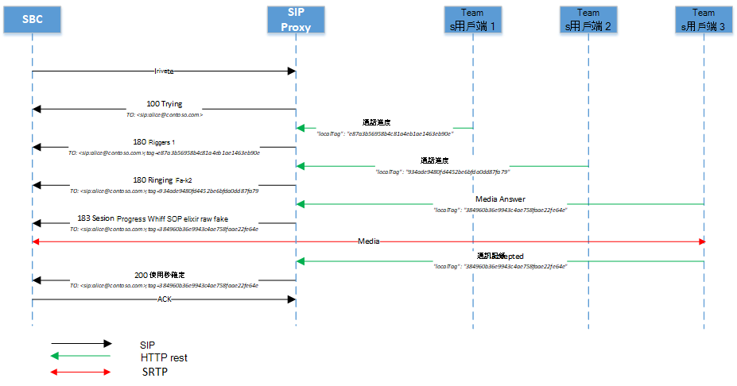
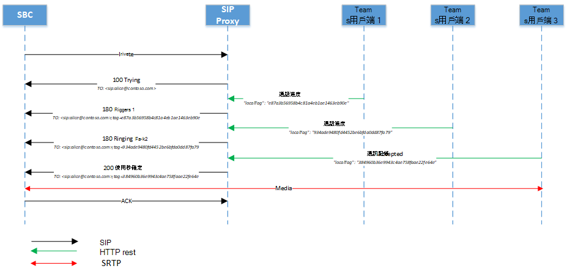
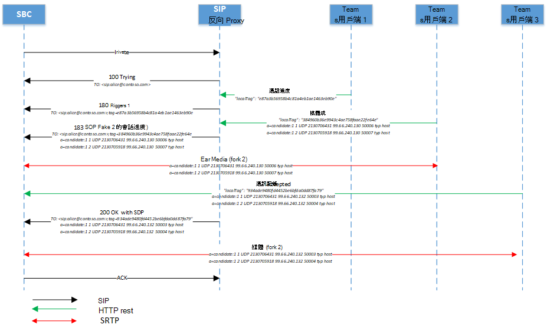

# <a name="direct-routing---sip-protocol"></a>直接路由 - SIP 通訊協定

本文將說明直接路由如何將會話初始通訊協定 (SIP) 。 若要正確路由會話邊界控制器 (SBC) SIP Proxy 之間的流量，某些 SIP 參數必須具有特定值。 本文適用于負責在內部部署 SBC 與 SIP Proxy 服務之間建立連接之語音系統管理員。

## <a name="processing-the-incoming-request-finding-the-tenant-and-user"></a>處理傳入要求：尋找租使用者和使用者

在可以處理傳入或外接通話之前，在 SIP Proxy 和 SBC 之間交換 OPTIONS 訊息。 這些選項訊息允許 SIP Proxy 提供 SBC 允許的功能。 在 200OK 回應中，選項 (很重要，) SBC 與 SIP Proxy 之間的進一步通訊，以建立通話。 選項訊息中 SIP Proxy 的 SIP 標題如下例所示：

| 參數名稱 | 值範例 | 
| :---------------------  |:---------------------- |
| Request-URI | 選項 sip：sip.pstnhub.microsoft.com：5061 SIP /2.0 |
| 透過標題 | Via：SIP/2.0/TLS sbc1.adatum.biz：5058;alias;branch=z9hG4bKac2121518978 | 
| Max-Forwards頁標題 | Max-Forwards：68 |
| 從頁頭 | 從頁頭來源： <sip:sbc1.adatum.biz:5058> |
| 至頁標題 | 自： <sip:sip.pstnhub.microsoft.com:5061> |
| CSeq 標頭 | CSeq：1 INVITE | 
| 連絡人標題 | 聯繫： <sip:sbc1.adatum.biz:50588;transport=tls> |

> [!NOTE]
> SIP 標頭在使用的 SIP URI 中不包含 userinfo。 根據 [RFC 3261，第 19.1.1](https://tools.ietf.org/html/rfc3261#section-19.1.1)節，URI 的使用者資訊部分為選擇性，當目的地主機沒有使用者的概念，或當 hosst 本身為所識別的資源時，可能會不存在。 如果 SIP URI 中出現 @ 符號，使用者欄位不能是空的。

在來電中，SIP Proxy 必須尋找該通話的目的地租使用者，並在此租使用者中尋找特定使用者。 租使用者系統管理員可能會在多個租使用者中設定非 DID 號碼，例如 +1001。 因此，尋找要執行數位尋找的特定租使用者非常重要，因為非 DID 號碼在多個組織或多個組織Microsoft 365相同Office 365相同。  

本節說明 SIP Proxy 如何尋找租使用者和使用者，以及如何在傳入連接上執行 SBC 的驗證。

以下是來電上 SIP 邀請訊息的範例：

| 參數名稱 | 值範例 | 
| :---------------------  |:---------------------- |
| Request-URI | 邀請 sip:+18338006777@sip.pstnhub.microsoft.com SIP /2.0 |
| 透過標題 | Via：SIP/2.0/TLS sbc1.adatum.biz：5058;alias;branch=z9hG4bKac2121518978 | 
| Max-Forwards頁標題 | Max-Forwards：68 |
| 從頁頭 | 從頁<：sip：+17168712781@sbc1.adatum.biz;transport=udp;tag=1c747237679 |
| 至頁標題 | 至：sip:+183338006777@sbc1.adatum.biz | 
| CSeq 標頭 | CSeq：1 INVITE | 
| 連絡人標題 | 連絡人：<sip：68712781@sbc1.adatum.biz：5058;transport=tls> | 

在收到邀請時，SIP Proxy 會執行下列步驟：

1. 檢查憑證。 在初始連接上，直接路由服務會採用連絡人標題中呈現的 FQDN 名稱，並比對到所提交憑證的公用名稱或主體替代名稱。 SBC 名稱必須與下列其中一個選項相符：

   - 選項 1. 在連絡人標題中呈現的完整 FQDN 名稱必須與所提交憑證的公用名稱/Subject Alternative 名稱相符。  

   - 選項 2. 在連絡人標題 (例如 FQDN 名稱 sbc1.adatum.biz) adatum.biz 中呈現的 FQDN 名稱的網域部分必須與 Common Name/Subject 替換名稱 (例如 *.adatum.biz) 中的萬用字元值相符。

2. 嘗試使用連絡人標題中顯示的完整 FQDN 名稱來尋找租使用者。  

   檢查連絡人標題中的 FQDN 名稱 (sbc1.adatum.biz) 註冊為任何組織或組織Microsoft 365 DNS Office 365名稱。 如果找到，使用者的尋找是在已註冊為功能變數名稱的 SBC FQDN 的租使用者中執行。 如果找不到，則適用步驟 3。   

3. 步驟 3 僅適用于步驟 2 失敗的情況。 

   移除主機部分：adatum.biz) 之後，從 FQDN 移除 FQDN 的主機部分，顯示于連絡人標題 (FQDN：sbc12.adatum.biz，並檢查此名稱是否在任何 Microsoft 365 或 Office 365 組織中註冊為 DNS 名稱。 如果找到，會在此租使用者中執行使用者查找。 如果找不到，通話會失敗。

4. 使用 Request-URI 中顯示的電話號碼，在步驟 2 或 3 找到的租使用者中執行反向號碼尋找。 在上一個步驟找到的租使用者中，將呈現的電話號碼與使用者 SIP URI 相符。

5. 使用主幹設定。 尋找租使用者系統管理員為此 SBC 所設定的參數。

   Microsoft 不支援在 Microsoft SIP Proxy 與配對 SBC 之間擁有協力廠商 SIP Proxy 或使用者代理伺服器，這可能會修改配對 SBC 所建立的要求 URI。

   本文稍後將說明 (SBC 與許多租使用者 (電信企業案例) 相互連接的情況下，兩個) 需要的步驟 2 和 3) 需求。

### <a name="detailed-requirements-for-contact-header-and-request-uri"></a>連絡人標題和 Request-URI 的詳細需求

#### <a name="contact-header"></a>連絡人標題

對於所有傳入的 SIP (OPTIONS，INVITE) 到 Microsoft SIP Proxy，連絡人標題必須在 URI 主機名稱中具有配對的 SBC FQDN，如下所示：

語法：連絡人：<sip：phone 或 sip address@FQDN sBC;transport=tls> 

根據 [RFC 3261，第 11.1](https://tools.ietf.org/html/rfc3261#section-11.1)節，連絡人標題欄位可能存在於 OPTIONS 訊息中。 在直接路由中，連絡人標題為必填項。 針對上述格式的 INVITE 郵件，對於 OPTIONS 郵件，使用者資訊可以從 SIP URI 中移除，且只能以 FQDN 格式送出，如下所示：

語法：連絡人：<sip：SBC 的 FQDN;transport=tls>

FQDN (名稱) 也必須在所提交憑證的 (或) 名稱欄位。 Microsoft 支援在憑證的 (或) 替代名稱欄位中使用名稱的萬用字元值。   

RFC [2818 第 3.1 節說明萬用字元的支援](https://tools.ietf.org/html/rfc2818#section-3.1)。 特別：

*「名稱可能包含萬用字元，視為符合任何 \* 單一功能變數名稱元件或元件片段。例如 \* ，.a.com 符合 foo.a.com，bar.foo.a.com f .com foo.com \* 而非 bar.com」。*

如果 SBC 會送出 SIP 郵件中呈現的連絡人標題中的多個值，則只會使用連絡人標題第一個值的 FQDN 部分。

根據直接路由的經驗，FQDN 必須用來填入 SIP URI，而不是 IP。 傳入的 INVITE 或 OPTIONS 訊息會以連絡人標頭表示主機名稱，而非 FQDN，因此會以 403 禁止拒絕連接。

#### <a name="request-uri"></a>Request-URI 

針對所有來電，Request-URI 會用來將電話號碼與使用者相符。   

目前電話號碼必須包含加 (+) 如下列範例所示。 

```console
INVITE sip:+18338006777@sip.pstnhub.microsoft.com SIP /2.0
```
#### <a name="from-header"></a>從頁頭

針對所有來電，使用 From 標頭來比對來電者的電話號碼與受話者封鎖的電話號碼清單。

電話號碼必須包含 +，如下列範例所示。

```console
From: <sip:+17168712781@sbc1.adatum.biz;transport=udp;tag=1c747237679
```

## <a name="contact-and-record-route-headers-considerations"></a>連絡人和Record-Route標題的考慮

SIP Proxy 需要計算新對話方塊用戶端交易的下一躍點 FQDN (例如 Bye 或重新邀請) ，以及回復 SIP 選項時。 使用連絡人Record-Route連絡人或連絡人。 

根據 [RFC 3261，第 8.1.1.8](https://tools.ietf.org/html/rfc3261#section-8.1.1.8)節，任何可能導致新對話方塊的要求都需要連絡人標題。 只有Record-Route Proxy 想要在對話方塊中繼續處理未來要求的路徑時，才需要執行此要求。 如果 Proxy SBC 與直接路由的 Local [Media 優化](./direct-routing-media-optimization.md)一起使用，則需要將記錄路由進行配置，因為 Proxy SBC 必須留在路由中。 

若未使用 Proxy SBC，Microsoft 建議只使用連絡人標題：

- 每個 [RFC 3261，第 20.30](https://tools.ietf.org/html/rfc3261#section-20.30)節 ，Record-Route 是當 Proxy 想要在對話方塊中維持未來要求的路徑時，會使用 ，如果系統未針對 Microsoft SIP Proxy 與配對 SBC 之間的所有流量進行任何 Proxy SBC 的組組，則不一定必要。 

- Microsoft SIP Proxy 只會使用連絡人標題 (而非 Record-Route) 傳送出站 ping 選項時決定下一個躍點。 若不使用 proxy SBC (，)  (連絡人和 Record-Route) 只設定一個參數，) Contact 和 Record-Route) 可簡化系統管理。 

若要計算下一個躍點，SIP Proxy 會使用：

- 優先順序 1。 頂層的 Record-Route。 如果頂層Record-Route包含 FQDN 名稱，FQDN 名稱會用來建立出站對話方塊連接。

- 優先順序 2。 連絡人標題。 如果Record-Route，SIP Proxy 會尋找連絡人標頭的值，以建立外發連接。  (這是建議的組) 

如果同時使用連絡人Record-Route，SBC 系統管理員必須保持其值相同，這會造成系統管理負荷。 

### <a name="use-of-fqdn-name-in-contact-or-record-route"></a>在連絡人或連絡人中使用 FQDN Record-Route

在連絡人或連絡人中不支援 IP 位址Record-Route使用。 唯一支援的選項是 FQDN，它必須與 SBC 憑證的公用名稱或主體替代名稱相符 (憑證中的萬用字元值) 。

- 如果在 Record-route 或 Contact 中顯示 IP 位址，憑證檢查失敗且通話失敗。

- 如果 FQDN 與所提交憑證中通用或主體替代名稱的值不相符，通話會失敗。 

## <a name="inbound-call-sip-dialog-description"></a>輸入通話：SIP 對話方塊描述

下表摘要列出非旁路和旁路模式之間的通話流程差異和相似性：

| 參數名稱 | 非旁路模式 | 旁路模式
| :---------------------  |:---------------------- |:----------------|
| 來自 183 和 200 個訊息的媒體候選人 | 媒體處理器 | 用戶端 | 
| SBC 可接收的 183 個郵件數目 | 每個會話一個 | 多個 | 
| 通話可以在 183 (暫時接聽)  | 是 | 是 |
| 通話可以在 183 (中)  | 是 | 是 |

###  <a name="non-media-bypass-flow"></a>非媒體旁路流程

Teams使用者可能同時有多個端點。 例如，Teams用戶端Windows，Teams用戶端iPhone，Teams 電話 (Teams Android 用戶端) 。 每個端點可能會發出 HTTP 的休息訊號，如下所示：

-   通話進度 - 由 SIP Proxy 轉換成 SIP 訊息 180。 收到訊息 180 時，SBC 必須產生本地響鈴。

-   媒體答案 - 由 SIP Proxy 轉換成訊息 183，在會話描述通訊協定或 SDP (媒體) 。 在收到郵件 183 時，SBC 預期會連接到 SDP 訊息中收到的媒體候選者。 

    > [!NOTE]
    > 在某些情況下，可能無法產生媒體答案，而結尾可能會以「已接受通話」訊息來接聽。

-   已接受通話 - 由 SIP Proxy 轉換成 SIP 訊息 200 與 SDP。 收到訊息 200 時，SBC 預期會傳送及接收來自提供的 SDP 候選人的媒體。

    > [!NOTE]
    > 直接路由不支援沒有 SDP (延遲優惠邀請) 。

#### <a name="multiple-endpoints-ringing-with-provisional-answer"></a>多個端點以暫發性答案響鈴

1.  在收到 SBC 的第一個邀請時，SIP Proxy 會傳送「SIP/2.0 100 嘗試」訊息，並通知所有使用者端點有關來電。 

2.  通知後，每個端點都會開始響鈴，並傳送「通話進度」訊息至 SIP Proxy。 由於使用者Teams多個結束點，SIP Proxy 可能會收到多個通話進度訊息。

3.  針對從用戶端收到的每一則通話進度訊息，SIP Proxy 會將通話進度訊息轉換為 SIP 訊息「SIP/2.0 180 嘗試」。 傳送這類郵件的間隔是由從呼叫控制器接收郵件的間隔所定義。 在下列圖表中，SIP Proxy 產生兩個 180 個郵件。 這些訊息來自使用者的兩Teams端點。 每個用戶端都有唯一的標記識別項。  每一則來自不同端點的郵件都會是一個獨立的會話 (「至」欄位中的參數「標記」將會與) 。 但端點可能不會立即產生訊息 180 並傳送訊息 183，如下圖所示。

4.  端點產生包含端點媒體候選者 IP 位址的 Media Answer 訊息後，SIP Proxy 會將收到的訊息轉換成「SIP 183 會話進度」訊息，而用戶端的 SDP 會由媒體處理器的 SDP 取代。 在下列圖表中，Fork 2 的端點已接電話。 如果主幹未受到忽略，則只有一次 183 SIP 訊息 (Ring Bot 或用戶端結束點) 。 183 可能位於現有的分叉上，或開始新的分叉。

5.  電話接受訊息會與接受通話的端點最終候選者一起送出。 通話接受訊息會轉換成 SIP 訊息 200。 

> [!div class="mx-imgBorder"]
> 

#### <a name="multiple-endpoints-ringing-without-provisional-answer"></a>多個端點在響鈴時沒有暫時的答案

1.  在收到 SBC 的第一個邀請時，SIP Proxy 會傳送「SIP/2.0 100 嘗試」訊息，並通知所有使用者端點有關來電。 

2.  通知後，每個端點都會開始響鈴，並傳送「通話進度」訊息至 SIP Proxy。 由於使用者Teams多個結束點，SIP Proxy 可能會收到多個通話進度訊息。

3.  針對從用戶端收到的每一則通話進度訊息，SIP Proxy 會將通話進度訊息轉換為 SIP 訊息「SIP/2.0 180 嘗試」。  傳送郵件的間隔是由從呼叫控制器接收郵件的間隔所定義。 下圖顯示 SIP Proxy 產生的兩則 180 則訊息，這表示使用者登入三個Teams用戶端，且每個用戶端會傳送通話進度。 每封郵件都會是個別的會話， ("To" 欄位中的參數 "tag" 與) 

4.  電話接受訊息會與接受通話的端點最終候選者一起送出。 通話接受訊息會轉換成 SIP 訊息 200。 

> [!div class="mx-imgBorder"]
> 

### <a name="media-bypass-flow"></a>媒體旁路流程

媒體旁 (100 嘗試、180、183) 相同的訊息。 

下列架構顯示旁路通話流程的範例。 

> [!NOTE]
> 媒體候選者可能來自不同的端點。 

> [!div class="mx-imgBorder"]
> 

## <a name="replaces-option"></a>取代選項

SBC 必須支援使用取代邀請。

## <a name="size-of-sdp-considerations"></a>SDP 考慮的大小

直接路由介面可能會傳送超過 1，500 位元組的 SIP 訊息。  SDP 的大小主要會導致此原因。 不過，如果 SBC 後面有 UDP 主幹，如果郵件從 Microsoft SIP Proxy 轉往未修改的主幹，它可能會拒絕該郵件。 Microsoft 建議在將郵件傳送至 UDP 主幹時，在 SBC 上剪除 SDP 中的某些值。 例如，可以移除 ICE 候選程式或未使用的編解碼器。

## <a name="call-transfer"></a>來電轉接

直接路由支援兩種來電轉接方法：

- 選項 1. SIP Proxy 程式 從用戶端本地參照，並擔任 RFC 3892 第 7.1 節所述的仲裁人。

  使用此選項，SIP Proxy 會終止傳輸並新增邀請。 


- 選項 2. SIP Proxy 會傳送參照 SBC，並做為 RFC 5589 第 6 節所述之傳輸者。

  使用此選項時，SIP Proxy 會傳送一個參照到 SBC，並預期 SBC 會完全處理傳輸。

SIP Proxy 會根據 SBC 報告的功能來選取方法。 如果 SBC 指出它支援「參照」方法，SIP Proxy 會針對來電轉接使用選項 2。

以下是 SBC 傳送支援引用方法之訊息的範例：

```console
ALLOW: INVITE, OPTIONS, INFO, BYE, CANCEL, ACK, PRACK, UPDATE, REFER, SUBSCRIBE, NOTIFY
```

如果 SBC 未指出引用為支援的方法，則直接路由會使用選項 1， (SIP Proxy 會做為仲裁) 。 SBC 也必須發出支援 Notify 方法的訊號：

表示不支援引用方法的 SBC 範例：

```console
ALLOW: INVITE, ACK, CANCEL, BYE, INFO, NOTIFY, PRACK, UPDATE, OPTIONS
```

### <a name="sip-proxy-processes-refer-from-the-client-locally-and-acts-as-a-referee"></a>SIP Proxy 程式 從用戶端本地引用，並擔任仲裁者

如果 SBC 指出不支援引用方法，SIP Proxy 會做為推薦人。 

來自用戶端的參考要求將在 SIP Proxy 上終止。  (下列圖表中，用戶端的 「轉接至 Dave」要求會顯示為「來電轉接至 Dave」。  詳細資訊，請參閱 [RFC 3892 的第 7.1 節](https://www.ietf.org/rfc/rfc3892.txt)。 

> [!div class="mx-imgBorder"]
> 

### <a name="sip-proxy-send-the-refer-to-the-sbc-and-acts-as-a-transferor"></a>SIP Proxy 會傳送參照到 SBC，並做為傳輸者

這是來電轉接的首選方法，對於尋求媒體旁路認證的裝置，這是必填項。 媒體旁路模式中不支援 SBC 無法處理引用的來電轉接。 

RFC 5589 的第 6 節說明標準。 相關的 RFC 為：

- [SIP 的會話初始 (呼叫) - 傳輸](https://tools.ietf.org/html/rfc5589)

- [SIP 中的會話初始 (協定) 取代」標頭](https://tools.ietf.org/html/rfc3891)

- [會話初始通訊協定 (SIP) 「引用者」機制](https://tools.ietf.org/html/rfc3892)

此選項會假設 SIP Proxy 會做為傳輸者，並將參考訊息傳送給 SBC。 SBC 會做為受讓人，並處理參照以產生新的移轉優惠。 有兩種可能的情況：

- 通話會轉接給外部 PSTN 參與者。 
- 通話會透過 SBC 從一位Teams轉接Teams至同一個租使用者的另一位使用者。 

如果呼叫是透過 SBC 從 Teams 使用者轉接到另一個使用者，SBC 會使用 [參考訊息中收到的資訊 (為 (使用者 Teams 使用者) 啟動新的對話方塊) 。 

若要在內部填入要求交易之 To/Transferor 欄位，SIP Proxy 需要在 REFER-TO/REFERRED-BY 標頭內傳達此資訊。 

SIP Proxy 會以 SIP URI 的形式形成 REFER-TO，包含主機名稱中的 SIP Proxy FQDN，以及下列其中一項：

- 如果傳輸目標為電話號碼，則 URI 使用者名稱部分中的 E.164 電話號碼，或

- 分別編碼完整傳輸目標 MRI 和租使用者識別碼的 x-m 和 x-t 參數 

REFERRED-BY 標頭是 SIP URI，其內編碼為傳輸器或 MRI，以及傳輸器租使用者識別碼和其他傳輸上下文參數，如下表所示：

| 參數 | 值 | 描述 |  
|:---------------------  |:---------------------- |:---------------------- |
| x-m | MRI | 由 CC 填上之傳輸器/傳輸目標的完整 MRI |
| x-t | 租用戶識別碼 | X-t 租使用者識別碼 選擇性租使用者識別碼，以 CC 填上 |
| x-ti | 傳輸器關聯識別碼 | 來電轉接者的相關識別碼 |
| x-tt | 傳輸目標通話 URI | 編碼呼叫取代 URI |

在這種情況下，參考頁眉的大小最多隻能是 400 個符號。 SBC 必須支援處理大小最多 400 個符號的參考郵件。

> [!div class="mx-imgBorder"]
> 

## <a name="session-timer"></a>會話計時器

SIP Proxy 支援 (，) 非旁路通話時提供會話計時器，但不在旁路通話時提供。 SBC 不會強制使用會話計時器。

##  <a name="use-of-request-uri-parameter-userphone"></a>Request-URI 參數 user=phone 的使用

SIP Proxy 會分析 Request-URI，如果使用者=phone 有參數存在，服務會以電話號碼處理 Request-URI，將號碼與使用者配對。 如果參數不存在，SIP Proxy 會採用啟發式來判斷 Request-URI 使用者類型 (電話號碼或 SIP 位址) 。

Microsoft 建議一直使用 user=phone 參數，以簡化通話設定程式。

## <a name="history-info-header"></a>History-Info頁標題

History-Info頁標題用於重新置放 SIP 要求，以及「提供 (s) 一種標準機制，以捕獲要求歷程記錄資訊，為網路和使用者啟用各種服務」。 詳細資訊，請參閱 [RFC 4244 – 第 1.1 節](http://www.ietf.org/rfc/rfc4244.txt)。 針對 Microsoft 電話，此標頭用於 Simulring 和來電轉接案例。  

如果傳送，History-Info啟用方式如下：

- SIP Proxy 會個別插入包含關聯電話號碼的參數，History-Info組成要History-Info PSTN 控制器的標頭。  PSTN 控制器只會使用具有電話號碼參數的項，重建新的 History-Info標題，然後透過 SIP Proxy 將它傳遞到 SIP 主幹提供者。

- History-Info同時撥打和呼叫轉譯的情況下，會新增一個標題。

- History-Info轉接案例不會新增標題。

- 重新建立之 History-Info 標題中的個別歷程記錄專案會提供電話號碼參數，並結合直接路由 FQDN (sip.pstnhub.microsoft.com) 設為 URI 的主機部分;'user=phone' 的參數會新增為 SIP URI 的一部分。  與原始頁History-Info相關的任何其他參數，除了電話上下文參數之外，都會在重新建構的 History-Info標頭中傳遞。  

  > [!NOTE]
  > RFC 4244 (3.3 中定義的機制所決定之私人專案) 將會轉轉，因為 SIP 主幹提供者是信任的對等體。

- 內History-Info會被忽略。

以下是 SIP Proxy 所送出之歷程記錄資訊標題的格式：

```console
<sip:UserB@sip.pstnhub.microsoft.com?Privacy=history&Reason=SIP%3B\cause%3D486>;index=1.2,
```

如果呼叫已重新導向數次，每個重新導向的資訊會以時間順序包含適當的原因。


標題範例：

```console
History-info: 
<sip:+14257123456@sip.pstnhub.microsoft.com;user=phone?Reason=SIP;cause=302;text=”Move Temporarily”>;index=1
<sip:+14257123457@sip.pstnhub.microsoft.com;user=phone?Reason=SIP;cause=496;text=”User Busy”>;index=1.1
```

系統History-Info受強制 TLS 機制保護。 

## <a name="sbc-connection-to-direct-routing-and-failover-mechanism"></a>直接路由和容錯移轉機制的 SBC 連接

請參閱直接路由規劃中的 SIP 信令容錯移轉 [機制一節](direct-routing-plan.md#failover-mechanism-for-sip-signaling)。

## <a name="retry-after"></a>Retry-After

如果直接路由資料中心忙碌，服務可以傳送一Retry-After一秒間隔的訊息給 SBC。 當 SBC 收到 503 郵件時，Retry-After標題回應 INVITE 時，SBC 必須終止該連接，並嘗試下一個可用的 Microsoft 資料中心。

## <a name="handling-retries-603-response"></a>處理 603 回應 (重試) 
如果使用者在拒絕來電後，發現一個通話數次未接來電，這表示 SBC 或 PSTN 主幹提供者的重試機制配置錯誤。 必須重新配置 SBC，以停止 603 回應上的重試作業。

## <a name="ice-restart-media-bypass-call-transferred-to-an-endpoint-that-does-not-support-media-bypass"></a>ICE 重新開機：轉接到不支援媒體旁路的端點的媒體旁路通話

SBC 必須支援 [RFC 5245 第 9.1.1.1](https://tools.ietf.org/html/rfc5245#section-9.1.1.1)節中所述的 ICE 重新開機。

直接路由中的重新開機會根據 RFC 的下列段落進行：

*若要重新開機 ICE，代理人必須同時變更優惠中媒體流的冰層和冰-ufrag。 請注意，在一個優惠中允許使用工作階段層級屬性，但提供與後續優惠中媒體層級屬性相同的 ice-pwd 或 ice-ufrag。 這不是密碼的變更，只是其表示方式的變更，而且不會造成 ICE 重新開機。*

*代理程式會設定此媒體流 SDP 中其餘的欄位，就像初次提供此媒體流時一樣 (請參閱第 4.3 節) 。 因此，一組候選者可能包含部分、無或所有先前該流程的候選者，而 MAY 則包含第 4.1.1 節所述收集的一組全新的候選人。*

如果通話一開始是使用媒體旁路建立，而通話已轉接至 商務用 Skype 用戶端，則直接路由需要插入媒體處理器，這是因為直接路由無法與具有媒體旁通的 商務用 Skype 用戶端一起使用。 直接路由會變更 ice-pwd 和 ice-ufrag，並再次提供新的媒體候選項目，以啟動 ICE 重新開機程式。
