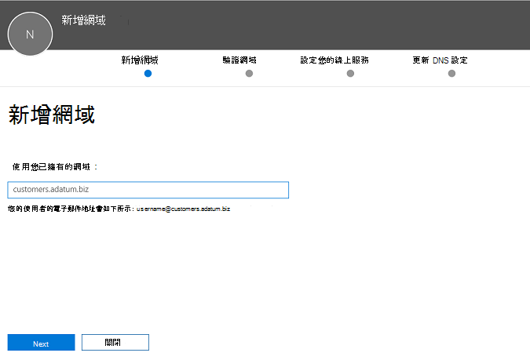
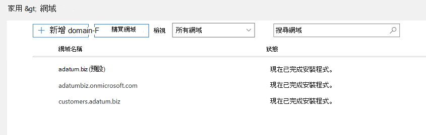
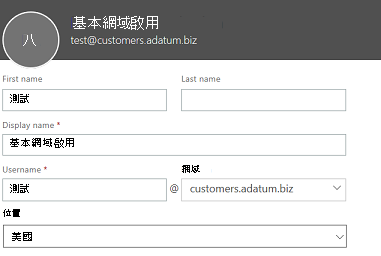
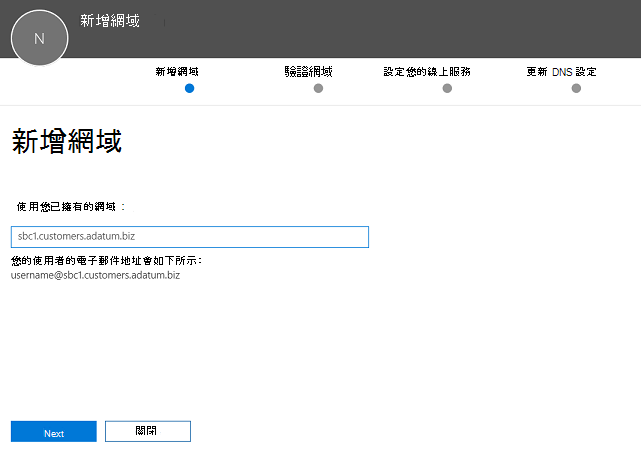
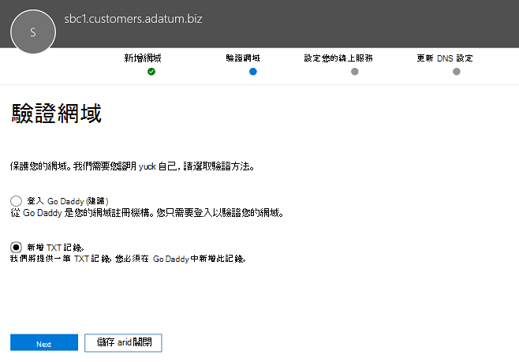
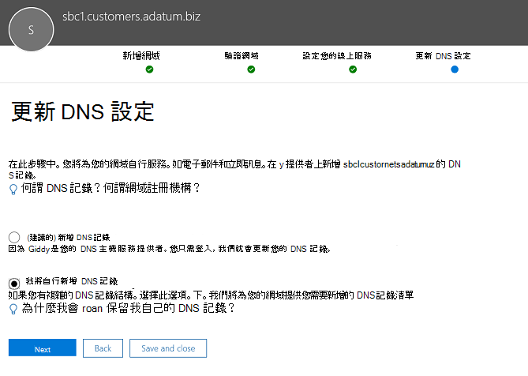
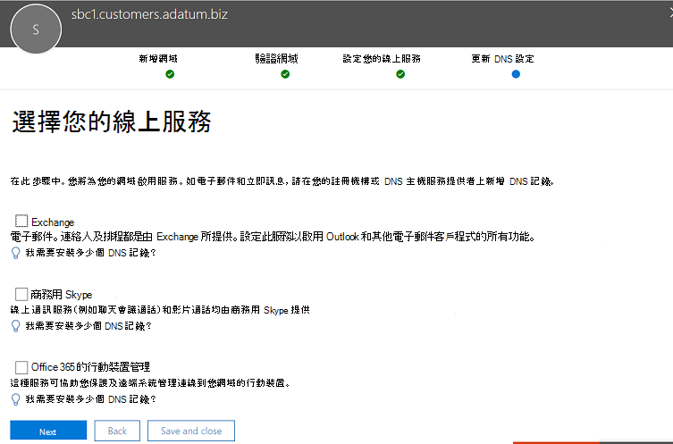
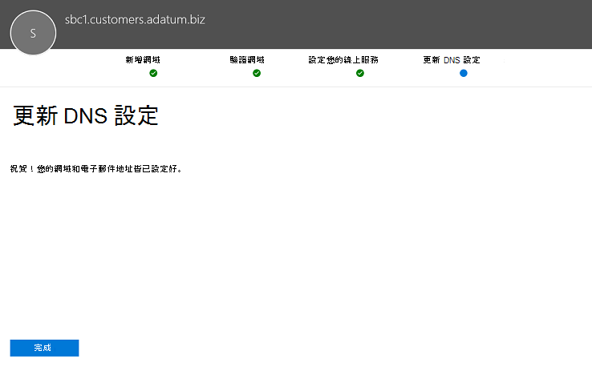
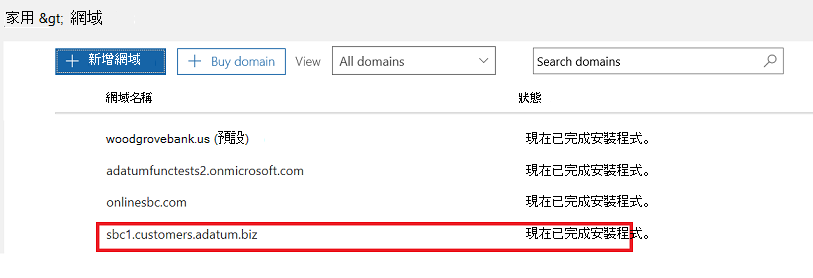
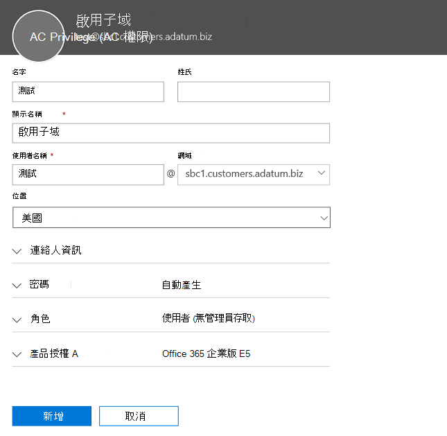

# 設定多個租用戶的工作階段邊界控制器

直接路由支援將一個會話邊界控制器 (SBC) 服務多個租使用者。

> [!NOTE]
> 此案例專為 Microsoft 合作夥伴和/或 PSTN 電信公司所設計，本文稍後稱為電信公司。 電信業者會銷售傳送給客戶Microsoft Teams電話語音。 

電信公司：
- 在資料中心部署及管理 SBC (客戶不需要執行 SBC，而且他們會收到來自電信業者的電話語音，Teams用戶端) 。
- 將 SBC 與多個租使用者相互連接。
- 為客戶提供 PSTN 服務。
- 管理電話品質端對端。
- PSTN 服務另行收費。

Microsoft 不會管理電信公司。 Microsoft 提供 PBX (Microsoft 電話 System) 和 Teams用戶端。 Microsoft 也會認證電話，並認證 SBCs 可與 Microsoft 電話 系統一Microsoft 電話使用。 選擇電信業者之前，請確定您的選擇具有經過認證的 SBC，並可以端對端管理語音品質。

以下是設定案例的技術實現步驟。

**僅適用于電信公司：**
1. 部署 SBC，然後根據認證 SBC 廠商的指示，針對託管案例[設定 SBC。](#deploy-and-configure-the-sbc)
2. 在電信業者租使用者中註冊基本功能變數名稱，並索取萬用字元憑證。
3. 針對每個客戶註冊子域，這是基本網域的一部分。

**具有客戶全域系統管理員的電信公司：**
1. 將子功能變數名稱稱新增到客戶租使用者。
2. 啟用子功能變數名稱稱。
3. 設定從電信電信企業到客戶租使用者之間的主幹，並設定使用者。

*請確定您瞭解 DNS 基本功能，以及功能變數名稱在 Microsoft 365 或 Office 365。在 [繼續進行之前，請Microsoft 365取得Office 365網](https://support.office.com/article/Get-help-with-Office-365-domains-28343f3a-dcee-41b6-9b97-5b0f4999b7ef)域的協助。*

## 部署及設定 SBC

如需如何針對 SBC 主機案例部署及設定 SBC 的詳細步驟，請參閱 SBC 廠商的檔。

- **音訊代碼：**[直接路由組](https://www.audiocodes.com/solutions-products/products/products-for-microsoft-365/direct-routing-for-Microsoft-Teams)附注，SBC 主機案例的組式描述為「將 AudioCodes SBC 連接到 Microsoft Teams路由主機管理模型組Microsoft Teams說明」。 
- **Oracle：**[直接路由群組原則附注](https://www.oracle.com/technetwork/indexes/documentation/acme-packet-2228107.html)，SBC 主機案例的組塊會于「Microsoft」一節中說明。 
- **功能區通訊：** 請參閱功能區通訊 [SBC 核心 Microsoft Teams](https://support.sonus.net/display/IOT/PBXs+-+SBC+5k7kSWe)組組指南，以瞭解如何設定功能區核心系列 SBC 的檔，並參閱此頁面功能區最佳做法 - 為 Microsoft Teams 直接路由 [SBC Edge 設定](https://support.sonus.net/display/UXDOC81/Connect+SBC+Edge+to+Microsoft+Teams+Direct+Routing+to+Support+Direct+Routing+Carrier)電信業者
- **TE-Systems (anynode) ：** 請在 [TE-Systems](https://community.te-systems.de/) Community頁面上註冊，以瞭解如何為多個租使用者設定 anynode SBC 的檔和範例。
- **Metaswitch：** 請在 [Metaswitch](https://manuals.metaswitch.com/MAN39555) Community頁面上註冊，以瞭解如何為多個租使用者啟用 Perimeta SBC 的檔。

> [!NOTE]
> 請注意如何設定「連絡人」標題。 連絡人標題是用來在傳入的邀請訊息上尋找客戶租使用者。 

## 註冊基本網域和子域

針對託管案例，您需要建立：
- 電信業者擁有的一個基礎功能變數名稱。
- 這是每個客戶租使用者中基本功能變數名稱的一部分子域。

在下列範例中：
- Adatum 是一家電信業者，提供網際網路和電話語音，為數個客戶提供服務。
- Woodgrove Bank、Contoso 和 Adventure Works 是三個擁有或Microsoft 365網域Office 365但從 Adatum 接收電話語音的客戶。

子域 **必須** 符合將為客戶所配置的主幹 FQDN 名稱，以及傳送邀請給連絡人或連絡人時，連絡人標題中的 FQDN Microsoft 365或Office 365。 

當通話抵達 Microsoft 365或Office 365路由介面時，介面會使用連絡人標頭來尋找應該要尋找使用者的租使用者。 直接路由不會在邀請上使用電話號碼尋找功能，因為有些客戶可能擁有非 DID 號碼，可能會與多個租使用者重迭。 因此，必須輸入連絡人標題中的 FQDN 名稱，才能識別確切的租使用者，才能根據電話號碼來查看使用者。

*如需在 [組織](https://support.office.com/article/Get-help-with-Office-365-domains-28343f3a-dcee-41b6-9b97-5b0f4999b7ef)或Office 365中建立功能變數名稱Microsoft 365取得Office 365協助。*

下圖摘要說明基本網域、子域和連絡人標題的需求。

SBC 需要憑證來驗證連接。 對於 SBC 主機案例，電信業者需要要求具有 CN 和/或 SAN .base_domain (的憑證，例如 *\* \* .customers.adatum.biz) 。* 此憑證可用來驗證從單一 SBC 送達多個租使用者的連接。

下表是一組配置的範例。

|新功能變數名稱 |類型|註冊  |SBC 的憑證 CN/SAN  |範例中的租使用者預設網域  |將通話傳送給使用者時，SBC 必須在連絡人標題中顯示 FQDN 名稱|
|---------|---------|---------|---------|---------|---------|
|customers.adatum.biz|    基地     |     在電信租使用者中  |    \*.customers.adatum.biz  |   adatum.biz      |NA，這是服務租使用者，沒有使用者 |
|sbc1.customers.adatum.biz|    子域  |    在客戶租使用者中  |    \*.customers.adatum.biz  | woodgrovebank.us  |  sbc1.customers.adatum.biz|
|sbc2.customers.adatum.biz  |   子域 | 在客戶租使用者中   |   \*.customers.adatum.biz   |contoso.com   |sbc2.customers.adatum.biz |
|sbc3.customers.adatum.biz |   子域 | 在客戶租使用者中 |   \*.customers.adatum.biz  |  adventureworks.com | sbc3.customers.adatum.biz |
||         |         |         |         |         |

若要設定基本和子域，請按照下列步驟進行。 在範例中，我們將在 Woodgrove Bank 租使用者 (customers.adatum.biz) 中設定基本功能變數名稱和 (sbc1.customers.adatum.biz 子域) 。

> [!NOTE]
> 使用 sbcX.customers.adatum.biz 在電信租使用者中啟用語音。 sbcX 可以是任何唯一且有效的 Alphanumeric hostname。

## 在電信公司租使用者中註冊基本功能變數名稱

**這些動作是在電信租使用者中執行。**

### 確定您擁有電信租使用者的適當許可權

如果您以全域系統管理員的Microsoft 365 系統管理中心，才能新增網域。 

若要驗證您擁有的角色，請Microsoft 365 系統管理中心 (，前往使用者作用中使用者，然後確認您具有全域 https://portal.office.com)   >  系統管理員角色。 

有關系統管理員角色以及如何在管理員角色或Microsoft 365指派Office 365，請參閱關於[系統管理員角色](https://support.office.com/article/About-Office-365-admin-roles-da585eea-f576-4f55-a1e0-87090b6aaa9d)。

### 新增基本網域至租使用者並驗證

1. 在 Microsoft 365 系統管理中心，請前往 **設定**  >  **網域**  >  **新增網域**。
2. 在輸入 **您擁有之網域的** 方塊中，輸入基本網域的 FQDN。 在下列範例中，基本網域 *customers.adatum.biz。*

    

3. 按一下 **[下一步**。
4. 在範例中，租使用者已經 adatum.biz 驗證功能變數名稱。 精靈不會要求其他驗證，因為 customers.adatum.biz 是已註冊名稱的子域。 不過，如果您新增之前尚未驗證的 FQDN，您必須完成驗證程式。 驗證程式如下 [所述](#add-a-subdomain-to-the-customer-tenant-and-verify-it)。

    

5. 按一下 **[下** 一步設定更新 **DNS** 記錄頁面，選取 [我要自己新增 **DNS** 記錄，然後按一下 [下 **一步**。
6. 在下一頁中，清除所有值 (，除非您要使用 Exchange、SharePoint 或 Teams/商務用 Skype) 的功能變數名稱，請按一下 [下一步，然後按一下 [**完成**> 。  請確定您的新網域已達設定完成狀態。

    

### 啟用功能變數名稱

註冊功能變數名稱之後，您必須新增至少一個擁有 電話系統 授權的使用者，並指派 SIP 位址與已建立基本網域相符合之 SIP 位址的 FQDN 部分，以啟用該功能變數名稱。

> [!NOTE]
> 電信公司租使用者必須保留至少一電話系統指派給租使用者授權，以避免移除商務用 Skype組。 

*如需在組織Microsoft 365 [或](https://support.office.com/article/Get-help-with-Office-365-domains-28343f3a-dcee-41b6-9b97-5b0f4999b7ef)Office 365中新增使用者Microsoft 365或Office 365取得協助。*

例如：test@customers.adatum.biz

## 在客戶租使用者中註冊子功能變數名稱稱

您必須為每個客戶建立唯一的子功能變數名稱稱。 在此範例中，我們將在租使用者中 sbc1.customers.adatum.biz 預設功能變數名稱的子域 woodgrovebank.us。

**下列所有動作都位在客戶租使用者中。**

### 確定您擁有客戶租使用者的適當許可權

如果您以全域系統管理員的Microsoft 365 系統管理中心，才能新增網域。 

若要驗證您擁有的角色，請Microsoft 365 系統管理中心 (，前往使用者作用中使用者，然後確認您具有全域 https://portal.office.com)   >  系統管理員角色。 

有關系統管理員角色以及如何在管理員角色或Microsoft 365指派Office 365，請參閱關於[系統管理員角色](https://support.office.com/article/About-Office-365-admin-roles-da585eea-f576-4f55-a1e0-87090b6aaa9d)。

### 新增子域至客戶租使用者並驗證
1. 在 Microsoft 365 系統管理中心，請前往 **設定**  >  **網域**  >  **新增網域**。
2. 在輸入 **您擁有之網域的** 方塊中，輸入此租使用者子域的 FQDN。 在下列範例中，子域 sbc1.customers.adatum.biz。

    

3. 按一下 **[下一步**。
4. FQDN 從未在租使用者中註冊。 在下一個步驟中，您必須驗證網域。 請 **改為選取新增 TXT 記錄**。 

    

5. 按一下 **[下** 一步，並記下產生的 TXT 值以驗證功能變數名稱。

    

6. 使用電信公司 DNS 主機服務提供者中上一個步驟的值建立 TXT 記錄。

    

    若要詳細資訊，請參閱在任何 [DNS](https://support.office.com/article/create-dns-records-at-any-dns-hosting-provider-for-office-365-7b7b075d-79f9-4e37-8a9e-fb60c1d95166)主機服務提供者建立 DNS 記錄。

7. 返回客戶的帳戶，Microsoft 365 系統管理中心 [**驗證**> 。 
8. 在下一頁中，選取 **[我要自己新增 DNS 記錄** ，然後按一下 [下 **一步**> 。

    

9. 在 [ **選擇您的線上服務** > 頁面上，清除所有選項，然後按一下 [ **下一步**。

    

10. 按一下 **[更新** **DNS 設定> 頁面上的 [完成** 。

    

11. 請確保狀態為完成 **設定**。 
    
    
    
> [!NOTE]
> 個別用戶端的基本 URL 和子域必須位於同一個租使用者上，才能新增 _直接路由_ 主幹。

### 啟用子功能變數名稱稱

註冊功能變數名稱之後，您必須新增至少一個使用者，並指派 SIP 位址與客戶租使用者中已建立子域符合之 SIP 位址的 FQDN 部分來啟用功能變數名稱。 

*如需在組織Microsoft 365 [或](https://support.office.com/article/Get-help-with-Office-365-domains-28343f3a-dcee-41b6-9b97-5b0f4999b7ef)Office 365中新增使用者Microsoft 365或Office 365取得協助。*

例如：test@sbc1.customers.adatum.biz

### 建立主幹並配置使用者

隨著直接路由的初次發行，Microsoft 需要使用 New-CSOnlinePSTNGateway 將主幹新 (每個服務租使用者) 租使用者。

不過，有兩個原因並未證明這是最佳結果：
 
- **間接費用管理**。 例如，卸載或排空 SBC 會變更一些參數，例如啟用或停用媒體旁路。 變更埠需要變更多個租使用者 (Set-CSOnlinePSTNGateway) ，但實際上它是相同的 SBC。 

-  **負荷處理**。 收集及監控主幹健康情況資料 - 從多個邏輯主幹收集的 SIP 選項，實際上，相同的 SBC 和相同的實體主幹，會降低路由資料的處理速度。
 
根據這項意見，Microsoft 正在引進新的邏輯，以為客戶租使用者配置主幹。

引進了兩個新實體：
-    使用命令 New-CSOnlinePSTNGateway 在電信租使用者中註冊的電信母線，例如 New-CSOnlinePSTNGateway -FQDN customers.adatum.biz -SIPSignalingport 5068 -ForwardPAI $true。

-    不需要註冊的衍生主幹。 它只是從電信母線新增到所需的主機名稱稱。 它會從電信母線衍生出其所有設定參數。 衍生主幹不需要在 PowerShell 中建立，而與電信業者主幹的關聯是以 FQDN 名稱為基礎 (請參閱下方) 。

**置備邏輯和範例**

-    電信公司只需要使用 (命令，在電信) 中設定和管理單一Set-CSOnlinePSTNGateway主幹。 在上方範例中，這是 adatum.biz;
-    在客戶租使用者中，電信公司只需要將衍生主幹 FQDN 新加到使用者的語音路由策略。 不需要執行主幹New-CSOnlinePSTNGateway程式。
-    如名稱所示，衍生主幹會繼承或衍生電信母線的所有組組參數。 例子：
-    Customers.adatum.biz – 需要在電信租使用者中建立電信母線。
-    Sbc1.customers.adatum.biz – 客戶租使用者中的衍生主幹，不需要在 PowerShell 中建立。  您可以直接在線上語音路由策略的客戶租使用者中新增衍生主幹的名稱，而不必建立。
-   電信公司必須設定 DNS 記錄，將衍生主幹 FQDN 解析為電信公司 SBC IP 位址。

-    在電信 (租使用者) 上進行的任何變更都會自動適用于衍生的主幹。 例如，電信公司可以變更電信母線上的 SIP 埠，而這項變更會適用于所有衍生的主幹。 設定主幹的新邏輯簡化了管理，因為您不需要前往每個租使用者並變更每個主幹上的參數。
-    選項只會送到電信母線 FQDN。 電信母線的健康狀態會適用于所有衍生主幹，並用於路由決策。 進一瞭解直接 [路由選項](./direct-routing-monitor-and-troubleshoot.md)。
-    電信母線可以排空電信母線，而所有衍生的主幹也會排空。 
 
> [!NOTE]
> 在電信母線上所適用之數位翻譯規則不適用於衍生主幹。 這是已知問題。 作為替代解決方案，必須為每個客戶的租使用者建立數位翻譯規則。

**從上一個模型移往電信母線**
 
若要從目前由電信主機託管模型執行移向新模型，電信公司必須為客戶租使用者重新配置主幹。 從客戶租使用者移除主幹，Remove-CSOnlinePSTNGateway (將主幹留在電信租使用者) -

我們強烈建議您儘快移移至新解決方案，因為我們會使用電信母線和衍生主幹模型加強監控與部署。
 

請參閱 [SBC 廠商](#deploy-and-configure-the-sbc) 有關在連絡人標題中傳送子域 FQDN 名稱的指示。

## 設定多租使用者容錯移轉的考慮 

若要設定多租使用者環境的容錯移轉，您必須執行下列操作：

- 針對每個租使用者，為兩個不同的 SBC 新增 FQDNs。  例如：

   customer1.sbc1.contoso.com  
   customer1.sbc2.contoso.com  

- 在使用者的線上語音路由規則中，指定兩個 SBC。  如果其中一個 SBC 失敗，路由策略會路由呼叫至第二個 SBC。

## 另請參閱

[規劃直接路由](direct-routing-plan.md)

[設定直接路由](direct-routing-configure.md)
