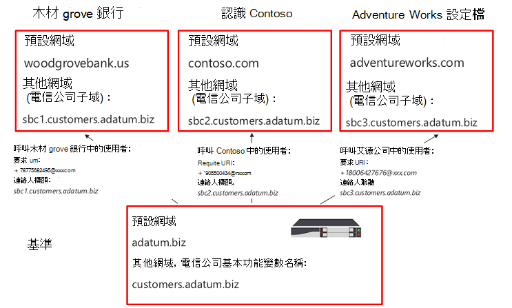
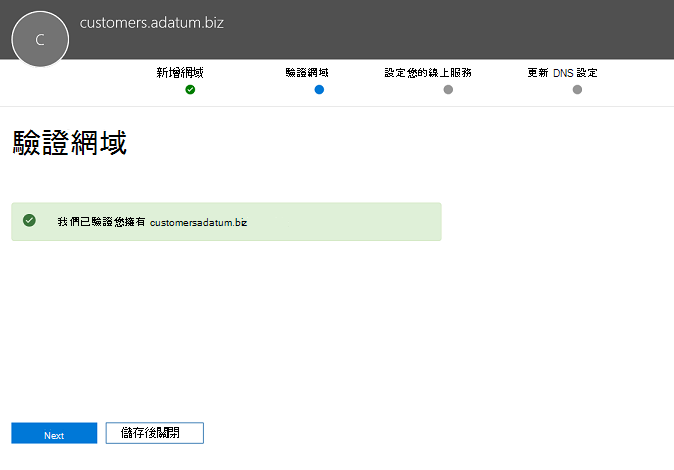
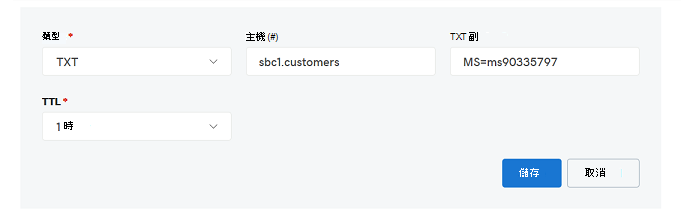

# 設定多個租用戶的工作階段邊界控制器

直接路由支援設定一個會話邊界控制器（SBC）來提供多個租使用者。

> [!NOTE]
> 這個案例是針對 Microsoft 合作夥伴和/或 PSTN 運營商所設計，在本檔的稍後部分稱為運營商。 運營商將提供給 Microsoft 團隊的電話語音出售給客戶。 

運營商：
- 在其資料中心中部署和管理 SBC （客戶不需要實施 SBC，而且會從團隊用戶端的載波接收電話語音）。
- 將 SBC 互連至多個租使用者。
- 提供 PSTN 服務給客戶。
- 管理 [通話品質結束]。
- 針對 PSTN 服務分別收取費用。

Microsoft 不會管理運營商。 Microsoft 提供 PBX （Microsoft 手機系統）與團隊用戶端。 Microsoft 也會認證手機，並證實可搭配 Microsoft Phone 系統使用的 SBCs。 選擇運營商前，請確定您的選擇有認證的 SBC，且可管理語音品質端到端。

以下是設定案例的技術實施步驟。

**僅限運營商：**
1. 根據[認證的 sbc 廠商指示](#deploy-and-configure-the-sbc)，部署 SBC 並針對主機案例進行設定。
2. 在電信公司租使用者中註冊基礎功能變數名稱，並要求萬用字元憑證。
3. 針對每個客戶註冊子域，這是基本網域的一部分。

**有客戶全域系統管理員的電信公司：**
1. 將子功能變數名稱稱新增至客戶租使用者。
2. 啟用 [子功能變數名稱]。
3. 將載波的主幹設定為客戶租使用者並提供使用者。

*請務必瞭解 DNS 的基本概念，以及功能變數名稱在 Office 365 中的管理方式。繼續進行之前，請先參閱[取得 Office 365 網域的](https://support.office.com/article/Get-help-with-Office-365-domains-28343f3a-dcee-41b6-9b97-5b0f4999b7ef)說明。*

## 部署並設定 SBC

如需如何針對 SBC 主機案例部署和設定 SBCs 的詳細步驟，請參閱 SBC 供應商的檔。

- **AudioCodes：** [直接路由設定筆記](https://www.audiocodes.com/solutions-products/products/products-for-microsoft-365/direct-routing-for-Microsoft-Teams)，在「將 AudioCodes SBC 連線至 Microsoft 團隊直接路由託管模型配置記事」中所述的 SBC 主機案例設定。 
- **Oracle：** [直接路由設定筆記](https://www.oracle.com/technetwork/indexes/documentation/acme-packet-2228107.html)，在「Microsoft」一節中將說明 SBC 主機案例的設定。 
- **功能區通訊：** 請參閱[功能區通訊 SBC 核心 Microsoft 團隊配置指南](https://support.sonus.net/display/IOT/PBXs+-+SBC+5k7kSWe)，瞭解如何設定功能區核心數列的 SBCs 與此頁面[功能區最佳做法-為 Microsoft 團隊直接路由 SBC 邊緣配置電信公司](https://support.sonus.net/display/UXDOC70/Best+Practice+-+Configuring+Carriers+for+Microsoft+Teams+Direct+Routing)
- **TE-系統（anynode）：** 請在[TE 系統社區頁面](https://community.te-systems.de/)上登錄，以取得有關如何針對多個租使用者設定 anynode SBC 的檔和範例。

> [!NOTE]
> 請務必注意如何設定「連絡人」標題。 連絡人標題是用來在傳入邀請訊息上尋找客戶租使用者。 

## 註冊基底網域和子域

針對託管案例，您需要建立：
- 載波所擁有的一個基底網功能變數名稱。
- 在每個客戶租使用者中，屬於基礎網功能變數名稱稱的子域。

在下列範例中：
- Adatum 是一種提供網際網路和電話語音的運營商，可為多個客戶提供服務。
- Woodgrove 銀行、Contoso 和艾德公司都是三個擁有 Office 365 網域的客戶，但卻從 Adatum 接收電話語音。

在將邀請傳送給 Office 365 時，子域**必須**符合將針對客戶設定的主幹的 FQDN 名稱和連絡人標題中的 fqdn。 

當來電到達 Office 365 Direct 路由介面時，介面會使用連絡人標題尋找使用者應該在其中進行查閱的租使用者。 [直接傳送] 不會在邀請中使用電話號碼查閱，因為有些客戶可能有不需要在數個租使用者中重迭的號碼。 因此，連絡人標頭中的 FQDN 名稱是必要的，以識別確切的租使用者，以便透過電話號碼查閱使用者。

*如需在 Office 365 租使用者中建立功能變數名稱的詳細資訊，請參閱[取得 office 365 網域的協助](https://support.office.com/article/Get-help-with-Office-365-domains-28343f3a-dcee-41b6-9b97-5b0f4999b7ef)。*

下圖摘要說明基本網域、子域和連絡人標頭的需求。

SBC 需要認證，才能驗證連線。 針對 SBC 主機案例，電信公司需要使用* \*base_domain （例如\*customers.adatum.biz）* 要求證書。 這個憑證可以用來驗證從單一 SBC 提供的多個租使用者的連線。

下表是一個配置的範例。

|新的功能變數名稱 |類型|已  |SBC 的憑證 SAN  |範例中的租使用者預設網域  |在傳送來電給使用者時，SBC 必須在連絡人標題中出現的 FQDN 名稱|
|---------|---------|---------|---------|---------|---------|
|customers.adatum.biz|    基本     |     在承運人租使用者  |    \*. customers.adatum.biz  |   adatum.biz      |NA，這是服務租使用者，不含使用者 |
|sbc1.customers.adatum.biz|    功能變數名稱  |    在客戶租使用者  |    \*. customers.adatum.biz  | woodgrovebank.us  |  sbc1.customers.adatum.biz|
|sbc2.customers.adatum.biz  |   功能變數名稱 | 在客戶租使用者   |   \*. customers.adatum.biz   |contoso.com   |sbc2.customers.adatum.biz |
|sbc3.customers.adatum.biz |   功能變數名稱 | 在客戶租使用者 |   \*. customers.adatum.biz  |  adventureworks.com | sbc3.customers.adatum.biz |
||         |         |         |         |         |

若要設定基與子域，請依照下列步驟進行。 在這個範例中，我們將為一個客戶（Woodgrove 銀行租使用者的 sbc1.customers.adatum.biz）設定基礎網功能變數名稱稱（customers.adatum.biz）和子域。

> [!NOTE]
> 使用 sbcX.customers.adatum.biz 在承運人租使用者中啟用語音。

## 在電信公司租使用者中註冊基底網功能變數名稱稱

**這些動作會在承運人租使用者中執行。**

### 確定您在承運人租使用者中擁有適當的許可權

如果您是以全域系統管理員身分登入 Microsoft 365 系統管理中心，您就只能新增網域。 

若要驗證您擁有的角色，請登入 Microsoft 365https://portal.office.com)系統管理中心（請移至 [**使用者** > 作用中的**使用者**]，然後確認您擁有全域系統管理員角色。 

如需管理員角色以及如何在 Office 365 中指派角色的詳細資訊，請參閱[關於 office 365 系統管理員角色](https://support.office.com/article/About-Office-365-admin-roles-da585eea-f576-4f55-a1e0-87090b6aaa9d)。

### 新增基底網域至租使用者並驗證

1.  在 Microsoft 365 系統管理中心中，移至**設定** > **網域** > [**新增網域**]。
2.  在 [**輸入您擁有的網域**] 方塊中，輸入基底網域的 FQDN。 在下列範例中，基底網域是*customers.adatum.biz*。

    ![顯示 [新增網域] 頁面的螢幕擷取畫面](media/direct-routing-2-sbc-add-domain.png)

3. 按一下 **[下一步]**。
4. 在這個範例中，租使用者已將 adatum.biz 做為已驗證的功能變數名稱。 因為 customers.adatum.biz 是已註冊名稱的子域，所以此嚮導不會要求您額外驗證。 不過，如果您在之前新增一個尚未驗證的 FQDN，您將需要完成驗證程式。 驗證的程式[如下所述](#add-a-subdomain-to-the-customer-tenant-and-verify-it)。

    

5.  按一下 **[下一步]**，然後在 [**更新 DNS 設定**] 頁面上，選取 [**我將自行新增 DNS 記錄**]，然後按 **[下一步**
6.  在下一頁上，清除所有值（除非您想要將功能變數名稱用於 Exchange、SharePoint 或團隊/商務用 Skype），請按 **[下一步**]，然後按一下 **[完成**]。 請確定您的新網域處於 [設定完成] 狀態。

    ![顯示已完成 [設定] 狀態之網域的螢幕擷取畫面](media/direct-routing-14-sbc-setup-complete.png)

### 啟動功能變數名稱

在您註冊功能變數名稱之後，您必須加入至少一個 E1、E3 或 E5 授權的使用者，並將 SIP 位址指定為與建立的基礎網域相符的 SIP 位址的 FQDN 部分來啟動。 

*如需在 Office 365 租使用者中新增使用者的詳細資訊，請參閱[取得 office 365 網域的協助](https://support.office.com/article/Get-help-with-Office-365-domains-28343f3a-dcee-41b6-9b97-5b0f4999b7ef)。*

例如： test@customers.adatum.biz

![[基本網域啟用] 頁面的螢幕擷取畫面](media/direct-routing-4-sbc-domain-activation.png)

## 在客戶租使用者中註冊子功能變數名稱稱

您將需要為每個客戶建立唯一的子功能變數名稱稱。 在這個範例中，我們將會在租使用者中使用預設功能變數名稱 woodgrovebank.us 建立子域 sbc1.customers.adatum.biz。

**下列所有行動都屬於客戶租使用者。**

### 確定您在客戶租使用者中擁有適當的許可權

如果您是以全域系統管理員身分登入 Microsoft 365 系統管理中心，您就只能新增網域。 

若要驗證您擁有的角色，請登入 Microsoft 365https://portal.office.com)系統管理中心（請移至 [**使用者** > 作用中的**使用者**]，然後確認您擁有全域系統管理員角色。 

如需管理員角色以及如何在 Office 365 中指派角色的詳細資訊，請參閱[關於 office 365 系統管理員角色](https://support.office.com/article/About-Office-365-admin-roles-da585eea-f576-4f55-a1e0-87090b6aaa9d)。

### 將子域新增至客戶租使用者並進行驗證
1. 在 Microsoft 365 系統管理中心中，移至**設定** > **網域** > [**新增網域**]。
2. 在 [**輸入您擁有的網域**] 方塊中，輸入此租使用者的子域 FQDN。 在下列範例中，子域是 sbc1.customers.adatum.biz。

    ![[新增網域] 頁面的螢幕擷取畫面](media/direct-routing-5-sbc-add-customer-domain.png)

3. 按一下 **[下一步]**。
4. FQDN 從未在租使用者中註冊。 在下一個步驟中，您將需要驗證網域。 選取 [**新增 TXT 記錄**]。 

    ![[驗證網域] 頁面的螢幕擷取畫面](media/direct-routing-6-sbc-verify-customer-domain.png)

5. 按一下 **[下一步]**，並記下產生的 TXT 值以驗證功能變數名稱。

    ![[驗證網域] 頁面上文字記錄的螢幕擷取畫面](media/direct-routing-7-sbc-verify-domain-txt.png)

6. 在電信公司的 DNS 主機服務提供者中，使用上一個步驟中的值來建立 TXT 記錄。

    

    如需詳細資訊，請參閱[在任何 dns 主機服務提供者處建立適用于 Office 365 的 dns 記錄](https://support.office.com/article/create-dns-records-at-any-dns-hosting-provider-for-office-365-7b7b075d-79f9-4e37-8a9e-fb60c1d95166)。

7. 回到客戶的 Microsoft 365 系統管理中心，然後按一下 [**驗證**]。 
8. 在下一頁上，選取 [**我將自行新增 DNS 記錄**]，然後按 **[下一步]**。

    ![[更新 DNS 設定] 頁面上選項的螢幕擷取畫面](media/direct-routing-9-sbc-update-dns.png)

9. 在 [**選擇您的線上服務**] 頁面上，清除所有選項，然後按 **[下一步]**。

    ![[選擇您的線上服務] 頁面的螢幕擷取畫面](media/direct-routing-10-sbc-choose-services.png)

10. 按一下 [**更新 DNS 設定**] 頁面上的 **[完成]** 。

    ![[更新 DNS 設定] 頁面的螢幕擷取畫面](media/direct-routing-11-sbc-update-dns-finish.png)

11. 確定狀態為 [**設定完成**]。 
    
    ![顯示 [設定完成] 狀態之頁面的螢幕擷取畫面](media/direct-routing-12-sbc-setup-complete.png)

### 啟動子功能變數名稱稱

在您註冊功能變數名稱之後，您必須至少新增一個使用者，然後使用與客戶租使用者中建立的子域相符之 SIP 位址的 FQDN 部分來啟動該功能變數名稱。

*如需在 Office 365 租使用者中新增使用者的詳細資訊，請參閱[取得 office 365 網域的協助](https://support.office.com/article/Get-help-with-Office-365-domains-28343f3a-dcee-41b6-9b97-5b0f4999b7ef)。*

例如： test@sbc1.customers.adatum.biz

![啟用 [子域] 頁面的螢幕擷取畫面](media/direct-routing-13-sbc-activate-subdomain.png)

### 建立主幹與置備使用者

在初次發行直接路由的情況下，Microsoft 需要使用新的 CSOnlinePSTNGateway 將主幹新增至每個服務租使用者（客戶租使用者）。

不過，這種情況尚未獲得最佳的原因：
 
- **額外負荷管理**。 例如，如果您要啟用或停用媒體旁路，請更換或排出 SBC。 變更埠需要變更多個承租人中的參數（透過執行設定 CSOnlinePSTNGateway），但實際上是同一個 SBC。 

-  **開銷處理**。 收集及監視幹線狀態資料-從多個邏輯 trunks 收集的 SIP 選項，實際上是同一個 SBC 與相同的物理幹線，會減緩路由資料的處理。
 
根據這項意見反應，Microsoft 正在為客戶租使用者提供新的邏輯來提供 trunks。

引入了兩個新的實體：
-   使用命令 New-CSOnlinePSTNGateway 在載波租使用者中註冊的載波幹線，例如新的-CSOnlinePSTNGateway-FQDN customers.adatum.biz-SIPSignalingport 5068-ForwardPAI $true。

-   衍生的主幹，不需要註冊。 它只是從載波幹線中新增的想要的主機名稱。 它會從載波幹線衍生其所有設定參數。 衍生主幹不需要在 PowerShell 中建立，而且與載波幹線的關聯性是以 FQDN 名稱為基礎（請參閱下方的詳細資料）。

**置備邏輯與範例**

-   運營商只需要使用 CSOnlinePSTNGateway 命令來設定和管理單一干線（電信公司網域中的載波幹線）。 在上述範例中，它是 adatum.biz;
-   在客戶租使用者中，電信公司只需要將衍生的主幹 FQDN 新增至使用者的語音路由原則。 不需要針對主幹執行新的 CSOnlinePSTNGateway。
-    衍生的主幹（如名稱所暗示）會繼承或衍生載波幹線的所有設定參數。 示例
-   Customers.adatum.biz –需要在承運人租使用者中建立的載波主幹。
-   Sbc1.customers.adatum.biz –客戶租使用者中的衍生主幹，不需要在 PowerShell 中建立。  您可以直接在線上語音路由策略中，在客戶租使用者中新增衍生主幹的名稱，而不需建立它。
-   電信公司將需要設定 DNS 記錄，將衍生的主幹 FQDN 解析成載波 SBC ip 位址。

-   在載波主幹上所做的任何變更（在承運人租使用者），都會自動套用到衍生的 trunks。 例如，電信公司可以在載波主幹上變更 SIP 埠，此變更會套用至所有衍生的 trunks。 設定 trunks 的新邏輯可簡化管理，因為您不需要移至每個租使用者，並在每個幹線變更參數。
-   選項只會傳送給載波中繼 FQDN。 載波幹線的健康狀態會套用至所有衍生的 trunks，並用於路由決定。 瞭解更多關於[直接路由選項](https://docs.microsoft.com/microsoftteams/direct-routing-monitor-and-troubleshoot)的資訊。
-   電信公司可以排出載波幹線，而且所有衍生的 trunks 也會排出。 
 

**從先前的模型遷移至載波幹線**
 
若要從載波託管模型的目前實現遷移到新的模型，運營商將需要針對客戶租使用者重新設定 trunks。 使用移除-CSOnlinePSTNGateway （在承運人租使用者中離開主幹）從客戶租使用者中移除 trunks

我們強烈建議您儘快遷移到新的解決方案，因為我們將使用載波和衍生的幹線模型來加強監視和提供。
 

請參閱[SBC 轉銷商提供的相關指示](#deploy-and-configure-the-sbc)，瞭解如何在連絡人標題中傳送子域的 FQDN 名稱。

## 設定 muti-租使用者容錯移轉的考慮 

若要針對多租使用者環境設定容錯移轉，您必須執行下列動作：

- 針對每個租使用者，新增兩個不同 SBCs 的 Fqdn。  例如：

   customer1.sbc1.contoso.com  
   customer2.sbc2.contoso.com  

- 在使用者的線上語音路由策略中，指定半形。  如果一個 SBC 失敗，路由策略會將呼叫路由到第二個 SBC。

## 另請參閱

[規劃直接路由](direct-routing-plan.md)

[設定直接路由](direct-routing-configure.md)

