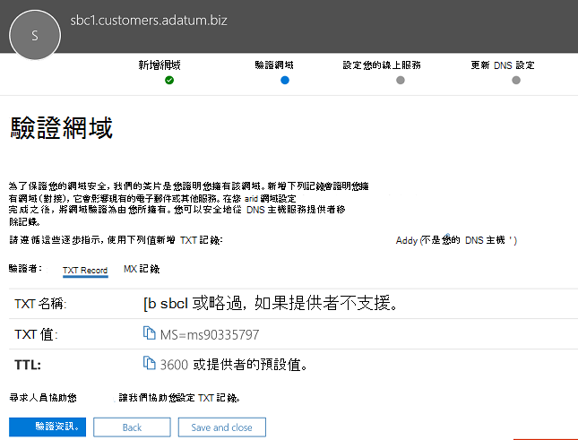

# 設定多個租用戶的工作階段邊界控制器Configure a Session Border Controller for multiple tenants

直接路由支援將一個會話邊界控制器 (SBC) 服務多個租使用者。Direct Routing supports configuring one Session Border Controller (SBC) to serve multiple tenants.

> [!NOTE]
> 此案例專為 Microsoft 合作夥伴和/或 PSTN 電信公司所設計，本文稍後稱為電信公司。This scenario is designed for Microsoft partners and/or PSTN carriers, referred to as carriers later in this document. 電信業者將傳送至 Microsoft Teams 的電話語音銷售給客戶。A carrier sells telephony services delivered to Microsoft Teams to their customers. 

電信公司：A carrier:
- 在資料中心部署及管理 SBC (客戶不需要執行 SBC，而且他們從 Teams 用戶端用戶端的電信業者) 。Deploys and manages an SBC in their datacenter (customers do not need to implement an SBC, and they receive telephony services from the carrier in the Teams client).
- 將 SBC 與多個租使用者相互連接。Interconnects the SBC to multiple tenants.
- 為客戶提供 PSTN 服務。Provides PSTN services to customers.
- 管理電話品質端對端。Manages call quality end to end.
- PSTN 服務另行收費。Charges separately for PSTN services.

Microsoft 不會管理電信公司。Microsoft does not manage carriers. Microsoft 提供 PBX (Microsoft Phone System) Teams 用戶端。Microsoft offers a PBX (Microsoft Phone System) and a Teams client. Microsoft 也會認證可與 Microsoft Phone 系統一起使用的電話，並認證 SBCs。Microsoft also certifies phones, and certifies SBCs that can be used with the Microsoft Phone System. 選擇電信業者之前，請確定您的選擇具有經過認證的 SBC，並可以端對端管理語音品質。Before choosing a carrier, please ensure that your choice has a certified SBC and can manage voice quality end to end.

以下是設定案例的技術實現步驟。The following are the technical implementation steps to configure the scenario.

**僅適用于電信公司：****Carrier only:**
1. 部署 SBC，然後根據認證 SBC 廠商的指示，針對託管案例[設定 SBC。](#deploy-and-configure-the-sbc)Deploy the SBC and configure it for the hosting scenario according to the [instructions from the certified SBC vendors](#deploy-and-configure-the-sbc).
2. 在電信業者租使用者中註冊基本功能變數名稱，並索取萬用字元憑證。Register a base domain name in the carrier tenant and request a wildcard certificate.
3. 針對每個客戶註冊子域，這是基本網域的一部分。Register a subdomain for every customer, which is part of the base domain.

**具有客戶全域系統管理員的電信公司：****Carrier with a Customer Global Administrator:**
1. 將子功能變數名稱稱新增到客戶租使用者。Add the subdomain name to the customer tenant.
2. 啟用子功能變數名稱稱。Activate the subdomain name.
3. 設定從電信電信企業到客戶租使用者的主幹，並設定使用者。Configure the trunk from the carrier to the customer tenant and provision users.

*請確定您瞭解 DNS 基本功能，以及 Microsoft 365 或 Office 365 中的功能變數名稱管理方式。請 [進一步查看取得 Microsoft 365 或 Office 365 網](https://support.office.com/article/Get-help-with-Office-365-domains-28343f3a-dcee-41b6-9b97-5b0f4999b7ef) 域的協助。**Please make sure you understand DNS basics and how the domain name is managed in Microsoft 365 or Office 365. Review [Get help with Microsoft 365 or Office 365 domains](https://support.office.com/article/Get-help-with-Office-365-domains-28343f3a-dcee-41b6-9b97-5b0f4999b7ef) before proceeding further.*

## 部署及設定 SBCDeploy and configure the SBC

如需如何針對 SBC 主機案例部署及設定 SBC 的詳細步驟，請參閱 SBC 廠商的檔。For the detailed steps on how to deploy and configure SBCs for an SBC hosting scenario, please refer to the SBC vendor's documentation.

- **音訊代碼：**[直接路由組](https://www.audiocodes.com/solutions-products/products/products-for-microsoft-365/direct-routing-for-Microsoft-Teams)記，SBC 主機案例的組式，描述為「將 AudioCodes SBC 連接到 Microsoft Teams 直接路由主機管理模型組組附注」。**AudioCodes:** [Direct Routing Configuration notes](https://www.audiocodes.com/solutions-products/products/products-for-microsoft-365/direct-routing-for-Microsoft-Teams), the configuration of the SBC hosting scenario described in "Connecting AudioCodes SBC to Microsoft Teams Direct Routing Hosting Model Configuration Note." 
- **Oracle：**[直接路由群組原則附注](https://www.oracle.com/technetwork/indexes/documentation/acme-packet-2228107.html)，SBC 主機案例的組塊會于「Microsoft」一節中說明。**Oracle:** [Direct Routing Configuration notes](https://www.oracle.com/technetwork/indexes/documentation/acme-packet-2228107.html), the configuration of the SBC hosting scenario is described in the "Microsoft" section. 
- **功能區通訊：** 請參閱功能區通訊 [SBC 核心 Microsoft Teams](https://support.sonus.net/display/IOT/PBXs+-+SBC+5k7kSWe)組組指南，以瞭解如何設定功能區核心系列 SBC 的檔，並參閱此頁面功能區最佳做法 - 設定 Microsoft Teams 直接路由 [SBC Edge](https://support.sonus.net/display/UXDOC81/Connect+SBC+Edge+to+Microsoft+Teams+Direct+Routing+to+Support+Direct+Routing+Carrier)的電信業者**Ribbon Communications:**  Please refer to the [Ribbon Communications SBC Core Microsoft Teams Configuration Guide](https://support.sonus.net/display/IOT/PBXs+-+SBC+5k7kSWe) for documentation on how to configure Ribbon Core Series SBCs and to this page [Ribbon Best Practice - Configuring Carriers for Microsoft Teams Direct Routing SBC Edge](https://support.sonus.net/display/UXDOC81/Connect+SBC+Edge+to+Microsoft+Teams+Direct+Routing+to+Support+Direct+Routing+Carrier)
- **TE-Systems (anynode) ：**  請在 [TE-Systems Community](https://community.te-systems.de/) 頁面上註冊，以瞭解如何為多個租使用者設定 anynode SBC 的檔和範例。**TE-Systems (anynode):**  Please register on the [TE-Systems Community page](https://community.te-systems.de/) for documentation and examples on how to configure anynode SBC for multiple tenants.
- **Metaswitch：**  請在 [Metaswitch 社群](https://manuals.metaswitch.com/MAN39555) 頁面上註冊，以瞭解如何為多個租使用者啟用 Perimeta SBC 的檔。**Metaswitch:**  Please register on the [Metaswitch Community page](https://manuals.metaswitch.com/MAN39555) for documentation on how to enable Perimeta SBC for multiple tenants.

> [!NOTE]
> 請注意如何設定「連絡人」標題。Please pay attention to how to configure the "Contact" header. 連絡人標題是用來在傳入的邀請訊息上尋找客戶租使用者。The Contact header is used to find the customer tenant on the incoming invite message. 

## 註冊基本網域和子域Register a base domain and subdomains

針對託管案例，您需要建立：For the hosting scenario, you need to create:
- 電信業者擁有的一個基礎功能變數名稱。One base domain name owned by the carrier.
- 這是每個客戶租使用者中基本功能變數名稱的一部分子域。A subdomain that is part of the base domain name in every customer tenant.

在下列範例中：In the following example:
- Adatum 是一家電信業者，提供網際網路和電話語音，為數個客戶提供服務。Adatum is a carrier that serves several customers by providing Internet and telephony services.
- Woodgrove Bank、Contoso 和 Adventure Works 是三個擁有 Microsoft 365 或 Office 365 網域，但從 Adatum 接收電話語音的客戶。Woodgrove Bank, Contoso, and Adventure Works are three customers that have Microsoft 365 or Office 365 domains but receive the telephony services from Adatum.

當傳送邀請給Microsoft 365 或 Office 365 時，子域必須符合為客戶所配置的主幹 FQDN 名稱，以及連絡人標題中的 FQDN。Subdomains **MUST** match the FQDN name of the trunk that will be configured for the customer and the FQDN in the Contact header when sending the Invite to Microsoft 365 or Office 365. 

當通話抵達 Microsoft 365 或 Office 365 直接路由介面時，介面會使用連絡人標頭來尋找應該查看使用者的租使用者。When a call arrives at the Microsoft 365 or Office 365 Direct Routing interface, the interface uses the Contact header to find the tenant where the user should be looked up. 直接路由不會在邀請上使用電話號碼尋找功能，因為有些客戶可能擁有非 DID 號碼，可能會與多個租使用者重迭。Direct Routing does not use phone number lookup on the Invite, as some customers might have non-DID numbers that can overlap in several tenants. 因此，必須輸入連絡人標題中的 FQDN 名稱，才能識別確切的租使用者，才能根據電話號碼來查看使用者。Therefore, the FQDN name in the Contact header is required to identify the exact tenant to look up the user by the phone number.

*如需在  [Microsoft 365](https://support.office.com/article/Get-help-with-Office-365-domains-28343f3a-dcee-41b6-9b97-5b0f4999b7ef) 或 Office 365 組織中建立功能變數名稱之詳細資訊，請參閱取得 Office 365 網域的協助。**Please review  [Get help with Office 365 domains](https://support.office.com/article/Get-help-with-Office-365-domains-28343f3a-dcee-41b6-9b97-5b0f4999b7ef) for more information about creating domain names in Microsoft 365 or Office 365 organizations.*

下圖摘要說明基本網域、子域和連絡人標題的需求。The following diagram summarizes the requirements to base domain, subdomains, and Contact header.

SBC 需要憑證來驗證連接。The SBC requires a certificate to authenticate the connections. 針對 SBC 主機案例，電信業者需要要求具有 CN 和/或 SAN .base_domain (的憑證，例如 *\* \* .customers.adatum.biz) 。*For the SBC hosting scenario, the carrier needs to request a certificate with CN and/or SAN *\*.base_domain (for example, \*.customers.adatum.biz)*. 此憑證可用來驗證從單一 SBC 送達多個租使用者的連接。This certificate can be used to authenticate connections to multiple tenants served from a single SBC.

下表是一組配置的範例。The following table is an example of one configuration.

|新功能變數名稱New domain name |類型Type|註冊Registered  |SBC 的憑證 CN/SANCertificate CN/SAN for SBC  |範例中的租使用者預設網域Tenant default domain in the example  |將通話傳送給使用者時，SBC 必須在連絡人標題中顯示 FQDN 名稱FQDN name that SBC must present in the Contact header when sending calls to users|
|---------|---------|---------|---------|---------|---------|
|customers.adatum.bizcustomers.adatum.biz|    基地Base     |     在電信租使用者中In carrier tenant  |    \*.customers.adatum.biz\*.customers.adatum.biz  |   adatum.bizadatum.biz      |NA，這是服務租使用者，沒有使用者NA, this is a service tenant, no users |
|sbc1.customers.adatum.bizsbc1.customers.adatum.biz|    子域Subdomain  |    在客戶租使用者中In a customer tenant  |    \*.customers.adatum.biz\*.customers.adatum.biz  | woodgrovebank.uswoodgrovebank.us  |  sbc1.customers.adatum.bizsbc1.customers.adatum.biz|
|sbc2.customers.adatum.bizsbc2.customers.adatum.biz  |   子域Subdomain | 在客戶租使用者中In a customer tenant   |   \*.customers.adatum.biz\*.customers.adatum.biz   |contoso.comcontoso.com   |sbc2.customers.adatum.bizsbc2.customers.adatum.biz |
|sbc3.customers.adatum.bizsbc3.customers.adatum.biz |   子域Subdomain | 在客戶租使用者中In a customer tenant |   \*.customers.adatum.biz\*.customers.adatum.biz  |  adventureworks.comadventureworks.com | sbc3.customers.adatum.bizsbc3.customers.adatum.biz |
||         |         |         |         |         |

若要設定基本和子域，請遵循下列步驟。To configure the base and subdomains, please follow the steps described below. 在範例中，我們將在 Woodgrove Bank 租使用者 (customers.adatum.biz) 中設定基本功能變數名稱和 (sbc1.customers.adatum.biz 子域) 。In the example, we will configure a base domain name (customers.adatum.biz) and a subdomain for one customer (sbc1.customers.adatum.biz in Woodgrove Bank tenant).

> [!NOTE]
> 使用 sbcX.customers.adatum.biz 在電信租使用者中啟用語音。Use sbcX.customers.adatum.biz to enable voice in the carrier tenant. sbcX 可以是任何唯一且有效的 Alphanumeric hostname。sbcX can be any unique and valid alphanumeric hostname.

## 在電信公司租使用者中註冊基本功能變數名稱Register a base domain name in the carrier tenant

**這些動作是在電信租使用者中執行。****These actions are performed in the carrier tenant.**

### 確定您擁有電信租使用者的適當許可權Ensure that you have appropriate rights in the carrier tenant

您只有在以全域系統管理員的登錄至 Microsoft 365 系統管理中心時，才能新增網域。You can only add new domains if you signed in to the Microsoft 365 admin center as a Global Administrator. 

若要驗證您擁有的角色，請登錄 Microsoft 365 系統管理中心 (，前往使用者作用中使用者，然後確認您具有全域 https://portal.office.com)   >  系統管理員角色。To validate the role you have, please sign in to the Microsoft 365 admin center (https://portal.office.com), go to **Users** > **Active Users**, and then verify that you have a Global Administrator role. 

有關系統管理員角色以及如何在 Microsoft 365 或 Office 365 中指派角色之詳細資訊，請參閱 [關於系統管理員角色](https://support.office.com/article/About-Office-365-admin-roles-da585eea-f576-4f55-a1e0-87090b6aaa9d)。For more information about admin roles and how to assign a role in Microsoft 365 or Office 365, see [About admin roles](https://support.office.com/article/About-Office-365-admin-roles-da585eea-f576-4f55-a1e0-87090b6aaa9d).

### 新增基本網域至租使用者並驗證Add a base domain to the tenant and verify it

1. 在 Microsoft 365 系統管理中心，**前往設定**  >  **網域**  >  **新增網域**。In the Microsoft 365 admin center, go to **Setup** > **Domains** > **Add domain**.
2. 在輸入 **您擁有之網域的** 方塊中，輸入基本網域的 FQDN。In the **Enter a domain you own** box, type the FQDN of the base domain. 在下列範例中，基本網域 *customers.adatum.biz。*In the following example, the base domain is *customers.adatum.biz*.

    

3. 按一下 **[下一步**。Click **Next**.
4. 在範例中，租使用者已經 adatum.biz 驗證功能變數名稱。In the example, the tenant already has adatum.biz as a verified domain name. 精靈不會要求其他驗證，因為 customers.adatum.biz 已註冊名稱的子域。The wizard will not ask for additional verification because customers.adatum.biz is a subdomain for the already registered name. 不過，如果您新增之前尚未驗證的 FQDN，您必須完成驗證程式。However, if you add an FQDN that has not been verified before, you will need to go through the process of verification. 驗證程式如下 [所述](#add-a-subdomain-to-the-customer-tenant-and-verify-it)。The process of verification is [described below](#add-a-subdomain-to-the-customer-tenant-and-verify-it).

    

5. 按一下 **[下** 一步，在 [更新 **DNS 設定** > 頁面上，選取 [我要自己新增 DNS **記錄** ，然後按一下 [下 **一步**> 。Click **Next**, and on the **Update DNS Settings** page, select **I'll add the DNS records myself** and click **Next**.
6. 在下一頁上，清除所有值 (，除非您要使用 Exchange、SharePoint 或 Teams/商務用 Skype) 的功能變數名稱，請按一下 [下一步，然後按一下 [**完成**> 。On the next page, clear all values (unless you want to use the domain name for Exchange, SharePoint, or Teams/Skype for Business), click **Next**, and then click **Finish**. 請確定您的新網域已達設定完成狀態。Make sure your new domain is in the Setup complete status.

    

### 啟用功能變數名稱Activate the domain name

註冊功能變數名稱之後，您必須新增至少一個擁有 Phone System 授權的使用者，並指派 SIP 位址與已建立基本網域相符合之 SIP 位址的 FQDN 部分，以啟用該功能變數名稱。After you have registered a domain name, you need to activate it by adding at least one user with Phone System license and assigning a SIP address with the FQDN portion of the SIP address matching the created base domain. 授權可在網域啟用後撤銷 (最多可能需要 24 小時) 。License can be revoked after the domain activation (it can take up to 24 hours).

> [!NOTE]
> 電信業者租使用者必須保留至少一個指派給租使用者的電話系統授權，以避免移除商務用 Skype 組配置。The Carrier tenant must keep at least one Phone System license assigned to the tenant to avoid removal of the Skype for Business configuration. 

*如需在 [Microsoft 365 或 Office 365](https://support.office.com/article/Get-help-with-Office-365-domains-28343f3a-dcee-41b6-9b97-5b0f4999b7ef) 組織中新增使用者的資訊，請參閱取得 Microsoft 365 或 Office 365 網域的協助。**Please review [Get help with Microsoft 365 or Office 365 domains](https://support.office.com/article/Get-help-with-Office-365-domains-28343f3a-dcee-41b6-9b97-5b0f4999b7ef) for more information about adding users in Microsoft 365 or Office 365 organizations.*

例如：test@customers.adatum.bizFor example: test@customers.adatum.biz

## 在客戶租使用者中註冊子功能變數名稱稱Register a subdomain name in a customer tenant

您必須為每個客戶建立唯一的子功能變數名稱稱。You will need to create a unique subdomain name for every customer. 在此範例中，我們將使用預設功能變數名稱 sbc1.customers.adatum.biz 租使用者建立子域 woodgrovebank.us。In this example, we will create a subdomain sbc1.customers.adatum.biz in a tenant with the default domain name woodgrovebank.us.

**下列所有動作都位在客戶租使用者中。****All actions below are in the customer tenant.**

### 確定您擁有客戶租使用者的適當許可權Ensure that you have appropriate rights in the customer tenant

您只有在以全域系統管理員的登錄至 Microsoft 365 系統管理中心時，才能新增網域。You can only add new domains if you signed in to the Microsoft 365 admin center as a Global Administrator. 

若要驗證您擁有的角色，請登錄 Microsoft 365 系統管理中心 (，前往使用者作用中使用者，然後確認您具有全域 https://portal.office.com)   >  系統管理員角色。To validate the role you have, please sign in to the Microsoft 365 admin center (https://portal.office.com), go to **Users** > **Active Users**, and then verify that you have a Global Administrator role. 

有關系統管理員角色以及如何在 Microsoft 365 或 Office 365 中指派角色之詳細資訊，請參閱 [關於系統管理員角色](https://support.office.com/article/About-Office-365-admin-roles-da585eea-f576-4f55-a1e0-87090b6aaa9d)。For more information about admin roles and how to assign a role in Microsoft 365 or Office 365, see [About admin roles](https://support.office.com/article/About-Office-365-admin-roles-da585eea-f576-4f55-a1e0-87090b6aaa9d).

### 新增子域至客戶租使用者並驗證Add a subdomain to the customer tenant and verify it
1. 在 Microsoft 365 系統管理中心，**前往設定**  >  **網域**  >  **新增網域**。In the Microsoft 365 admin center, go to **Setup** > **Domains** > **Add domain**.
2. 在輸入 **您擁有之網域** 的方塊中，輸入此租使用者子域的 FQDN。In the **Enter a domain you own** box, type the FQDN of the subdomain for this tenant. 在下列範例中，子域 sbc1.customers.adatum.biz。In the example below, the subdomain is sbc1.customers.adatum.biz.

    

3. 按一下 **[下一步**。Click **Next**.
4. FQDN 從未在租使用者中註冊。The FQDN has never been registered in the tenant. 在下一個步驟中，您必須驗證網域。In the next step, you will need to verify the domain. 請 **改為選取新增 TXT 記錄**。Select **Add a TXT record instead**. 

    

5. 按一下 **[下** 一步，並記下產生的 TXT 值以驗證功能變數名稱。Click **Next**, and note the TXT value generated to verify the domain name.

    

6. 使用電信公司 DNS 主機服務提供者中上一個步驟的值建立 TXT 記錄。Create the TXT record with the value from the previous step in carrier's DNS hosting provider.

    

    若要詳細資訊，請參閱在任何 [DNS](https://support.office.com/article/create-dns-records-at-any-dns-hosting-provider-for-office-365-7b7b075d-79f9-4e37-8a9e-fb60c1d95166)主機服務提供者建立 DNS 記錄。For more information, refer to [Create DNS records at any DNS hosting provider](https://support.office.com/article/create-dns-records-at-any-dns-hosting-provider-for-office-365-7b7b075d-79f9-4e37-8a9e-fb60c1d95166).

7. 返回客戶的 Microsoft 365 系統管理中心，然後按一下 [ **驗證**> 。Go back to the customer's Microsoft 365 admin center and click **Verify**. 
8. 在下一頁中，選取 **[我要自己新增 DNS 記錄** ，然後按一下 [下 **一步**> 。On the next page, select **I'll add the DNS records myself** and click **Next**.

    

9. 在 [ **選擇您的線上服務** > 頁面上，清除所有選項，然後按一下 [ **下一步**。On the **Choose your online services** page, clear all options and click **Next**.

    

10. 按一下 **[更新** **DNS 設定> 頁面上的 [完成** 。Click **Finish** on the **Update DNS settings** page.

    

11. 請確保狀態為完成 **設定**。Ensure that the status is **Setup complete**. 
    
    
    
> [!NOTE]
> 個別用戶端的基本 URL 和子域必須位於同一個租使用者上，才能新增 _直接路由_ 主幹。The base URL and the subdomain for the individual client have to be on the same tenant to enable you to add a _direct route_ trunk.

### 啟用子功能變數名稱稱Activate the subdomain name

註冊功能變數名稱之後，您必須新增至少一個使用者，並指派 SIP 位址與客戶租使用者中已建立子域符合之 SIP 位址的 FQDN 部分來啟用功能變數名稱。After you register a domain name, you need to activate it by adding at least one user and assign a SIP address with the FQDN portion of the SIP address matching the created subdomain in the customer tenant. 子域啟用之後，使用者 (最多可能需要 24 小時) 。License can be revoked from user after the subdomain activation (it can take up to 24 hours).

*如需在 [Microsoft 365 或 Office 365](https://support.office.com/article/Get-help-with-Office-365-domains-28343f3a-dcee-41b6-9b97-5b0f4999b7ef) 組織中新增使用者的資訊，請參閱取得 Microsoft 365 或 Office 365 網域的協助。**Please review [Get help with Microsoft 365 or Office 365 domains](https://support.office.com/article/Get-help-with-Office-365-domains-28343f3a-dcee-41b6-9b97-5b0f4999b7ef) for more information about adding users in Microsoft 365 or Office 365 organizations.*

例如：test@sbc1.customers.adatum.bizFor example: test@sbc1.customers.adatum.biz

### 建立主幹並配置使用者Create a trunk and provision users

隨著直接路由的初次發行，Microsoft 需要使用 New-CSOnlinePSTNGateway 將主幹新 (每個服務租使用者) 租使用者。With the initial release of Direct Routing, Microsoft required a trunk to be added to each served tenant (customer tenant) using New-CSOnlinePSTNGateway.

不過，有兩個原因並未證明這是最佳結果：However, this has not proved optimal for two reasons:
 
- **間接費用管理**。**Overhead management**. 例如，卸載或排空 SBC 會變更一些參數，例如啟用或停用媒體旁路。Offloading or draining an SBC, for example, changes some parameters, like enabling or disabling media bypass. 變更埠需要執行 Set-CSOnlinePSTNGateway (變更多個租使用者的參數，) 實際上也是相同的 SBC。Changing the port requires changing parameters in multiple tenants (by running Set-CSOnlinePSTNGateway), but it is in fact the same SBC. 

-  **負荷處理**。**Overhead processing**. 收集及監控主幹健康情況資料 - 從多個邏輯主幹收集的 SIP 選項，實際上，相同的 SBC 和相同的實體主幹，會降低路由資料的處理速度。Gathering and monitoring trunk health data - SIP options collected from multiple logical trunks that are, in reality, the same SBC and the same physical trunk, slows down processing of the routing data.
 
根據這個意見，Microsoft 會提供新的邏輯來為客戶租使用者配置主幹。Based on this feedback, Microsoft is bringing in a new logic to provision the trunks for the customer tenants.

引進了兩個新實體：Two new entities were introduced:
-    使用命令 New-CSOnlinePSTNGateway 在電信租使用者中註冊的電信母線，例如 New-CSOnlinePSTNGateway -FQDN customers.adatum.biz -SIPSignalingport 5068 -ForwardPAI $true。A carrier trunk registered in the carrier tenant using the command New-CSOnlinePSTNGateway, for example New-CSOnlinePSTNGateway -FQDN customers.adatum.biz -SIPSignalingport 5068 -ForwardPAI $true.

-    不需要註冊的衍生主幹。A derived trunk, that does not require registration. 它只是從電信母線新增到所需的主機名稱稱。It is simply a desired host name added in from of the carrier trunk. 它會從電信母線衍生出其所有設定參數。It derives all of its configuration parameters from the carrier trunk. 衍生主幹不需要在 PowerShell 中建立，而與電信業者主幹的關聯是以 FQDN 名稱為基礎 (請參閱下方) 。The derived trunk doesn't need to be created in PowerShell, and the association with the carrier trunk is based on the FQDN name (see details below).

**置備邏輯和範例****Provisioning logic and example**

-    電信公司只需要使用 (命令，在電信) 中設定及管理Set-CSOnlinePSTNGateway主幹。Carriers only need to set up and manage a single trunk  (carrier trunk in the carrier domain), using the Set-CSOnlinePSTNGateway command. 在上方範例中，這是 adatum.biz;In the example above it is adatum.biz;
-    在客戶租使用者中，電信公司只需要將衍生主幹 FQDN 新加到使用者的語音路由策略。In the customer tenant, the carrier need only to add the derived trunk FQDN to the voice routing policies of the users. 不需要執行主幹New-CSOnlinePSTNGateway程式。There is no need to run New-CSOnlinePSTNGateway for a trunk.
-    如名稱所建議，衍生主幹會繼承或衍生電信母線的所有組組參數。The derived trunk, as the name suggests, inherits or derives all the configuration parameters from the carrier trunk. 例子：Examples:
-    Customers.adatum.biz – 需要在電信租使用者中建立電信母線。Customers.adatum.biz – the carrier trunk which needs to be created in the carrier tenant.
-    Sbc1.customers.adatum.biz – 客戶租使用者中的衍生主幹，不需要在 PowerShell 中建立。Sbc1.customers.adatum.biz – the derived trunk in a customer tenant that does not need to be created in PowerShell.  您可以直接在線上語音路由策略的客戶租使用者中新增衍生主幹的名稱，而不必建立。You can simply add the name of the derived trunk in the customer tenant in the online voice routing policy without creating it.
-   電信公司必須設定 DNS 記錄，將衍生主幹 FQDN 解析為電信公司 SBC IP 位址。Carrier will need to setup DNS record resolving derived trunk FQDN to carrier SBC ip address.

-    在電信 (租使用者) 上進行的任何變更，都會自動適用于衍生的主幹。Any changes made on a carrier trunk (on carrier tenant) is automatically applied to derived trunks. 例如，電信公司可以變更電信母線上的 SIP 埠，這項變更會適用于所有衍生的主幹。For example, carriers can change an SIP port on the carrier trunk, and this change applies to all derived trunks. 設定主幹的新邏輯簡化了管理，因為您不需要前往每個租使用者並變更每個主幹上的參數。New logic to configure the trunks simplifies the management as you don't need to go to every tenant and change the parameter on every trunk.
-    選項只會送到電信母線 FQDN。The options are sent only to the carrier trunk FQDN. 電信母線的健康狀態會適用于所有衍生主幹，並用於路由決策。The health status of the carrier trunk is applied to all derived trunks and is used for routing decisions. 進一瞭解直接 [路由選項](./direct-routing-monitor-and-troubleshoot.md)。Find out more about [Direct Routing options](./direct-routing-monitor-and-troubleshoot.md).
-    電信母線可以排空電信母線，而所有衍生的主幹也會排空。The carrier can drain the carrier trunk, and all derived trunks will be drained as well. 
 

**從上一個模型移往電信母線****Migration from the previous model to the carrier trunk**
 
若要從目前由電信主機模型所實施的移向新模型，電信公司必須為客戶租使用者重新配置主幹。For migration from the current implementation of the carrier hosted model to the new model, the carriers will need to reconfigure the trunks for customer tenants. 從客戶租使用者移除主幹，Remove-CSOnlinePSTNGateway (將主幹留在電信租使用者) -Remove the trunks from the customer tenants using Remove-CSOnlinePSTNGateway (leaving the trunk in the carrier tenant)-

我們強烈建議您儘快移移至新解決方案，因為我們會使用電信母線和衍生主幹模型加強監控與部署。We highly encourage migrating to the new solution as soon as possible as we will be enhancing monitoring and provisioning using the carrier and derived trunk model.
 

請參閱 [SBC 廠商](#deploy-and-configure-the-sbc) 有關在連絡人標題中傳送子域 FQDN 名稱的指示。Please refer to the [SBC vendor instructions](#deploy-and-configure-the-sbc) on configuring sending the FQDN name of subdomains in the Contact header.

## 設定 muti-tenant 容錯移轉的考慮Considerations for setting up muti-tenant failover 

若要設定多租使用者環境的容錯移轉，您必須執行下列操作：To set up failover for a multi-tenant environment, you'll need to do the following:

- 針對每個租使用者，為兩個不同的 SBC 新增 FQDNs。For each tenant, add the FQDNs for two different SBCs.  例如：For example:

   customer1.sbc1.contoso.comcustomer1.sbc1.contoso.com  
   customer1.sbc2.contoso.comcustomer1.sbc2.contoso.com  

- 在使用者的線上語音路由規則中，指定兩個 SBC。In the Online Voice Routing policies of the users, specify both SBCs.  如果其中一個 SBC 失敗，路由策略會路由呼叫至第二個 SBC。If one SBC fails, the routing policy will route calls to the second SBC.

## 另請參閱See also

[規劃直接路由Plan Direct Routing](direct-routing-plan.md)

[設定直接路由Configure Direct Routing](direct-routing-configure.md)