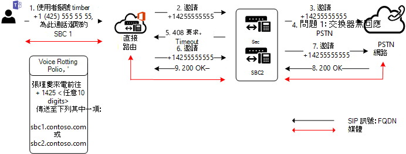

# 輸出呼叫上的主幹容錯移轉

本主題說明如何避免外線呼叫上的主幹容錯移轉，從 Teams 到會話邊界控制器 (SBC) 。

## 網路錯誤的容錯移轉

如果主幹因為任何原因無法連接，將會嘗試從不同的 Microsoft 資料中心連接到同一個主幹。 例如，如果連接遭到拒絕、TLS 有超時，或是有任何其他網路層級問題，則主幹可能未連接。
例如，如果系統管理員僅限制從已知 IP 位址存取 SBC，但忘記將所有 Microsoft Direct 路由資料中心的 IP 位址放在 SBC 的存取控制清單 (ACL) 上，則連接可能會失敗。 

## 從會話邊界控制器或 SBC 系統接收的特定 SIP (容錯移轉) 

如果 Direct Routing 收到回應外發邀請的任何 4xx 或 6xx SIP 錯誤碼，則通話預設視為已完成。 外撥是指從 Teams 用戶端撥打到公用交換電話網絡 (PSTN) 與下列流量流量的通話：Teams 用戶端 -> 直接路由 -> SBC -> 電話網絡。

SIP 代碼清單可在 SIP ([RFC 的](https://tools.ietf.org/html/rfc3261)會話初始) 中找到。

假設 SBC 在傳入邀請上回複了代碼「408 要求超時：伺服器無法于適當的時間內產生回應，例如，如果伺服器無法判斷使用者的時間位置。」 用戶端稍後可能會重複要求，而不需要修改。」

此特定 SBC 可能難以連接到受話者，可能是因為網路設定錯誤或其他錯誤。 不過，路由中可能還有一個 SBC 可以到達通話者。

在下列圖表中，當使用者撥打電話號碼時，路由中可能有兩個 SBC 可以傳送此通話。 一開始 SBC1.contoso.com 已針對通話選取 SBC1.contoso.com，但由於網路問題，無法連絡 PTSN 網路。
根據預設，通話此時會完成。 
 

但路由中可能還有一個 SBC 可以傳送通話。
如果您設定參數，將會嘗試第二 `Set-CSOnlinePSTNGateway -Identity sbc1.contoso.com -FailoverResponseCodes "408"` 個 SBC，SBC2.contoso.com 圖表所示：

設定參數 -FailoverResponseCodes 並指定代碼可協助微調路由，並避免 SBC 因為網路或其他問題而無法進行通話時的潛在問題。

預設值：408、503、504

