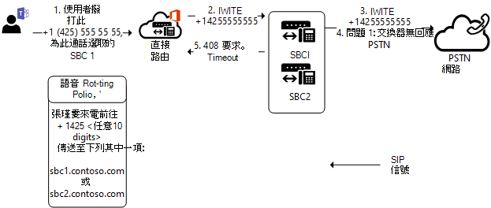

# 輸出呼叫上的主幹容錯移轉

本主題說明如何避免呼出通話的幹線容錯移轉--從團隊到會話邊界控制器（SBC）。

## 網路錯誤的容錯移轉

如果乾線由於任何原因而無法連線，則會從不同的 Microsoft Datacenter 嘗試連線到相同主幹。 例如，如果某個連線遭到拒絕、TLS 超時，或有任何其他的網路層級問題，可能就無法連接主幹。
例如，如果系統管理員僅從已知 IP 位址限制存取 SBC，但忘記將所有 Microsoft Direct 路由資料中心的 IP 位址放在 SBC 的存取控制清單（ACL）中，則連接可能會失敗。 

## 從會話邊界控制器（SBC）收到的特定 SIP 代碼的容錯移轉

如果直接路由收到任何用於回應傳出邀請的4xx 或 6xx SIP 錯誤代碼，則預設會認為已完成該通話。 [外寄] 表示來自團隊用戶端的呼叫與下列流量流程的公用交換電話網絡（PSTN）：團隊用戶端-> 直接路由-> SBC > 電話網絡。

您可以在[會話初始通訊協定（SIP） RFC](https://tools.ietf.org/html/rfc3261)中找到 SIP 代碼清單。

假設某個 SBC 以程式碼 "408 要求超時] 的傳入邀請回復，例如，伺服器無法在適當的時間內產生回應，例如，如果無法判斷使用者的時間位置。 用戶端可在任何時間重複要求，而不需修改。」

這個特定的 SBC 可能會在連線至被呼叫者時遇到問題，可能是因為網路錯誤配置或其他錯誤。 不過，路由中有一個以上的 SBC，可能可以達到被呼叫者的能力。

在下圖中，當使用者撥打電話號碼時，路線中有兩個 SBCs 可提供此通話。 最初已針對通話選取 [SBC1.contoso.com]，但由於網路問題，SBC1.contoso.com 無法達到 PTSN 網路。
根據預設，會在目前完成通話。 
 

但在路由中可能會有一個以上的 SBC 可以傳送通話。
如果您設定參數`Set-CSOnlinePSTNGateway -Identity sbc1.contoso.com -FailoverResponseCodes "408"`，則會在下列圖表中嘗試 SBC2.contoso.com 第二個 SBC：

![顯示 [與第二個 SBC 路由] 的圖表](media/direct-routing-failover-response-codes2.png)

設定參數 FailoverResponseCodes 並指定程式碼可協助您微調路由，並避免當 SBC 由於網路或其他問題而無法撥打電話時可能發生的問題。

預設值：408、503、504

