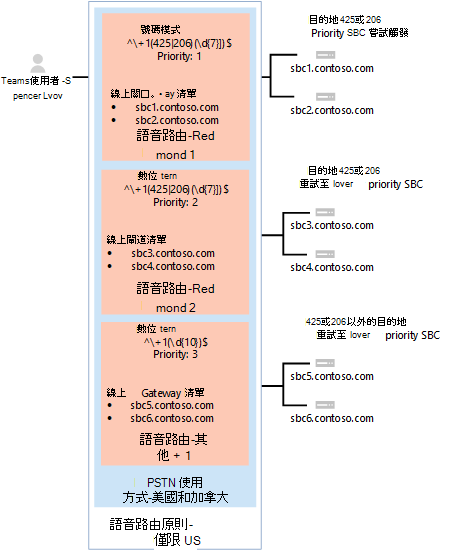

# <a name="configure-voice-routing-for-direct-routing"></a><span data-ttu-id="3771a-103">設定直接路由的語音路由</span><span class="sxs-lookup"><span data-stu-id="3771a-103">Configure voice routing for Direct Routing</span></span>

<span data-ttu-id="3771a-104">本文說明如何設定手機系統 Direct 路由的語音路由。</span><span class="sxs-lookup"><span data-stu-id="3771a-104">This article describes how to configure voice routing for Phone System Direct Routing.</span></span>  <span data-ttu-id="3771a-105">以下是設定直接路由的步驟3：</span><span class="sxs-lookup"><span data-stu-id="3771a-105">This is step 3 of the following steps for configuring Direct Routing:</span></span>

- <span data-ttu-id="3771a-106">步驟1。</span><span class="sxs-lookup"><span data-stu-id="3771a-106">Step 1.</span></span> [<span data-ttu-id="3771a-107">將 SBC 與 Microsoft Phone 系統連接並驗證連接</span><span class="sxs-lookup"><span data-stu-id="3771a-107">Connect the SBC with Microsoft Phone System and validate the connection</span></span>](direct-routing-connect-the-sbc.md) 
- <span data-ttu-id="3771a-108">步驟2。</span><span class="sxs-lookup"><span data-stu-id="3771a-108">Step 2.</span></span> [<span data-ttu-id="3771a-109">允許使用者使用直接路由、語音及語音信箱</span><span class="sxs-lookup"><span data-stu-id="3771a-109">Enable users for Direct Routing, voice, and voicemail</span></span>](direct-routing-enable-users.md)    
- <span data-ttu-id="3771a-110">**步驟3。設定語音路由**（本文）</span><span class="sxs-lookup"><span data-stu-id="3771a-110">**Step 3. Configure voice routing** (This article)</span></span>
- <span data-ttu-id="3771a-111">步驟4。</span><span class="sxs-lookup"><span data-stu-id="3771a-111">Step 4.</span></span> [<span data-ttu-id="3771a-112">將數位轉換成替換格式</span><span class="sxs-lookup"><span data-stu-id="3771a-112">Translate numbers to an alternate format</span></span>](direct-routing-translate-numbers.md) 

<span data-ttu-id="3771a-113">如需設定直接路由所需的所有步驟的詳細資訊，請參閱設定[直接路由](direct-routing-configure.md)。</span><span class="sxs-lookup"><span data-stu-id="3771a-113">For information on all the steps required for setting up Direct Routing, see [Configure Direct Routing](direct-routing-configure.md).</span></span>

## <a name="voice-routing-overview"></a><span data-ttu-id="3771a-114">語音路由概覽</span><span class="sxs-lookup"><span data-stu-id="3771a-114">Voice routing overview</span></span>

<span data-ttu-id="3771a-115">Microsoft Phone 系統有一個路由機制，可讓您根據下列情況，將呼叫傳送到特定的會話邊界控制器（SBC）：</span><span class="sxs-lookup"><span data-stu-id="3771a-115">Microsoft Phone System has a routing mechanism that allows a call to be sent to a specific Session Border Controller (SBC) based on:</span></span> 

- <span data-ttu-id="3771a-116">[已呼叫的號碼] 模式</span><span class="sxs-lookup"><span data-stu-id="3771a-116">The called number pattern</span></span> 
- <span data-ttu-id="3771a-117">呼叫的號碼模式加上呼叫的特定使用者</span><span class="sxs-lookup"><span data-stu-id="3771a-117">The called number pattern plus the specific user who makes the call</span></span>
 
<span data-ttu-id="3771a-118">SBCs 可以指定為 [作用中] 和 [備份]。</span><span class="sxs-lookup"><span data-stu-id="3771a-118">SBCs can be designated as active and backup.</span></span> <span data-ttu-id="3771a-119">當設定為作用中的 SBC 無法用於特定呼叫路由時，該呼叫將會路由至 backup SBC。</span><span class="sxs-lookup"><span data-stu-id="3771a-119">When the SBC that is configured as active is not available for a specific call route, then the call will be routed to a backup SBC.</span></span>
 
<span data-ttu-id="3771a-120">[語音路由] 是由下列元素所組成：</span><span class="sxs-lookup"><span data-stu-id="3771a-120">Voice routing is made up of the following elements:</span></span> 

- <span data-ttu-id="3771a-121">**語音路由策略**– PSTN 用途的容器，可指派給使用者或多位使用者。</span><span class="sxs-lookup"><span data-stu-id="3771a-121">**Voice routing policy** – A container for PSTN Usages, which can be assigned to a user or to multiple users.</span></span> 

- <span data-ttu-id="3771a-122">**PSTN 用途**-語音路由和 PSTN 用途的容器，可在不同的語音路由策略中共用。</span><span class="sxs-lookup"><span data-stu-id="3771a-122">**PSTN usages** – A container for voice routes and PSTN usages, which can be shared in different voice routing policies.</span></span> 

- <span data-ttu-id="3771a-123">**語音路由**：一種數位模式，以及一組線上 PSTN 閘道，用於撥打電話號碼符合模式的呼叫。</span><span class="sxs-lookup"><span data-stu-id="3771a-123">**Voice Routes** – A number pattern and set of online PSTN gateways to use for calls where the calling number matches the pattern.</span></span>

- <span data-ttu-id="3771a-124">**線上 PSTN 閘道**-指向 sbc 的指標，也會儲存在 sbc 中發出呼叫時所套用的設定，例如轉寄 P 斷言身分識別（PAI）或首選編解碼器;可以新增到語音路由。</span><span class="sxs-lookup"><span data-stu-id="3771a-124">**Online PSTN gateway** - A pointer to an SBC that also stores the configuration that is applied when a call is placed through the SBC, such as forward P-Asserted-Identity (PAI) or Preferred Codecs; can be added to voice routes.</span></span>

## <a name="example-1-voice-routing-with-one-pstn-usage"></a><span data-ttu-id="3771a-125">範例1：使用單一 PSTN 使用的語音路由</span><span class="sxs-lookup"><span data-stu-id="3771a-125">Example 1: Voice routing with one PSTN Usage</span></span>

<span data-ttu-id="3771a-126">下圖顯示通話流程中的兩個語音路由策略範例。</span><span class="sxs-lookup"><span data-stu-id="3771a-126">The following diagram shows two examples of voice routing policies in a call flow.</span></span>

<span data-ttu-id="3771a-127">**通話流程1（在左邊）：** 如果使用者撥打電話給 + 1 425 XXX XX 或 + 1 206 XXX XX xx，該通話會路由至 SBC sbc1.contoso.biz 或 sbc2.contoso.biz。</span><span class="sxs-lookup"><span data-stu-id="3771a-127">**Call Flow 1 (on the left):** If a user makes a call to +1 425 XXX XX XX or +1 206 XXX XX XX, the call is routed to SBC sbc1.contoso.biz or sbc2.contoso.biz.</span></span> <span data-ttu-id="3771a-128">如果 sbc1.contoso.biz 和 sbc2.contoso.biz 都無法使用，就會掛斷通話。</span><span class="sxs-lookup"><span data-stu-id="3771a-128">If neither sbc1.contoso.biz nor sbc2.contoso.biz are available, the call is dropped.</span></span> 

<span data-ttu-id="3771a-129">**通話流程2（右側）：** 如果使用者撥打電話給 + 1 425 XXX XX 或 + 1 206 XXX XX xx，該通話就會先路由至 SBC sbc1.contoso.biz 或 sbc2.contoso.biz。</span><span class="sxs-lookup"><span data-stu-id="3771a-129">**Call Flow 2 (on the right):** If a user makes a call to +1 425 XXX XX XX or +1 206 XXX XX XX, the call is first routed to SBC sbc1.contoso.biz or sbc2.contoso.biz.</span></span> <span data-ttu-id="3771a-130">如果沒有可用的 SBC，則會嘗試使用較低優先順序的路由（sbc3.contoso.biz 和 sbc4.contoso.biz）。</span><span class="sxs-lookup"><span data-stu-id="3771a-130">If neither SBC is available, the route with lower priority will be tried (sbc3.contoso.biz and sbc4.contoso.biz).</span></span> <span data-ttu-id="3771a-131">如果沒有任何 SBCs 可用，就會中斷通話。</span><span class="sxs-lookup"><span data-stu-id="3771a-131">If none of the SBCs are available, the call is dropped.</span></span> 


<span data-ttu-id="3771a-133">在這兩個範例中，雖然語音路由是指派優先順序，但路由中的 SBCs 會以隨機順序嘗試。</span><span class="sxs-lookup"><span data-stu-id="3771a-133">In both examples, while the voice route is assigned priorities, the SBCs in the routes are tried in random order.</span></span>

  > [!NOTE]
  > <span data-ttu-id="3771a-134">除非使用者也有 Microsoft 通話方案授權，否則呼叫範例設定中的 [除了模式 + 1 425 XXX xx xx] 或 [+ 1 206 XXX xx xx] 以外的任何號碼。</span><span class="sxs-lookup"><span data-stu-id="3771a-134">Unless the user also has a Microsoft Calling Plan license, calls to any number except numbers matching the patterns +1 425 XXX XX XX or +1 206 XXX XX XX in the example configuration are dropped.</span></span> <span data-ttu-id="3771a-135">如果使用者有通話方案授權，通話會根據 Microsoft 通話方案的原則自動傳送。</span><span class="sxs-lookup"><span data-stu-id="3771a-135">If the user has a Calling Plan license, the call is automatically routed according to the policies of the Microsoft Calling Plan.</span></span> <span data-ttu-id="3771a-136">Microsoft 通話方案會自動套用為所有擁有 Microsoft 通話方案授權的使用者，而且不需要額外的呼叫路由設定。</span><span class="sxs-lookup"><span data-stu-id="3771a-136">The Microsoft Calling Plan applies automatically as the last route to all users with the Microsoft Calling Plan license and does not require additional call routing configuration.</span></span>

<span data-ttu-id="3771a-137">在下圖所示的範例中，新增了語音信箱，以傳送來電給所有其他美國和加拿大的號碼（移至撥打電話號碼模式 + 1 XXX XXX XX XX 的通話）。</span><span class="sxs-lookup"><span data-stu-id="3771a-137">In the example shown in the following diagram, a voice route is added to send calls to all other US and Canadian numbers (calls that go to called number pattern +1 XXX XXX XX XX).</span></span>


<span data-ttu-id="3771a-139">針對所有其他通話：</span><span class="sxs-lookup"><span data-stu-id="3771a-139">For all other calls:</span></span>

- <span data-ttu-id="3771a-140">如果使用者同時擁有兩個授權（Microsoft 手機系統和 Microsoft 通話方案），則會使用自動路由。</span><span class="sxs-lookup"><span data-stu-id="3771a-140">If a user has both licenses (Microsoft Phone System and Microsoft Calling Plan), the automatic route is used.</span></span> 
- <span data-ttu-id="3771a-141">如果沒有與管理員建立的線上語音路線中的數位模式相符，通話會透過 Microsoft 通話方案傳送。</span><span class="sxs-lookup"><span data-stu-id="3771a-141">If nothing matches the number patterns in the administrator-created online voice routes, then the call is routed through Microsoft Calling Plan.</span></span>
- <span data-ttu-id="3771a-142">如果使用者只有 Microsoft 手機系統，就會中斷通話，因為沒有可用的相符規則。</span><span class="sxs-lookup"><span data-stu-id="3771a-142">If the user only has Microsoft Phone System, the call is dropped because no matching rules are available.</span></span>

  > [!NOTE]
  > <span data-ttu-id="3771a-143">在此情況下，路由 "Other + 1" 的優先順序值不重要，因為只有一個路由符合模式 + 1 XXX XXX XXX xx。</span><span class="sxs-lookup"><span data-stu-id="3771a-143">The Priority value for route "Other +1" doesn’t matter in this case because there is only one route that matches the pattern +1 XXX XXX XX XX.</span></span> <span data-ttu-id="3771a-144">如果使用者撥打電話給 + 1 324 567 89 89，且 sbc5.contoso.biz 和 sbc6.contoso.biz 都無法使用，通話就會斷撥。</span><span class="sxs-lookup"><span data-stu-id="3771a-144">If a user makes a call to +1 324 567 89 89 and both sbc5.contoso.biz and sbc6.contoso.biz are unavailable, the call is dropped.</span></span>

<span data-ttu-id="3771a-145">下表摘要列出使用三個語音路由的配置。</span><span class="sxs-lookup"><span data-stu-id="3771a-145">The following table summarizes the configuration using three voice routes.</span></span> <span data-ttu-id="3771a-146">在這個範例中，所有三個路由都是「美國和加拿大」相同的 PSTN 使用量。</span><span class="sxs-lookup"><span data-stu-id="3771a-146">In this example, all three routes are part of the same PSTN Usage "US and Canada".</span></span>  <span data-ttu-id="3771a-147">所有路由都與 PSTN 使用量「美國和加拿大」相關聯，且 PSTN 使用量與語音路由策略「僅限美國」相關聯。</span><span class="sxs-lookup"><span data-stu-id="3771a-147">All routes are associated with the PSTN Usage "US and Canada" and the PSTN Usage is associated with the Voice Routing Policy "US Only."</span></span> 

|<span data-ttu-id="3771a-148">**PSTN 使用量**</span><span class="sxs-lookup"><span data-stu-id="3771a-148">**PSTN usage**</span></span>|<span data-ttu-id="3771a-149">**語音路線**</span><span class="sxs-lookup"><span data-stu-id="3771a-149">**Voice route**</span></span>|<span data-ttu-id="3771a-150">**數位模式**</span><span class="sxs-lookup"><span data-stu-id="3771a-150">**Number pattern**</span></span>|<span data-ttu-id="3771a-151">**優先順序**</span><span class="sxs-lookup"><span data-stu-id="3771a-151">**Priority**</span></span>|<span data-ttu-id="3771a-152">**SBC**</span><span class="sxs-lookup"><span data-stu-id="3771a-152">**SBC**</span></span>|<span data-ttu-id="3771a-153">**描述**</span><span class="sxs-lookup"><span data-stu-id="3771a-153">**Description**</span></span>|
|:-----|:-----|:-----|:-----|:-----|:-----|
|<span data-ttu-id="3771a-154">僅限美國</span><span class="sxs-lookup"><span data-stu-id="3771a-154">US only</span></span>|<span data-ttu-id="3771a-155">"雷德蒙 1"</span><span class="sxs-lookup"><span data-stu-id="3771a-155">"Redmond 1"</span></span>|<span data-ttu-id="3771a-156">^\\+ 1 （425\|206）（\d{7}） $</span><span class="sxs-lookup"><span data-stu-id="3771a-156">^\\+1(425\|206)(\d{7})$</span></span>|<span data-ttu-id="3771a-157">1</span><span class="sxs-lookup"><span data-stu-id="3771a-157">1</span></span>|<span data-ttu-id="3771a-158">sbc1.contoso.biz</span><span class="sxs-lookup"><span data-stu-id="3771a-158">sbc1.contoso.biz</span></span><br/><span data-ttu-id="3771a-159">sbc2.contoso.biz</span><span class="sxs-lookup"><span data-stu-id="3771a-159">sbc2.contoso.biz</span></span>|<span data-ttu-id="3771a-160">呼叫號碼 + 1 425 XXX XX xx 美元或 + 1 206 XXX XX xx 的活動路由</span><span class="sxs-lookup"><span data-stu-id="3771a-160">Active route for called numbers +1 425 XXX XX XX or +1 206 XXX XX XX</span></span>|
|<span data-ttu-id="3771a-161">僅限美國</span><span class="sxs-lookup"><span data-stu-id="3771a-161">US only</span></span>|<span data-ttu-id="3771a-162">"雷德蒙 2"</span><span class="sxs-lookup"><span data-stu-id="3771a-162">"Redmond 2"</span></span>|<span data-ttu-id="3771a-163">^\\+ 1 （425\|206）（\d{7}） $</span><span class="sxs-lookup"><span data-stu-id="3771a-163">^\\+1(425\|206)(\d{7})$</span></span>|<span data-ttu-id="3771a-164">pplx-2</span><span class="sxs-lookup"><span data-stu-id="3771a-164">2</span></span>|<span data-ttu-id="3771a-165">sbc3.contoso.biz</span><span class="sxs-lookup"><span data-stu-id="3771a-165">sbc3.contoso.biz</span></span><br/><span data-ttu-id="3771a-166">sbc4.contoso.biz</span><span class="sxs-lookup"><span data-stu-id="3771a-166">sbc4.contoso.biz</span></span>|<span data-ttu-id="3771a-167">呼叫號碼的備份路由 + 1 425 XXX XX XX or + 1 206 XXX XX xx</span><span class="sxs-lookup"><span data-stu-id="3771a-167">Backup route for called numbers +1 425 XXX XX XX or +1 206 XXX XX XX</span></span>|
|<span data-ttu-id="3771a-168">僅限美國</span><span class="sxs-lookup"><span data-stu-id="3771a-168">US only</span></span>|<span data-ttu-id="3771a-169">"Other + 1"</span><span class="sxs-lookup"><span data-stu-id="3771a-169">"Other +1"</span></span>|<span data-ttu-id="3771a-170">^\\+ 1 （\d{10}） $</span><span class="sxs-lookup"><span data-stu-id="3771a-170">^\\+1(\d{10})$</span></span>|<span data-ttu-id="3771a-171">3</span><span class="sxs-lookup"><span data-stu-id="3771a-171">3</span></span>|<span data-ttu-id="3771a-172">sbc5.contoso.biz</span><span class="sxs-lookup"><span data-stu-id="3771a-172">sbc5.contoso.biz</span></span><br/><span data-ttu-id="3771a-173">sbc6.contoso.biz</span><span class="sxs-lookup"><span data-stu-id="3771a-173">sbc6.contoso.biz</span></span>|<span data-ttu-id="3771a-174">呼叫號碼的路由 + 1 XXX XXX XXX xx （除 + 1 425 XXX XX 或 + 1 206 XXX XX xx 以外）</span><span class="sxs-lookup"><span data-stu-id="3771a-174">Route for called numbers +1 XXX XXX XX XX (except +1 425 XXX XX XX or +1 206 XXX XX XX)</span></span>|
|||||||


### <a name="example-1-configuration-steps"></a><span data-ttu-id="3771a-175">範例1：設定步驟</span><span class="sxs-lookup"><span data-stu-id="3771a-175">Example 1: Configuration steps</span></span>

<span data-ttu-id="3771a-176">下列範例顯示如何：</span><span class="sxs-lookup"><span data-stu-id="3771a-176">The following example shows how to:</span></span>

- <span data-ttu-id="3771a-177">建立單一 PSTN 使用量</span><span class="sxs-lookup"><span data-stu-id="3771a-177">Create a single PSTN Usage</span></span> 
- <span data-ttu-id="3771a-178">設定三個語音路由</span><span class="sxs-lookup"><span data-stu-id="3771a-178">Configure three voice routes</span></span>
- <span data-ttu-id="3771a-179">建立語音路由策略</span><span class="sxs-lookup"><span data-stu-id="3771a-179">Create a voice routing policy</span></span>
- <span data-ttu-id="3771a-180">將原則指派給使用者 Spencer 低</span><span class="sxs-lookup"><span data-stu-id="3771a-180">Assign the policy to user Spencer Low</span></span>

<span data-ttu-id="3771a-181">**步驟1：** 建立 PSTN 使用量 "美國和加拿大"</span><span class="sxs-lookup"><span data-stu-id="3771a-181">**Step 1:** Create the PSTN Usage "US and Canada"</span></span>

<span data-ttu-id="3771a-182">在商務用 Skype 遠端 PowerShell 會話中，鍵入：</span><span class="sxs-lookup"><span data-stu-id="3771a-182">In a Skype for Business Remote PowerShell session, type:</span></span>

```PowerShell
Set-CsOnlinePstnUsage -Identity Global -Usage @{Add="US and Canada"}
```

<span data-ttu-id="3771a-183">輸入以下內容以驗證是否已建立使用：</span><span class="sxs-lookup"><span data-stu-id="3771a-183">Validate that the usage was created by entering:</span></span> 
```PowerShell
Get-CSOnlinePSTNUsage
``` 
<span data-ttu-id="3771a-184">這會傳回可能會被截斷的名稱清單：</span><span class="sxs-lookup"><span data-stu-id="3771a-184">Which returns a list of names that may be truncated:</span></span>
```console
Identity    : Global
Usage       : {testusage, US and Canada, International, karlUsage. . .}
```
<span data-ttu-id="3771a-185">下列範例顯示執行 PowerShell 命令`(Get-CSOnlinePSTNUsage).usage`以顯示完整名稱的結果（不會被截斷）：</span><span class="sxs-lookup"><span data-stu-id="3771a-185">The example below shows the result of  running the PowerShell command `(Get-CSOnlinePSTNUsage).usage` to display full names (not truncated):</span></span>

<pre>
 testusage
 US and Canada
 International
 karlUsage
 New test env
 Tallinn Lab Sonus
 karlUsage2
 Unrestricted
 Two trunks
</pre>

<span data-ttu-id="3771a-186">**步驟2：** 在商務用 Skype Online 的 PowerShell 會話中，建立三個路線：雷德蒙1、雷德圖2及其他 + 1，如前表所示</span><span class="sxs-lookup"><span data-stu-id="3771a-186">**Step 2:** In a PowerShell session in Skype for Business Online, create three routes: Redmond 1, Redmond 2, and Other +1, as shown in the previous table</span></span>

<span data-ttu-id="3771a-187">若要建立「雷蒙德1」路線，請輸入：</span><span class="sxs-lookup"><span data-stu-id="3771a-187">To create the "Redmond 1" route, enter:</span></span>

```PowerShell
New-CsOnlineVoiceRoute -Identity "Redmond 1" -NumberPattern "^\+1(425|206)
(\d{7})$" -OnlinePstnGatewayList sbc1.contoso.biz, sbc2.contoso.biz -Priority 1 -OnlinePstnUsages "US and Canada"
```

<span data-ttu-id="3771a-188">返回：</span><span class="sxs-lookup"><span data-stu-id="3771a-188">Which returns:</span></span>
<pre>
Identity                : Redmond 1
Priority                : 1
Description             :
NumberPattern           : ^\+1(425|206) (\d{7})$
OnlinePstnUsages        : {US and Canada}
OnlinePstnGatewayList   : {sbc1.contoso.biz, sbc2.contoso.biz}
Name                    : Redmond 1
</pre>
<span data-ttu-id="3771a-189">若要建立雷德蒙2路線，請輸入：</span><span class="sxs-lookup"><span data-stu-id="3771a-189">To create the Redmond 2 route, enter:</span></span>

```PowerShell
New-CsOnlineVoiceRoute -Identity "Redmond 2" -NumberPattern "^\+1(425|206)
(\d{7})$" -OnlinePstnGatewayList sbc3.contoso.biz, sbc4.contoso.biz -Priority 2 -OnlinePstnUsages "US and Canada"
```

<span data-ttu-id="3771a-190">若要建立其他 + 1 路線，請輸入：</span><span class="sxs-lookup"><span data-stu-id="3771a-190">To create the Other +1 route, enter:</span></span>

```PowerShell
New-CsOnlineVoiceRoute -Identity "Other +1" -NumberPattern "^\+1(\d{10})$"
-OnlinePstnGatewayList sbc5.contoso.biz, sbc6.contoso.biz -OnlinePstnUsages "US and Canada"
```

  > [!CAUTION]
  > <span data-ttu-id="3771a-191">請確定 NumberPattern 屬性中的正則運算式是有效的運算式。</span><span class="sxs-lookup"><span data-stu-id="3771a-191">Make sure that your regular expression in the NumberPattern attribute is a valid expression.</span></span> <span data-ttu-id="3771a-192">您可以使用此網站進行測試：[https://www.regexpal.com](https://www.regexpal.com)</span><span class="sxs-lookup"><span data-stu-id="3771a-192">You can test it using this website: [https://www.regexpal.com](https://www.regexpal.com)</span></span>

<span data-ttu-id="3771a-193">在某些情況下，需要將所有呼叫路由至同一個 SBC;使用-NumberPattern ". \*"</span><span class="sxs-lookup"><span data-stu-id="3771a-193">In some cases, there is a need to route all calls to the same SBC; use -NumberPattern ".\*"</span></span>

<span data-ttu-id="3771a-194">將所有呼叫路由至同一個 SBC。</span><span class="sxs-lookup"><span data-stu-id="3771a-194">Route all calls to same SBC.</span></span>

```PowerShell
Set-CsOnlineVoiceRoute -id "Redmond 1" -NumberPattern ".*" -OnlinePstnGatewayList sbc1.contoso.biz
```

<span data-ttu-id="3771a-195">使用如下所示的選項，驗證您是否已`Get-CSOnlineVoiceRoute`透過執行 PowerShell 命令來正確設定路線：</span><span class="sxs-lookup"><span data-stu-id="3771a-195">Validate that you’ve correctly configured the route by running the `Get-CSOnlineVoiceRoute` PowerShell command using options as shown:</span></span>

```PowerShell
Get-CsOnlineVoiceRoute | Where-Object {($_.priority -eq 1) -or ($_.priority -eq 2) or ($_.priority -eq 4) -Identity "Redmond 1" -NumberPattern "^\+1(425|206) (\d{7})$" -OnlinePstnGatewayList sbc1.contoso.biz, sbc2.contoso.biz -Priority 1 -OnlinePstnUsages "US and Canada"
```
<span data-ttu-id="3771a-196">應傳回的專案：</span><span class="sxs-lookup"><span data-stu-id="3771a-196">Which should return:</span></span>
<pre>
Identity            : Redmond 1 
Priority            : 1
Description     : 
NumberPattern       : ^\+1(425|206) (\d{7})$
OnlinePstnUsages    : {US and Canada}    
OnlinePstnGatewayList   : {sbc1.contoso.biz, sbc2.contoso.biz}
Name            : Redmond 1
Identity        : Redmond 2 
Priority            : 2
Description     : 
NumberPattern       : ^\+1(425|206) (\d{7})$
OnlinePstnUsages    : {US and Canada}    
OnlinePstnGatewayList   : {sbc3.contoso.biz, sbc4.contoso.biz}
Name            : Redmond 2
    
Identity        : Other +1 
Priority            : 4
Description     : 
NumberPattern       : ^\+1(\d{10})$
OnlinePstnUsages    : {US and Canada}    
OnlinePstnGatewayList   : {sbc5.contoso.biz, sbc6.contoso.biz}
Name            : Other +1
</pre>

<span data-ttu-id="3771a-197">在這個範例中，「其他 + 1」路由會自動指派優先順序4。</span><span class="sxs-lookup"><span data-stu-id="3771a-197">In the example, the route "Other +1" was automatically assigned priority 4.</span></span> 

<span data-ttu-id="3771a-198">**步驟3：** 建立「僅限我們」的語音路由策略，並將 PSTN 使用量「美國和加拿大」加入原則。</span><span class="sxs-lookup"><span data-stu-id="3771a-198">**Step 3:** Create a voice routing policy "US Only" and add to the policy the PSTN Usage "US and Canada."</span></span>

<span data-ttu-id="3771a-199">在商務用 Skype Online 的 PowerShell 會話中，鍵入：</span><span class="sxs-lookup"><span data-stu-id="3771a-199">In a PowerShell session in Skype for Business Online, type:</span></span>

```PowerShell
New-CsOnlineVoiceRoutingPolicy "US Only" -OnlinePstnUsages "US and Canada"
```

<span data-ttu-id="3771a-200">結果會顯示在這個範例中：</span><span class="sxs-lookup"><span data-stu-id="3771a-200">The result is shown in this example:</span></span>

<pre>
Identity            : Tag:US only
OnlinePstnUsages    : {US and Canada}
Description         :
RouteType           : BYOT
</pre>

<span data-ttu-id="3771a-201">**步驟4：** 使用 PowerShell 將語音路由策略授與使用者的 Spencer 不足：</span><span class="sxs-lookup"><span data-stu-id="3771a-201">**Step 4:** By using PowerShell, grant the voice routing policy to the user Spencer Low:</span></span>

<span data-ttu-id="3771a-202">在商務用 Skype Online 的 PowerShell 會話中，鍵入：</span><span class="sxs-lookup"><span data-stu-id="3771a-202">In a PowerShell session in Skype for Business Online, type:</span></span>

```PowerShell
Grant-CsOnlineVoiceRoutingPolicy -Identity "Spencer Low" -PolicyName "US Only"
```

<span data-ttu-id="3771a-203">輸入以下命令以驗證原則指派：</span><span class="sxs-lookup"><span data-stu-id="3771a-203">Validate the policy assignment by entering this command:</span></span>

```PowerShell
Get-CsOnlineUser "Spencer Low" | select OnlineVoiceRoutingPolicy
```

<span data-ttu-id="3771a-204">命令會傳回下列內容：</span><span class="sxs-lookup"><span data-stu-id="3771a-204">The command returns the following:</span></span>
<pre>
OnlineVoiceRoutingPolicy
---------------------
US Only
</pre>

## <a name="example-2-voice-routing-with-multiple-pstn-usages"></a><span data-ttu-id="3771a-205">範例2：有多個 PSTN 用法的語音路由</span><span class="sxs-lookup"><span data-stu-id="3771a-205">Example 2: Voice routing with multiple PSTN Usages</span></span>

<span data-ttu-id="3771a-206">在範例1中建立的語音路由策略只允許撥打美國和加拿大電話號碼，除非使用者也指派 Microsoft 通話方案授權。</span><span class="sxs-lookup"><span data-stu-id="3771a-206">The voice routing policy created in Example 1 only allows calls to phone numbers in the US and Canada--unless the Microsoft Calling Plan license is also assigned to the user.</span></span>

<span data-ttu-id="3771a-207">在下列範例中，您可以建立語音路由策略「無限制」。</span><span class="sxs-lookup"><span data-stu-id="3771a-207">In the example that follows, you can create the voice routing policy "No Restrictions."</span></span> <span data-ttu-id="3771a-208">原則會重用在範例1中建立的 PSTN 使用 "美國和加拿大"，以及新的 PSTN 使用量 "國際"。</span><span class="sxs-lookup"><span data-stu-id="3771a-208">The policy reuses the PSTN Usage "US and Canada" created in Example 1, as well as the new PSTN Usage "International."</span></span>  <span data-ttu-id="3771a-209">此原則會將所有其他呼叫路由到 SBCs sbc2.contoso.biz 和 sbc5.contoso.biz。</span><span class="sxs-lookup"><span data-stu-id="3771a-209">This policy routes all other calls to the SBCs sbc2.contoso.biz and sbc5.contoso.biz.</span></span> 

<span data-ttu-id="3771a-210">所顯示的範例會將 [僅限美國] 原則指派給使用者 Spencer 低，並將 [無限制] 原則指派給使用者 John 的使用，以便進行路由，如下所示：</span><span class="sxs-lookup"><span data-stu-id="3771a-210">The examples that are shown assign the US Only policy to user Spencer Low, and the No Restrictions policy to the user John Woods so that routing occurs as follows:</span></span>

- <span data-ttu-id="3771a-211">Spencer [低–美國] 原則。</span><span class="sxs-lookup"><span data-stu-id="3771a-211">Spencer Low – US Only policy.</span></span>  <span data-ttu-id="3771a-212">通話只能在美國和加拿大號碼使用。</span><span class="sxs-lookup"><span data-stu-id="3771a-212">Calls are allowed only to US and Canadian numbers.</span></span> <span data-ttu-id="3771a-213">呼叫雷德蒙的數位範圍時，必須使用一組特定的半形。</span><span class="sxs-lookup"><span data-stu-id="3771a-213">When calling to the Redmond number range, the specific set of SBCs must be used.</span></span> <span data-ttu-id="3771a-214">除非指派給使用者的是通話方案授權，否則不會路由非美國數位。</span><span class="sxs-lookup"><span data-stu-id="3771a-214">Non-US numbers will not be routed unless the Calling Plan license is assigned to the user.</span></span>

- <span data-ttu-id="3771a-215">約翰（張三）：國際原則。</span><span class="sxs-lookup"><span data-stu-id="3771a-215">John Woods – International policy.</span></span>  <span data-ttu-id="3771a-216">允許通話至任何號碼。</span><span class="sxs-lookup"><span data-stu-id="3771a-216">Calls are allowed to any number.</span></span> <span data-ttu-id="3771a-217">呼叫雷德蒙的數位範圍時，必須使用一組特定的半形。</span><span class="sxs-lookup"><span data-stu-id="3771a-217">When calling to the Redmond number range, the specific set of SBCs must be used.</span></span> <span data-ttu-id="3771a-218">使用 sbc2.contoso.biz 和 sbc5.contoso.biz 來路由非美國數位。</span><span class="sxs-lookup"><span data-stu-id="3771a-218">Non-US numbers will be routed using sbc2.contoso.biz and sbc5.contoso.biz.</span></span>



<span data-ttu-id="3771a-220">針對所有其他通話，如果使用者同時擁有兩個授權（Microsoft 手機系統和 Microsoft 通話方案），則會使用自動路由。</span><span class="sxs-lookup"><span data-stu-id="3771a-220">For all other calls, if a user has both licenses (Microsoft Phone System and Microsoft Calling Plan), automatic route is used.</span></span> <span data-ttu-id="3771a-221">如果沒有與管理員建立的線上語音路由中的數位模式相符，就會使用 Microsoft 通話方案傳送通話。</span><span class="sxs-lookup"><span data-stu-id="3771a-221">If nothing matches the number patterns in the administrator-created online voice routes, then the call is routed using Microsoft Calling Plan.</span></span>  <span data-ttu-id="3771a-222">如果使用者只有 Microsoft 手機系統，就會中斷通話，因為沒有可用的相符規則。</span><span class="sxs-lookup"><span data-stu-id="3771a-222">If the user has only Microsoft Phone System, the call is dropped because no matching rules are available.</span></span>


<span data-ttu-id="3771a-224">下表摘要列出路由策略「無限制」的使用方式指派和語音路由。</span><span class="sxs-lookup"><span data-stu-id="3771a-224">The following table summarizes routing policy "No Restrictions" usage designations and voice routes.</span></span> 

|<span data-ttu-id="3771a-225">**PSTN 使用量**</span><span class="sxs-lookup"><span data-stu-id="3771a-225">**PSTN usage**</span></span>|<span data-ttu-id="3771a-226">**語音路線**</span><span class="sxs-lookup"><span data-stu-id="3771a-226">**Voice route**</span></span>|<span data-ttu-id="3771a-227">**數位模式**</span><span class="sxs-lookup"><span data-stu-id="3771a-227">**Number pattern**</span></span>|<span data-ttu-id="3771a-228">**優先順序**</span><span class="sxs-lookup"><span data-stu-id="3771a-228">**Priority**</span></span>|<span data-ttu-id="3771a-229">**SBC**</span><span class="sxs-lookup"><span data-stu-id="3771a-229">**SBC**</span></span>|<span data-ttu-id="3771a-230">**描述**</span><span class="sxs-lookup"><span data-stu-id="3771a-230">**Description**</span></span>|
|:-----|:-----|:-----|:-----|:-----|:-----|
|<span data-ttu-id="3771a-231">僅限美國</span><span class="sxs-lookup"><span data-stu-id="3771a-231">US Only</span></span>|<span data-ttu-id="3771a-232">"雷德蒙 1"</span><span class="sxs-lookup"><span data-stu-id="3771a-232">"Redmond 1"</span></span>|<span data-ttu-id="3771a-233">^\\+ 1 （425\|206）（\d{7}） $</span><span class="sxs-lookup"><span data-stu-id="3771a-233">^\\+1(425\|206)(\d{7})$</span></span>|<span data-ttu-id="3771a-234">1</span><span class="sxs-lookup"><span data-stu-id="3771a-234">1</span></span>|<span data-ttu-id="3771a-235">sbc1.contoso.biz</span><span class="sxs-lookup"><span data-stu-id="3771a-235">sbc1.contoso.biz</span></span><br/><span data-ttu-id="3771a-236">sbc2.contoso.biz</span><span class="sxs-lookup"><span data-stu-id="3771a-236">sbc2.contoso.biz</span></span>|<span data-ttu-id="3771a-237">被呼叫者編號的作用中路由 + 1 425 XXX XX XX 或 + 1 206 XXX XX xx</span><span class="sxs-lookup"><span data-stu-id="3771a-237">Active route for callee numbers +1 425 XXX XX XX or +1 206 XXX XX XX</span></span>|
|<span data-ttu-id="3771a-238">僅限美國</span><span class="sxs-lookup"><span data-stu-id="3771a-238">US Only</span></span>|<span data-ttu-id="3771a-239">"雷德蒙 2"</span><span class="sxs-lookup"><span data-stu-id="3771a-239">"Redmond 2"</span></span>|<span data-ttu-id="3771a-240">^\\+ 1 （425\|206）（\d{7}） $</span><span class="sxs-lookup"><span data-stu-id="3771a-240">^\\+1(425\|206)(\d{7})$</span></span>|<span data-ttu-id="3771a-241">pplx-2</span><span class="sxs-lookup"><span data-stu-id="3771a-241">2</span></span>|<span data-ttu-id="3771a-242">sbc3.contoso.biz</span><span class="sxs-lookup"><span data-stu-id="3771a-242">sbc3.contoso.biz</span></span><br/><span data-ttu-id="3771a-243">sbc4.contoso.biz</span><span class="sxs-lookup"><span data-stu-id="3771a-243">sbc4.contoso.biz</span></span>|<span data-ttu-id="3771a-244">被呼叫者編號的備份路由 + 1 425 XXX XX XX 或 + 1 206 XXX XX xx</span><span class="sxs-lookup"><span data-stu-id="3771a-244">Backup route for callee numbers +1 425 XXX XX XX or +1 206 XXX XX XX</span></span>|
|<span data-ttu-id="3771a-245">僅限美國</span><span class="sxs-lookup"><span data-stu-id="3771a-245">US Only</span></span>|<span data-ttu-id="3771a-246">"Other + 1"</span><span class="sxs-lookup"><span data-stu-id="3771a-246">"Other +1"</span></span>|<span data-ttu-id="3771a-247">^\\+ 1 （\d{10}） $</span><span class="sxs-lookup"><span data-stu-id="3771a-247">^\\+1(\d{10})$</span></span>|<span data-ttu-id="3771a-248">3</span><span class="sxs-lookup"><span data-stu-id="3771a-248">3</span></span>|<span data-ttu-id="3771a-249">sbc5.contoso.biz</span><span class="sxs-lookup"><span data-stu-id="3771a-249">sbc5.contoso.biz</span></span><br/><span data-ttu-id="3771a-250">sbc6>. contoso.biz</span><span class="sxs-lookup"><span data-stu-id="3771a-250">sbc6>.contoso.biz</span></span>|<span data-ttu-id="3771a-251">被呼叫者的電話號碼 + 1 XXX XXX XX （不包括 + 1 425 XXX XX 或 + 1 206 XXX xx xx）</span><span class="sxs-lookup"><span data-stu-id="3771a-251">Route for callee numbers +1 XXX XXX XX XX (except +1 425 XXX XX XX or +1 206 XXX XX XX)</span></span>|
|<span data-ttu-id="3771a-252">國際</span><span class="sxs-lookup"><span data-stu-id="3771a-252">International</span></span>|<span data-ttu-id="3771a-253">國際</span><span class="sxs-lookup"><span data-stu-id="3771a-253">International</span></span>|<span data-ttu-id="3771a-254">\d +</span><span class="sxs-lookup"><span data-stu-id="3771a-254">\d+</span></span>|<span data-ttu-id="3771a-255">4</span><span class="sxs-lookup"><span data-stu-id="3771a-255">4</span></span>|<span data-ttu-id="3771a-256">sbc2.contoso.biz</span><span class="sxs-lookup"><span data-stu-id="3771a-256">sbc2.contoso.biz</span></span><br/><span data-ttu-id="3771a-257">sbc5.contoso.biz</span><span class="sxs-lookup"><span data-stu-id="3771a-257">sbc5.contoso.biz</span></span>|<span data-ttu-id="3771a-258">任何數位模式的路線</span><span class="sxs-lookup"><span data-stu-id="3771a-258">Route for any number pattern</span></span> |


  > [!NOTE]
  > - <span data-ttu-id="3771a-259">語音路由策略中的 PSTN 使用順序非常重要。</span><span class="sxs-lookup"><span data-stu-id="3771a-259">The order of PSTN Usages in Voice Routing Policies is critical.</span></span> <span data-ttu-id="3771a-260">此用法會依順序套用，如果在第一個用法中找到一個相符專案，則永遠不會評估其他用法。</span><span class="sxs-lookup"><span data-stu-id="3771a-260">The usages are applied in order, and if a match is found in the first usage, then other usages are never evaluated.</span></span> <span data-ttu-id="3771a-261">Pstn 使用量 "國際" 必須放在 PSTN 使用 [僅限美國] 後。</span><span class="sxs-lookup"><span data-stu-id="3771a-261">The PSTN Usage "International" must be placed after the PSTN Usage "US Only."</span></span> <span data-ttu-id="3771a-262">若要變更 PSTN 用法的順序，請執行`Set-CSOnlineVoiceRoutingPolicy`命令。</span><span class="sxs-lookup"><span data-stu-id="3771a-262">To change the order of the PSTN Usages, run the `Set-CSOnlineVoiceRoutingPolicy` command.</span></span> <br/><span data-ttu-id="3771a-263">例如，若要將訂單從 "美國和加拿大" 先變更為 [國際 "，然後再執行相反順序：</span><span class="sxs-lookup"><span data-stu-id="3771a-263">For example, to change the order from "US and Canada" first and "International" second to the reverse order run:</span></span><br/> `Set-CsOnlineVoiceRoutingPolicy -id tag:"no Restrictions" -OnlinePstnUsages @{Replace="International", "US and Canada"}`
 > - <span data-ttu-id="3771a-264">系統會自動指派「其他 + 1」和「國際」語音路由的優先順序。</span><span class="sxs-lookup"><span data-stu-id="3771a-264">The priority for "Other +1" and "International" Voice routes are assigned automatically.</span></span> <span data-ttu-id="3771a-265">只要其優先順序低於「雷蒙德1」和「雷蒙德2」，就不重要。</span><span class="sxs-lookup"><span data-stu-id="3771a-265">They don’t matter as long as they have lower priorities than "Redmond 1" and "Redmond 2."</span></span>


### <a name="example-2-configuration-steps"></a><span data-ttu-id="3771a-266">範例2：設定步驟</span><span class="sxs-lookup"><span data-stu-id="3771a-266">Example 2: Configuration steps</span></span>

<span data-ttu-id="3771a-267">下列範例顯示如何：</span><span class="sxs-lookup"><span data-stu-id="3771a-267">The following example shows how to:</span></span>

- <span data-ttu-id="3771a-268">建立名為「國際」的新 PSTN 用途</span><span class="sxs-lookup"><span data-stu-id="3771a-268">Create a new PSTN Usage called International</span></span>
- <span data-ttu-id="3771a-269">建立名為「國際」的新語音路由</span><span class="sxs-lookup"><span data-stu-id="3771a-269">Create a new voice route called International</span></span>
- <span data-ttu-id="3771a-270">建立稱為無限制的語音路由策略</span><span class="sxs-lookup"><span data-stu-id="3771a-270">Create a voice routing policy called No Restrictions</span></span>
- <span data-ttu-id="3771a-271">將原則指派給使用者 John</span><span class="sxs-lookup"><span data-stu-id="3771a-271">Assign the policy to user John Woods</span></span>


<span data-ttu-id="3771a-272">**步驟 1**：建立 PSTN 使用 "國際"。</span><span class="sxs-lookup"><span data-stu-id="3771a-272">**Step 1**: Create the PSTN Usage "International."</span></span> 

<span data-ttu-id="3771a-273">在商務用 Skype Online 的遠端 PowerShell 會話中，輸入：</span><span class="sxs-lookup"><span data-stu-id="3771a-273">In a remote PowerShell session in Skype for Business Online, enter:</span></span>

```PowerShell
Set-CsOnlinePstnUsage -Identity Global -Usage @{Add="International"}
```

<span data-ttu-id="3771a-274">**步驟 2**：建立新的語音路由「國際」。</span><span class="sxs-lookup"><span data-stu-id="3771a-274">**Step 2**:  Create the new voice route "International."</span></span>

```PowerShell
New-CsOnlineVoiceRoute -Identity "International" -NumberPattern ".*" -OnlinePstnGatewayList sbc2.contoso.biz, sbc5.contoso.biz -OnlinePstnUsages "International"
```
<span data-ttu-id="3771a-275">返回：</span><span class="sxs-lookup"><span data-stu-id="3771a-275">Which returns:</span></span>

<pre>
Identity                  : International
Priority                  : 5
Description               :
NumberPattern             : .*
OnlinePstnUsages          : {International}
OnlinePstnGatewayList     : {sbc2.contoso.biz, sbc5.contoso.biz}
Name                      : International
</pre>

<span data-ttu-id="3771a-276">**步驟 3**：建立語音路由策略「無限制」。</span><span class="sxs-lookup"><span data-stu-id="3771a-276">**Step 3**: Create a Voice Routing Policy "No Restrictions".</span></span> 

<span data-ttu-id="3771a-277">在此語音路由原則中，PSTN 使用 "雷德蒙 1" 和 "雷德蒙" 會重複使用，以保留對號碼 "+ 1 425 XXX XX" 和 "+ 1 206 XXX XX" （作為本機或內部部署的呼叫）的特殊處理。</span><span class="sxs-lookup"><span data-stu-id="3771a-277">The PSTN Usage "Redmond 1" and "Redmond" are reused in this voice routing policy to preserve special handling for calls to number "+1 425 XXX XX XX" and "+1 206 XXX XX XX" as local or on-premises calls.</span></span>

  ```PowerShell
  New-CsOnlineVoiceRoutingPolicy "No Restrictions" -OnlinePstnUsages "US and Canada", "International"
  ```

<span data-ttu-id="3771a-278">請注意 PSTN 的使用順序：</span><span class="sxs-lookup"><span data-stu-id="3771a-278">Take note of the order of PSTN Usages:</span></span>

  <span data-ttu-id="3771a-279">是.</span><span class="sxs-lookup"><span data-stu-id="3771a-279">a.</span></span> <span data-ttu-id="3771a-280">如果撥打的號碼是 "+ 1 425 XXX XX"，且使用下列範例所述的使用方式，則呼叫會遵循「美國和加拿大」用法中的路由設定，並套用特殊路由邏輯。</span><span class="sxs-lookup"><span data-stu-id="3771a-280">If a call made to number "+1 425 XXX XX XX" with the usages configured as in the following example, the call follows the route set in "US and Canada" usage and the special routing logic is applied.</span></span> <span data-ttu-id="3771a-281">也就是說，通話是使用 sbc1.contoso.biz 和 sbc2.contoso.biz 進行路由，然後 sbc3.contoso.biz 和 sbc4.contoso.biz 做為備份路由。</span><span class="sxs-lookup"><span data-stu-id="3771a-281">That is, the call is routed using sbc1.contoso.biz and sbc2.contoso.biz first, and then sbc3.contoso.biz and sbc4.contoso.biz as the backup routes.</span></span>

  <span data-ttu-id="3771a-282">乙.</span><span class="sxs-lookup"><span data-stu-id="3771a-282">b.</span></span> <span data-ttu-id="3771a-283">如果「國際」 PSTN 使用量在「美國和加拿大」之前，則對 + 1 425 XXX XX 的呼叫會路由至 sbc2.contoso.biz 和 sbc5.contoso.biz，成為路由邏輯的一部分。</span><span class="sxs-lookup"><span data-stu-id="3771a-283">If "International" PSTN usage is before "US and Canada," calls to +1 425 XXX XX XX are routed to sbc2.contoso.biz and sbc5.contoso.biz as part of the routing logic.</span></span> <span data-ttu-id="3771a-284">輸入命令：</span><span class="sxs-lookup"><span data-stu-id="3771a-284">Enter the command:</span></span>

  ```PowerShell
  New-CsOnlineVoiceRoutingPolicy "No Restrictions" -OnlinePstnUsages "US and Canada", "International"
  ```

<span data-ttu-id="3771a-285">返回：</span><span class="sxs-lookup"><span data-stu-id="3771a-285">Which returns:</span></span>

    <pre>
    Identity              : International 
    OnlinePstnUsages : {US and Canada, International}    
    Description      :  
    RouteType             : BYOT
    </pre>

<span data-ttu-id="3771a-286">**步驟 4**：使用下列命令，將語音路由策略指派給使用者「John xxxxx」。</span><span class="sxs-lookup"><span data-stu-id="3771a-286">**Step 4**: Assign the voice routing policy to the user "John Woods" using the following command.</span></span>

```PowerShell
Grant-CsOnlineVoiceRoutingPolicy -Identity "John Woods" -PolicyName "No Restrictions”
```

<span data-ttu-id="3771a-287">然後使用命令驗證作業：</span><span class="sxs-lookup"><span data-stu-id="3771a-287">Then verify the assignment using the command:</span></span> 

```PowerShell
Get-CsOnlineUser "John Woods" | Select OnlineVoiceRoutingPolicy
```

<span data-ttu-id="3771a-288">返回：</span><span class="sxs-lookup"><span data-stu-id="3771a-288">Which returns:</span></span>

<pre>
OnlineVoiceRoutingPolicy
------------------------
No Restrictions
</pre>

<span data-ttu-id="3771a-289">結果是，套用到 John 54777 通話的語音原則是不受限制的，將遵循可供美國、加拿大和國際電話使用的呼叫路由的邏輯。</span><span class="sxs-lookup"><span data-stu-id="3771a-289">The result is that the voice policy applied to John Woods’ calls is unrestricted, and will follow the logic of call routing available for US, Canada, and International calling.</span></span>


## <a name="see-also"></a><span data-ttu-id="3771a-290">另請參閱</span><span class="sxs-lookup"><span data-stu-id="3771a-290">See also</span></span>

[<span data-ttu-id="3771a-291">規劃直接路由</span><span class="sxs-lookup"><span data-stu-id="3771a-291">Plan Direct Routing</span></span>](direct-routing-plan.md)

[<span data-ttu-id="3771a-292">設定直接路由</span><span class="sxs-lookup"><span data-stu-id="3771a-292">Configure Direct Routing</span></span>](direct-routing-configure.md)
