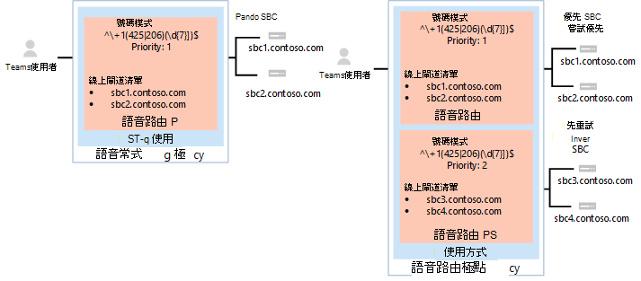

# <a name="configure-voice-routing-for-direct-routing"></a><span data-ttu-id="6cfbb-103">設定直接路由的語音路由</span><span class="sxs-lookup"><span data-stu-id="6cfbb-103">Configure voice routing for Direct Routing</span></span>

<span data-ttu-id="6cfbb-104">本文將說明如何設定電話系統直接路由的語音路由。</span><span class="sxs-lookup"><span data-stu-id="6cfbb-104">This article describes how to configure voice routing for Phone System Direct Routing.</span></span>  <span data-ttu-id="6cfbb-105">這是下列步驟中的步驟 3，用於配置直接路由：</span><span class="sxs-lookup"><span data-stu-id="6cfbb-105">This is step 3 of the following steps for configuring Direct Routing:</span></span>

- <span data-ttu-id="6cfbb-106">步驟 1。</span><span class="sxs-lookup"><span data-stu-id="6cfbb-106">Step 1.</span></span> [<span data-ttu-id="6cfbb-107">使用 Microsoft Phone 系統連接 SBC 並驗證連接</span><span class="sxs-lookup"><span data-stu-id="6cfbb-107">Connect the SBC with Microsoft Phone System and validate the connection</span></span>](direct-routing-connect-the-sbc.md) 
- <span data-ttu-id="6cfbb-108">步驟 2.</span><span class="sxs-lookup"><span data-stu-id="6cfbb-108">Step 2.</span></span> [<span data-ttu-id="6cfbb-109">啟用使用者進行直接路由、語音和語音信箱</span><span class="sxs-lookup"><span data-stu-id="6cfbb-109">Enable users for Direct Routing, voice, and voicemail</span></span>](direct-routing-enable-users.md)
- <span data-ttu-id="6cfbb-110">**步驟 3.設定語音路由** (本文) </span><span class="sxs-lookup"><span data-stu-id="6cfbb-110">**Step 3. Configure voice routing** (This article)</span></span>
- <span data-ttu-id="6cfbb-111">步驟 4.</span><span class="sxs-lookup"><span data-stu-id="6cfbb-111">Step 4.</span></span> [<span data-ttu-id="6cfbb-112">將數位轉換成替代格式</span><span class="sxs-lookup"><span data-stu-id="6cfbb-112">Translate numbers to an alternate format</span></span>](direct-routing-translate-numbers.md) 

<span data-ttu-id="6cfbb-113">若要瞭解設定直接路由所需的所有步驟，請參閱 [設定直接路由](direct-routing-configure.md)。</span><span class="sxs-lookup"><span data-stu-id="6cfbb-113">For information on all the steps required for setting up Direct Routing, see [Configure Direct Routing](direct-routing-configure.md).</span></span>

## <a name="voice-routing-overview"></a><span data-ttu-id="6cfbb-114">語音路由概觀</span><span class="sxs-lookup"><span data-stu-id="6cfbb-114">Voice routing overview</span></span>

<span data-ttu-id="6cfbb-115">Microsoft Phone System 具有路由機制，可讓通話傳送至特定會話邊界控制器 (SBC) 根據：</span><span class="sxs-lookup"><span data-stu-id="6cfbb-115">Microsoft Phone System has a routing mechanism that allows a call to be sent to a specific Session Border Controller (SBC) based on:</span></span> 

- <span data-ttu-id="6cfbb-116">稱為數位模式</span><span class="sxs-lookup"><span data-stu-id="6cfbb-116">The called number pattern</span></span> 
- <span data-ttu-id="6cfbb-117">所謂的號碼模式加上撥打電話的特定使用者</span><span class="sxs-lookup"><span data-stu-id="6cfbb-117">The called number pattern plus the specific user who makes the call</span></span>
 
<span data-ttu-id="6cfbb-118">SBCs 可指定為使用中和備份。</span><span class="sxs-lookup"><span data-stu-id="6cfbb-118">SBCs can be designated as active and backup.</span></span> <span data-ttu-id="6cfbb-119">當已配置為使用中 SBC 的 SBC 不適用於特定通話路由時，該通話會路由至備份 SBC。</span><span class="sxs-lookup"><span data-stu-id="6cfbb-119">When the SBC that is configured as active is not available for a specific call route, then the call will be routed to a backup SBC.</span></span>
 
<span data-ttu-id="6cfbb-120">語音路由由下列元素組成：</span><span class="sxs-lookup"><span data-stu-id="6cfbb-120">Voice routing is made up of the following elements:</span></span> 

- <span data-ttu-id="6cfbb-121">**語音路由策略** ： PSTN 使用方式的容器，可指派給使用者或多個使用者。</span><span class="sxs-lookup"><span data-stu-id="6cfbb-121">**Voice routing policy** – A container for PSTN usages, which can be assigned to a user or to multiple users.</span></span> 

- <span data-ttu-id="6cfbb-122">**PSTN 使用** 方式 ： 語音路由和 PSTN 使用方式的容器，可在不同的語音路由策略中共用。</span><span class="sxs-lookup"><span data-stu-id="6cfbb-122">**PSTN usages** – A container for voice routes and PSTN usages, which can be shared in different voice routing policies.</span></span> 

- <span data-ttu-id="6cfbb-123">**語音路由** ： 號碼模式和一組線上 PSTN 閘道，用於電話號碼符合該模式的通話。</span><span class="sxs-lookup"><span data-stu-id="6cfbb-123">**Voice routes** – A number pattern and set of online PSTN gateways to use for calls where the calling number matches the pattern.</span></span>

- <span data-ttu-id="6cfbb-124">**線上 PSTN** 閘道 - 指向 SBC 的指標，該指標也會儲存透過 SBC 進行通話時所適用之組式，例如轉寄 P-Identity (PAI) 編解碼器;可以新增到語音路由。</span><span class="sxs-lookup"><span data-stu-id="6cfbb-124">**Online PSTN gateway** - A pointer to an SBC that also stores the configuration that is applied when a call is placed through the SBC, such as forward P-Asserted-Identity (PAI) or Preferred Codecs; can be added to voice routes.</span></span>

## <a name="voice-routing-policy-considerations"></a><span data-ttu-id="6cfbb-125">語音路由策略考慮</span><span class="sxs-lookup"><span data-stu-id="6cfbb-125">Voice routing policy considerations</span></span>

<span data-ttu-id="6cfbb-126">如果使用者有通話方案授權，該使用者的外發通話會自動透過 Microsoft 通話方案 PSTN 基礎結構路由。</span><span class="sxs-lookup"><span data-stu-id="6cfbb-126">If a user has a Calling Plan license, that user’s outgoing calls are automatically routed through the Microsoft Calling Plan PSTN infrastructure.</span></span> <span data-ttu-id="6cfbb-127">如果您設定線上語音路由策略並指派給通話方案使用者，會檢查該使用者的外撥電話，以判斷撥號號碼是否符合線上語音路由策略中定義的號碼模式。</span><span class="sxs-lookup"><span data-stu-id="6cfbb-127">If you configure and assign an online voice routing policy to a Calling Plan user, that user’s outgoing calls are checked to determine whether the dialed number matches a number pattern defined in the online voice routing policy.</span></span> <span data-ttu-id="6cfbb-128">如果有相符專案，電話會透過直接路由主幹路由。</span><span class="sxs-lookup"><span data-stu-id="6cfbb-128">If there’s a match, the call is routed through the Direct Routing trunk.</span></span> <span data-ttu-id="6cfbb-129">如果沒有相符專案，通話會透過通話方案 PSTN 基礎結構路由。</span><span class="sxs-lookup"><span data-stu-id="6cfbb-129">If there’s no match, the call is routed through the Calling Plan PSTN infrastructure.</span></span>

> [!CAUTION]
> <span data-ttu-id="6cfbb-130">如果您設定並適用全域 (全組織的預設) 線上語音路由原則，貴組織中所有支援語音的使用者都會繼承該原則，這可能會導致從通話方案使用者的 PSTN 通話不小心路由到直接路由主幹。</span><span class="sxs-lookup"><span data-stu-id="6cfbb-130">If you configure and apply the global (Org-wide default) online voice routing policy, all voice-enabled users in your organization will inherit that policy, which may result in PSTN calls from Calling Plan users being inadvertently routed to a Direct Routing trunk.</span></span> <span data-ttu-id="6cfbb-131">如果您不希望所有使用者都使用全域線上語音路由策略，請設定自訂的線上語音路由策略，並將其指派給啟用語音的個別使用者。</span><span class="sxs-lookup"><span data-stu-id="6cfbb-131">If you don't want all users to use the global online voice routing policy, configure a custom online voice routing policy and assign it to individual voice-enabled users.</span></span>

## <a name="example-1-voice-routing-with-one-pstn-usage"></a><span data-ttu-id="6cfbb-132">範例 1：使用一個 PSTN 的語音路由</span><span class="sxs-lookup"><span data-stu-id="6cfbb-132">Example 1: Voice routing with one PSTN usage</span></span>

<span data-ttu-id="6cfbb-133">下圖顯示通話流程的兩個語音路由策略範例。</span><span class="sxs-lookup"><span data-stu-id="6cfbb-133">The following diagram shows two examples of voice routing policies in a call flow.</span></span>

<span data-ttu-id="6cfbb-134">**呼叫流程 1 (左側) ：** 如果使用者撥打 +1 425 XXX XX XX 或 +1 206 XXX XX XX，通話會路由至 SBC sbc1.contoso.biz 或 sbc2.contoso.biz。</span><span class="sxs-lookup"><span data-stu-id="6cfbb-134">**Call Flow 1 (on the left):** If a user makes a call to +1 425 XXX XX XX or +1 206 XXX XX XX, the call is routed to SBC sbc1.contoso.biz or sbc2.contoso.biz.</span></span> <span data-ttu-id="6cfbb-135">如果 sbc1.contoso.biz 或 sbc2.contoso.biz，通話會中斷。</span><span class="sxs-lookup"><span data-stu-id="6cfbb-135">If neither sbc1.contoso.biz nor sbc2.contoso.biz are available, the call is dropped.</span></span> 

<span data-ttu-id="6cfbb-136">**通話流程 2 (右側) ：** 如果使用者撥打 +1 425 XXX XX XX 或 +1 206 XXX XX XX，該通話會先路由至 SBC sbc1.contoso.biz 或 sbc2.contoso.biz。</span><span class="sxs-lookup"><span data-stu-id="6cfbb-136">**Call Flow 2 (on the right):** If a user makes a call to +1 425 XXX XX XX or +1 206 XXX XX XX, the call is first routed to SBC sbc1.contoso.biz or sbc2.contoso.biz.</span></span> <span data-ttu-id="6cfbb-137">如果兩者均無法使用 SBC，系統將會嘗試優先順序較低的路由， (sbc3.contoso.biz sbc4.contoso.biz) 。</span><span class="sxs-lookup"><span data-stu-id="6cfbb-137">If neither SBC is available, the route with lower priority will be tried (sbc3.contoso.biz and sbc4.contoso.biz).</span></span> <span data-ttu-id="6cfbb-138">如果沒有任何 SBCs 可用，系統即會中斷通話。</span><span class="sxs-lookup"><span data-stu-id="6cfbb-138">If none of the SBCs are available, the call is dropped.</span></span> 



<span data-ttu-id="6cfbb-140">在這兩個範例中，當語音路由被指派優先順序時，路由中的 SBC 會隨機嘗試。</span><span class="sxs-lookup"><span data-stu-id="6cfbb-140">In both examples, while the voice route is assigned priorities, the SBCs in the routes are tried in random order.</span></span>

  > [!NOTE]
  > <span data-ttu-id="6cfbb-141">除非使用者也擁有 Microsoft 通話方案授權，否則除了範例組式中符合模式 +1 425 XXX XX XX 或 +1 206 XXX XX XX 以外的任何號碼會中斷通話。</span><span class="sxs-lookup"><span data-stu-id="6cfbb-141">Unless the user also has a Microsoft Calling Plan license, calls to any number except numbers matching the patterns +1 425 XXX XX XX or +1 206 XXX XX XX in the example configuration are dropped.</span></span> <span data-ttu-id="6cfbb-142">如果使用者有通話方案授權，系統就會根據 Microsoft 通話方案的政策自動路由通話。</span><span class="sxs-lookup"><span data-stu-id="6cfbb-142">If the user has a Calling Plan license, the call is automatically routed according to the policies of the Microsoft Calling Plan.</span></span> <span data-ttu-id="6cfbb-143">Microsoft 通話方案會自動作為最後一個路由，適用于擁有 Microsoft 通話方案授權且不需要其他通話路由配置的所有使用者。</span><span class="sxs-lookup"><span data-stu-id="6cfbb-143">The Microsoft Calling Plan applies automatically as the last route to all users with the Microsoft Calling Plan license and does not require additional call routing configuration.</span></span>

<span data-ttu-id="6cfbb-144">在下列圖表所示的範例中，會新增語音路由，以將電話傳送給所有其他美國和加拿大號碼 (呼叫稱為號碼模式 +1 XXX XXX XX XX) 。</span><span class="sxs-lookup"><span data-stu-id="6cfbb-144">In the example shown in the following diagram, a voice route is added to send calls to all other US and Canadian numbers (calls that go to called number pattern +1 XXX XXX XX XX).</span></span>


<span data-ttu-id="6cfbb-146">對於所有其他通話，如果使用者同時擁有 Microsoft Phone system (Microsoft 通話方案) ，系統即會使用自動路由。</span><span class="sxs-lookup"><span data-stu-id="6cfbb-146">For all other calls, if a user has both licenses (Microsoft Phone System and Microsoft Calling Plan), the automatic route is used.</span></span> <span data-ttu-id="6cfbb-147">如果管理員所建立的線上語音路由中沒有任何符合號碼模式，則通話會透過 Microsoft 通話方案路由。</span><span class="sxs-lookup"><span data-stu-id="6cfbb-147">If nothing matches the number patterns in the administrator-created online voice routes, then the call is routed through Microsoft Calling Plan.</span></span> <span data-ttu-id="6cfbb-148">如果使用者只有 Microsoft Phone System，系統會因為找不到符合的規則而中斷通話。</span><span class="sxs-lookup"><span data-stu-id="6cfbb-148">If the user only has Microsoft Phone System, the call is dropped because no matching rules are available.</span></span>

  > [!NOTE]
  > <span data-ttu-id="6cfbb-149">在這種情況下，路由 「其他 +1」 的優先順序值並不重要，因為只有一個路由符合模式 +1 XXX XXX XX XX。</span><span class="sxs-lookup"><span data-stu-id="6cfbb-149">The Priority value for route "Other +1" doesn't matter in this case because there is only one route that matches the pattern +1 XXX XXX XX XX.</span></span> <span data-ttu-id="6cfbb-150">如果使用者撥打 +1 324 567 89 89，sbc5.contoso.biz 和 sbc6.contoso.biz，通話即會中斷。</span><span class="sxs-lookup"><span data-stu-id="6cfbb-150">If a user makes a call to +1 324 567 89 89 and both sbc5.contoso.biz and sbc6.contoso.biz are unavailable, the call is dropped.</span></span>

<span data-ttu-id="6cfbb-151">下表摘要列出使用三種語音路由的組態。</span><span class="sxs-lookup"><span data-stu-id="6cfbb-151">The following table summarizes the configuration using three voice routes.</span></span> <span data-ttu-id="6cfbb-152">在此範例中，這三個路由都是相同 PSTN 使用量的一部分，即「美國和加拿大」。</span><span class="sxs-lookup"><span data-stu-id="6cfbb-152">In this example, all three routes are part of the same PSTN usage, "US and Canada".</span></span>  <span data-ttu-id="6cfbb-153">所有路由都與「美國和加拿大」PSTN 使用量相關聯，而 PSTN 使用量則與「僅美國」語音路由政策相關聯。</span><span class="sxs-lookup"><span data-stu-id="6cfbb-153">All routes are associated with the "US and Canada" PSTN usage  and the PSTN usage is associated with the "US Only" voice routing policy.</span></span>

|<span data-ttu-id="6cfbb-154">**PSTN 使用量**</span><span class="sxs-lookup"><span data-stu-id="6cfbb-154">**PSTN usage**</span></span>|<span data-ttu-id="6cfbb-155">**語音路由**</span><span class="sxs-lookup"><span data-stu-id="6cfbb-155">**Voice route**</span></span>|<span data-ttu-id="6cfbb-156">**數位圖樣**</span><span class="sxs-lookup"><span data-stu-id="6cfbb-156">**Number pattern**</span></span>|<span data-ttu-id="6cfbb-157">**優先**</span><span class="sxs-lookup"><span data-stu-id="6cfbb-157">**Priority**</span></span>|<span data-ttu-id="6cfbb-158">**Sbc**</span><span class="sxs-lookup"><span data-stu-id="6cfbb-158">**SBC**</span></span>|<span data-ttu-id="6cfbb-159">**描述**</span><span class="sxs-lookup"><span data-stu-id="6cfbb-159">**Description**</span></span>|
|:-----|:-----|:-----|:-----|:-----|:-----|
|<span data-ttu-id="6cfbb-160">美國和加拿大</span><span class="sxs-lookup"><span data-stu-id="6cfbb-160">US and Canada</span></span>|<span data-ttu-id="6cfbb-161">"Redmond 1"</span><span class="sxs-lookup"><span data-stu-id="6cfbb-161">"Redmond 1"</span></span>|<span data-ttu-id="6cfbb-162">^\\+1 (425 \| 206)  (\d {7}) $</span><span class="sxs-lookup"><span data-stu-id="6cfbb-162">^\\+1(425\|206)(\d{7})$</span></span>|<span data-ttu-id="6cfbb-163">1</span><span class="sxs-lookup"><span data-stu-id="6cfbb-163">1</span></span>|<span data-ttu-id="6cfbb-164">sbc1.contoso.biz</span><span class="sxs-lookup"><span data-stu-id="6cfbb-164">sbc1.contoso.biz</span></span><br/><span data-ttu-id="6cfbb-165">sbc2.contoso.biz</span><span class="sxs-lookup"><span data-stu-id="6cfbb-165">sbc2.contoso.biz</span></span>|<span data-ttu-id="6cfbb-166">稱為號碼的主動路由 +1 425 XXX XX XX 或 +1 206 XXX XX XX</span><span class="sxs-lookup"><span data-stu-id="6cfbb-166">Active route for called numbers +1 425 XXX XX XX or +1 206 XXX XX XX</span></span>|
|<span data-ttu-id="6cfbb-167">美國和加拿大</span><span class="sxs-lookup"><span data-stu-id="6cfbb-167">US and Canada</span></span>|<span data-ttu-id="6cfbb-168">"Redmond 2"</span><span class="sxs-lookup"><span data-stu-id="6cfbb-168">"Redmond 2"</span></span>|<span data-ttu-id="6cfbb-169">^\\+1 (425 \| 206)  (\d {7}) $</span><span class="sxs-lookup"><span data-stu-id="6cfbb-169">^\\+1(425\|206)(\d{7})$</span></span>|<span data-ttu-id="6cfbb-170">2</span><span class="sxs-lookup"><span data-stu-id="6cfbb-170">2</span></span>|<span data-ttu-id="6cfbb-171">sbc3.contoso.biz</span><span class="sxs-lookup"><span data-stu-id="6cfbb-171">sbc3.contoso.biz</span></span><br/><span data-ttu-id="6cfbb-172">sbc4.contoso.biz</span><span class="sxs-lookup"><span data-stu-id="6cfbb-172">sbc4.contoso.biz</span></span>|<span data-ttu-id="6cfbb-173">稱為號碼的備份路由 +1 425 XXX XX XX 或 +1 206 XXX XX XX</span><span class="sxs-lookup"><span data-stu-id="6cfbb-173">Backup route for called numbers +1 425 XXX XX XX or +1 206 XXX XX XX</span></span>|
|<span data-ttu-id="6cfbb-174">美國和加拿大</span><span class="sxs-lookup"><span data-stu-id="6cfbb-174">US and Canada</span></span>|<span data-ttu-id="6cfbb-175">「其他 +1」</span><span class="sxs-lookup"><span data-stu-id="6cfbb-175">"Other +1"</span></span>|<span data-ttu-id="6cfbb-176">^\\+1 (\d {10}) $</span><span class="sxs-lookup"><span data-stu-id="6cfbb-176">^\\+1(\d{10})$</span></span>|<span data-ttu-id="6cfbb-177">3</span><span class="sxs-lookup"><span data-stu-id="6cfbb-177">3</span></span>|<span data-ttu-id="6cfbb-178">sbc5.contoso.biz</span><span class="sxs-lookup"><span data-stu-id="6cfbb-178">sbc5.contoso.biz</span></span><br/><span data-ttu-id="6cfbb-179">sbc6.contoso.biz</span><span class="sxs-lookup"><span data-stu-id="6cfbb-179">sbc6.contoso.biz</span></span>|<span data-ttu-id="6cfbb-180">除了 + (1 425 XXX XX XX 或 +1 206 XXX XX XX) </span><span class="sxs-lookup"><span data-stu-id="6cfbb-180">Route for called numbers +1 XXX XXX XX XX (except +1 425 XXX XX XX or +1 206 XXX XX XX)</span></span>|
|||||||

## <a name="example-1-configuration-steps"></a><span data-ttu-id="6cfbb-181">範例 1：組組步驟</span><span class="sxs-lookup"><span data-stu-id="6cfbb-181">Example 1: Configuration steps</span></span>

<span data-ttu-id="6cfbb-182">下列範例顯示如何：</span><span class="sxs-lookup"><span data-stu-id="6cfbb-182">The following example shows how to:</span></span>

1. <span data-ttu-id="6cfbb-183">建立單一 PSTN 使用量。</span><span class="sxs-lookup"><span data-stu-id="6cfbb-183">Create a single PSTN usage.</span></span>
2. <span data-ttu-id="6cfbb-184">設定三個語音路由。</span><span class="sxs-lookup"><span data-stu-id="6cfbb-184">Configure three voice routes.</span></span>
3. <span data-ttu-id="6cfbb-185">建立語音路由策略。</span><span class="sxs-lookup"><span data-stu-id="6cfbb-185">Create a voice routing policy.</span></span>
4. <span data-ttu-id="6cfbb-186">將策略指派給名為 Spencer Low 的使用者。</span><span class="sxs-lookup"><span data-stu-id="6cfbb-186">Assign the policy to a user named Spencer Low.</span></span>

<span data-ttu-id="6cfbb-187">您可以使用 Microsoft [Teams 系統管理中心或](#admincenterexample1) [PowerShell](#powershellexample1) 來執行這些步驟。</span><span class="sxs-lookup"><span data-stu-id="6cfbb-187">You can use the [Microsoft Teams admin center](#admincenterexample1) or [PowerShell](#powershellexample1) to perform these steps.</span></span>

### <a name="using-the-microsoft-teams-admin-center"></a><span data-ttu-id="6cfbb-188">使用 Microsoft Teams 系統管理中心</span><span class="sxs-lookup"><span data-stu-id="6cfbb-188">Using the Microsoft Teams admin center</span></span>
<a name="admincenterexample1"></a>

#### <a name="step-1-create-the-us-and-canada-pstn-usage"></a><span data-ttu-id="6cfbb-189">步驟 1：建立「美國和加拿大」PSTN 使用量</span><span class="sxs-lookup"><span data-stu-id="6cfbb-189">Step 1: Create the "US and Canada" PSTN usage</span></span>

1. <span data-ttu-id="6cfbb-190">在 Microsoft Teams 系統管理中心的左側導航中，前往 **[語音** 直接路由>，然後在右上角選取 [  >  \*\*\*\*\*\*管理 PSTN 使用記錄\*\*> 。</span><span class="sxs-lookup"><span data-stu-id="6cfbb-190">In the left navigation of the Microsoft Teams admin center, go to **Voice** > **Direct Routing**, and then in the upper-right corner, select **Manage PSTN usage records**.</span></span>
2. <span data-ttu-id="6cfbb-191">按一下 **[新增**，**輸入美國和加拿大**，然後按一下 **[Apply.**</span><span class="sxs-lookup"><span data-stu-id="6cfbb-191">Click **Add**, type **US and Canada**, and then click **Apply**.</span></span>

#### <a name="step-2-create-three-voice-routes-redmond-1-redmond-2-and-other-1"></a><span data-ttu-id="6cfbb-192">步驟 2：建立三個語音路由 (Redmond 1、Redmond 2 和其他 +1) </span><span class="sxs-lookup"><span data-stu-id="6cfbb-192">Step 2: Create three voice routes (Redmond 1, Redmond 2, and Other +1)</span></span>

<span data-ttu-id="6cfbb-193">下列步驟說明如何建立語音路由。</span><span class="sxs-lookup"><span data-stu-id="6cfbb-193">The following steps describe how to create a voice route.</span></span> <span data-ttu-id="6cfbb-194">使用這些步驟，使用上一個資料表中概述的設定，針對此範例建立名為 Redmond 1、Redmond 2 和 Other +1 的三個語音路由。</span><span class="sxs-lookup"><span data-stu-id="6cfbb-194">Use these steps to create the three voice routes named Redmond 1, Redmond 2, and Other +1 for this example by using the settings outlined in the earlier table.</span></span>

1. <span data-ttu-id="6cfbb-195">在 Microsoft Teams 系統管理中心的左側流覽中，前往 **語音**  >  **直接路由**，然後選取 **語音路由定位** 點。</span><span class="sxs-lookup"><span data-stu-id="6cfbb-195">In the left navigation of the Microsoft Teams admin center, go to **Voice** > **Direct Routing**, and then select the **Voice routes** tab.</span></span>
2. <span data-ttu-id="6cfbb-196">按一下 **[新增**」，然後輸入語音路由的名稱和描述。</span><span class="sxs-lookup"><span data-stu-id="6cfbb-196">Click **Add**, and then enter a name and description for the voice route.</span></span>
3. <span data-ttu-id="6cfbb-197">設定優先順序並指定撥號號碼模式。</span><span class="sxs-lookup"><span data-stu-id="6cfbb-197">Set the priority and specify the dialed number pattern.</span></span>
4. <span data-ttu-id="6cfbb-198">若要使用語音路由註冊 SBC，請在註冊 (選擇性) 的 **SBC** 下，按一下 [新增 SBC，選取您想要註冊的 **SBC，** 然後按一下 [ **申請**> 。</span><span class="sxs-lookup"><span data-stu-id="6cfbb-198">To enroll an SBC with the voice route, under **SBCs enrolled (optional)**, click **Add SBCs**, select the SBCs you want to enroll, and then click **Apply**.</span></span>
5. <span data-ttu-id="6cfbb-199">若要新增 PSTN 使用量記錄，請在 **PSTN** 使用記錄 (選擇性) 下，按一下 [新增 **PSTN** 使用量，選取您想要新增的 PSTN 記錄，然後按一下 **[Apply.**</span><span class="sxs-lookup"><span data-stu-id="6cfbb-199">To add PSTN usage records, under **PSTN usage records (optional)**, click **Add PSTN usage**, select the PSTN records you want to add, and then click **Apply**.</span></span>
6. <span data-ttu-id="6cfbb-200">按一下 [儲存]。</span><span class="sxs-lookup"><span data-stu-id="6cfbb-200">Click **Save**.</span></span>

#### <a name="step-3-create-a-voice-routing-policy-named-us-only-and-add-the-us-and-canada-pstn-usage-to-the-policy"></a><span data-ttu-id="6cfbb-201">步驟 3：建立名為「僅美國」的語音路由策略，並新增「美國和加拿大」PSTN 使用方式至該政策</span><span class="sxs-lookup"><span data-stu-id="6cfbb-201">Step 3: Create a voice routing policy named "US Only" and add the "US and Canada" PSTN usage to the policy</span></span>

1. <span data-ttu-id="6cfbb-202">在 Microsoft Teams 系統管理中心的左側導航中，前往 **[**  >  **語音語音路由規則**，然後按一下 [**新增**> 。</span><span class="sxs-lookup"><span data-stu-id="6cfbb-202">In the left navigation of the Microsoft Teams admin center, go to **Voice** > **Voice routing policies**, and then click **Add**.</span></span>
2. <span data-ttu-id="6cfbb-203">輸入 **US Only** 做為名稱並新增描述。</span><span class="sxs-lookup"><span data-stu-id="6cfbb-203">Type **US Only** as the name and add a description.</span></span>
3. <span data-ttu-id="6cfbb-204">在 **PSTN 使用量記錄下**，按一下 [ **新增 PSTN 使用量**，選取 「美國和加拿大」PSTN 使用記錄，然後按一下 [ **適用**> 。</span><span class="sxs-lookup"><span data-stu-id="6cfbb-204">Under **PSTN usage records**, click **Add PSTN usage**, select the "US and Canada" PSTN usage record, and then click **Apply**.</span></span>
4. <span data-ttu-id="6cfbb-205">按一下 [儲存]。</span><span class="sxs-lookup"><span data-stu-id="6cfbb-205">Click **Save**.</span></span>

<span data-ttu-id="6cfbb-206">若要深入瞭解，請參閱管理 [語音路由策略](manage-voice-routing-policies.md)。</span><span class="sxs-lookup"><span data-stu-id="6cfbb-206">To learn more, see [Manage voice routing policies](manage-voice-routing-policies.md).</span></span>

#### <a name="step-4-assign-the-voice-routing-policy-to-a-user-named-spencer-low"></a><span data-ttu-id="6cfbb-207">步驟 4：將語音路由策略指派給名為 Spencer Low 的使用者</span><span class="sxs-lookup"><span data-stu-id="6cfbb-207">Step 4: Assign the voice routing policy to a user named Spencer Low</span></span>

1. <span data-ttu-id="6cfbb-208">在 Microsoft Teams 系統管理中心的左側瀏覽窗格中，移至 [使用者]，然後按一下該使用者。</span><span class="sxs-lookup"><span data-stu-id="6cfbb-208">In the left navigation of the Microsoft Teams admin center, go to **Users**, and then click the user.</span></span>
2. <span data-ttu-id="6cfbb-209">按一下 **[政策**」，然後按一下 [ **已指派之策略>** 旁的 [ **編輯**> 。</span><span class="sxs-lookup"><span data-stu-id="6cfbb-209">Click **Policies**, and then next to **Assigned policies**, click **Edit**.</span></span>
3. <span data-ttu-id="6cfbb-210">在 **[語音路由策略>** 下，選取 [僅適用于美國」政策，然後按一下 [ **儲存**。</span><span class="sxs-lookup"><span data-stu-id="6cfbb-210">Under **Voice routing policy**, select the "US Only" policy, and then click **Save**.</span></span>

<span data-ttu-id="6cfbb-211">若要深入瞭解，請參閱管理 [語音路由策略](manage-voice-routing-policies.md)。</span><span class="sxs-lookup"><span data-stu-id="6cfbb-211">To learn more, see [Manage voice routing policies](manage-voice-routing-policies.md).</span></span>

### <a name="using-powershell"></a><span data-ttu-id="6cfbb-212">使用 PowerShell</span><span class="sxs-lookup"><span data-stu-id="6cfbb-212">Using PowerShell</span></span>
<a name="powershellexample1"></a>


#### <a name="step-1-create-the-us-and-canada-pstn-usage"></a><span data-ttu-id="6cfbb-213">步驟 1：建立「美國和加拿大」PSTN 使用量</span><span class="sxs-lookup"><span data-stu-id="6cfbb-213">Step 1: Create the "US and Canada" PSTN usage</span></span>

<span data-ttu-id="6cfbb-214">在商務用 Skype Online 中的遠端 PowerShell 會話中，輸入：</span><span class="sxs-lookup"><span data-stu-id="6cfbb-214">In a remote PowerShell session in Skype for Business Online, type:</span></span>

```PowerShell
Set-CsOnlinePstnUsage -Identity Global -Usage @{Add="US and Canada"}
```

<span data-ttu-id="6cfbb-215">確認使用方式是輸入：</span><span class="sxs-lookup"><span data-stu-id="6cfbb-215">Verify that the usage was created by entering:</span></span>

```PowerShell
Get-CSOnlinePSTNUsage
``` 

<span data-ttu-id="6cfbb-216">會返回可能會被截斷的名稱清單：</span><span class="sxs-lookup"><span data-stu-id="6cfbb-216">Which returns a list of names that may be truncated:</span></span>

```console
Identity    : Global
Usage        : {testusage, US and Canada, International, karlUsage. . .}
```

<span data-ttu-id="6cfbb-217">下列範例顯示執行 PowerShell 命令以顯示完整名稱 (`(Get-CSOnlinePSTNUsage).usage` 未) ：</span><span class="sxs-lookup"><span data-stu-id="6cfbb-217">The following example shows the result of running the `(Get-CSOnlinePSTNUsage).usage` PowerShell command to display full names (not truncated):</span></span>

```console
 testusage
 US and Canada
 International
 karlUsage
 New test env
 Tallinn Lab Sonus
 karlUsage2
 Unrestricted
 Two trunks
```

#### <a name="step-2-create-three-voice-routes-redmond-1-redmond-2-and-other-1"></a><span data-ttu-id="6cfbb-218">步驟 2：建立三個語音路由 (Redmond 1、Redmond 2 和其他 +1) </span><span class="sxs-lookup"><span data-stu-id="6cfbb-218">Step 2: Create three voice routes (Redmond 1, Redmond 2, and Other +1)</span></span>

<span data-ttu-id="6cfbb-219">若要建立「Redmond 1」路由，請在商務用 Skype Online 的 PowerShell 會話中輸入：</span><span class="sxs-lookup"><span data-stu-id="6cfbb-219">To create the "Redmond 1" route, in a PowerShell session in Skype for Business Online, enter:</span></span>

```PowerShell
New-CsOnlineVoiceRoute -Identity "Redmond 1" -NumberPattern "^\+1(425|206)
(\d{7})$" -OnlinePstnGatewayList sbc1.contoso.biz, sbc2.contoso.biz -Priority 1 -OnlinePstnUsages "US and Canada"
```

<span data-ttu-id="6cfbb-220">這會返回：</span><span class="sxs-lookup"><span data-stu-id="6cfbb-220">Which returns:</span></span>

```console
Identity                : Redmond 1
Priority                : 1
Description             :
NumberPattern           : ^\+1(425|206) (\d{7})$
OnlinePstnUsages        : {US and Canada}
OnlinePstnGatewayList   : {sbc1.contoso.biz, sbc2.contoso.biz}
Name                    : Redmond 1
```

<span data-ttu-id="6cfbb-221">若要建立 Redmond 2 路由，請輸入：</span><span class="sxs-lookup"><span data-stu-id="6cfbb-221">To create the Redmond 2 route, enter:</span></span>

```PowerShell
New-CsOnlineVoiceRoute -Identity "Redmond 2" -NumberPattern "^\+1(425|206)
(\d{7})$" -OnlinePstnGatewayList sbc3.contoso.biz, sbc4.contoso.biz -Priority 2 -OnlinePstnUsages "US and Canada"
```

<span data-ttu-id="6cfbb-222">若要建立其他 +1 路由，請輸入：</span><span class="sxs-lookup"><span data-stu-id="6cfbb-222">To create the Other +1 route, enter:</span></span>

```PowerShell
New-CsOnlineVoiceRoute -Identity "Other +1" -NumberPattern "^\+1(\d{10})$"
-OnlinePstnGatewayList sbc5.contoso.biz, sbc6.contoso.biz -OnlinePstnUsages "US and Canada"
```

  > [!CAUTION]
  > <span data-ttu-id="6cfbb-223">請確定 NumberPattern 屬性中的正則運算式是有效的運算式。</span><span class="sxs-lookup"><span data-stu-id="6cfbb-223">Make sure that your regular expression in the NumberPattern attribute is a valid expression.</span></span> <span data-ttu-id="6cfbb-224">您可以使用這個網站來測試： [https://www.regexpal.com](https://www.regexpal.com)</span><span class="sxs-lookup"><span data-stu-id="6cfbb-224">You can test it using this website: [https://www.regexpal.com](https://www.regexpal.com)</span></span>

<span data-ttu-id="6cfbb-225">在某些情況下，需要將所有通話路由至同一個 SBC;use -NumberPattern ".\*"</span><span class="sxs-lookup"><span data-stu-id="6cfbb-225">In some cases, there is a need to route all calls to the same SBC; use -NumberPattern ".\*"</span></span>

<span data-ttu-id="6cfbb-226">將所有通話路由至相同的 SBC。</span><span class="sxs-lookup"><span data-stu-id="6cfbb-226">Route all calls to the same SBC.</span></span>

```PowerShell
Set-CsOnlineVoiceRoute -id "Redmond 1" -NumberPattern ".*" -OnlinePstnGatewayList sbc1.contoso.biz
```

<span data-ttu-id="6cfbb-227">使用選項執行 PowerShell 命令，確認您正確配置路由， `Get-CSOnlineVoiceRoute` 如下所示：</span><span class="sxs-lookup"><span data-stu-id="6cfbb-227">Verify that you've correctly configured the route by running the `Get-CSOnlineVoiceRoute` PowerShell command using options as shown:</span></span>

```PowerShell
Get-CsOnlineVoiceRoute | Where-Object {($_.priority -eq 1) -or ($_.priority -eq 2) or ($_.priority -eq 4) -Identity "Redmond 1" -NumberPattern "^\+1(425|206) (\d{7})$" -OnlinePstnGatewayList sbc1.contoso.biz, sbc2.contoso.biz -Priority 1 -OnlinePstnUsages "US and Canada"
```
<span data-ttu-id="6cfbb-228">應該會返回：</span><span class="sxs-lookup"><span data-stu-id="6cfbb-228">Which should return:</span></span>

```console
Identity            : Redmond 1 
Priority               : 1
Description         : 
NumberPattern         : ^\+1(425|206) (\d{7})$
OnlinePstnUsages     : {US and Canada}     
OnlinePstnGatewayList    : {sbc1.contoso.biz, sbc2.contoso.biz}
Name             : Redmond 1
Identity        : Redmond 2 
Priority               : 2
Description         : 
NumberPattern         : ^\+1(425|206) (\d{7})$
OnlinePstnUsages     : {US and Canada}     
OnlinePstnGatewayList    : {sbc3.contoso.biz, sbc4.contoso.biz}
Name             : Redmond 2
    
Identity        : Other +1 
Priority               : 4
Description         : 
NumberPattern         : ^\+1(\d{10})$
OnlinePstnUsages     : {US and Canada}     
OnlinePstnGatewayList    : {sbc5.contoso.biz, sbc6.contoso.biz}
Name             : Other +1
```

<span data-ttu-id="6cfbb-229">在範例中，路由「其他 +1」已自動指派優先順序 4。</span><span class="sxs-lookup"><span data-stu-id="6cfbb-229">In the example, the route "Other +1" was automatically assigned priority 4.</span></span> 

#### <a name="step-3-create-a-voice-routing-policy-named-us-only-and-add-the-us-and-canada-pstn-usage-to-the-policy"></a><span data-ttu-id="6cfbb-230">步驟 3：建立名為「僅美國」的語音路由策略，並新增「美國和加拿大」PSTN 使用方式至該政策</span><span class="sxs-lookup"><span data-stu-id="6cfbb-230">Step 3: Create a voice routing policy named "US Only" and add the "US and Canada" PSTN usage to the policy</span></span>

<span data-ttu-id="6cfbb-231">在商務用 Skype Online 的 PowerShell 會話中，輸入：</span><span class="sxs-lookup"><span data-stu-id="6cfbb-231">In a PowerShell session in Skype for Business Online, type:</span></span>

```PowerShell
New-CsOnlineVoiceRoutingPolicy "US Only" -OnlinePstnUsages "US and Canada"
```

<span data-ttu-id="6cfbb-232">此範例顯示結果：</span><span class="sxs-lookup"><span data-stu-id="6cfbb-232">The result is shown in this example:</span></span>

```console
Identity            : Tag:US only
OnlinePstnUsages    : {US and Canada}
Description         :
RouteType           : BYOT
```

#### <a name="step-4-assign-the-voice-routing-policy-to-a-user-named-spencer-low"></a><span data-ttu-id="6cfbb-233">步驟 4：將語音路由策略指派給名為 Spencer Low 的使用者</span><span class="sxs-lookup"><span data-stu-id="6cfbb-233">Step 4: Assign the voice routing policy to a user named Spencer Low</span></span>

<span data-ttu-id="6cfbb-234">在商務用 Skype Online 的 PowerShell 會話中，輸入：</span><span class="sxs-lookup"><span data-stu-id="6cfbb-234">In a PowerShell session in Skype for Business Online, type:</span></span>

```PowerShell
Grant-CsOnlineVoiceRoutingPolicy -Identity "Spencer Low" -PolicyName "US Only"
```

<span data-ttu-id="6cfbb-235">輸入此命令以驗證策略指派：</span><span class="sxs-lookup"><span data-stu-id="6cfbb-235">Validate the policy assignment by entering this command:</span></span>

```PowerShell
Get-CsOnlineUser "Spencer Low" | select OnlineVoiceRoutingPolicy
```

<span data-ttu-id="6cfbb-236">命令會返回下列專案：</span><span class="sxs-lookup"><span data-stu-id="6cfbb-236">The command returns the following:</span></span>

```console
OnlineVoiceRoutingPolicy
---------------------
US Only
```

## <a name="example-2-voice-routing-with-multiple-pstn-usages"></a><span data-ttu-id="6cfbb-237">範例 2：使用多個 PSTN 使用方式的語音路由</span><span class="sxs-lookup"><span data-stu-id="6cfbb-237">Example 2: Voice routing with multiple PSTN usages</span></span>

<span data-ttu-id="6cfbb-238">在範例 1 中建立的聲音路由策略只允許撥打美國和加拿大的電話號碼，除非 Microsoft 通話方案授權也指派給使用者。</span><span class="sxs-lookup"><span data-stu-id="6cfbb-238">The voice routing policy created in Example 1 only allows calls to phone numbers in the US and Canada--unless the Microsoft Calling Plan license is also assigned to the user.</span></span>

<span data-ttu-id="6cfbb-239">在以下範例中，您可以建立「無限制」語音路由策略。</span><span class="sxs-lookup"><span data-stu-id="6cfbb-239">In the example that follows, you can create the "No Restrictions" voice routing policy.</span></span> <span data-ttu-id="6cfbb-240">此政策會重複使用在範例 1 中建立「美國和加拿大」PSTN 使用方式，以及新的「國際」PSTN 使用量。</span><span class="sxs-lookup"><span data-stu-id="6cfbb-240">The policy reuses the "US and Canada" PSTN usage created in Example 1, as well as the new "International" PSTN usage.</span></span> <span data-ttu-id="6cfbb-241">此策略會路由所有其他通話至 SBC sbc2.contoso.biz sbc5.contoso.biz。</span><span class="sxs-lookup"><span data-stu-id="6cfbb-241">This policy routes all other calls to the SBCs sbc2.contoso.biz and sbc5.contoso.biz.</span></span>

<span data-ttu-id="6cfbb-242">顯示的範例將 US Only 策略指派給使用者 Spencer Low，以及無限制策略指派給使用者 John Woods，讓路由執行方式如下：</span><span class="sxs-lookup"><span data-stu-id="6cfbb-242">The examples that are shown assign the US Only policy to user Spencer Low, and the No Restrictions policy to the user John Woods so that routing occurs as follows:</span></span>

- <span data-ttu-id="6cfbb-243">Spencer Low – 僅美國政策。</span><span class="sxs-lookup"><span data-stu-id="6cfbb-243">Spencer Low – US Only policy.</span></span>  <span data-ttu-id="6cfbb-244">只能撥打美國和加拿大號碼。</span><span class="sxs-lookup"><span data-stu-id="6cfbb-244">Calls are allowed only to US and Canadian numbers.</span></span> <span data-ttu-id="6cfbb-245">撥打至 Redmond 號碼範圍時，必須使用一組特定的 SBC。</span><span class="sxs-lookup"><span data-stu-id="6cfbb-245">When calling to the Redmond number range, the specific set of SBCs must be used.</span></span> <span data-ttu-id="6cfbb-246">除非指派通話方案授權給使用者，否則不會路由非美國號碼。</span><span class="sxs-lookup"><span data-stu-id="6cfbb-246">Non-US numbers will not be routed unless the Calling Plan license is assigned to the user.</span></span>

- <span data-ttu-id="6cfbb-247">John Woods – 國際政策。</span><span class="sxs-lookup"><span data-stu-id="6cfbb-247">John Woods – International policy.</span></span>  <span data-ttu-id="6cfbb-248">任何號碼都允許通話。</span><span class="sxs-lookup"><span data-stu-id="6cfbb-248">Calls are allowed to any number.</span></span> <span data-ttu-id="6cfbb-249">撥打至 Redmond 號碼範圍時，必須使用一組特定的 SBC。</span><span class="sxs-lookup"><span data-stu-id="6cfbb-249">When calling to the Redmond number range, the specific set of SBCs must be used.</span></span> <span data-ttu-id="6cfbb-250">非美國號碼會使用 sbc2.contoso.biz sbc5.contoso.biz。</span><span class="sxs-lookup"><span data-stu-id="6cfbb-250">Non-US numbers will be routed using sbc2.contoso.biz and sbc5.contoso.biz.</span></span>


<span data-ttu-id="6cfbb-252">對於所有其他通話，如果使用者同時擁有 Microsoft Phone system (Microsoft 通話方案) ，則系統會使用自動路由。</span><span class="sxs-lookup"><span data-stu-id="6cfbb-252">For all other calls, if a user has both licenses (Microsoft Phone System and Microsoft Calling Plan), automatic route is used.</span></span> <span data-ttu-id="6cfbb-253">如果管理員所建立的線上語音路由中沒有任何符合號碼模式，則通話會使用 Microsoft 通話方案路由。</span><span class="sxs-lookup"><span data-stu-id="6cfbb-253">If nothing matches the number patterns in the administrator-created online voice routes, then the call is routed using Microsoft Calling Plan.</span></span>  <span data-ttu-id="6cfbb-254">如果使用者只有 Microsoft Phone System，系統會因為找不到符合的規則而中斷通話。</span><span class="sxs-lookup"><span data-stu-id="6cfbb-254">If the user has only Microsoft Phone System, the call is dropped because no matching rules are available.</span></span>


<span data-ttu-id="6cfbb-256">下表摘要列出路由策略「無限制」的使用指定和語音路由。</span><span class="sxs-lookup"><span data-stu-id="6cfbb-256">The following table summarizes routing policy "No Restrictions" usage designations and voice routes.</span></span> 

| <span data-ttu-id="6cfbb-257">PSTN 使用量</span><span class="sxs-lookup"><span data-stu-id="6cfbb-257">PSTN usage</span></span> | <span data-ttu-id="6cfbb-258">語音路由</span><span class="sxs-lookup"><span data-stu-id="6cfbb-258">Voice route</span></span> | <span data-ttu-id="6cfbb-259">數位圖樣</span><span class="sxs-lookup"><span data-stu-id="6cfbb-259">Number pattern</span></span> | <span data-ttu-id="6cfbb-260">優先</span><span class="sxs-lookup"><span data-stu-id="6cfbb-260">Priority</span></span> | <span data-ttu-id="6cfbb-261">Sbc</span><span class="sxs-lookup"><span data-stu-id="6cfbb-261">SBC</span></span> | <span data-ttu-id="6cfbb-262">描述</span><span class="sxs-lookup"><span data-stu-id="6cfbb-262">Description</span></span> |
|:-----|:-----|:-----|:-----|:-----|:-----|
|<span data-ttu-id="6cfbb-263">美國和加拿大</span><span class="sxs-lookup"><span data-stu-id="6cfbb-263">US and Canada</span></span>|<span data-ttu-id="6cfbb-264">"Redmond 1"</span><span class="sxs-lookup"><span data-stu-id="6cfbb-264">"Redmond 1"</span></span>|<span data-ttu-id="6cfbb-265">^\\+1 (425 \| 206)  (\d {7}) $</span><span class="sxs-lookup"><span data-stu-id="6cfbb-265">^\\+1(425\|206)(\d{7})$</span></span>|<span data-ttu-id="6cfbb-266">1</span><span class="sxs-lookup"><span data-stu-id="6cfbb-266">1</span></span>|<span data-ttu-id="6cfbb-267">sbc1.contoso.biz</span><span class="sxs-lookup"><span data-stu-id="6cfbb-267">sbc1.contoso.biz</span></span><br/><span data-ttu-id="6cfbb-268">sbc2.contoso.biz</span><span class="sxs-lookup"><span data-stu-id="6cfbb-268">sbc2.contoso.biz</span></span>|<span data-ttu-id="6cfbb-269">通話者號碼的活動路由 +1 425 XXX XX 或 +1 206 XXX XX</span><span class="sxs-lookup"><span data-stu-id="6cfbb-269">Active route for callee numbers +1 425 XXX XX XX or +1 206 XXX XX XX</span></span>|
|<span data-ttu-id="6cfbb-270">美國和加拿大</span><span class="sxs-lookup"><span data-stu-id="6cfbb-270">US and Canada</span></span>|<span data-ttu-id="6cfbb-271">"Redmond 2"</span><span class="sxs-lookup"><span data-stu-id="6cfbb-271">"Redmond 2"</span></span>|<span data-ttu-id="6cfbb-272">^\\+1 (425 \| 206)  (\d {7}) $</span><span class="sxs-lookup"><span data-stu-id="6cfbb-272">^\\+1(425\|206)(\d{7})$</span></span>|<span data-ttu-id="6cfbb-273">2</span><span class="sxs-lookup"><span data-stu-id="6cfbb-273">2</span></span>|<span data-ttu-id="6cfbb-274">sbc3.contoso.biz</span><span class="sxs-lookup"><span data-stu-id="6cfbb-274">sbc3.contoso.biz</span></span><br/><span data-ttu-id="6cfbb-275">sbc4.contoso.biz</span><span class="sxs-lookup"><span data-stu-id="6cfbb-275">sbc4.contoso.biz</span></span>|<span data-ttu-id="6cfbb-276">通話者號碼的備份路由 +1 425 XXX XX 或 +1 206 XXX XX</span><span class="sxs-lookup"><span data-stu-id="6cfbb-276">Backup route for callee numbers +1 425 XXX XX XX or +1 206 XXX XX XX</span></span>|
|<span data-ttu-id="6cfbb-277">美國和加拿大</span><span class="sxs-lookup"><span data-stu-id="6cfbb-277">US and Canada</span></span>|<span data-ttu-id="6cfbb-278">「其他 +1」</span><span class="sxs-lookup"><span data-stu-id="6cfbb-278">"Other +1"</span></span>|<span data-ttu-id="6cfbb-279">^\\+1 (\d {10}) $</span><span class="sxs-lookup"><span data-stu-id="6cfbb-279">^\\+1(\d{10})$</span></span>|<span data-ttu-id="6cfbb-280">3</span><span class="sxs-lookup"><span data-stu-id="6cfbb-280">3</span></span>|<span data-ttu-id="6cfbb-281">sbc5.contoso.biz</span><span class="sxs-lookup"><span data-stu-id="6cfbb-281">sbc5.contoso.biz</span></span><br/><span data-ttu-id="6cfbb-282">sbc6.contoso.biz</span><span class="sxs-lookup"><span data-stu-id="6cfbb-282">sbc6.contoso.biz</span></span>|<span data-ttu-id="6cfbb-283">通話者號碼 +1 XXX XXX XX XX (除了 +1 425 XXX XX XX 或 +1 206 XXX XX XX) </span><span class="sxs-lookup"><span data-stu-id="6cfbb-283">Route for callee numbers +1 XXX XXX XX XX (except +1 425 XXX XX XX or +1 206 XXX XX XX)</span></span>|
|<span data-ttu-id="6cfbb-284">國際</span><span class="sxs-lookup"><span data-stu-id="6cfbb-284">International</span></span>|<span data-ttu-id="6cfbb-285">國際</span><span class="sxs-lookup"><span data-stu-id="6cfbb-285">International</span></span>|<span data-ttu-id="6cfbb-286">\d+</span><span class="sxs-lookup"><span data-stu-id="6cfbb-286">\d+</span></span>|<span data-ttu-id="6cfbb-287">4</span><span class="sxs-lookup"><span data-stu-id="6cfbb-287">4</span></span>|<span data-ttu-id="6cfbb-288">sbc2.contoso.biz</span><span class="sxs-lookup"><span data-stu-id="6cfbb-288">sbc2.contoso.biz</span></span><br/><span data-ttu-id="6cfbb-289">sbc5.contoso.biz</span><span class="sxs-lookup"><span data-stu-id="6cfbb-289">sbc5.contoso.biz</span></span>|<span data-ttu-id="6cfbb-290">任何數位模式的路由</span><span class="sxs-lookup"><span data-stu-id="6cfbb-290">Route for any number pattern</span></span> |

  > [!NOTE]
  > - <span data-ttu-id="6cfbb-291">語音路由策略中的 PSTN 使用順序至關重要。</span><span class="sxs-lookup"><span data-stu-id="6cfbb-291">The order of PSTN usages in voice routing policies is critical.</span></span> <span data-ttu-id="6cfbb-292">使用方式會以順序進行，如果第一個使用方式找到相符專案，則永遠不會評估其他使用量。</span><span class="sxs-lookup"><span data-stu-id="6cfbb-292">The usages are applied in order, and if a match is found in the first usage, then other usages are never evaluated.</span></span> <span data-ttu-id="6cfbb-293">「國際」PSTN 使用量必須放在「美國和加拿大」PSTN 使用量之後。</span><span class="sxs-lookup"><span data-stu-id="6cfbb-293">The "International" PSTN usage must be placed after the  "US and Canada" PSTN usage.</span></span> <span data-ttu-id="6cfbb-294">若要變更 PSTN 使用順序，請執行 `Set-CSOnlineVoiceRoutingPolicy` 命令。</span><span class="sxs-lookup"><span data-stu-id="6cfbb-294">To change the order of the PSTN usages, run the `Set-CSOnlineVoiceRoutingPolicy` command.</span></span> <br/><span data-ttu-id="6cfbb-295">例如，若要先將「美國和加拿大」和「國際」第二個訂單變更為反向循序執行：</span><span class="sxs-lookup"><span data-stu-id="6cfbb-295">For example, to change the order from "US and Canada" first and "International" second to the reverse order run:</span></span><br/> `Set-CsOnlineVoiceRoutingPolicy -id tag:"no Restrictions" -OnlinePstnUsages @{Replace="International", "US and Canada"}`
 > - <span data-ttu-id="6cfbb-296">系統會自動指派「其他 +1」和「國際」語音路由的優先順序。</span><span class="sxs-lookup"><span data-stu-id="6cfbb-296">The priority for "Other +1" and "International" voice routes are assigned automatically.</span></span> <span data-ttu-id="6cfbb-297">只要優先順序低於 "Redmond 1" 和 "Redmond 2"，就無所謂。</span><span class="sxs-lookup"><span data-stu-id="6cfbb-297">They don't matter as long as they have lower priorities than "Redmond 1" and "Redmond 2."</span></span>

## <a name="example-2-configuration-steps"></a><span data-ttu-id="6cfbb-298">範例 2：組組步驟</span><span class="sxs-lookup"><span data-stu-id="6cfbb-298">Example 2: Configuration steps</span></span>

<span data-ttu-id="6cfbb-299">下列範例顯示如何：</span><span class="sxs-lookup"><span data-stu-id="6cfbb-299">The following example shows how to:</span></span>

1. <span data-ttu-id="6cfbb-300">建立稱為國際的新 PSTN 使用方式。</span><span class="sxs-lookup"><span data-stu-id="6cfbb-300">Create a new PSTN usage called International.</span></span>
2. <span data-ttu-id="6cfbb-301">建立稱為國際的新語音路由。</span><span class="sxs-lookup"><span data-stu-id="6cfbb-301">Create a new voice route called International.</span></span>
3. <span data-ttu-id="6cfbb-302">建立稱為無限制的語音路由策略。</span><span class="sxs-lookup"><span data-stu-id="6cfbb-302">Create a voice routing policy called No Restrictions.</span></span>
4. <span data-ttu-id="6cfbb-303">將策略指派給使用者 John Woods。</span><span class="sxs-lookup"><span data-stu-id="6cfbb-303">Assign the policy to user John Woods.</span></span>

<span data-ttu-id="6cfbb-304">您可以使用 Microsoft [Teams 系統管理中心或](#admincenterexample2) [PowerShell](#powershellexample2) 來執行這些步驟。</span><span class="sxs-lookup"><span data-stu-id="6cfbb-304">You can use the [Microsoft Teams admin center](#admincenterexample2) or [PowerShell](#powershellexample2) to perform these steps.</span></span>

### <a name="using-the-microsoft-teams-admin-center"></a><span data-ttu-id="6cfbb-305">使用 Microsoft Teams 系統管理中心</span><span class="sxs-lookup"><span data-stu-id="6cfbb-305">Using the Microsoft Teams admin center</span></span>
<a name="admincenterexample2"></a>

#### <a name="step-1-create-the-international-pstn-usage"></a><span data-ttu-id="6cfbb-306">步驟 1：建立「國際」PSTN 使用方式</span><span class="sxs-lookup"><span data-stu-id="6cfbb-306">Step 1: Create the "International" PSTN usage</span></span>

1. <span data-ttu-id="6cfbb-307">在 Microsoft Teams 系統管理中心的左側導航中，前往 **[語音** 直接路由>，然後在右上角選取 [  >  \*\*\*\*\*\*管理 PSTN 使用記錄\*\*> 。</span><span class="sxs-lookup"><span data-stu-id="6cfbb-307">In the left navigation of the Microsoft Teams admin center, go to **Voice** > **Direct Routing**, and then in the upper-right corner, select **Manage PSTN usage records**.</span></span>
2. <span data-ttu-id="6cfbb-308">按一下 **[新增，** 輸入 **國際**，然後按一下 **[Apply.**</span><span class="sxs-lookup"><span data-stu-id="6cfbb-308">Click **Add**, type **International**, and then click **Apply**.</span></span>

#### <a name="step-2-create-the-international-voice-route"></a><span data-ttu-id="6cfbb-309">步驟 2：建立「國際」語音路由</span><span class="sxs-lookup"><span data-stu-id="6cfbb-309">Step 2: Create the "International" voice route</span></span>

1. <span data-ttu-id="6cfbb-310">在 Microsoft Teams 系統管理中心的左側流覽中，前往 **語音**  >  **直接路由**，然後選取 **語音路由定位** 點。</span><span class="sxs-lookup"><span data-stu-id="6cfbb-310">In the left navigation of the Microsoft Teams admin center, go to **Voice** > **Direct Routing**, and then select the **Voice routes** tab.</span></span>
2. <span data-ttu-id="6cfbb-311">按一下 **[新增**，輸入「國際」做為名稱，然後新增描述。</span><span class="sxs-lookup"><span data-stu-id="6cfbb-311">Click **Add**, enter "International" as the name, and then add the description.</span></span>
3. <span data-ttu-id="6cfbb-312">將優先順序設為 4，然後將撥號號碼模式設定為 \d+。</span><span class="sxs-lookup"><span data-stu-id="6cfbb-312">Set the priority to 4, and then set the dialed number pattern to \d+.</span></span>
4. <span data-ttu-id="6cfbb-313">在 **註冊的 SBC (選**) 下，按一下 [新增 **SBCs，** 選取 sbc2.contoso.biz 並 sbc5.contoso.biz，然後按一下 [ **申請**。</span><span class="sxs-lookup"><span data-stu-id="6cfbb-313">Under **SBCs enrolled (optional)**, click **Add SBCs**, select sbc2.contoso.biz and sbc5.contoso.biz, and then click **Apply**.</span></span>
5. <span data-ttu-id="6cfbb-314">在 **[PSTN 使用量** 記錄 (選) 中，按一下 [新增 **PSTN** 使用量，選取 「國際」PSTN 使用記錄，然後按一下 **[Apply.**</span><span class="sxs-lookup"><span data-stu-id="6cfbb-314">Under **PSTN usage records (optional)**, click **Add PSTN usage**, select the "International" PSTN usage record, and then click **Apply**.</span></span>
6. <span data-ttu-id="6cfbb-315">按一下 [儲存]。</span><span class="sxs-lookup"><span data-stu-id="6cfbb-315">Click **Save**.</span></span>

#### <a name="step-3-create-a-voice-routing-policy-named-no-restrictions-and-add-the-us-and-canada-and-international-pstn-usages-to-the-policy"></a><span data-ttu-id="6cfbb-316">步驟 3：建立名為「無限制」的語音路由策略，並新增「美國和加拿大」和「國際」PSTN 使用方式至該政策</span><span class="sxs-lookup"><span data-stu-id="6cfbb-316">Step 3: Create a voice routing policy named "No Restrictions" and add the "US and Canada" and "International" PSTN usages to the policy</span></span>

<span data-ttu-id="6cfbb-317">「美國和加拿大」的 PSTN 使用方式會在此語音路由政策中重複使用，以保留特殊處理，以撥打「+1 425 XXX XX XX"和「+1 206 XXX XX XX"作為當地或內部部署通話。</span><span class="sxs-lookup"><span data-stu-id="6cfbb-317">The PSTN usage "US and Canada" are reused in this voice routing policy to preserve special handling for calls to number "+1 425 XXX XX XX" and "+1 206 XXX XX XX" as local or on-premises calls.</span></span>

1. <span data-ttu-id="6cfbb-318">在 Microsoft Teams 系統管理中心的左側導航中，前往 **[**  >  **語音語音路由規則**，然後按一下 [**新增**> 。</span><span class="sxs-lookup"><span data-stu-id="6cfbb-318">In the left navigation of the Microsoft Teams admin center, go to **Voice** > **Voice routing policies**, and then click **Add**.</span></span>
2. <span data-ttu-id="6cfbb-319">輸入 **No Restrictions** 做為名稱，然後新增描述。</span><span class="sxs-lookup"><span data-stu-id="6cfbb-319">Type **No Restrictions** as the name and add a description.</span></span>
3. <span data-ttu-id="6cfbb-320">在 **PSTN 使用量記錄下**，按一下 [ **新增 PSTN 使用量**，選取 「美國和加拿大」PSTN 使用記錄，然後選取 「國際」PSTN 使用記錄。</span><span class="sxs-lookup"><span data-stu-id="6cfbb-320">Under **PSTN usage records**, click **Add PSTN usage**, select the "US and Canada" PSTN usage record, and then select the "International" PSTN usage record.</span></span> <span data-ttu-id="6cfbb-321">按一下 **[Apply.**</span><span class="sxs-lookup"><span data-stu-id="6cfbb-321">Click **Apply**.</span></span>

    <span data-ttu-id="6cfbb-322">記下 PSTN 使用順序：</span><span class="sxs-lookup"><span data-stu-id="6cfbb-322">Take note of the order of PSTN usages:</span></span>

    - <span data-ttu-id="6cfbb-323">如果撥打的號碼是「+1 425 XXX XX XX"，且此範例中的使用方式設定為「+1 425 XXX XX」，則通話會遵循「美國和加拿大」使用方式所設定路由，並套用特殊路由邏輯。</span><span class="sxs-lookup"><span data-stu-id="6cfbb-323">If a call made to number "+1 425 XXX XX XX" with the usages configured as in this example, the call follows the route set in "US and Canada" usage and the special routing logic is applied.</span></span> <span data-ttu-id="6cfbb-324">也就是說，先使用 sbc1.contoso.biz 和 sbc2.contoso.biz 路由通話，sbc3.contoso.biz sbc4.contoso.biz 路由。</span><span class="sxs-lookup"><span data-stu-id="6cfbb-324">That is, the call is routed using sbc1.contoso.biz and sbc2.contoso.biz first, and then sbc3.contoso.biz and sbc4.contoso.biz as the backup routes.</span></span>

    - <span data-ttu-id="6cfbb-325">如果 「國際」PSTN 使用量在 「美國和加拿大」之前，撥打 +1 425 XXX XX XX 會路由至 sbc2.contoso.biz sbc5.contoso.biz 作為路由邏輯的一部分。</span><span class="sxs-lookup"><span data-stu-id="6cfbb-325">If "International" PSTN usage is before "US and Canada," calls to +1 425 XXX XX XX are routed to sbc2.contoso.biz and sbc5.contoso.biz as part of the routing logic.</span></span>

4. <span data-ttu-id="6cfbb-326">按一下 [儲存]。</span><span class="sxs-lookup"><span data-stu-id="6cfbb-326">Click **Save**.</span></span>

<span data-ttu-id="6cfbb-327">若要深入瞭解，請參閱管理 [語音路由策略](manage-voice-routing-policies.md)。</span><span class="sxs-lookup"><span data-stu-id="6cfbb-327">To learn more, see [Manage voice routing policies](manage-voice-routing-policies.md).</span></span>

#### <a name="step-4-assign-the-voice-routing-policy-to-a-user-named-john-woods"></a><span data-ttu-id="6cfbb-328">步驟 4：將語音路由策略指派給名為 John Woods 的使用者</span><span class="sxs-lookup"><span data-stu-id="6cfbb-328">Step 4: Assign the voice routing policy to a user named John Woods</span></span>

1. <span data-ttu-id="6cfbb-329">在 Microsoft Teams 系統管理中心的左側瀏覽窗格中，移至 [使用者]，然後按一下該使用者。</span><span class="sxs-lookup"><span data-stu-id="6cfbb-329">In the left navigation of the Microsoft Teams admin center, go to **Users**, and then click the user.</span></span>
2. <span data-ttu-id="6cfbb-330">按一下 **[政策**」，然後按一下 [ **已指派之策略>** 旁的 [ **編輯**> 。</span><span class="sxs-lookup"><span data-stu-id="6cfbb-330">Click **Policies**, and then next to **Assigned policies**, click **Edit**.</span></span>
3. <span data-ttu-id="6cfbb-331">在 **[語音路由策略>** 下，選取 [無限制」 政策，然後按一下 [ **儲存**。</span><span class="sxs-lookup"><span data-stu-id="6cfbb-331">Under **Voice routing policy**, select the "No Restrictions" policy, and then click **Save**.</span></span>

<span data-ttu-id="6cfbb-332">結果是，適用于 John Woods 通話的語音原則不受限制，而且會遵循適用于美國、加拿大及國際通話的通話路由邏輯。</span><span class="sxs-lookup"><span data-stu-id="6cfbb-332">The result is that the voice policy applied to John Woods' calls is unrestricted and will follow the logic of call routing available for US, Canada, and International calling.</span></span>

### <a name="using-powershell"></a><span data-ttu-id="6cfbb-333">使用 PowerShell</span><span class="sxs-lookup"><span data-stu-id="6cfbb-333">Using PowerShell</span></span>
<a name="powershellexample2"></a>

#### <a name="step-1-create-the-international-pstn-usage"></a><span data-ttu-id="6cfbb-334">步驟 1：建立「國際」PSTN 使用方式</span><span class="sxs-lookup"><span data-stu-id="6cfbb-334">Step 1: Create the "International" PSTN usage</span></span>

<span data-ttu-id="6cfbb-335">在商務用 Skype Online 中的遠端 PowerShell 會話中，輸入：</span><span class="sxs-lookup"><span data-stu-id="6cfbb-335">In a remote PowerShell session in Skype for Business Online, enter:</span></span>

```PowerShell
Set-CsOnlinePstnUsage -Identity Global -Usage @{Add="International"}
```

#### <a name="step-2--create-a-new-voice-route-named-international"></a><span data-ttu-id="6cfbb-336">步驟 2：建立名為「國際」的新語音路由</span><span class="sxs-lookup"><span data-stu-id="6cfbb-336">Step 2:  Create a new voice route named "International"</span></span>

```PowerShell
New-CsOnlineVoiceRoute -Identity "International" -NumberPattern ".*" -OnlinePstnGatewayList sbc2.contoso.biz, sbc5.contoso.biz -OnlinePstnUsages "International"
```

<span data-ttu-id="6cfbb-337">這會返回：</span><span class="sxs-lookup"><span data-stu-id="6cfbb-337">Which returns:</span></span>

```console
Identity                  : International
Priority                  : 5
Description               :
NumberPattern             : .*
OnlinePstnUsages          : {International}
OnlinePstnGatewayList     : {sbc2.contoso.biz, sbc5.contoso.biz}
Name                      : International
```

#### <a name="step-3-create-a-voice-routing-policy-named-no-restrictions"></a><span data-ttu-id="6cfbb-338">步驟 3：建立名為「無限制」的語音路由策略</span><span class="sxs-lookup"><span data-stu-id="6cfbb-338">Step 3: Create a voice routing policy named "No Restrictions"</span></span>

<span data-ttu-id="6cfbb-339">PSTN 使用方式「Redmond 1」和「Redmond」會在此語音路由策略中重複使用，以保留「+1 425 XXX XX XX"和「+1 206 XXX XX XX」號碼作為當地或內部部署通話的特殊處理。</span><span class="sxs-lookup"><span data-stu-id="6cfbb-339">The PSTN usage "Redmond 1" and "Redmond" are reused in this voice routing policy to preserve special handling for calls to number "+1 425 XXX XX XX" and "+1 206 XXX XX XX" as local or on-premises calls.</span></span>

  ```PowerShell
  New-CsOnlineVoiceRoutingPolicy "No Restrictions" -OnlinePstnUsages "US and Canada", "International"
  ```

<span data-ttu-id="6cfbb-340">記下 PSTN 使用順序：</span><span class="sxs-lookup"><span data-stu-id="6cfbb-340">Take note of the order of PSTN usages:</span></span>

  - <span data-ttu-id="6cfbb-341">如果撥打的號碼為「+1 425 XXX XX" 且使用方式設定為下列範例，則通話會遵循「美國和加拿大」使用方式所設定路由，並套用特殊路由邏輯。</span><span class="sxs-lookup"><span data-stu-id="6cfbb-341">If a call made to number "+1 425 XXX XX XX" with the usages configured as in the following example, the call follows the route set in "US and Canada" usage and the special routing logic is applied.</span></span> <span data-ttu-id="6cfbb-342">也就是說，先使用 sbc1.contoso.biz 和 sbc2.contoso.biz 路由通話，sbc3.contoso.biz sbc4.contoso.biz 路由。</span><span class="sxs-lookup"><span data-stu-id="6cfbb-342">That is, the call is routed using sbc1.contoso.biz and sbc2.contoso.biz first, and then sbc3.contoso.biz and sbc4.contoso.biz as the backup routes.</span></span>

  - <span data-ttu-id="6cfbb-343">如果 「國際」PSTN 使用量在 「美國和加拿大」之前，撥打 +1 425 XXX XX XX 會路由至 sbc2.contoso.biz sbc5.contoso.biz 作為路由邏輯的一部分。</span><span class="sxs-lookup"><span data-stu-id="6cfbb-343">If "International" PSTN usage is before "US and Canada," calls to +1 425 XXX XX XX are routed to sbc2.contoso.biz and sbc5.contoso.biz as part of the routing logic.</span></span> <span data-ttu-id="6cfbb-344">輸入命令：</span><span class="sxs-lookup"><span data-stu-id="6cfbb-344">Enter the command:</span></span>

  ```PowerShell
  New-CsOnlineVoiceRoutingPolicy "No Restrictions" -OnlinePstnUsages "US and Canada", "International"
  ```

<span data-ttu-id="6cfbb-345">這會返回：</span><span class="sxs-lookup"><span data-stu-id="6cfbb-345">Which returns:</span></span>

```console
    Identity              : International 
    OnlinePstnUsages : {US and Canada, International}     
    Description         :  
    RouteType               : BYOT
```

#### <a name="step-4-assign-the-voice-routing-policy-to-the-user-named-john-woods"></a><span data-ttu-id="6cfbb-346">步驟 4：將語音路由策略指派給名為 John Woods 的使用者</span><span class="sxs-lookup"><span data-stu-id="6cfbb-346">Step 4: Assign the voice routing policy to the user named John Woods</span></span>

```PowerShell
Grant-CsOnlineVoiceRoutingPolicy -Identity "John Woods" -PolicyName "No Restrictions"
```

<span data-ttu-id="6cfbb-347">然後使用命令驗證作業：</span><span class="sxs-lookup"><span data-stu-id="6cfbb-347">Then verify the assignment using the command:</span></span> 

```PowerShell
Get-CsOnlineUser "John Woods" | Select OnlineVoiceRoutingPolicy
```

<span data-ttu-id="6cfbb-348">這會返回：</span><span class="sxs-lookup"><span data-stu-id="6cfbb-348">Which returns:</span></span>

```console
OnlineVoiceRoutingPolicy
------------------------
No Restrictions
```

<span data-ttu-id="6cfbb-349">結果是，適用于 John Woods 通話的語音原則不受限制，而且會遵循適用于美國、加拿大及國際通話的通話路由邏輯。</span><span class="sxs-lookup"><span data-stu-id="6cfbb-349">The result is that the voice policy applied to John Woods' calls is unrestricted, and will follow the logic of call routing available for US, Canada, and International calling.</span></span>

## <a name="see-also"></a><span data-ttu-id="6cfbb-350">另請參閱</span><span class="sxs-lookup"><span data-stu-id="6cfbb-350">See also</span></span>

[<span data-ttu-id="6cfbb-351">規劃直接路由</span><span class="sxs-lookup"><span data-stu-id="6cfbb-351">Plan Direct Routing</span></span>](direct-routing-plan.md)

[<span data-ttu-id="6cfbb-352">設定直接路由</span><span class="sxs-lookup"><span data-stu-id="6cfbb-352">Configure Direct Routing</span></span>](direct-routing-configure.md)
