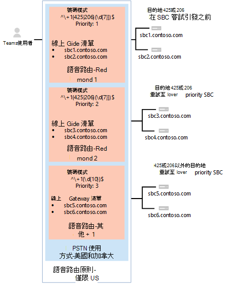

# <a name="configure-voice-routing-for-direct-routing"></a><span data-ttu-id="c6b6d-103">設定直接路由的語音路由</span><span class="sxs-lookup"><span data-stu-id="c6b6d-103">Configure voice routing for Direct Routing</span></span>

<span data-ttu-id="c6b6d-104">本文說明如何設定手機系統 Direct 路由的語音路由。</span><span class="sxs-lookup"><span data-stu-id="c6b6d-104">This article describes how to configure voice routing for Phone System Direct Routing.</span></span>  <span data-ttu-id="c6b6d-105">以下是設定直接路由的步驟3：</span><span class="sxs-lookup"><span data-stu-id="c6b6d-105">This is step 3 of the following steps for configuring Direct Routing:</span></span>

- <span data-ttu-id="c6b6d-106">步驟1。</span><span class="sxs-lookup"><span data-stu-id="c6b6d-106">Step 1.</span></span> [<span data-ttu-id="c6b6d-107">將 SBC 與 Microsoft Phone 系統連接並驗證連接</span><span class="sxs-lookup"><span data-stu-id="c6b6d-107">Connect the SBC with Microsoft Phone System and validate the connection</span></span>](direct-routing-connect-the-sbc.md) 
- <span data-ttu-id="c6b6d-108">步驟2。</span><span class="sxs-lookup"><span data-stu-id="c6b6d-108">Step 2.</span></span> [<span data-ttu-id="c6b6d-109">允許使用者使用直接路由、語音及語音信箱</span><span class="sxs-lookup"><span data-stu-id="c6b6d-109">Enable users for Direct Routing, voice, and voicemail</span></span>](direct-routing-enable-users.md)
- <span data-ttu-id="c6b6d-110">**步驟3。 (本文設定語音路由**) </span><span class="sxs-lookup"><span data-stu-id="c6b6d-110">**Step 3. Configure voice routing** (This article)</span></span>
- <span data-ttu-id="c6b6d-111">步驟4。</span><span class="sxs-lookup"><span data-stu-id="c6b6d-111">Step 4.</span></span> [<span data-ttu-id="c6b6d-112">將數位轉換成替換格式</span><span class="sxs-lookup"><span data-stu-id="c6b6d-112">Translate numbers to an alternate format</span></span>](direct-routing-translate-numbers.md) 

<span data-ttu-id="c6b6d-113">如需設定直接路由所需的所有步驟的詳細資訊，請參閱設定 [直接路由](direct-routing-configure.md)。</span><span class="sxs-lookup"><span data-stu-id="c6b6d-113">For information on all the steps required for setting up Direct Routing, see [Configure Direct Routing](direct-routing-configure.md).</span></span>

## <a name="voice-routing-overview"></a><span data-ttu-id="c6b6d-114">語音路由概覽</span><span class="sxs-lookup"><span data-stu-id="c6b6d-114">Voice routing overview</span></span>

<span data-ttu-id="c6b6d-115">Microsoft Phone 系統有一個路由機制，可讓您將呼叫傳送到特定的會話邊界控制器 (SBC) ，其依據：</span><span class="sxs-lookup"><span data-stu-id="c6b6d-115">Microsoft Phone System has a routing mechanism that allows a call to be sent to a specific Session Border Controller (SBC) based on:</span></span> 

- <span data-ttu-id="c6b6d-116">[已呼叫的號碼] 模式</span><span class="sxs-lookup"><span data-stu-id="c6b6d-116">The called number pattern</span></span> 
- <span data-ttu-id="c6b6d-117">呼叫的號碼模式加上呼叫的特定使用者</span><span class="sxs-lookup"><span data-stu-id="c6b6d-117">The called number pattern plus the specific user who makes the call</span></span>
 
<span data-ttu-id="c6b6d-118">SBCs 可以指定為 [作用中] 和 [備份]。</span><span class="sxs-lookup"><span data-stu-id="c6b6d-118">SBCs can be designated as active and backup.</span></span> <span data-ttu-id="c6b6d-119">當設定為作用中的 SBC 無法用於特定呼叫路由時，該呼叫將會路由至 backup SBC。</span><span class="sxs-lookup"><span data-stu-id="c6b6d-119">When the SBC that is configured as active is not available for a specific call route, then the call will be routed to a backup SBC.</span></span>
 
<span data-ttu-id="c6b6d-120">[語音路由] 是由下列元素所組成：</span><span class="sxs-lookup"><span data-stu-id="c6b6d-120">Voice routing is made up of the following elements:</span></span> 

- <span data-ttu-id="c6b6d-121">**語音路由策略** – PSTN 用途的容器，可指派給使用者或多位使用者。</span><span class="sxs-lookup"><span data-stu-id="c6b6d-121">**Voice routing policy** – A container for PSTN usages, which can be assigned to a user or to multiple users.</span></span> 

- <span data-ttu-id="c6b6d-122">**PSTN 用途** -語音路由和 PSTN 用途的容器，可在不同的語音路由策略中共用。</span><span class="sxs-lookup"><span data-stu-id="c6b6d-122">**PSTN usages** – A container for voice routes and PSTN usages, which can be shared in different voice routing policies.</span></span> 

- <span data-ttu-id="c6b6d-123">**語音路由** ：一種數位模式，以及一組線上 PSTN 閘道，用於撥打電話號碼符合模式的呼叫。</span><span class="sxs-lookup"><span data-stu-id="c6b6d-123">**Voice routes** – A number pattern and set of online PSTN gateways to use for calls where the calling number matches the pattern.</span></span>

- <span data-ttu-id="c6b6d-124">**線上 PSTN 閘道** -指向 sbc 的指標，也會儲存當您在 SBC 中進行呼叫時所套用的設定，例如，將 P 斷言身分識別 (PAI) 或優先的編解碼器。可以新增到語音路由。</span><span class="sxs-lookup"><span data-stu-id="c6b6d-124">**Online PSTN gateway** - A pointer to an SBC that also stores the configuration that is applied when a call is placed through the SBC, such as forward P-Asserted-Identity (PAI) or Preferred Codecs; can be added to voice routes.</span></span>

## <a name="voice-routing-policy-considerations"></a><span data-ttu-id="c6b6d-125">語音路由策略考慮</span><span class="sxs-lookup"><span data-stu-id="c6b6d-125">Voice routing policy considerations</span></span>

<span data-ttu-id="c6b6d-126">如果使用者有通話方案授權，該使用者的撥出通話會透過 Microsoft 通話方案 PSTN 基礎結構自動路由。</span><span class="sxs-lookup"><span data-stu-id="c6b6d-126">If a user has a Calling Plan license, that user’s outgoing calls are automatically routed through the Microsoft Calling Plan PSTN infrastructure.</span></span> <span data-ttu-id="c6b6d-127">如果您設定並將線上語音路由策略指派給通話方案使用者，系統會檢查該使用者的撥出通話，以判斷撥號號碼是否符合線上語音路由策略中定義的數位模式。</span><span class="sxs-lookup"><span data-stu-id="c6b6d-127">If you configure and assign an online voice routing policy to a Calling Plan user, that user’s outgoing calls are checked to determine whether the dialed number matches a number pattern defined in the online voice routing policy.</span></span> <span data-ttu-id="c6b6d-128">如果有相符專案，通話會透過直向路由幹線路由。</span><span class="sxs-lookup"><span data-stu-id="c6b6d-128">If there’s a match, the call is routed through the Direct Routing trunk.</span></span> <span data-ttu-id="c6b6d-129">如果沒有相符的電話，通話會透過呼叫方案 PSTN 基礎結構路由。</span><span class="sxs-lookup"><span data-stu-id="c6b6d-129">If there’s no match, the call is routed through the Calling Plan PSTN infrastructure.</span></span>

> [!CAUTION]
> <span data-ttu-id="c6b6d-130">如果您設定並套用全域 (組織範圍的預設) 線上語音路由策略，您組織中的所有語音使用者都將繼承該原則，這可能會導致來自呼叫方案使用者的 PSTN 呼叫不小心路由至直接路由幹線。</span><span class="sxs-lookup"><span data-stu-id="c6b6d-130">If you configure and apply the global (Org-wide default) online voice routing policy, all voice-enabled users in your organization will inherit that policy, which may result in PSTN calls from Calling Plan users being inadvertently routed to a Direct Routing trunk.</span></span> <span data-ttu-id="c6b6d-131">如果您不想讓所有使用者使用全域線上語音路由策略，請設定自訂的線上語音路由原則，並將它指派給個別的語音使用者。</span><span class="sxs-lookup"><span data-stu-id="c6b6d-131">If you don't want all users to use the global online voice routing policy, configure a custom online voice routing policy and assign it to individual voice-enabled users.</span></span>

## <a name="example-1-voice-routing-with-one-pstn-usage"></a><span data-ttu-id="c6b6d-132">範例1：使用單一 PSTN 使用的語音路由</span><span class="sxs-lookup"><span data-stu-id="c6b6d-132">Example 1: Voice routing with one PSTN usage</span></span>

<span data-ttu-id="c6b6d-133">下圖顯示通話流程中的兩個語音路由策略範例。</span><span class="sxs-lookup"><span data-stu-id="c6b6d-133">The following diagram shows two examples of voice routing policies in a call flow.</span></span>

<span data-ttu-id="c6b6d-134">**在左邊) 呼叫流程 1 (：** 如果使用者撥打電話給 + 1 425 XXX XX 或 + 1 206 XXX XX xx，該通話會路由至 SBC sbc1.contoso.biz 或 sbc2.contoso.biz。</span><span class="sxs-lookup"><span data-stu-id="c6b6d-134">**Call Flow 1 (on the left):** If a user makes a call to +1 425 XXX XX XX or +1 206 XXX XX XX, the call is routed to SBC sbc1.contoso.biz or sbc2.contoso.biz.</span></span> <span data-ttu-id="c6b6d-135">如果 sbc1.contoso.biz 和 sbc2.contoso.biz 都無法使用，就會掛斷通話。</span><span class="sxs-lookup"><span data-stu-id="c6b6d-135">If neither sbc1.contoso.biz nor sbc2.contoso.biz are available, the call is dropped.</span></span> 

<span data-ttu-id="c6b6d-136">**右側) 的 [通話流程 2] (：** 如果使用者撥打電話給 + 1 425 XXX XX 或 + 1 206 XXX XX xx，該通話就會先路由至 SBC sbc1.contoso.biz 或 sbc2.contoso.biz。</span><span class="sxs-lookup"><span data-stu-id="c6b6d-136">**Call Flow 2 (on the right):** If a user makes a call to +1 425 XXX XX XX or +1 206 XXX XX XX, the call is first routed to SBC sbc1.contoso.biz or sbc2.contoso.biz.</span></span> <span data-ttu-id="c6b6d-137">如果沒有可用的 SBC，則會嘗試 (sbc3.contoso.biz 和 sbc4.contoso.biz) 中具有較低優先順序的路由。</span><span class="sxs-lookup"><span data-stu-id="c6b6d-137">If neither SBC is available, the route with lower priority will be tried (sbc3.contoso.biz and sbc4.contoso.biz).</span></span> <span data-ttu-id="c6b6d-138">如果沒有任何 SBCs 可用，就會中斷通話。</span><span class="sxs-lookup"><span data-stu-id="c6b6d-138">If none of the SBCs are available, the call is dropped.</span></span> 


<span data-ttu-id="c6b6d-140">在這兩個範例中，雖然語音路由是指派優先順序，但路由中的 SBCs 會以隨機順序嘗試。</span><span class="sxs-lookup"><span data-stu-id="c6b6d-140">In both examples, while the voice route is assigned priorities, the SBCs in the routes are tried in random order.</span></span> <span data-ttu-id="c6b6d-141">當兩個 SBC 在一個路由中設定時，必須在 SBC 或媒體之間路由的網路流量，因為可能會將傳輸的新邀請傳送到路由中的其他 SBC。</span><span class="sxs-lookup"><span data-stu-id="c6b6d-141">When two SBC's are configured in one route, network traffic must be routable between both SBC's or media will fail to be established on transfers as it is possible that the new invite for the transfer will be sent to a different SBC in the route.</span></span>

  > [!NOTE]
  > <span data-ttu-id="c6b6d-142">除非使用者也有 Microsoft 通話方案授權，否則呼叫範例設定中的 [除了模式 + 1 425 XXX xx xx] 或 [+ 1 206 XXX xx xx] 以外的任何號碼。</span><span class="sxs-lookup"><span data-stu-id="c6b6d-142">Unless the user also has a Microsoft Calling Plan license, calls to any number except numbers matching the patterns +1 425 XXX XX XX or +1 206 XXX XX XX in the example configuration are dropped.</span></span> <span data-ttu-id="c6b6d-143">如果使用者有通話方案授權，通話會根據 Microsoft 通話方案的原則自動傳送。</span><span class="sxs-lookup"><span data-stu-id="c6b6d-143">If the user has a Calling Plan license, the call is automatically routed according to the policies of the Microsoft Calling Plan.</span></span> <span data-ttu-id="c6b6d-144">Microsoft 通話方案會自動套用為所有擁有 Microsoft 通話方案授權的使用者，而且不需要額外的呼叫路由設定。</span><span class="sxs-lookup"><span data-stu-id="c6b6d-144">The Microsoft Calling Plan applies automatically as the last route to all users with the Microsoft Calling Plan license and does not require additional call routing configuration.</span></span>

<span data-ttu-id="c6b6d-145">在下圖所示的範例中，會新增語音信箱，將呼叫傳送給撥打號碼模式 + 1 XXX XXX XX xx) 的所有其他美國和加拿大號碼 (通話。</span><span class="sxs-lookup"><span data-stu-id="c6b6d-145">In the example shown in the following diagram, a voice route is added to send calls to all other US and Canadian numbers (calls that go to called number pattern +1 XXX XXX XX XX).</span></span>



<span data-ttu-id="c6b6d-147">針對所有其他通話，如果使用者在 Microsoft 手機系統和 Microsoft 通話方案) 中都有這兩個授權 (，就會使用自動路由。</span><span class="sxs-lookup"><span data-stu-id="c6b6d-147">For all other calls, if a user has both licenses (Microsoft Phone System and Microsoft Calling Plan), the automatic route is used.</span></span> <span data-ttu-id="c6b6d-148">如果沒有與管理員建立的線上語音路線中的數位模式相符，通話會透過 Microsoft 通話方案傳送。</span><span class="sxs-lookup"><span data-stu-id="c6b6d-148">If nothing matches the number patterns in the administrator-created online voice routes, then the call is routed through Microsoft Calling Plan.</span></span> <span data-ttu-id="c6b6d-149">如果使用者只有 Microsoft 手機系統，就會中斷通話，因為沒有可用的相符規則。</span><span class="sxs-lookup"><span data-stu-id="c6b6d-149">If the user only has Microsoft Phone System, the call is dropped because no matching rules are available.</span></span>

  > [!NOTE]
  > <span data-ttu-id="c6b6d-150">在此情況下，路由 "Other + 1" 的優先順序值不重要，因為只有一個路由符合模式 + 1 XXX XXX XXX xx。</span><span class="sxs-lookup"><span data-stu-id="c6b6d-150">The Priority value for route "Other +1" doesn't matter in this case because there is only one route that matches the pattern +1 XXX XXX XX XX.</span></span> <span data-ttu-id="c6b6d-151">如果使用者撥打電話給 + 1 324 567 89 89，且 sbc5.contoso.biz 和 sbc6.contoso.biz 都無法使用，通話就會斷撥。</span><span class="sxs-lookup"><span data-stu-id="c6b6d-151">If a user makes a call to +1 324 567 89 89 and both sbc5.contoso.biz and sbc6.contoso.biz are unavailable, the call is dropped.</span></span>

<span data-ttu-id="c6b6d-152">下表摘要列出使用三個語音路由的配置。</span><span class="sxs-lookup"><span data-stu-id="c6b6d-152">The following table summarizes the configuration using three voice routes.</span></span> <span data-ttu-id="c6b6d-153">在這個範例中，三個路由都是相同 PSTN 使用量（"美國及加拿大"）的一部分。</span><span class="sxs-lookup"><span data-stu-id="c6b6d-153">In this example, all three routes are part of the same PSTN usage, "US and Canada".</span></span>  <span data-ttu-id="c6b6d-154">所有路由都與「美國和加拿大」 PSTN 使用關聯，而 PSTN 使用量則與「僅美國」語音路由策略相關聯。</span><span class="sxs-lookup"><span data-stu-id="c6b6d-154">All routes are associated with the "US and Canada" PSTN usage  and the PSTN usage is associated with the "US Only" voice routing policy.</span></span>

|<span data-ttu-id="c6b6d-155">**PSTN 使用量**</span><span class="sxs-lookup"><span data-stu-id="c6b6d-155">**PSTN usage**</span></span>|<span data-ttu-id="c6b6d-156">**語音路線**</span><span class="sxs-lookup"><span data-stu-id="c6b6d-156">**Voice route**</span></span>|<span data-ttu-id="c6b6d-157">**數位模式**</span><span class="sxs-lookup"><span data-stu-id="c6b6d-157">**Number pattern**</span></span>|<span data-ttu-id="c6b6d-158">**優先順序**</span><span class="sxs-lookup"><span data-stu-id="c6b6d-158">**Priority**</span></span>|<span data-ttu-id="c6b6d-159">**SBC**</span><span class="sxs-lookup"><span data-stu-id="c6b6d-159">**SBC**</span></span>|<span data-ttu-id="c6b6d-160">**描述**</span><span class="sxs-lookup"><span data-stu-id="c6b6d-160">**Description**</span></span>|
|:-----|:-----|:-----|:-----|:-----|:-----|
|<span data-ttu-id="c6b6d-161">美國和加拿大</span><span class="sxs-lookup"><span data-stu-id="c6b6d-161">US and Canada</span></span>|<span data-ttu-id="c6b6d-162">"雷德蒙 1"</span><span class="sxs-lookup"><span data-stu-id="c6b6d-162">"Redmond 1"</span></span>|<span data-ttu-id="c6b6d-163">^\\+ 1 (425 \| 206) # A2\d {7}) $</span><span class="sxs-lookup"><span data-stu-id="c6b6d-163">^\\+1(425\|206)(\d{7})$</span></span>|<span data-ttu-id="c6b6d-164">1</span><span class="sxs-lookup"><span data-stu-id="c6b6d-164">1</span></span>|<span data-ttu-id="c6b6d-165">sbc1.contoso.biz</span><span class="sxs-lookup"><span data-stu-id="c6b6d-165">sbc1.contoso.biz</span></span><br/><span data-ttu-id="c6b6d-166">sbc2.contoso.biz</span><span class="sxs-lookup"><span data-stu-id="c6b6d-166">sbc2.contoso.biz</span></span>|<span data-ttu-id="c6b6d-167">呼叫號碼 + 1 425 XXX XX xx 美元或 + 1 206 XXX XX xx 的活動路由</span><span class="sxs-lookup"><span data-stu-id="c6b6d-167">Active route for called numbers +1 425 XXX XX XX or +1 206 XXX XX XX</span></span>|
|<span data-ttu-id="c6b6d-168">美國和加拿大</span><span class="sxs-lookup"><span data-stu-id="c6b6d-168">US and Canada</span></span>|<span data-ttu-id="c6b6d-169">"雷德蒙 2"</span><span class="sxs-lookup"><span data-stu-id="c6b6d-169">"Redmond 2"</span></span>|<span data-ttu-id="c6b6d-170">^\\+ 1 (425 \| 206) # A2\d {7}) $</span><span class="sxs-lookup"><span data-stu-id="c6b6d-170">^\\+1(425\|206)(\d{7})$</span></span>|<span data-ttu-id="c6b6d-171">2</span><span class="sxs-lookup"><span data-stu-id="c6b6d-171">2</span></span>|<span data-ttu-id="c6b6d-172">sbc3.contoso.biz</span><span class="sxs-lookup"><span data-stu-id="c6b6d-172">sbc3.contoso.biz</span></span><br/><span data-ttu-id="c6b6d-173">sbc4.contoso.biz</span><span class="sxs-lookup"><span data-stu-id="c6b6d-173">sbc4.contoso.biz</span></span>|<span data-ttu-id="c6b6d-174">呼叫號碼的備份路由 + 1 425 XXX XX XX or + 1 206 XXX XX xx</span><span class="sxs-lookup"><span data-stu-id="c6b6d-174">Backup route for called numbers +1 425 XXX XX XX or +1 206 XXX XX XX</span></span>|
|<span data-ttu-id="c6b6d-175">美國和加拿大</span><span class="sxs-lookup"><span data-stu-id="c6b6d-175">US and Canada</span></span>|<span data-ttu-id="c6b6d-176">"Other + 1"</span><span class="sxs-lookup"><span data-stu-id="c6b6d-176">"Other +1"</span></span>|<span data-ttu-id="c6b6d-177">^\\+ 1 ( \d {10}) $</span><span class="sxs-lookup"><span data-stu-id="c6b6d-177">^\\+1(\d{10})$</span></span>|<span data-ttu-id="c6b6d-178">3</span><span class="sxs-lookup"><span data-stu-id="c6b6d-178">3</span></span>|<span data-ttu-id="c6b6d-179">sbc5.contoso.biz</span><span class="sxs-lookup"><span data-stu-id="c6b6d-179">sbc5.contoso.biz</span></span><br/><span data-ttu-id="c6b6d-180">sbc6.contoso.biz</span><span class="sxs-lookup"><span data-stu-id="c6b6d-180">sbc6.contoso.biz</span></span>|<span data-ttu-id="c6b6d-181">呼叫號碼 + 1 XXX XXX xx (，但 + 1 425 XXX XX xx 或 + 1 206 XXX xx xx) </span><span class="sxs-lookup"><span data-stu-id="c6b6d-181">Route for called numbers +1 XXX XXX XX XX (except +1 425 XXX XX XX or +1 206 XXX XX XX)</span></span>|
|||||||

## <a name="example-1-configuration-steps"></a><span data-ttu-id="c6b6d-182">範例1：設定步驟</span><span class="sxs-lookup"><span data-stu-id="c6b6d-182">Example 1: Configuration steps</span></span>

<span data-ttu-id="c6b6d-183">下列範例顯示如何：</span><span class="sxs-lookup"><span data-stu-id="c6b6d-183">The following example shows how to:</span></span>

1. <span data-ttu-id="c6b6d-184">建立單一 PSTN 使用量。</span><span class="sxs-lookup"><span data-stu-id="c6b6d-184">Create a single PSTN usage.</span></span>
2. <span data-ttu-id="c6b6d-185">設定三個語音路由。</span><span class="sxs-lookup"><span data-stu-id="c6b6d-185">Configure three voice routes.</span></span>
3. <span data-ttu-id="c6b6d-186">建立語音路由策略。</span><span class="sxs-lookup"><span data-stu-id="c6b6d-186">Create a voice routing policy.</span></span>
4. <span data-ttu-id="c6b6d-187">將原則指派給名為 Spencer Low 的使用者。</span><span class="sxs-lookup"><span data-stu-id="c6b6d-187">Assign the policy to a user named Spencer Low.</span></span>

<span data-ttu-id="c6b6d-188">您可以使用 [Microsoft 團隊系統管理中心](#admincenterexample1) 或 [PowerShell](#powershellexample1) 來執行這些步驟。</span><span class="sxs-lookup"><span data-stu-id="c6b6d-188">You can use the [Microsoft Teams admin center](#admincenterexample1) or [PowerShell](#powershellexample1) to perform these steps.</span></span>

### <a name="using-the-microsoft-teams-admin-center"></a><span data-ttu-id="c6b6d-189">使用 Microsoft Teams 系統管理中心</span><span class="sxs-lookup"><span data-stu-id="c6b6d-189">Using the Microsoft Teams admin center</span></span>
<a name="admincenterexample1"></a>

#### <a name="step-1-create-the-us-and-canada-pstn-usage"></a><span data-ttu-id="c6b6d-190">步驟1：建立「美國和加拿大」 PSTN 使用量</span><span class="sxs-lookup"><span data-stu-id="c6b6d-190">Step 1: Create the "US and Canada" PSTN usage</span></span>

1. <span data-ttu-id="c6b6d-191">在 Microsoft 團隊系統管理中心的左導覽中，移至 [**語音**  >  **直式路由**]，然後按一下右上角的 [**管理 PSTN 使用方式記錄**]。</span><span class="sxs-lookup"><span data-stu-id="c6b6d-191">In the left navigation of the Microsoft Teams admin center, go to **Voice** > **Direct Routing**, and then in the upper-right corner, select **Manage PSTN usage records**.</span></span>
2. <span data-ttu-id="c6b6d-192">按一下 [**新增**]，輸入 **美國和加拿大**，然後按一下 [套用 **]。**</span><span class="sxs-lookup"><span data-stu-id="c6b6d-192">Click **Add**, type **US and Canada**, and then click **Apply**.</span></span>

#### <a name="step-2-create-three-voice-routes-redmond-1-redmond-2-and-other-1"></a><span data-ttu-id="c6b6d-193">步驟2：在雷德蒙1、雷德蒙2及其他 + 1)  (建立三個語音路由</span><span class="sxs-lookup"><span data-stu-id="c6b6d-193">Step 2: Create three voice routes (Redmond 1, Redmond 2, and Other +1)</span></span>

<span data-ttu-id="c6b6d-194">下列步驟說明如何建立語音路線。</span><span class="sxs-lookup"><span data-stu-id="c6b6d-194">The following steps describe how to create a voice route.</span></span> <span data-ttu-id="c6b6d-195">您可以使用這些步驟，透過舊版表格中所述的設定，為此範例建立三個名為 [雷蒙德 1]、[雷蒙德 2] 及 [其他 + 1] 的語音路由。</span><span class="sxs-lookup"><span data-stu-id="c6b6d-195">Use these steps to create the three voice routes named Redmond 1, Redmond 2, and Other +1 for this example by using the settings outlined in the earlier table.</span></span>

1. <span data-ttu-id="c6b6d-196">在 Microsoft 團隊系統管理中心的左導覽中，移至 [**語音**  >  **直式路由**]，然後選取 [**語音路由**] 索引標籤。</span><span class="sxs-lookup"><span data-stu-id="c6b6d-196">In the left navigation of the Microsoft Teams admin center, go to **Voice** > **Direct Routing**, and then select the **Voice routes** tab.</span></span>
2. <span data-ttu-id="c6b6d-197">按一下 [ **新增**]，然後輸入語音路線的名稱和描述。</span><span class="sxs-lookup"><span data-stu-id="c6b6d-197">Click **Add**, and then enter a name and description for the voice route.</span></span>
3. <span data-ttu-id="c6b6d-198">設定優先順序，並指定撥打的號碼模式。</span><span class="sxs-lookup"><span data-stu-id="c6b6d-198">Set the priority and specify the dialed number pattern.</span></span>
4. <span data-ttu-id="c6b6d-199">若要使用語音路由註冊 SBC，請在 [**半形登記] (選用)** 中，按一下 [**新增 sbcs**]，選取您要登記的 SBCs，然後按一下 [套用 **]。**</span><span class="sxs-lookup"><span data-stu-id="c6b6d-199">To enroll an SBC with the voice route, under **SBCs enrolled (optional)**, click **Add SBCs**, select the SBCs you want to enroll, and then click **Apply**.</span></span>
5. <span data-ttu-id="c6b6d-200">若要新增 PSTN 使用記錄，請在 [ **PSTN 使用記錄] 底下 (選用)**，按一下 [ **新增 PSTN 使用量**]，選取您要新增的 PSTN 記錄， **然後按一下 [** 套用]。</span><span class="sxs-lookup"><span data-stu-id="c6b6d-200">To add PSTN usage records, under **PSTN usage records (optional)**, click **Add PSTN usage**, select the PSTN records you want to add, and then click **Apply**.</span></span>
6. <span data-ttu-id="c6b6d-201">按一下 [儲存]。</span><span class="sxs-lookup"><span data-stu-id="c6b6d-201">Click **Save**.</span></span>

#### <a name="step-3-create-a-voice-routing-policy-named-us-only-and-add-the-us-and-canada-pstn-usage-to-the-policy"></a><span data-ttu-id="c6b6d-202">步驟3：建立名為「僅限美國」的語音路由策略，並將「美國和加拿大」 PSTN 使用方式新增至原則</span><span class="sxs-lookup"><span data-stu-id="c6b6d-202">Step 3: Create a voice routing policy named "US Only" and add the "US and Canada" PSTN usage to the policy</span></span>

1. <span data-ttu-id="c6b6d-203">在 Microsoft 團隊系統管理中心的左導覽中，移至 [**語音**  >  **語音路由策略**]，然後按一下 [**新增**]。</span><span class="sxs-lookup"><span data-stu-id="c6b6d-203">In the left navigation of the Microsoft Teams admin center, go to **Voice** > **Voice routing policies**, and then click **Add**.</span></span>
2. <span data-ttu-id="c6b6d-204">**僅** 以名稱輸入，並新增描述。</span><span class="sxs-lookup"><span data-stu-id="c6b6d-204">Type **US Only** as the name and add a description.</span></span>
3. <span data-ttu-id="c6b6d-205">在 [ **PSTN 使用記錄**] 底下，按一下 [**新增 PSTN 使用量**]，選取 [美國及加拿大] PSTN 使用方式記錄，然後按一下 [套用 **]。**</span><span class="sxs-lookup"><span data-stu-id="c6b6d-205">Under **PSTN usage records**, click **Add PSTN usage**, select the "US and Canada" PSTN usage record, and then click **Apply**.</span></span>
4. <span data-ttu-id="c6b6d-206">按一下 [儲存]。</span><span class="sxs-lookup"><span data-stu-id="c6b6d-206">Click **Save**.</span></span>

<span data-ttu-id="c6b6d-207">若要深入瞭解，請參閱 [管理語音路由策略](manage-voice-routing-policies.md)。</span><span class="sxs-lookup"><span data-stu-id="c6b6d-207">To learn more, see [Manage voice routing policies](manage-voice-routing-policies.md).</span></span>

#### <a name="step-4-assign-the-voice-routing-policy-to-a-user-named-spencer-low"></a><span data-ttu-id="c6b6d-208">步驟4：將語音路由策略指派給名為 Spencer 低的使用者</span><span class="sxs-lookup"><span data-stu-id="c6b6d-208">Step 4: Assign the voice routing policy to a user named Spencer Low</span></span>

1. <span data-ttu-id="c6b6d-209">在 Microsoft Teams 系統管理中心的左側瀏覽窗格中，移至 [使用者]，然後按一下該使用者。</span><span class="sxs-lookup"><span data-stu-id="c6b6d-209">In the left navigation of the Microsoft Teams admin center, go to **Users**, and then click the user.</span></span>
2. <span data-ttu-id="c6b6d-210">按一下 [ **原則**]，然後在 [ **指派的原則**] 旁，按一下 [ **編輯**]。</span><span class="sxs-lookup"><span data-stu-id="c6b6d-210">Click **Policies**, and then next to **Assigned policies**, click **Edit**.</span></span>
3. <span data-ttu-id="c6b6d-211">在 [ **語音路由策略**] 底下，選取 [僅限美國] 原則，然後按一下 [ **儲存**]。</span><span class="sxs-lookup"><span data-stu-id="c6b6d-211">Under **Voice routing policy**, select the "US Only" policy, and then click **Save**.</span></span>

<span data-ttu-id="c6b6d-212">若要深入瞭解，請參閱 [管理語音路由策略](manage-voice-routing-policies.md)。</span><span class="sxs-lookup"><span data-stu-id="c6b6d-212">To learn more, see [Manage voice routing policies](manage-voice-routing-policies.md).</span></span>

### <a name="using-powershell"></a><span data-ttu-id="c6b6d-213">使用 PowerShell</span><span class="sxs-lookup"><span data-stu-id="c6b6d-213">Using PowerShell</span></span>
<a name="powershellexample1"></a>


#### <a name="step-1-create-the-us-and-canada-pstn-usage"></a><span data-ttu-id="c6b6d-214">步驟1：建立「美國和加拿大」 PSTN 使用量</span><span class="sxs-lookup"><span data-stu-id="c6b6d-214">Step 1: Create the "US and Canada" PSTN usage</span></span>

<span data-ttu-id="c6b6d-215">在商務用 Skype Online 的遠端 PowerShell 會話中，鍵入：</span><span class="sxs-lookup"><span data-stu-id="c6b6d-215">In a remote PowerShell session in Skype for Business Online, type:</span></span>

```PowerShell
Set-CsOnlinePstnUsage -Identity Global -Usage @{Add="US and Canada"}
```

<span data-ttu-id="c6b6d-216">輸入以下內容以驗證是否已建立使用：</span><span class="sxs-lookup"><span data-stu-id="c6b6d-216">Verify that the usage was created by entering:</span></span>

```PowerShell
Get-CSOnlinePSTNUsage
``` 

<span data-ttu-id="c6b6d-217">這會傳回可能會被截斷的名稱清單：</span><span class="sxs-lookup"><span data-stu-id="c6b6d-217">Which returns a list of names that may be truncated:</span></span>

```console
Identity    : Global
Usage        : {testusage, US and Canada, International, karlUsage. . .}
```

<span data-ttu-id="c6b6d-218">下列範例顯示 `(Get-CSOnlinePSTNUsage).usage` 執行 Powershell 命令以顯示完整名稱 (未截斷) 的結果：</span><span class="sxs-lookup"><span data-stu-id="c6b6d-218">The following example shows the result of running the `(Get-CSOnlinePSTNUsage).usage` Powershell command to display full names (not truncated):</span></span>

<pre>
 testusage
 US and Canada
 International
 karlUsage
 New test env
 Tallinn Lab Sonus
 karlUsage2
 Unrestricted
 Two trunks
</pre>

#### <a name="step-2-create-three-voice-routes-redmond-1-redmond-2-and-other-1"></a><span data-ttu-id="c6b6d-219">步驟2：在雷德蒙1、雷德蒙2及其他 + 1)  (建立三個語音路由</span><span class="sxs-lookup"><span data-stu-id="c6b6d-219">Step 2: Create three voice routes (Redmond 1, Redmond 2, and Other +1)</span></span>

<span data-ttu-id="c6b6d-220">若要在商務用 Skype Online 的 PowerShell 會話中建立「雷蒙德1」路線，請輸入：</span><span class="sxs-lookup"><span data-stu-id="c6b6d-220">To create the "Redmond 1" route, in a PowerShell session in Skype for Business Online, enter:</span></span>

```PowerShell
New-CsOnlineVoiceRoute -Identity "Redmond 1" -NumberPattern "^\+1(425|206)
(\d{7})$" -OnlinePstnGatewayList sbc1.contoso.biz, sbc2.contoso.biz -Priority 1 -OnlinePstnUsages "US and Canada"
```

<span data-ttu-id="c6b6d-221">返回：</span><span class="sxs-lookup"><span data-stu-id="c6b6d-221">Which returns:</span></span>
<pre>
Identity                : Redmond 1
Priority                : 1
Description             :
NumberPattern           : ^\+1(425|206) (\d{7})$
OnlinePstnUsages        : {US and Canada}
OnlinePstnGatewayList   : {sbc1.contoso.biz, sbc2.contoso.biz}
Name                    : Redmond 1
</pre>

<span data-ttu-id="c6b6d-222">若要建立雷德蒙2路線，請輸入：</span><span class="sxs-lookup"><span data-stu-id="c6b6d-222">To create the Redmond 2 route, enter:</span></span>

```PowerShell
New-CsOnlineVoiceRoute -Identity "Redmond 2" -NumberPattern "^\+1(425|206)
(\d{7})$" -OnlinePstnGatewayList sbc3.contoso.biz, sbc4.contoso.biz -Priority 2 -OnlinePstnUsages "US and Canada"
```

<span data-ttu-id="c6b6d-223">若要建立其他 + 1 路線，請輸入：</span><span class="sxs-lookup"><span data-stu-id="c6b6d-223">To create the Other +1 route, enter:</span></span>

```PowerShell
New-CsOnlineVoiceRoute -Identity "Other +1" -NumberPattern "^\+1(\d{10})$"
-OnlinePstnGatewayList sbc5.contoso.biz, sbc6.contoso.biz -OnlinePstnUsages "US and Canada"
```

  > [!CAUTION]
  > <span data-ttu-id="c6b6d-224">請確定 NumberPattern 屬性中的正則運算式是有效的運算式。</span><span class="sxs-lookup"><span data-stu-id="c6b6d-224">Make sure that your regular expression in the NumberPattern attribute is a valid expression.</span></span> <span data-ttu-id="c6b6d-225">您可以使用此網站進行測試： [https://www.regexpal.com](https://www.regexpal.com)</span><span class="sxs-lookup"><span data-stu-id="c6b6d-225">You can test it using this website: [https://www.regexpal.com](https://www.regexpal.com)</span></span>

<span data-ttu-id="c6b6d-226">在某些情況下，需要將所有呼叫路由至同一個 SBC;使用-NumberPattern ". \*"</span><span class="sxs-lookup"><span data-stu-id="c6b6d-226">In some cases, there is a need to route all calls to the same SBC; use -NumberPattern ".\*"</span></span>

<span data-ttu-id="c6b6d-227">將所有呼叫路由至同一個 SBC。</span><span class="sxs-lookup"><span data-stu-id="c6b6d-227">Route all calls to the same SBC.</span></span>

```PowerShell
Set-CsOnlineVoiceRoute -id "Redmond 1" -NumberPattern ".*" -OnlinePstnGatewayList sbc1.contoso.biz
```

<span data-ttu-id="c6b6d-228">使用以下所示的選項，確認您是否已透過執行 PowerShell 命令來正確設定路由 `Get-CSOnlineVoiceRoute` ：</span><span class="sxs-lookup"><span data-stu-id="c6b6d-228">Verify that you've correctly configured the route by running the `Get-CSOnlineVoiceRoute` PowerShell command using options as shown:</span></span>

```PowerShell
Get-CsOnlineVoiceRoute | Where-Object {($_.priority -eq 1) -or ($_.priority -eq 2) or ($_.priority -eq 4) -Identity "Redmond 1" -NumberPattern "^\+1(425|206) (\d{7})$" -OnlinePstnGatewayList sbc1.contoso.biz, sbc2.contoso.biz -Priority 1 -OnlinePstnUsages "US and Canada"
```
<span data-ttu-id="c6b6d-229">應傳回的專案：</span><span class="sxs-lookup"><span data-stu-id="c6b6d-229">Which should return:</span></span>
<pre>
Identity            : Redmond 1 
Priority               : 1
Description         : 
NumberPattern         : ^\+1(425|206) (\d{7})$
OnlinePstnUsages     : {US and Canada}     
OnlinePstnGatewayList    : {sbc1.contoso.biz, sbc2.contoso.biz}
Name             : Redmond 1
Identity        : Redmond 2 
Priority               : 2
Description         : 
NumberPattern         : ^\+1(425|206) (\d{7})$
OnlinePstnUsages     : {US and Canada}     
OnlinePstnGatewayList    : {sbc3.contoso.biz, sbc4.contoso.biz}
Name             : Redmond 2
    
Identity        : Other +1 
Priority               : 4
Description         : 
NumberPattern         : ^\+1(\d{10})$
OnlinePstnUsages     : {US and Canada}     
OnlinePstnGatewayList    : {sbc5.contoso.biz, sbc6.contoso.biz}
Name             : Other +1
</pre>

<span data-ttu-id="c6b6d-230">在這個範例中，「其他 + 1」路由會自動指派優先順序4。</span><span class="sxs-lookup"><span data-stu-id="c6b6d-230">In the example, the route "Other +1" was automatically assigned priority 4.</span></span> 

#### <a name="step-3-create-a-voice-routing-policy-named-us-only-and-add-the-us-and-canada-pstn-usage-to-the-policy"></a><span data-ttu-id="c6b6d-231">步驟3：建立名為「僅限美國」的語音路由策略，並將「美國和加拿大」 PSTN 使用方式新增至原則</span><span class="sxs-lookup"><span data-stu-id="c6b6d-231">Step 3: Create a voice routing policy named "US Only" and add the "US and Canada" PSTN usage to the policy</span></span>

<span data-ttu-id="c6b6d-232">在商務用 Skype Online 的 PowerShell 會話中，鍵入：</span><span class="sxs-lookup"><span data-stu-id="c6b6d-232">In a PowerShell session in Skype for Business Online, type:</span></span>

```PowerShell
New-CsOnlineVoiceRoutingPolicy "US Only" -OnlinePstnUsages "US and Canada"
```

<span data-ttu-id="c6b6d-233">結果會顯示在這個範例中：</span><span class="sxs-lookup"><span data-stu-id="c6b6d-233">The result is shown in this example:</span></span>

<pre>
Identity            : Tag:US only
OnlinePstnUsages    : {US and Canada}
Description         :
RouteType           : BYOT
</pre>

#### <a name="step-4-assign-the-voice-routing-policy-to-a-user-named-spencer-low"></a><span data-ttu-id="c6b6d-234">步驟4：將語音路由策略指派給名為 Spencer 低的使用者</span><span class="sxs-lookup"><span data-stu-id="c6b6d-234">Step 4: Assign the voice routing policy to a user named Spencer Low</span></span>

<span data-ttu-id="c6b6d-235">在商務用 Skype Online 的 PowerShell 會話中，鍵入：</span><span class="sxs-lookup"><span data-stu-id="c6b6d-235">In a PowerShell session in Skype for Business Online, type:</span></span>

```PowerShell
Grant-CsOnlineVoiceRoutingPolicy -Identity "Spencer Low" -PolicyName "US Only"
```

<span data-ttu-id="c6b6d-236">輸入以下命令以驗證原則指派：</span><span class="sxs-lookup"><span data-stu-id="c6b6d-236">Validate the policy assignment by entering this command:</span></span>

```PowerShell
Get-CsOnlineUser "Spencer Low" | select OnlineVoiceRoutingPolicy
```

<span data-ttu-id="c6b6d-237">命令會傳回下列內容：</span><span class="sxs-lookup"><span data-stu-id="c6b6d-237">The command returns the following:</span></span>
<pre>
OnlineVoiceRoutingPolicy
---------------------
US Only
</pre>

## <a name="example-2-voice-routing-with-multiple-pstn-usages"></a><span data-ttu-id="c6b6d-238">範例2：有多個 PSTN 用法的語音路由</span><span class="sxs-lookup"><span data-stu-id="c6b6d-238">Example 2: Voice routing with multiple PSTN usages</span></span>

<span data-ttu-id="c6b6d-239">在範例1中建立的語音路由策略只允許撥打美國和加拿大電話號碼，除非使用者也指派 Microsoft 通話方案授權。</span><span class="sxs-lookup"><span data-stu-id="c6b6d-239">The voice routing policy created in Example 1 only allows calls to phone numbers in the US and Canada--unless the Microsoft Calling Plan license is also assigned to the user.</span></span>

<span data-ttu-id="c6b6d-240">在下列範例中，您可以建立「無限制」語音路由原則。</span><span class="sxs-lookup"><span data-stu-id="c6b6d-240">In the example that follows, you can create the "No Restrictions" voice routing policy.</span></span> <span data-ttu-id="c6b6d-241">原則會重複使用範例1中建立的「美國和加拿大」 PSTN 使用量，以及新的「國際」 PSTN 用法。</span><span class="sxs-lookup"><span data-stu-id="c6b6d-241">The policy reuses the "US and Canada" PSTN usage created in Example 1, as well as the new "International" PSTN usage.</span></span> <span data-ttu-id="c6b6d-242">此原則會將所有其他呼叫路由到 SBCs sbc2.contoso.biz 和 sbc5.contoso.biz。</span><span class="sxs-lookup"><span data-stu-id="c6b6d-242">This policy routes all other calls to the SBCs sbc2.contoso.biz and sbc5.contoso.biz.</span></span>

<span data-ttu-id="c6b6d-243">所顯示的範例會將 [僅限美國] 原則指派給使用者 Spencer 低，並將 [無限制] 原則指派給使用者 John 的使用，以便進行路由，如下所示：</span><span class="sxs-lookup"><span data-stu-id="c6b6d-243">The examples that are shown assign the US Only policy to user Spencer Low, and the No Restrictions policy to the user John Woods so that routing occurs as follows:</span></span>

- <span data-ttu-id="c6b6d-244">Spencer [低–美國] 原則。</span><span class="sxs-lookup"><span data-stu-id="c6b6d-244">Spencer Low – US Only policy.</span></span>  <span data-ttu-id="c6b6d-245">通話只能在美國和加拿大號碼使用。</span><span class="sxs-lookup"><span data-stu-id="c6b6d-245">Calls are allowed only to US and Canadian numbers.</span></span> <span data-ttu-id="c6b6d-246">呼叫雷德蒙的數位範圍時，必須使用一組特定的半形。</span><span class="sxs-lookup"><span data-stu-id="c6b6d-246">When calling to the Redmond number range, the specific set of SBCs must be used.</span></span> <span data-ttu-id="c6b6d-247">除非指派給使用者的是通話方案授權，否則不會路由非美國數位。</span><span class="sxs-lookup"><span data-stu-id="c6b6d-247">Non-US numbers will not be routed unless the Calling Plan license is assigned to the user.</span></span>

- <span data-ttu-id="c6b6d-248">約翰（張三）：國際原則。</span><span class="sxs-lookup"><span data-stu-id="c6b6d-248">John Woods – International policy.</span></span>  <span data-ttu-id="c6b6d-249">允許通話至任何號碼。</span><span class="sxs-lookup"><span data-stu-id="c6b6d-249">Calls are allowed to any number.</span></span> <span data-ttu-id="c6b6d-250">呼叫雷德蒙的數位範圍時，必須使用一組特定的半形。</span><span class="sxs-lookup"><span data-stu-id="c6b6d-250">When calling to the Redmond number range, the specific set of SBCs must be used.</span></span> <span data-ttu-id="c6b6d-251">使用 sbc2.contoso.biz 和 sbc5.contoso.biz 來路由非美國數位。</span><span class="sxs-lookup"><span data-stu-id="c6b6d-251">Non-US numbers will be routed using sbc2.contoso.biz and sbc5.contoso.biz.</span></span>


<span data-ttu-id="c6b6d-253">針對所有其他通話，如果使用者同時擁有兩個授權 (Microsoft 手機系統和 Microsoft 通話方案) ，就會使用自動路由。</span><span class="sxs-lookup"><span data-stu-id="c6b6d-253">For all other calls, if a user has both licenses (Microsoft Phone System and Microsoft Calling Plan), automatic route is used.</span></span> <span data-ttu-id="c6b6d-254">如果沒有與管理員建立的線上語音路由中的數位模式相符，就會使用 Microsoft 通話方案傳送通話。</span><span class="sxs-lookup"><span data-stu-id="c6b6d-254">If nothing matches the number patterns in the administrator-created online voice routes, then the call is routed using Microsoft Calling Plan.</span></span>  <span data-ttu-id="c6b6d-255">如果使用者只有 Microsoft 手機系統，就會中斷通話，因為沒有可用的相符規則。</span><span class="sxs-lookup"><span data-stu-id="c6b6d-255">If the user has only Microsoft Phone System, the call is dropped because no matching rules are available.</span></span>


<span data-ttu-id="c6b6d-257">下表摘要列出路由策略「無限制」的使用方式指派和語音路由。</span><span class="sxs-lookup"><span data-stu-id="c6b6d-257">The following table summarizes routing policy "No Restrictions" usage designations and voice routes.</span></span> 

|<span data-ttu-id="c6b6d-258">**PSTN 使用量**</span><span class="sxs-lookup"><span data-stu-id="c6b6d-258">**PSTN usage**</span></span>|<span data-ttu-id="c6b6d-259">**語音路線**</span><span class="sxs-lookup"><span data-stu-id="c6b6d-259">**Voice route**</span></span>|<span data-ttu-id="c6b6d-260">**數位模式**</span><span class="sxs-lookup"><span data-stu-id="c6b6d-260">**Number pattern**</span></span>|<span data-ttu-id="c6b6d-261">**優先順序**</span><span class="sxs-lookup"><span data-stu-id="c6b6d-261">**Priority**</span></span>|<span data-ttu-id="c6b6d-262">**SBC**</span><span class="sxs-lookup"><span data-stu-id="c6b6d-262">**SBC**</span></span>|<span data-ttu-id="c6b6d-263">**描述**</span><span class="sxs-lookup"><span data-stu-id="c6b6d-263">**Description**</span></span>|
|:-----|:-----|:-----|:-----|:-----|:-----|
|<span data-ttu-id="c6b6d-264">美國和加拿大</span><span class="sxs-lookup"><span data-stu-id="c6b6d-264">US and Canada</span></span>|<span data-ttu-id="c6b6d-265">"雷德蒙 1"</span><span class="sxs-lookup"><span data-stu-id="c6b6d-265">"Redmond 1"</span></span>|<span data-ttu-id="c6b6d-266">^\\+ 1 (425 \| 206) # A2\d {7}) $</span><span class="sxs-lookup"><span data-stu-id="c6b6d-266">^\\+1(425\|206)(\d{7})$</span></span>|<span data-ttu-id="c6b6d-267">1</span><span class="sxs-lookup"><span data-stu-id="c6b6d-267">1</span></span>|<span data-ttu-id="c6b6d-268">sbc1.contoso.biz</span><span class="sxs-lookup"><span data-stu-id="c6b6d-268">sbc1.contoso.biz</span></span><br/><span data-ttu-id="c6b6d-269">sbc2.contoso.biz</span><span class="sxs-lookup"><span data-stu-id="c6b6d-269">sbc2.contoso.biz</span></span>|<span data-ttu-id="c6b6d-270">被呼叫者編號的作用中路由 + 1 425 XXX XX XX 或 + 1 206 XXX XX xx</span><span class="sxs-lookup"><span data-stu-id="c6b6d-270">Active route for callee numbers +1 425 XXX XX XX or +1 206 XXX XX XX</span></span>|
|<span data-ttu-id="c6b6d-271">美國和加拿大</span><span class="sxs-lookup"><span data-stu-id="c6b6d-271">US and Canada</span></span>|<span data-ttu-id="c6b6d-272">"雷德蒙 2"</span><span class="sxs-lookup"><span data-stu-id="c6b6d-272">"Redmond 2"</span></span>|<span data-ttu-id="c6b6d-273">^\\+ 1 (425 \| 206) # A2\d {7}) $</span><span class="sxs-lookup"><span data-stu-id="c6b6d-273">^\\+1(425\|206)(\d{7})$</span></span>|<span data-ttu-id="c6b6d-274">2</span><span class="sxs-lookup"><span data-stu-id="c6b6d-274">2</span></span>|<span data-ttu-id="c6b6d-275">sbc3.contoso.biz</span><span class="sxs-lookup"><span data-stu-id="c6b6d-275">sbc3.contoso.biz</span></span><br/><span data-ttu-id="c6b6d-276">sbc4.contoso.biz</span><span class="sxs-lookup"><span data-stu-id="c6b6d-276">sbc4.contoso.biz</span></span>|<span data-ttu-id="c6b6d-277">被呼叫者編號的備份路由 + 1 425 XXX XX XX 或 + 1 206 XXX XX xx</span><span class="sxs-lookup"><span data-stu-id="c6b6d-277">Backup route for callee numbers +1 425 XXX XX XX or +1 206 XXX XX XX</span></span>|
|<span data-ttu-id="c6b6d-278">美國和加拿大</span><span class="sxs-lookup"><span data-stu-id="c6b6d-278">US and Canada</span></span>|<span data-ttu-id="c6b6d-279">"Other + 1"</span><span class="sxs-lookup"><span data-stu-id="c6b6d-279">"Other +1"</span></span>|<span data-ttu-id="c6b6d-280">^\\+ 1 ( \d {10}) $</span><span class="sxs-lookup"><span data-stu-id="c6b6d-280">^\\+1(\d{10})$</span></span>|<span data-ttu-id="c6b6d-281">3</span><span class="sxs-lookup"><span data-stu-id="c6b6d-281">3</span></span>|<span data-ttu-id="c6b6d-282">sbc5.contoso.biz</span><span class="sxs-lookup"><span data-stu-id="c6b6d-282">sbc5.contoso.biz</span></span><br/><span data-ttu-id="c6b6d-283">sbc6.contoso.biz</span><span class="sxs-lookup"><span data-stu-id="c6b6d-283">sbc6.contoso.biz</span></span>|<span data-ttu-id="c6b6d-284">被呼叫者的電話號碼 + 1 XXX XXX XX (，但 + 1 425 XXX XX xx or + 1 206 XXX xx xx) </span><span class="sxs-lookup"><span data-stu-id="c6b6d-284">Route for callee numbers +1 XXX XXX XX XX (except +1 425 XXX XX XX or +1 206 XXX XX XX)</span></span>|
|<span data-ttu-id="c6b6d-285">國際</span><span class="sxs-lookup"><span data-stu-id="c6b6d-285">International</span></span>|<span data-ttu-id="c6b6d-286">國際</span><span class="sxs-lookup"><span data-stu-id="c6b6d-286">International</span></span>|<span data-ttu-id="c6b6d-287">\d +</span><span class="sxs-lookup"><span data-stu-id="c6b6d-287">\d+</span></span>|<span data-ttu-id="c6b6d-288">4</span><span class="sxs-lookup"><span data-stu-id="c6b6d-288">4</span></span>|<span data-ttu-id="c6b6d-289">sbc2.contoso.biz</span><span class="sxs-lookup"><span data-stu-id="c6b6d-289">sbc2.contoso.biz</span></span><br/><span data-ttu-id="c6b6d-290">sbc5.contoso.biz</span><span class="sxs-lookup"><span data-stu-id="c6b6d-290">sbc5.contoso.biz</span></span>|<span data-ttu-id="c6b6d-291">任何數位模式的路線</span><span class="sxs-lookup"><span data-stu-id="c6b6d-291">Route for any number pattern</span></span> |

  > [!NOTE]
  > - <span data-ttu-id="c6b6d-292">語音路由策略中的 PSTN 使用順序非常重要。</span><span class="sxs-lookup"><span data-stu-id="c6b6d-292">The order of PSTN usages in voice routing policies is critical.</span></span> <span data-ttu-id="c6b6d-293">此用法會依順序套用，如果在第一個用法中找到一個相符專案，則永遠不會評估其他用法。</span><span class="sxs-lookup"><span data-stu-id="c6b6d-293">The usages are applied in order, and if a match is found in the first usage, then other usages are never evaluated.</span></span> <span data-ttu-id="c6b6d-294">「國際」 PSTN 使用量必須放在「美國和加拿大」 PSTN 用法之後。</span><span class="sxs-lookup"><span data-stu-id="c6b6d-294">The "International" PSTN usage must be placed after the  "US and Canada" PSTN usage.</span></span> <span data-ttu-id="c6b6d-295">若要變更 PSTN 用法的順序，請執行 `Set-CSOnlineVoiceRoutingPolicy` 命令。</span><span class="sxs-lookup"><span data-stu-id="c6b6d-295">To change the order of the PSTN usages, run the `Set-CSOnlineVoiceRoutingPolicy` command.</span></span> <br/><span data-ttu-id="c6b6d-296">例如，若要將訂單從 "美國和加拿大" 先變更為 [國際 "，然後再執行相反順序：</span><span class="sxs-lookup"><span data-stu-id="c6b6d-296">For example, to change the order from "US and Canada" first and "International" second to the reverse order run:</span></span><br/> `Set-CsOnlineVoiceRoutingPolicy -id tag:"no Restrictions" -OnlinePstnUsages @{Replace="International", "US and Canada"}`
 > - <span data-ttu-id="c6b6d-297">系統會自動指派「其他 + 1」和「國際」語音路由的優先順序。</span><span class="sxs-lookup"><span data-stu-id="c6b6d-297">The priority for "Other +1" and "International" voice routes are assigned automatically.</span></span> <span data-ttu-id="c6b6d-298">只要其優先順序低於「雷蒙德1」和「雷蒙德2」，就不重要。</span><span class="sxs-lookup"><span data-stu-id="c6b6d-298">They don't matter as long as they have lower priorities than "Redmond 1" and "Redmond 2."</span></span>

## <a name="example-2-configuration-steps"></a><span data-ttu-id="c6b6d-299">範例2：設定步驟</span><span class="sxs-lookup"><span data-stu-id="c6b6d-299">Example 2: Configuration steps</span></span>

<span data-ttu-id="c6b6d-300">下列範例顯示如何：</span><span class="sxs-lookup"><span data-stu-id="c6b6d-300">The following example shows how to:</span></span>

1. <span data-ttu-id="c6b6d-301">建立名為「國際」的新 PSTN 用途。</span><span class="sxs-lookup"><span data-stu-id="c6b6d-301">Create a new PSTN usage called International.</span></span>
2. <span data-ttu-id="c6b6d-302">建立名為「國際」的新語音路由。</span><span class="sxs-lookup"><span data-stu-id="c6b6d-302">Create a new voice route called International.</span></span>
3. <span data-ttu-id="c6b6d-303">建立稱為無限制的語音路由策略。</span><span class="sxs-lookup"><span data-stu-id="c6b6d-303">Create a voice routing policy called No Restrictions.</span></span>
4. <span data-ttu-id="c6b6d-304">將原則指派給使用者 John 的使用方式。</span><span class="sxs-lookup"><span data-stu-id="c6b6d-304">Assign the policy to user John Woods.</span></span>

<span data-ttu-id="c6b6d-305">您可以使用 [Microsoft 團隊系統管理中心](#admincenterexample2) 或 [PowerShell](#powershellexample2) 來執行這些步驟。</span><span class="sxs-lookup"><span data-stu-id="c6b6d-305">You can use the [Microsoft Teams admin center](#admincenterexample2) or [PowerShell](#powershellexample2) to perform these steps.</span></span>

### <a name="using-the-microsoft-teams-admin-center"></a><span data-ttu-id="c6b6d-306">使用 Microsoft Teams 系統管理中心</span><span class="sxs-lookup"><span data-stu-id="c6b6d-306">Using the Microsoft Teams admin center</span></span>
<a name="admincenterexample2"></a>

#### <a name="step-1-create-the-international-pstn-usage"></a><span data-ttu-id="c6b6d-307">步驟1：建立「國際」 PSTN 使用</span><span class="sxs-lookup"><span data-stu-id="c6b6d-307">Step 1: Create the "International" PSTN usage</span></span>

1. <span data-ttu-id="c6b6d-308">在 Microsoft 團隊系統管理中心的左導覽中，移至 [**語音**  >  **直式路由**]，然後按一下右上角的 [**管理 PSTN 使用方式記錄**]。</span><span class="sxs-lookup"><span data-stu-id="c6b6d-308">In the left navigation of the Microsoft Teams admin center, go to **Voice** > **Direct Routing**, and then in the upper-right corner, select **Manage PSTN usage records**.</span></span>
2. <span data-ttu-id="c6b6d-309">按一下 [**新增**]，輸入 **國際**，然後按一下 [套用 **]。**</span><span class="sxs-lookup"><span data-stu-id="c6b6d-309">Click **Add**, type **International**, and then click **Apply**.</span></span>

#### <a name="step-2-create-the-international-voice-route"></a><span data-ttu-id="c6b6d-310">步驟2：建立「國際」語音路由</span><span class="sxs-lookup"><span data-stu-id="c6b6d-310">Step 2: Create the "International" voice route</span></span>

1. <span data-ttu-id="c6b6d-311">在 Microsoft 團隊系統管理中心的左導覽中，移至 [**語音**  >  **直式路由**]，然後選取 [**語音路由**] 索引標籤。</span><span class="sxs-lookup"><span data-stu-id="c6b6d-311">In the left navigation of the Microsoft Teams admin center, go to **Voice** > **Direct Routing**, and then select the **Voice routes** tab.</span></span>
2. <span data-ttu-id="c6b6d-312">按一下 [ **新增**]，輸入「國際」作為名稱，然後新增描述。</span><span class="sxs-lookup"><span data-stu-id="c6b6d-312">Click **Add**, enter "International" as the name, and then add the description.</span></span>
3. <span data-ttu-id="c6b6d-313">將 [優先順序] 設定為4，然後將 [撥入號碼] 模式設定為 [\d +]。</span><span class="sxs-lookup"><span data-stu-id="c6b6d-313">Set the priority to 4, and then set the dialed number pattern to \d+.</span></span>
4. <span data-ttu-id="c6b6d-314">在 [SBCs 已登記] 底下 **(選用)**，按一下 [**新增 SBCs**]，選取 [sbc2.contoso.biz 和 sbc5.contoso.biz]，然後按一下 [套用 **]。**</span><span class="sxs-lookup"><span data-stu-id="c6b6d-314">Under **SBCs enrolled (optional)**, click **Add SBCs**, select sbc2.contoso.biz and sbc5.contoso.biz, and then click **Apply**.</span></span>
5. <span data-ttu-id="c6b6d-315">在 [ **PSTN 使用狀況記錄 (選用)**] 底下，按一下 [**新增 PSTN 使用量**]，選取「國際」 PSTN 使用記錄，然後按一下 [套用 **]。**</span><span class="sxs-lookup"><span data-stu-id="c6b6d-315">Under **PSTN usage records (optional)**, click **Add PSTN usage**, select the "International" PSTN usage record, and then click **Apply**.</span></span>
6. <span data-ttu-id="c6b6d-316">按一下 [儲存]。</span><span class="sxs-lookup"><span data-stu-id="c6b6d-316">Click **Save**.</span></span>

#### <a name="step-3-create-a-voice-routing-policy-named-no-restrictions-and-add-the-us-and-canada-and-international-pstn-usages-to-the-policy"></a><span data-ttu-id="c6b6d-317">步驟3：建立名為「無限制」的語音路由策略，並將「美國和加拿大」和「國際」 PSTN 用法新增至原則</span><span class="sxs-lookup"><span data-stu-id="c6b6d-317">Step 3: Create a voice routing policy named "No Restrictions" and add the "US and Canada" and "International" PSTN usages to the policy</span></span>

<span data-ttu-id="c6b6d-318">在此語音路由策略中，會重複使用 PSTN 使用 "美國和加拿大"，以保留對號碼 "+ 1 425 XXX XX" 和 "+ 1 206 XXX XX" （作為本機或內部部署的呼叫）的特殊處理。</span><span class="sxs-lookup"><span data-stu-id="c6b6d-318">The PSTN usage "US and Canada" are reused in this voice routing policy to preserve special handling for calls to number "+1 425 XXX XX XX" and "+1 206 XXX XX XX" as local or on-premises calls.</span></span>

1. <span data-ttu-id="c6b6d-319">在 Microsoft 團隊系統管理中心的左導覽中，移至 [**語音**  >  **語音路由策略**]，然後按一下 [**新增**]。</span><span class="sxs-lookup"><span data-stu-id="c6b6d-319">In the left navigation of the Microsoft Teams admin center, go to **Voice** > **Voice routing policies**, and then click **Add**.</span></span>
2. <span data-ttu-id="c6b6d-320">輸入 [ **無限制** ] 作為名稱並新增描述。</span><span class="sxs-lookup"><span data-stu-id="c6b6d-320">Type **No Restrictions** as the name and add a description.</span></span>
3. <span data-ttu-id="c6b6d-321">在 [ **PSTN 使用記錄**] 底下，按一下 [ **新增 PSTN 使用量**]，選取「美國和加拿大」 pstn 使用記錄，然後選取「國際」 pstn 使用記錄。</span><span class="sxs-lookup"><span data-stu-id="c6b6d-321">Under **PSTN usage records**, click **Add PSTN usage**, select the "US and Canada" PSTN usage record, and then select the "International" PSTN usage record.</span></span> <span data-ttu-id="c6b6d-322">按一下 **[** 套用]。</span><span class="sxs-lookup"><span data-stu-id="c6b6d-322">Click **Apply**.</span></span>

    <span data-ttu-id="c6b6d-323">請注意 PSTN 的使用順序：</span><span class="sxs-lookup"><span data-stu-id="c6b6d-323">Take note of the order of PSTN usages:</span></span>

    - <span data-ttu-id="c6b6d-324">如果您在此範例中，將電話號碼 "+ 1 425 XXX XX XX" 設定為使用這種方式，則呼叫會遵循「美國和加拿大」使用量中的路由設定，並套用特殊路由邏輯。</span><span class="sxs-lookup"><span data-stu-id="c6b6d-324">If a call made to number "+1 425 XXX XX XX" with the usages configured as in this example, the call follows the route set in "US and Canada" usage and the special routing logic is applied.</span></span> <span data-ttu-id="c6b6d-325">也就是說，通話是使用 sbc1.contoso.biz 和 sbc2.contoso.biz 進行路由，然後 sbc3.contoso.biz 和 sbc4.contoso.biz 做為備份路由。</span><span class="sxs-lookup"><span data-stu-id="c6b6d-325">That is, the call is routed using sbc1.contoso.biz and sbc2.contoso.biz first, and then sbc3.contoso.biz and sbc4.contoso.biz as the backup routes.</span></span>

    - <span data-ttu-id="c6b6d-326">如果「國際」 PSTN 使用量在「美國和加拿大」之前，則對 + 1 425 XXX XX 的呼叫會路由至 sbc2.contoso.biz 和 sbc5.contoso.biz，成為路由邏輯的一部分。</span><span class="sxs-lookup"><span data-stu-id="c6b6d-326">If "International" PSTN usage is before "US and Canada," calls to +1 425 XXX XX XX are routed to sbc2.contoso.biz and sbc5.contoso.biz as part of the routing logic.</span></span>

4. <span data-ttu-id="c6b6d-327">按一下 [儲存]。</span><span class="sxs-lookup"><span data-stu-id="c6b6d-327">Click **Save**.</span></span>

<span data-ttu-id="c6b6d-328">若要深入瞭解，請參閱 [管理語音路由策略](manage-voice-routing-policies.md)。</span><span class="sxs-lookup"><span data-stu-id="c6b6d-328">To learn more, see [Manage voice routing policies](manage-voice-routing-policies.md).</span></span>

#### <a name="step-4-assign-the-voice-routing-policy-to-a-user-named-john-woods"></a><span data-ttu-id="c6b6d-329">步驟4：將語音路由策略指派給名為 John 的使用者</span><span class="sxs-lookup"><span data-stu-id="c6b6d-329">Step 4: Assign the voice routing policy to a user named John Woods</span></span>

1. <span data-ttu-id="c6b6d-330">在 Microsoft Teams 系統管理中心的左側瀏覽窗格中，移至 [使用者]，然後按一下該使用者。</span><span class="sxs-lookup"><span data-stu-id="c6b6d-330">In the left navigation of the Microsoft Teams admin center, go to **Users**, and then click the user.</span></span>
2. <span data-ttu-id="c6b6d-331">按一下 [ **原則**]，然後在 [ **指派的原則**] 旁，按一下 [ **編輯**]。</span><span class="sxs-lookup"><span data-stu-id="c6b6d-331">Click **Policies**, and then next to **Assigned policies**, click **Edit**.</span></span>
3. <span data-ttu-id="c6b6d-332">在 [ **語音路由策略**] 底下，選取 [無限制] 原則，然後按一下 [ **儲存**]。</span><span class="sxs-lookup"><span data-stu-id="c6b6d-332">Under **Voice routing policy**, select the "No Restrictions" policy, and then click **Save**.</span></span>

<span data-ttu-id="c6b6d-333">結果是，套用到 John 54777 通話的語音原則是不受限制的，將遵循可供美國、加拿大和國際電話使用的呼叫路由的邏輯。</span><span class="sxs-lookup"><span data-stu-id="c6b6d-333">The result is that the voice policy applied to John Woods' calls is unrestricted and will follow the logic of call routing available for US, Canada, and International calling.</span></span>

### <a name="using-powershell"></a><span data-ttu-id="c6b6d-334">使用 PowerShell</span><span class="sxs-lookup"><span data-stu-id="c6b6d-334">Using PowerShell</span></span>
<a name="powershellexample2"></a>

#### <a name="step-1-create-the-international-pstn-usage"></a><span data-ttu-id="c6b6d-335">步驟1：建立「國際」 PSTN 使用</span><span class="sxs-lookup"><span data-stu-id="c6b6d-335">Step 1: Create the "International" PSTN usage</span></span>

<span data-ttu-id="c6b6d-336">在商務用 Skype Online 的遠端 PowerShell 會話中，輸入：</span><span class="sxs-lookup"><span data-stu-id="c6b6d-336">In a remote PowerShell session in Skype for Business Online, enter:</span></span>

```PowerShell
Set-CsOnlinePstnUsage -Identity Global -Usage @{Add="International"}
```

#### <a name="step-2--create-a-new-voice-route-named-international"></a><span data-ttu-id="c6b6d-337">步驟2：建立名為「國際」的新語音路由</span><span class="sxs-lookup"><span data-stu-id="c6b6d-337">Step 2:  Create a new voice route named "International"</span></span>

```PowerShell
New-CsOnlineVoiceRoute -Identity "International" -NumberPattern ".*" -OnlinePstnGatewayList sbc2.contoso.biz, sbc5.contoso.biz -OnlinePstnUsages "International"
```
<span data-ttu-id="c6b6d-338">返回：</span><span class="sxs-lookup"><span data-stu-id="c6b6d-338">Which returns:</span></span>

<pre>
Identity                  : International
Priority                  : 5
Description               :
NumberPattern             : .*
OnlinePstnUsages          : {International}
OnlinePstnGatewayList     : {sbc2.contoso.biz, sbc5.contoso.biz}
Name                      : International
</pre>

#### <a name="step-3-create-a-voice-routing-policy-named-no-restrictions"></a><span data-ttu-id="c6b6d-339">步驟3：建立名為 "無限制" 的語音路由策略</span><span class="sxs-lookup"><span data-stu-id="c6b6d-339">Step 3: Create a voice routing policy named "No Restrictions"</span></span>

<span data-ttu-id="c6b6d-340">在此語音路由原則中，PSTN 使用 "雷德蒙 1" 和 "雷德蒙" 會重複使用，以保留對號碼 "+ 1 425 XXX XX" 和 "+ 1 206 XXX XX" （作為本機或內部部署的呼叫）的特殊處理。</span><span class="sxs-lookup"><span data-stu-id="c6b6d-340">The PSTN usage "Redmond 1" and "Redmond" are reused in this voice routing policy to preserve special handling for calls to number "+1 425 XXX XX XX" and "+1 206 XXX XX XX" as local or on-premises calls.</span></span>

  ```PowerShell
  New-CsOnlineVoiceRoutingPolicy "No Restrictions" -OnlinePstnUsages "US and Canada", "International"
  ```

<span data-ttu-id="c6b6d-341">請注意 PSTN 的使用順序：</span><span class="sxs-lookup"><span data-stu-id="c6b6d-341">Take note of the order of PSTN usages:</span></span>

  - <span data-ttu-id="c6b6d-342">如果撥打的號碼是 "+ 1 425 XXX XX"，且使用下列範例所述的使用方式，則呼叫會遵循「美國和加拿大」用法中的路由設定，並套用特殊路由邏輯。</span><span class="sxs-lookup"><span data-stu-id="c6b6d-342">If a call made to number "+1 425 XXX XX XX" with the usages configured as in the following example, the call follows the route set in "US and Canada" usage and the special routing logic is applied.</span></span> <span data-ttu-id="c6b6d-343">也就是說，通話是使用 sbc1.contoso.biz 和 sbc2.contoso.biz 進行路由，然後 sbc3.contoso.biz 和 sbc4.contoso.biz 做為備份路由。</span><span class="sxs-lookup"><span data-stu-id="c6b6d-343">That is, the call is routed using sbc1.contoso.biz and sbc2.contoso.biz first, and then sbc3.contoso.biz and sbc4.contoso.biz as the backup routes.</span></span>

  - <span data-ttu-id="c6b6d-344">如果「國際」 PSTN 使用量在「美國和加拿大」之前，則對 + 1 425 XXX XX 的呼叫會路由至 sbc2.contoso.biz 和 sbc5.contoso.biz，成為路由邏輯的一部分。</span><span class="sxs-lookup"><span data-stu-id="c6b6d-344">If "International" PSTN usage is before "US and Canada," calls to +1 425 XXX XX XX are routed to sbc2.contoso.biz and sbc5.contoso.biz as part of the routing logic.</span></span> <span data-ttu-id="c6b6d-345">輸入命令：</span><span class="sxs-lookup"><span data-stu-id="c6b6d-345">Enter the command:</span></span>

  ```PowerShell
  New-CsOnlineVoiceRoutingPolicy "No Restrictions" -OnlinePstnUsages "US and Canada", "International"
  ```

<span data-ttu-id="c6b6d-346">返回：</span><span class="sxs-lookup"><span data-stu-id="c6b6d-346">Which returns:</span></span>

    <pre>
    Identity              : International 
    OnlinePstnUsages : {US and Canada, International}     
    Description         :  
    RouteType               : BYOT
    </pre>

#### <a name="step-4-assign-the-voice-routing-policy-to-the-user-named-john-woods"></a><span data-ttu-id="c6b6d-347">步驟4：將語音路由策略指派給名為 John 的使用者</span><span class="sxs-lookup"><span data-stu-id="c6b6d-347">Step 4: Assign the voice routing policy to the user named John Woods</span></span>

```PowerShell
Grant-CsOnlineVoiceRoutingPolicy -Identity "John Woods" -PolicyName "No Restrictions"
```

<span data-ttu-id="c6b6d-348">然後使用命令驗證作業：</span><span class="sxs-lookup"><span data-stu-id="c6b6d-348">Then verify the assignment using the command:</span></span> 

```PowerShell
Get-CsOnlineUser "John Woods" | Select OnlineVoiceRoutingPolicy
```

<span data-ttu-id="c6b6d-349">返回：</span><span class="sxs-lookup"><span data-stu-id="c6b6d-349">Which returns:</span></span>

<pre>
OnlineVoiceRoutingPolicy
------------------------
No Restrictions
</pre>

<span data-ttu-id="c6b6d-350">結果是，套用到 John 54777 通話的語音原則是不受限制的，將遵循可供美國、加拿大和國際電話使用的呼叫路由的邏輯。</span><span class="sxs-lookup"><span data-stu-id="c6b6d-350">The result is that the voice policy applied to John Woods' calls is unrestricted, and will follow the logic of call routing available for US, Canada, and International calling.</span></span>

## <a name="see-also"></a><span data-ttu-id="c6b6d-351">另請參閱</span><span class="sxs-lookup"><span data-stu-id="c6b6d-351">See also</span></span>

[<span data-ttu-id="c6b6d-352">規劃直接路由</span><span class="sxs-lookup"><span data-stu-id="c6b6d-352">Plan Direct Routing</span></span>](direct-routing-plan.md)

[<span data-ttu-id="c6b6d-353">設定直接路由</span><span class="sxs-lookup"><span data-stu-id="c6b6d-353">Configure Direct Routing</span></span>](direct-routing-configure.md)
