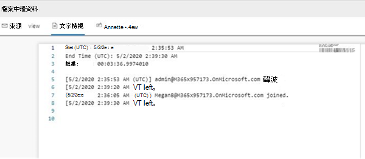

# <a name="conduct-an-ediscovery-investigation-of-content-in-microsoft-teams"></a>對 Microsoft Teams 中的內容進行電子檔探索調查

大型企業通常會面臨高法律訴訟要求提交所有電子儲存資訊 (ESI) 。 您可以在電子檔探索調查期間搜尋和使用 Microsoft Teams 內容。

## <a name="overview"></a>概觀

所有 Microsoft Teams 1：1 或群組聊天會以日誌記錄到個別使用者的信箱。 所有標準頻道訊息都會記錄傳送到代表團隊的群組信箱。 在標準頻道中上傳的檔案會涵蓋在 SharePoint Online 和 商務用 OneDrive 的電子檔探索功能中。

[私人頻道](private-channels.md)中的訊息和檔案電子檔探索運作方式與標準頻道不同。 若要深入瞭解，請參閱 [私人頻道的電子檔探索](#ediscovery-of-private-and-shared-channels)。

並非所有 Teams 內容都可電子檔探索。 下表顯示您可以使用 Microsoft eDiscovery 工具搜尋的內容類型：

|內容類型|eDiscoverable|注釋|
|---|---|---|
|音訊錄製|是||
|卡片內容|是|如需詳細資訊，請參閱 [搜尋卡片內容](#search-for-card-content) 。|
|聊天連結|是||
|聊天訊息|是|這包括標準 Teams 頻道中的內容、1 對 1 聊天、1：N 群組聊天，以及與來賓使用者參與者聊天。|
|程式碼片段|否||
|編輯的郵件|是|如果使用者保留，先前編輯的郵件版本也會保留。|
|Emoji、GIF 和貼圖|是||
|摘要通知|否||
|內嵌影像|是||
|迴圈元件|是|迴圈元件中的內容會儲存在儲存在傳送迴圈元件之使用者商務用 OneDrive帳戶中的 .fluid 檔案中。 這表示在迴圈元件中搜尋內容時，您必須將 OneDrive 包含為數據源。|
|會議 IM 交談|是||
|會議中繼資料<sup>1</sup>|是||
|頻道名稱|是||
|報價|是|可搜尋引用的內容。 不過，搜尋結果不會指出已引用內容。|
| (贊、心和其他反應等反應) |是||
|主題|是||
|表|是||

<sup>1</sup> 會議 (和通話) 中繼資料包含下列專案：

- 會議開始和結束時間，以及持續時間
- 每位參與者的會議加入和離開活動
- VOIP 加入/通話
- 匿名加入
- 同盟使用者加入
- 來賓使用者加入

以下是參與者在會議期間進行聊天交談的範例。


[!div class="mx-imgBorder"]

以下是在 eDiscovery 工具中檢視之相同聊天交談的合規性複本範例。


以下是會議中繼資料的範例。

  > [!div class="mx-imgBorder"]
  > 

如需進行電子檔探索調查的詳細資訊，請參閱 [開始使用電子檔探索 (標準) ](/microsoft-365/compliance/get-started-core-ediscovery)。

Microsoft Teams 資料會在 Excel eDiscovery 匯出輸出中顯示為 IM 或交談。 您可以在 Outlook 中開啟檔案， `.pst` 以便在匯出郵件後檢視這些郵件。

檢視團隊的 .pst 檔案時，所有交談都位於 [交談記錄] 下的 [團隊聊天] 資料夾中。 訊息標題包含團隊名稱和頻道名稱。 例如，下圖顯示來自 Bob 的訊息，其中傳送了「製造規格」小組的 Project 7 標準通道。

![Outlook 中使用者信箱中 [團隊聊天] 資料夾的螢幕擷取畫面。](media/Conduct_an_eDiscovery_investigation_of_content_in_Microsoft_Teams_image1.png)

使用者信箱中的私人聊天會儲存在 [交談記錄] 下的 [小組聊天] 資料夾中。

## <a name="ediscovery-of-private-and-shared-channels"></a>私人和共用頻道的電子檔探索

私人和共用頻道中的郵件合規性複本會根據頻道類型傳送到不同的信箱。 這表示您必須根據使用者所屬的通道類型搜尋不同的信箱位置。

- **私人頻道**。 合規性複本會傳送至私人頻道成員所有成員的信箱。 這表示在搜尋私人頻道訊息中的內容時，您必須搜尋使用者信箱。

- **共用頻道**。 合規性複本會傳送到與上層小組關聯的系統信箱。 由於 Teams 不支援對共用頻道的單一系統信箱進行電子檔探索搜尋，因此在搜尋共用頻道中的郵件內容時，您必須選取團隊信箱) 名稱，以搜尋上層團隊 (的信箱。

每個私人和共用頻道都有各自的 SharePoint 網站，與上層小組網站是分開的。 這表示私人和共用頻道中的檔案會儲存在其自己的網站上，並獨立于上層小組中進行管理。 這表示在搜尋檔案和頻道訊息附件中的內容時，您必須識別並搜尋與頻道相關聯的特定網站。

使用下列各節來協助識別您的電子檔探索搜尋中包含的私人或共用頻道。

### <a name="identifying-the-members-of-a-private-channel"></a>識別私人頻道的成員

使用本節中的程式識別私人頻道的成員，讓您可以使用電子檔探索工具，在成員的信箱中搜尋私人頻道訊息中的內容。

執行這些步驟之前，請確定您已安裝 [最新版本的 Teams PowerShell 模組](teams-powershell-overview.md) 。

1. 執行下列命令以取得包含您要搜尋之共用頻道的團隊識別碼群組識別碼。

   ```powershell
   Get-Team -DisplayName <display name of the the parent team>
   ```

   > [!TIP]
   > 執行 **Get-Team** Cmdlet 而不使用任何參數來顯示貴組織中所有 Teams 的清單。 清單包含每個團隊的群組識別碼和 DisplayName。

2. 執行下列命令以取得上層團隊中的私人頻道清單。 使用您在步驟 1 中取得之團隊的群組識別碼。

   ```PowerShell
    Get-TeamChannel -GroupId <parent team GroupId> -MembershipType Private
   ```

3. 執行下列命令以取得特定私人頻道的私人頻道擁有者和成員清單。

   ```PowerShell
    Get-TeamChannelUser -GroupId <parent team GroupId> -DisplayName "Partner Shared Channel"
   ```

4. 在 [eDiscovery (Standard) ](/microsoft-365/compliance/search-for-content-in-core-ediscovery) 中，或 [是在 eDiscovery (Premium) 中識別和收集監管人內容 ](/microsoft-365/compliance/add-custodians-to-case)時，包含私人頻道擁有者和成員的信箱。

### <a name="identifying-the-sharepoint-site-for-private-and-shared-channels"></a>識別私人和共用頻道的 SharePoint 網站

如先前所述，在私人和共用頻道中共用的檔案 (以及附加至頻道訊息的檔案) 會儲存在與頻道相關聯的網站集合中。 使用本節中的程式來識別與特定私人或共用頻道相關聯之網站的 URL。 然後，您可以使用電子檔探索工具來搜尋網站中的內容。

執行這些步驟之前，請 [先安裝 SharePoint Online 管理命令介面並聯機至 SharePoint Online](/powershell/sharepoint/sharepoint-online/connect-sharepoint-online)。

1. 或者，執行下列動作以取得與上層團隊中共用頻道相關聯之所有 SharePoint 網站集合的清單。

   ```PowerShell
    Get-SPOSite
   ```

   > [!TIP]
   > 與私人和共用頻道相關聯之網站的 URL 命名慣例為 `[SharePoint domain]/sites/[Name of parent team]-[Name of private or shared channel]` 。 例如，名為「合作夥伴共同作業」的共用頻道 URL 位於 Contoso 組織中的「工程團隊」父團隊中 `https://contoso.sharepoint.com/sites/EngineeringTeam-PartnerCollaboration` 。

2. 執行下列 PowerShell 命令，以顯示與貴組織中私人和共用頻道相關聯之所有 SharePoint 網站的 URL。 腳本的輸出也包含父團隊的群組識別碼，您必須在步驟 3 中執行命令。

    ```PowerShell
    $sites = Get-SPOSite -Template "TEAMCHANNEL#1"
    foreach ($site in $sites) {$x= Get-SPOSite -Identity $site.url -Detail; $x.relatedgroupID; $x.url}
    ```

   > [!NOTE]
   > 在 2021 年 6 月 28 日之前建立之私人頻道的 SharePoint 網站會使用自訂範本識別碼的值 `"TEAMCHANNEL#0"` 。 若要顯示在此日期之後建立的私人頻道，請在執行前兩個腳本時使用該值 `"TEAMCHANNEL#1"` 。 共用頻道僅使用 `"TEAMCHANNEL#1"` 。

3. 針對每個上層小組，執行下列 PowerShell 命令以識別私人和共用頻道網站，而上 `$groupID` 層團隊的群組識別碼在哪裡。

    ```PowerShell
    $sites = Get-SPOSite -Template "TEAMCHANNEL#1"
    $groupID = "<group ID of parent team)"
    foreach ($site in $sites) {$x= Get-SpoSite -Identity $site.url -Detail; if ($x.RelatedGroupId -eq $groupID) {$x.RelatedGroupId;$x.url}}
    ```

4. 在 [eDiscovery (Standard) 或在 eDiscovery ](/microsoft-365/compliance/search-for-content-in-core-ediscovery) (Premium) 中 [識別和收集監管人內容 ](/microsoft-365/compliance/add-custodians-to-case)時，將與私人或共用通道關聯的網站納入電子檔探索搜尋查詢。

## <a name="search-for-content-for-guest-users"></a>搜尋來賓使用者的內容

您可以使用電子檔探索工具來搜尋與貴組織中來賓使用者相關的 Teams 內容。 與來賓使用者相關聯的 Teams 聊天內容會保留在雲端式儲存位置，並可使用 eDiscovery 進行搜尋。 這包括搜尋一對一和一對 N 聊天交談中的內容，其中來賓使用者是貴組織中其他使用者的參與者。 您也可以搜尋來賓使用者為參與者的私人頻道訊息，並在只有來賓使用者的來 *賓* 聊天交談中搜尋內容。

若要搜尋來賓使用者的內容：

1. 連線至 Azure AD PowerShell。 For instructions, see the "Connect with the Azure Active Directory PowerShell" section in [Connect to Microsoft 365 with PowerShell](/microsoft-365/enterprise/connect-to-microsoft-365-powershell#connect-with-the-azure-active-directory-powershell-for-graph-module). 請務必完成上一篇文章中的步驟 1 和步驟 2。

2. 成功連線至 Azure AD PowerShell 之後，請執行下列命令，為貴組織中的所有來賓使用者顯示使用者主體名稱 (UPN) 。 在步驟 4 中建立搜尋時，您必須使用來賓使用者的 UPN。

   ```powershell
   Get-AzureADUser -Filter "userType eq 'Guest'" -All $true | FL UserPrincipalName
   ```

   > [!TIP]
   > 您可以將命令輸出重新導向至文字檔，而不是在電腦螢幕上顯示使用者主體名稱清單。 您可以透過附加 `> filename.txt` 到上一個命令來執行此動作。 具有使用者主體名稱的文字檔會儲存到目前的資料夾。

3. 在其他Windows PowerShell視窗中，連線至安全性&合規性中心 PowerShell。 如需相關指示，請參閱 [連線至安全性&合規性中心 PowerShell](/powershell/exchange/connect-to-scc-powershell)。 您可以連線或不使用多重要素驗證。

4. 建立搜尋內容 (如聊天訊息和電子郵件訊息，) 指定的來賓使用者是參與者時執行下列命令。

   ```powershell
   New-ComplianceSearch <search name> -ExchangeLocation <guest user UPN>  -AllowNotFoundExchangeLocationsEnabled $true -IncludeUserAppContent $true
   ```

   例如，若要搜尋與來賓使用者 Sara 莉華相關聯的內容，請執行下列命令。

   ```powershell
   New-ComplianceSearch "Sara Davis Guest User" -ExchangeLocation "sara.davis_hotmail.com#EXT#@contoso.onmicrosoft.com" -AllowNotFoundExchangeLocationsEnabled $true -IncludeUserAppContent $true
   ```

    如需使用 PowerShell 建立內容搜尋的詳細資訊，請參閱 [New-ComplianceSearch](/powershell/module/exchange/new-compliancesearch)。

5. 執行下列命令以開始您在步驟 4 中建立的內容搜尋：

   ```powershell
   Start-ComplianceSearch <search name>
   ```

6. 移至 [https://compliance.microsoft.com](https://compliance.microsoft.com) ，然後按一下 **[顯示所有**  >  **內容搜尋]**。

7. 在搜尋清單中，選取您在步驟 4 中建立的搜尋以顯示飛出視窗頁面。

8. 在飛出視窗頁面上，您可以執行下列動作：

   - 按一下 **[檢視結果** ] 以檢視搜尋結果並預覽內容。

   - 按一下 [ **查詢]** 欄位旁的 [ **編輯** ] 編輯，然後重新執行搜尋。 例如，您可以新增搜尋查詢以縮小結果範圍。

   - 按一下 **[匯出結果** ] 以匯出並下載搜尋結果。

## <a name="search-for-card-content"></a>搜尋卡片內容

由 Teams 頻道中的應用程式、1 對 1 聊天和 1xN 聊天所產生的卡片內容會儲存在信箱中，並可供搜尋。 *卡片* 是簡短內容的 UI 容器。 卡片可以有多個內容和附件，而且可以包含可觸發卡片動作的按鈕。 如需詳細資訊，請參閱 [卡片](/microsoftteams/platform/task-modules-and-cards/what-are-cards)

與其他 Teams 內容一樣，儲存卡片內容的依據是使用卡片的位置。 Teams 頻道中使用的卡片內容會儲存在 Teams 群組信箱中。 1：1 和 1xN 聊天的卡片內容會儲存在聊天參與者的信箱中。

若要搜尋卡片內容，您可以使用 `kind:microsoftteams` 或 `itemclass:IPM.SkypeTeams.Message` 搜尋條件。 檢閱搜尋結果時，Teams 頻道中的 Bot 所產生的卡片內容會將 **寄件者/作者** 電子郵件屬性設為 `<appname>@teams.microsoft.com` ，其中 `appname` 是產生卡片內容之應用程式的名稱。 如果卡片內容是由使用者產生，發 **件人/作者** 的值會識別使用者。

在內容搜尋結果中檢視卡片內容時，內容會顯示為郵件的附件。 附件名稱為 `appname.html` ，其中 `appname` 是產生卡片內容的應用程式名稱。 下列螢幕擷取畫面顯示名為 Asana) 應用程式的卡片內容 (如何顯示在 Teams 和搜尋結果中。

### <a name="card-content-in-teams"></a>Teams 中的卡片內容


### <a name="card-content-in-search-results"></a>搜尋結果中的卡片內容


> [!NOTE]
> 若要在目前搜尋結果中顯示卡片內容的影像， (例如上一個螢幕擷取畫面) 中的核取記號，您必須在用來檢視搜尋結果的相同瀏覽器會話中，于) 的不同索引標籤登入 Teams <https://teams.microsoft.com> (。 否則，會顯示影像預留位置。

## <a name="ediscovery-in-federated-and-non-federated-environments"></a>同盟與非同盟環境中的 eDiscovery

系統管理員可以使用 eDiscovery，在稱為 *外部存取*) 和稱為來賓存取的非同盟 ( (稱為「來賓存 *取* 」的 Teams 會議中搜尋聊天訊息中的內容，) 下列限制：

- **同盟**：在與貴組織使用者及外部組織 (在貴組織) 有外部存取權的使用者的 Teams 會議中，兩個組織的系統管理員都可以搜尋會議聊天訊息中的內容。

- **非同盟**：在與貴組織使用者和來賓使用者的 Teams 會議中，只有主持 Teams 會議之組織的系統管理員可以搜尋會議聊天訊息中的內容。

## <a name="related-topics"></a>相關主題

- [Microsoft 365 電子檔探索解決方案](/microsoft-365/compliance/ediscovery)
- [開始使用 eDiscovery (Standard) ](/microsoft-365/compliance/get-started-core-ediscovery)
- [eDiscovery (Premium) 中的 Teams 工作流程 ](/microsoft-365/compliance/teams-workflow-in-advanced-ediscovery)
- [Teams PowerShell 概觀](teams-powershell-overview.md)
