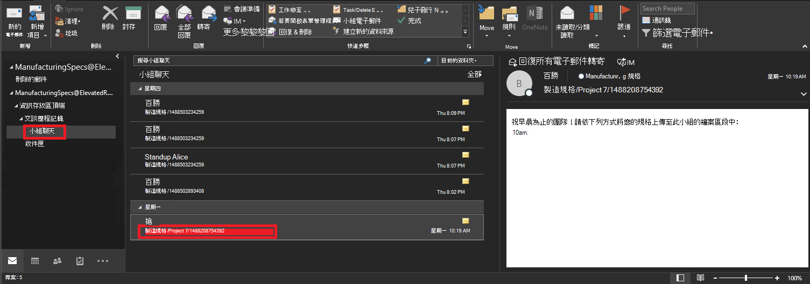
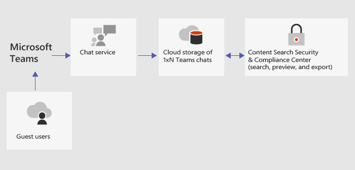

<a name="conduct-an-ediscovery-investigation-of-content-in-microsoft-teams"></a><span data-ttu-id="d5dab-103">在 Microsoft 團隊中進行 eDiscovery 調查內容</span><span class="sxs-lookup"><span data-stu-id="d5dab-103">Conduct an eDiscovery investigation of content in Microsoft Teams</span></span>
============================

<span data-ttu-id="d5dab-104">大型企業通常會面臨大量要求提交所有以電子方式儲存資訊（ESI）的法律訴訟。</span><span class="sxs-lookup"><span data-stu-id="d5dab-104">Large Enterprises are often exposed to high penalty legal proceedings that demand submission of all Electronically Stored Information (ESI).</span></span>

<span data-ttu-id="d5dab-105">所有團隊1:1 或群組聊天都會在各個使用者的信箱中進行歸檔，而所有標準通道訊息都會在代表小組的群組信箱中進行歸檔。</span><span class="sxs-lookup"><span data-stu-id="d5dab-105">All Teams 1:1 or group chats are journaled through to the respective users’ mailboxes, and all standard channel messages are journaled through to the group mailbox representing the team.</span></span> <span data-ttu-id="d5dab-106">在標準頻道中上傳的檔案涵蓋在 SharePoint Online 和商務用 OneDrive 的 eDiscovery 功能底下。</span><span class="sxs-lookup"><span data-stu-id="d5dab-106">Files uploaded in standard channels are covered under the eDiscovery functionality for SharePoint Online and OneDrive for Business.</span></span>

> [!NOTE]
> <span data-ttu-id="d5dab-107">電子檔探索[私人通道](private-channels.md)中的訊息和檔案，與在標準通道中的運作方式不同。</span><span class="sxs-lookup"><span data-stu-id="d5dab-107">eDiscovery of messages and files in [private channels](private-channels.md) work differently than in standard channels.</span></span> <span data-ttu-id="d5dab-108">若要深入瞭解，請參閱電子檔探索（[私人頻道](#ediscovery-of-private-channels)）。</span><span class="sxs-lookup"><span data-stu-id="d5dab-108">To learn more, see [eDiscovery of private channels](#ediscovery-of-private-channels).</span></span>

1.  <span data-ttu-id="d5dab-109">若要使用 Microsoft 團隊內容進行 eDiscovery 調查，請參閱[此](https://support.office.com/article/Manage-eDiscovery-cases-in-the-Office-365-Security-Compliance-Center-edea80d6-20a7-40fb-b8c4-5e8c8395f6da)連結中的步驟1。</span><span class="sxs-lookup"><span data-stu-id="d5dab-109">To conduct an eDiscovery investigation with Microsoft Teams content, review step 1 in [this](https://support.office.com/article/Manage-eDiscovery-cases-in-the-Office-365-Security-Compliance-Center-edea80d6-20a7-40fb-b8c4-5e8c8395f6da) link.</span></span>

2.  <span data-ttu-id="d5dab-110">Microsoft 團隊資料會以 IM 或交談的方式顯示在 Excel eDiscovery 匯出輸出中，而且您可以裝載。[PST] （Outlook）來查看匯出後的郵件。</span><span class="sxs-lookup"><span data-stu-id="d5dab-110">Microsoft Teams data will appear as IM or Conversations in the Excel eDiscovery export output, and you can mount the .PST in Outlook to view those messages post export.</span></span>

    <span data-ttu-id="d5dab-111">裝載時。針對團隊的 PST，請注意，所有交談都會保留在 [交談記錄] 底下的 [小組聊天] 資料夾中。</span><span class="sxs-lookup"><span data-stu-id="d5dab-111">When mounting the .PST for the Team, note that all conversations are kept in the Team Chat folder under Conversation History.</span></span> <span data-ttu-id="d5dab-112">郵件標題會對應到 [小組] 和 [頻道]。</span><span class="sxs-lookup"><span data-stu-id="d5dab-112">The title of the message aligns to Team and Channel.</span></span> <span data-ttu-id="d5dab-113">從 [查看] 下方的影像，您可以看到來自 Bob 的訊息，messaged 製造規範小組的專案7標準頻道。</span><span class="sxs-lookup"><span data-stu-id="d5dab-113">From reviewing the image below, you can see this message from Bob who messaged the Project 7 standard channel of the Manufacturing Specs team.</span></span>

    

3.  <span data-ttu-id="d5dab-115">若要查看使用者信箱中的私人聊天，他們也位於 [交談歷程記錄] 底下的 [小組聊天] 資料夾內。</span><span class="sxs-lookup"><span data-stu-id="d5dab-115">To see private chats in a user’s mailbox, they are also located inside the Team Chat folder under Conversation History.</span></span>

## <a name="ediscovery-of-guest-to-guest-chats"></a><span data-ttu-id="d5dab-116">電子檔探索訪客與來賓聊天</span><span class="sxs-lookup"><span data-stu-id="d5dab-116">eDiscovery of guest-to-guest chats</span></span>

<span data-ttu-id="d5dab-117">若沒有信箱，來賓對訪客的聊天（沒有家用租使用者的1xN 聊天）就不會被編制索引，因此也不會包含在 eDiscovery 中。</span><span class="sxs-lookup"><span data-stu-id="d5dab-117">Without a mailbox, guest-to-guest chats (1xN chats in which there are no home tenant users) would not be indexed, and as a result, would not be included in eDiscovery.</span></span> <span data-ttu-id="d5dab-118">若要協助電子檔探索以進行來賓對訪客聊天，會建立一個雲端信箱（或幻影信箱）來儲存1xN 資料。</span><span class="sxs-lookup"><span data-stu-id="d5dab-118">To facilitate eDiscovery for guest-to-guest chats, a cloud-based mailbox (or phantom mailbox) is created to store the 1xN data.</span></span> <span data-ttu-id="d5dab-119">在將團隊聊天資料儲存在雲端型信箱之後，就會針對 eDiscovery 與合規性內容搜尋編制索引。</span><span class="sxs-lookup"><span data-stu-id="d5dab-119">After the Teams chat data is stored in the cloud-based mailbox, it is indexed for eDiscovery and compliance content search.</span></span>

<span data-ttu-id="d5dab-120">下圖顯示 eDiscovery 如何針對沒有信箱的來賓對訪客聊天進行運作。</span><span class="sxs-lookup"><span data-stu-id="d5dab-120">The following illustration shows how eDiscovery works for guest-to-guest chats in which there isn’t a mailbox.</span></span>



## <a name="ediscovery-of-private-channels"></a><span data-ttu-id="d5dab-122">電子檔探索（私人頻道）</span><span class="sxs-lookup"><span data-stu-id="d5dab-122">eDiscovery of private channels</span></span>

<span data-ttu-id="d5dab-123">在私人通道中傳送的訊息記錄會傳送到所有私人通道成員的信箱，而不是群組信箱。</span><span class="sxs-lookup"><span data-stu-id="d5dab-123">Records for messages sent in a private channel are delivered to the mailbox of all private channel members, rather than to a group mailbox.</span></span> <span data-ttu-id="d5dab-124">記錄的標題會設定格式，以指出其傳送的是哪一種私人頻道。</span><span class="sxs-lookup"><span data-stu-id="d5dab-124">The titles of the records are formatted to indicate which private channel they were sent from.</span></span>

<span data-ttu-id="d5dab-125">因為每個私人通道都有自己的 SharePoint 網站集合與父小組網站分開，所以專用通道中的檔案會獨立于父團隊進行管理。</span><span class="sxs-lookup"><span data-stu-id="d5dab-125">Because each private channel has its own SharePoint site collection that's separate from the parent team site, files in a private channel are managed independently of the parent team.</span></span>

<span data-ttu-id="d5dab-126">小組不支援單一頻道的 eDiscovery，所以必須搜尋整個小組。</span><span class="sxs-lookup"><span data-stu-id="d5dab-126">Teams doesn't support eDiscovery of a single channel, so the whole team must be searched.</span></span> <span data-ttu-id="d5dab-127">若要在私人頻道中執行電子檔探索搜尋，請在整個小組中搜尋、與私人頻道相關聯的網站集合（包括檔案），以及私人頻道成員的信箱（以包含郵件）。</span><span class="sxs-lookup"><span data-stu-id="d5dab-127">To perform an eDiscovery search of content in a private channel, search across the team, the site collection associated with the private channel (to include files), and mailboxes of private channel members (to include messages).</span></span>

<span data-ttu-id="d5dab-128">使用下列步驟來識別您在 eDiscovery 搜尋中包含的私人頻道中的檔案和訊息。</span><span class="sxs-lookup"><span data-stu-id="d5dab-128">Use the following steps to identify files and messages in a private channel to include in  your eDiscovery search.</span></span>

### <a name="include-private-channel-files-in-an-ediscovery-search"></a><span data-ttu-id="d5dab-129">在 eDiscovery 搜尋中包含私人通道檔案</span><span class="sxs-lookup"><span data-stu-id="d5dab-129">Include private channel files in an eDiscovery search</span></span>

<span data-ttu-id="d5dab-130">在執行這些步驟之前，請先安裝[Sharepoint Online 管理命令介面並聯機至 SharePoint online](https://docs.microsoft.com/powershell/sharepoint/sharepoint-online/connect-sharepoint-online?view=sharepoint-ps)。</span><span class="sxs-lookup"><span data-stu-id="d5dab-130">Before you perform these steps, install the [SharePoint Online Management Shell and connect to  SharePoint Online](https://docs.microsoft.com/powershell/sharepoint/sharepoint-online/connect-sharepoint-online?view=sharepoint-ps).</span></span>

1. <span data-ttu-id="d5dab-131">執行下列動作，以取得與團隊中的私人頻道相關聯的所有 SharePoint 網站集合的清單。</span><span class="sxs-lookup"><span data-stu-id="d5dab-131">Run the following to get a list of all SharePoint site collections associated with private channels in the team.</span></span>

    ```
    Get-SPOSite
    ```
2. <span data-ttu-id="d5dab-132">執行下列 PowerShell 腳本，以取得與團隊中的私人頻道與父團隊群組識別碼相關聯的所有 SharePoint 網站集合 Url 清單。</span><span class="sxs-lookup"><span data-stu-id="d5dab-132">Run the following PowerShell script to get a list of all SharePoint site collection URLs associated with private channels in the team and the parent team group ID.</span></span>

    ```
    $sites = get-sposite -template "teamchannel#0"
    foreach ($site in $sites) {$x= get-sposite -identity $site.url -detail; $x.relatedgroupID; $x.url} 
    ```
3. <span data-ttu-id="d5dab-133">針對每個團隊或群組識別碼，請執行下列 PowerShell 腳本來找出所有相關的專用通道網站，其中 $groupID 是團隊的群組識別碼。</span><span class="sxs-lookup"><span data-stu-id="d5dab-133">For each team or group ID, run the following PowerShell script to identify all relevant private channel sites, where $groupID is the group ID of the team.</span></span>

    ```
    $sites = get-sposite -template "teamchannel#0"
    $groupID = “e8195240-4a70-4830-9106-80193cf717cb“
    foreach ($site in $sites) {$x= Get-SpoSite -Identity $site.url -Detail; if ($x.RelatedGroupId -eq $groupID) {$x.RelatedGroupId;$x.url}}
    ```

### <a name="include-private-channel-messages-in-an-ediscovery-search"></a><span data-ttu-id="d5dab-134">在 eDiscovery 搜尋中包含私人通道訊息</span><span class="sxs-lookup"><span data-stu-id="d5dab-134">Include private channel messages in an eDiscovery search</span></span>

<span data-ttu-id="d5dab-135">在執行這些步驟之前，請確定您已安裝[最新版本的團隊 PowerShell 模組](teams-powershell-overview.md)。</span><span class="sxs-lookup"><span data-stu-id="d5dab-135">Before you perform these steps, make sure you have the [latest version of the Teams PowerShell module](teams-powershell-overview.md) installed.</span></span>

1. <span data-ttu-id="d5dab-136">執行下列動作，取得小組中的私人頻道清單。</span><span class="sxs-lookup"><span data-stu-id="d5dab-136">Run the following to get a list of private channels in the team.</span></span>

    ```
    Get-TeamChannel -GroupId <GroupID> -MembershipType Private
    ```
2. <span data-ttu-id="d5dab-137">執行下列動作以取得私人頻道成員的清單。</span><span class="sxs-lookup"><span data-stu-id="d5dab-137">Run the following to get a list of private channel members.</span></span>

    ```
    Get-TeamChannelUser -GroupId <GroupID> -DisplayName "Engineering" -Role Member
    ```
3. <span data-ttu-id="d5dab-138">從小組中的每個私人頻道包含所有成員的信箱，成為 eDiscovery 搜尋查詢的一部分。</span><span class="sxs-lookup"><span data-stu-id="d5dab-138">Include the mailboxes of all members from each private channel in the team as part of your eDiscovery search query.</span></span>

## <a name="related-topics"></a><span data-ttu-id="d5dab-139">相關主題</span><span class="sxs-lookup"><span data-stu-id="d5dab-139">Related topics</span></span>

- [<span data-ttu-id="d5dab-140">團隊 PowerShell 概覽</span><span class="sxs-lookup"><span data-stu-id="d5dab-140">Teams PowerShell Overview</span></span>](teams-powershell-overview.md)