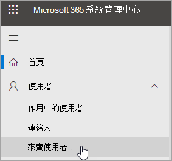
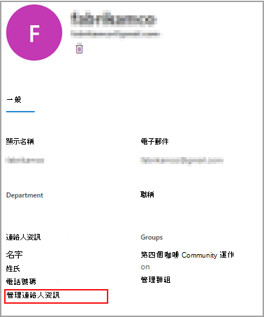
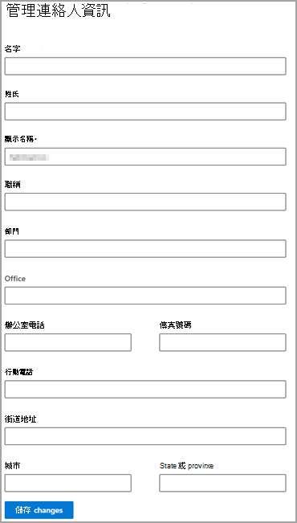

# 編輯來賓使用者資訊

您可以從 Microsoft 365 系統管理中心或 Azure Active Directory 入口網站編輯來賓資訊。

## Microsoft 365 系統管理員中的來賓使用者

1. 若要在 [Microsoft 365 系統管理中心](https://admin.microsoft.com)編輯來賓資訊，請選取 [**使用者**  >  **來賓使用者**]。

   

2. 選取 [ **來賓使用者**] 中的使用者。

3. 在 [來賓使用者資訊] 中，選取 [ **管理連絡人資訊**]。

   

4. 編輯您選擇的任何欄位（除了 [**管理連絡人資訊**] 中的 [**顯示名稱**] 以外），然後選取 [**儲存變更**]。

   

您也可以從 [Azure Active Directory 入口網站](https://aad.portal.azure.com/#blade/Microsoft_AAD_IAM/UsersManagementMenuBlade/MsGraphUsers)編輯來賓使用者。
