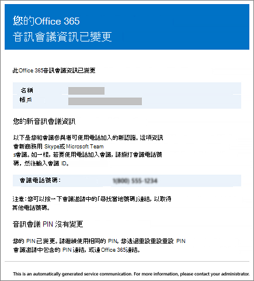
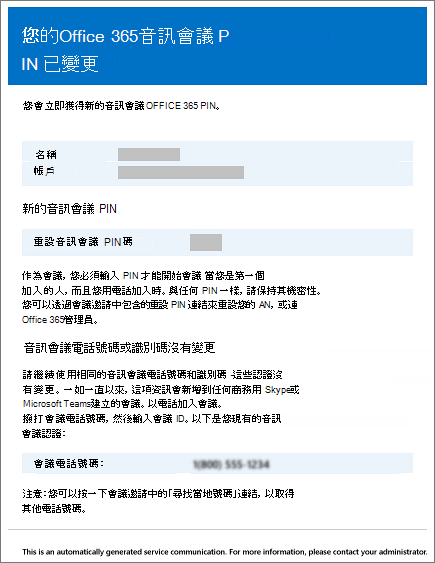
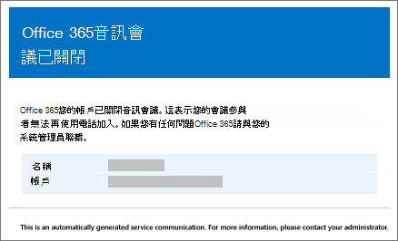

# <a name="emails-sent-to-users-when-their-settings-change-in-microsoft-teams"></a>當使用者的設定變更時，會以電子郵件Microsoft Teams

電子郵件會自動寄給使用 Microsoft 作為音訊會議[](set-up-audio-conferencing-in-teams.md)提供者啟用音訊會議的使用者。

根據預設，有四種類型的電子郵件會寄給啟用音訊會議的使用者。 不過，如果您想要限制發送給使用者的電子郵件數量，您可以將其關閉。 當發生以下Microsoft 365 Office 365音訊會議會傳送電子郵件至使用者的電子郵件：

- **音訊會議授權會指派給他們，或是當您將音訊會議提供者變更為 Microsoft 時。**

     此電子郵件包含會議 ID、會議的預設會議電話號碼、使用者的音訊會議 PIN，以及使用 商務用 Skype Online 會議更新工具的指示和連結，此工具是用來更新使用者的現有會議。 請參閱[指派Microsoft Teams附加元件授權或](./teams-add-on-licensing/microsoft-teams-add-on-licensing.md)指派 Microsoft[做為音訊會議提供者](/SkypeForBusiness/audio-conferencing-in-office-365/assign-microsoft-as-the-audio-conferencing-provider)。

    > [!NOTE]
    > 如果貴組織已啟用動態會議 ID，他們排程的所有會議都會有唯一的會議 ID。 您可以在貴組織中[設定音訊會議動態的 ID。](/skypeforbusiness/audio-conferencing-in-office-365/reset-a-conference-id-for-a-user) 

    以下是此電子郵件的範例：

     

    若要進一瞭解授權，請參閱Microsoft Teams[附加元件授權](./teams-add-on-licensing/microsoft-teams-add-on-licensing.md)。

- **使用者的會議 ID 或預設會議電話號碼會變更。**

    此電子郵件包含會議 ID、預設會議電話號碼，以及使用 商務用 Skype 線上會議更新工具，用來更新使用者現有會議的指示和連結。 但此電子郵件不包含使用者的音訊會議 PIN。 請參閱[為使用者重設會議 ID。](reset-a-conference-id-for-a-user-in-teams.md)

    以下是此電子郵件的範例：

     

- **使用者的音訊會議 PIN 會重設。**

    此電子郵件包含召集人的音訊會議 PIN、現有的會議 ID，以及使用者的預設會議電話號碼。 請參閱 [重設音訊會議 PIN](reset-the-audio-conferencing-pin-in-teams.md)。
    
     以下是此電子郵件的範例：
    
     
  
- **使用者授權會移除，或是音訊會議提供者從 Microsoft 變更為其他提供者或無。**

    從使用者移除 **音訊會議授權** ，或將音訊會議提供者設定為 None 時，會發生 **此情況**。

    請參閱[指派或移除商務Microsoft 365授權](https://support.office.com/article/997596b5-4173-4627-b915-36abac6786dc)。

    以下是此電子郵件的範例：

     

> [!NOTE]
> [!INCLUDE [updating-admin-interfaces](includes/updating-admin-interfaces.md)]

## <a name="make-changes-to-the-email-messages-that-are-sent-to-them"></a>變更要寄給他們的電子郵件訊息

您可以變更自動發送給使用者的電子郵件。 根據預設，電子郵件的寄件者會來自 Microsoft 365 或 Office 365，但您可以使用 Windows PowerShell 變更顯示Windows PowerShell。 詳細資訊[Microsoft Teams PowerShell 參考](/powershell/module/teams/?view=teams-ps)。

## <a name="what-if-you-dont-want-email-to-be-sent-to-them"></a>如果您不希望電子郵件寄給他們，該怎麼處理？

當您停用傳送電子郵件給使用者時，即使使用者獲得授權，也不會傳送電子郵件。 在這種情況下，會議 ID、預設會議電話號碼，以及更重要的是，其音訊會議 PIN 不會發送給使用者。 發生此情況時，您必須傳送另一封電子郵件或打電話給使用者，告知使用者。

根據預設，電子郵件會寄給您的使用者，但如果您想要防止他們收到音訊會議的電子郵件，您可以使用 Microsoft Teams 或 Windows PowerShell。 

 **使用 Microsoft Teams 系統管理中心**

1. 在左側流覽中，前往 **會議**  >  **會議橋接器**。 

2. 在 [會議橋接器 **」** 頁面頂端，按一下 [ **橋接器設定>**。 

3. 在橋接器 **設定窗格中** ，啟用或停用當使用者的撥入設定變更時自動 **傳送電子郵件給使用者**。

4. 按一下 [儲存]。

> [!Note]
> [!INCLUDE [updating-admin-interfaces](includes/updating-admin-interfaces.md)]

**使用Windows PowerShell**

您也可以使用 PowerShell 模組Microsoft Teams並執行：

```PowerShell
Set-CsOnlineDialInConferencingTenantSettings -AutomaticallySendEmailsToUsers $true|$false
```

您可以使用 [Set-CsOnlineDialInConferencingTenantSettings](/powershell/module/skype/set-csonlinedialinconferencingtenantsettings) 來管理貴組織的其他設定，包括電子郵件。

詳細資訊[Microsoft Teams PowerShell 參考](/powershell/module/teams/?view=teams-ps)。

## <a name="want-to-know-more-about-windows-powershell"></a>想要進一Windows PowerShell？

根據預設，電子郵件的寄件者會來自 Microsoft 365 或 Office 365，但您可以使用 Windows PowerShell 變更電子郵件地址和Windows PowerShell。 

Windows PowerShell管理使用者，以及允許或不允許使用者執行哪些操作。 有了Windows PowerShell，您可以使用單一Microsoft 365管理Office 365管理，當您有多個工作需要執行時，可以簡化您的日常工作。 若要開始使用Windows PowerShell，請參閱以下主題：

  - [為什麼您需要使用 PowerShell Office 365 PowerShell](/microsoft-365/enterprise/why-you-need-to-use-microsoft-365-powershell)

  - [使用 Office 365 管理Windows PowerShell](/previous-versions//dn568025(v=technet.10))

如要進一Windows PowerShell，請參閱[powerShell](/powershell/module/teams/?view=teams-ps) Microsoft Teams以瞭解更多資訊。


## <a name="related-topics"></a>相關主題

[啟用或停用音訊會議設定變更時傳送電子郵件的設定](enable-or-disable-sending-emails-when-their-settings-change-in-teams.md)

[傳送內含音訊會議資訊的電子郵件給使用者](send-an-email-to-a-user-with-their-dial-in-information-in-teams.md)
