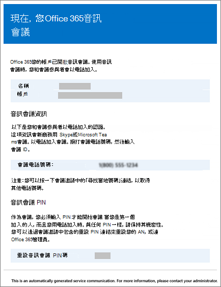

# 啟用或停用 Microsoft 團隊中的音訊會議設定變更時傳送電子郵件

當使用者啟用音訊會議時，系統會自動透過電子郵件收到通知。 不過，有時您可能會想要減少傳送給 Microsoft 團隊使用者的電子郵件數目。 在這種情況下，您可以停用傳送電子郵件。
  
如果您停用傳送電子郵件，語音會議電子郵件不會傳送給您的使用者，包括使用者在音訊會議中啟用或停用的電子郵件、其 PIN 重設時，以及會議 ID 和預設會議電話號碼的變更。
  
以下是在啟用音訊會議時傳送給使用者的電子郵件範例：
  

  
## 何時要傳送電子郵件給使用者？

- 在啟用音訊會議之後，會有幾封電子郵件會傳送給貴組織中的使用者：
    
  - 將**音訊會議**授權指派給他們時。
    
  - 當您手動重設使用者的音訊會議 PIN 時。
    
  - 手動重設使用者的會議 ID。
    
  - 從他們移除**音訊會議**授權時。
    
  - 當使用者的音訊會議提供者從 Microsoft 變更為另一個提供者或 [**無**] 時。
    
  - 當使用者的音訊會議提供者變更為 Microsoft 時。

## 啟用或停用傳送電子郵件給使用者的電子郵件

您可以使用 Microsoft 團隊或 Windows PowerShell 來啟用或停用傳送給使用者的電子郵件。

 **使用 Microsoft Teams 系統管理中心**

1. 在左側導覽中，前往 [**會議** > **會議橋**]。 

2. 在 [**會議橋接**] 頁面頂端，按一下 [**橋設定**]。 

3. 在 [**橋設定**] 窗格中，如果使用者的撥入設定變更，請啟用或停用**自動傳送電子郵件給使用者**。

4. 按一下 [儲存]****。

  
> [!Note]
> [!INCLUDE [updating-admin-interfaces](includes/updating-admin-interfaces.md)]

**使用 Windows PowerShell**
  
如需詳細資訊，請參閱[Microsoft 團隊 PowerShell 參考](https://docs.microsoft.com/powershell/module/teams/?view=teams-ps)。

    
## 想要深入瞭解 Windows PowerShell 嗎？

Windows PowerShell 全部說明如何管理使用者，以及允許或不允許的使用者執行。 在 Windows PowerShell 中，您可以使用單一管理點來管理 Office 365，以便在有多項工作需要執行時簡化日常作業。 若要開始使用 Windows PowerShell，請參閱以下主題：
    
  - [為什麼需要使用 Office 365 PowerShell](https://go.microsoft.com/fwlink/?LinkId=525041)
    
  - [使用 Windows PowerShell 管理 Office 365 的最佳方式](https://go.microsoft.com/fwlink/?LinkId=525142)
    
如需有關 Windows PowerShell 的詳細資訊，請參閱[Microsoft 團隊 PowerShell 參考](https://docs.microsoft.com/powershell/module/teams/?view=teams-ps)，以取得詳細資訊。
    
  
## 相關主題

[在使用者的音訊會議設定變更時傳送給使用者的電子郵件](emails-sent-to-users-when-their-settings-change-in-teams.md)

[傳送內含音訊會議資訊的電子郵件給使用者](send-an-email-to-a-user-with-their-dial-in-information-in-teams.md)

