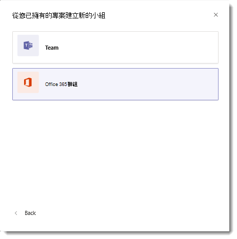

# 使用Microsoft 365增強現有的Microsoft Teams

Microsoft Teams使用者可以使用Microsoft 365功能Teams現有群組。 當研究如何加強公用Microsoft 365群組時，如果成員數目等於或小於 5，000，使用者可以這麼做。

若要這麼做，使用者應該從用戶端執行建立Microsoft Teams流程。 從 **群組Microsoft 365** 建立，然後選擇您想要使用群組來強化  >  **** Teams。 現有的群組成員會自動新增為團隊的成員。

> [!IMPORTANT]
> 只有Microsoft 365群組擁有者有權使用 Teams 增強現有群組，且該群組必須包含少於 5，000 個使用者。 Teams增強功能的顯示專案不會顯示在清單中。
>
>除非符合這些條件，否則Microsoft 365群組建立團隊的選項。

使用者也可以邀請通訊群組清單加入團隊，而該通訊群組清單的成員將會新加入團隊。 這是一次新增功能，之後在通訊群組清單中的群組成員資格變更將不會複製或同步Teams。

您也可以將已啟用郵件的安全性群組新增為小組成員。 但是，如果您稍後新增更多成員至安全性群組，這些成員不會自動新加入團隊。 您必須個別新增新成員，或重新新增安全性群組至小組。  (如果您重新新增安全性群組，重復資料刪除會確保只新增成員一次。) 

有兩種類型的隱私權設定，Microsoft 365群組、**公用和私人**。 雖然這兩種群組類型都可以Teams，但在自助方面則稍有不同。

-   使用者可以搜尋公用群組，並可以自行加入，而不需要團隊擁有者核准。

-   私人群組無法搜尋，使用者無法加入，除非團隊擁有者將群組新增為成員。

在 Teams 中建立新團隊時，現有私人 Microsoft 365 群組的擁有者可以選擇使用 Microsoft 365 群組中的成員資格來建立團隊。 使用者可以新增檔案的SharePoint及OneNote，併合並SharePoint檔案OneNote檔案。
