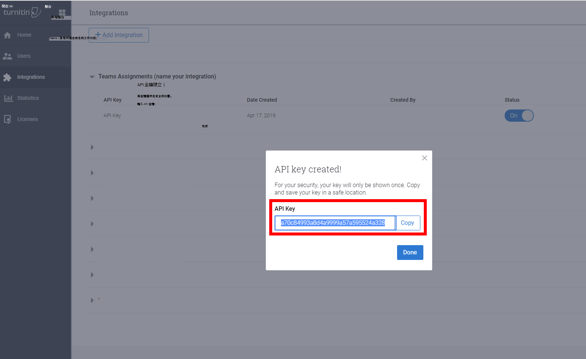

# Teams 教育版中的作業Assignments in Teams for Education

教育課程課程Teams作業和成績功能，讓教育者可以將工作、工作或測驗指派給學生。The Assignments and Grades features in Teams for Education allow educators to assign tasks, work, or quizzes to their students. 教師可以管理作業時程表、指示、新增資源以上交、以成績評分等等。Educators can manage assignment timelines, instructions, add resources to turn in, grade with rubrics, and more. 他們也可以追蹤課程和個別學生的進度在 "成績" 選項卡中。They can also track class and individual student progress in the Grades tab.

[深入瞭解教育Teams作業和成績](https://support.office.com/article/microsoft-teams-5aa4431a-8a3c-4aa5-87a6-b6401abea114?ui=en-US&rs=en-IE&ad=IE#ID0EAABAAA=Assignments)。[Learn more about Assignments and Grades in Teams for Education](https://support.office.com/article/microsoft-teams-5aa4431a-8a3c-4aa5-87a6-b6401abea114?ui=en-US&rs=en-IE&ad=IE#ID0EAABAAA=Assignments).

> [!Note]
> 有關不同平臺上Teams作業的詳細資訊，請參閱[Teams平臺的功能。](https://support.microsoft.com/office/teams-features-by-platform-debe7ff4-7db4-4138-b7d0-fcc276f392d3)For details about Teams assignments on different platforms, see [Teams features by platform](https://support.microsoft.com/office/teams-features-by-platform-debe7ff4-7db4-4138-b7d0-fcc276f392d3).

## 系統管理中心中的作業Microsoft Teams整合Assignments integrations in the Microsoft Teams admin center

您可以使用系統管理中心Microsoft Teams設定，為貴組織及其學生中的教育人員開啟或關閉功能。Using the admin settings in the Microsoft Teams admin center, you can turn features on or off for educators within your organization and their students. 以下是與作業相關的設定：The following are settings related to Assignments:

### 每週監護人電子郵件摘要Weekly guardian email digest

監護人電子郵件會在每個週末寄給家長或監護人。Guardian emails are sent each weekend to parents or guardians. 電子郵件包含前一周和下周的作業相關資訊。The email contains information about assignments from the previous week and for the upcoming week. 家長和監護人同步設定可以使用[學校資料同步處理。](/schooldatasync/parent-contact-sync)The Parent and Guardian Sync can be setup using [School Data Sync](/schooldatasync/parent-contact-sync).

1. 在 SDS 中透過家長和監護人同步操作來輸入家長連絡人資訊。Import parent contact information via Parent and Guardian Sync in SDS. 有關如何啟用家長和監護人同步處理的指示，請參閱 [啟用家長和監護人同步處理](/schooldatasync/parent-contact-sync#enabling-parent-and-guardian-sync)。For instructions on how to enable Parent and Guardian Sync, see [Enabling Parent and Guardian Sync](/schooldatasync/parent-contact-sync#enabling-parent-and-guardian-sync).

2. 在系統管理中心Microsoft Teams監護人設定，因為預設會關閉設定。Turn on the Guardian Setting in the Microsoft Teams admin center, as the setting is turned off by default. 這可讓教師傳送每週摘要。This will enable teachers to send out a weekly digest.

   > [!NOTE]
   > 教師可以退出宣告摘要，在他們自己的個人班級小組中取消選擇設定 (作業設定 >家長 **/** 監護人電子郵件) 。Teachers can opt-out of the digest by deselecting the setting inside their own personal class team (**Assignment Settings > Parent/Guardian Emails**).

若要確認家長會收到電子郵件，下列三個專案必須正確：To verify that Parents will get the email the following three items must be true:

 - 附加至 SDS 中學生個人資料的電子郵件地址，並標記為 _家長或__監護人_。Email address attached to the student profile in SDS and tagged as _Parent_ or _Guardian_. 詳細資料請參閱家長 [和監護人同步檔案格式](/schooldatasync/parent-contact-sync-file-format)。For details, see [Parent and Guardian Sync File Format](/schooldatasync/parent-contact-sync-file-format).

 - 學生至少屬於一個班級，教師不會在作業設定中停用 [電子郵件](https://support.microsoft.com/office/adjust-assignment-settings-in-your-class-team-05bb3b89-1cdf-415a-b6c7-44add0376a77)。Students belong to at least one class in which e-mail is not disabled by the teacher in [assignment settings](https://support.microsoft.com/office/adjust-assignment-settings-in-your-class-team-05bb3b89-1cdf-415a-b6c7-44add0376a77).

 - 電子郵件會包含在前一周或下周有到期日的作業相關資訊。The emails will contain information about assignments that had a due date in the previous week or in the upcoming week.

此功能的預設設定為 - **關閉**。Default setting for this feature is - **Off**.

### MakeCodeMakeCode
Microsoft MakeCode 是一個區塊式編碼平臺，能讓所有學生都瞭解電腦科學。Microsoft MakeCode is a block-based coding platform that brings computer science to life for all students. 

MakeCode 是 Microsoft 產品，受 Microsoft[使用條款和](https://go.microsoft.com/fwlink/?LinkID=206977)[隱私權](https://go.microsoft.com/fwlink/?LinkId=521839)政策所規範。MakeCode is a Microsoft product that is subject to the Microsoft [terms of use](https://go.microsoft.com/fwlink/?LinkID=206977) and [privacy](https://go.microsoft.com/fwlink/?LinkId=521839) policies.

此功能的預設設定為 - **關閉**。Default setting for this feature is - **Off**.

若要在 Teams中啟用 MakeCode 作業，請Teams系統管理 **中心**、流覽至作業區段，然後將 MakeCode 切換選項切換到 **開啟**。To enable MakeCode assignments in Teams, go to the **Teams Admin Center**, navigate to the **Assignments** section, and turn the MakeCode toggle option to **On**. 按一下 [儲存]。Click **Save**. 允許幾個小時讓這些設定生效。Allow a few hours for these settings to take effect.

有關此功能運作方式的資訊，請參閱此 [影片示範](https://makecode.com/blog/teams/teams-assignments)。For more information on how this feature works, see this [video demonstration](https://makecode.com/blog/teams/teams-assignments).

[深入瞭解 MakeCode](https://aka.ms/makecode)。[Learn more about MakeCode](https://aka.ms/makecode).

### TurnitinTurnitin

[Turnitin](https://www.turnitin.com/) 是一項學術誠信服務。[Turnitin](https://www.turnitin.com/) is an academic integrity service. 這是受其條款和隱私權政策所保護的協力廠商產品或服務。This is a third-party product or service that is subject to its own terms and privacy policy. 您有責任使用任何協力廠商產品和服務。You are responsible for your use of any third-party products and services.

此功能的預設設定為 - **關閉**。Default setting for this feature is - **Off**..

若要為貴組織啟用 Turnitin，您需要一個 Turnitin 訂閱。To enable Turnitin for your organization, you will need a Turnitin subscription. 然後，您可以輸入下列資訊，這些資訊可在 Turnitin 系統管理主控台找到：Then you can input the following information, which can be found in your Turnitin admin console:

  * **TurnitinApiKey：** 這是一個 32 個字元的 GUID，位於系統管理主控台的整合下。**TurnitinApiKey**: This is a 32-character GUID found in the admin console under Integrations.
  * **TurnitinApiUrl：** 這是您 Turnitin 系統管理主控台的 HTTPS URL。**TurnitinApiUrl**: This is the HTTPS URL of your Turnitin admin console.

以下是一些指示，可協助您取得這項資訊。Here are some instructions to help you obtain this information.

**TurnitinApiUrl** 是系統管理主控台的主機位址。The **TurnitinApiUrl** is the host address of your admin console.
範例：`https://your-tenant-name.turnitin.com`Example: `https://your-tenant-name.turnitin.com`

您可以在系統管理主控台建立整合與與整合相關聯的 API 金鑰。The admin console is where you can create an integration and an API key associated with the integration.

從 **側邊功能表中** 選取整合，然後選取新增 **整合** 並命名整合。Select **Integrations** from the side menu, then select **Add Integration** and give the integration a name.

在您遵循提示後，系統就會提供 **TurnitinApiKey。**The **TurnitinApiKey** will be given to you after you follow the prompts. 複製 API 金鑰並貼到系統管理Microsoft Teams中心。Copy the API key and paste it into the Microsoft Teams admin center.  這是您唯一可以查看金鑰的時間。This is the only time you can view the key.

按一下系統管理 **中心中的** 此設定中的儲存按鈕後，請允許幾個小時讓這些設定生效。Upon clicking the **Save** button in the admin center for this setting, allow a few hours for these settings to take effect.