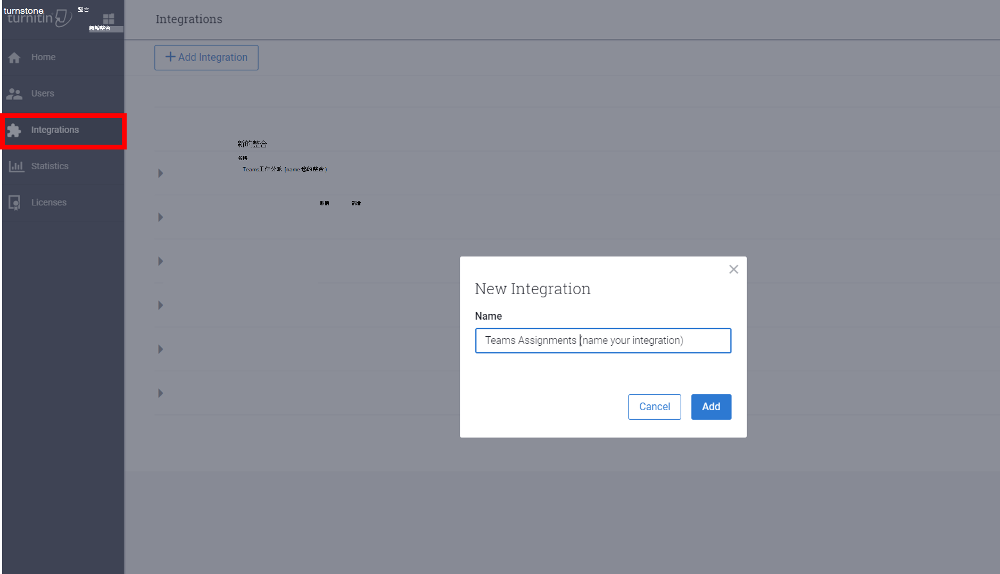

# Teams 教育版中的作業

Teams 教育版中的作業和成績功能可讓授課者將工作、工作或測驗指派給學生。 授課者可以管理作業時程表、指示、新增資源以繳交、使用量表評分等等。 他們也可以在 [成績] 索引標籤中追蹤班級和個別學生的進度。

[深入瞭解 Teams 教育版 中的作業和成績](https://support.office.com/article/microsoft-teams-5aa4431a-8a3c-4aa5-87a6-b6401abea114?ui=en-US&rs=en-IE&ad=IE#ID0EAABAAA=Assignments)。

> [!Note]
> 如需不同平臺上 Teams 作業的詳細資訊，請參閱 [逐平臺的 Teams 功能](https://support.microsoft.com/office/teams-features-by-platform-debe7ff4-7db4-4138-b7d0-fcc276f392d3)。

## Microsoft Teams 系統管理中心的作業整合

您可以使用 Microsoft Teams 系統管理中心的系統管理設定，為貴組織中的授課者及其學生開啟或關閉功能。

若要檢視和管理 [作業] 設定，請移至 Teams 系統管理中心的 <a href="https://admin.teams.microsoft.com/education/assignments-settings" target="_blank"> **[教育**  >  **作業設定**</a>]。

下列是與作業相關的設定：

### 每週監護人電子郵件摘要

監護人電子郵件會每個週末傳送給家長或監護人。 電子郵件包含上周和未來一周的作業相關資訊。 家長和監護人同步處理可以使用 [學校資料同步](/schooldatasync/parent-contact-sync)處理來設定。

1. 透過 SDS 中的家長和監護人同步處理匯入家長連絡資訊。 如需有關如何啟用家長和監護人同步處理的指示，請參閱 [啟用家長和監護人同步](/schooldatasync/parent-contact-sync#enabling-parent-and-guardian-sync)處理。

2. 開啟 Microsoft Teams 系統管理中心的監護人設定，因為預設會關閉此設定。 這可讓教師傳送每週摘要。

   > [!NOTE]
   > 教師可以退出宣告摘要，方法是取消選取其個人班級團隊內的設定， ([ **作業設定] >家長/監護人電子郵件**) 。

若要確認家長會收到電子郵件，下列三個專案必須為 True：

- Email位址附加至 SDS 中的學生設定檔，並標記為 _家長_ 或 _監護人_。 如需詳細資料，請參閱 [家長和監護人同步處理檔案格式](/schooldatasync/parent-contact-sync-file-format)。

- 學生至少屬於教師在 [作業設定](https://support.microsoft.com/office/adjust-assignment-settings-in-your-class-team-05bb3b89-1cdf-415a-b6c7-44add0376a77)中停用電子郵件的班級。

- 電子郵件會包含具有上周或未來一周到期日之作業的相關資訊。

此功能的預設設定為 - **關閉**。

### MakeCode

Microsoft MakeCode 是一個以區塊為基礎的編碼平臺，可讓所有學生都能使用電腦科學。

MakeCode 是受 Microsoft [使用規定](https://go.microsoft.com/fwlink/?LinkID=206977) 和 [隱私](https://go.microsoft.com/fwlink/?LinkId=521839) 策略規範的 Microsoft 產品。

此功能的預設設定為 - **關閉**。

若要在 Teams 中啟用 MakeCode 作業，請移至 **Teams 管理員中心**，流覽至 [**作業**] 區段，然後將 [MakeCode] 切換選項切換為 [**開啟]**。 選取 [儲存 **]**。 允許幾個小時，這些設定才會生效。

如需有關此功能運作方式的詳細資訊，請觀看這段 [影片示範](https://makecode.com/blog/teams/teams-assignments)。

[深入瞭解 MakeCode](https://aka.ms/makecode)。

### Turnitin

[Turnitin](https://www.turnitin.com/) 是學術完整性服務。 這是受其本身條款和隱私權原則規範的協力廠商服務。 您必須為使用任何協力廠商產品和服務負責。

此功能的預設設定為 - **關閉**。

若要為您的組織啟用 Turnitin，您需要 Turnitin 訂閱。 然後，您可以輸入下列資訊，以便在 Turnitin 系統管理主控台中找到：

- **TurnitinApiKey**：這是一個 32 個字元的 GUID，位於 [整合] 下的系統管理主控台。
- **TurnitinApiUrl**：這是 Turnitin 系統管理主控台的 HTTPS URL。

以下是一些可協助您取得此資訊的指示。

**TurnitinApiUrl** 是您系統管理主控台的主機位址。
範例：`https://your-tenant-name.turnitin.com`

您可以在系統管理主控台建立整合，以及與整合相關聯的 API 金鑰。

從側邊功能表選 **取 [整合** ]，然後選取 [ **新增整合** ]，然後為整合命名。

依照提示操作後，系統會提供 **TurnitinApiKey** 給您。
複製 API 金鑰並貼到 Microsoft Teams 系統管理中心。  這是您唯一可以檢視金鑰的時間。

按一下系統管理中心中的 [儲存 **] 按鈕來** 執行此設定時，這些設定需要幾個小時才會生效。

## 作業資料

作業會儲存由教師和學生產生的資訊。 所有資料都會在教師和特定學生之間共用，而該資訊是用於班級中。 此資料有兩個儲存區：SharePoint 和 SharePoint 外部。

>[!NOTE]
>相同的規則也適用于第一方整合，例如閱讀進度。

### SharePoint 文件庫中的作業資料

與提交作業相關聯的學生檔案會儲存在名為： *學生作業*)  (的文件庫中。 與教師建立且由學生存取的作業相關聯的檔案會儲存在另一個文件庫中， (名稱為： *課程檔案*) 對應的課程小組 SharePoint 網站。 第一方整合可能也會將作業資料儲存在同一個對應的課程小組 SharePoint 網站中， (名稱為： *作業標題 + 時間戳記*) 。

#### 與學生相關聯的檔案

IT 系統管理員可以使用內容搜尋工具來搜尋學生檔案 (*學生作業*、 *課程檔案* 或其他第一方整合檔案，) 與作業提交的作業和檔案相關聯。 例如，系統管理員可以搜尋組織中的所有 SharePoint 網站，並在搜尋查詢中使用學生的名稱和班級或作業名稱來尋找與資料主體要求 (DSR) 相關的資料。

#### 與教師相關聯的檔案

IT 系統管理員可以使用內容搜尋工具，搜尋教師檔案 (*學生作業*、 *課程檔案* 或其他第一方整合檔案) ，這些檔案與作業相關之作業和由班級內的教師針對作業散發給學生的檔案相關。 例如，系統管理員可以搜尋組織中的所有 SharePoint 網站，並在搜尋查詢中使用教師的名稱和班級或作業名稱來尋找與 DSR 相關的資料。

### SharePoint 文件庫外部的作業資料

某些與作業相關的資料不會儲存在課程小組 SharePoint 網站中，這表示無法使用內容搜尋來搜尋。 這包括：

- 學生成績和教師的意見反應
- 每個學生提交的作業檔案清單
- 作業詳細資料，例如到期日等。
- 第一方整合資料，例如閱讀進度段落或學生髮音資料

針對這類資料，IT 系統管理員或教師等資料擁有者可能需要進入課程小組的作業，以尋找與 DSR 相關的資料。 系統管理員可以將自己新增為班級的擁有者，並檢視該班級團隊的所有作業。

>[!NOTE]
>如果學生不再是班級的一部分，他們的資料可能仍會出現在班級中，因為 *已不再註冊*。 學生必須向租使用者系統管理員提供他們曾經參與過的這類課程清單。

### 大量匯出 SharePoint 文件庫外部的作業資料

#### 針對學生

若要大量匯出單一學生的資料，請在將學生從他們所屬於的班級中移除之前， [執行腳本](/microsoft-365/education/deploy/configure-assignments-for-teams) 並提供 ``userId`` 。 如果學生已從網站中移除，系統管理員可以在執行腳本之前將學生加回班級，或者系統管理員可以提供 ``userId`` ``classId`` 學生屬於該學生的一部分。

學生提交的相關資料將會匯出。

#### 適用于教師

大量匯出作業資料的運作方式與學生相同，但教師有權存取的所有提交都會匯出。

### 大量刪除 SharePoint 文件庫外部的作業資料

#### 針對學生

若要大量刪除單一學生的資料，請在將學生從他們所屬於的班級中移除之前， [執行腳本](/microsoft-365/education/deploy/configure-assignments-for-teams) 並提供 ``userId`` 。 如果學生已從網站中移除，系統管理員可以在執行腳本之前將學生加回班級，或者系統管理員可以提供 ``userId`` ``classId`` 學生屬於該學生的一部分。

提供將 ``ClassId`` 可讓系統管理員只刪除特定班級中的學生相關資訊。

#### 適用于教師

由於教師的作業資料會跨班級共用，因此沒有大量刪除選項。 系統管理員可以改將自己新增至班級、移至應用程式，然後刪除作業。

如需詳細資訊，請參閱設定 [Teams 的作業](/microsoft-365/education/deploy/configure-assignments-for-teams)。

## 移除作業和成績

您也可以使用 Teams 原則來移除特定使用者或整個租使用者的作業和成績。

若要移除個別使用者的作業和成績，請移至 **Teams 管理員中心** 並流覽至 **Teams 應用程式>許可權原則** 以建立新的應用程式許可權原則定義。  建立新原則定義時，將 **Microsoft 應用程式** 原則設定為 _封鎖特定應用程式，並允許所有其他應用程式_ ，並將 **作業** 和 **成績** 新增至封鎖的應用程式清單。 儲存新的原則定義之後，請將它指派給適當的使用者。

若要移除整個租使用者的作業和成績，請移至 **Teams 管理員中心**，流覽至 **Teams 應用程式>管理應用程式**，並從應用程式清單中搜尋並選取 **[作業** 和 **成績**]。 將應用程式設定頁面中的狀態設定變更為 _[封鎖]_。

## 使用者的作業診斷工具

Microsoft 支援服務已建立工具來收集 Microsoft 工程小組的診斷資料，以調查與 [作業] 功能相關的問題。

您可以在使用者遇到問題的任何畫面上，于 [作業] 記憶體取此工具。

若要在 Teams 中提取診斷工具，使用者可以：

- **在桌面和網頁上：**
  - 選取 Ctrl+/
- **在行動裝置上：**
  - 使用兩指觸控螢幕並旋轉手指 45 度，或
  - 使用三指點選螢幕 15 秒

診斷工具彈出後，使用者會看到 Microsoft 技術支援可能需要的資料清單。

摱取的資料可能包括：

- 群組識別碼
- 租用戶識別碼
- 會話識別碼
- 作業識別碼
- 提交識別碼
- 使用者識別碼

此資料不會自動傳送至 Microsoft。 使用者必須將資料複製並貼到 Microsoft 支援服務代理商，以取得支援票證。

如果使用者提取診斷工具，然後將其關閉，就不會傳送任何資料。

當資料傳送給 Microsoft 支援服務專員時，資料會根據貴組織的 Microsoft 365 服務合約以支援資料的方式處理。

如需使用此診斷工具與授課者和學生共用的相關指示，請參閱 [取得診斷資料以疑難排解作業](https://support.microsoft.com/topic/b40793f5-dbae-4c8a-841a-6baa7f232e2e)。
