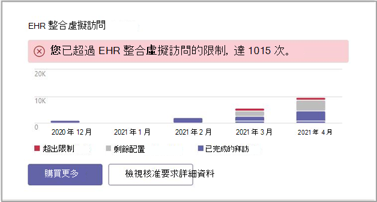

# Microsoft Teams EHR 連接器系統管理員報告

[Microsoft Teams電子健康情況記錄 (EHR) 連接器系統管理報告對話方塊提供使用狀況資料的快速且容易閱讀的視圖。

您可以到系統管理Teams儀表板並檢視對話方塊，Microsoft Teams EHR 連接器系統管理員報告。

從系統管理中心儀表板Microsoft Teams報表。

 

對話方塊提供下列資料：

- 超出限制
- 剩餘配置
- 已完成的拜訪

您可以使用報表對話方塊購買更多虛擬訪問。

## 相關文章

- [使用虛擬Teams - 整合至 Cerner EHR](ehr-admin-cerner.md)
- [使用虛擬Teams - 整合至Epic EHR](ehr-admin.md)
