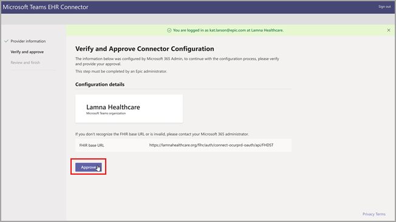
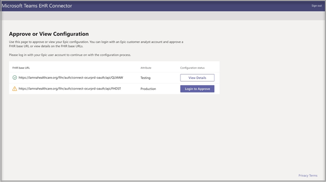

# 使用 Teams 虛擬就診 - 整合至 EHR

Microsoft TeamsEHR (EHR) 連接器的電子健康記錄功能，讓臨床醫師可以直接從 EHR 系統，在 Teams 中啟動虛擬病患拜訪或諮詢。 Microsoft Teams 建立在 Microsoft 365 雲端上，可在支援符合 HIPAA、HITECH 認證等法規的單一中樞中，使用聊天、影片、語音和醫療保健工具進行簡單、安全的共同作業和通訊。
Teams 的通訊和共同作業平台讓臨床醫生能輕鬆消除零碎系統的雜亂，可以將時間花費在提供最佳的照護上。 Microsoft TeamsEHR (電子健康) 連接器可以：

- 使用整合Teams，從提供者 EHR 系統啟動虛擬訪問。
- 可讓病患從Teams入口網站加入虛擬訪問。
- 將中繼資料寫回 EHR 系統，Teams出席者連接和中斷連接時進行虛擬訪問，並啟用自動稽核和記錄保留功能。

  觀看如何從 EHR 入口網站管理虛擬就診的影片。

> [!VIDEO https://www.microsoft.com/videoplayer/embed/RE4HAtn]

## 開始之前

您需要確定您具有下列先決條件，才能整合 EHR 連接器：

- 在 [Epic 的 App Orchard 市集](https://apporchard.epic.com/Gallery?id=6153)中存取以使用 Microsoft Teams 應用程式。

- 適用于醫療保健的 Microsoft Cloud 訂閱，或訂閱 Microsoft Teams EHR 連接器獨立版方案 (僅在生產測試期間強制執行) 。

- 使用者必須擁有包含 Microsoft Teams 會議的適當 Microsoft 365 或 Office 365 授權。

- Microsoft Teams 應該採用並用於組織內部。

- 組織必須有 Epic 2018 年 11 月版本或更新版本。

- 您的系統必須符合所有[軟體與瀏覽器必要條件](../../hardware-requirements-for-the-teams-app.md)。

您也需要貴組織中下列人員的資訊：

- Microsoft 365 系統管理員

- Epic 客戶分析師

> [!Note]
> 請與您的 Epic 技術專家檢視 [Epic-Microsoft Teams 遠距健康整合指南](https://galaxy.epic.com/Search/GetFile?Url=1!68!100!100100357)。 確定所有先決條件都已完成。 

## 連接器設定

連接器設定需要您：

- [啟動 EHR 連接器組式入口網站](ehr-admin.md#launch-the-ehr-connector-configuration-portal)
- [組態資訊](ehr-admin.md#configuration-information)
- [核准或檢視組態](ehr-admin.md#approve-or-view-configuration)
- [檢閱並完成組態](ehr-admin.md#review-and-finish-the-configuration)

### [啟動 EHR 連接器組式入口網站](#launch-the-ehr-connector-configuration-portal)

啟動 EHR 連接器組Microsoft Teams開始將醫療保健組織配置為使用虛擬Microsoft Teams啟動虛擬訪問。 您可以設定單一或多個組織來測試整合。 在組態入口網站中設定測試與生產 URL。 在移至生產環境之前，先從 Epic 的測試環境測試整合。
  
- EHR 連接器組態 URL：[https://ehrconnector.teams.microsoft.com](https://ehrconnector.teams.microsoft.com)

貴組織的 Microsoft 365 系統管理員和 Epic 客戶分析師必須完成組態入口網站的資訊和整合步驟。 如需 Epic 組態步驟，請連絡指派給貴組織的 Epic 技術專家資源。

### [組態資訊](#configuration-information)

此步驟由 **Microsoft 365 系統管理員** 完成。 Microsoft 365 系統管理員必須啟動連接器組態入口網站，並且使用 Microsoft 認證來登入，才能開始組態程序。

若要完成此步驟，Microsoft 365 系統管理員必須收到 Epic 技術專家的有效快速健康照護互通資源 (FHIR) 基底 URL，以及將核准組態的 Epic 客戶分析師使用者名稱。 Microsoft 365 系統管理員必須啟動連接器組態頁面，並且使用 Microsoft 認證來登入，才能開始組態程序。

- FHIR 基底 URL 是一個靜態位址，對應到您的伺服器 FHIR API 端點。 範例 URL 是 `https://lamnahealthcare.org/fihr/auth/connect-ocurprd-oauth/api/FHDST`。

- 組態核准者名稱是 Epic 客戶分析師的名稱，負責在下一個步驟中核准組態。 Epic 客戶分析師是貴組織中具有 Epic 登入存取權的人員。

  

### [核准或檢視組態](#approve-or-view-configuration)

已新增為核准者之醫療保健組織的Epic客戶分析師現在必須使用上一個步驟中的相同 EHR 連接器 URL，才能使用其 Microsoft 365 認證進行登錄。 成功驗證之後，系統會要求核准者使用他們的 Epic 認證來驗證 Epic 組織。

> [!Note]
> 貴組織的 Microsoft 365 系統管理員和 Epic 客戶分析師可以是相同的人員。 在這種情況下，將您自己的使用者名稱新增為核准者。 您仍然需要登入 Epic 以驗證您的存取權。 Epic 登入僅用於驗證您的 FHIR 基底 URL。 Microsoft 不會透過這個登入來儲存認證或存取 EHR 資料。

  

成功進行 Epic 登入之後，Epic 客戶分析師 **必須** 核准組態。 如果組態不正確，Microsoft 365 系統管理員可以再次登入 Microsoft EHR 連接器入口網站來修改原始組態。 

### [檢閱並完成組態](#review-and-finish-the-configuration)

當 Epic 系統管理員核准組態資訊時，將會顯示病患和提供者啟動的整合記錄。 這些記錄是完成 Epic 中虛擬就診組態的必要項目。 請參閱 Epic-Microsoft Teams 遠距健康整合指南以了解更多詳細資料。

> [!Note]  
> Microsoft 365 或 Epic 客戶分析師隨時都可以登入組態入口網站，視需要檢視整合記錄並修改組織組態。

> [!Note]
> Epic 客戶分析師必須針對 Microsoft 系統管理員之前所設定的每一個 FHIR URL 完成核准程序。

## 啟動 Teams 虛擬就診

完成 EHR 連接器步驟和長篇大說之後，貴組織就可以使用 Microsoft Teams 支援視Microsoft Teams。

### 虛擬就診必要條件

- 您的系統必須符合所有[軟體與瀏覽器必要條件](../../hardware-requirements-for-the-teams-app.md)。

- 醫療保健組織必須已完成 Epic 組織與 Microsoft 365 組織之間的設定。

### 提供者體驗

貴組織的醫療保健提供者也可以從他們的 Epic 提供者應用程式 (Hyperspace、Haiku、Canto) 加入使用 Microsoft Teams 的虛擬就診。 **[開始虛擬就診]** 按鈕內嵌在提供者流程中。

提供者體驗的主要功能：

- 提供者可以使用支援的瀏覽器或 Microsoft Teams 應用程式加入虛擬就診。

- 提供者第一次加入虛擬就診時，必須使用其 Microsoft 365 帳戶進行一次性登入。

- 一次性登入之後，提供者將直接進入 Microsoft Teams 中的虛擬約會。(提供者必須已登入 Microsoft Teams)。

- 提供者可以看到指定約會的參與者連線和中斷連線即時更新。 提供者可以看到病患何時連線到虛擬就診。

  

### 病患體驗

連接器可支援透過 MyChart Web 與行動版加入虛擬就診的病患。 在預約時，病患可以使用 **[開始虛擬就診]** 按鈕，從 MyChart 開始虛擬就診。

病患體驗的主要功能：

- 病患無需安裝 App，即可在桌面和行動裝置上加入新式網頁瀏覽器 [的虛擬流覽](../mobile-browser-join.md)。

- 病患只需要按一下即可加入虛擬就診，不需要其他帳戶或登入。

- 病患不需要建立 Microsoft 帳戶或登入就可以啟動虛擬就診。

- 病患將進入大廳，直到醫療保健提供者加入約會並准許他們進行虛擬就診。

- 在加入虛擬就診之前，可以在大廳測試視訊和麥克風是否可用。

  

> [!Note]
> Epic、MyChart、Haiku 和 Canto 是 Epic Systems Corporation 的商標。

### 資料隱私權和位置

Teams 與 EHR 系統的整合，可最佳化整合和虛擬就診流程期間所使用和儲存的資料量。 解決方案遵循 Teams 隱私權中概述的整體 Teams 隱私權和資料管理原則和指導方針。

Microsoft Teams EHR 連接器不會儲存或傳輸任何可識別個人資料，也不會從 EHR 系統傳輸任何病患或醫療保健提供者的健康記錄。 EHR 連接器儲存的唯一資料是 EHR 使用者的唯一識別碼，在 Teams 會議設定期間使用。 EHR 使用者的唯一識別碼儲存在 [Microsoft 365 客戶資料儲存位置](/microsoft-365/enterprise/o365-data-locations)的三個地理區域其中之一。 會議參與者在 Teams 中輸入的所有聊天、錄音及其他資料，都是根據現有的儲存原則來儲存。 如果您想要深入了解 Microsoft Teams 中資料的位置，請參閱 [Teams 中資料的位置](../../location-of-data-in-teams.md)。

## 相關主題

[Teams虛擬訪問](ehr-admin-reports.md)