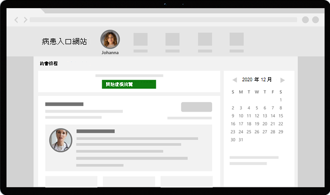

# 含 Teams 的虛擬造訪 - 整合至 EHR

Microsoft Teams電子健康情況記錄 (EHR) 連接器可讓病患輕鬆直接從 EHR 系統啟動虛擬病患造訪或與Microsoft Teams中的另一個提供者諮詢。 建置在Microsoft 365雲端上，Teams可在單一集線器中使用聊天、視訊、語音和醫療保健工具進行簡單、安全的共同作業和通訊，支援符合 HIPAA、HITECH 認證等功能。

Teams的通訊與共同作業平臺可讓文工士輕鬆地解決雜亂的系統，讓他們能夠專注于提供最佳的保養。 使用 Teams EHR 連接器，您可以：

- 使用整合式的醫療工作流程，從您的 EHR 系統啟動Teams虛擬造訪。
- 讓病患從病患入口網站或簡訊加入Teams虛擬造訪。
- 支援其他案例，包括多參與者、群組造訪和翻譯服務。
- 將中繼資料寫回 EHR 系統，Teams虛擬造訪]，以便在出席者連線、中斷連線時記錄，並啟用自動稽核和記錄保留。
- 檢視已連線 EHR 的使用資料包告和可自訂的通話品質資訊。

請觀看這段影片，瞭解如何從 EHR 入口網站管理虛擬造訪。

> [!VIDEO https://www.microsoft.com/videoplayer/embed/RE4HAtn]

本文說明如何設定和設定 Teams EHR 連接器，以與您醫療保健組織中的 [圖庫] 平臺整合。 它也可以讓您概略瞭解來自 EHR 系統Teams虛擬造訪體驗。

## 開始之前

在您開始之前，有幾個方法可以準備整合。

### 熟悉整合程式

請檢閱下列資訊，以瞭解整體整合程式。

:::image type="content" source="media/ehr-connector-epic-flow.png" alt-text="匯總整體整合程式步驟的影像。":::

||||||
|---------|---------|---------|---------|---------|
|**動作**：您 [要求存取Teams應用程式](#request-access-to-the-teams-app)。   **結果**：我們授權貴組織進行測試。|**動作**：我們建立公用和私人金鑰憑證，並將它們上傳到 [中心]。   **結果**：[圖表] 會同步處理公開金鑰憑證。|**動作**：您已完成 EHR 連接器設定入口網站中的設定步驟。   **結果**：您會收到 Preview 設定的 FDI 記錄。| **動作**：您與您的 Preview 技術專家合作，在 [圖庫] 中設定 FDI 記錄。  **結果**：設定已完成。 準備進行測試。|**動作**：您在測試環境中完成測試。  **結果**：完整驗證流量，並決定移至生產。|

### 要求存取Teams應用程式

您必須要求存取Teams應用程式。

1. 要求下載 Teams 市集市集的[App](https://apporchard.epic.com/Gallery?id=6153)。 這麼做會觸發從[程式集] 到 Microsoft EHR 連接器團隊的要求。
1. 提出要求之後，請傳送電子郵件給 [TeamsForHealthcare@service.microsoft.com](mailto:teamsforhealthcare@service.microsoft.com) ，其中包含您的組織名稱、租使用者識別碼，以及您的 Preview 技術連絡人的電子郵件地址。
1. Microsoft EHR 連接器小組會以啟用確認方式回復您的電子郵件。

### 檢閱 Epic-Microsoft Teams Telehealth 整合指南]

請與您的 Epic 技術專家檢視 [Epic-Microsoft Teams 遠距健康整合指南](https://galaxy.epic.com/Search/GetFile?Url=1!68!100!100100357)。 確定符合所有先決條件。

## 必要條件

- Microsoft Teams EHR 連接器獨立服務的使用中訂閱Microsoft Cloud for Healthcare或訂閱只在生產 EHR 環境中測試時 (強制) 。
- 2018 年 11 月或更新版本的版本。
- 使用者有包含Teams會議的適當Microsoft 365或Office 365授權。
- Teams在您的醫療保健組織中採用並使用。
- 您的系統符合Teams的所有[軟體和瀏覽器需求](../../hardware-requirements-for-the-teams-app.md)。

> [!IMPORTANT]
> 在進行整合之前，請務必先完成整合前的步驟，並符合所有先決條件。

整合步驟是由組織中的下列人員執行：

- **Microsoft 365全域系統管理員**：負責整合的主要人員。 系統管理員會設定連接器、視需要啟用簡訊 () ，並新增負責核准設定的等客戶分析師。
- **規模宏的客戶分析師**：貴組織中具有Pical登入認證的人員。 他們核准系統管理員輸入的組態設定，並將組態記錄提供給 [圖庫]。

Microsoft 365管理員和等客戶分析師可以是同一位人員。

## 設定 Teams EHR 連接器

連接器設定需要您：

- [啟動 EHR 連接器設定入口網站](#launch-the-ehr-connector-configuration-portal)
- [輸入設定資訊](#enter-configuration-information)
- [啟用 SMS 通知 (選用) ](#enable-sms-notifications-optional)
- [核准或檢視設定](#approve-or-view-the-configuration)
- [檢閱並完成組態](#review-and-finish-the-configuration)

### 啟動 EHR 連接器設定入口網站

若要開始使用，您的Microsoft 365系統管理員會啟動[EHR 連接器設定入口網站](https://ehrconnector.teams.microsoft.com)，並使用其Microsoft 365認證登入。

您的Microsoft 365管理員可以設定單一組織或多個組織來測試整合。 在組態入口網站中設定測試與生產 URL。 移至生產之前，請務必先測試從 [程式集] 測試環境進行整合。

> [!NOTE]
> 您的Microsoft 365系統管理員和等客戶分析師必須完成組態入口網站中的整合步驟。 如需 [中心] 設定步驟，請連絡指派給貴組織的 Preview 技術專家。

### 輸入設定資訊

接下來，若要設定整合，您的Microsoft 365系統管理員會執行下列動作：

1. 新增快速健康情況互通性資源 (由您的 Preview 技術專家提供的 FHIR) 基礎 URL，並指定環境。 視貴組織的需求和您想要測試的環境而定，視需要設定任意數量的 FHIR 基礎 URL。

    - FHIR 基底 URL 是一個靜態位址，對應到您的伺服器 FHIR API 端點。 範例 URL 是 `https://lamnahealthcare.org/fihr/auth/connect-ocurprd-oauth/api/FHDST`。

    - 您可以設定測試與生產環境的整合。 對於初始設定，我們鼓勵您在進入生產之前，先從測試環境設定連接器。

1. 新增等於稍後步驟中核准設定之等等客戶分析師的使用者名稱。

    :::image type="content" source="media/ehr-connector-epic-configure.png" alt-text="[設定] 頁面的螢幕擷取畫面，顯示正在新增核准者。" lightbox="media/ehr-connector-epic-configure.png":::

### 啟用 SMS 通知 (選用) 

> [!NOTE]
> SMS 通知目前僅在美國中提供。 我們正努力在未來的 Teams 版本中于其他地區提供此功能，並且會在可用時更新本文。

如果您的組織想要 Microsoft 管理您病患的簡訊通知，請完成此步驟。 當您啟用簡訊通知時，您的病患將會收到排定造訪的確認和提醒訊息。

若要啟用簡訊通知，Microsoft 365系統管理員執行下列動作：

1. 在 [簡訊通知] 頁面上，選取這兩個同意核取方塊：

    - 允許 Microsoft 代表貴組織傳送簡訊通知給病患。
    - 確認您將確保出席者已同意傳送和接收簡訊。
    
    :::image type="content" source="media/ehr-connector-epic-sms-notifications.png" alt-text="[簡訊通知] 頁面的螢幕擷取畫面，顯示 [同意] 核取方塊以及產生電話號碼的選項。" lightbox="media/ehr-connector-epic-sms-notifications.png":::

1. 在 **[您的電話號碼**] 底下，選 **取 [產生新的電話號碼** ] 以產生組織的電話號碼。 這樣做會啟動要求並產生新電話號碼的程式。 此程式最多可能需要 2 分鐘才能完成。

    產生電話號碼之後，電話號碼會顯示在螢幕上。 此號碼將用來傳送簡訊確認和提醒給您的病患。 該編號已布建，但尚未連結到 FHIR 基礎 URL。 您會在下一個步驟中這麼做。

    :::image type="content" source="media/ehr-connector-epic-phone-number.png" alt-text="螢幕擷取畫面顯示所產生的電話號碼範例。" lightbox="media/ehr-connector-epic-phone-number.png":::

    選擇 **[完成**]，然後選取 [ **下一步]**。

1. 若要將電話號碼連結至 FHIR 基底 URL，請在 [**SMS 設定**] 區段中的 **[電話號碼**] 底下，選取該號碼。 針對您要啟用 SMS 通知的每個 FHIR 基礎 URL 執行此動作。

    :::image type="content" source="media/ehr-connector-epic-link-phone-number.png" alt-text="螢幕擷取畫面顯示如何將電話號碼連結至 FHIR 基底 URL。" lightbox="media/ehr-connector-epic-link-phone-number.png":::

    如果這是您第一次設定連接器，您會看到先前步驟輸入的 FHIR 基底 URL。 相同的電話號碼可以連結至多個 FHIR 基 URL，這表示病患會收到來自不同組織和/或部門相同電話號碼的簡訊通知。

1. 選取每個 FHIR 基礎 URL 旁的 **[簡訊設定** ]，以設定要傳送給病患的簡訊通知類型。

    :::image type="content" source="media/ehr-connector-epic-sms-setup.png" alt-text="顯示 SMS 設定設定的螢幕擷取畫面。" lightbox="media/ehr-connector-epic-sms-setup.png":::

    - **確認簡訊**：在 EHR 系統中排定、更新或取消造訪時，通知會傳送給病患。
    - **提醒簡訊**：通知會根據您指定的時間間隔和已排程的造訪時間傳送給病患。

    選擇 [ **儲存]**。

1. 選 **Upload憑證** 以上傳公開金鑰憑證。 您必須只針對每個環境上傳編碼為 base64 (公開金鑰) .cer 憑證。

    需要公開金鑰憑證才能接收傳送簡訊通知的約會資訊。 需要憑證以驗證傳入資訊是否來自有效的來源。

    當連接器用來傳送簡訊提醒時，病患的電話號碼會由在等於[等量] 中建立約會時，由 HL7v2 有效載宏中的 [等量] 傳送病患的電話號碼。 這些數位會儲存在貴組織地理位置的每個約會中，並保留直到約會進行為止。 若要深入瞭解如何設定 HL7v2 訊息，請參閱[Microsoft Teams電子郵件整合指南。](https://galaxy.epic.com/Search/GetFile?Url=1!68!100!100100357)

    選擇 **[下一步]**。

> [!NOTE]
> 您的Microsoft 365系統管理員隨時可以更新任何簡訊設定。 請記住，變更設定可能會導致 SMS 服務停止。 如需如何檢視 SMS 報告的詳細資訊，請[參閱Teams EHR 連接器系統管理員報告](ehr-admin-reports.md)。

### 核准或檢視設定

您組織中新增為核准者的[EHR 連接器設定入口網站](https://ehrconnector.teams.microsoft.com)，並使用其Microsoft 365認證登入。 驗證成功之後，核准者會被要求使用其 [圖釋] 認證登入，以驗證Pical 組織。

> [!Note]
> 如果Microsoft 365系統管理員和等式客戶分析師是同一位人員，您仍然需要登入[等同]，才能驗證您的存取權。 [空格圖] 登入僅用來驗證您的 FHIR 基礎 URL。 Microsoft 不會使用此登入來儲存認證或存取 EHR 資料。

:::image type="content" source="media/ehr-connector-epic-login-approve.png" alt-text="[核准] 或 [檢視設定] 頁面的螢幕擷取畫面，顯示 [登入] 和 [核准] 選項。" lightbox="media/ehr-connector-epic-login-approve.png":::

成功登入Picl 之後，等客戶分析師 **必須** 核准設定。 如果設定不正確，您的Microsoft 365管理員可以登入組態入口網站並變更設定。

:::image type="content" source="media/ehr-connector-epic-approve.png" alt-text="顯示 [核准] 選項的 [核准] 或 [檢視設定] 頁面的螢幕擷取畫面。" lightbox="media/ehr-connector-epic-approve.png":::

### 檢閱並完成組態

當 Epic 系統管理員核准組態資訊時，將會顯示病患和提供者啟動的整合記錄。 整合記錄包括：

- 病患和提供者記錄
- 直接簡訊記錄
- SMS 設定記錄
- 裝置測試設定記錄

等量表客戶分析師必須提供這些記錄給Picl，才能完成 [等量] 中的虛擬造訪設定。 如需詳細資訊，請參閱 Microsoft Teams [Telehealth 整合指南。](https://galaxy.epic.com/Search/GetFile?Url=1!68!100!100100357)

> [!Note]  
> Microsoft 365或等客戶分析師隨時都可以登入組態入口網站，視需要檢視整合記錄並變更組織設定。

:::image type="content" source="media/ehr-connector-epic-finish.png" alt-text="顯示整合資訊之 [校閱] 和 [完成] 頁面的螢幕擷取畫面。" lightbox="media/ehr-connector-epic-finish.png":::

> [!Note]
> 等客戶分析師必須完成Microsoft 365系統管理員所設定之每個 FHIR 基礎 URL 的核准程式。

## 啟動Teams虛擬造訪

完成 EHR 連接器步驟和 [圖釋] 設定之後，您的組織就可以使用 Teams 支援視訊流覽。

### 虛擬造訪先決條件

- 您的系統必須符合Teams的所有[軟體和瀏覽器需求](../../hardware-requirements-for-the-teams-app.md)。

- 您已完成 [圖文集] 組織與您的Microsoft 365組織之間的整合設定。

### 提供者體驗

貴組織的醫療保健提供者可以使用來自 Hyperspace、並存取、Canto)  (等提供者應用程式Teams來加入造訪。 **[開始虛擬就診]** 按鈕內嵌在提供者流程中。

提供者體驗的主要功能：

- 提供者可以使用支援的瀏覽器或Teams應用程式加入流覽次數。

- 第一次加入造訪時，提供者必須使用其Microsoft 365帳戶進行一次性登入。

- 一次性登入之後，提供者會直接前往Teams中的虛擬約會。  (提供者必須登入Teams) 。

- 提供者可以即時看到參與者連線並中斷特定約會的連線和中斷連線的更新。 提供者可以查看病患何時連線到訪訪。

  

> [!NOTE]
> 針對醫療記錄連續性或保留目的，在會議聊天中輸入的任何資訊，都應由醫療保健提供者下載、複製及標注。 聊天不構成法律醫療記錄或指定的記錄集。 來自聊天的訊息會根據Microsoft Teams管理員建立的設定來儲存。

### 病患體驗

連接器支援透過 MyChart Web 和行動裝置加入造訪病患。 在預約時，病患可以使用 [ **開始虛擬造訪** ] 按鈕從 MyChart 開始造訪。

病患體驗的主要功能：

- 病患不需要安裝Teams應用程式，即可從[桌上型電腦和行動裝置上的現代化網頁瀏覽器](../browser-join.md)加入流覽。

- 只要按一下，病患就可以加入造訪，不需要其他帳戶或登入。

- 病患不需要建立 Microsoft 帳戶或登入即可啟動造訪。

- 病患會被置於大廳，直到提供者加入並接受。

- 病患可以先在大廳測試視訊和麥克風，然後再加入造訪。

  

> [!Note]
> Epic、MyChart、Haiku 和 Canto 是 Epic Systems Corporation 的商標。

## 深入瞭解虛擬造訪使用量

Microsoft Teams系統管理中心的[虛擬造訪使用方式報告](../../teams-analytics-and-reports/virtual-visits-usage-report.md)可讓系統管理員概略瞭解貴組織中的Teams虛擬造訪活動。 報告會顯示虛擬約會的詳細分析，包括Teams由 EHR 系統進行的 EHR 整合式會議。

您可以檢視主要指派，例如大廳等候時間和造訪持續時間。 使用此資訊以深入瞭解使用趨勢，協助您優化虛擬造訪，以提供更好的商務成果。

### 資料隱私權和位置

Teams整合到 EHR 系統，可優化整合和虛擬造訪流程期間所使用及儲存的資料量。 解決方案遵循 Teams 隱私權中概述的整體 Teams 隱私權和資料管理原則和指導方針。

Teams EHR 連接器不會從 EHR 系統儲存或傳輸任何可識別的個人資料或病患或醫療保健提供者的任何健康記錄。 EHR 連接器儲存的唯一資料是 EHR 使用者的唯一識別碼，在 Teams 會議設定期間使用。

EHR 使用者的唯一識別碼儲存在 [Microsoft 365 客戶資料儲存位置](/microsoft-365/enterprise/o365-data-locations)的三個地理區域其中之一。 會議參與者在Teams中共用的所有聊天、錄製及其他資料，都會根據現有的儲存原則儲存。 若要深入瞭解資料在 Teams 中的位置，請參閱[資料在 Teams 中的位置](../../location-of-data-in-teams.md)。

## 相關文章

- [Teams虛擬造訪使用方式報告](../../teams-analytics-and-reports/virtual-visits-usage-report.md)
- [Teams EHR 連接器系統管理員報告](ehr-admin-reports.md)
- [開始醫療保健組織Teams](teams-in-hc.md)
