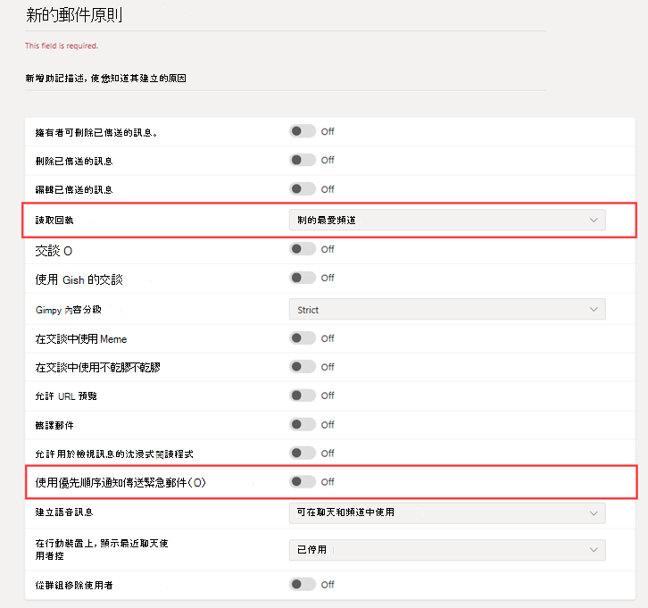

# 適用於醫療保健組織的安全郵件傳遞

訊息原則可用來控制哪些聊天和頻道訊息功能可供 Microsoft Teams 中的使用者使用，且屬於醫療保健組織 (例如醫院、診所或醫生辦公室) 之安全訊息的整體部署之一部分，其中要以及時的方式取得訊息並採取動作非常重要，知道重要訊息何時被讀取也一樣重要。

您可以使用全域 (全組織預設值) 原則，或是為組織中的人員建立一或多個自訂訊息原則。 除非您建立並指派自訂原則，否則組織中的使用者將會自動取得全域原則。 建立自訂原則之後，請為它指派組織中的一個使用者或一組使用者。 例如，您可以選擇只允許特定工作角色使用這些功能 (可能只有醫生和護士)，而允許其他工作者 (例如清潔或廚房人員) 可獲得一組有限的功能。 請自行決定您組織的需求，這裡的指引頂多是建議。

您可以輕鬆在 [Microsoft Teams 系統管理中心](https://admin.teams.microsoft.com)管理原則，方法是使用系統管理員認證登入，並選擇左側瀏覽窗格中的 [訊息原則 **]**。

 :::image type="content" source="../../media/hc-messaging-policy-admin-center-new.png" alt-text="[訊息原則] 頁面的螢幕擷取畫面。" lightbox="../../media/hc-messaging-policy-admin-center-new.png":::
 
 若要編輯組織的現有預設訊息原則，請按一下 [全域 (全組織預設值)**]**，然後進行您的變更。 若要建立新的自訂訊息原則，請按一下 [新增 **]**，然後選取您的設定。 完成後，請選擇 [儲存 **]**。

下列設定與醫療保健應用程式特別相關，在設計用於醫療保健領域的自訂原則時，應該考慮：

## 讀取回條

讀取回條可讓聊天訊息的寄件者在其訊息已由收件者讀取時得知，透過一對一和 20 人以下的群組聊天。 使用此設定來指定讀取回條是由使用者控制、針對每個人開啟，或是針對每個人關閉。 訊息讀取回條在醫療保健組織中很重要，因為它們能夠消除訊息是否被讀取的不確定性。

針對醫療保健應用程式，選擇 [使用者控制 **]** 或 [針對每個人開啟 **]**。 請注意，使用 [針對每個人開啟 **]** 設定時，為整個租用戶設定回條的唯一方法，就是讓整個租用戶只有一個訊息原則 (名為「全域 (全組織預設值)」的預設原則)，或讓租用戶中所有的訊息原則都使用相同的回條設定。 當此功能對 [針對每個人開啟 **]** 啟用時，讀信回條功能最為有效。

*沒有讀取回條的使用範例：* 高風險病患 Jakob Roth 獲接納可進入醫院。  Sofia Krause 是一名護士，她是醫療工作者 (包括不同專家) 之跨學科小組 (IDT) 的一員，被指派為負責此病患的主要照護協調員。  Sofia 會傳送電子郵件和其他即時訊息給使用各種訊息用戶端和應用程式的一群護士和醫生，而且通常不會收到回應或小組成員是否已讀取訊息的指示。 由於通訊程序的雜亂，Jakob 的治療處置不當，而且他待在醫院的時間會延長。

*有讀取回條的使用範例：* 高風險病患 Jakob Roth 獲接納可進入醫院。  Sofia Krause 是一名護士，她是醫療工作者 (包括不同專家) 之跨學科小組 (IDT) 的一員，被指派為負責此病患的主要照護協調員。  Sofia 開始與將與病患合作以協調照護的一組醫生和其他護士進行群組聊天，並開始進行緊急情況分級。  護士和醫生在整個照護協調程序中，會針對該病患的照護計劃進行溝通和共同作業。  重要和緊急訊息會透過一對一和群組聊天交談來傳送。 Sofia 使用讀取回條功能來判斷所傳送要求支援的訊息是否已傳遞並由目標醫生或護士讀取。 Jakob 的病患成果接近最理想狀態，而由於他的健康小組能順暢地溝通，他便更早出院了。

## 使用優先通知傳送緊急訊息

當使用者傳送聊天訊息給其他使用者訊息時，可以將訊息標示為 *緊急*。 此功能可協助醫院員工在重要事件需要他們注意時彼此提醒。 與一般的 *重要* 訊息不同，[優先通知](https://support.microsoft.com/article/mark-a-message-as-important-or-urgent-in-teams-ea99d5b6-1317-4550-8d75-86ff14cd4462)會每隔兩分鐘通知使用者一次，達 20 分鐘為止，或直到該訊息由收件者取得並讀取為止，將訊息能夠以及時的方式因應的可能性最大化。

系統管理員可以為獲指派此原則的使用者啟用或停用其傳送優先通知的能力。 此功能預設為啟用。 優先訊息的收件者可能沒有相同的訊息原則，而且將沒有選項可停用接收優先訊息。 針對醫療保健應用程式，建議您至少為部分使用者啟用此功能，但您需要判斷要針對哪些使用者。

*使用方式範例：* Sofia Krause 要重新接納高風險病患 Jakob Roth。 醫生 Manuela Carstens 是此病患的主要照護醫生。  Sofia 使用優先通知傳送訊息給 Manuela，利用 Jakob 的分級要求立即協助。  Manuela 的手機會收到訊息，但 Manuela 沒有感覺手機震動，因此沒有回覆。 Teams 會重新通知 Manuela，並將持續一致的重新通知，直到她讀取訊息為止。 如果也啟用讀信回條，則 Sofia 會注意到訊息已由 Manuela 讀取，甚至是在 Manuela 決定如何回應之前。

## 相關主題

- [在 Teams 中管理訊息原則](../../messaging-policies-in-teams.md)
- [開始使用適用於醫療保健組織的 Teams](teams-in-hc.md)
