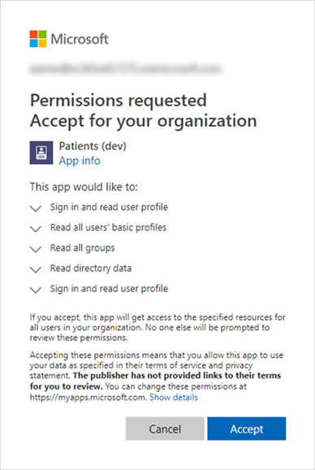

# 將病患應用程式連線至 Azure API for FHIRConnect the Patients app to Azure API for FHIR

> [!IMPORTANT]
> **2020年9月30日生效，患者 app 將會被否決，且使用者將無法從 [小組] app store 進行安裝。我們鼓勵您立即開始使用團隊中的 [ [清單] 應用程式](https://support.microsoft.com/office/get-started-with-lists-in-teams-c971e46b-b36c-491b-9c35-efeddd0297db) 。****Effective September 30, 2020, the Patients app will be deprecated and users will no longer be able to install it from the Teams app store. We encourage you to start using the [Lists app](https://support.microsoft.com/office/get-started-with-lists-in-teams-c971e46b-b36c-491b-9c35-efeddd0297db) in Teams today.**
>
>患者 app 資料會儲存在可支援小組的 Office 365 群組群組信箱中。Patients app data is stored in the group mailbox of the Office 365 group that backs the team. 當患者 app 停用時，所有與它相關聯的資料都會保留在這個群組中，但不能再透過使用者介面存取。When the Patients app is retired, all data associated with it will be retained in this group but can no longer be accessed through the user interface. 目前的使用者可以使用 [清單應用程式](https://support.microsoft.com/office/get-started-with-lists-in-teams-c971e46b-b36c-491b-9c35-efeddd0297db)重新建立其清單。Current users can re-create their lists using the [Lists app](https://support.microsoft.com/office/get-started-with-lists-in-teams-c971e46b-b36c-491b-9c35-efeddd0297db).
>
>[ [清單] 應用程式](https://support.microsoft.com/office/get-started-with-lists-in-teams-c971e46b-b36c-491b-9c35-efeddd0297db) 是針對所有團隊使用者預先安裝的，而且在每個團隊和頻道中都可做為索引標籤。The [Lists app](https://support.microsoft.com/office/get-started-with-lists-in-teams-c971e46b-b36c-491b-9c35-efeddd0297db) is pre-installed for all Teams users and is available as a tab in every team and channel. 透過清單，護理小組可以使用內建的患者範本、從頭開始，或是將資料匯入 Excel 來建立患者清單。With Lists, care teams can create patient lists using the built-in Patients template, from scratch, or by importing data to Excel. 若要進一步瞭解如何管理組織中的 [清單] 應用程式，請參閱 [管理清單應用程式](../../manage-lists-app.md)。To learn more about how to manage the Lists app in your organization, see [Manage the Lists app](../../manage-lists-app.md).

請依照下列步驟，允許 Microsoft 團隊中的患者 app 存取 FHIR 實例的 Azure API。Follow these steps to allow the Patients app in Microsoft Teams access to an Azure API for FHIR instance. 本文假設您有在您的租使用者中設定和設定 [FHIR 實例的 AZURE API](https://azure.microsoft.com/services/azure-api-for-fhir/) 。This article assumes that you have an [Azure API for FHIR instance](https://azure.microsoft.com/services/azure-api-for-fhir/) set up and configured in your tenant.  如果您還沒有在租使用者中建立 FHIR 實例的 Azure API，請參閱 [快速入門：使用 azure 入口網站部署 FHIR 的 AZURE api](https://docs.microsoft.com/azure/healthcare-apis/fhir-paas-portal-quickstart)。If you haven’t yet created an Azure API for FHIR instance in your tenant, see [Quickstart: Deploy Azure API for FHIR using Azure portal](https://docs.microsoft.com/azure/healthcare-apis/fhir-paas-portal-quickstart).

1. 按一下 [這裡](https://login.microsoftonline.com/common/adminConsent?client_id=4aee3506-b263-43e0-ba31-1468fa7b2806) 以授與系統管理員同意的患者 app。Click [here](https://login.microsoftonline.com/common/adminConsent?client_id=4aee3506-b263-43e0-ba31-1468fa7b2806) to grant admin consent for the Patients app. 出現提示時，請使用您的租使用者管理員或全域系統管理員認證登入，然後按一下 [ **接受** ] 以授與所需的許可權。When prompted, sign in using your tenant admin or global admin credentials, and then click **Accept** to grant the required permissions.

    

    接受之後，請關閉視窗。After you accept, close the window. 您會看到一個頁面，看起來會像這樣。You'll see a page that may look like this. 您可以忽略頁面上的錯誤訊息。You can ignore the error message on the page. 這不是無害的，指出已授與同意。It's harmless and indicates that consent is granted.  (我們正在處理更適合此 URL 的方便使用頁面。(We're working on a more user-friendly page for this URL. 掌握最新資訊！ ) Stay tuned!)

    
2. 使用您的系統管理員認證登入 [Azure 入口網站](https://portal.azure.com) 。Sign in to the [Azure portal](https://portal.azure.com) with your admin credentials.
3. 在左側導覽中，選取 [ **Azure Active Directory**]，然後選取 [ **企業應用程式**]。In the left navigation, select **Azure Active Directory**, and then select **Enterprise Applications**.
    尋找名為 [ \*\*患者 (dev) \*\*的列，然後將 [ **物件識別碼** ] 欄中的值複製到 [剪貼簿]。Look for a row named **Patients (dev)**, and then copy the value in the **Object ID** column to your clipboard.
    
4. 若要將患者 (app 連線至 FHIR 資源實例的 Azure API，請進行搜尋，或流覽您的資源) ，然後開啟該實例的設定。Go to the Azure API for FHIR resource instance to which you want to connect the Patients app (either by searching for it or by browsing through your resources), and then open the settings for that instance.

    

5. 按一下 [ **驗證**]，然後將您在步驟3中複製的物件識別碼貼到 [ **允許的物件識別碼** ] 方塊中。Click **Authentication**, and then paste the object ID that you copied in step 3 to the **Allowed object IDs** box. 這可讓患者 app 存取 FHIR 伺服器。This allows the Patients app to access the FHIR server. 貼上物件識別碼之後，Azure Active Directory 會進行驗證，且旁邊會出現一個綠色的核取記號。After you paste the object ID, Azure Active Directory validates it, and a green check mark appears next to it.

    

6. 按一下 [儲存]\*\*\*\*。Click **Save**. 這會 redeploys 實例，可能需要幾分鐘的時間。This redeploys the instance, which can take a few minutes.
7. 按一下 **[概述**]，然後從 **FHIR 中繼資料端點**複製 URL。Click **Overview**, and then copy the URL from **FHIR metadata endpoint**. 移除元資料標記以取得 FHIR 伺服器 URL。Remove the metadata tag to get the FHIR server URL. 例如， https://test02-teamshealth.azurehealthcareapis.com/ 。For example, https://test02-teamshealth.azurehealthcareapis.com/. 

    

8. 在 [團隊] 中，移至您團隊中載入的患者應用程式實例，按一下 [ **設定**]，然後在 [ **連結** ] 方塊中輸入 FHIR 伺服器端點 URL。In Teams, go to the Patients app instance that's loaded in your team, click **Settings**, and then in the **Link** box, enter the FHIR server endpoint URL. 接著，按一下 **[連線]** 以建立連線並搜尋，並將患者新增至您的清單。Then, click **Connect** to establish a connection and search and add patients to your list.  

    
    
    如果您在執行此步驟時，在連線至團隊時收到錯誤，請傳送錯誤的詳細螢幕擷取畫面、 [Fiddler](https://www.telerik.com/download/fiddler) 的記錄，以及電子郵件中包含「患者 APP – EMR 模式疑難排解」主題行的任何其他重現步驟，以進行 [teamsforhealthcare@service.microsoft.com](mailto:teamsforhealthcare@service.microsoft.com)。If you get an error when connecting to Teams during this step, send a detailed screenshot of the error, logs from [Fiddler](https://www.telerik.com/download/fiddler) and any other repro steps in an email with a subject line of “Patients App – EMR mode troubleshooting” to [teamsforhealthcare@service.microsoft.com](mailto:teamsforhealthcare@service.microsoft.com).

## 相關主題Related topics

- [病患應用程式概觀Patients app overview](patients-app-overview.md)
- [將電子醫療保健記錄整合至 Microsoft TeamsIntegrating Electronic Healthcare Records into Microsoft Teams](patients-app.md)
