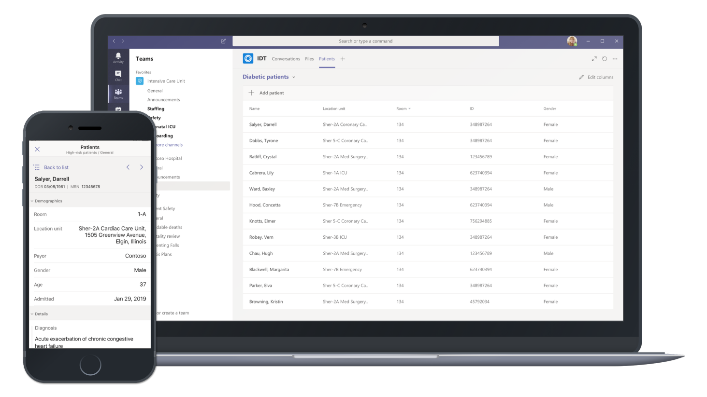

# 開始使用適用於醫療保健組織的 Teams

Microsoft 團隊提供許多適用于醫院和其他醫療保健組織的功能。 團隊功能正處於開發階段，可協助醫院進行下列作業：

- 護理協調與共同作業
- 安全訊息
- Telehealth
- 電子醫療保健記錄 (EHR) 整合 
- 第一線員工 Worker 系統整合 

本節內容是以小組的基本功能為基礎，例如會議、通話和訊息，並假設您已在組織中部署團隊。 如果您尚未推出小組，請先閱讀 [瞭解如何推出 Microsoft 團隊](../../How-to-roll-out-teams.md)。

## 護理協調-Microsoft 團隊患者 app

> [!IMPORTANT]
> **2020年10月15日生效，患者應用程式將會被否決，且使用者將無法從 [小組 app store] 進行安裝。我們鼓勵您立即開始使用團隊中的 [ [清單] 應用程式](https://support.microsoft.com/office/get-started-with-lists-in-teams-c971e46b-b36c-491b-9c35-efeddd0297db) 。**
>
>患者 app 資料會儲存在可支援小組的 Office 365 群組群組信箱中。 當患者 app 停用時，所有與它相關聯的資料都會保留在這個群組中，但不能再透過使用者介面存取。 目前的使用者可以使用 [清單應用程式](https://support.microsoft.com/office/get-started-with-lists-in-teams-c971e46b-b36c-491b-9c35-efeddd0297db)重新建立其清單。
>
>[ [清單] 應用程式](https://support.microsoft.com/office/get-started-with-lists-in-teams-c971e46b-b36c-491b-9c35-efeddd0297db) 是針對所有團隊使用者預先安裝的，而且在每個團隊和頻道中都可做為索引標籤。 透過清單，護理小組可以使用內建的患者範本、從頭開始，或是將資料匯入 Excel 來建立患者清單。 若要進一步瞭解如何管理組織中的 [清單] 應用程式，請參閱 [管理清單應用程式](../../manage-lists-app.md)。

[!INCLUDE [preview-feature](../../includes/preview-feature.md)]

Microsoft 團隊現在有一個專門針對醫療保健組織的護理協調解決方案，可協助他們提供最佳的患者治療。 Crux 的 [護理協調] 解決方案是「Microsoft 團隊患者 app」，它是一種與電子健康情況)  (記錄整合的第一個參與方索引標籤 app，可使用快速的醫療保健互通性資源 ([FHIR](https://www.hl7.org/fhir/)) 介面，讓 Microsoft 團隊在內容中進行臨床共同作業及通訊。  

您可以使用 HL7v2 和 FHIR 等現有的健康資料標準，將患者 app 連線至您的 EHR 系統，以與主要獨立軟體廠商 (Isv) 連線，來與主流獨立軟體廠商進行介面。 具備下列業界領袖的 Microsoft 合作夥伴，可與團隊建立電子健康情況記錄整合：

- 透過其 [CMI](https://datica.com/compliant-managed-integration/) 提供的 Datica () 
- Infor Cloverleaf (透過 [INFOR FHIR Bridge](https://pages.infor.com/hcl-infor-fhir-bridge-brochure.html)) 
- 透過 [R ^ FHIR 伺服器](https://www.redoxengine.com/fhir/) Redox () 
- Dapasoft (到 [COROLAR FHIR](https://www.dapasoft.com/corolar-fhir-server-for-microsoft-teams/)) 

嘗試針對醫療保健提供者組織實施 Microsoft 團隊的 EHR 整合與互通性合作夥伴，必須為患者 app 提供與醫療保健供應商組織 EHR 系統的安全且驗證的連線。 這可讓單向 (只會將相關患者記錄的) 流程讀入患者 app。 患者 app 可瞭解 FHIR 格式，因此合作夥伴也負責將匯總資料從各種其他格式（例如 HL7v2 等）轉換成 FHIR DSTU2 或 STU3。

 

 

患者 app 整合了電子醫療記錄 (EHR) 系統，並能讓護理提供者在小組的安全平臺中即時與患者護理進行溝通。 患者 app 是護理協調區域中的第一項主要投資，目的是解決下列難題：

- 在工作中保持不太高效，且透過患者體驗進行重要溝通
- 產生管理負擔的各自為政資訊
- 使用複雜及零散共同作業工具的臨床醫師中的不滿
- 低效率的人員間護理協調，可能會燒壞太昂貴的臨床時間

Microsoft 團隊可讓醫生、臨床醫師、護士及其他員工高效地進行共同作業：

- 成為可在 Office 檔上運作及共同合作的單一虛擬化小組的一部分
- 在其他患者需要注意的持續交談
- 使用頻道搭配索引標籤來組織其工作，並提供可讓他們釘選資訊來源之索引標籤的其他說明
- 將頻道會議與團隊的威力、影片、螢幕共用、錄製和工具功能配合使用，以管理每日會議
- 使用患者 app 來彙整必須監視的高風險患者清單，並從 EHR 系統中拉回其最新詳細資料。 患者 app 本身會將下列功能新增至 Microsoft 團隊：

    - 能夠在單一頻道中建立多個患者清單。
    - 透過可設定的欄來查看和排序顯示的患者資訊的功能。
    - 透過小組範本自動進行應用程式的功能。
    - 可在 iOS 版和 Android 版的團隊 App 中使用，可在適用于 iOS 和 Android 的小組應用程式中，使用 Microsoft 團隊網頁與桌面用戶端。
    - 透過分析一致性語句來支援 FHIR DSTU2 和 STU3 版本。
    - 針對其使用者介面上的所有視圖和搜尋動作的審核記錄，以保護每個 HIPAA 指引中的 PHI。

患者 app 是在小組擴充性平臺上建立，並利用 [定位點架構] 在頻道中顯示豐富的患者內容。 若要深入瞭解其他團隊 app 和平臺本身，請參閱 [Microsoft 團隊相關應用程式](/microsoftteams/platform/concepts/apps/apps-overview)。  

> [!NOTE]
> 患者 app 是私人預覽，且 FHIR 介面在 Beta 版中。 已發行的版本不應該是向後相容的。

如需詳細資訊，請參閱將 [電子醫療保健記錄整合至 Microsoft 團隊](patients-app.md) 。

## 團隊範本

我們已開發新的範本來建立小組，以套用至醫院設定。 如此一來，您就能更輕鬆地建立可讓醫療保健工人在不同部門或 wards 中與患者共同合作的小組。 請參閱 [開始使用醫療保健組織的團隊範本](healthcare-templates.md)。 團隊可以針對內部部門（例如心臟病科）或 [護理 wards] 或 [開發中的其他範本] 進行啟動。

## 清單應用程式

[!INCLUDE [preview-feature](../../includes/preview-feature.md)]

團隊中的 [清單] 應用程式可協助團隊追蹤資訊並組織工作。 App 是針對所有團隊使用者預先安裝的，而且在每個團隊和頻道中都可做為索引標籤。 清單可以從預先定義的範本中從頭開始建立，或是將資料匯入 Excel。

護理小組可以使用患者範本來開始使用。 他們可以建立清單來追蹤患者的需求和狀態。 您可以在 Excel 試算表中加入現有的患者資料，在小組中建立清單。 這些清單可用來進行諸如舍入與患者監視等案例，以協助您共同處理護理。

例如，電荷護士在小組中建立一個患者清單，其中包含所有的護理小組成員。 在舍入期間，護理小組會在行動裝置上存取小組，並更新清單中的患者資訊，讓小組中的每個人都可以查看，以保持同步處理。在您的舍入會話中，護理小組會收集以討論及評估重要健康情況效能指標，以確保患者位於正確的 glide 路徑上以進行放電，他們可以使用大型顯示畫面上的小組共用此資訊。 保護不在網站上的小組成員可以遠端加入。

以下是為患者舍入設定的範例清單。

:::image type="content" source="../../media/lists-patients-example.png" alt-text="患者舍入範例清單的螢幕擷取畫面":::

若要深入瞭解，請參閱 [在團隊中管理貴組織的清單應用程式](../../manage-lists-app.md)。

## 安全訊息

安全訊息支援在護理小組中共同作業，包括幾個新功能：

- 郵件寄件者可以為郵件設定特殊的優先順序，所以收件者會反復收到通知，直到他們閱讀郵件為止。
- 郵件寄件者可以要求讀信回條，當郵件收件者閱讀郵件時，就會收到通知。

總之，這些功能可讓您更快速地注意到緊急訊息，並確信郵件已被接收和讀取。 使用這些功能的新的護理團隊可以在每個患者上建立。 這些功能都是以原則為基礎，而且可以指派給個人或整個團隊。

如需進一步的詳細資料，請參閱 [開始使用醫療保健組織的安全訊息原則](messaging-policies-hc.md) 。

此外，與安全訊息相關的功能，也是由醫療保健組織聯盟的其他租使用者，允許更豐富的租使用者通訊。  (請參閱 [在 Microsoft 團隊) 中的 [管理外部存取 (同盟) ](../../manage-external-access.md) ]。

## 第一線員工工作人員整合

Microsoft 團隊會與第一線員工工作人員整合，這可以用來共同調整倒班人員的功能。 請參閱 [在 Microsoft 團隊中管理貴組織的倒班應用程式](../shifts/manage-the-shifts-app-for-your-organization-in-teams.md)。
