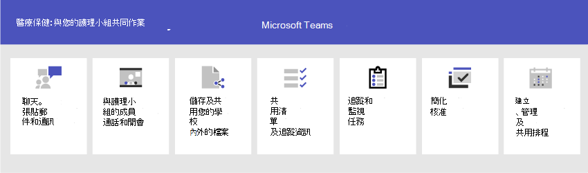

# 開始使用醫療保健組織的 TeamsGet started with Teams for healthcare organizations

Microsoft Teams 提供許多適用于醫療保健和其他醫療保健組織的遠端醫療功能。Microsoft Teams offers a number of telemedicine features useful for hospitals and other Healthcare organizations. Teams 功能正在開發中，可協助他們使用：Teams features are under development to aid hospitals with:

- EHR 整合的虛擬 (電子) 記錄Virtual visits and Electronic Healthcare Record (EHR) integration
- Teams 政策套件Teams policy packages
- 安全傳訊Secure messaging
- Teams 範本Teams templates
- 照護協調與共同合作Care coordination and collaboration

此功能是 Microsoft Cloud 醫療保健的一部分。This functionality is part of the Microsoft Cloud for Healthcare. 深入瞭解使用此解決方案，此解決方案將 Azure、Dynamics 365 和 Microsoft 365 在 [Microsoft Cloud 的醫療保健功能結合在一起](https://docs.microsoft.com/industry/healthcare)。Learn more about using this solution, which brings together capabilities from Azure, Dynamics 365, and Microsoft 365 at [Microsoft Cloud for Healthcare](https://docs.microsoft.com/industry/healthcare).

請觀看下列影片，進一步瞭解如何在 Microsoft Teams 中使用醫療保健集合加強健康小組共同合作。Watch the following video to learn more about using the healthcare collection to enhance health team collaboration in Microsoft Teams.

> [!VIDEO https://www.microsoft.com/videoplayer/embed/RE4Hqan]

> [!NOTE]
> 本節內容假設您已在組織中部署 Teams。The content in this section assumes that you've already deployed Teams in your organization. 如果您尚未推出 Teams，請從閱讀如何推出 [Microsoft Teams 開始](../../How-to-roll-out-teams.md)。If you haven't yet rolled out Teams, start by reading [How to roll out Microsoft Teams](../../How-to-roll-out-teams.md).

下列案例適用于醫療保健組織：The following scenarios are available for healthcare organizations:

| 案例Scenario | 說明Description | 需求Requirements |
| -------- | -------- | -------- |
| [使用電子醫療保健記錄與 EHR (整合) 虛擬訪問Virtual visits with Electronic Healthcare Record (EHR) integration](#virtual-visits-and-electronic-healthcare-record-ehr-integration) | 排程、管理及與病患進行虛擬看診。Schedule, manage, and conduct virtual visits with patients. 此案例將 Microsoft Teams 和一般平臺連接在一起，以支援虛擬訪問。This scenario connects Microsoft Teams and the Epic platform to support virtual visits. | 使用中的 Microsoft Cloud 醫療保健訂閱或 Microsoft Teams EHR Connector 獨立方案訂閱。Active subscription to Microsoft Cloud for Healthcare or subscription to Microsoft Teams EHR Connector standalone offer.   使用者必須擁有包含 Microsoft Teams 會議\*的適當 Microsoft 365 或 Office 365 授權。Users must have an appropriate Microsoft 365 or Office 365 license that includes Microsoft Teams meetings\*.   組織必須擁有 2018 年 11 月或更新的版本。Organizations must have with Epic version November 2018 or later.  [EHR 需求詳細資料Details for EHR requirements](ehr-admin.md#before-you-begin) |
| [使用 Microsoft Bookings 和 Bookings 應用程式進行虛擬訪問Virtual visits with Microsoft Bookings and the Bookings app](#virtual-visits-and-electronic-healthcare-record-ehr-integration) | 排程、管理及與病患進行虛擬看診。Schedule, manage, and conduct virtual visits with patients. 此案例仰賴 Microsoft Bookings 支援虛擬訪問。This scenario relies on Microsoft Bookings to support virtual visits. | 必須針對組織開啟 Microsoft Bookings。Microsoft Bookings must be turned on for the organization.   Bookings App 的所有使用者以及所有參與會議的員工都必須擁有支援 Teams 會議排程\*授權。All users of the Bookings app and all staff participating in meetings must have a license that supports Teams Meeting scheduling\*.  [Bookings 需求詳細資料Details for Bookings requirements](../../bookings-app-admin.md#prerequisites-for-using-the-bookings-app-in-teams)|
| [Teams 政策套件Teams policy packages](#teams-policy-packages)| 確保醫療工作者、資訊工作者和病患室裝置能夠適當存取 Teams 功能。Ensure that clinical workers, information workers, and patient room devices have the appropriate access to Teams functionality.| 使用者必須擁有適當的授權\*。Users must have an appropriate license\*. |
| [安全傳訊Secure messaging](#secure-messaging) | 更快速地注意緊急郵件，並信賴郵件已接收並讀取。Get quicker attention to urgent messages and have confidence that the message was received and read. | 使用者必須擁有適當的授權\*。Users must have an appropriate license\*.  |
| [Teams 範本Teams templates](#teams-templates-for-healthcare-organizations) | 建立團隊，包含預先定義的設定、頻道和預先安裝應用程式範本，以在一個團隊、容器或部門內，或在醫院內多個容器、容器和科系之間進行通訊和共同合作。Create teams that include a predefined template of settings, channels, and pre-installed apps for communication and collaboration within a ward, pod, or department, or between multiple wards, pods, and departments within a hospital. | 使用者必須擁有適當的授權\*。Users must have an appropriate license\*.  |
| [照護協調與共同合作Care coordination and collaboration](#care-coordination-and-collaboration) | 醫師和教職員可以在排程、檔、工作等專案上進行內部共同作業。Clinicians and staff can collaborate internally on schedules, documents, tasks, and so on.| 使用者必須擁有適當的授權\*。Users must have an appropriate license\*. |

\*支援 Office 365 A3、A5、E3 和 E5，以及 Microsoft 365 商務標準版、A3、A5、E3 和 E5。\*Office 365 A3, A5, E3, and E5, as well as Microsoft 365 Business Standard, A3, A5, E3, and E5 are supported. 有關一般 Teams 授權的資訊，請參閱管理 Teams [的使用者存取權](../../user-access.md)。For more information about general Teams licensing, see [Manage user access to Teams](../../user-access.md).

## EHR 整合的虛擬 (電子) 記錄Virtual visits and Electronic Healthcare Record (EHR) integration

在 Microsoft Teams 中使用完整的會議平臺來排程、管理及虛擬看診病患。Use the complete meetings platform in Microsoft Teams to schedule, manage, and conduct virtual visits with patients.

- 如果貴組織已經使用電子健康記錄或 EHR，您可以整合 Microsoft Teams，獲得更流暢的體驗。If your organization already uses Electronic Health Records, or EHR, you can integrate Microsoft Teams for a more seamless experience. Microsoft Teams 電子健康記錄 (EHR) Connector 讓醫生可以直接從 EHR 系統，在 Teams 中啟動虛擬病患看診或諮詢。Microsoft Teams Electronic Health Record (EHR) Connector makes it easy for clinicians to launch a virtual patient visit or consultation with another provider in Teams directly from the EHR system. 若要深入瞭解，請參閱使用 Teams 進行 [虛擬訪問 - 與 EHR 整合](ehr-admin.md)。To learn more, see [Virtual visits with Teams - Integration into EHR](ehr-admin.md).
- 如果您不是使用支援的 EHR，您可以使用 Microsoft Bookings 和 Teams 中的 Bookings 應用程式。If you aren't using a supported EHR, you can use Microsoft Bookings and the Bookings app in Teams. 若要深入瞭解，請參閱 [Bookings App 和 Microsoft Teams 中的虛擬訪問](../../bookings-app-admin.md)。To learn more, see [Bookings app and virtual visits in Microsoft Teams](../../bookings-app-admin.md).

## Teams 政策套件Teams policy packages

套用 Teams 原則套件，以定義在 Teams 中可以執行的不同角色。Apply Teams policy packages to define what different roles can do in Teams. 例如，指定用於：For example, specify policies for:

- 醫療工作者 ，例如註冊的護士、主管護士、醫師和社交工作者，以便完全存取聊天、通話、輪班管理和會議。Clinical workers, such as registered nurses, charge nurses, physicians, and social workers, so that they can have full access to chat, calling, shift management, and meetings.
- 您醫療保健組織的資訊工作者 ，例如 IT 人員、資訊人員、財務人員和合規性人員，可以擁有聊天、通話和會議的完整存取權。Information workers in your healthcare organization, such as IT personnel, informatics staff, finance personnel, and compliance officers, can have full access to chat, calling, and meetings.
- 病患室，以控制病患室裝置設定。Patient rooms, to control settings for patient room devices.

若要深入瞭解，請參閱 [適用于醫療保健的 Teams 政策套件](../../policy-packages-healthcare.md)。To learn more, see [Teams policy packages for healthcare](../../policy-packages-healthcare.md).

## 安全傳訊Secure messaging

安全訊息支援健康小組內的共同合作，包括數項新功能：Secure messaging supports collaboration within health teams, including several new features:

- 郵件寄件者可以設定其郵件的特殊優先順序，讓收件者重複收到通知，直到他們讀取郵件。A message sender can set a special priority for their message, so the recipient is repeatedly notified until they read the message.
- 郵件寄件者可以要求讀信回條，因此當郵件收件者讀取所送出的郵件時，會收到通知。A message sender can request a read receipt, so they are notified when a message they sent was read by the message recipient.

這些功能可同時更快速地注意緊急郵件，並讓您對郵件的接收和讀取更有信心。Together, these features allow quicker attention to urgent messages and confidence that the message was received and read. 您可以使用這些功能建立每個病患的新健康小組。New health teams using these features can be created on a per-patient basis. 這些功能是以策略為基礎，可以指派給個人或整個 Teams。These features are policy-based, and can be assigned to individuals or entire Teams.

若要深入瞭解，請參閱 [開始使用醫療保健組織的安全訊息策略](messaging-policies-hc.md)。To learn more, see [Get started with Secure Messaging policies for Healthcare organizations](messaging-policies-hc.md).

安全訊息的另外一個相關功能是讓其他租使用者由醫療保健組織建立聯盟，允許更豐富的租使用者間通訊。Also related to secure messaging is the ability to have other tenants federated by Healthcare organizations, allowing richer inter-tenant communication.  (Microsoft Teams ([管理) 外部存取) 。](../../manage-external-access.md)(See [Manage external access (federation) in Microsoft Teams](../../manage-external-access.md)).

## 醫療保健組織的 Teams 範本Teams templates for healthcare organizations

建立 Teams 的新範本已開發為適用于醫院設定，預計近期將推出更多範本。New templates for creating Teams were developed to apply to a Hospital setting, and more are expected soon. 這可更輕鬆地建立讓醫療保健工作者用於協調不同科系或醫院病患照護的團隊。This makes it easier to create teams that Healthcare workers use to coordinate care for patients in various departments or wards. 若要深入瞭解，請參閱開始使用 [醫療保健](healthcare-templates.md)組織的 Teams 範本。To learn more, see [Get started with Teams templates for Healthcare organizations](healthcare-templates.md). 團隊可以針對內部部門啟動，例如心律科或照護科，且開發中的範本更多。Teams can be started for internal departments such as cardiology, or for care wards, and more templates are in development.

## 照護協調與共同合作Care coordination and collaboration

將您的健康小組彙集在一起，以與 Microsoft Teams 協調照護及共同合作。Bring your health team together to coordinate care and collaborate with Microsoft Teams.

Microsoft Teams 可讓醫師、醫師、護士和其他員工使用 Microsoft Teams 中包含的共同合作功能，有效率地共同合作，例如：Microsoft Teams enables physicians, clinicians, nurses, and other staff to collaborate efficiently with included collaboration features in Microsoft Teams, such as:

- 為健康小組和資訊工作者設定團隊和頻道。Set up teams and channels for your health teams and information workers. 使用具有定位字元的頻道來建立工作結構，並額外提供來自可釘上資訊來源之資料標籤的協助。Use channels with tabs as a way to structure their work, with additional help from tabs to which they can pin information sources.
- 聊天、張貼訊息和溝通。Chat, post messages, and communicate. 您的小組可以持續討論需要注意的不同病患。Your team can have persistent conversations about different patients needing attention.
- 與健康小組的成員通話和開會。Call and meet with members of the health team. 設定個別會議，或使用頻道會議來管理每日會議，兩者均提供 Teams 音訊、視視、螢幕共用、錄製和抄寫功能。Set up individual meetings, or use channel meetings to manage daily meetings, both with the power of Teams audio, video, screen sharing, recording, and transcription features.
- 儲存及共用檔案和檔。Store and share files and documents. 您的健康小組是單一虛擬小組的一員，可處理 Office 檔並共同處理。Your health team is part of a single virtualized team that works and collaborates on Office documents.

此外，您的小組可以使用 Teams 中的應用程式：In addition, your team can use apps in Teams to:

- 使用清單應用程式共用清單和追蹤資訊Share lists and track information with the Lists app
- 使用工作應用程式追蹤及監控工作Track and monitor tasks with the Tasks app
- 使用核准應用程式簡化核准Streamline approvals with the Approvals app
- 使用 Shifts 應用程式建立、管理及共用排程Create, manage, and share schedules with the Shifts app

### 使用清單應用程式共用清單和追蹤資訊Share lists and track information with the Lists app

> [!NOTE]
> 自 2020 年 10 月 30 日起，病患應用程式已停用，並取代為 Teams 中的清單應用程式。Effective October 30, 2020, the Patients app has been retired and replaced by the [Lists app](https://support.microsoft.com/office/get-started-with-lists-in-teams-c971e46b-b36c-491b-9c35-efeddd0297db) in Teams. 使用清單，您醫療保健組織的照護小組可以針對各種情況建立病患清單，從四輪和多行小組會議到一般病患監控。With Lists, care teams in your healthcare organization can create patient lists for scenarios ranging from rounds and interdisciplinary team meetings to general patient monitoring.

Teams 中的清單應用程式可協助團隊追蹤資訊並整理工作。The Lists app in Teams helps teams track information and organize work. 此應用程式已預先安裝供所有 Teams 使用者使用，並可在每個團隊和頻道中做為一個選項卡使用。The app is pre-installed for all Teams users and is available as a tab in every team and channel. 清單可以從頭建立、從預先定義的範本建立，或將資料導入 Excel。Lists can be created from scratch, from predefined templates, or by importing data to Excel.

健康小組可以使用病患範本開始使用。health teams can use the Patients template to get started. 他們可以建立清單來追蹤病患的需求和狀態。They can create lists to track the needs and status of patients. 您可以輸入 Excel 試算表上現有的病患資料，以在 Teams 中建立清單。Existing patient data on Excel spreadsheets can be brought in to create a list in Teams. 這些清單可用於圓形和病患監控等案例，以協調照護。These lists can be used for scenarios such as rounds and patient monitoring to coordinate care.

例如，付費護士在包含所有健康小組成員的小組中建立病患清單。For example, a charge nurse creates a patient list in a team that includes all health team members. 在四輪期間，健康小組會以行動裝置存取 Teams，並更新清單中的病患資訊，讓團隊中的每個人都可以查看這些資訊，以便保持同步。在健康小組會聚在一起討論及評估關鍵健康表現計量的四周會議，以確保病患處于正確卸貨路徑，他們可以使用大型顯示畫面上的 Teams 來共用這項資訊。During rounds, the health team access Teams on their mobile devices and update patient information in the list, which everyone on the team can view to stay in sync. At rounding sessions where the health team gathers to discuss and evaluate key health performance metrics to ensure a patient is on the right glide path to discharge, they can share this information using Teams on a large display screen. 不在網站的健康小組成員可以遠端加入。health team members who aren't on site can join remotely.

以下是針對病患四分位所設定之範例清單。Here's an example list which was set up for patient rounding.

:::image type="content" source="../../media/lists-patients-example.png" alt-text="病患四分位的範例清單螢幕擷取畫面":::

若要深入瞭解，請參閱在 Teams 中管理 [貴組織的清單應用程式](../../manage-lists-app.md)。To learn more, see [Manage the Lists app for your organization in Teams](../../manage-lists-app.md).

### 使用工作應用程式追蹤及監控工作Track and monitor tasks with the Tasks app

使用 [Teams](https://support.microsoft.com/office/use-the-tasks-app-in-teams-e32639f3-2e07-4b62-9a8c-fd706c12c070) 中的工作來追蹤，以針對整個健康小組執行專案。Use [Tasks](https://support.microsoft.com/office/use-the-tasks-app-in-teams-e32639f3-2e07-4b62-9a8c-fd706c12c070) in Teams to track to do items for your whole health team. 您的健康小組可以從執行 Teams 的任何裝置隨時建立、指派及排程工作、分類工作及更新狀態。Your health team can create, assign, and schedule tasks, categorize tasks, and update status at any time, from any device running Teams.

若要深入瞭解，請參閱在 Microsoft Teams 中為貴組織 [管理工作應用程式](../../manage-tasks-app.md)To learn more, see [Manage the Tasks app for your organization in Microsoft Teams](../../manage-tasks-app.md)

### 使用核准應用程式簡化核准Streamline approvals with the Approvals app

使用 [核准](https://support.microsoft.com/office/what-is-approvals-a9a01c95-e0bf-4d20-9ada-f7be3fc283d3) 來簡化您與小組的所有要求與程式。Use [Approvals](https://support.microsoft.com/office/what-is-approvals-a9a01c95-e0bf-4d20-9ada-f7be3fc283d3) to streamline all of your requests and processes with your team. 直接從您的中心建立、管理及共用核准，以用於團隊合作。Create, manage, and share approvals directly from your hub for teamwork. 從傳送聊天的同一個地方、頻道交談中，或從核准應用程式本身開始核准流程。Start an approval flow from the same place you send a chat, in a channel conversation, or from the Approvals app itself. 只要選取核准類型、新增詳細資料、附加檔案，然後選擇核准者。Just select an approval type, add details, attach files, and choose approvers. 提交後，核准者會收到通知，並可以審查要求並採取行動。Once submitted, approvers are notified and can review and act on the request.

您可以允許貴組織的核准應用程式，並新增到您的小組。You can allow the Approvals app for your organization and add it to your teams. 若要深入瞭解，請參閱 [Teams 核准應用程式可用性](../../approval-admin.md)。To learn more, see [Teams Approvals app availability](../../approval-admin.md).

### 使用 Shifts 應用程式與前線工作人員整合來建立、管理及共用排程Create, manage, and share schedules with the Shifts app and Frontline Worker integration

Microsoft Teams 與 Shifts App 和前線員工整合，可用來協調班次教職員功能等。Microsoft Teams integrates with the Shifts app and Frontline Worker, which can be used to coordinate shift staffing features and more. 例如，在 Shifts 中，護士經理可以設定及協調其教職員的排程，而護士可以檢查排程及調班。For example, in Shifts, Nurse managers can set up and coordinate schedules for their staff, and nurses can check schedules and swap shifts. Teams 包含內建的 Frontline Worker 應用程式設定政策，您可以指派給貴組織的前線工作人員。Teams includes a built-in Frontline Worker app setup policy that you can assign to Frontline Workers in your organization. 根據預設，該政策包含活動、班次、聊天和通話應用程式。By default, the policy includes the Activity, Shifts, Chat, and Calling apps. 這個策略會控制這些應用程式的行為，例如將 Shifts 應用程式釘到應用程式行，讓小組可以快速存取。This policy controls behavior for these apps, for example, pinning the Shifts app to the app bar so the team can quickly access it.

若要深入瞭解，請參閱在 Microsoft Teams 中管理貴組織的 [Shifts 應用程式](../shifts/manage-the-shifts-app-for-your-organization-in-teams.md)。To learn more, see [Manage the Shifts app for your organization in Microsoft Teams](../shifts/manage-the-shifts-app-for-your-organization-in-teams.md).

## 協助您的醫療與資訊工作者使用 TeamsHelp your clinical and information workers get going with Teams

有許多資源可協助貴組織的所有使用者習慣使用 Teams：There are many resources available to help all of the users in your organization get comfortable with using Teams:

- 如果您才 [剛開始](https://adoption.microsoft.com/microsoft-teams/) 使用 Teams 組織，或將 Teams 擴充到組織的更多領域，請流覽 Teams 採用中心以尋求有關推出 Teams 的建議。Visit the [Teams adoption center](https://adoption.microsoft.com/microsoft-teams/) for advice on rolling out Teams if you are just starting your organization's journey with Teams, or expanding Teams into more areas of your organization.
- 請考慮 [為使用者設定](https://adoption.microsoft.com/microsoft-365-learning-pathways/) 自訂學習路徑，只涵蓋他們需要執行的工作。Consider setting up custom [learning pathways](https://adoption.microsoft.com/microsoft-365-learning-pathways/) for your users to cover just the tasks they need to do.
- 取得有關如何在 Teams 支援網站上執行 Microsoft Teams 基本工作之使用者說明與訓練，包括[快速訓練影片](https://support.microsoft.com/office/microsoft-teams-video-training-4f108e54-240b-4351-8084-b1089f0d21d7)。Get help and training for your users on how to perform basic tasks in Microsoft Teams on the [Teams support site](https://support.microsoft.com/teams), including [quick training videos](https://support.microsoft.com/office/microsoft-teams-video-training-4f108e54-240b-4351-8084-b1089f0d21d7). 這個網站也有 Teams 應用程式的協助與訓練，包括清單、工作、[核准](https://support.microsoft.com/office/what-is-approvals-a9a01c95-e0bf-4d20-9ada-f7be3fc283d3)[、Bookings](https://support.microsoft.com/office/overview-of-the-bookings-app-in-teams-7b8569e1-0c8a-444e-b712-d9968b05110b)和[Shifts。](https://support.microsoft.com/office/what-is-shifts-f8efe6e4-ddb3-4d23-b81b-bb812296b821)This site also has help and training for the Teams apps, including [Lists](https://support.microsoft.com/office/get-started-with-lists-in-teams-c971e46b-b36c-491b-9c35-efeddd0297db), [Tasks](https://support.microsoft.com/office/use-the-tasks-app-in-teams-e32639f3-2e07-4b62-9a8c-fd706c12c070), [Approvals](https://support.microsoft.com/office/what-is-approvals-a9a01c95-e0bf-4d20-9ada-f7be3fc283d3), [Bookings](https://support.microsoft.com/office/overview-of-the-bookings-app-in-teams-7b8569e1-0c8a-444e-b712-d9968b05110b), and [Shifts](https://support.microsoft.com/office/what-is-shifts-f8efe6e4-ddb3-4d23-b81b-bb812296b821).
