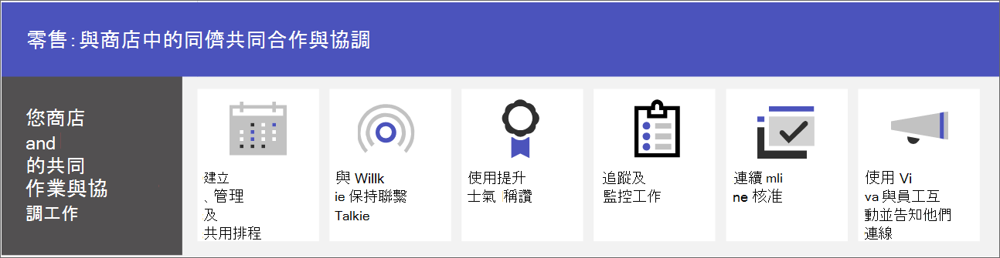

# 零售團隊共同作業

使用 Microsoft Teams，將商店內夥伴與管理階層結合在一起，以通訊、共同作業並簡化作業。 協助您的夥伴[使用 Viva Connections 連接至您的組織](#connect-information-from-across-the-organization-with-viva-connections)，並使用 [Yammer 社群](#connect-across-your-organization-with-yammer-and-teams)啟用商店之間以及與總部之間的通訊。

> [!VIDEO https://www.microsoft.com/videoplayer/embed/RWRJVw]

> [!NOTE]
> 這些案例也是 Microsoft 零售業雲端的一部分。 當您也使用來自 Microsoft 零售業雲端的其他功能 (例如 Microsoft Dynamics 365) 時，就可以使用這些案例執行更多工作。 深入了解使用此解決方案，其將來自 Azure、Dynamics 365 和 Microsoft 365 的功能結合在 [Microsoft 零售業雲端](/industry/retail)。

## Teams 中的日常通訊和共同作業

Microsoft Teams 可讓商店內銷售夥伴、經理和其他人員利用隨附的共同作業功能和應用程式，有效率地共同作業。 根據組織的需求，您的前線工作者可以在個人或共用裝置上使用 Teams。

Teams 包含下列通訊和共用資訊的方式：

| 工作 | 描述 | 管理此功能 | 使用者訓練 |
| ---- | ---- | ---- | ---- |
| 聊天、張貼訊息和通訊 | 您的商店內夥伴可以順暢地跨部門通訊，以履行訂單、為客戶取得協助，以及管理庫存需求。   Teams 為您的組織提供絕佳的現成共同作業體驗，而大部分組織認為預設設定就能滿足其需求。 | [Microsoft Teams 中的聊天、團隊、頻道和應用程式](../deploy-chat-teams-channels-microsoft-teams-landing-page.md) | [開始聊天](https://support.microsoft.com/office/start-and-pin-chats-a864b052-5e4b-4ccf-b046-2e26f40e21b5)和[使用貼文和訊息](https://support.microsoft.com/office/create-and-format-a-post-e66777da-636b-49eb-9408-b0d88b212885) |
|與團隊成員通話和開會 | 經理可以利用 Teams 音訊、影片、螢幕畫面分享、錄製和轉譯功能，以設定個別會議，或使用頻道會議來管理每日會議。 例如，經理可以設定與不同部門中商店夥伴的上午視訊會議，以在商店開始營業之前檢查其狀態。   您將必須設定會議的設定，並啟用語音解決方案以便使用通話。 | [Microsoft Teams 中的會議](../deploy-meetings-microsoft-teams-landing-page.md)和[規劃您的 Teams 語音解決方案](../cloud-voice-landing-page.md) | [撥打電話](https://support.microsoft.com/office/overview-of-teams-calls-425d6970-6e27-47b6-bc61-4c38fff51c4f)和[加入會議](https://support.microsoft.com/office/join-a-teams-meeting-078e9868-f1aa-4414-8bb9-ee88e9236ee4) |
|儲存和共用檔案和文件 | 共用檔案可讓商店內人員輕鬆存取資訊 (例如，銷售圖表)，而不需要離開銷售樓層或取得經理的協助。 每個團隊都會自動隨附一個檔案索引標籤，可用於儲存和共用文件。 此索引標籤實際上代表 SharePoint 中預設團隊網站文件庫內的資料夾，該資料夾會在團隊建立時自動建立。 | [SharePoint 和 OneDrive 如何與 Microsoft Teams 互動](../sharepoint-onedrive-interact.md) | [上傳和共用檔案](https://support.microsoft.com/office/upload-and-share-files-57b669db-678e-424e-b0a0-15d19215cb12) |

您的團隊可以使用 Teams 中的應用程式，在日常工作上互相協調及共同作業，例如以下：

| 工作 | 應用程式 | 描述 | 管理此應用程式 | 使用者訓練 |
| ---- | ---- | ---- | ---- | ---- |
| 建立、管理及共用排程| 班次 | 使用班次順暢地管理和共用排程。 經理可以建立自訂群組 (例如，收銀員或接待員)、將班次指派給員工、新增自訂標籤和休息時間，以及新增員工可以要求接受的開放班次。 員工可以使用班次來設定其狀態、檢視其排程、與同事換班，以及打卡上下班。 | [管理班次](/microsoftteams/expand-teams-across-your-org/shifts/manage-the-shifts-app-for-your-organization-in-teams)|[班次訓練影片](https://support.microsoft.com/office/what-is-shifts-f8efe6e4-ddb3-4d23-b81b-bb812296b821)|
| 保持連絡 | 無線對講機 | 無線對講機應用程式提供即時的隨按即說通訊。 使用無線對講機，員工和經理可以從商店中的任何位置進行通訊。 例如，如果商店一端的客戶詢問員工某項目是否在商店另一端的庫存中，該員工可以使用無線對講機來連絡在該項目附近工作的人。 由於無線對講機的範圍無限，因此員工也可以輕鬆地諮詢其他商店或公司辦公室的專家。 | [管理無線對講機](../walkie-talkie.md)  | [無線對講機訓練影片](https://support.microsoft.com/office/use-walkie-talkie-in-teams-884a008a-761e-4b62-99f8-15671d9a2f69) |
| 提升士氣 | 稱讚 | 稱讚應用程式可讓管理階層和商店內夥伴互相稱讚，並傳送徽章來分享感謝。 稱讚可協助員工對成就 (例如達成銷售目標以及超越預期目標) 感覺受到認可，以協助客戶。 | [管理稱讚應用程式](../manage-praise-app.md) |[稱讚訓練影片](https://support.microsoft.com/office/communication-and-praise-7d37ef80-542b-42e5-aa01-0fabbaa634b6) |
| 追蹤和監視工作 | 工作 | 在 Teams 中使用工作以追蹤整個零售團隊的待辦事項。 商店經理和員工隨時都可以在執行 Teams 的任何裝置上建立、指派及排程工作、分類工作及更新狀態。 IT 專業人員和系統管理員也可以發佈工作給貴組織的特定小組。 例如，您可以發佈一組工作以進行每日清理，或步驟以設定新的顯示。| [管理工作應用程式](/microsoftteams/manage-tasks-app) |[工作訓練影片](https://support.microsoft.com/office/use-the-tasks-app-in-teams-e32639f3-2e07-4b62-9a8c-fd706c12c070) |
| 簡化核准 | 核准 | 使用核准以簡化與您的團隊的要求與程序。 直接從您的團隊合作中心建立、管理及共用核准。 從您傳送聊天、使用頻道交談或在核准應用程式本身的相同位置開始核准流程。 只要選取核准類型、新增詳細資料、附加檔案，然後選擇核准者。 一旦提交，核准者會收到通知，而且可以對要求進行檢視並採取行動。 您可以為組織允許核准應用程式，並將其新增到 Teams。 | [Teams 核准應用程式可用性](/microsoftteams/approval-admin) | [核准訓練影片](https://support.microsoft.com/office/what-is-approvals-a9a01c95-e0bf-4d20-9ada-f7be3fc283d3?wt.mc_id=otc_microsoft_teams)|

### 設定您的團隊、頻道和應用程式

當您準備好在 Teams 中連絡您的零售夥伴時，可以使用預建或自訂的範本，為商店團隊和經理設定團隊和頻道。 最簡單的方法是使用範本開始。 **組織商店** 和 **適用於經理的零售**[範本](/microsoftteams/get-started-with-retail-teams-templates)是預先建立的範本，包含專為零售設計的頻道和應用程式。 您也可以根據現有的團隊建立範本。 即使您從範本開始，也可以自訂團隊和頻道，並新增更多應用程式以滿足您的團隊需求。

- 使用頻道搭配索引標籤來分享新聞、讓不同班次的員工保持連絡，以及建置社群。
- 使用團隊範本，跨商店或地區設定具有類似結構 (例如頻道和索引標籤) 的團隊。

#### 根據範本建立團隊

1. 在 Microsoft Teams 中，選取 [加入或建立團隊 **]**。

2. 選取 [建立團隊 **]**，然後向下捲動以查看可用的範本。

詳細資訊：[使用範本建立團隊](https://support.microsoft.com/office/create-a-team-with-team-templates-702a2977-e662-4038-bef5-bdf8ee47b17b)

### 管理應用程式

使用應用程式精簡團隊內容。 您可以在 Microsoft Teams 系統管理中心允許或封鎖組織的應用程式，或設定應用程式的設定。 如需管理應用程式的詳細資訊，請參閱[在 Microsoft Teams 系統管理中心管理應用程式](../manage-apps.md)。

您的使用者可以將您允許的任何應用程式新增到其團隊。 與使用者分享此訓練，讓他們了解作法：[尋找和使用應用程式](https://support.microsoft.com/office/find-and-use-apps-6e22a734-c002-4da0-ba63-681f155b142d)。

## 使用 Viva Connections 連接整個組織的資訊

使用 Viva Connections 與員工互動並通知員工。 Viva Connections 會在 Teams 中建立中樞，在其中，您的零售夥伴可以檢視來自組織量身訂做的新聞摘要，以及具有其所需資源的個人化儀表板。 當員工使用 Viva Connections 時，他們就能更快速地取得重要資訊，這表示經理不需要花費寶貴的時間來轉傳更新。 在 Viva Connections 儀表板上展現重要的資訊、個人化新聞、工作、公告和其他資源。

深入了解 [Viva Connections](/sharepoint/viva-connections-overview) 並協助員工和夥伴開始使用 [Microsoft Teams 中的 Viva Connections](https://support.microsoft.com/office/your-intranet-is-now-in-microsoft-teams-8b4e7f76-f305-49a9-b6d2-09378476f95b)。

使用 Microsoft Teams、Viva Connections 和 SharePoint，您可以啟用這些案例：

- 上線新員工[了解做法](/sharepoint/onboard-employees)
- 將領導團隊與前線工作者連接[了解做法](/sharepoint/leadership-connection)
- 發佈新聞給組織[了解做法](/sharepoint/distribute-corporate-news-to-your-organization)

[深入了解如何在組織中推動通訊](/sharepoint/corporate-communications-overview)

## 使用 Yammer 和 Teams 與整個組織連絡

在 Yammer 中與社群互動。 Yammer 中的社群提供您交談、檔案、活動和更新的集中位置，以滿足知識分享、員工體驗、全公司通訊和領導參與的需求。 夥伴可以在 Yammer 社群中提出問題、提供意見，以及詢問及回答問題。 舉辦即時活動與會員大會，讓組織中的每個人掌握資訊。

了解如何[將 Yammer 頁面加入 Teams 頻道](https://support.microsoft.com/office/add-a-yammer-page-to-a-teams-channel-ca06ec83-f22d-4b76-83a5-c83aa2a33528)和[在 Yammer 中加入並建立社群](https://support.microsoft.com/office/join-and-create-a-community-in-yammer-56aaf591-1fbc-4160-ba26-0c4723c23fd6)。

關於 Yammer 的詳細資訊：

- 若為系統管理員：[管理 Yammer](/yammer)
- 若為使用者：[使用 Yammer](https://support.microsoft.com/office/what-is-yammer-1b0f3b3e-89ee-4b66-aac5-30def12f287c)
