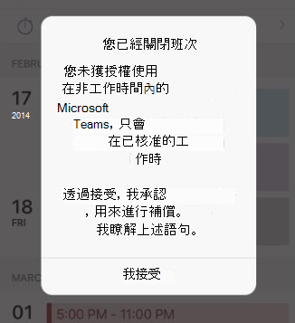

# <a name="manage-shift-based-access-for-firstline-workers-in-teams"></a>針對團隊中的第一線員工工作者管理以倒班為基礎的存取權

> [!IMPORTANT]
> 2020年6月30日生效，Microsoft StaffHub 已停用。 我們正在將 StaffHub 功能組建至 Microsoft 團隊。 今天，小組包含針對排程管理的倒班應用程式，而其他功能則會隨著時間推移而推出。 StaffHub 已停止針對2020年6月30日的所有使用者使用。 任何試圖開啟 StaffHub 的人都會顯示一則訊息，讓他們下載團隊。 若要深入瞭解，請參閱 [Microsoft StaffHub 已停](microsoft-staffhub-to-be-retired.md)用。  

## <a name="overview"></a>概觀

[!INCLUDE [preview-feature](../../includes/preview-feature.md)]

Microsoft 團隊中的目前狀態表示使用者目前的可用性與其他使用者的狀態。 與其他員工相比，目前的工作時間通常不是相同的，因此第一線員工工作者的狀態通常不會太容易被人預測。 身為系統管理員，您可以將團隊設定為顯示您組織中的第一線員工工作人員的一組班次的目前狀態，以指出他們是在何時開啟和關閉班次。

這些以移動為基礎的線上狀態會以 &mdash;  **上** 的 shift， ![ 灰色圓圈（含 x）] 表示 [向下移動] 表示 [忙碌] 的 [忙碌] 與 ](../../media/flw-presence-off-shift.png)    &mdash; [團隊中的目前 [狀態] 狀態](../../presence-admins.md)是分開的。 在這兩組目前狀態的狀態中，您可以根據組織中的人員角色來設定不同的體驗。

使用值班式存取時，您可以在第一線員工工作人員離開班次時管理團隊的存取權。 例如，您可以將團隊設定為顯示一則訊息，讓第一線員工工人必須承認，才能使用小組，而不是排定的班次。  

## <a name="scenario"></a>案例

以下範例說明您的組織可以如何管理以倒班為基礎的存取。

您的組織中有第一線員工的工作人員，只應支付其主管排程和核准之班次所進行的工時。 不應針對排程班次以外的時間所花費的時間進行支付，包括使用團隊 app。 您設定的自訂訊息指出「當您在小組中時，您的時間不會計算在應付時數」，這會在第一線員工工作人員嘗試在關閉班次時存取團隊時顯示。 如果他們選擇使用團隊，按一下 [ **我接受** ]，就能瞭解他們目前不會支付。

您的組織中也有資訊工作者正在 salaried，而其他人不會有任何作用。 您可以將您的資訊工作者設定為在團隊中使用預設的目前狀態狀態，而提供您的第一線員工工作者輪換式的目前狀態。

## <a name="shift-based-presence-states"></a>依移動狀態

以下是依班的目前狀態。

|應用程式設定 |使用者設定  |詳細資訊  |
|---------|---------|---------|
|![[實心綠色] 核取記號，代表 [倒班]](../../media/flw-presence-on-shift.png) 在班次上     |         |在班次開始時自動設定         |
| 關閉班次     |         |在班次結束時自動設定         |
| 忙碌      |  忙碌         |自動設定。 您也可以在第一線員工工人開啟倒班時手動設定。|

## <a name="off-shift-access-to-teams"></a>關閉對團隊的 shift 存取權

此功能可讓您在第一線員工的工作人員關閉班次時管理團隊的存取權。 您可以將團隊設定為在員工在關閉時存取小組時，顯示訊息來第一線員工工作人員。 第一線員工工作人員必須按一下 [ **我接受** ] 來確認訊息，才能使用小組。

您可以使用預設訊息、選擇一組預先定義的郵件，或自訂郵件以顯示任何您想要的文字。 以下是預設訊息：



您也可以在顯示訊息時設定頻率，並在第一個班次開始或最後一個班次結束時，以及在團隊存取權受到限制時，設定寬限期。

## <a name="manage-shift-based-access"></a>管理以 shift 為基礎的存取

做為管理員，您可以使用原則來控制貴組織中第一線員工工作人員的移動狀態。 您可以使用下列 PowerShell Cmdlet 來管理這些原則：

- [新-CsTeamsShiftsPolicy](https://docs.microsoft.com/powershell/module/teams/new-csteamsshiftspolicy)
- [CsTeamsShiftsPolicy](https://docs.microsoft.com/powershell/module/teams/get-csteamsshiftspolicy)
- [Set-CsTeamsShiftsPolicy](https://docs.microsoft.com/powershell/module/teams/set-csteamsshiftspolicy)
- [授與 CsTeamsShiftsPolicy](https://docs.microsoft.com/powershell/module/teams/grant-csteamsshiftspolicy)
- [移除-CsTeamsShiftsPolicy](https://docs.microsoft.com/powershell/module/teams/remove-csteamsshiftspolicy)

使用 New-CsTeamsShiftsPolicy Cmdlet 來建立新的原則，設定您想要的原則設定，然後使用 Grant-CsTeamsShiftsPolicy Cmdlet 將原則指派給使用者。

以下是一些範例。 如需每個原則設定與參數的詳細資訊，包括可供您選擇的預先定義的 [輪換] 訊息清單，請參閱 [新-CsTeamsShiftsPolicy](https://docs.microsoft.com/powershell/module/teams/new-csteamsshiftspolicy)。

### <a name="example-1"></a>範例 1

在這個範例中，我們會建立一個名為 [關閉班次小組] 的新原則，以存取預設的訊息。 在此原則中，會開啟移動前的目前狀態，且每次獲指派此原則的使用者，都會在停用班次時，顯示預設的訊息。 如果使用者接受該訊息，且在第一個班次開始或最後一個班次結束時，以及存取受到限制為10分鐘，則使用者可以在小組中使用團隊。  

```powershell
New-CsTeamsShiftsPolicy -Identity "Off Shift Teams Access Default Message" -EnableShiftPresence $true -ShiftNoticeFrequency always -ShiftNoticeMessageType DefaultMessage -AccessType UnrestrictedAccess_TeamsApp -AccessGracePeriodMinutes 10
```

> [!NOTE]
> 使用 **ShiftNoticeMessageType** 參數來設定您要顯示的訊息。 若要查看您可以為此參數選擇的預先定義訊息清單，請參閱 [新 CsTeamsShiftsPolicy](https://docs.microsoft.com/powershell/module/teams/new-csteamsshiftspolicy)。

### <a name="example-2"></a>範例 2 

在這個範例中，我們會建立一個名為 [登出] 的新原則，以存取自訂訊息。 在這項原則中，會開啟移動前的目前狀態，且每次獲指派此原則的使用者在停用班次時，都會顯示自訂訊息。 如果使用者接受該訊息，且在第一個班次開始或最後一個班次結束時，以及限制存取的時間是15分鐘，使用者就可以使用團隊來關閉班次。  

```powershell
New-CsTeamsShiftsPolicy -Identity "Off Shift Teams Access Custom Message" -EnableShiftPresence $true -ShiftNoticeFrequency always -ShiftNoticeMessageType CustomMessage -ShiftNoticeMessageCustom "Your time on Teams when on off shift won't count toward payable hours" -AccessType UnrestrictedAccess_TeamsApp -AccessGracePeriodMinutes 15
```

> [!NOTE]
> 使用 **ShiftNoticeMessageType** 參數來設定您要顯示的訊息。 若要深入瞭解，請參閱 [新-CsTeamsShiftsPolicy](https://docs.microsoft.com/powershell/module/teams/new-csteamsshiftspolicy)。

### <a name="example-3"></a>範例 3

在這個範例中，我們會建立一個名為 [取消轉換團隊] 的新原則，以存取 Message1。 在此原則中，會開啟移動前的目前狀態，且每次獲指派此原則的使用者在關閉班次時，都會出現下列預先定義的訊息。

  「您的雇主不會在非工作時間內以無人豁免或每小時員工授權或核准其網路、應用程式、系統或工具的使用方式。 透過接受，您承認您在非授權的情況下使用您的小組，而且您不會收到報酬。 

如果使用者接受該訊息，且在第一個班次開始或最後一個班次結束時，以及存取限制是3分鐘，則使用者可以在小組中使用團隊。  

```powershell
New-CsTeamsShiftsPolicy -Identity "Off Shift Teams Access Message1" -EnableShiftPresence $true -ShiftNoticeFrequency always -ShiftNoticeMessageType Message1 -AccessType  UnrestrictedAccess_TeamsApp -AccessGracePeriodMinutes 3
```

> [!NOTE]
> 使用 **ShiftNoticeMessageType** 參數來設定您要顯示的訊息。 若要查看您可以為此參數選擇的預先定義訊息清單，請參閱 [新 CsTeamsShiftsPolicy](https://docs.microsoft.com/powershell/module/teams/new-csteamsshiftspolicy)。

### <a name="example-4"></a>範例 4

在這個範例中，我們會將名為「取消」團隊的原則存取自訂訊息給名為 remy@contoso.com 的使用者。

```powershell
Grant-CsTeamsShiftsPolicy -Identity remy@contoso.com -PolicyName "Off Shift Teams Access Custom Message"
```

## <a name="related-topics"></a>相關主題

- [在 Teams 中管理貴組織的 Shifts 應用程式](manage-the-shifts-app-for-your-organization-in-teams.md)
- [Teams PowerShell 概觀](../../teams-powershell-overview.md)
