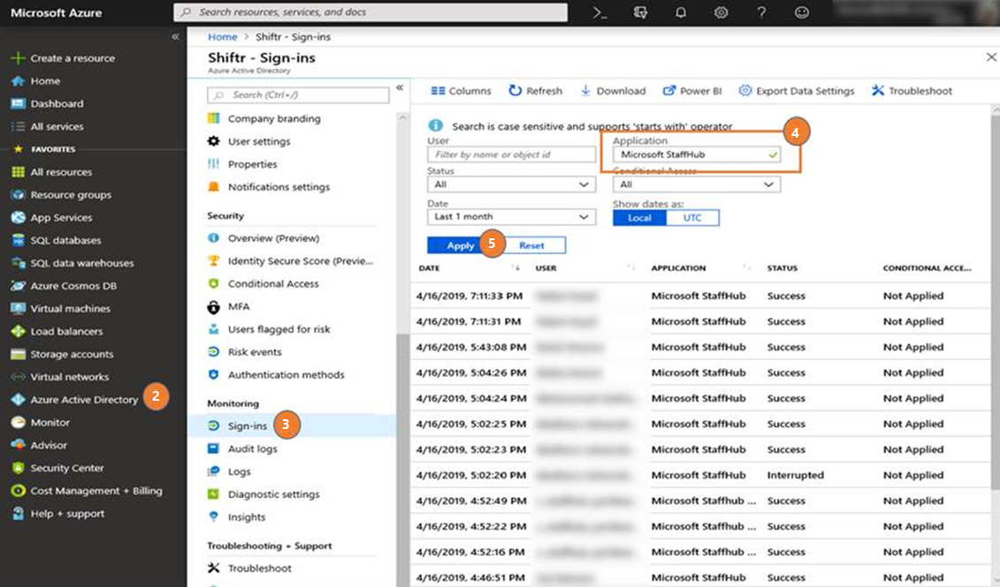

# 執行報告以顯示作用中 StaffHub 的使用情況

> [!IMPORTANT]
> 2019年12月31日生效，Microsoft StaffHub 將停用。 我們正在將 StaffHub 功能組建至 Microsoft 團隊。 今天，小組包含針對排程管理的倒班應用程式，而其他功能則會隨著時間推移而推出。 StaffHub 將會停止針對2019年12月31日的所有使用者使用。 任何試圖開啟 StaffHub 的人，都會顯示一則訊息，讓他們下載小組。 若要深入瞭解，請參閱[Microsoft StaffHub 停用](microsoft-staffhub-to-be-retired.md)。  

請使用本文中的步驟執行報表，以取得貴組織中作用中 StaffHub 使用者的清單。 當您準備好要[將 StaffHub 團隊移至 Microsoft 團隊](move-staffhub-teams-to-shifts-in-teams.md)時，這項資訊可能會很方便。 在報告中，當您從 StaffHub 切換至小組時，您就會知道您需要包含在通訊中的人員。

您必須具備 Azure AD Premium，才能執行本文中的步驟。

1. 登入 Azure 入口網站。
2. 在左窗格中，按一下 [ **Azure Active Directory**資源]。
3. 按一下 [**監視**] 底下的 [登**入**]。
4. 在 [**應用程式**] 底下，輸入 [ **Microsoft StaffHub**]。
5. 為報表設定您想要的日期範圍，**然後按一下 [** 套用]。 

    

## 相關主題

- [將 Microsoft StaffHub 小組移至 Microsoft 團隊中的倒班](move-staffhub-teams-to-shifts-in-teams.md)
