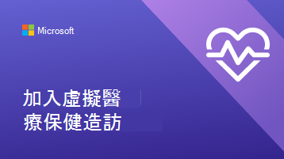

# 協助客戶和客戶使用虛擬約會

現在貴組織已開始使用Microsoft Teams和Bookings應用程式來進行虛擬約會，您必須確定您的客戶和客戶瞭解如何預約及加入這些約會。

請觀看這段影片，快速概略瞭解虛擬約會可為您的組織執行什麼動作。

> [!VIDEO https://www.microsoft.com/videoplayer/embed/RE4TQop]

## 此工具組中包含的內容

此工具組旨在協助您協助客戶成功加入虛擬約會。 您可以自訂我們提供的資源，並在您關於虛擬約會的通訊中包含這些資源的連結。 此工具組包括：

[您網站的指引](#guidance-for-your-website)：   關於虛擬約會的常見問題，您可以自訂虛擬約會，然後在網站上主持。 請務必新增您自己的連結，以及客戶需要知道的關於您原則的任何其他資訊。

[小組的資源](#resources-for-your-team)：   文章和影片可協助您的小組更輕鬆地進行虛擬約會。

[用戶端的資源](#resources-for-your-clients)：  
Microsoft 支援內容的連結，其中包含加入虛擬約會的影片。 
您可以為組織自訂的資訊圖表。

## 您網站的指引

回答常見問題，讓客戶知道虛擬約會會發生什麼事。 您只需要編輯此 Q&A，以配合您的虛擬約會原則，然後將它貼到您的網站上。

### 虛擬約會基本概念

**什麼是虛擬約會？**

虛擬約會是透過Microsoft Teams進行的線上約會。 您將和我們的其中一個教職員成員進行一對一交談，就像親自造訪一樣。

**虛擬約會與親自造訪有何不同？**

讓客戶知道您所提供的服務是否有差異，並以虛擬方式親自告知客戶。 您也可以描述虛擬約會和親自約會之間的任何費用差異。

**虛擬約會如何進行？**

當您從電子郵件確認中的連結加入時，您會進入虛擬等候室。 一旦教職員成員加入通話後，您就會與他們一起進入虛擬會議室，您將會在其中進行一對一造訪。

**虛擬約會的付款運作方式為何？**

讓客戶知道您是否接受不同類型的虛擬約會付款。

### 預約約會

**如何?約會嗎？**

連結至貴組織的預約頁面。 讓客戶知道是否有其他方式可以進行虛擬約會，例如透過電話、透過電子郵件或社交媒體。

**我可以神秘約會嗎？**

確認您的用戶端可以與其慣用提供者保持關係，方法是共用員工完全只能虛擬或親自操作。

**如何?取消或重新排程虛擬約會？**

您可以在此連結到貴組織的取消和重新排程原則，或描述虛擬約會與親自約會之間原則的任何差異。

### 技術

**虛擬約會需要哪些設備？**

客戶可以從任何網頁瀏覽器或透過Microsoft Teams應用程式加入虛擬約會。 如果您的組織有其他規格，例如高品質網路攝影機或麥克風，請在這裡列出。 如果您的醫療保健組織已將 EHR 整合到團隊中，病患可以從您的醫療保健入口網站加入看診。

**如何?加入虛擬約會？**

您可以在這裡連結客戶 以出席者身分加入Bookings約會 (microsoft.com) 向他們顯示如何加入約會的詳細影片和逐步程式。

## 小組的資源

確定員工成員知道如何進行約會，以充分利用虛擬約會。 您可以與小組成員分享這些文章和影片，協助他們更瞭解虛擬約會。

- [瞭解如何在 Teams 中使用 Bookings 應用程式](https://support.microsoft.com/office/what-is-bookings-42d4e852-8e99-4d8f-9b70-d7fc93973cb5)
- [瞭解如何加入Bookings約會](https://support.microsoft.com/office/join-a-bookings-appointment-attendees-3deb7bde-3ea3-4b41-8a06-741ad0db9fc0)
- [進行虛擬造訪](/microsoftteams/expand-teams-across-your-org/bookings-virtual-visits#conduct-a-visit)
- [觀看虛擬約會的影片](#help-your-clients-and-customers-use-virtual-appointments)

## 客戶適用的資源

您可以連結至本文，向客戶說明如何加入虛擬約會：  
[瞭解如何加入虛擬約會](https://support.microsoft.com/office/join-a-bookings-appointment-as-an-attendee-95cea12d-2220-421f-a663-6efb20913c7f)

下載並 [自訂](#customize-your-infographic) 其中一個資訊圖表，以便在網站上使用。 這些功能可讓您的客戶以快速且吸引人的方式瞭解貴組織虛擬約會的運作方式。

| 圖形                | 描述和連結              |
| :------------------- | -------------------: |
|  | 適用于您的金融服務組織的可自訂資訊圖表   [下載為 PDF](//download.microsoft.com/download/8/5/7/85784cd8-6945-4fcc-a3c3-972bd88d3fef/VirtualVisit_Financial_Infographic.pdf)   [下載為PowerPoint](//download.microsoft.com/download/8/5/7/85784cd8-6945-4fcc-a3c3-972bd88d3fef/VirtualVisit_Financial_Infographic.pptx)
|  | 適用于零售組織的可自訂資訊圖表   [下載為 PDF](//download.microsoft.com/download/a/b/5/ab5c07d9-cf7a-47b3-ba54-05a8a0a2a1bd/VirtualVisit_Retail_Infographic.pdf)   [下載為PowerPoint](//download.microsoft.com/download/a/b/5/ab5c07d9-cf7a-47b3-ba54-05a8a0a2a1bd/VirtualVisit_Retail_Infographic.pptx) |
|  | 您的醫療保健組織可自訂的資訊圖表   [下載為 PDF](//download.microsoft.com/download/4/d/3/4d3d9c53-0304-4aea-a56a-60a16402c58f/VirtualVisit_Healthcare_Infographic.pdf)   [下載為PowerPoint](//download.microsoft.com/download/4/d/3/4d3d9c53-0304-4aea-a56a-60a16402c58f/VirtualVisit_Healthcare_Infographic.pptx) |
|  | 可自訂的資訊圖表，不適用於特定產業   [下載為 PDF](//download.microsoft.com/download/c/6/9/c69d3f29-a8f5-462b-a645-79119beab406/VirtualVisit_Generic_Infographic.pdf)   [下載為PowerPoint](//download.microsoft.com/download/c/6/9/c69d3f29-a8f5-462b-a645-79119beab406/VirtualVisit_Generic_Infographic.pptx) |

### 自訂您的資訊圖表

1. 根據貴組織的需求，選擇三種預先製作資訊圖表的其中之一：
    1. 醫療
    2. 金融服務
    3. 零售

2. 在 PowerPoint 中自訂資訊圖表。
    1. 使用貴組織的色彩和慣用字型。
    2. 新增貴組織的標誌或品牌影像。
    3. 連結至網站上的頁面，例如您的預約頁面、帳單資訊或首頁。
    4. 加入虛擬約會之前，請新增客戶需要知道的任何其他資訊。

3. 將您的自訂資訊圖表匯出為 PDF。
