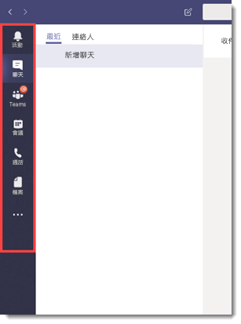
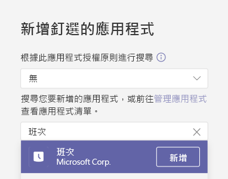
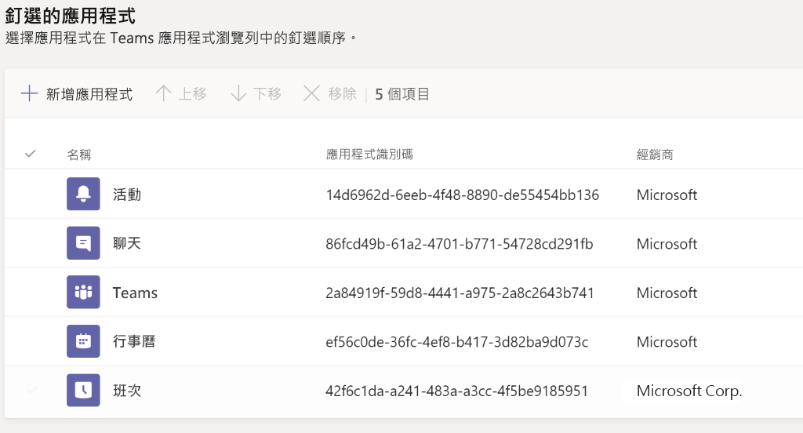
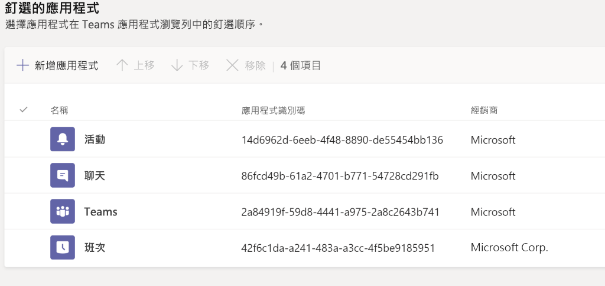
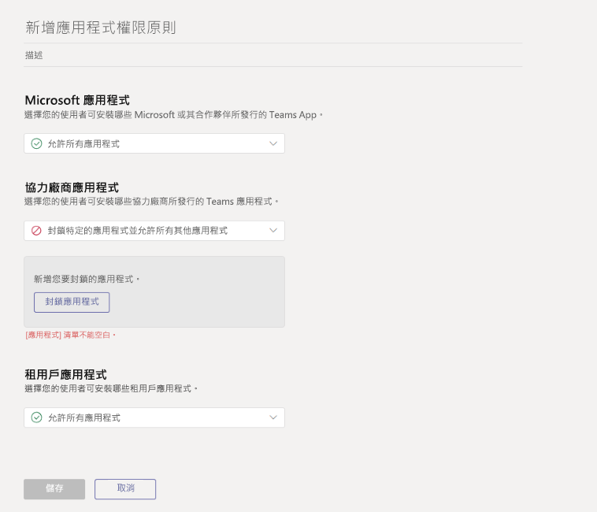

# <a name="how-to-provision-teams-at-scale-for-firstline-workers"></a><span data-ttu-id="96556-103">如何為第一線員工大規模佈建 Teams</span><span class="sxs-lookup"><span data-stu-id="96556-103">How to provision Teams at scale for Firstline Workers</span></span>

<span data-ttu-id="96556-104">您是否需要讓大量使用者快速加入 Microsoft Teams，並為他們設定簡化的使用體驗？</span><span class="sxs-lookup"><span data-stu-id="96556-104">Do you need to rapidly onboard a large number of users to Microsoft Teams and configure a streamlined experience for them?</span></span> <span data-ttu-id="96556-105">逐步完成下列指示，您就可以快速佈建身分識別、設定小組，並指派所有相關原則來控制使用者的使用者體驗。</span><span class="sxs-lookup"><span data-stu-id="96556-105">You can quickly provision identities, provision teams, and assign all relevant policies to control the end user experience by walking through the following instructions.</span></span>

<span data-ttu-id="96556-106">在本逐步解說中，您將了解如何：</span><span class="sxs-lookup"><span data-stu-id="96556-106">In this walkthrough, you'll learn how to:</span></span>

- <span data-ttu-id="96556-107">建立大量使用者。</span><span class="sxs-lookup"><span data-stu-id="96556-107">Create a large number of users.</span></span>
- <span data-ttu-id="96556-108">建立大量小組，並設定適當的頻道。</span><span class="sxs-lookup"><span data-stu-id="96556-108">Create a large number of teams and set up the appropriate channels.</span></span>
- <span data-ttu-id="96556-109">大規模指派授權。</span><span class="sxs-lookup"><span data-stu-id="96556-109">Assign licensing at scale.</span></span>
- <span data-ttu-id="96556-110">建立適當的小組訊息原則、應用程式設定原則和應用程式權限原則。</span><span class="sxs-lookup"><span data-stu-id="96556-110">Create appropriate Teams Messaging Policies, App Setup Policies, and App Permission Policies.</span></span>
- <span data-ttu-id="96556-111">對大量使用者套用這些原則。</span><span class="sxs-lookup"><span data-stu-id="96556-111">Apply those policies to users at scale.</span></span>
- <span data-ttu-id="96556-112">將大量使用者指派到指定的小組。</span><span class="sxs-lookup"><span data-stu-id="96556-112">Assign a large number of users into a designated team.</span></span>

> [!NOTE]
> <span data-ttu-id="96556-113">如果您已檢閱此資訊，但仍覺得需要協助或有一些問題，則可以[**按一下這裡**](https://forms.office.com/Pages/ResponsePage.aspx?id=v4j5cvGGr0GRqy180BHbRyMDv-1voW9MqL7zkQ11DzBUREZaU1E0WEk5T0NYS0NDSkFMSDROUUdYMC4u)，以聯繫 White Glove Support。</span><span class="sxs-lookup"><span data-stu-id="96556-113">If you've reviewed this information and feel like you need some help or have some questions, you can [**click here**](https://forms.office.com/Pages/ResponsePage.aspx?id=v4j5cvGGr0GRqy180BHbRyMDv-1voW9MqL7zkQ11DzBUREZaU1E0WEk5T0NYS0NDSkFMSDROUUdYMC4u) to reach out for White Glove Support.</span></span>

## <a name="prerequisites"></a><span data-ttu-id="96556-114">必要條件</span><span class="sxs-lookup"><span data-stu-id="96556-114">Prerequisites</span></span>

<span data-ttu-id="96556-115">從[此位置](https://aka.ms/flwteamsscale)下載資產。</span><span class="sxs-lookup"><span data-stu-id="96556-115">Download the assets from [this location](https://aka.ms/flwteamsscale).</span></span>

> [!IMPORTANT]
> <span data-ttu-id="96556-116">上述連結中的指令碼是 Microsoft 所提供的原始指令碼，您必須根據個別需求加以修改。</span><span class="sxs-lookup"><span data-stu-id="96556-116">The scripts in the link provided above are provided as-is by Microsoft, and must be modified for your individual needs.</span></span>

## <a name="technical-requirements"></a><span data-ttu-id="96556-117">技術需求</span><span class="sxs-lookup"><span data-stu-id="96556-117">Technical requirements</span></span>

- <span data-ttu-id="96556-118">您的租用戶必須具備涵蓋 Microsoft Teams 的適當授權數量。</span><span class="sxs-lookup"><span data-stu-id="96556-118">Your tenant must have the appropriate number of licenses available that include Microsoft Teams.</span></span> <span data-ttu-id="96556-119">如果您還沒有這些授權，請參閱 [Teams 探索](teams-exploratory.md)，以取得免費的試用訂閱。</span><span class="sxs-lookup"><span data-stu-id="96556-119">If you do not already have these licenses, check out [Teams Exploratory](teams-exploratory.md) for a free trial subscription.</span></span>
- <span data-ttu-id="96556-120">執行這些步驟的使用者必須已獲指派下列角色：全域系統管理員、使用者系統管理員及 Teams 服務系統管理員 (在 Azure AD 中)。</span><span class="sxs-lookup"><span data-stu-id="96556-120">The user taking these steps must have these roles assigned: Global Admin, User Admin, and Teams Service Admin, in Azure AD.</span></span>
- <span data-ttu-id="96556-121">使用者必須有權在其本機電腦上安裝和設定軟體。</span><span class="sxs-lookup"><span data-stu-id="96556-121">User must have the rights to install and configure software on their local machine.</span></span>

## <a name="step-by-step-process-overview"></a><span data-ttu-id="96556-122">逐步程序概觀</span><span class="sxs-lookup"><span data-stu-id="96556-122">Step-by-step process overview</span></span>

1. <span data-ttu-id="96556-123">**設定您的環境**</span><span class="sxs-lookup"><span data-stu-id="96556-123">**Set up Your Environment**</span></span>
    1. <span data-ttu-id="96556-124">從包含 PowerShell 指令碼範例和文件的 GitHub 存放庫下載</span><span class="sxs-lookup"><span data-stu-id="96556-124">Download from the GitHub repository containing the sample PowerShell scripts and documentation</span></span>
    1. <span data-ttu-id="96556-125">設定本機環境</span><span class="sxs-lookup"><span data-stu-id="96556-125">Configure the local environment</span></span>
    1. <span data-ttu-id="96556-126">設定認證</span><span class="sxs-lookup"><span data-stu-id="96556-126">Setup credentials</span></span>
    1. <span data-ttu-id="96556-127">設定 PowerShell 模組和環境變數</span><span class="sxs-lookup"><span data-stu-id="96556-127">Configure PowerShell Modules and environmental variables</span></span>
1. <span data-ttu-id="96556-128">**建立及設定 Teams**</span><span class="sxs-lookup"><span data-stu-id="96556-128">**Create and Setup Teams**</span></span>
    1. <span data-ttu-id="96556-129">建立團隊</span><span class="sxs-lookup"><span data-stu-id="96556-129">Create teams</span></span>
    1. <span data-ttu-id="96556-130">建立團隊的步驟</span><span class="sxs-lookup"><span data-stu-id="96556-130">Steps to create teams</span></span>
    1. <span data-ttu-id="96556-131">為團隊建立頻道</span><span class="sxs-lookup"><span data-stu-id="96556-131">Create channels for teams</span></span>
1. <span data-ttu-id="96556-132">**建立 Teams 原則**</span><span class="sxs-lookup"><span data-stu-id="96556-132">**Create Teams Policies**</span></span>
    1. <span data-ttu-id="96556-133">建立 Teams 訊息原則</span><span class="sxs-lookup"><span data-stu-id="96556-133">Create Teams message policies</span></span>
    1. <span data-ttu-id="96556-134">建立 Teams 應用程式設定原則</span><span class="sxs-lookup"><span data-stu-id="96556-134">Create Teams app setup policies</span></span>
    1. <span data-ttu-id="96556-135">建立 Teams 應用程式權限原則</span><span class="sxs-lookup"><span data-stu-id="96556-135">Create Teams app permission policies</span></span>
1. <span data-ttu-id="96556-136">**使用者和安全性群組**</span><span class="sxs-lookup"><span data-stu-id="96556-136">**Users and Security Groups**</span></span>
    1. <span data-ttu-id="96556-137">建立使用者和安全性群組</span><span class="sxs-lookup"><span data-stu-id="96556-137">Create users and security groups</span></span>
    1. <span data-ttu-id="96556-138">透過群組型授權將授權指派給使用者</span><span class="sxs-lookup"><span data-stu-id="96556-138">Assign licensing to users via group-based licensing</span></span>
1. <span data-ttu-id="96556-139">**指派使用者和原則**</span><span class="sxs-lookup"><span data-stu-id="96556-139">**Assign Users and Policies**</span></span>
    1. <span data-ttu-id="96556-140">將使用者指派給團隊</span><span class="sxs-lookup"><span data-stu-id="96556-140">Assign users to Teams</span></span>
    1. <span data-ttu-id="96556-141">指派 Teams 原則給使用者</span><span class="sxs-lookup"><span data-stu-id="96556-141">Assign Teams policies to users</span></span>
    1. <span data-ttu-id="96556-142">選用：轉換群組成員資格類型</span><span class="sxs-lookup"><span data-stu-id="96556-142">OPTIONAL: Convert group membership type</span></span>
1. <span data-ttu-id="96556-143">**測試與驗證**</span><span class="sxs-lookup"><span data-stu-id="96556-143">**Test and Validate**</span></span>
    1. <span data-ttu-id="96556-144">以測試使用者的身分登入 Teams</span><span class="sxs-lookup"><span data-stu-id="96556-144">Login to Teams with a test user</span></span>
    1. <span data-ttu-id="96556-145">檢查錯誤</span><span class="sxs-lookup"><span data-stu-id="96556-145">Check for errors</span></span>
    1. <span data-ttu-id="96556-146">錯誤處理</span><span class="sxs-lookup"><span data-stu-id="96556-146">Error handling</span></span>
1. <span data-ttu-id="96556-147">**深入閱讀**</span><span class="sxs-lookup"><span data-stu-id="96556-147">**Further reading**</span></span>

## <a name="set-up-your-environment"></a><span data-ttu-id="96556-148">設定您的環境</span><span class="sxs-lookup"><span data-stu-id="96556-148">Set up your environment</span></span>

<span data-ttu-id="96556-149">下列步驟可讓您設定您的環境：</span><span class="sxs-lookup"><span data-stu-id="96556-149">The following steps will allow you to set up your environment:</span></span>

### <a name="download-from-the-github-repository-containing-sample-powershell-scripts-and-documentation"></a><span data-ttu-id="96556-150">從包含 PowerShell 指令碼範例和文件的 GitHub 存放庫下載</span><span class="sxs-lookup"><span data-stu-id="96556-150">Download from the GitHub repository containing sample PowerShell scripts and documentation</span></span>

<span data-ttu-id="96556-151">在您繼續進行之前，您必須先在[此位置](https://aka.ms/flwteamsscale)下載指令碼。</span><span class="sxs-lookup"><span data-stu-id="96556-151">Before you can proceed, you'll need to download the scripts at [this location](https://aka.ms/flwteamsscale).</span></span>

### <a name="configure-the-local-environment"></a><span data-ttu-id="96556-152">設定本機環境</span><span class="sxs-lookup"><span data-stu-id="96556-152">Configure the local environment</span></span>

<span data-ttu-id="96556-153">設定本機環境變數，會允許使用相對路徑執行此處參考的指令碼。</span><span class="sxs-lookup"><span data-stu-id="96556-153">Setting the local environment variables allows the scripts referenced here to be run using relative paths.</span></span> <span data-ttu-id="96556-154">rootPath 是您複製此存放庫的根目錄，且 tenantName 的格式為 **yourTenant.onmicrosoft.com** (不應包含 https)。</span><span class="sxs-lookup"><span data-stu-id="96556-154">The rootPath is the root of where you cloned this repository, and the tenantName is in the form **yourTenant.onmicrosoft.com** (https should not be included).</span></span>

1. <span data-ttu-id="96556-155">開啟 PowerShell 工作階段，並瀏覽至複製的 Git 存放庫內的 scripts 資料夾。</span><span class="sxs-lookup"><span data-stu-id="96556-155">Open a PowerShell session and navigate to the scripts folder inside the cloned git repo.</span></span>
1. <span data-ttu-id="96556-156">執行此指令碼 .\SetConfig.ps1 -tenantName [您的租用戶名稱] -rootPath "Git 存放庫根目錄的完整路徑"。</span><span class="sxs-lookup"><span data-stu-id="96556-156">Run the script .\SetConfig.ps1 -tenantName [your tenant name] -rootPath "full path to the root of the git repo".</span></span>

<span data-ttu-id="96556-157">例如：.\SetConfig.ps1 -tenantName contoso.onmicrosoft.com -rootPath "C:\data\source\FLWTeamsScale"</span><span class="sxs-lookup"><span data-stu-id="96556-157">For example: .\SetConfig.ps1 -tenantName contoso.onmicrosoft.com -rootPath "C:\data\source\FLWTeamsScale"</span></span>

### <a name="setup-credentials"></a><span data-ttu-id="96556-158">設定認證</span><span class="sxs-lookup"><span data-stu-id="96556-158">Setup credentials</span></span>

> [!IMPORTANT]
> <span data-ttu-id="96556-159">在這些指令碼中管理認證的方式，可能不適合您的使用，但易於變更，以符合您的需求。</span><span class="sxs-lookup"><span data-stu-id="96556-159">How credentials are managed in these scripts may not be appropriate for your use, and they're easily changed to meet your requirements.</span></span> <span data-ttu-id="96556-160">請務必遵循公司用於保護服務帳戶和管理身分識別的標準和做法。</span><span class="sxs-lookup"><span data-stu-id="96556-160">Always follow your company's standards and practices for securing service accounts and managed identities.</span></span>

<span data-ttu-id="96556-161">該指令碼會使用以 XML 檔案格式儲存在 $ENV:LOCALAPPDATA\keys 中的認證，也就是 AppData\Local 資料夾。</span><span class="sxs-lookup"><span data-stu-id="96556-161">The scripts use credentials that are stored as XML files in $ENV:LOCALAPPDATA\keys, that is, the AppData\Local folder.</span></span> <span data-ttu-id="96556-162">需要呼叫模組 **BulkAddFunctions.psm1** 中的 **Set-Creds** Helper 函數，以設定用來執行這些指令碼的認證。</span><span class="sxs-lookup"><span data-stu-id="96556-162">The helper function **Set-Creds** in the module **BulkAddFunctions.psm1** needs to be called to set the credentials used to run these scripts.</span></span> <span data-ttu-id="96556-163">此方式可讓您不再需要對所有服務端點進行驗證，同時在本機存放區中維護認證。</span><span class="sxs-lookup"><span data-stu-id="96556-163">This technique removes the need for you to authenticate to all various service endpoints while maintaining the credentials in a local store.</span></span> <span data-ttu-id="96556-164">從每個指令碼內，系統會使用 Helper 函數 **Get-Creds** 來讀取適當認證，且這些認證會用來與各種服務連線。</span><span class="sxs-lookup"><span data-stu-id="96556-164">From within each script, the appropriate credentials are read with the helper function **Get-Creds** and those credentials are used to connect to the various services.</span></span>

<span data-ttu-id="96556-165">呼叫 **Set-Creds** 時，系統會提示您提供要寫入 $ENV:LOCALAPPDATA\keys 的 XML 檔案名稱。</span><span class="sxs-lookup"><span data-stu-id="96556-165">When you call **Set-Creds**, you're prompted to provide an XML file name that will be written to $ENV:LOCALAPPDATA\keys.</span></span> <span data-ttu-id="96556-166">不同的服務可能有不同的認證。</span><span class="sxs-lookup"><span data-stu-id="96556-166">You might have different credentials for different services.</span></span> <span data-ttu-id="96556-167">例如，您可能會有用於 MicrosoftTeams、AzureAD 和 MSonline 的不同認證，在這種情況下，您可以執行 **Set-Creds** 一次以上，將每個認證檔案以對其本身有意義的名稱儲存。</span><span class="sxs-lookup"><span data-stu-id="96556-167">For example, you might have different credentials for MicrosoftTeams, AzureAD, and MSonline, in which case you can run **Set-Creds** more than once, saving each credential file with its own meaningful name.</span></span>

<span data-ttu-id="96556-168">範例：Set-Creds msol-cred.xml Set-Creds azuread-cred.xml Set-Creds teams-cred.xml</span><span class="sxs-lookup"><span data-stu-id="96556-168">Examples: Set-Creds msol-cred.xml Set-Creds azuread-cred.xml Set-Creds teams-cred.xml</span></span>

<span data-ttu-id="96556-169">執行指令碼 **SetCreds.ps1** 以儲存您的認證。</span><span class="sxs-lookup"><span data-stu-id="96556-169">Run the script **SetCreds.ps1** to save your credentials.</span></span> <span data-ttu-id="96556-170">系統會提示您「正在執行作業 "Export-Clixml"...」，請輸入 'Y' 來核准。</span><span class="sxs-lookup"><span data-stu-id="96556-170">You will be prompted with "Performing the operation "Export-Clixml"..." and enter 'Y' to approve.</span></span>

> [!NOTE]
> <span data-ttu-id="96556-171">用於認證的帳戶不可要求多重要素驗證 (MFA)。</span><span class="sxs-lookup"><span data-stu-id="96556-171">The account used for the credentials cannot require Multi-Factor Auth (MFA).</span></span>

<span data-ttu-id="96556-172">下列範例說明各種指令碼如何使用已儲存的認證來進行驗證：</span><span class="sxs-lookup"><span data-stu-id="96556-172">Here's an example of how the various scripts use the saved credentials to authenticate:</span></span>

```azurepowershell
# Connect to MicrosoftTeams
$teams_cred = Get-Creds teams-cred.xml
Connect-MicrosoftTeams -Credential $teams_cred
```

### <a name="configure-powershell-modules-and-environmental-variables"></a><span data-ttu-id="96556-173">設定 PowerShell 模組和環境變數</span><span class="sxs-lookup"><span data-stu-id="96556-173">Configure PowerShell modules and environmental variables</span></span>

<span data-ttu-id="96556-174">您必須安裝並連線到數個 PowerShell 模組，包括 Azure AD、MSAL、MSCloudUtils 和 MicrosoftTeams。</span><span class="sxs-lookup"><span data-stu-id="96556-174">You'll need to install and connect to several PowerShell modules, including Azure AD, MSAL, MSCloudUtils, and MicrosoftTeams.</span></span>

1. <span data-ttu-id="96556-175">在存放庫的 scripts 資料夾中，尋找 **ConfigurePowerShellModules.ps1**。</span><span class="sxs-lookup"><span data-stu-id="96556-175">Find the **ConfigurePowerShellModules.ps1** in the scripts folder in the repository.</span></span>
1. <span data-ttu-id="96556-176">從 PowerShell 中執行 **ConfigurePowerShellModules.ps1** 指令碼。</span><span class="sxs-lookup"><span data-stu-id="96556-176">From PowerShell, run the **ConfigurePowerShellModules.ps1** script.</span></span>

## <a name="create-and-set-up-teams"></a><span data-ttu-id="96556-177">建立及設定小組</span><span class="sxs-lookup"><span data-stu-id="96556-177">Create and set up Teams</span></span>

<span data-ttu-id="96556-178">為了與您的第一線員工交流並進行共同作業，您必須先建立一系列的小組，並為這些小組新增標準頻道，我們將在下一節中說明。</span><span class="sxs-lookup"><span data-stu-id="96556-178">In order to communicate and collaborate with your Firstline Workers, you will first need to establish a series of Teams and add standard Channels to those teams, which we'll walk through next.</span></span>

### <a name="create-teams"></a><span data-ttu-id="96556-179">建立團隊</span><span class="sxs-lookup"><span data-stu-id="96556-179">Create teams</span></span>

<span data-ttu-id="96556-180">小組是組織內人員、內容和工具的集合。</span><span class="sxs-lookup"><span data-stu-id="96556-180">Teams are a collection of people, content, and tools within your organization.</span></span> <span data-ttu-id="96556-181">對於大部分以第一線員工為中心的組織而言，最佳做法是以實體位置為中心來定位小組。</span><span class="sxs-lookup"><span data-stu-id="96556-181">For most Firstline Worker-centric organizations, it is best practice to anchor a Team around a physical location.</span></span> <span data-ttu-id="96556-182">例如，為下列每一項建立團隊：</span><span class="sxs-lookup"><span data-stu-id="96556-182">For example, a Team for each of the following:</span></span>

- <span data-ttu-id="96556-183">商店</span><span class="sxs-lookup"><span data-stu-id="96556-183">Store</span></span>
- <span data-ttu-id="96556-184">配送中心</span><span class="sxs-lookup"><span data-stu-id="96556-184">Distribution Center</span></span>
- <span data-ttu-id="96556-185">製造廠</span><span class="sxs-lookup"><span data-stu-id="96556-185">Manufacturing Plant</span></span>
- <span data-ttu-id="96556-186">醫院</span><span class="sxs-lookup"><span data-stu-id="96556-186">Hospital</span></span>
- <span data-ttu-id="96556-187">雜貨店</span><span class="sxs-lookup"><span data-stu-id="96556-187">Grocery Store</span></span>

<span data-ttu-id="96556-188">*最佳做法討論*：設計小組時，務必注意[小組限制和規格](limits-specifications-teams.md)。</span><span class="sxs-lookup"><span data-stu-id="96556-188">*Best Practice Discussion*: When designing your teams, it's important to keep in mind [Teams limits and specifications](limits-specifications-teams.md).</span></span> <span data-ttu-id="96556-189">對於較小的組織，可使用整個組織作為小組來簡化溝通工作，並讓實體位置結構變得更完整。</span><span class="sxs-lookup"><span data-stu-id="96556-189">For smaller organizations, an org-wide team can be used to streamline communication and complement a physical location structure.</span></span> <span data-ttu-id="96556-190">對其他組織來說，結構良好的實體位置小組命名慣例，有助於公司透過交叉發佈輕鬆地同時與多個小組通訊。</span><span class="sxs-lookup"><span data-stu-id="96556-190">For others, a structured physical location Team naming convention helps assist Corporate Communications with Cross Posting to multiple teams simultaneously with ease.</span></span> <span data-ttu-id="96556-191">例如，若要以所有「美國」地區的團隊為目標，您可以搜尋名稱中有「美國」的所有 Teams，並對其進行交叉發佈。</span><span class="sxs-lookup"><span data-stu-id="96556-191">For example, you can search and cross-post to all Teams with US in the name to target all US locations.</span></span> <span data-ttu-id="96556-192">您可以在[這裡](https://support.office.com/article/cross-post-a-channel-conversation-in-teams-9c1252a3-67ef-498e-a7c1-dd7147b3d295)找到有關交叉發佈的詳細資訊。</span><span class="sxs-lookup"><span data-stu-id="96556-192">More information on cross-posting can be found [here](https://support.office.com/article/cross-post-a-channel-conversation-in-teams-9c1252a3-67ef-498e-a7c1-dd7147b3d295).</span></span>

#### <a name="steps-to-create-teams"></a><span data-ttu-id="96556-193">建立團隊的步驟</span><span class="sxs-lookup"><span data-stu-id="96556-193">Steps to create teams</span></span>

1. <span data-ttu-id="96556-194">在存放庫的 data 資料夾中，尋找 **TeamsInformation.csv** 檔案。</span><span class="sxs-lookup"><span data-stu-id="96556-194">Find the **TeamsInformation.csv** file in the data folder in the repository.</span></span>
1. <span data-ttu-id="96556-195">使用您組織的特定資訊來更新 **TeamsInformation.csv** 檔案中的資訊。</span><span class="sxs-lookup"><span data-stu-id="96556-195">Update the information in the **TeamsInformation.csv** file with your organization's specific information.</span></span> <span data-ttu-id="96556-196">請記住上述的最佳做法。</span><span class="sxs-lookup"><span data-stu-id="96556-196">Keep in mind our best practices above.</span></span>
1. <span data-ttu-id="96556-197">尋找 **CreateTeams.ps1** 指令碼。</span><span class="sxs-lookup"><span data-stu-id="96556-197">Find the **CreateTeams.ps1** script.</span></span>
1. <span data-ttu-id="96556-198">從 PowerShell 中執行 **CreateTeams.ps1** 指令碼。</span><span class="sxs-lookup"><span data-stu-id="96556-198">From PowerShell, run the **CreateTeams.ps1** script.</span></span>

### <a name="create-channels-for-teams"></a><span data-ttu-id="96556-199">為團隊建立頻道</span><span class="sxs-lookup"><span data-stu-id="96556-199">Create channels for teams</span></span>

<span data-ttu-id="96556-200">頻道是小組內的專用區段，可保存依特定主題、專案、分項等等而統整的交談。</span><span class="sxs-lookup"><span data-stu-id="96556-200">Channels are dedicated sections within a team to keep conversations organized by specific topic, project, discipline, and more.</span></span> <span data-ttu-id="96556-201">每個小組都會自動取得「一般」頻道，但是您可以根據企業需求在此處自訂您的結構。</span><span class="sxs-lookup"><span data-stu-id="96556-201">Every Team automatically gets a General channel, but from there you can customize your structure according to the needs of your business.</span></span> <span data-ttu-id="96556-202">例如，您的額外頻道結構可能包括：</span><span class="sxs-lookup"><span data-stu-id="96556-202">For example, your additional channel structure could include:</span></span>

- <span data-ttu-id="96556-203">**製造** - 安全、產線 1、產線 2、公司通訊、訓練</span><span class="sxs-lookup"><span data-stu-id="96556-203">**Manufacturing** - Safety, Line 1, Line 2, Corporate Communications, Training</span></span>
- <span data-ttu-id="96556-204">**雜貨** - 麵包、農產品、肉類、公司通訊、訓練</span><span class="sxs-lookup"><span data-stu-id="96556-204">**Grocery** - Bakery, Produce, Meat, Corporate Communications, Training</span></span>
- <span data-ttu-id="96556-205">**醫療保健** - 護士、醫生、加護病房 1、加護病房 2</span><span class="sxs-lookup"><span data-stu-id="96556-205">**Healthcare** - Nurses, Doctors, Critical Care Unit 1, Critical Care Unit 2</span></span>
- <span data-ttu-id="96556-206">**飯店觀光** - 櫃台、維護、房務、停車和行李服務、公司通訊、訓練</span><span class="sxs-lookup"><span data-stu-id="96556-206">**Hospitality** - Front Desk, Maintenance, Housekeeping, Valet and Baggage, Corporate Communications, Training</span></span>
- <span data-ttu-id="96556-207">**零售** - 商店前方、商店後方、公司通訊、訓練</span><span class="sxs-lookup"><span data-stu-id="96556-207">**Retail** - Front of Store, Back of Store, Corporate Communications, Training</span></span>

> [!NOTE]
> <span data-ttu-id="96556-208">頻道不應視為安全性界限。</span><span class="sxs-lookup"><span data-stu-id="96556-208">Channels should not be thought of as a security boundary.</span></span> <span data-ttu-id="96556-209">這是您組織工人以進行共同作業的方式。</span><span class="sxs-lookup"><span data-stu-id="96556-209">They are a means of organizing your workers for the purposes of collaboration.</span></span>

<span data-ttu-id="96556-210">*最佳做法討論*：設計頻道結構時，務必要讓一切簡單，特別是當您想要讓許多使用者上手時。</span><span class="sxs-lookup"><span data-stu-id="96556-210">*Best Practice Discussion*: When designing your channel structure, it's important to keep things simple, especially when you're looking to onboard a lot of users.</span></span> <span data-ttu-id="96556-211">避免針對每個狀況、角色或主題建立頻道，以將訓練的需求降至最低。</span><span class="sxs-lookup"><span data-stu-id="96556-211">Resist the urge to create channels for every situation, role, or topic in order to minimize the need for training.</span></span> <span data-ttu-id="96556-212">一開始最多挑選 3-5 個頻道。</span><span class="sxs-lookup"><span data-stu-id="96556-212">Pick 3-5 channels at most to get started.</span></span> <span data-ttu-id="96556-213">您可以在需求增加時輕鬆地建立其他頻道。</span><span class="sxs-lookup"><span data-stu-id="96556-213">Additional channels can easily be created as the need arises.</span></span> <span data-ttu-id="96556-214">事實上，您現在就可以獨自使用一般通道了！</span><span class="sxs-lookup"><span data-stu-id="96556-214">In fact, it's okay to just use the General channel alone for now!</span></span>

#### <a name="steps-to-create-channels-for-teams"></a><span data-ttu-id="96556-215">建立 Teams 頻道的步驟</span><span class="sxs-lookup"><span data-stu-id="96556-215">Steps to Create Channels for Teams</span></span>

1. <span data-ttu-id="96556-216">在存放庫的 scripts 資料夾中，尋找 **TeamsChannels.csv** 檔案。</span><span class="sxs-lookup"><span data-stu-id="96556-216">Find the **TeamsChannels.csv** file in the scripts folder in the repository.</span></span>
1. <span data-ttu-id="96556-217">使用您組織的特定資訊來更新 **TeamsChannels.csv** 檔案。</span><span class="sxs-lookup"><span data-stu-id="96556-217">Update the **TeamsChannels.csv** file with your organization's specific information.</span></span> <span data-ttu-id="96556-218">請記住上述的最佳做法。</span><span class="sxs-lookup"><span data-stu-id="96556-218">Keep in mind our best practices above.</span></span>
1. <span data-ttu-id="96556-219">在存放庫的 scripts 資料夾中，尋找 **CreateTeamsChannels.ps1**。</span><span class="sxs-lookup"><span data-stu-id="96556-219">Find the **CreateTeamsChannels.ps1** script in the scripts folder in the repository.</span></span>
1. <span data-ttu-id="96556-220">從 PowerShell，執行 **CreateTeamsChannels.ps1** 指令碼。</span><span class="sxs-lookup"><span data-stu-id="96556-220">From PowerShell, run the **CreateTeamsChannels.ps1** script.</span></span>

## <a name="create-teams-policies"></a><span data-ttu-id="96556-221">建立 Teams 原則</span><span class="sxs-lookup"><span data-stu-id="96556-221">Create Teams policies</span></span>

<span data-ttu-id="96556-222">如果您是系統管理員，您可以使用 Microsoft Teams 中的小組原則來控制您組織中使用者可看見和可執行的項目。</span><span class="sxs-lookup"><span data-stu-id="96556-222">As an admin, you can use teams policies in Microsoft Teams to control what users in your organization see and can.</span></span> <span data-ttu-id="96556-223">例如，您可以控制要將哪些應用程式釘選到桌面或網頁瀏覽器的左側滑軌，或行動裝置的底部工具列，以簡化加入大量使用者的使用者體驗。</span><span class="sxs-lookup"><span data-stu-id="96556-223">For example, you can control which applications are pinned to the left rail on your Desktop or Web browser, or the bottom bar on mobile devices, in order to simplify the end user experience when onboarding a large amount of users.</span></span> <span data-ttu-id="96556-224">其中有些原則可使用 PowerShell 建立，但其他原則必須在 Teams 系統管理員主控台上手動建立。</span><span class="sxs-lookup"><span data-stu-id="96556-224">Some of these policies can be created with PowerShell, and others have to be manually created in the Teams Admin Console.</span></span>

<span data-ttu-id="96556-225">*最佳做法討論*：針對下列每個原則，我們將選擇實際建立兩個原則：一個用於第一線員工，一個用於第一線管理者。</span><span class="sxs-lookup"><span data-stu-id="96556-225">*Best Practice Discussion*: For each of the following policies, we're choosing to actually create two policies: one for Firstline Workers and one for Firstline Managers.</span></span> <span data-ttu-id="96556-226">您可以根據自己的喜好，選擇建立任意數量的原則。</span><span class="sxs-lookup"><span data-stu-id="96556-226">You can choose to create as many or as few as you like.</span></span> <span data-ttu-id="96556-227">對大部分客戶而言，兩個是較佳的起點 (即使您一開始對每個群組都進行相同的設定)。</span><span class="sxs-lookup"><span data-stu-id="96556-227">For most customers, two is a good place to start, even if you give the same settings to each group initially.</span></span> <span data-ttu-id="96556-228">隨著您對 Teams 愈來愈熟悉，您可以選擇進一步區別他們的經驗，若已建立此兩個原則，則可讓此動作變得更簡單。</span><span class="sxs-lookup"><span data-stu-id="96556-228">As your experience with Teams grows, you may choose to differentiate their experience further and having the two separate policies already created can make that simpler.</span></span>

### <a name="create-teams-message-policies"></a><span data-ttu-id="96556-229">建立 Teams 訊息原則</span><span class="sxs-lookup"><span data-stu-id="96556-229">Create Teams message policies</span></span>

<span data-ttu-id="96556-230">管理原則是用來控制 Microsoft Teams. 中使用者可使用的聊天及頻道訊息功能。</span><span class="sxs-lookup"><span data-stu-id="96556-230">Messaging policies are used to control which chat and channel messaging features are available to users in Microsoft Teams.</span></span>

<span data-ttu-id="96556-231">*最佳做法討論*：雖然您可以使用自動建立的預設全域原則，但我們選擇使用下列步驟建立自訂原則，以便為第一線管理者和第一線員工提供更隱密、簡單且與眾不同的使用體驗。</span><span class="sxs-lookup"><span data-stu-id="96556-231">*Best Practice Discussion*: While you can use the default Global policy that is created automatically, we have opted to create a custom policy using the steps below to provide a more locked down, simple, and differentiated experience for Firstline Managers and Firstline Workers.</span></span>

#### <a name="steps-to-create-teams-message-policies"></a><span data-ttu-id="96556-232">建立 Teams 訊息原則的步驟</span><span class="sxs-lookup"><span data-stu-id="96556-232">Steps to Create Teams Message Policies</span></span>

1. <span data-ttu-id="96556-233">在存放庫的 scripts 資料夾中，尋找 **TeamsMessagingPolicies.csv** 檔案。</span><span class="sxs-lookup"><span data-stu-id="96556-233">Find the **TeamsMessagingPolicies.csv** file in the scripts folder in the repository.</span></span>
1. <span data-ttu-id="96556-234">使用您組織的特定資訊更新 **TeamsMessagingPolicies.csv** 檔案。</span><span class="sxs-lookup"><span data-stu-id="96556-234">Update the **TeamsMessagingPolicies.csv** file with your organization's specific information.</span></span> <span data-ttu-id="96556-235">您可以在[這裡](https://docs.microsoft.com/microsoftteams/messaging-policies-in-teams#messaging-policy-settings)找到一些不同選項的詳細資訊。</span><span class="sxs-lookup"><span data-stu-id="96556-235">Additional information on some of the various options can be found [here](https://docs.microsoft.com/microsoftteams/messaging-policies-in-teams#messaging-policy-settings).</span></span>
1. <span data-ttu-id="96556-236">在存放庫的 scripts 資料夾中，尋找 **CreateTeamsMessagePolicies.ps1**。</span><span class="sxs-lookup"><span data-stu-id="96556-236">Find the **CreateTeamsMessagePolicies.ps1** script in the scripts folder in the repository.</span></span>
1. <span data-ttu-id="96556-237">從 PowerShell，執行 **CreateTeamsMessagePolicies.ps1** 指令碼。</span><span class="sxs-lookup"><span data-stu-id="96556-237">From PowerShell, run the **CreateTeamsMessagePolicies.ps1** script.</span></span>

### <a name="create-teams-app-setup-policies"></a><span data-ttu-id="96556-238">建立 Teams 應用程式設定原則</span><span class="sxs-lookup"><span data-stu-id="96556-238">Create Teams app setup policies</span></span>

<span data-ttu-id="96556-239">如果您是系統管理員，您可以使用應用程式設定原則來執行下列動作：</span><span class="sxs-lookup"><span data-stu-id="96556-239">As an admin, you can use app setup policies to do the following:</span></span>

- <span data-ttu-id="96556-240">自訂 Teams 以強調對使用者而言最重要的應用程式。</span><span class="sxs-lookup"><span data-stu-id="96556-240">Customize Teams to highlight the apps that are most important for your users.</span></span> <span data-ttu-id="96556-241">您可以選擇要釘選的應用程式，並設定其顯示順序。</span><span class="sxs-lookup"><span data-stu-id="96556-241">You choose the apps to pin and set the order in which they appear.</span></span> <span data-ttu-id="96556-242">釘選應用程式可讓您展示組織中使用者所需的應用程式，包括由第三方或您組織開發人員所建立的應用程式。</span><span class="sxs-lookup"><span data-stu-id="96556-242">Pinning apps lets you showcase apps that users in your organization need, including those built by third parties or by developers in your organization.</span></span>
- <span data-ttu-id="96556-243">控制使用者是否可以將應用程式釘選到 Teams。</span><span class="sxs-lookup"><span data-stu-id="96556-243">Control whether users can pin apps to Teams.</span></span>

<span data-ttu-id="96556-244">應用程式會釘選到應用程式列。</span><span class="sxs-lookup"><span data-stu-id="96556-244">Apps are pinned to the app bar.</span></span> <span data-ttu-id="96556-245">這是位於 Teams 桌面用戶端側邊和 Teams 行動用戶端 (iOS 和 Android) 底部的應用程式列。</span><span class="sxs-lookup"><span data-stu-id="96556-245">This is the bar on the side of the Teams desktop client and at the bottom of the Teams mobile clients (iOS and Android).</span></span>

|<span data-ttu-id="96556-246">Teams 桌面用戶端</span><span class="sxs-lookup"><span data-stu-id="96556-246">Teams Desktop Client</span></span>  |         |<span data-ttu-id="96556-247">Teams 行動用戶端</span><span class="sxs-lookup"><span data-stu-id="96556-247">Teams Mobile Client</span></span>  |
|---------|---------|---------|
|         |         | |

<span data-ttu-id="96556-250">*最佳做法討論*：您可以在 Microsoft Teams 系統管理中心管理應用程式設定原則。</span><span class="sxs-lookup"><span data-stu-id="96556-250">*Best Practice Discussion*: You manage app setup policies in the Microsoft Teams admin center.</span></span> <span data-ttu-id="96556-251">這些原則無法使用 PowerShell 建立。</span><span class="sxs-lookup"><span data-stu-id="96556-251">They aren't able to be created with PowerShell.</span></span> <span data-ttu-id="96556-252">您可以使用全域 (預設為全組織) 原則或建立自訂原則，並指派給使用者。</span><span class="sxs-lookup"><span data-stu-id="96556-252">You can use the global (Org-wide default) policy or create custom policies and assign them to users.</span></span> <span data-ttu-id="96556-253">除非您建立並指派自訂原則，否則您組織中的使用者將會自動獲派全域原則。</span><span class="sxs-lookup"><span data-stu-id="96556-253">Users in your organization will automatically be assigned to the global policy unless you create and assign a custom policy.</span></span> <span data-ttu-id="96556-254">根據我們的目的，我們要為第一線員工和第一線管理者建立兩個新的原則，為他們提供更簡單且更精簡的體驗，以便輕鬆地同時加入大量使用者。</span><span class="sxs-lookup"><span data-stu-id="96556-254">For our purposes, we are creating two new policies for Firstline Workers and Firstline Managers, in order to provide them a simpler and more streamlined experience to ease onboarding a large number of users simultaneously.</span></span> <span data-ttu-id="96556-255">您可以選擇根據業務需求來自訂體驗。</span><span class="sxs-lookup"><span data-stu-id="96556-255">You can choose to customize the experience as your business needs.</span></span>

#### <a name="create-the-firstline-manager-app-setup-policy"></a><span data-ttu-id="96556-256">建立第一線管理員的應用程式設定原則</span><span class="sxs-lookup"><span data-stu-id="96556-256">Create the Firstline Manager app setup policy</span></span>

<span data-ttu-id="96556-257">您可以根據業務需求來自訂下列設定。</span><span class="sxs-lookup"><span data-stu-id="96556-257">The following settings can be customized to meet your business needs.</span></span> <span data-ttu-id="96556-258">我們已根據最佳做法選擇了一些建議選項，讓您可更輕鬆地加入大量新使用者。</span><span class="sxs-lookup"><span data-stu-id="96556-258">We have chosen some recommended options based on best practices and to improve the ease of onboarding new users at scale.</span></span> <span data-ttu-id="96556-259">如需詳細資訊，請按一下[這裡](https://docs.microsoft.com/MicrosoftTeams/teams-app-setup-policies#create-a-custom-app-setup-policy)。</span><span class="sxs-lookup"><span data-stu-id="96556-259">For more information, click [here](https://docs.microsoft.com/MicrosoftTeams/teams-app-setup-policies#create-a-custom-app-setup-policy).</span></span>

1. <span data-ttu-id="96556-260">在 Microsoft Teams 系統管理中心的左側瀏覽窗格中，移至  **[Teams 應用程式]** > **[設定原則]**。</span><span class="sxs-lookup"><span data-stu-id="96556-260">In the left navigation of the Microsoft Teams admin center, go to **Teams apps** > **Setup policies**.</span></span>
2. <span data-ttu-id="96556-261">按一下  **[新增]**。</span><span class="sxs-lookup"><span data-stu-id="96556-261">Click **Add**.</span></span>  
3. <span data-ttu-id="96556-262">輸入原則的名稱和描述。</span><span class="sxs-lookup"><span data-stu-id="96556-262">Enter a name and description for the policy.</span></span> <span data-ttu-id="96556-263">範例：**第一線管理者的應用程式設定原則**。</span><span class="sxs-lookup"><span data-stu-id="96556-263">As an example: **Firstline Manager App Setup Policy**.</span></span>
<span data-ttu-id="96556-264"></span><span class="sxs-lookup"><span data-stu-id="96556-264"></span></span>

4. <span data-ttu-id="96556-265">關閉 **[上傳自訂應用程式]**。</span><span class="sxs-lookup"><span data-stu-id="96556-265">Turn off **Upload custom apps**.</span></span>
5. <span data-ttu-id="96556-266">關閉 **[允許使用者釘選]**。</span><span class="sxs-lookup"><span data-stu-id="96556-266">Turn off **Allow user pinning**.</span></span>
<span data-ttu-id="96556-267"></span><span class="sxs-lookup"><span data-stu-id="96556-267"></span></span>

6. <span data-ttu-id="96556-268">新增 **Shifts**應用程式 (如果尚未列出的話)。</span><span class="sxs-lookup"><span data-stu-id="96556-268">If it's not already listed, add the **Shifts** app.</span></span> <span data-ttu-id="96556-269">如需有關 **Shifts** 的詳細資訊，請按一下[這裡](expand-teams-across-your-org/shifts/manage-the-shifts-app-for-your-organization-in-teams.md)。</span><span class="sxs-lookup"><span data-stu-id="96556-269">For more information about **Shifts**, click [here](expand-teams-across-your-org/shifts/manage-the-shifts-app-for-your-organization-in-teams.md).</span></span>
<span data-ttu-id="96556-270">![新增釘選應用程式的畫面，並顯示 [新增] 按鈕旁邊已列出 Shifts 應用程式。](media/FLW-Add-Pinned-Apps.png)</span><span class="sxs-lookup"><span data-stu-id="96556-270"></span></span>

7. <span data-ttu-id="96556-271">移除 [通話] 功能 (如果有的話)。</span><span class="sxs-lookup"><span data-stu-id="96556-271">Remove Calling, if it appears.</span></span> <span data-ttu-id="96556-272">注意：移除此功能不會為使用者停用此功能，但會防止其顯示在應用程式列上，藉此簡化使用者體驗。</span><span class="sxs-lookup"><span data-stu-id="96556-272">Note: removing this feature will not disable it for the user, but will prevent it from appearing on the app bar to simplify the end user experience.</span></span>
8. <span data-ttu-id="96556-273">按照下列順序排列應用程式，以指定應用程式在 Teams 應用程式列中的順序，然後按一下  **[儲存]**。</span><span class="sxs-lookup"><span data-stu-id="96556-273">Arrange the apps in the following order to dictate their order in the Teams App Bar, and then click **Save**.</span></span>
    1. <span data-ttu-id="96556-274">活動</span><span class="sxs-lookup"><span data-stu-id="96556-274">Activity</span></span>
    1. <span data-ttu-id="96556-275">聊天</span><span class="sxs-lookup"><span data-stu-id="96556-275">Chat</span></span>
    1. <span data-ttu-id="96556-276">Teams</span><span class="sxs-lookup"><span data-stu-id="96556-276">Teams</span></span>
    1. <span data-ttu-id="96556-277">行事曆</span><span class="sxs-lookup"><span data-stu-id="96556-277">Calendar</span></span>
    1. <span data-ttu-id="96556-278">Shifts </span><span class="sxs-lookup"><span data-stu-id="96556-278">Shifts </span></span>

#### <a name="create-the-firstline-worker-app-setup-policy"></a><span data-ttu-id="96556-279">建立第一線員工的應用程式設定原則</span><span class="sxs-lookup"><span data-stu-id="96556-279">Create the Firstline Worker app setup policy</span></span>

<span data-ttu-id="96556-280">您可以根據業務需求來自訂下列設定。</span><span class="sxs-lookup"><span data-stu-id="96556-280">The following settings can be customized to meet your business needs.</span></span> <span data-ttu-id="96556-281">我們已根據最佳做法選擇了一些建議選項，讓您可更輕鬆地加入大量新使用者。</span><span class="sxs-lookup"><span data-stu-id="96556-281">We have chosen some recommended options based on best practices and to improve the ease of onboarding new users at scale.</span></span> <span data-ttu-id="96556-282">如需詳細資訊，請按一下[這裡](https://docs.microsoft.com/MicrosoftTeams/teams-app-setup-policies#create-a-custom-app-setup-policy)。</span><span class="sxs-lookup"><span data-stu-id="96556-282">For more information, click [here](https://docs.microsoft.com/MicrosoftTeams/teams-app-setup-policies#create-a-custom-app-setup-policy).</span></span>

1. <span data-ttu-id="96556-283">在 Microsoft Teams 系統管理中心的左側瀏覽窗格中，移至  **[Teams 應用程式]** > **[設定原則]**。</span><span class="sxs-lookup"><span data-stu-id="96556-283">In the left navigation of the Microsoft Teams admin center, go to **Teams apps** > **Setup policies**.</span></span>
2. <span data-ttu-id="96556-284">按一下  **[新增]**。</span><span class="sxs-lookup"><span data-stu-id="96556-284">Click **Add**.</span></span>
3. <span data-ttu-id="96556-285">輸入原則的名稱和描述。</span><span class="sxs-lookup"><span data-stu-id="96556-285">Enter a name and description for the policy.</span></span> <span data-ttu-id="96556-286">範例：**第一線員工的應用程式設定原則**。</span><span class="sxs-lookup"><span data-stu-id="96556-286">As an example: **Firstline Worker App Setup Policy**.</span></span>
<span data-ttu-id="96556-287"></span><span class="sxs-lookup"><span data-stu-id="96556-287"></span></span>

4. <span data-ttu-id="96556-288">關閉 **[上傳自訂應用程式]**。</span><span class="sxs-lookup"><span data-stu-id="96556-288">Turn off **Upload custom apps**.</span></span>
5. <span data-ttu-id="96556-289">關閉 **[允許使用者釘選]**。</span><span class="sxs-lookup"><span data-stu-id="96556-289">Turn off **Allow user pinning**.</span></span>
<span data-ttu-id="96556-290"></span><span class="sxs-lookup"><span data-stu-id="96556-290"></span></span>

6. <span data-ttu-id="96556-291">新增 **Shifts**應用程式 (如果尚未列出的話)。</span><span class="sxs-lookup"><span data-stu-id="96556-291">If it's not already listed, add the **Shifts** app.</span></span> <span data-ttu-id="96556-292">如需有關 **Shifts** 的詳細資訊，請按一下這裡。</span><span class="sxs-lookup"><span data-stu-id="96556-292">For more information about **Shifts**, click here.</span></span>
<span data-ttu-id="96556-293">![新增釘選應用程式的畫面，並顯示 [新增] 按鈕旁邊已列出 Shifts 應用程式。](media/FLW-Add-Pinned-Apps.png)</span><span class="sxs-lookup"><span data-stu-id="96556-293"></span></span>

7. <span data-ttu-id="96556-294">移除 [會議] 和 [通話] \(如果有的話)。</span><span class="sxs-lookup"><span data-stu-id="96556-294">Remove Meetings and Calling, if they appear.</span></span> <span data-ttu-id="96556-295">注意：移除這些功能不會為使用者停用這些功能，但會防止其顯示在應用程式列上，藉此簡化使用者體驗。</span><span class="sxs-lookup"><span data-stu-id="96556-295">Note: removing these features will not disable them for the user, but will prevent them from appearing on the app bar to simplify the end user experience.</span></span>
8. <span data-ttu-id="96556-296">按照下列順序排列應用程式，以指定應用程式在 Teams 應用程式列中的順序，然後按一下  **[儲存]**。</span><span class="sxs-lookup"><span data-stu-id="96556-296">Arrange the apps in the following order to dictate their order in the Teams App Bar, and then click **Save**.</span></span>
    1. <span data-ttu-id="96556-297">活動</span><span class="sxs-lookup"><span data-stu-id="96556-297">Activity</span></span>
    1. <span data-ttu-id="96556-298">聊天</span><span class="sxs-lookup"><span data-stu-id="96556-298">Chat</span></span>
    1. <span data-ttu-id="96556-299">Teams</span><span class="sxs-lookup"><span data-stu-id="96556-299">Teams</span></span>
    1. <span data-ttu-id="96556-300">Shifts </span><span class="sxs-lookup"><span data-stu-id="96556-300">Shifts </span></span>

### <a name="create-teams-app-permission-policies"></a><span data-ttu-id="96556-301">建立 Teams 應用程式權限原則</span><span class="sxs-lookup"><span data-stu-id="96556-301">Create Teams app permission policies</span></span>

<span data-ttu-id="96556-302">身為系統管理員，您可以使用應用程式權限原則來控制組織中 Microsoft Teams 使用者可使用的應用程式。</span><span class="sxs-lookup"><span data-stu-id="96556-302">As an admin, you can use app permission policies to control what apps are available to Microsoft Teams users in your organization.</span></span> <span data-ttu-id="96556-303">您可以允許或封鎖所有應用程式，或是由 Microsoft、第三方和您組織發行的特定應用程式。</span><span class="sxs-lookup"><span data-stu-id="96556-303">You can allow or block all apps, or specific apps published by Microsoft, third-parties, and your organization.</span></span> <span data-ttu-id="96556-304">當您封鎖應用程式時，擁有原則的使用者將無法從 Teams 應用程式商店安裝該應用程式。</span><span class="sxs-lookup"><span data-stu-id="96556-304">When you block an app, users who have the policy are unable to install it from the Teams app store.</span></span> <span data-ttu-id="96556-305">您必須是全域系統管理員或 Teams 服務系統管理員，才能管理這些原則。</span><span class="sxs-lookup"><span data-stu-id="96556-305">You must be a global admin or Teams service admin to manage these policies.</span></span>

<span data-ttu-id="96556-306">*最佳做法討論*：您可以在 Microsoft Teams 系統管理中心管理應用程式設定原則。</span><span class="sxs-lookup"><span data-stu-id="96556-306">*Best Practice Discussion*: You manage app setup policies in the Microsoft Teams admin center.</span></span> <span data-ttu-id="96556-307">這些原則無法使用 PowerShell 建立。</span><span class="sxs-lookup"><span data-stu-id="96556-307">They aren't able to be created with PowerShell.</span></span> <span data-ttu-id="96556-308">您可以使用全域 (預設為全組織) 原則或建立自訂原則，並指派給使用者。</span><span class="sxs-lookup"><span data-stu-id="96556-308">You can use the global (Org-wide default) policy or create custom policies and assign them to users.</span></span> <span data-ttu-id="96556-309">除非您建立並指派自訂原則，否則貴組織中的使用者將會自動取得全域原則。</span><span class="sxs-lookup"><span data-stu-id="96556-309">Users in your organization will automatically get the global policy unless you create and assign a custom policy.</span></span> <span data-ttu-id="96556-310">根據我們的目的，我們要為第一線員工和第一線管理者建立兩個新的原則，為他們提供安全且更精簡的體驗，以便輕鬆地同時加入大量使用者。</span><span class="sxs-lookup"><span data-stu-id="96556-310">For our purposes, we are creating two new policies for Firstline Workers and Firstline Managers in order to provide a secure and more streamlined experience to ease onboarding a large number of users simultaneously.</span></span> <span data-ttu-id="96556-311">當然，您可以選擇根據您的業務需求來自訂體驗。</span><span class="sxs-lookup"><span data-stu-id="96556-311">You can of course choose to customize the experience as your business needs.</span></span>

#### <a name="create-the-firstline-manager-app-permission-policy"></a><span data-ttu-id="96556-312">建立第一線管理者的應用程式權限原則</span><span class="sxs-lookup"><span data-stu-id="96556-312">Create the Firstline Manager app permission policy</span></span>

<span data-ttu-id="96556-313">您可以根據業務需求來自訂下列設定。</span><span class="sxs-lookup"><span data-stu-id="96556-313">The following settings can be customized to meet your business needs.</span></span> <span data-ttu-id="96556-314">以下是根據最佳做法提供的建議選項，可讓您更輕鬆地加入大量新使用者。</span><span class="sxs-lookup"><span data-stu-id="96556-314">These are some recommended options based on best practices that can improve the ease of onboarding new users at scale.</span></span> <span data-ttu-id="96556-315">如需詳細資訊，請按一下[這裡](teams-app-permission-policies.md)。</span><span class="sxs-lookup"><span data-stu-id="96556-315">For more information, click [here](teams-app-permission-policies.md).</span></span>

1. <span data-ttu-id="96556-316">在 Microsoft Teams 系統管理中心的左側瀏覽窗格中，移至  **[Teams 應用程式]** > **[權限原則]**。</span><span class="sxs-lookup"><span data-stu-id="96556-316">In the left navigation of the Microsoft Teams admin center, go to **Teams apps** > **Permission policies**.</span></span>
2. <span data-ttu-id="96556-317">按一下  **[新增]**。</span><span class="sxs-lookup"><span data-stu-id="96556-317">Click **Add**.</span></span>
<span data-ttu-id="96556-318"></span><span class="sxs-lookup"><span data-stu-id="96556-318"></span></span>

3. <span data-ttu-id="96556-319">輸入原則的名稱和描述。</span><span class="sxs-lookup"><span data-stu-id="96556-319">Enter a name and description for the policy.</span></span> <span data-ttu-id="96556-320">範例：第一線管理者的應用程式權限原則。</span><span class="sxs-lookup"><span data-stu-id="96556-320">As an example: Firstline Manager App Permission Policy.</span></span>
4. <span data-ttu-id="96556-321">在 [Microsoft 應用程式] 底下，選取 **[允許所有應用程式]**。</span><span class="sxs-lookup"><span data-stu-id="96556-321">Under Microsoft apps, select **Allow all apps**.</span></span>
5. <span data-ttu-id="96556-322">在 [第三方應用程式] 底下，選取 **[允許所有應用程式]**。</span><span class="sxs-lookup"><span data-stu-id="96556-322">Under Third-party apps, select **Allow all apps**.</span></span>
6. <span data-ttu-id="96556-323">在 [租用戶應用程式] 底下，選取 **[允許所有應用程式]**。</span><span class="sxs-lookup"><span data-stu-id="96556-323">Under Tenant apps, select **Allow all apps**.</span></span>
7. <span data-ttu-id="96556-324">按一下  **[儲存]**。</span><span class="sxs-lookup"><span data-stu-id="96556-324">Click **Save**.</span></span>

#### <a name="create-the-firstline-worker-app-permission-policy"></a><span data-ttu-id="96556-325">建立第一線員工的應用程式權限原則</span><span class="sxs-lookup"><span data-stu-id="96556-325">Create the Firstline Worker App Permission Policy</span></span>

<span data-ttu-id="96556-326">您可以根據業務需求來自訂下列設定。</span><span class="sxs-lookup"><span data-stu-id="96556-326">The following settings can be customized to meet your business needs.</span></span> <span data-ttu-id="96556-327">以下是根據最佳做法提供的建議選項，可讓您更輕鬆地加入大量新使用者。</span><span class="sxs-lookup"><span data-stu-id="96556-327">These are some recommended options based on best practices that can improve the ease of onboarding new users at scale.</span></span> <span data-ttu-id="96556-328">如需詳細資訊，請按一下[這裡](teams-app-permission-policies.md)。</span><span class="sxs-lookup"><span data-stu-id="96556-328">For more information, click [here](teams-app-permission-policies.md).</span></span>

1. <span data-ttu-id="96556-329">在 Microsoft Teams 系統管理中心的左側瀏覽窗格中，移至  **[Teams 應用程式]** > **[權限原則]**。</span><span class="sxs-lookup"><span data-stu-id="96556-329">In the left navigation of the Microsoft Teams admin center, go to **Teams apps** > **Permission policies**.</span></span>
2. <span data-ttu-id="96556-330">按一下  **[新增]**。</span><span class="sxs-lookup"><span data-stu-id="96556-330">Click **Add**.</span></span>
<span data-ttu-id="96556-331"></span><span class="sxs-lookup"><span data-stu-id="96556-331"></span></span>

3. <span data-ttu-id="96556-332">輸入原則的名稱和描述。</span><span class="sxs-lookup"><span data-stu-id="96556-332">Enter a name and description for the policy.</span></span> <span data-ttu-id="96556-333">範例：第一線員工的應用程式權限原則。</span><span class="sxs-lookup"><span data-stu-id="96556-333">As an example: Firstline Worker App Permission Policy.</span></span>
4. <span data-ttu-id="96556-334">在 [Microsoft 應用程式] 底下，選取 **[允許所有應用程式]**。</span><span class="sxs-lookup"><span data-stu-id="96556-334">Under Microsoft apps, select **Allow all apps**.</span></span>
5. <span data-ttu-id="96556-335">在 [第三方應用程式] 底下，選取 **[封鎖所有應用程式]**。</span><span class="sxs-lookup"><span data-stu-id="96556-335">Under Third-party apps, select **Block all apps**.</span></span>
6. <span data-ttu-id="96556-336">在 [租用戶應用程式] 底下，選取 **[允許所有應用程式]**。</span><span class="sxs-lookup"><span data-stu-id="96556-336">Under Tenant apps, select **Allow all apps**.</span></span>
7. <span data-ttu-id="96556-337">按一下  **[儲存]**。</span><span class="sxs-lookup"><span data-stu-id="96556-337">Click **Save**.</span></span>

## <a name="users-and-security-groups"></a><span data-ttu-id="96556-338">使用者和安全性群組</span><span class="sxs-lookup"><span data-stu-id="96556-338">Users and security groups</span></span>

### <a name="create-users-and-security-groups"></a><span data-ttu-id="96556-339">建立使用者和安全性群組</span><span class="sxs-lookup"><span data-stu-id="96556-339">Create users and security groups</span></span>

<span data-ttu-id="96556-340">若要在 Teams 中與大量使用者合作，您必須先在 Azure AD 中建立使用者。</span><span class="sxs-lookup"><span data-stu-id="96556-340">To work with a large amount of users in Teams you first need to have the users created in Azure AD.</span></span> <span data-ttu-id="96556-341">佈建大量使用者的方法有很多種，但我們會著重說明以下內容：</span><span class="sxs-lookup"><span data-stu-id="96556-341">There are many ways to provision a large number of users, but we're going to highlight the following:</span></span>

- <span data-ttu-id="96556-342">如果這些使用者已存在於下列其中一個 HR 系統中，請使用下列連結來設定使用者佈建：</span><span class="sxs-lookup"><span data-stu-id="96556-342">If these users already exist in one of the following HR systems, use the following links to set up user provisioning:</span></span>
  - <span data-ttu-id="96556-343">SAP 成功因素 - [教學課程：將 SAP SuccessFactors 設定為 Active Directory 使用者佈建](https://docs.microsoft.com/azure/active-directory/saas-apps/sap-successfactors-inbound-provisioning-tutorial)。</span><span class="sxs-lookup"><span data-stu-id="96556-343">SAP Success Factors - [Tutorial: Configure SAP SuccessFactors to Active Directory user provisioning](https://docs.microsoft.com/azure/active-directory/saas-apps/sap-successfactors-inbound-provisioning-tutorial).</span></span>
  - <span data-ttu-id="96556-344">Workday - [教學課程：設定 Workday 以自動佈建使用者](https://docs.microsoft.com/azure/active-directory/saas-apps/workday-inbound-tutorial)。</span><span class="sxs-lookup"><span data-stu-id="96556-344">Workday - [Tutorial: Configure Workday for automatic user provisioning](https://docs.microsoft.com/azure/active-directory/saas-apps/workday-inbound-tutorial).</span></span>
- <span data-ttu-id="96556-345">如果其他系統中有您的使用者資訊，請繼續執行下列步驟。</span><span class="sxs-lookup"><span data-stu-id="96556-345">If you have your user information in other systems, proceed with the following steps.</span></span>

<span data-ttu-id="96556-346">若要以更有效率的方式管理大量使用者，您必須為第一線員工和第一線管理者建立兩個安全性群組，並按照下列步驟將這些使用者直接佈建到安全性群組：</span><span class="sxs-lookup"><span data-stu-id="96556-346">In order to manage these users at scale more effectively, you need to create two security groups for Firstline Workers and Firstline Managers, and provision those users into the security groups directly, following these steps:</span></span>

1. <span data-ttu-id="96556-347">在存放庫的 scripts 資料夾中，尋找 **Users.csv** 檔案。</span><span class="sxs-lookup"><span data-stu-id="96556-347">Find the **Users.csv** file in the scripts folder in the repository.</span></span>
1. <span data-ttu-id="96556-348">使用您組織的特定資訊來更新 **Users.csv** 檔案。</span><span class="sxs-lookup"><span data-stu-id="96556-348">Update the **Users.csv** file with your organization's specific information.</span></span>
    1. <span data-ttu-id="96556-349">根據預設，我們提供的指令碼會建立一個使用者和暫時性密碼，第一次登入時必須變更此密碼。</span><span class="sxs-lookup"><span data-stu-id="96556-349">By default, the script we've provided will create a user with a temporary password that must be changed on first login.</span></span> <span data-ttu-id="96556-350">如果您不想要使用預設密碼，請編輯 **CreateUsers.ps1** 指令碼，以符合您的需求。</span><span class="sxs-lookup"><span data-stu-id="96556-350">If you don't want to use the default password, edit the **CreateUsers.ps1** script to meet your requirements.</span></span>
    1. <span data-ttu-id="96556-351">請務必更新 SecurityGroup 欄位，以反映先前建立的適當名稱。</span><span class="sxs-lookup"><span data-stu-id="96556-351">Make sure to update the SecurityGroup field to reflect the appropriate name created earlier.</span></span>
1. <span data-ttu-id="96556-352">在存放庫的 scripts 資料夾中，尋找 **SecurityGroups.csv** 檔案。</span><span class="sxs-lookup"><span data-stu-id="96556-352">Find the **SecurityGroups.csv** file in the scripts folder in the repository.</span></span>
1. <span data-ttu-id="96556-353">使用您組織的特定安全性群組資訊更新 **SecurityGroups.csv** 檔案。</span><span class="sxs-lookup"><span data-stu-id="96556-353">Update the **SecurityGroups.csv** file with your organization's specific security group information.</span></span>
    1. <span data-ttu-id="96556-354">請務必更新 **[MessagePolicy]**、**[AppPermissionPolicy]** 和 **[AppSetupPolicy]** 欄位，以對應您之前建立的適當原則。</span><span class="sxs-lookup"><span data-stu-id="96556-354">Make sure to update the **MessagePolicy**, **AppPermissionPolicy**, and **AppSetupPolicy** fields to map to the appropriate policies you created earlier.</span></span>
    1. <span data-ttu-id="96556-355">請務必更新 **[LicensePlan]** 欄位，以反映您要如何將授權提供給每位使用者。</span><span class="sxs-lookup"><span data-stu-id="96556-355">Make sure to update the **LicensePlan** field to reflect the licensing that you intend to give each of these users.</span></span> <span data-ttu-id="96556-356">如需產品名稱與服務方案識別碼的詳細資訊，請參閱[此處](https://docs.microsoft.com/azure/active-directory/users-groups-roles/licensing-service-plan-reference)的文件。</span><span class="sxs-lookup"><span data-stu-id="96556-356">For more information on product names and service plan identifiers, review the documentation [here](https://docs.microsoft.com/azure/active-directory/users-groups-roles/licensing-service-plan-reference).</span></span>
1. <span data-ttu-id="96556-357">從 PowerShell，執行資產中的 **CreateUsers.ps1** 指令碼。</span><span class="sxs-lookup"><span data-stu-id="96556-357">From PowerShell, run the script **CreateUsers.ps1** from assets.</span></span>

### <a name="assign-licensing-to-users-via-group-based-licensing"></a><span data-ttu-id="96556-358">透過群組型授權將授權指派給使用者</span><span class="sxs-lookup"><span data-stu-id="96556-358">Assign licensing to users via group-based licensing</span></span>

<span data-ttu-id="96556-359">Microsoft 付費雲端服務 (例如 Microsoft 365、Office 365、Enterprise Mobility + Security、Dynamics 365 及其他類似產品) 都需要授權。</span><span class="sxs-lookup"><span data-stu-id="96556-359">Microsoft paid cloud services, such as Microsoft 365, Office 365, Enterprise Mobility + Security, Dynamics 365, and other similar products, require licenses.</span></span> <span data-ttu-id="96556-360">這些授權會指派給需要存取這些服務的每位使用者。</span><span class="sxs-lookup"><span data-stu-id="96556-360">These licenses are assigned to each user who needs access to these services.</span></span> <span data-ttu-id="96556-361">若要管理授權，系統管理員可使用其中一個管理入口網站 (Office 或 Azure) 和 PowerShell Cmdlet。</span><span class="sxs-lookup"><span data-stu-id="96556-361">To manage licenses, administrators use one of the management portals (Office or Azure) and PowerShell cmdlets.</span></span> <span data-ttu-id="96556-362">Azure Active Directory (Azure AD) 是支援所有 Microsoft 雲端服務身分識別管理的基礎結構。</span><span class="sxs-lookup"><span data-stu-id="96556-362">Azure Active Directory (Azure AD) is the underlying infrastructure that supports identity management for all Microsoft cloud services.</span></span> <span data-ttu-id="96556-363">Azure AD 會儲存使用者授權指派狀態的相關資訊。</span><span class="sxs-lookup"><span data-stu-id="96556-363">Azure AD stores information about license assignment states for users.</span></span>

<span data-ttu-id="96556-364">為了大規模啟用授權，Azure AD 目前已包含群組型授權，而且基於這個原因，我們已在本文前面建立了安全性群組。</span><span class="sxs-lookup"><span data-stu-id="96556-364">In order to enable licensing at scale, Azure AD now includes group-based licensing, and for this reason we created the security groups earlier in this article.</span></span> <span data-ttu-id="96556-365">您可以將一個或多個產品授權指派給群組。</span><span class="sxs-lookup"><span data-stu-id="96556-365">You can assign one or more product licenses to a group.</span></span> <span data-ttu-id="96556-366">Azure AD 可確保授權會指派給群組的所有成員。</span><span class="sxs-lookup"><span data-stu-id="96556-366">Azure AD ensures that the licenses are assigned to all members of the group.</span></span> <span data-ttu-id="96556-367">任何加入群組的新成員都會獲派適當的授權。</span><span class="sxs-lookup"><span data-stu-id="96556-367">Any new members who join the group are assigned the appropriate licenses.</span></span> <span data-ttu-id="96556-368">如果成員離開該群組，授權也會移除。</span><span class="sxs-lookup"><span data-stu-id="96556-368">Licenses are removed from members who leave the group.</span></span> <span data-ttu-id="96556-369">此授權管理免除透過 PowerShell 自動化授權管理的必要，並根據每個使用者來反映組織和部門結構中的變更。</span><span class="sxs-lookup"><span data-stu-id="96556-369">This licensing management eliminates the need for automating license management via PowerShell to reflect changes in the organization and departmental structure on a per-user basis.</span></span>

## <a name="assign-users-and-policies"></a><span data-ttu-id="96556-370">指派使用者和原則</span><span class="sxs-lookup"><span data-stu-id="96556-370">Assign Users and Policies</span></span>

### <a name="assign-users-to-teams"></a><span data-ttu-id="96556-371">將使用者指派給團隊</span><span class="sxs-lookup"><span data-stu-id="96556-371">Assign users to teams</span></span>

<span data-ttu-id="96556-372">現在您已建立使用者並建立了 Teams，您現在可以將所有使用者放在適當的 Teams 中。</span><span class="sxs-lookup"><span data-stu-id="96556-372">Now that you've created the users and created the Teams, it's time to put all the users in the appropriate Teams.</span></span>

1. <span data-ttu-id="96556-373">在存放庫的 data 資料夾中，尋找 **Users.csv** 檔案，並確認您在此檔案中有與 Teams 的準確對應。</span><span class="sxs-lookup"><span data-stu-id="96556-373">Find the **Users.csv** file in the data folder in the repository and make sure you have accurate mapping to Teams in this file.</span></span>
1. <span data-ttu-id="96556-374">透過 PowerShell，執行存放庫的 scripts 資料夾中的指令碼 **AssignUserstoTeams.ps1**。</span><span class="sxs-lookup"><span data-stu-id="96556-374">From PowerShell, run the script **AssignUserstoTeams.ps1** from the scripts folder in the repository.</span></span>

### <a name="assign-teams-policies-to-users"></a><span data-ttu-id="96556-375">指派 Teams 原則給使用者</span><span class="sxs-lookup"><span data-stu-id="96556-375">Assign Teams policies to users</span></span>

<span data-ttu-id="96556-376">現在您已建立使用者和用來修改小組體驗的原則，接著您可以將這些原則指派給正確的使用者。</span><span class="sxs-lookup"><span data-stu-id="96556-376">Now that you've created the users and the policies to modify their experience in Teams, it's time to assign those policies to the correct users.</span></span>

1. <span data-ttu-id="96556-377">在存放庫的 data 資料夾中，尋找 **SecurityGroups.csv** 檔案，並確認您有與群組準確對應的原則。</span><span class="sxs-lookup"><span data-stu-id="96556-377">Find the **SecurityGroups.csv** file in the data folder in the repository and make sure you have accurate mapping of the policies to the groups.</span></span>
1. <span data-ttu-id="96556-378">透過 PowerShell，執行存放庫的 scripts 資料夾中的指令碼 **AssignPoliciestoUsers.ps1**。</span><span class="sxs-lookup"><span data-stu-id="96556-378">From PowerShell, run the script **AssignPoliciestoUsers.ps1** from the scripts folder in the repository.</span></span>

### <a name="optional-convert-group-membership-type"></a><span data-ttu-id="96556-379">選用：轉換群組成員資格類型</span><span class="sxs-lookup"><span data-stu-id="96556-379">OPTIONAL: Convert group membership type</span></span>

> [!NOTE]
> <span data-ttu-id="96556-380">此步驟適合擁有 Azure AD P1 或更新版本的使用者。</span><span class="sxs-lookup"><span data-stu-id="96556-380">This step is for people who have Azure AD P1 or above.</span></span>

<span data-ttu-id="96556-381">取得 Azure AD P1 或更新版本授權時，您可以選擇使用動態群組成員資格，而非使用指派的成員資格。</span><span class="sxs-lookup"><span data-stu-id="96556-381">When licensed for Azure AD P1 or above, you have the option of using Dynamic Group Membership instead of using assigned membership.</span></span> <span data-ttu-id="96556-382">建立 Teams 的指令碼也建立了成員資格類型為「已指派」的 Office 群組，這表示其成員必須明確地新增。</span><span class="sxs-lookup"><span data-stu-id="96556-382">The scripts that created the Teams also created Office Groups of the membership type Assigned, which means its members must be explicitly added.</span></span>

<span data-ttu-id="96556-383">使用動態成員資格，其編寫的規則可用來判斷是否有人為團隊的成員。</span><span class="sxs-lookup"><span data-stu-id="96556-383">Using Dynamic membership, rules are written to determine if someone is a member of the team or not.</span></span>

> [!NOTE]
> <span data-ttu-id="96556-384">執行此指令碼時，系統會移除群組的目前成員資格 (其擁有者除外)，並且會在成員資格同步作業執行時加入新的成員。</span><span class="sxs-lookup"><span data-stu-id="96556-384">When you run this script, the current membership of the group will be removed (except for its owners), and new members will be added when the membership synch job runs.</span></span>

1. <span data-ttu-id="96556-385">在存放庫的 data 資料夾中，尋找 **migrateGroups.csv** 檔案。</span><span class="sxs-lookup"><span data-stu-id="96556-385">Find the **migrateGroups.csv** file in the data folder in the repository.</span></span>
1. <span data-ttu-id="96556-386">將 CSV 檔案 **migrateGroups.csv** 更新為將進行移轉的群組，並加上用於動態成員資格的規則。</span><span class="sxs-lookup"><span data-stu-id="96556-386">Update the CSV file **migrateGroups.csv** with the groups that will be migrated, along with the rule for dynamic membership.</span></span>
1. <span data-ttu-id="96556-387">在存放庫的 scripts 資料夾中，尋找 **ConvertGroupMembershipType.ps1** 檔案。</span><span class="sxs-lookup"><span data-stu-id="96556-387">Find the **ConvertGroupMembershipType.ps1** file in the scripts folder in the repository.</span></span>
1. <span data-ttu-id="96556-388">從 PowerShell，執行指令碼 **ConvertGroupMembershipType.ps1**</span><span class="sxs-lookup"><span data-stu-id="96556-388">From PowerShell, run the script **ConvertGroupMembershipType.ps1**</span></span>

## <a name="test-and-validate"></a><span data-ttu-id="96556-389">測試與驗證</span><span class="sxs-lookup"><span data-stu-id="96556-389">Test and validate</span></span>

### <a name="login-to-teams-with-a-test-user"></a><span data-ttu-id="96556-390">以測試使用者的身分登入 Teams</span><span class="sxs-lookup"><span data-stu-id="96556-390">Login to Teams with a test user</span></span>

<span data-ttu-id="96556-391">完成所有步驟之後，您就可以驗證您所完成的工作了。</span><span class="sxs-lookup"><span data-stu-id="96556-391">Now that you've completed all the steps, it's time to verify the work you've completed.</span></span>

1. <span data-ttu-id="96556-392">建立的使用者將會具有的初始密碼位於 CreateUsers.ps1 中，且使用者必須在第一次登入時變更密碼。</span><span class="sxs-lookup"><span data-stu-id="96556-392">The created user will have an initial password that is in the CreateUsers.ps1 and they are required to change it at their first login.</span></span>
1. <span data-ttu-id="96556-393">確認 Teams 的外觀與風格是否與您所預期的相同。</span><span class="sxs-lookup"><span data-stu-id="96556-393">Verify the look and feel of Teams is what you expected.</span></span> <span data-ttu-id="96556-394">如果不是，請檢閱**建立 Teams 原則**和**指派 Teams 原則給使用者**區段。</span><span class="sxs-lookup"><span data-stu-id="96556-394">If not, review the **Create Teams Policies** and the **Assign Teams Policies to Users** sections.</span></span>
1. <span data-ttu-id="96556-395">驗證使用者是否屬於正確的小組。</span><span class="sxs-lookup"><span data-stu-id="96556-395">Verify the user is in the correct team.</span></span> <span data-ttu-id="96556-396">如果不是，請檢閱**建立及設定使用者**和**將使用者指派給小組**區段。</span><span class="sxs-lookup"><span data-stu-id="96556-396">If not, review the **Create and Setup Users** and **Assign Users to Teams** sections.</span></span>

> [!NOTE]
> <span data-ttu-id="96556-397">如果第一線員工佈建是透過您的身分識別和存取管理團隊來管理，您將必須遵循其用於提供員工認證的程序。</span><span class="sxs-lookup"><span data-stu-id="96556-397">If Firstline employee provisioning is managed through your Identity and Access Management team, you will need to follow their process for providing the employee their credentials.</span></span>

### <a name="check-for-errors"></a><span data-ttu-id="96556-398">檢查錯誤</span><span class="sxs-lookup"><span data-stu-id="96556-398">Check for errors</span></span>

<span data-ttu-id="96556-399">當您執行較舊的指令碼時，系統會將錯誤或例外狀況寫入到位於存放庫複本 logs 資料夾中的 .csv 檔案。</span><span class="sxs-lookup"><span data-stu-id="96556-399">As you ran the earlier scripts, errors or exceptions were written to a .csv file located in the logs folder in your copy of the repository.</span></span> <span data-ttu-id="96556-400">您可以使用此檔案來調查可能發生的任何問題。</span><span class="sxs-lookup"><span data-stu-id="96556-400">This file can be used to investigate any issues that may have occurred.</span></span>

<span data-ttu-id="96556-401">例如，如果您嘗試建立已存在於租用戶的小組，就可能會發生例外狀況。</span><span class="sxs-lookup"><span data-stu-id="96556-401">An example of an exception could be if you tried to create a team that already existed in your tenant.</span></span>

1. <span data-ttu-id="96556-402">尋找 **[記錄]** 資料夾，然後檢視其中包含的任何 .csv 檔案。</span><span class="sxs-lookup"><span data-stu-id="96556-402">Find the **Logs** folder and review any .csv file it may contain.</span></span> <span data-ttu-id="96556-403">如果沒有例外狀況，表示您可能無法在此找到例外狀況檔案。</span><span class="sxs-lookup"><span data-stu-id="96556-403">If there are no exceptions, you may not find an exception file here.</span></span>

### <a name="error-handling"></a><span data-ttu-id="96556-404">錯誤處理</span><span class="sxs-lookup"><span data-stu-id="96556-404">Error handling</span></span>

<span data-ttu-id="96556-405">這些範例指令碼中已實作最基本的錯誤處理。</span><span class="sxs-lookup"><span data-stu-id="96556-405">Minimal error handling has been implemented in these sample scripts.</span></span> <span data-ttu-id="96556-406">有 try/catch 區塊，而如果觸發，我們會將錯誤儲存到 catch 區塊中的某個變數。</span><span class="sxs-lookup"><span data-stu-id="96556-406">There are try/catch blocks and, if triggered, we store the error into a variable in the catch block.</span></span> <span data-ttu-id="96556-407">必須根據您的喜好執行其他錯誤處理。</span><span class="sxs-lookup"><span data-stu-id="96556-407">Additional error handling must be implemented according to your preferences.</span></span>

## <a name="further-reading"></a><span data-ttu-id="96556-408">深入閱讀</span><span class="sxs-lookup"><span data-stu-id="96556-408">Further reading</span></span>

- [<span data-ttu-id="96556-409">新增團隊頻道 (Powershell)</span><span class="sxs-lookup"><span data-stu-id="96556-409">New Team Channel (Powershell)</span></span>](https://docs.microsoft.com/powershell/module/teams/new-teamchannel?view=teams-ps)
- [<span data-ttu-id="96556-410">新增 Teams 訊息原則 (Powershell)</span><span class="sxs-lookup"><span data-stu-id="96556-410">New Teams Messaging Policy (Powershell)</span></span>](https://docs.microsoft.com/powershell/module/skype/new-csteamsmessagingpolicy?view=skype-ps)
- [<span data-ttu-id="96556-411">在 Microsoft Teams 中將原則指派給使用者</span><span class="sxs-lookup"><span data-stu-id="96556-411">Assign policies to your users in Microsoft Teams</span></span>](assign-policies.md#install-and-connect-to-the-microsoft-teams-powershell-module)
- [<span data-ttu-id="96556-412">使用 Office 365 PowerShell 指派授權和使用者帳戶</span><span class="sxs-lookup"><span data-stu-id="96556-412">Assign licenses and user accounts with Office 365 PowerShell</span></span>](https://docs.microsoft.com/office365/enterprise/powershell/assign-licenses-to-user-accounts-with-office-365-powershell)
