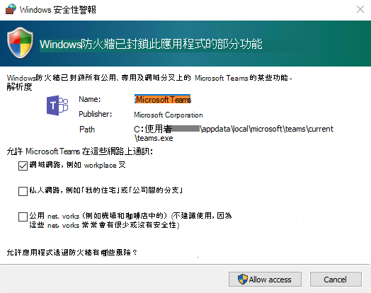
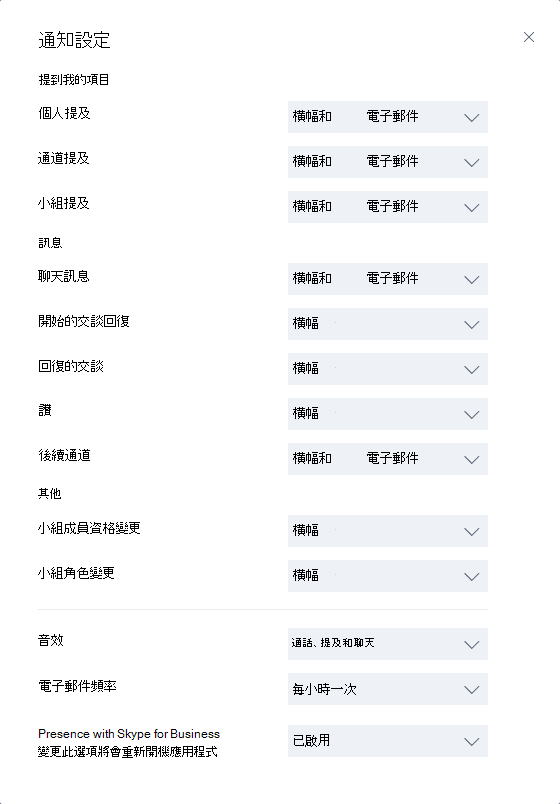

# <a name="get-clients-for-microsoft-teams"></a>取得 Microsoft Teams 用戶端 


Microsoft Teams 具有適用於 Web、桌面 (Windows、Mac 和 Linux) 及行動裝置 (Android 和 iOS) 的用戶端。 這些用戶端都需要使用有效的網際網路連線，且並不支援離線模式。

> [!NOTE]
> 2018 年 11 月 29 日起，您將無法再使用 Microsoft Store 提供的 Windows 10 S 版 Microsoft Teams (預覽版) 應用程式。 但是您現在可以在執行 Windows 10 S 模式的裝置上，下載並安裝 Teams 桌面版用戶端。 若要下載桌面版用戶端，請移至 [https://teams.microsoft.com/downloads](https://go.microsoft.com/fwlink/?linkid=855754)。 Teams 桌面版用戶端的 MSI 組建尚不適用於執行 Windows 10 S 模式的裝置。
>
> 如需有關 Windows 10 S 模式的詳細資訊，請參閱[引進 Windows 10 S 模式](https://www.microsoft.com/windows/s-mode)。 

## <a name="desktop-client"></a>桌面版用戶端

> [!TIP]
> 請觀看下列工作階段，以了解 Windows 桌面版用戶端的優點、規劃方式及部署方式：[Teams 的 Windows 桌面版用戶端](https://aka.ms/teams-clients)

Microsoft 團隊桌面用戶端是獨立的應用程式，也[可在適用于企業的 Microsoft 365 應用程式中使用](https://docs.microsoft.com/deployoffice/teams-install)。 Teams 適用於 32 位元和 64 位元版本的 Windows (8.1 或更新版本) 及 Windows Server (2012 R2 或更新版本)，也適用於 macOS (10.10 或更新版本) 及 Linux (`.deb` 和 `.rpm` 格式)。 在 Windows 上，Teams 需要 .NET Framework 4.5 或更新版本；如果您沒有此元件，Teams 安裝程式將會為您安裝。 在 Linux 上，套件管理員 (例如 `apt` 和 `yum`) 會嘗試為您安裝任何需求。 不過，如果套件管理員沒有這麼做，您必須先安裝所有回報的需求，然後再安裝 Linux 版 Teams。

桌面版用戶端提供即時通訊支援 (音訊、視訊和內容共用)，可用於進行小組會議、群組通話和個人的一對一通話。

如果終端使用者擁有適當的本機權限 (在 PC 上安裝 Teams 用戶端不需要系統管理員權限，但在 Mac 上安裝則需要系統管理員權限)，他們可以直接從 [https://teams.microsoft.com/downloads](https://go.microsoft.com/fwlink/?linkid=855754) 下載和安裝桌面版用戶端。

> [!NOTE]
> 如需在 Chromebook 上安裝團隊的詳細資訊，請參閱[如何在 Chromebook 上安裝及執行 Microsoft Office](https://support.office.com/article/how-to-install-and-run-microsoft-office-on-a-chromebook-32f14a23-2c1a-4579-b973-d4b1d78561ad)。

IT 系統管理員可以選擇其偏好的方式，將安裝檔案發佈到組織中的電腦。 例如 Microsoft Endpoint Configuration Manager (Windows) 或 Jamf Pro (macOS)。 若要取得 Windows 發行版本的 MSI 套件，請參閱[使用 MSI 安裝 Microsoft Teams](msi-deployment.md)。  

> [!NOTE]
> 透過這些機制發佈的用戶端只適用於一開始的 Microsoft Team 用戶端安裝，不適用於未來的更新。

### <a name="windows"></a>Windows

適用於 Windows 的 Microsoft Teams 安裝會提供 32 位元和 64 位元架構的可下載安裝程式。

> [!NOTE]
> Microsoft Teams 的架構 (32 位元和 64 位元) 並不受限於已安裝的 Windows 和 Office 架構。

Windows 用戶端會部署至使用者設定檔中的 [AppData] 資料夾。 部署至使用者的本機設定檔中，即可在不需要提高權限的情況下安裝用戶端。 Windows 用戶端會利用下列位置：

- %LocalAppData%\\Microsoft\\Teams

- %LocalAppData%\\Microsoft\\TeamsMeetingAddin

- %AppData%\\Microsoft\\Teams

- %LocalAppData%\\SquirrelTemp

使用者第一次使用 Microsoft Teams 用戶端進行通話時，可能會注意到要求使用者允許通訊的 Windows 防火牆設定警告。 系統可能會指示使用者忽略這則訊息，因為即使忽略警告，您仍然能進行通話。



> [!NOTE]
> 即使您選取「取消」來忽略提示，Windows 防火牆設定仍會變更。 針對 TCP 和 UDP 通訊協定，系統會為 teams.exe 建立包含封鎖動作的兩個輸入規則。

如果您想要防止團隊在使用者第一次從團隊撥打電話時，提示使用者建立防火牆規則，請使用下列[範例 PowerShell 腳本-入站防火牆規則](#sample-powershell-script---inbound-firewall-rule)。 

### <a name="mac"></a>Mac

Mac 使用者可以使用 macOS 電腦的 PKG 安裝檔來安裝 Teams。 安裝 Mac 用戶端必須具備系統管理存取權。 MacOS 用戶端會安裝至 /Applications 資料夾。

#### <a name="install-teams-by-using-the-pkg-file"></a>使用 PKG 檔案來安裝 Teams

1. 在 **Mac**底下的 [Teams 下載頁面](https://teams.microsoft.com/downloads)中，按一下 [下載]****。
2. 按兩下 PKG 檔案。
3. 遵循安裝精靈來完成安裝。
4. Teams 將會安裝到 /Applications 資料夾。 這是全機器安裝。

> [!NOTE]
> 在安裝期間，PKG 會提示您輸入系統管理員認證。 無論使用者是否為系統管理員，使用者都需要輸入系統管理員認證。

如果使用者目前已具有 Teams 的 DMG 安裝，但想要將其取代為 PKG 安裝，使用者應該：

1. 結束 Teams 應用程式。
2. 取消安裝 Teams 應用程式。
3. 安裝 PKG 檔案。

IT 系統管理員可以使用 Teams 的受控部署，將安裝檔案發佈到其組織中的所有 Mac，例如 Jamf Pro。

> [!NOTE]
> 如果您在安裝 PKG 時遇到問題，請告訴我們。 請在本文結尾的**意見反應**一節中，按一下 [產品意見反應]****。

### <a name="linux"></a>Linux

使用者能夠安裝 `.deb` 和 `.rpm` 格式的原生 Linux 套件。
安裝 DEB 或 RPM 套件時，將會自動安裝套件儲存庫。
- DEB `https://packages.microsoft.com/repos/ms-teams stable main`
- RPM `https://packages.microsoft.com/yumrepos/ms-teams` 

使用系統套件管理員來啟用自動更新所需的簽署金鑰也會自動安裝。 不過，也可以在以下位置找到：(https://packages.microsoft.com/keys/microsoft.asc)。 Microsoft Teams 會每月傳送，而且如果存放庫安裝正確，則系統套件管理員會使用與系統中其他套件相同的方式處理自動更新。

> [!NOTE] 
> 如果您發現錯誤，請使用用戶端內部的 `Report a Problem` 提交錯誤。 如有已知問題，請參閱[貴組織的支援小組](Known-issues.md)。
> 如需適用於 Teams 的 Linux 支援，您可以使用 [Microsoft Q&A 上的 Linux 論壇支援頻道](https://docs.microsoft.com/answers/topics/teams.html)。 請務必在張貼問題時使用 `teams-linux` 標籤。 

#### <a name="install-teams-using-deb-package"></a>使用 DEB 套件安裝 Teams

1. 從 https://aka.ms/getteams 下載套件。
2. 利用下列其中一個選項進行安裝：  
    - 開啟相關套件管理工具，並進行自助式 Linux 應用程式安裝程序。
    - 或者，如果您喜歡終端機，請輸入： `sudo apt install **teams download file**`

您可以輸入 `Teams`，以透過活動或終端機來啟動 Teams。 

#### <a name="install-teams-using-rpm-package"></a>使用 RPM 套件來安裝 Teams

1. 從 https://aka.ms/getteams 下載套件。
2. 利用下列其中一個選項進行安裝：
    - 開啟相關套件管理工具，並進行自助式 Linux 應用程式安裝程序。
    - 或者，如果您喜歡終端機，請輸入： `sudo yum install **teams download file**`

您可以輸入 `Teams`，以透過活動或終端機來啟動 Teams。

#### <a name="install-manually-from-the-command-line"></a>從命令列手動安裝

在 Debian 和 Ubuntu 發行版本上手動安裝：
```
curl https://packages.microsoft.com/keys/microsoft.asc | sudo apt-key add -
 
sudo sh -c 'echo "deb [arch=amd64] https://packages.microsoft.com/repos/ms-teams stable main" > /etc/apt/sources.list.d/teams.list'
 
sudo apt update
sudo apt install teams
```

在 RHEL、Fedora 和 CentOS 發行版本中手動安裝：
```
sudo rpm --import https://packages.microsoft.com/keys/microsoft.asc
 
sudo sh -c 'echo -e "[teams]\nname=teams\nbaseurl=https://packages.microsoft.com/yumrepos/ms-teams\nenabled=1\ngpgcheck=1\ngpgkey=https://packages.microsoft.com/keys/microsoft.asc" > /etc/yum.repos.d/teams.repo'
 
sudo dnf check-update
sudo dnf install teams
```

或者，若要使用 yum (而不是 dnf)：
```
yum check-update
sudo yum install teams
```

在 openSUSE 發行版本上手動安裝：
```
sudo rpm --import https://packages.microsoft.com/keys/microsoft.asc
 
sudo sh -c 'echo -e "[teams]\nname=teams\nbaseurl=https://packages.microsoft.com/yumrepos/ms-teams\nenabled=1\nautorefresh=1\nkeeppackages=0\ntype=rpm-md\ngpgcheck=1\ngpgkey=https://packages.microsoft.com/keys/microsoft.asc" > /etc/zypp/repos.d/teams.repo'
 
sudo zypper refresh
sudo zypper install teams
```

## <a name="web-client"></a>Web 用戶端 

Web 用戶端 ([https://teams.microsoft.com](https://go.microsoft.com/fwlink/?linkid=855753)) 是功能完整的用戶端，可在多種瀏覽器中使用。 Web 用戶端使用 webRTC 來支援通話和會議，因此不需要外掛程式或任何下載，即可在網頁瀏覽器中執行 Teams。 瀏覽器必須設定為允許第三方 Cookie。 

[!INCLUDE [browser-support](includes/browser-support.md)]

Web 用戶端會在連線至 [https://teams.microsoft.com](https://go.microsoft.com/fwlink/?linkid=855753) 時執行瀏覽器版本偵測。 如果偵測到不受支援的瀏覽器版本，則會封鎖 Web 介面的存取權，並建議使用者下載桌面版用戶端或行動裝置應用程式。

## <a name="mobile-clients"></a>行動裝置用戶端

Microsoft Teams 行動裝置應用程式適用於 Android 和 iOS，可讓使用者在任何地方參與聊天式對話，並且允許對等音訊通話。 若需行動裝置應用程式，請移至相關的行動裝置商店：Google Play 和 Apple App Store。 Windows Phone 應用程式已於 2018 年 7 月 20 日停用，已不再適用。 

以下說明如何在中國[取得 Android 版 Teams](get-teams-android-in-china.md)。 

Microsoft Teams 行動裝置應用程式支援的行動平台如下：

-   **Android**：僅支援 Android 最新的四個主要版本。 發行新的 Android 主要版本時，此新版本和前三個版本都可受到正式支援。

-   **iOS**：僅支援 iOS 最新的兩個主要版本。 發行新的 iOS 主要版本時，此新版 iOS 和前一版本都可受到正式支援。

> [!NOTE]
> 為了讓 Teams 正常運作，您必須公開使用行動裝置版本。

行動裝置應用程式只可透過各別行動平台的應用程式商店來發行及更新。 Microsoft 不支援透過 MDM 或側載來發行行動裝置應用程式。 當行動裝置應用程式安裝在支援的行動裝置平台上之後，在目前版本發行後的三個月內，該版本仍能支援 Teams 行動裝置應用程式本身。


| | | |
|---------|---------|---------|
|      |決策點         |是否有任何限制會讓使用者無法在其裝置上安裝適當的 Microsoft Teams 用戶端？         |
|     |後續步驟         |如果您的組織限制軟體安裝，請確認該程序與 Microsoft Teams 相容。 附註：PC 版用戶端安裝程式不需要系統管理員權限，但這在 Mac 上安裝時是必要的權限。         |

## <a name="client-update-management"></a>用戶端更新管理

用戶端目前由 Microsoft Teams 服務自動更新，無需 IT 系統管理員介入。 一旦有可用的更新，用戶端就會自動下載更新，並且會在應用程式已閒置一段時間後，開始更新程序。

## <a name="client-side-configurations"></a>用戶端設定

目前，沒有支援的選項可供您透過租用戶系統管理員、PowerShell、群組原則物件或登錄來設定用戶端。

## <a name="notification-settings"></a>通知設定

目前沒有可供 IT 系統管理員設定用戶端通知設定的選項。 所有通知選項皆由使用者設定。 下圖概述預設的用戶端設定。



## <a name="sample-powershell-script---inbound-firewall-rule"></a>PowerShell 腳本-入站防火牆規則範例

此指令碼範例必須在系統管理員帳戶權限已提升的用戶端電腦上執行，才能為 c:\users 中的每個使用者資料夾建立新的輸入防火牆規則。 當 Teams 找到此規則時，該規則會防止 Teams 應用程式在使用者第一次從 Teams 進行通話時，提示使用者建立防火牆規則。 

```powershell
<#
.SYNOPSIS
   Creates firewall rules for Teams.
.DESCRIPTION
   (c) Microsoft Corporation 2018. All rights reserved. Script provided as-is without any warranty of any kind. Use it freely at your own risks.
   Must be run with elevated permissions. Can be run as a GPO Computer Startup script, or as a Scheduled Task with elevated permissions. 
   The script will create a new inbound firewall rule for each user folder found in c:\users. 
   Requires PowerShell 3.0.
#>

#Requires -Version 3

$users = Get-ChildItem (Join-Path -Path $env:SystemDrive -ChildPath 'Users') -Exclude 'Public', 'ADMINI~*'
if ($null -ne $users) {
    foreach ($user in $users) {
        $progPath = Join-Path -Path $user.FullName -ChildPath "AppData\Local\Microsoft\Teams\Current\Teams.exe"
        if (Test-Path $progPath) {
            if (-not (Get-NetFirewallApplicationFilter -Program $progPath -ErrorAction SilentlyContinue)) {
                $ruleName = "Teams.exe for user $($user.Name)"
                "UDP", "TCP" | ForEach-Object { New-NetFirewallRule -DisplayName $ruleName -Direction Inbound -Profile Domain -Program $progPath -Action Allow -Protocol $_ }
                Clear-Variable ruleName
            }
        }
        Clear-Variable progPath
    }
}
```
