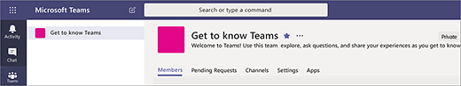
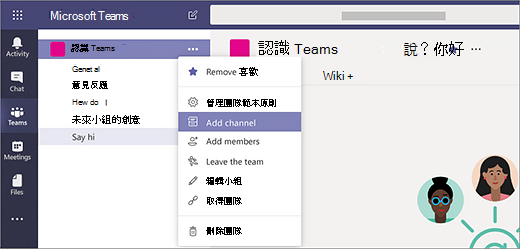

# 在 Microsoft Teams 中建立您的首批團隊和頻道Create your first teams and channels in Microsoft Teams

設定及使用您的首批團隊和頻道可建立您對 Teams 的體驗，並找出冠軍可協助促進整個組織採用 Teams 的風雲人物。Setting up and using your first set of teams and channels builds your experience with Teams and identifies champions who can help drive Teams adoption across your organization. 如果您尚未安裝 Teams，請參閱[取得 Teams 用戶端](get-clients.md)和[使用新式驗證登入 Teams](sign-in-teams.md)。If you haven't installed Teams yet, check out [Get Teams clients](get-clients.md) and [Sign in to Teams using modern authentication](sign-in-teams.md).

## 針對首批團隊和頻道的建議Suggestions for your first teams and channels

 團隊是一群因共同目標而聚集的人員集合。A team is a collection of people who gather together around a common goal. 頻道是團隊實際完成工作的共同作業空間。Channels are the collaboration spaces within a team where the actual work gets done. 

若要深入了解，請參閱[團隊和頻道概觀](teams-channels-overview.md)和[在 Teams 中組織團隊的最佳做法](best-practices-organizing.md)。To learn more, see [Overview of teams and channels in Teams](teams-channels-overview.md) and [Best practices for organizing teams in Teams](best-practices-organizing.md).

 我們建議您使用「了解 Teams」團隊，讓您的早期採用者試用、提問及探索 Teams 的功能。We suggest you start with a “Get to know Teams” team where your early adopters can play around, ask questions, and discover the capabilities of Teams. 開始試用 Teams 時，此團隊對您的成功至關重要。This team can be essential to your success as you begin to experiment with Teams. 

### 「了解 Teams」團隊"Get to know Teams" team
您的專案團隊可使用「了解 Teams」團隊，以確保設定 Teams 用戶端、進行初始交談，以及探索 Teams 的功能。Your project team can use the “Getting to know Teams” team to ensure they're set up with Teams clients, have some initial conversations, and explore what Teams can do. 您的組織中可能已有一群搶先使用新功能的人員。You may already have a group of people in your organization who enjoy getting early access to new capabilities. 這可以是他們開始使用時的初始團隊，並協助您提早獲得意見反應。This can be one of their initial teams when you bring them on board and will help you get early feedback.

以下是團隊的建議結構。Here's a suggested structure for the team.

| 頻道Channel | 描述及用法Description and usage | 固定的索引標籤、Bot 和應用程式Pinned tabs, bots, and apps |
| ------------ | -------------------- | -------------------- |
| 一般General | 所有團隊都是從一般頻道開始。All teams start with a General channel. 在開始認識 Teams 時，請使用此頻道發佈宣告。Use this channel to make announcements as you start getting to know Teams. |  |
| 打招呼Say hi | 向團隊自我介紹，並分享您想要使用的 Teams 功能。Introduce yourself to the team and share what you want to get from Teams. |  |
| 我要如何How do I | 這是一個詢問如何操作的頻道。A channel to ask how-to questions. 步驟 1 – 安裝桌面和行動裝置用戶端。Step 1 – install the desktop and mobile clients. 步驟 2 – 進入 Teams。Step 2 – jump into Teams.| 連結至 [Teams 說明中心](https://support.office.com/teams)的固定索引標籤Pinned tab that links to the [Teams help center](https://support.office.com/teams) 連結至 [Teams 訓練影片](https://support.office.com/article/microsoft-teams-video-training-4f108e54-240b-4351-8084-b1089f0d21d7)的固定索引標籤Pinned tab that links to [Teams training videos](https://support.office.com/article/microsoft-teams-video-training-4f108e54-240b-4351-8084-b1089f0d21d7) 連結至 [Teams 桌面和行動用戶端的下載連結](https://teams.microsoft.com/downloads)的固定索引標籤Pinned tab that links to [Teams desktop and mobile client download links](https://teams.microsoft.com/downloads) |
| 意見反應Feedback | 分享您對 Teams 體驗的想法。Share your thoughts on your Teams experiences. | 含投票的固定索引標籤Pinned tab with Polly Poll|
| 未來團隊的想法Ideas for future teams | 分享您對 Teams 如何在組織中提升附加價值的想法。Share your thoughts on where Teams can drive additional value in your organization. 如何稱呼這些團隊？What could these teams be called? 誰該成為成員？Who would be members? ||
| 支援Support | 如果某些功能未如預期運作，請使用此頻道取得協助。If something isn't working as expected, use this channel to get help. ||

## 讓您的首批團隊開始運作Get your first teams up and running
身為系統管理員，您可以在 Teams 用戶端或 Microsoft Teams 系統管理中心建立及管理團隊和頻道。As an admin, you can create and manage teams and channels in the Teams client or the Microsoft Teams admin center. 您可以將團隊建立為公用或私人。You can create teams as public or private. 您也可以建立[整個組織的團隊](create-an-org-wide-team.md)。You can also create an [org-wide team](create-an-org-wide-team.md). 組織中任何使用 Teams 的人員都可以加入公開團隊。Anyone using Teams in your organization can join a public team. 私人團隊是由團隊擁有者來管理團隊成員資格。For private teams, team owners manage team membership. 系統會自動將組織中的每個人加入整個組織的團隊。And for an org-wide team, everyone in your organization is automatically added. 

若要開始使用，建議您建立私人團隊，並新增另一位擁有者來管理團隊設定和成員資格。To get started, we recommend you create private teams and add another owner to manage team settings and membership. 

> [!NOTE]
> 在後續步驟中，我們使用 Teams 桌面用戶端來建立團隊和頻道。In the steps that follow, we use the Teams desktop client to create teams and channels. 請記住，身為系統管理員，也可以在 Microsoft Teams 系統管理中心執行這些工作。Keep in mind that as an admin, you can also do these tasks in the Microsoft Teams admin center.

### 建立團隊Create a team

在 Teams 的左側按一下 **[團隊]**，在團隊清單底部按一下 **[加入或建立團隊]**，然後按一下 **[建立新團隊]**。On the left side of Teams, click **Teams**, at the bottom of the teams list, click **Join or create a team**, and then click **Create a new team**.

建立團隊後，邀請其他人加入。Once you've created the team, invite people to join it. 您可以新增個別使用者、群組，甚至整個連絡人群組 (先前稱為「通訊群組清單」)。You can add individual users, groups, and even entire contact groups (formerly known as "distribution lists"). 

 

### 新增團隊擁有者Add a team owner
尋找您建立的團隊，按一下 **[其他選項˙˙˙]** > **[管理團隊]**。Find the team that you created, click **More options ˙˙˙** > **Manage team**. 然後移至 **[成員]** 索引標籤。尋找您要指定為團隊擁有者的人員。Then go to the **Members** tab. Find the people you want to designate as team owners. 在 **[角色]** 底下，按一下 **[擁有者]**。Under **Role**, click **Owner**.

### 在團隊中建立頻道Create a channel in a team
尋找您建立的團隊，按一下 **[其他選項˙˙˙]** > **[新增頻道]**。Find the team that you created, click **More options ...** > **Add channel**. 您也可以按一下 **[管理團隊]**，然後在 **[頻道]** 索引標籤中新增頻道。You can also click **Manage team** and add a channel in the **Channels** tab. 

![按一下 [其他選項] 時可用的選項的螢幕擷取畫面](media/get-started-with-teams-add-channel.png "[新增頻道] 選項、[管理團隊] 選項，以及其他按一下團隊中 [其他選項] 時可用的選項的螢幕擷取畫面") 

為頻道取一個描述性名稱，讓使用者更容易了解頻道的用途。Give the channel a descriptive name to make it easier for users to understand the purpose of the channel. 

身為團隊擁有者，您可以為整個團隊自動將頻道加入最愛，讓團隊中的每個人都能看到頻道。As a team owner, you can automatically favorite channels for the whole team, making the channels more visible for everyone on the team. 您也可以將索引標籤固定在頻道中，以新增 OneNote、網頁連結和其他內容，讓使用者更容易找到所需資訊及分享想法。You can also pin tabs to the channel to add tools, such as OneNote, links to webpages, and other content to make it easy for users to find what they need and share their thoughts.  

以下是「了解 Teams」團隊中的「我要如何」頻道範例，顯示連結至 Teams 網頁的固定索引標籤 &ndash; Teams 影片訓練、Teams 說明中心和 Teams 下載連結。Here's an example of the "How do I" channel in the "Get to know Teams" team, showing pinned tabs that link to Teams webpages &ndash; Teams video training, Teams help center, and Teams download links. 

 

## 後續步驟Next steps
移至[讓早期採用者快速上手](get-started-with-teams-onboard-early-adopters.md)。Go to [Onboard your early adopters](get-started-with-teams-onboard-early-adopters.md).
