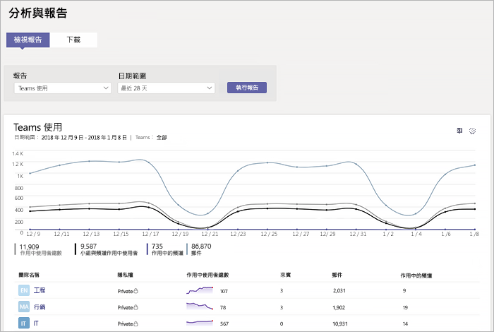
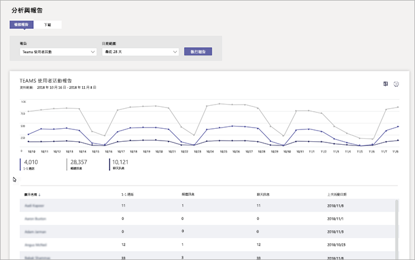
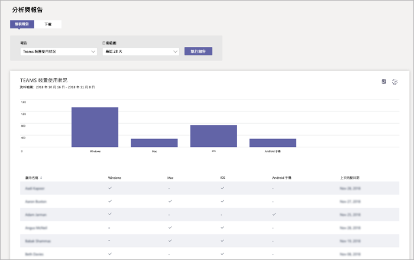

# 在 Microsoft Teams 中監視使用情況和意見反應Monitor usage and feedback in Microsoft Teams
了解使用者使用 Teams 的方式及他們對 Teams 的體驗十分重要。It's important to know how users are using Teams and what their experience is with Teams. 使用狀況報告可協助您更加了解使用模式，並提供使用者意見反應，讓您深入了解如何向更多人員推出，以及應優先訓練及溝通的人員。Usage reports can help you better understand usage patterns, and along with user feedback, give you insights to inform your wider rollout and where to prioritize training and communication efforts.

## 監視使用情況Monitor usage
針對您的第一組小組，我們建議您每週檢閱兩次報告，以了解新的趨勢。For your first set of teams, we recommend you review reports twice a week to understand emerging trends. 

例如，使用狀況報告顯示正在使用 Teams 行動用戶端的使用者不多。For example, usage reports show that not many users are using the Teams mobile clients. 這可能表示使用者不確定如何安裝用戶端。This may indicate that users aren't sure how to install the clients. 在頻道中張貼逐步安裝指示可協助推動使用更多用戶端。Posting step-by-step installation instructions in a channel may help drive usage of a wider range of clients. 或者，使用狀況報告顯示使用者主要使用 Teams 進行私人聊天。Or, usage reports show that users are primarily using Teams for private chats. 在此範例中，您可能會想要檢閱小組案例，因為使用者在設定的初始小組和頻道外聊天。In this example, you may want to review your team scenarios because users are chatting outside the initial teams and channels that were set up. 

以下說明如何取得報告以檢視 Teams 使用狀況。Here's how to get reports to view Teams usage. 

### Teams 分析與報告 (Microsoft Teams 系統管理中心)Teams analytics & reports (Microsoft Teams admin center)

Microsoft Teams 系統管理中心的 Teams 報告可讓您深入了解 Teams 在組織中的使用狀況。Teams reports in the Microsoft Teams admin center give you insights into how Teams is used in your organization. 使用報告來檢視 Teams 在組織中的使用狀況、使用者活動和裝置使用狀況。Use the reports to get a view into Teams usage, user activity, and device usage across your organization. 

若要檢視這些報告，您必須是 Office 365、Teams 服務系統管理員或商務用 Skype 系統管理員的全域系統管理員。請移至 Microsoft Teams 系統管理中心，在左側瀏覽窗格中選取 **[分析與報告]**，然後在 **[報告]** 底下選擇您要執行的報告。To view these reports, you must be a global admin in Office 365, Teams service admin, or Skype for Business admin. Go to the Microsoft Teams admin center, in the left navigation, select **Analytics & reports**, and then under **Report**, choose the report you want to run.

- **Teams 使用狀況報告**：此報告提供 Teams 使用活動的概覽，包括作用中使用者和頻道總數，以及每個小組中作用中使用者和頻道、來賓和訊息的數量。**Teams usage report**: This report gives you an overview of usage activity in Teams, including the total active users and channels, and the number of active users and channels, guests, and messages in each team. 

         
- **Teams 使用者活動報告**：此報告可讓您深入了解使用者參與的活動類型，例如透過 1:1 通話來通訊的人數、頻道訊息，以及私人聊天訊息。**Teams user activity report**: This report gives you insight into the types of activities users engage in, such as how many people communicate through 1:1 calls, channel messages, and private chat messages. 

     
\` 
\`
- **Teams 裝置使用狀況報告**：此報告會顯示使用者連線至 Teams 的方式，包括外出時在行動裝置上使用 Teams 的人數。**Teams device usage report**: This report shows you how users connect to Teams, including how many people use Teams on their mobile devices when on-the-go. 

    

若要深入瞭解，請參閱 [Teams 分析與報告](teams-analytics-and-reports/teams-reporting-reference.md)。To learn more, check out [Teams analytics and reporting](teams-analytics-and-reports/teams-reporting-reference.md). 

### Teams 活動報告 (Microsoft 365 系統管理中心)Teams activity reports (Microsoft 365 admin center)
您也可以透過 Microsoft 365 系統管理中心提供的報告來檢視 Teams 活動。You can also view Teams activity through reports that are available from the Microsoft 365 admin center. 這些報告屬於 Microsoft 365 系統管理中心的 Office 365 報告，並提供使用者活動和裝置使用狀況的相關資訊。These reports are part of the Office 365 reports in the Microsoft 365 admin center and provide information about user activity and device usage. 

若要檢視這些報告，請移至 Microsoft 365 系統管理中心，按一下 **[報告]** > **[使用狀況]**。To view these reports, go to the Microsoft 365 admin center, click **Reports** > **Usage**. 在 **[選取報告]** 底下，按一下 **[Microsoft Teams]**。Under **Select a report**, click **Microsoft Teams**. 從這裡選擇您要檢視的報告。From here, choose the report you want to view.

若要深入了解，請移至 [Teams 使用活動報告](teams-activity-reports.md)。To learn more, go to [Use activity reports for Teams](teams-activity-reports.md).

### Microsoft 365 使用情況分析Microsoft 365 usage analytics

您可以在 Power BI 中使用 Microsoft 365 使用情況分析來檢視及分析 Teams 和其他 Office 365 產品和服務的使用資料。You can use Microsoft 365 usage analytics in Power BI to view and analyze usage data for Teams and other Office 365 products and services. Microsoft 365 使用情況分析是內容套件，其中包含預先建立的儀表板和許多預先建立的報告。Microsoft 365 usage analytics is a content pack that includes a pre-built dashboard and a number of pre-built reports. 每份報告都會提供您特定使用資料和深入見解。Each report gives you specific usage data and insights. 若要連線到此內容套件，您需要 Power BI，且必須是 Office 365 或報告讀取者的全域系統管理員。To connect to the content pack, you need Power BI and must be a global admin in Office 365 or reports reader. 如果您還沒有 Power BI，請[註冊免費的 Power BI 服務](https://powerbi.microsoft.com)。If you don't already have Power BI, [sign up for the free Power BI service](https://powerbi.microsoft.com). 

若要深入了解，請參閱 [Microsoft 365 使用情況分析](https://support.office.com/article/Microsoft-365-usage-analytics-77ff780d-ab19-4553-adea-09cb65ad0f1f)。To learn more, see [Microsoft 365 usage analytics](https://support.office.com/article/Microsoft-365-usage-analytics-77ff780d-ab19-4553-adea-09cb65ad0f1f). 

## 收集意見反應Gather feedback
採用新的共同作業體驗是變更使用者的行為。The adoption of a new collaboration experience is about changing the behavior of users. 促成變更需要訓練、鼓勵和正面範例。Enabling change requires training, encouragement, and positive examples. 在轉換為 Teams 期間，讓使用者有發聲的機會及公開分享體驗十分重要。It's important for users to have a voice during the transition to Teams and to be able to openly share their experiences. 我們建議使用您建立的「了解 Teams」小組意見反應頻道來收集及處理使用者對 Teams之體驗的意見反應。We recommend using the Feedback channel in the "Get to know Teams" team you created to collect and address feedback from users on their experiences with Teams. 

## 後續步驟Next steps
移至[取得資源來規劃在整個組織推出 Teams](get-started-with-teams-resources-for-org-wide-rollout.md)。Go to [Get resources to plan your organization-wide rollout of Teams](get-started-with-teams-resources-for-org-wide-rollout.md).
