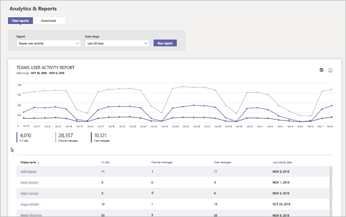

# 在 Microsoft Teams 中監視使用情況和意見反應
了解使用者使用 Teams 的方式及他們對 Teams 的體驗十分重要。 使用狀況報告可協助您更加了解使用模式，並提供使用者意見反應，讓您深入了解如何向更多人員推出，以及應優先訓練及溝通的人員。

## 監視使用情況
針對您的第一組小組，我們建議您每週檢閱兩次報告，以了解新的趨勢。 

例如，使用狀況報告顯示正在使用 Teams 行動用戶端的使用者不多。 這可能表示使用者不確定如何安裝用戶端。 在頻道中張貼逐步安裝指示可協助推動使用更多用戶端。 或者，使用狀況報告顯示使用者主要使用 Teams 進行私人聊天。 在此範例中，您可能會想要檢閱小組案例，因為使用者在設定的初始小組和頻道外聊天。 

以下說明如何取得報告以檢視 Teams 使用狀況。 

### Teams 分析與報告 (Microsoft Teams 系統管理中心)

Microsoft Teams 系統管理中心的 Teams 報告可讓您深入了解 Teams 在組織中的使用狀況。 使用報告來檢視 Teams 在組織中的使用狀況、使用者活動和裝置使用狀況。 

若要檢視這些報告，您必須是 Microsoft 365 或 Office 365、Teams 服務系統管理員或商務用 Skype 系統管理員的全域系統管理員。請移至 Microsoft Teams 系統管理中心，在左側瀏覽窗格中選取 [分析與報告]，然後在 [報告] 下選擇您要執行的報告。

- **Teams 使用狀況報告**：此報告提供 Teams 使用活動的概覽，包括作用中使用者和頻道總數，以及每個小組中作用中使用者和頻道、來賓和訊息的數量。 

         
- **Teams 使用者活動報告**：此報告可讓您深入了解使用者參與的活動類型，例如透過 1:1 通話來通訊的人數、頻道訊息，以及私人聊天訊息。 

     
`
- **Teams 裝置使用狀況報告**：此報告會顯示使用者連線至 Teams 的方式，包括外出時在行動裝置上使用 Teams 的人數。 

    

若要深入瞭解，請參閱 [Teams 分析與報告](teams-analytics-and-reports/teams-reporting-reference.md)。 

### Teams 活動報告 (Microsoft 365 系統管理中心)
您也可以透過 Microsoft 365 系統管理中心提供的報告來檢視 Teams 活動。 這些報告屬於 Microsoft 365 系統管理中心的 Microsoft 365 報告，並提供使用者活動和裝置使用狀況的相關資訊。 

若要檢視這些報告，請移至 Microsoft 365 系統管理中心，按一下 **[報告]** > **[使用狀況]**。 在 **[選取報告]** 底下，按一下 **[Microsoft Teams]**。 從這裡選擇您要檢視的報告。

若要深入了解，請移至 [Teams 使用活動報告](teams-activity-reports.md)。

### Microsoft 365 使用情況分析

您可以在 Power BI 中使用 Microsoft 365 使用情況分析來檢視及分析 Teams 和其他 Microsoft 365 或 Office 365 產品和服務的使用資料。 Microsoft 365 使用情況分析是內容套件，其中包含預先建立的儀表板和許多預先建立的報告。 每份報告都會提供您特定使用資料和深入見解。 若要連線到此內容套件，您需要 Power BI，且必須是 Microsoft 365、Office 365 或報告讀取者的全域系統管理員。 如果您還沒有 Power BI，請[註冊免費的 Power BI 服務](https://powerbi.microsoft.com)。 

若要深入了解，請參閱 [Microsoft 365 使用情況分析](https://support.office.com/article/Microsoft-365-usage-analytics-77ff780d-ab19-4553-adea-09cb65ad0f1f)。 

## 收集意見反應
採用新的共同作業體驗是變更使用者的行為。 促成變更需要訓練、鼓勵和正面範例。 在轉換為 Teams 期間，讓使用者有發聲的機會及公開分享體驗十分重要。 我們建議使用您建立的「了解 Teams」小組意見反應頻道來收集及處理使用者對 Teams之體驗的意見反應。 

## 後續步驟
移至[取得資源來規劃在整個組織推出 Teams](get-started-with-teams-resources-for-org-wide-rollout.md)。
