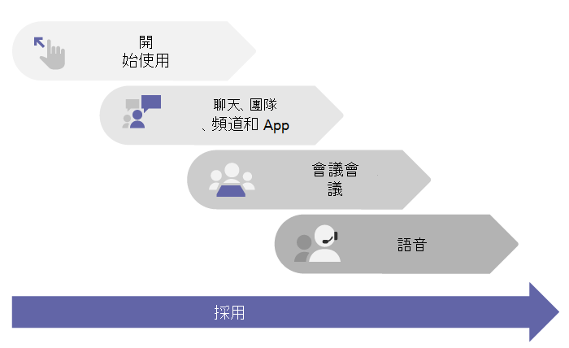

# 開始使用 Microsoft Teams

> [!TIP]
> 您是否正在尋找有關如何在電腦或行動裝置上安裝 Teams 用戶端的資訊？ 請至：[下載 Microsoft Teams](https://www.microsoft.com/microsoft-teams/download-app)。

## 從這裡開始

無論您是小型企業或跨國企業，這裡就是開始推出 Teams 的位置。 這些文章會逐步引導您完成小規模推出 Teams，若您是小型企業，或者要快速推出 Teams 並作為初次 Microsoft 365 工作負載以支援 **遠端工作者**，這就是您所需要的功能。

若您的組織規模較大，請使用這些文章，以一小組早期採用者試驗 Teams，使得您能夠了解 Teams，並開始規劃整個組織的部署。 稍後，請使用在 [Microsoft Teams 採用](https://adoption.microsoft.com/microsoft-teams/#get-started) 網站上的指導方針，以協助您將 Teams 推出至整個組織。

建議您在組織準備就緒時，依照工作負載，分階段推出 Teams。 **您不需要等到一個步驟完成，即可移至下一個步驟。** 有些組織可能會想要一次推出所有 Teams 功能，而其他人則可能偏好分階段推出。 以下是 Teams 的工作負載，以我們建議的推出順序排列：

- [聊天、團隊、頻道和應用程式](deploy-chat-teams-channels-microsoft-teams-landing-page.md)
- [會議和研討會](deploy-meetings-microsoft-teams-landing-page.md)
- [雲端語音](cloud-voice-landing-page.md)

如果您有中型或大型組織， [使用適用於 Microsoft Teams 的建議程式](use-advisor-teams-roll-out.md) 以協助您規劃在整個組織中推出這些工作負載。 建議程式會使用 Teams 本身以建立計畫工作，並將其指派給擁有者、共用文件，以及啟用部署小組之間的討論。

## 確定您已準備就緒

若要為您的 Teams 推出做好準備，無論 Teams 是您的第一個工作負載 ("Teams First") 或現有 Microsoft 365 或 Office 365 部署中的下一個工作負載，以下為您需要進行的動作：

- [針對 Teams 準備組織的網路](prepare-network.md)
  - 這包含設定您的 Microsoft 365 或 Office 365 網域、SharePoint Online、Exchange Online 和商務用 OneDrive。

- 為每個人取得 Teams 授權。 請查看 [Teams 方案](https://www.microsoft.com/microsoft-365/microsoft-teams/compare-microsoft-teams-options) 以及 [Microsoft Teams 服務描述](/office365/servicedescriptions/teams-service-description)。

- [了解安裝桌面、Web 和行動用戶端的優點](get-clients.md)

## 熟悉 Teams

如果您是 Teams 的新使用者，熟悉 Teams 的最好方式就是立即開始使用 Teams。 Teams 的最大優點就是，您現在所設定的任何事項，都不會影響您稍後可能需要執行的任何升級或移轉動作。

> [!TIP]
> 查看在 [Microsoft Learn for Teams](/learn/teams/) 中可以使用的學習路徑和模組。 您可以參觀 [Teams 系統管理中心](/learn/modules/m365-teams-navigate-admin-portal/)、瞭解如何 [設定適用於 Teams 的網路](/learn/modules/m365-teams-connectivity/)、取得如何以最佳方式 [將使用者上線至 Teams](/learn/modules/m365-teams-onboard-users/) 的想法和其他資訊！

使用下列步驟來設定幾個團隊，並導入一些早期採用者，以協助您熟悉 Teams。

- 步驟 1：[建立您的首批團隊和頻道](get-started-with-teams-create-your-first-teams-and-channels.md)
- 步驟 2：[讓早期採用者快速上手](get-started-with-teams-onboard-early-adopters.md)
- 步驟 3：[監視使用情況和意見反應](get-started-with-teams-monitor-usage-and-feedback.md)
- 步驟 4：[開始在整個組織推動](get-started-with-teams-resources-for-org-wide-rollout.md)

## 從商務用 Skype® 2015 升級或移轉

如果您是從商務用 Skype (線上或內部部署) 進入 Teams，或如果您需要混合式設定，您仍然需要依照上述針對 Teams 部署的建議路徑進行，但首先您需進行一些額外的規劃。從檢閱下表中適用於貴組織設定檔的指導方針開始。

|  |貴組織的設定檔|指導方針  |
|---------|---------|---------|
||我目前使用商務用 Skype Online，並準備好要移至 Teams。 |移至[升級至 Teams](upgrade-start-here.md)。        |
||我的組織執行商務用 Skype Server，而我想要推出 Teams。 |若要全面推出 Teams，您必須先在內部部署環境與 Microsoft 365 之間設定混合式連線。從閱讀[規劃商務用 Skype Server 與 Microsoft 365 或 Office 365 之間的混合式連線](/skypeforbusiness/hybrid/plan-hybrid-connectivity) (部分機器翻譯) 開始。  您也應該檢閱[升級至 Teams](upgrade-start-here.md)。   |
||我沒有商務用 Skype Server，但有內部部署公用交換電話網路 (PSTN) 解決方案。我想要推出 Teams，但想要保留我的內部部署 PSTN 解決方案。 |遵循本文中的建議以開始使用 Teams。  然後閱讀[規劃直接路由](direct-routing-plan.md)，了解如何使用電話系統直接路由來將您的內部部署 PSTN 解決方案與 Teams 對接。|