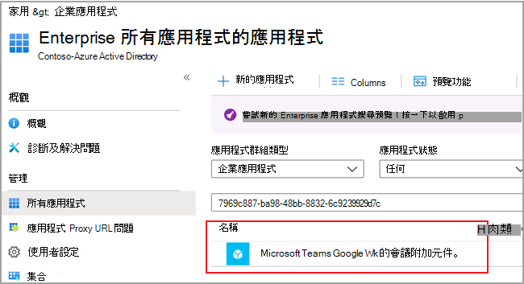
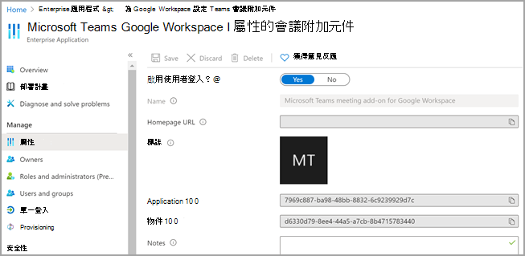

# <a name="set-up-microsoft-teams-meeting-add-on-for-google-workspace"></a>設定適用于 Google Workspace 的 Microsoft Teams 會議附加元件

使用 Microsoft Teams 會議附加元件可讓 Google 日曆使用者直接從 Google Workspace 排程並加入 Microsoft Teams 會議。 使用者將可以存取 Teams 會議功能，包括視訊和音訊會議、螢幕共用、會議聊天、數位白板等等。 保持聯繫並保持井然有序，以便跨公司、學校和生活一起完成更多工作。

Google Workspace 的 Microsoft Teams 會議附加元件必須由 Teams 系統管理員啟用，租使用者才能存取應用程式。

## <a name="enable-or-disable-microsoft-teams-meeting-add-on-for-google-workspace-in-the-azure-portal"></a>在 Azure 入口網站 中啟用或停用 Google Workspace 的 Microsoft Teams 會議附加元件

身為租使用者系統管理員，您可以使用Azure 入口網站，從貴組織的系統管理員帳戶啟用或停用 Google Workspace 的 Microsoft Teams 會議附加元件。

附加元件預設為啟用。

1. 登入Azure 入口網站。

2. 選取 **[企業應用程式**  >  **所有應用程式]**。

3. 搜尋 **適用于 Google Workspace 的 Microsoft Teams 會議附加元件**。

   

4. 選取 **[是]**。

   

5.  (選用) 若要停用附加元件，請在步驟 4 中選取 [ **否** ] 而不是 [ **是** ]。

## <a name="disable-microsoft-teams-meeting-add-on-for-google-workspace-using-powershell"></a>使用 PowerShell 停用 Google Workspace 的 Microsoft Teams 會議附加元件

```powershell
Connect-AzureAD

$displayName = 'Microsoft Teams meeting add-on for Google Workspace'
$appId = '7969c887-ba98-48bb-8832-6c9239929d7c'

# Check if a service principal already exists for the app
$servicePrincipal = Get-AzureADServicePrincipal -Filter "appId eq '$appId'"
if ($servicePrincipal) {
    # Service principal exists already, disable it
    Set-AzureADServicePrincipal -ObjectId $servicePrincipal.ObjectId -AccountEnabled $false
    Write-Host "Disabled existing Service Principal \n"
} else {
    # Service principal does not yet exist, create it and disable it at the same time
    New-AzureADServicePrincipal -AppId $appId -DisplayName $displayName
    Get-AzureADServicePrincipal -Filter "appId eq '$appId'" | Set-AzureADServicePrincipal -AccountEnabled:$false
    Write-Host "Created and disabled the Service Principal \n"
}
```

如需詳細資訊，請參閱[使用 Azure PowerShell 建立 Azure 服務主體](/powershell/azure/create-azure-service-principal-azureps?view=azps-5.0.0)。

## <a name="delete-the-microsoft-teams-meeting-add-on-for-google-workspace"></a>刪除 Google Workspace 的 Microsoft Teams 會議附加元件

如需相關指示，請參閱 [Google 檔刪除 Google Workspace Marketplace 應用程式](https://support.google.com/a/answer/6216211?hl=en) 。

## <a name="create-the-microsoft-teams-meeting-add-on-for-google-workspace-using-powershell"></a>使用 PowerShell 建立 Google Workspace 的 Microsoft Teams 會議附加元件

萬一您的租使用者沒有 Microsoft Teams 會議附加元件，您可以使用 PowerShell 來建立： 

```powershell
Connect-AzureAD

$displayName = 'Microsoft Teams meeting add-on for Google Workspace'
$appId = '7969c887-ba98-48bb-8832-6c9239929d7c'

# Check if a service principal already exists for the app
$servicePrincipal = Get-AzureADServicePrincipal -Filter "appId eq '$appId'"
if ($servicePrincipal) {
    # Service principal exists already
    Write-Host "The Service principal already exists"
} else {
    # Service principal does not yet exist, create it
    New-AzureADServicePrincipal -AppId $appId -DisplayName $displayName
    Write-Host "Created the Service Principal"
}
```
