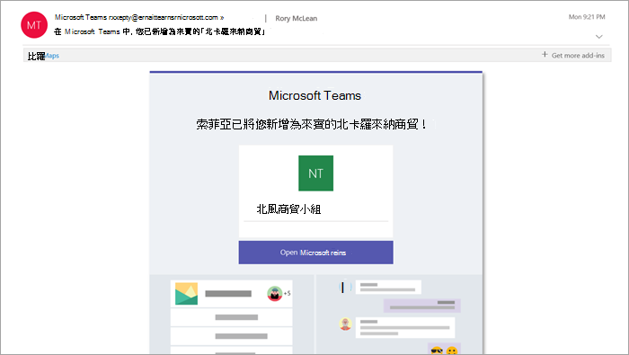
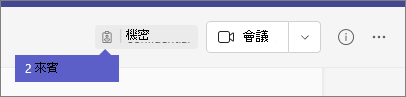

來賓體驗像什麼What the guest experience is like
=================================

當客人邀請您加入小組時，他們會收到歡迎電子郵件訊息。When a guest is invited to join a team, they receive a welcome email message. 此訊息包含小組的一些相關資訊，以及該小組所預期的成員。This message includes some information about the team and what to expect now that they're a member. 來賓必須先選取電子郵件訊息中的 [**開啟 Microsoft 團隊**]，然後才能存取團隊和其頻道，以接受邀請。The guest must accept the invitation by selecting **Open Microsoft Teams** in the email message before they can access the team and its channels.
    

    
所有團隊成員都會在頻道執行緒中看到一則訊息，宣佈小組擁有者已新增來賓並提供來賓的名稱。All team members see a message in the channel thread announcing that the team owner has added a guest and providing the guest's name. 小組中的每個人都可以輕鬆識別誰是來賓。Everyone on the team can identify easily who is a guest. 頻道螺紋右上角的標籤會指出團隊中的來賓人數，以及每個來賓的名稱旁會出現一個 **（來賓）** 標籤。A tag in the upper-right corner of the channel thread indicates the number of guests on the team and a **(Guest)** label appears next to each guest's name.

請參閱以下有關團隊訪客體驗的影片：Check out these videos about the guest experience in Teams:
- [以來賓身分加入團隊Join a team as a guest](https://support.office.com/article/join-a-team-as-a-guest-928d1eef-61e2-49ec-b754-c2fe86b34824)
- [使用來賓加入團隊會議Join a Teams meeting with guests](https://support.office.com/article/join-a-company-meeting-a120c282-063d-46b8-b973-851197ab75d8)

## 比較小組成員與來賓的功能Comparison of team member and guest capabilities

下表比較組織小組成員及其來賓的可用團隊功能。The following table compares the Teams functionality available for an organization's team members and its guests.

|**團隊中的功能****Capability in Teams**|**組織中的小組使用者****Teams user in the organization**|**來賓使用者****Guest user**|
|:-----|:-----|:-----|
|建立頻道Create a channel     *小組擁有者控制此設定。**Team owners control this setting.*    |&#x2713;&#x2713;|&#x2713;&#x2713;|
|參與私人聊天Participate in a private chat    |&#x2713;&#x2713;|&#x2713;&#x2713;|
|參與頻道交談Participate in a channel conversation    |&#x2713;&#x2713;|&#x2713;&#x2713;|
|張貼、刪除及編輯郵件Post, delete, and edit messages    |&#x2713;&#x2713;|&#x2713;&#x2713;|
|共用頻道檔案Share a channel file    |&#x2713;&#x2713;|&#x2713;&#x2713;|
|共用聊天檔案Share a chat file    |&#x2713;&#x2713;||
|新增應用程式（索引標籤、bot 或連接器）Add apps (tabs, bots, or connectors)    |&#x2713;&#x2713;||
|建立會議或存取排程Create meetings or access schedules    |&#x2713;&#x2713;||
|存取商務用 OneDrive 儲存空間Access OneDrive for Business storage    |&#x2713;&#x2713;||
|建立整個租使用者與團隊/頻道來賓存取原則Create tenant-wide and teams/channels guest access policies    |&#x2713;&#x2713;||
|邀請 Microsoft 365 或 Office 365 組織網域以外的使用者Invite a user outside the Microsoft 365 or Office 365 organization's domain    *小組擁有者控制此設定。**Team owners control this setting.*      |&#x2713;&#x2713;||
|建立團隊Create a team    |&#x2713;&#x2713;||
|探索並加入公開團隊Discover and join a public team    |&#x2713;&#x2713;||
|查看組織結構View organization chart    |&#x2713;&#x2713;||
|使用內嵌翻譯Use inline translation    |&#x2713;&#x2713;||
|成為團隊擁有者Become team owner    |&#x2713;&#x2713;||

   
下表顯示與其他使用者類型相比，來賓可用的通話與會議功能。The following table shows the calling and meeting features available to guests, compared to other types of users.

| 通話功能Calling feature | 來賓Guest | E1 與 E3 使用者E1 and E3 user | E5 和企業語音使用者E5 and Enterprise Voice user |
| --------------- | ----- | -------------- | -------------- |
| VOIP 通話VOIP calling | 是Yes | 是Yes | 是Yes |
| 群組通話Group calling | 是Yes | 是Yes | 是Yes |
| 核心通話控制支援（保留、靜音、影片開啟/關閉、螢幕共用）Core call controls supported (hold, mute, video on/off, screen sharing) | 是Yes | 是Yes | 是Yes |
| 轉移目標Transfer target | 是Yes | 是Yes | 是Yes |
| 可以轉接來電Can transfer a call | 是Yes | 是Yes | 是Yes |
| 可進行諮詢式轉接Can consultative transfer | 是Yes | 是Yes | 是Yes |
| 可透過 VOIP 將其他使用者新增至通話Can add other users to a call via VOIP | 是Yes | 是Yes | 是Yes |
| 可以透過電話號碼將使用者新增到通話中Can add users by phone number to a call | 否No | 否No | 是Yes |
| 轉寄目標Forward target | 否No | 是Yes | 是Yes |
| 通話群組目標Call group target | 否No | 是Yes | 是Yes |
| 未回復的目標Unanswered target | 否No | 是Yes | 是Yes |
| 可以是聯盟呼叫的目標Can be the target of a federated call | 否No | 是Yes | 是Yes |
| 可以進行聯盟通話Can make a federated call | 否No | 是Yes | 是Yes |
| 可以立即轉寄其來電Can immediately forward their calls | 否No | 否No | 是Yes |
| 可以同時撥打來電Can simultaneously ring their calls | 否No | 否No | 是Yes |
| 可以傳送未接聽的電話Can route their unanswered calls | 否No | 否No | 是Yes |
| 未接來電可移至語音信箱Missed calls can go to voicemail | 否No | 無1No1 |是Yes |
| 擁有可接聽電話的電話號碼Have a phone number that can receive calls | 否No | 否No | 是Yes |
| 可以撥打電話號碼Can dial phone numbers | 否No | 否No | 是Yes |
| 可以存取通話設定Can access call settings | 否No | 否No | 是Yes |
| 可以變更語音信箱問候語Can change voicemail greeting | 否No | 無1No1 | 是Yes |
| 可以變更鈴聲Can change ringtones | 否No | 否No  | 是Yes |
| 支援 TTYSupports TTY | 否No | 否No | 是Yes |
| 可以擁有代理人Can have delegates | 否No | 否No | 是Yes |
|  可以是代理人Can be a delegate | 否No | 否No | 是Yes |

1這個功能即將推出。1 This feature will be available soon.

> [!NOTE]
> Microsoft 365 和 Office 365 系統管理員可控制來賓可用的功能。Microsoft 365 and Office 365 admins control the features available to guests. 

## 常見問題集Frequently asked questions

### 如何離開受邀者的組織？How do I leave an organization that I've been invited to?
如果您受邀您不想成為客人的組織，您可以選擇離開該組織。If you've been invited to an organization that you don't want to be a guest of, you can choose to leave the organization. 如需詳細資訊，請移至[將組織設為來賓使用者](https://docs.microsoft.com/azure/active-directory/b2b/leave-the-organization)。For more information, go to [Leave an organization as a guest user](https://docs.microsoft.com/azure/active-directory/b2b/leave-the-organization). 或者，您也可以要求組織管理員將您從其租使用者中移除。Alternatively, you can ask the admin of the organization to remove you from their tenant. 請注意，如果您想要在將來存取組織，您在任何一種情況下都必須重新受邀租使用者。Note that in either case you'll need to be re-invited to the tenant if you want to access the organization in the future.

### 來賓與團隊成員的功能是否相同？Do guests have the same capabilities as team members?
不。No. 如需訪客可以與不能執行哪些動作的詳細資訊，請參閱本文中[的小組成員和來賓功能比較](#comparison-of-team-member-and-guest-capabilities)。For more information about what a guest can and cannot do, go to [Comparison of team member and guest capabilities](#comparison-of-team-member-and-guest-capabilities) in this article.

### 來賓是否有權存取商務用 OneDrive？Do guests have access to OneDrive for Business?
不。No.

### 來賓是否有存取 SharePoint 檔案的許可權？Do guests have access to SharePoint files?
是。Yes.

### 來賓可以在檔案中搜尋嗎？Can guests search within files?
不。No.

### 來賓可以附加檔案嗎？Can guests attach files?
是的，來賓可以透過以下兩種方式附加檔案：Yes, a guest can attach files in these two ways:

   - 在左窗格**中選取 [** 檔案]，然後流覽至檔案位置。Select **Files** in the left pane, and then browse to the file location.
   - 從電腦上傳檔案。Upload files from their computer.

### 來賓可以在私人聊天中下載檔案嗎？Can a guest download a file in a private chat?
是的，他們可以在私人聊天中接收成員的檔案，然後將檔案下載到他們的桌面。Yes, they can receive a file from a member in a private chat, and then download it to their desktop.
