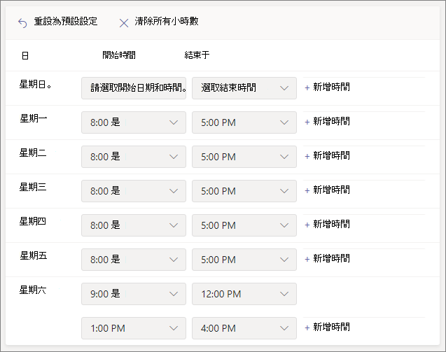
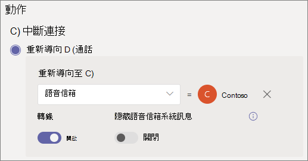
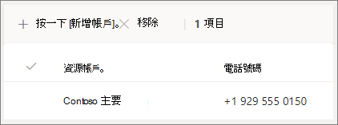

#### 影片示範Video demonstration

這段影片顯示如何在 Teams 中建立自動Teams。This video shows a basic example of how to create an auto attendant in Teams.

> [!VIDEO https://www.microsoft.com/videoplayer/embed/RWEnCG?autoplay=false]

#### 開始之前Before you begin

取得服務號碼 (服務號碼是自動總機使用的特殊電話號碼類型) 您所需的自動總機號碼，您需從組織外部直接撥號來取得。Get the service numbers (service numbers are a special type of phone number that are used by auto attendants) that you need for the auto attendants that you want to be accessible by direct dialing from outside your organization. 這可能包括 [從另一個提供者移轉號碼](../phone-number-calling-plans/transfer-phone-numbers-to-teams.md) 或 [要求新的服務號碼](../getting-service-phone-numbers.md)。This might include [transferring numbers from another provider](../phone-number-calling-plans/transfer-phone-numbers-to-teams.md) or [requesting new service numbers](../getting-service-phone-numbers.md).

每個自動總機都需要指派一個電話系統虛擬使用者授權。Each auto attendant needs to be assigned a Phone System - Virtual User license. 當您購買 Business Voice 時，您也會收到電話系統 - 虛擬使用者授權，因此您可能不需要要求更多。When you purchased Business Voice, you also received a number of Phone System - Virtual User licenses, so you probably don't need to request more. 不過，如果您日後需要更多，您可以遵循 電話系統[- 虛擬使用者授權中的指示電話系統取得](../teams-add-on-licensing/virtual-user.md)。However, if you need more in the future, you can get them by following the instructions in [Phone System - Virtual User license](../teams-add-on-licensing/virtual-user.md).

如果您想要在假日以不同方式讓自動電話機路由通話，請建立您想要使用的假日，然後再建立自動總機。If you want to have your auto attendant route calls differently on holidays, then [create the holidays that you want to use](../set-up-holidays-in-teams.md) before you create the auto attendant.

#### 請遵循下列步驟來設定自動助理Follow these steps to set up your auto attendant

# [步驟 1   電話數位Step 1 Phone number](#tab/phone-number)

> [!NOTE]
> 如果您第一次遵循設定商務語音的步驟，而且您正使用步驟 **6：** 設定公司主要電話號碼的自動語音機，表示您已完成此選項卡上的步驟。移至下一個定位停駐點： [自動傳訊一般資訊](?tabs=general-info#steps)。If you're following the steps to set up Business Voice for the first time and you're on **Step 6: Set up an auto attendant for your company's main phone number**, you've already finished the steps on this tab. Move to the next tab: [Auto attendant general info](?tabs=general-info#steps).

您建立的每個自動助理都需要資源帳戶。Each auto attendant that you create requires a resource account. 這類似于使用者帳戶，除了該帳戶與自動通話或通話佇列相關聯，而不是與人員相關聯。This is similar to a user account, except the account is associated with an auto attendant or call queue instead of a person. 在此步驟中，我們將建立帳戶、指派帳戶Microsoft 365 電話系統 *虛擬* 使用者授權，然後指派服務號碼。In this step, we'll create the account, assign it a *Microsoft 365 Phone System - Virtual User* license, and then assign a service number.

### 建立資源帳戶Create a resource account

您可以在系統管理中心建立Teams帳戶。You can create a resource account in the Teams admin center.

1. 在 Teams系統管理中心中，展開 **整個組織設定**，然後按一下 [**資源帳戶**。In the Teams admin center, expand **Org-wide settings**, and then click **Resource accounts**.

2. 按一下 [新增 **]**。Click **Add**.

3. 在新增 **資源帳戶窗格中**，填寫 **顯示名稱**、**使用者名稱**，然後選擇資源帳戶類型的 **自動助理**In the **Add resource account** pane, fill out **Display name**, **Username**, and choose **Auto attendant** for the **Resource account type**

    

4. 按一下 [儲存]。Click **Save**.

    新帳戶會顯示在帳戶清單中。The new account will appear in the list of accounts.

    

### 指派授權Assign a license

您必須指派一個 *Microsoft 365 電話系統 - 虛擬使用者* 授權給資源帳戶。You must assign a *Microsoft 365 Phone System - Virtual User* license to the resource account.

1. 在 Microsoft 365系統管理中心中，按一下要指派授權的資源帳戶。In the Microsoft 365 admin center, click the resource account to which you want to assign a license.

2. 在 "**授權與應用程式"** 選項卡的 **"授權**" 下，選取 Microsoft 365 電話系統 -**虛擬使用者**。On the **Licenses and Apps** tab, under **Licenses**, select **Microsoft 365 Phone System - Virtual User**.

3. 按一下 **[儲存變更**。Click **Save changes**.

    

### 指派服務號碼Assign a service number

如果您需要讓電話號碼可以聯繫到這個自動助理，請指派該號碼給資源帳戶。If you need this auto attendant to be reachable by a phone number, then assign that number to the resource account.

1. 在 Teams系統管理中心，在 [資源帳戶> 頁面上，選取要指派服務號碼的資源帳戶，然後按一下 [**指派/取消指派**> 。In the Teams admin center, on the **Resource accounts** page, select the resource account to which you want to assign a service number, and then click **Assign/unassign**.

2. 在 電話 **數位** 類型下拉式選項中，選擇您想要使用的電話號碼類型。In the **Phone number type** dropdown, choose the type of number that you want to use.

3. 在 **[已指派的電話號碼** > 方塊中，搜尋您想要使用的號碼，然後按一下 [ **新增**。In the **Assigned phone number** box, search for the number you want to use and click **Add**.

    

4. 按一下 [儲存]。Click **Save**.

> [!div class="nextstepaction"]
> [步驟 2 - 自動總>Step 2 - Auto attendant general info >](?tabs=general-info#steps)

# [步驟 2   Attendant 一般資訊Step 2 Attendant general info](#tab/general-info)

設定自動話務員To set up an auto attendant

1. 在系統管理Teams中，展開 **[語音**，按一下 **[自動語音留言**，然後按一下 **[新增**> 。In the Teams admin center, expand **Voice**, click **Auto attendants**, and then click **Add**.

2. 在頂端方塊中輸入自動助理的名稱。Type a name for the auto attendant in the box at the top.

3. 如果您想要指定運算子，請指定撥打給接線員的目的地。If you want to designate an operator, specify the destination for calls to the operator. 這是選擇性選項 (，但建議使用) 。This is optional (but recommended). 您可以將 **運算子選項設定** 為允許來電者中斷功能表，並和指定的人員通話。You can set the **Operator** option to allow callers to break out of the menus and speak to a designated person.

4. 指定此自動助理的時區。Specify the time zone for this auto attendant. 如果您為小時後建立個別的通話流程，則時區會用來計算上班時間。The time zone is used for calculating business hours if you create a separate call flow for after hours.

5. 指定此 [自動翻譯](../create-a-phone-system-auto-attendant-languages.md) 的支援語言。Specify a [supported language](../create-a-phone-system-auto-attendant-languages.md) for this auto attendant. 這是系統產生的語音提示所使用的語言。This is the language that will be used for system-generated voice prompts. 

6. 選擇是否要啟用語音輸入。Choose if you want to enable voice inputs. 啟用時，每個功能表選項的名稱會變成語音辨識關鍵字。When enabled, the name of every menu option becomes a speech-recognition keyword. 例如，來電者可以說「One」，以選取對應到按鍵 1 的功能表選項，或說「銷售」以選取名為「銷售」的功能表選項。For example, callers can say "One" to select the menu option mapped to key 1, or they can say "Sales" to select the menu option named "Sales."

    

7. 按一下 **[下一步**。Click **Next**.

> [!div class="nextstepaction"]
> [步驟 3 - 通話流程>Step 3 - Call flow >](?tabs=call-flow#steps)

# [步驟 3   通話流程Step 3 Call flow](#tab/call-flow)

選擇您的通話流程選項Choose your call flow options

1. 選擇當自動回應接聽來電時，是否要播放問候語。Choose if you want to play a greeting when the auto attendant answers a call.

    如果您選取 **播放音訊檔案**，您可以使用 Upload **按鈕** 上傳儲存為音訊的錄製問候語訊息。WAV、.MP3或 。WMA 格式。If you select **Play an audio file** you can use the **Upload file** button to upload a recorded greeting message saved as audio in .WAV, .MP3, or .WMA format. 錄製內容不能大於 5 MB。The recording can be no larger than 5 MB.

    如果您選取輸入問候語 **訊息** ，當自動回應接聽來電時，系統會朗讀您輸入 (最多 1000 個字元) 文字。If you select **Type a greeting message** the system will read the text you the text that you type (up to 1000 characters) when the auto attendant answers a call.

    

2. 選擇通話的路由方式。Choose how you want to route the call.

    如果您選取中斷 **連接**，自動電話機會掛斷通話。If you select **Disconnect**, the auto attendant will hang up the call.

    如果您選取 **重新導向通話**，您可以選擇其中一個呼叫路由目的地。If you select **Redirect call**, you can choose one of the call routing destinations.

    如果您選取了 **播放功能表選項**，您可以選擇播放音訊檔案或輸入問候語訊息，然後選擇功能表選項和目錄搜尋。If you select **Play menu options**, you can choose to **Play an audio file** or **Type in a greeting message** and then choose between menu options and directory search.

    

3. 如果您希望來電者使用撥號鍵流覽，然後在設定功能表選項下，選擇當來電者按撥號鍵時要發生的專案。If you want callers to use dial keys to navigate, then under **Set menu options**, choose what you want to happen when callers press a dial key.  (如果您要將這個自動助理建立為公司目錄，請保留撥號鍵選項空白。) (If you're creating this auto attendant as a company directory, leave the dial key options blank.)

    您可以將任何撥號鍵設定為下列目的地：You can set any of the dial keys to the following destinations:

    - **組織中能夠接聽** 語音通話的人。**Person in the organization** - a person in your organization who is able to receive voice calls.
    - **語音應用程式** - 另一個自動語音留言機或通話佇列。**Voice app** - another auto attendant or a call queue.
    - **外部電話號碼** - 任何電話號碼。**External phone number** - any phone number. 使用此格式：+[國碼][區碼][電話號碼]Use this format: +[country code][area code][phone number]
    - **語音** 信箱 - 與您指定的Microsoft 365群組相關聯的語音信箱。**Voicemail** - the voice mailbox associated with a Microsoft 365 group that you specify. 您可以選擇是否要語音信箱字幕和「請在語音信箱後留言」。You can choose if you want voicemail transcriptions and the "Please leave a message after the tone." 系統提示。system prompt.
    - **運算子** - 為自動話務員定義的運算子。**Operator** - the operator defined for the auto attendant. 定義運算子是選擇性的。Defining an operator is optional. 運算子可以定義為此清單的其他任何目的地。The operator can be defined as any of the other destinations in this list.

    我們建議您將 0 鍵設定為運算子。We recommend setting 0 key to the operator.

    針對每個功能表選項，指定下列專案：For each menu option, specify the following:

    - **撥號鍵** - 電話鍵臺上的按鍵，以存取此選項。**Dial key** - the key on the telephone keypad to access this option.

    - **Voice 命令** - 定義來電者可給予存取此選項的語音命令 ，如果已啟用語音輸入。**Voice command** - defines the voice command that a caller can give to access this option, if voice inputs are enabled. 它可以包含多個字詞，例如「客戶服務」或「營運與理由」。It can contain multiple words like "Customer Service" or "Operations and Grounds." 

    - **重新導向** 至 -當來電者選擇此選項時，您希望通話前往何處。**Redirect to** - where you want the call to go when callers choose this option. 如果您要重新導向到自動電話機或通話佇列，請選擇與其相關聯的資源帳戶。If you are redirecting to an auto attendant or call queue, choose the resource account associated with it.

    

4. 如果您想要使用此自動總機做為公司目錄，請在目錄搜尋 **下，選取\*\*\*\*按名稱撥號**。If you want to use this auto attendant as a company directory, then under **Directory search**, select **Dial by name**. 當您啟用此選項時，來電者可以說出使用者的名稱，或在電話鍵臺上輸入。When you enable this option, callers can say the user's name or type it on the telephone keypad. 任何擁有授權電話系統使用者都是合格的使用者，而且可以使用撥號名稱找到。Any online user with a Phone System license is an eligible user and can be found with Dial by name. 

     (**您可以選擇分機撥號**，但分機必須在 Azure Active Directory.) (You can choose **Dial by extension**, however the extension must be configured in Azure Active Directory.)

5. 選取目錄搜尋 **選項之後，** 請按一下 [ **下一步**。Once you have selected a **Directory search** option, click **Next**.

> [!div class="nextstepaction"]
> [步驟 4 - 數小時後通話流程>Step 4 - After hours call flow >](?tabs=after-hours#steps)

# [步驟 4   小時之後Step 4 After hours](#tab/after-hours)

您可以針對每個自動話務員設定上班時間。Business hours can be set for each auto attendant. 如果未設定上班時間，則一天中所有的天數和所有時數會視為上班時間，因為預設會設定 24/7 排程。If business hours aren't set, all days and all hours in the day are considered business hours because a 24/7 schedule is set by default. 工作時間可以設定為一天中的休息時間，所有未設定為上班時間的時數會視為後小時。Business hours can be set with breaks in time during the day, and all of the hours that are not set as business hours are considered after-hours. 您可以為工作時間設定不同的來電處理選項和問候語。You can set different incoming call-handling options and greetings for after-hours.

根據您如何配置自動電話機和通話佇列，您可能只需要為具有直接電話號碼的自動電話機指定後通話路由。Depending on how you have configured your auto attendants and call queues, you may only need to specify after-hours call routing for auto attendants with direct phone numbers.

如果您想要為非工作時間的來電者個別進行通話路由，請為每天指定您的上班時間。If you want separate call routing for after-hours callers, then specify your business hours for each day. 例如 **，按一下 [新增時間** 以指定指定一天的陣列時數，以指定午餐休息時間。Click **Add new time** to specify multiple sets of hours for a given day, for example, to specify a lunch break.

指定上班時間之後，請選擇您的通話路由選項，以在數小時後進行。Once you have specified your business hours, then choose your call routing options for after hours. 在步驟 **3**- 通話流程中指定的上班時間通話路由，也提供相同的選項。The same options are available as for the business hours call routing that you specified in **Step 3 - Call flow**.

完成後 **，** 請按一下 [下一步。Click **Next** when you're done.

> [!div class="nextstepaction"]
> [步驟 5 - 假日通話流程>Step 5 - Holiday call flow >](?tabs=holidays#steps)

# [步驟 5   假日Step 5 Holidays](#tab/holidays)

您可以讓撥打到自動電話機的通話在假日路由方式與其他日期不同。You can have calls to your auto attendant routed differently on holidays than on other days.  (如果您不想為假日使用不同的通話流程，您可以略過此步驟。) (If you don't want to have a different call flow for holidays, you can skip this step.)

您的自動電話機可以針對您設定的每個假日設定通話流程。Your auto attendant can have a call flow for each holiday you've set up. 您最多可以將 20 個排定的假日加到每個自動乘務員。You can add up to 20 scheduled holidays to each auto attendant.

1. 在 [假日通話設定」 頁面上，按一下 [ **新增**。On the Holiday call settings page, click **Add**.

2. 輸入此假日設定的名稱。Type a name for this holiday setting.

3. 從假日 **下** 拉下拉，選擇您想要使用的假日。From the **Holiday** dropdown, choose the holiday that you want to use.

4. 選擇您想要使用的問候語類型。Choose the type of greeting that you want to use.

    

5. 選擇是否要中斷 **連接或\*\*\*\*重新導向** 通話。Choose if you want to **Disconnect** or **Redirect** the call.

6. 如果您選擇重新導向，請選擇通話的呼叫路由目的地。If you chose to redirect, choose the call routing destination for the call.

    

7. 按一下 [儲存]。Click **Save**.

    針對每一個額外的假日，根據需要重複此程式。Repeat the procedure as needed for each additional holiday.

    

    當您新增所有假日後，請按一下 [ **下一步**。When you've added all your holidays, click **Next**.

> [!div class="nextstepaction"]
> [步驟 6 - 選擇目錄中的>Step 6 - Choose who's in the directory >](?tabs=dial-scope#steps)

# [步驟 6   目錄成員Step 6 Directory members](#tab/dial-scope)

撥號 *範圍* 會定義當來電者使用撥號名稱或撥號分機時，哪些使用者可在目錄中使用。The *dial scope* defines which users are available in the directory when a caller uses dial-by-name or dial-by-extension. 所有線上 **使用者的預設值** 包含貴組織中擁有線上授權之線上電話系統使用者。The default of **All online users** includes all users in your organization that are Online users with a Phone System license.

您可以選取在包含或排除下的自訂使用者群組，並選擇一或多個Microsoft 365群組、通訊群組清單或安全性群組，以包含或排除特定使用者。 You can include or exclude specific users by selecting **Custom user group** under **Include** or **Exclude** and choosing one or more Microsoft 365 groups, distribution lists, or security groups. 例如，您可能會想要將貴組織的主管排除在撥號目錄中。For example, you might want to exclude executives in your organization from the dialing directory.  (如果使用者同時位於這兩個清單中，就會被排除在目錄中。) (If a user is in both lists, they will be excluded from the directory.)

> [!NOTE]
> 新使用者最多可能需要 36 小時，才能將名稱列在目錄中。It might take up to 36 hours for a new user to have their name listed in the directory.

設定好撥號範圍之後，請按一下 [ **下一步**。When you're done setting the dial scope, click **Next**.

> [!div class="nextstepaction"]
> [步驟 7 - 指派資源帳戶>Step 7 - Assign a resource account >](?tabs=resource-accounts#steps)

# [步驟 7   資源帳戶Step 7 Resource accounts](#tab/resource-accounts)

所有自動話務員都必須有相關聯的資源帳戶。All auto attendants must have an associated resource account.  第一層自動總機至少需要一個具有關聯服務號碼的資源帳戶。First level auto attendants will need at least one resource account that has an associated service number. 您可以根據需要，將多個資源帳戶指派給自動助理，每個帳戶都有個別的服務號碼。If you wish, you can assign several resource accounts to an auto attendant, each with a separate service number.

新增資源帳戶To add a resource account

1. 按一下 **[** 新增並搜尋您想要新增的帳戶。Click **Add** and search for the account that you want to add. 按一下 **[新增**，然後按一下 [ **新增**> 。Click **Add**, and then click **Add**.

    

2. 當您完成新增服務帳戶後，請按一下 [ **提交>**。When you have finished adding service accounts, click **Submit**.

    

    這會完成自動助理組組。This completes the auto attendant configuration.

---
