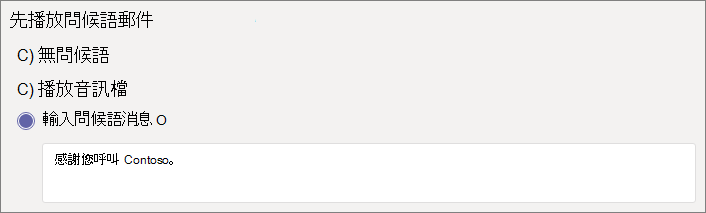
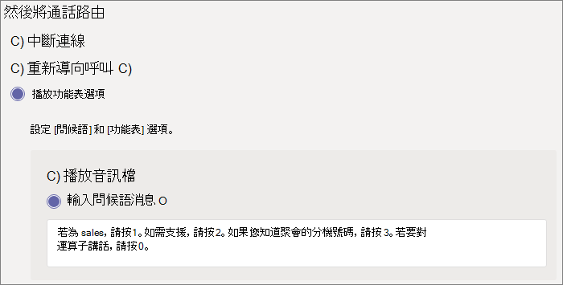

#### 影片示範

這段影片顯示如何在 Teams 中建立自動語音應答的基本範例。

> [!VIDEO https://www.microsoft.com/videoplayer/embed/RWEnCG?autoplay=false]

#### 開始之前

取得服務號碼 (服務號碼是自動語音應答所使用的特殊電話號碼類型)，這是您想要從組織外部人員直接撥號以存取自動語音應答所需的服務號碼。 這可能包括 [從其他提供者轉接號碼](../phone-number-calling-plans/transfer-phone-numbers-to-teams.md) 或 [要求新的服務號碼](../getting-service-phone-numbers.md)。

每個自動語音應答都需要指派電話系統 - 虛擬使用者授權。 購買 Business Voice 時，您也會收到一組電話系統 - 虛擬使用者授權的號碼，因此您可能不需要要求更多授權。 不過，如果您未來需要更多號碼，您可以遵循 [電話系統 - 虛擬使用者授權](../teams-add-on-licensing/virtual-user.md) 中的指示以取得。

如果您希望自動語音應答在假日可以不同方式路由通話，那麼，請先建立自動語音應答，再 [建立您想要使用的假日](../set-up-holidays-in-teams.md)。

#### 請遵循下列步驟設定自動語音應答

# [步驟 1 電話號碼](#tab/phone-number)

> [!NOTE]
> 如果您按照步驟進行初次 Business Voice 設定，且您正處於 **步驟 6：為公司的主要電話號碼設定自動語音應答**，表示您已經完成此索引標籤上的步驟。請移至下一個索引標籤：[自動語音應答一般資訊](?tabs=general-info#steps)。

您建立的每個自動語音應答都需要一個資源帳戶。 這類似于使用者帳戶，只是該帳戶與自動語音應答或通話佇列相關聯，而非與人員相關聯。 在此步驟中，我們將建立帳戶、為之指派 *Microsoft 365 電話系統 - 虛擬使用者* 授權，然後指派服務號碼。

### 建立資源帳戶

您可以在 Teams 系統管理中心建立資源帳戶。

1. 在 Teams 系統管理中心中，展開 **[全組織設定]**，然後按一下 **[資源帳戶]**。

2. 點擊 **[新增]**。

3. 在 **[新增資源帳戶]** 窗格中，填寫 **[顯示名稱]**、 **[使用者名稱]**，然後選擇 **[資源帳戶類型]** 的 **[自動語音應答]**。

    

4. 按一下 **[儲存]**。

    新帳戶會出現在帳戶清單中。

    

### 指派授權

您必須將 *Microsoft 365 電話系統 - 虛擬使用者* 授權指派給資源帳戶。

1. 在 Microsoft 365 系統管理中心，按一下要指派授權的資源帳戶。

2. 在 **[授權和應用程式]** 索引標籤上，在 **[授權]** 下方，選取 **[Microsoft 365 電話系統 - 虛擬使用者]**。

3. 按一下 **[儲存變更]**。

    

### 指派服務號碼

如果您需要該自動語音應答可由電話號碼進行聯繫，請指派該號碼給資源帳戶。

1. 在 Teams 系統管理中心的 **[資源帳戶]** 頁面上，選取要指派服務號碼的資源帳戶，然後按一下 **[指派/取消指派]**。

2. 在 **[電話號碼類型]** 下拉式選單中，選擇您想要使用的號碼類型。

3. 在 **[指派的電話號碼]** 方塊中，搜尋您想要使用的電話號碼，然後按一下 **[新增]**。

    

4. 按一下 **[儲存]**。

> [!div class="nextstepaction"]
> [步驟 2 - 自動語音應答一般資訊 >](?tabs=general-info#steps)

# [步驟 2 自動語音應答一般資訊](#tab/general-info)

若要設定自動語音應答

1. 在 Teams 系統管理中心中展開 **[語音]**，按一下 **[自動語音應答]**，然後按一下 **[新增]**。

2. 在頂端的方塊中輸入自動語音應答的名稱。

3. 如果您想要指定運算子，請指定通話目的地的運算子。 這是選擇性項目 (但建議使用)。 您可以設定 **[運算子]** 選項，讓來電者跳出選單，並與指定的人員說話。

4. 指定此自動語音應答的時區。 如果您為非上班時間建立個別的通話流程，則該時區會用來計算上班時間。

5. 為此自動語音應答指定 [支援的語言](../create-a-phone-system-auto-attendant-languages.md)。 這是將用於系統產生的語音提示的語言。 

6. 選擇是否要啟用語音輸入。 啟用後，每個選單選項的名稱都會變成語音辨識關鍵字。 例如，來電者可以以「一」來選取對應至按鍵 1 的選單選項，或說「銷售」來選取名為「銷售」的選單選項。

    

7. 按一下 **[下一步]**。

> [!div class="nextstepaction"]
> [步驟 3 - 通話流程 >](?tabs=call-flow#steps)

# [步驟 3 通話流程](#tab/call-flow)

選擇您的通話流程選項

1. 選擇是否要在自動語音應答接聽來電時播放問候訊息。

    如果您選取 **[播放音訊檔案]** 您可以使用 **[上傳檔案]** 按鈕來上傳儲存為 .WAV、 .MP3、 .WMA 音訊的錄製問候訊息。 錄製內容不能超過 5 MB。

    如果您選取 **[輸入問候訊息]**，系統就會在自動語音應答接聽來電時念出您所輸入的文字 (最多 1000 個字元)。

    

2. 選擇您要路由通話的方式。

    如果您選取 **[中斷連線]**，則自動語音應答將會掛斷通話。

    如果您選取 **[重新導向通話]**，則您可以選擇其中一個通話路由目的地。

    如果您選取 **[播放選單選項]**，則您可以選擇 **[播放音訊檔案]** 或 **[輸入問候訊息]**，然後選擇選單選項和目錄搜尋。

    

3. 如果您希望來電者使用撥號鍵進行瀏覽，那麼請在 **[設定選單選項]** 下，選擇您希望來電者按下撥號鍵時會產生的情況。 (如果您要將這個自動語音應答建立為公司目錄，請保留撥號鍵選項空白)。

    您可以將任何撥號鍵設定為下列目的地：

    - **組織中的人員** - 貴組織中能夠接聽語音通話的人。
    - **語音應用程式** - 另一個自動語音應答或通話佇列。
    - **外部電話號碼** - 任何電話號碼。 使用此格式：+[國碼][區碼][電話號碼]
    - **語音信箱** - 與您指定的 Microsoft 365 群組相關聯的語音信箱。 您可以選擇是否要將語音信箱進行謄寫，以及是否使用「請在提示聲後留下訊息」。 系統提示。
    - **運算子** - 為自動語音應答定義的運算子。 定義運算子為選擇性項目。 此運算子可定義為此清單內任何其他目的地。

    我們建議將 0 鍵設定為運算子。

    針對每個選單選項，指定下列項目：

    - **撥號鍵** - 電話按鍵上的按鍵，以存取此選項。

    - **語音命令** - 定義來電者可以給予的語音命令，以存取此選項 (如果已啟用語音輸入)。 它可以包含多個字，例如「客戶服務」或「營運與服務範圍」。 

    - **重新導向至** - 當來電者選擇此選項時，您希望通話導向的位置。 如果您要重新導向至自動語音應答或通話佇列，請選擇與其相關聯的資源帳戶。

    

4. 如果您想要使用此自動語音應答做為公司目錄，請在 **[目錄搜尋]** 下，選取 **[按名稱撥號]**。 當您啟用此選項時，來電者可以說出使用者名稱，或在電話按鍵上輸入該名稱。 任何具有 [電話系統] 授權的線上使用者都是合格的使用者，且可以透過 [按名稱撥號] 搜尋到該使用者。 

    (您可以選擇 **[按分機撥號]**，但是該分機必須在 Azure Active Directory 中進行設定。)

5. 選取 **[目錄搜尋]** 選項後，請按一下 **[下一步]**。

> [!div class="nextstepaction"]
> [步驟 4 - 非上班時間通話流程 >](?tabs=after-hours#steps)

# [步驟 4 非上班時間](#tab/after-hours)

您可以針對每個自動語音應答設定上班時間。 如果未設定上班時間，則每一天且一天中的所有時段都會被視為上班時間 (因為預設為一天 24 小時的排程)。 上班時間可以設定為具有休息時間的工作時段，且所有未設定為上班時間的時段都會視為非上班時間。 您可以為非上班時間設定不同的來電處理選項和問候訊息。

根據您設定自動語音應答和通話佇列的不同方式，您可能只需要為具有直接電話號碼的自動語音應答指定非上班時間通話路由。

如果您想要為非上班時間來電者設定個別的通話路由，請指定每一天的上班時間。 按一下 **[新增新時間]** 以為每一天指定多重時數組合，例如指定午餐休息時間。

在指定您的上班時間後，為非上班時間選擇您的通話路由選項。 提供與您在 **步驟 3 - 通話流程** 所指定的上班時間通話路由相同的選項。

完成後，請按一下 **[下一步]**。

> [!div class="nextstepaction"]
> [步驟 5 - 假日通話流程 >](?tabs=holidays#steps)

# [步驟 5 假日](#tab/holidays)

您可以讓自動語音應答收到的來電在假日時使用與其他日期不同的路由方式。 (如果您不想在假日使用不同的通話流程，則可以略過此步驟)。

您的自動語音應答可以針對您設定的每個假日設定通話流程。 您最多可以為每個自動語音應答新增 20 個排程假日。

1. 在 [假日通話設定] 頁面，按一下 **[新增]**。

2. 輸入此假日設定的名稱。

3. 從 **[假日]** 下拉式選單中，選擇您想要使用的假日。

4. 選擇您要使用的問候訊息類型。

    

5. 選擇您是否要 **[中斷連線]** 或 **[重新導向]** 該通話。

6. 如果您選擇重新導向，請為該通話選擇通話路由目的地。

    

7. 按一下 **[儲存]**。

    針對每個額外的假日重複該程序。

    

    當您新增所有假日後，請按一下 **[下一步]**。

> [!div class="nextstepaction"]
> [步驟 6 - 選擇目錄中的人員 >](?tabs=dial-scope#steps)

# [步驟 6 目錄成員](#tab/dial-scope)

*撥號範圍* 定義了當來電者使用按名稱撥號或按分機撥號時，目錄中提供哪些使用者。 **[所有線上使用者]** 的預設，包括貴組織中為具有 [電話系統] 授權之線上使用者的所有使用者。

您可以在 **[包含]** 或 **[排除]** 下選取 **[自訂使用者群組]**，然後選擇一或多個 Microsoft 365 群組、通訊群組清單或安全性群組，以包含或排除特定使用者。 例如，您可能會想要將貴組織的主管從撥號目錄中排除。 (如果某一使用者同時列在兩個清單中，則會自目錄中排除該使用者)。

> [!NOTE]
> 新使用者的名稱最多可能需要 36 小時才會列在目錄中。

當您完成撥號範圍的設定後，請按一下 **[下一步]**。

> [!div class="nextstepaction"]
> [步驟 7 - 指派資源帳戶 >](?tabs=resource-accounts#steps)

# [步驟 7 資源帳戶](#tab/resource-accounts)

所有自動語音應答都必須具有相關聯的資源帳戶。  第一層自動語音應答至少需要一個具有相關聯服務號碼的資源帳戶。 如果您想要的話，您可以將數個資源帳戶指派給一個自動語音應答，其中每個自動語音應答都具有不同的服務號碼。

若要新增資源帳戶

1. 按一下 **[新增]**，並搜尋您想要新增的帳戶。 按一下 **[新增]**，然後按一下 **[新增]**。

    

2. 當您完成新增服務帳戶後，請按一下 **[提交]**。

    

    這便完成了自動語音應答的設定。

---
