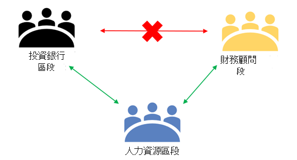
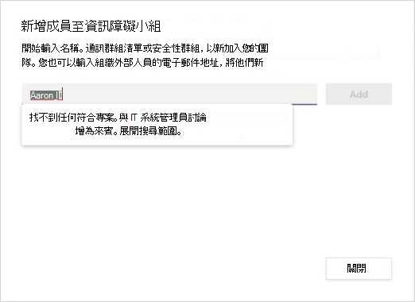
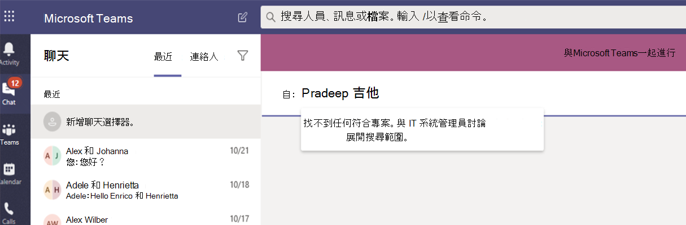
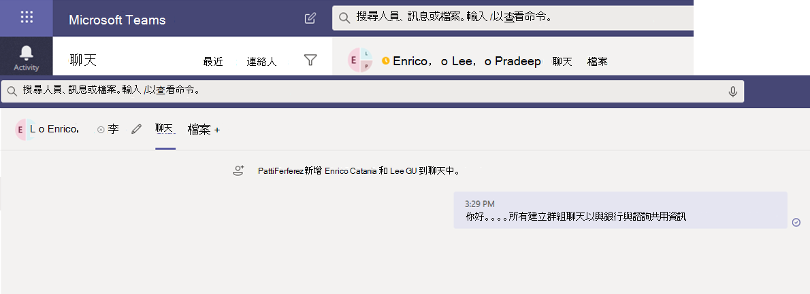
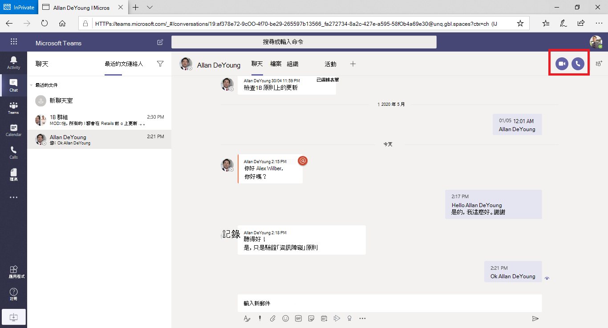
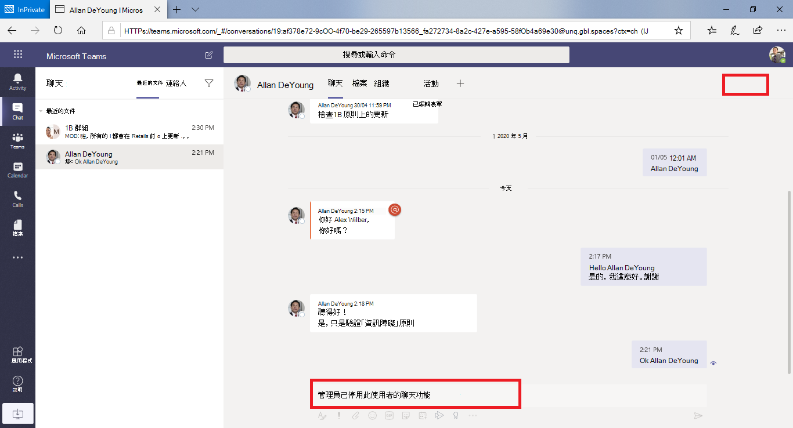
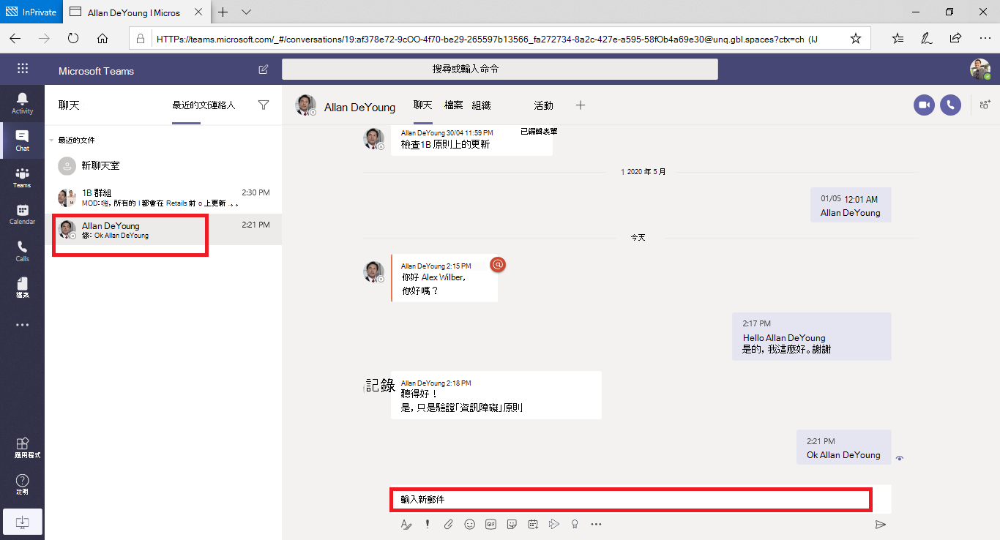
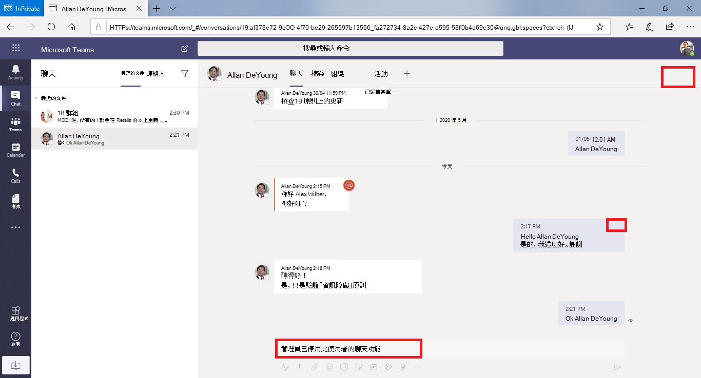
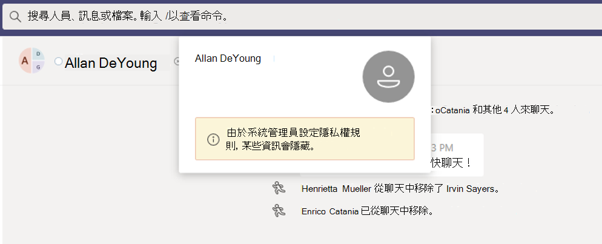
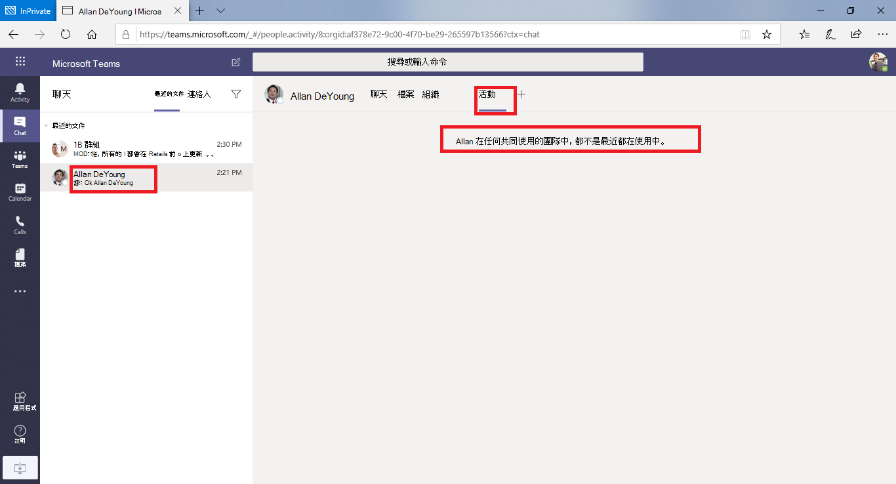

# Microsoft Teams 的資訊障礙

IB (資訊) 是系統管理員可設定以防止個人或群組彼此通訊的政策。 例如，如果有一個部門正在處理不應該與其他部門共用的資訊，則 IB 會很有用。 當群組需要被隔離或無法與群組外部的任何人通訊時，IBs 也很有用。

> [!NOTE]
> - 無法跨 (建立) 群組的資訊障礙。
> - 使用 Bot 的 Azure Active Directory (Azure AD) App，而版本 1 不支援一些新增使用者的 API。
> - 私人頻道符合您設定之IB 政策。
> - 新增：若要瞭解連結至 Teams 的 SharePoint 網站障礙支援相關資訊，請參閱 [與 Microsoft Teams 網站相關聯的區段](https://docs.microsoft.com/sharepoint/information-barriers#segments-associated-with-microsoft-teams-sites)。

IBM 政策也會防止查詢和探索。 如果您嘗試與不應該與某人通訊，您就不會在人員選擇器中找到該使用者。

## 背景

IB 的主要推動者來自金融服務業。 金融產業監管局 (FINRA) 會審查成員公司內部的 [IBs]( https://www.finra.org) 和利益衝突，並提供管理這類衝突 (FINRA 2241、債券研究法規通知 [15-31](https://www.finra.org/sites/default/files/Regulatory-Notice-15-31_0.pdf)的指引。

不過，自從推出 IB 之後，許多其他領域發現它們很有用。 其他常見案例包括：

- 教育：某學校的學生無法查看其他學校學生的連絡人詳細資料。

- 法律：維護一位客戶之律師所取得之資料的機密性，並防止代表不同客戶之同一家公司之律師存取這些資料。

- 政府：資訊存取與控制在部門與群組之間受到限制。

- 專業服務：公司中的一群人員只能在客戶互動期間透過來賓存取與客戶或特定客戶聊天。

例如，Enrico 屬於銀行部門，Pradeep 屬於財務顧問區段。 Enrico 和 Pradeep 無法彼此通訊，因為組織的IB 政策會阻止這兩個區段之間的通訊和共同合作。 不過，Enrico 和 Pradeep 可以在 HR 中與 Lee 通訊。

## 何時使用資訊障礙

您可能會想要在像這樣的情況下使用 IB：

- 必須禁止團隊與特定其他小組通訊或共用資料。
- 團隊不得與團隊外部的任何人通訊或共用資料。

資訊障礙策略評估服務會決定通訊是否符合IB 政策。

## 管理資訊障礙政策

使用 PowerShell Cmdlet 在 Microsoft 365 合規性中心 (SCC) 管理IB 政策。 詳細資訊，請參閱 [定義資訊障礙的政策](https://docs.microsoft.com/office365/securitycompliance/information-barriers-policies)。

> [!IMPORTANT]
> 在設定或定義策略之前，您必須在 Microsoft Teams 中啟用範圍目錄搜尋。 啟用範圍目錄搜尋後，請至少等候數小時，然後再設定或定義資訊障礙的政策。 詳細資訊，請參閱定義 [資訊障礙政策](https://docs.microsoft.com/office365/securitycompliance/information-barriers-policies#prerequisites)。

## 資訊障礙系統管理員角色

IBM 合規性管理角色負責管理IB 政策。 有關此角色的資訊，請參閱 [Microsoft 365 合規性中心的許可權](https://docs.microsoft.com/office365/securitycompliance/permissions-in-the-security-and-compliance-center)。

## 資訊障礙觸發因素

當下列 Teams 事件發生時，會啟用 IB 政策：

- **成員會新** 加入團隊 - 每當您將使用者新增到團隊時，使用者的政策都必須根據其他小組成員的 IBM 政策進行評估。 成功新增使用者之後，使用者可以在團隊中執行所有功能，而不需要進一步檢查。 如果使用者的政策會阻止他們加入團隊，使用者就不會在搜尋中顯示。

    

- **系統要求** 新的聊天 - 每次使用者要求與一或多個其他使用者進行新聊天時，會評估該聊天，以確保該聊天未違反任何IB 原則。 如果交談違反 IBM 原則，則交談不會開始。

    以下是 1：1 聊天的範例。

    > [!div class="mx-imgBorder"]
    > 

    以下是群組聊天的範例。

    > [!div class="mx-imgBorder"]
    > 

- **邀請使用者** 加入會議 - 當使用者受邀加入會議時，會根據適用于其他小組成員的IB原則評估適用于使用者的IB 原則。 如果發生衝突，使用者將不允許加入會議。

    

- **畫面在** 兩個或多個使用者之間共用 - 當使用者與其他使用者共用螢幕時，必須評估共用，以確保共用不會違反其他使用者的 IBM 原則。 如果違反 IB 原則，則不允許螢幕畫面共用。 
 
    以下是在原則適用前螢幕分享的範例。 

    > [!div class="mx-imgBorder"]
    > 

    以下是原則適用後螢幕分享的範例。 畫面共用和通話圖示不會顯示。

    > [!div class="mx-imgBorder"]
    > 

- 使用者在 **Teams** 中撥打電話 - 每當使用者透過 VOIP () 向其他使用者或使用者群組啟動語音通話時，會評估該通話，以確保該通話不會違反其他小組成員的 IB 原則。 如果有任何衝突，語音通話會封鎖。

- **Teams 中的來賓** - IBM 原則也適用于 Teams 中的來賓。 如果貴組織的全域通訊清單中需要可探索來賓，請參閱管理 [Microsoft 365 群組中的來賓存取權](https://docs.microsoft.com/microsoft-365/admin/create-groups/manage-guest-access-in-groups)。 一旦來賓可探索，您可以 [定義IB 政策](https://docs.microsoft.com/office365/securitycompliance/information-barriers-policies)。

## 政策變更對現有聊天的影響

當IB 原則系統管理員對原則進行變更，或因為使用者設定檔 (例如工作變更) 而啟用原則變更時，資訊障礙原則評估服務會自動搜尋成員，以確保他們在團隊中的成員資格不會違反任何原則。

如果使用者之間已有聊天或其他通訊，且已設定新策略或變更現有策略，服務會評估現有的通訊，以確保仍允許通訊發生。 

- **1：1** 聊天 - 如果兩個使用者之間不再允許通訊 (因為一或兩個使用者使用封鎖通訊) ，進一步通訊會封鎖。 他們現有的聊天交談會變成隻讀。 

    以下是顯示聊天的範例。

    > [!div class="mx-imgBorder"]
    > 

    以下範例顯示聊天已停用。

    > [!div class="mx-imgBorder"]
    > 

- 群組 **聊天**-如果不再允許從一個使用者與群組進行通訊 (例如，因為使用者變更了工作) ，使用者與參與違反原則的其他使用者可能會從群組聊天中移除，而且不允許與群組進一步通訊。 使用者仍然可以看到舊的交談，但無法看到或參與與群組的任何新交談。 如果防止通訊的新原則或變更原則已適用于多個使用者，則受原則影響的使用者可能會從群組聊天中移除。 他們還是可以看到舊的交談。

  在此範例中，Enrico 移至組織內部的不同部門，然後從群組聊天中移除。

  

  Enrico 無法再將訊息傳送至群組聊天。

  

- **小組** - 從群組中移除的任何使用者會從團隊中移除，且無法看到或參與現有的或新的交談。

## 案例：現有聊天中的使用者會變成封鎖

目前，如果IB 策略會阻止其他使用者，使用者會遇到下列情況：

- **人員選項卡** - 使用者無法看到已封鎖的使用者在 **人員選項卡上** 。

- **人員選擇** 器 - 在人員選擇器中不會顯示封鎖的使用者。

    
    
- **活動選項卡**- 如果使用者前往封鎖使用者的活動標籤，系統不會顯示任何文章。  (**活動選項卡** 只會顯示頻道文章，而且兩個使用者之間不會有常見的頻道。) 

    以下是封鎖的活動選項卡視圖範例。

    > [!div class="mx-imgBorder"]
    > 

- **組織結構** - 如果使用者存取的組織結構顯示封鎖的使用者，則封鎖的使用者不會出現在組織結構上。 而是會出現錯誤訊息。

- **人員** 卡片 - 如果使用者參與交談，但使用者稍後被封鎖，其他使用者將游標停留在封鎖的使用者名稱上時，會看到錯誤訊息，而不是人員卡片。 卡片上所列的動作 (通話和聊天) 無法使用。

- **建議的連絡人** - 封鎖的使用者不會出現在建議連絡人清單 (新使用者的初始連絡人清單中) 。

- **聊天連絡人** - 使用者可以在聊天連絡人清單中看到封鎖的使用者，但系統將會識別封鎖的使用者。 使用者可以對封鎖的使用者執行的唯一動作是刪除他們。 使用者也可以按一下他們來查看他們過去的交談。

- **通話連絡人** - 使用者可以在通話連絡人清單中看到封鎖的使用者，但系統將會識別封鎖的使用者。 使用者可以在封鎖使用者上執行的唯一動作是刪除使用者。

    以下是通話連絡人清單中封鎖使用者的範例。

    > [!div class="mx-imgBorder"]
    > 

    以下是在通話內容清單中使用者停用聊天的範例。

    > [!div class="mx-imgBorder"]
    > 

- **Skype 到 Teams 移** 移 -在從商務用 Skype 移向 Teams 期間，所有使用者 ，甚至是受到 IBM 政策封鎖的使用者，都會移至 Teams。 然後按照上述方式處理這些使用者。

## Teams 策略和 SharePoint 網站

建立團隊時，會針對檔案體驗設定 SharePoint 網站，並與 Microsoft Teams 建立關聯。 根據預設，此 SharePoint 網站和檔案不會遵守IB 政策。 若要啟用IB 政策，系統管理員已經填寫表單，要求在 SharePoint 和 OneDrive 上啟用IB (請參閱資訊障礙中的 [先決條件) >[一節](https://docs.microsoft.com/sharepoint/information-barriers#prerequisites)。 如果在 SharePoint 和 OneDrive 中開啟了 IB 政策，則當使用 Microsoft Teams 建立小組時，IBM 策略就會在 SharePoint 網站上使用。

小組 **SharePoint** 網站上IB 政策範例：在 Contoso Bank Corporation 中，使用者的 Sesha@contosobank.onmicrosoft.com 屬於投資銀行區段，而使用者 'Nikita@contosobank.onmicrosoft.com' 屬於諮詢區段。 組織的IB 政策會阻止這兩個區段之間的通訊和共同合作。
當使用者 Sesha 為 Investment Banking 區段建立團隊時，只有 Investment Banking 使用者才能使用支援該團隊的小組和 SharePoint 網站。 使用者 Nikita 即使擁有網站連結，也無法存取該網站。

詳細資訊，請參閱在 [SharePoint 中使用資訊障礙](https://docs.microsoft.com/sharepoint/information-barriers#segments-associated-with-microsoft-teams-sites)。

## 必要的授權和許可權

有關授權和許可權的詳細資訊 ，包括方案與價格，請參閱 [Microsoft 365](https://docs.microsoft.com/office365/servicedescriptions/microsoft-365-service-descriptions/microsoft-365-tenantlevel-services-licensing-guidance/microsoft-365-security-compliance-licensing-guidance)授權指南，說明安全性與合規性&指南。

## 已知問題
- **使用者無法** 加入臨時會議：如果已啟用 IB 政策，則如果會議名冊的大小大於會議出席限制，則不允許使用者加入 [會議](limits-specifications-teams.md)。 其根本原因是，IBM 檢查取決於是否可以將使用者新加入會議聊天名冊，而且只有當使用者可以加入名冊時，才允許他們加入會議。 一旦加入會議的使用者會將該使用者加入名冊;因此，對於週期性會議，名冊可以快速填入。 一旦聊天名冊達到 [會議出席](limits-specifications-teams.md)限制，就不允許將其他使用者新加入會議。 如果租使用者已啟用 IB，且會議聊天名冊已滿 (則新使用者) 不會加入會議。 但是，如果租使用者未啟用 IB 且會議聊天名冊已滿，新使用者 (那些尚未加入名冊) 的使用者可以加入會議，雖然他們看不到會議中的聊天選項。 短期解決方案是從會議聊天名單中移除非使用中成員，為新使用者提供空間。 不過，我們會于日後增加會議聊天名冊的大小。

- **使用者無法加入頻道會議**：如果已啟用 IB 政策，如果使用者不是團隊的成員，則不允許他們加入頻道會議。 其根本原因是，IBM 檢查取決於是否可以將使用者新加入會議聊天名冊，而且只有當使用者可以加入名冊時，才允許他們加入會議。 頻道會議中的聊天對話僅適用于小組/頻道成員，非成員無法看到或存取聊天對話。 如果租使用者已啟用 IB，且非團隊成員嘗試加入頻道會議，則不允許該使用者加入會議。 不過，如果租使用者未啟用 IB，且非團隊成員嘗試加入頻道會議，則允許使用者加入會議，但他們不會在會議看到聊天選項。

- **團隊擁有者不會** 移除：如果已採用新的 IB 原則，導致 Teams 頻道中出現兩個或多個衝突區段，則具有團隊擁有者的區段會獲得較高的喜好設定，而會移除其他區段使用者。 此外，目前不會移除團隊擁有者，即使他們與其他擁有者/使用者發生衝突。 租使用者系統管理員和其他頻道擁有者必須手動移除衝突擁有者。 我們正在處理修正程式。

## 詳細資訊

- 若要深入瞭解 IB，請參閱 [資訊障礙](https://docs.microsoft.com/office365/securitycompliance/information-barriers)。

- 若要設定IB 政策，請參閱 [定義資訊障礙的政策](https://docs.microsoft.com/office365/securitycompliance/information-barriers-policies)。

- 若要編輯或移除IB 政策，請參閱編輯或 ([資訊) 政策](https://docs.microsoft.com/microsoft-365/compliance/information-barriers-edit-segments-policies)。

## 可用 性
- 這項功能可在我們的公用雲端使用;我們在 2021 年 1 月推出 GCC 雲端的資訊障礙。
- 此功能尚未在 GCCH 和 DOD 雲端中提供。
