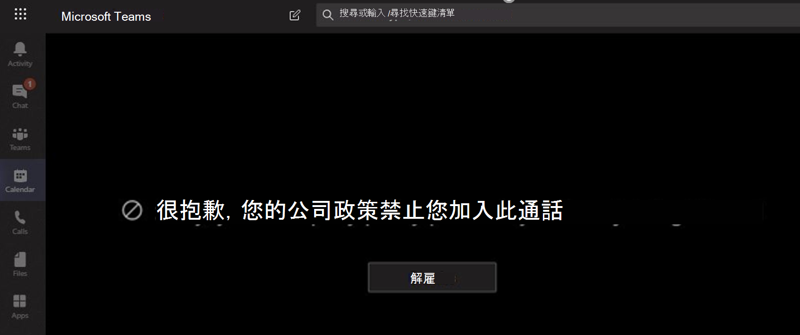

# <a name="information-barriers-in-microsoft-teams"></a>Microsoft Teams 中的資訊障礙

[Microsoft 許可權資訊障礙](/microsoft-365/compliance/information-barriers) (IB) 是系統管理員可以設定的原則，可防止個人或群組彼此通訊。 例如，如果某個部門處理的資訊不應該與其他部門共用，IB 就很有用。 當群組需要隔離或無法與該群組以外的任何人通訊時，IB 也很有用。 Microsoft Teams 中的共用頻道受到資訊障礙的支援。 根據共用類型而定，資訊障礙原則可能會以特定方式限制共用。 如需共用頻道和資訊障礙行為的詳細資訊，請參閱 [資訊障礙和共用頻道](information-barriers-shared-channels.md)。

對於 Microsoft Teams，資訊障礙可以判斷並防止下列類型的未經授權共同作業：

- 將使用者新增至團隊或頻道
- 使用者存取團隊或頻道內容
- 使用者存取 1 對 1 和群組聊天
- 使用者對會議的存取權
- 防止查閱和探索，使用者不會顯示在人員選擇器中。

>[!NOTE]
>- 資訊隔闔群組無法在租使用者之間建立。
>- 使用 Bot、Azure Active Directory (Azure AD) 應用程式、API 傳送活動摘要通知，以及在版本 1 中不支援一些用來新增使用者的 API。
>- 私人頻道符合您設定的資訊障礙原則。
>- 如需連線至 Teams 之 SharePoint 網站障礙的相關資訊，請參閱 [與 Microsoft Teams 網站相關聯的區段](/sharepoint/information-barriers#segments-associated-with-microsoft-teams-sites)。

## <a name="background"></a>背景

IB 的主要驅動程式來自金融服務產業。 財務產業監管局 ([FINRA]( https://www.finra.org)) 檢閱成員公司內的 IB 和興趣衝突，並提供有關在 FINRA 2241 (域 [研究法規注意事項 15-31](https://www.finra.org/sites/default/files/Regulatory-Notice-15-31_0.pdf)管理這類衝突的指導方針。

不過，自推出 IB 以來，許多其他區域發現這些功能很有用。 其他常見案例包括：

- **教育**：一所學校的學生無法查詢其他學校學生的連絡人詳細資料。
- **法律**：維護由一位客戶律師所取得之資料的機密性，並防止由代表不同客戶的同一家公司的律師存取該資料。
- **政府**：資訊存取和控制在部門和群組之間受到限制。
- **專業服務**：公司中的一群人只能在客戶參與期間透過來賓存取與客戶或特定客戶聊天。

例如，Enrico 屬於銀行區段，而 Pradeep 屬於財務顧問區段。 Enrico 和 Pradeep 無法彼此通訊，因為組織的 IB 原則會封鎖這兩個區段之間的通訊和共同作業。 不過，Enrico 和 Pradeep 可以在 HR 中與 Lee 通訊。


## <a name="when-to-use-information-barriers"></a>何時使用資訊障礙

您可能會想要在下列情況中使用 IB：

- 團隊必須無法與特定其他團隊通訊或共用資料。
- 團隊不得與團隊外部的任何人通訊或共用資料。

資訊隔閡原則評估服務會決定通訊是否符合 IB 原則。

## <a name="managing-information-barrier-policies"></a>管理資訊隔隔原則

系統會在 Microsoft Purview 合規性入口網站 (SCC) 中使用 PowerShell Cmdlet 來管理 IB 原則。 如需詳細資訊，請參閱 [定義資訊障礙的原則](/office365/securitycompliance/information-barriers-policies)。

>[!IMPORTANT]
>在設定或定義原則之前，您必須在 Microsoft Teams 中啟用限定範圍的目錄搜尋。 啟用範圍目錄搜尋後，請至少等候幾個小時，然後再設定或定義資訊障礙的原則。 如需詳細資訊，請參閱 [定義資訊隔隔原則](/office365/securitycompliance/information-barriers-policies#prerequisites)。

## <a name="information-barriers-administrator-role"></a>資訊障礙系統管理員角色

IB 合規性管理角色負責管理 IB 原則。 如需此角色的詳細資訊，請參[閱Microsoft Purview 合規性入口網站中的許可權](/office365/securitycompliance/permissions-in-the-security-and-compliance-center)。

## <a name="information-barrier-triggers"></a>資訊隔隔觸發程式

當下列 Teams 事件發生時，會啟用 IB 原則：

- **成員會新增至團隊**：每當您新增使用者至團隊時，必須根據其他小組成員的 IB 原則評估使用者的原則。 成功新增使用者之後，使用者就可以在團隊中執行所有功能，無需進一步檢查。 如果使用者的原則禁止他們新增至團隊，使用者就不會顯示在搜尋中。

    

- **系統會要求新的聊天**：每當使用者要求與其他一或多位使用者進行新聊天時，系統會評估該聊天，以確保該聊天不會違反任何 IB 原則。 如果交談違反 IB 原則，則交談並未開始。

    以下是一對一聊天的範例。

    

    以下是群組聊天的範例。

    

- **系統會邀請使用者加入會議**：當使用者受邀加入會議時，會根據套用至其他小組成員的 IB 原則評估適用于該使用者的 IB 原則。 如果發生違規，將不允許使用者加入會議。

    

- **螢幕會在兩個或多個使用者之間共用**：當使用者與其他使用者共用螢幕時，必須評估共用，以確保不會違反其他使用者的 IB 原則。 如果違反 IB 原則，將不允許螢幕共用。

    以下是套用原則之前螢幕共用的範例。

    

    以下是套用原則後螢幕共用的範例。 看不到螢幕共用和通話圖示。

    

- **使用者在 Teams 中撥打電話**：每當使用者透過 VOIP) 來啟動語音通話 (給其他使用者或使用者群組時，系統會評估通話，以確保通話不會違反其他小組成員的 IB 原則。 如果有任何違規，會封鎖語音通話。

- **Teams 中的來賓**：IB 原則也適用于 Teams 中的來賓。 如果來賓需要在貴組織的全域通訊清單中找到，請參閱[在Microsoft 365 群組中管理來賓存取](/microsoft-365/admin/create-groups/manage-guest-access-in-groups)權。 一旦可以找到來賓，您就可以 [定義 IB 原則](/office365/securitycompliance/information-barriers-policies)。

## <a name="how-policy-changes-impact-existing-chats"></a>原則變更如何影響現有的聊天

當 IB 原則系統管理員變更原則，或因變更使用者設定檔而啟用原則變更 (例如工作變更) 時，資訊障礙原則評估服務會自動搜尋成員，以確保他們在小組中的成員資格不會違反任何原則。

如果使用者之間有現有的聊天或其他通訊，且已設定新原則或變更現有原則，服務會評估現有的通訊，以確保仍然允許進行通訊。 

- **一對一聊天**：如果不再允許兩個使用者之間的通訊 (，因為該原則會封鎖通訊) 的一或兩個使用者使用應用程式，則會封鎖進一步的通訊。 他們現有的聊天交談會變成隻讀。

    以下是顯示聊天的範例。

    

    以下範例顯示聊天已停用。

    

- **群組聊天**：例如，不再允許使用者與群組進行通訊 (例如，使用者) 變更工作，使用者及其參與違反原則的其他使用者可能會從群組聊天中移除，並且不允許與群組進一步通訊。 使用者仍然可以看到舊的交談，但無法看到或參與任何與群組的新交談。 如果新或已變更的原則會禁止通訊套用至一個以上的使用者，則受該原則影響的使用者可能會從群組聊天中移除。 他們仍然可以看到舊的交談。

  在此範例中，Enrico 移至組織內的不同部門，並從群組聊天中移除。

  

  Enrico 無法再傳送訊息到群組聊天。

  

- **團隊**：已從群組移除的任何使用者都會從團隊中移除，並且無法查看或參與現有或新的交談。

## <a name="scenario-a-user-in-an-existing-chat-becomes-blocked"></a>案例：現有聊天中的使用者遭到封鎖

目前，如果 IB 原則封鎖其他使用者，使用者會遇到下列案例：

- 人員索引標籤：使用者無法在 **[人員**]**索引卷** 標上看到封鎖的使用者。

- **人員選擇器**：封鎖的使用者不會顯示在人員選擇器中。

    

- **活動** 索引標籤：如果使用者流覽被封鎖使用者的 [ **活動** ] 索引標籤，就不會顯示任何貼文。  ([ **活動** ] 索引標籤只會顯示頻道貼文，且兩個使用者之間不會有常見的頻道。) 

    以下是已封鎖的活動索引標籤檢視範例。

    ![顯示 [活動] 索引標籤遭到封鎖的螢幕擷取畫面。](media/ib-after-activity-tab-policy.png)

- **組織結構**：如果使用者存取了封鎖使用者出現的組織結構，封鎖的使用者就不會出現在組織結構上。 反之，會顯示錯誤訊息。

- **人員卡** 片：如果使用者參與交談後遭到封鎖，其他使用者會在將游標暫留在封鎖的使用者名稱上時，看到錯誤訊息，而不是人員卡片。 卡片上所列的動作 (例如通話和聊天) 將無法使用。

- **建議的連絡人**：封鎖的使用者不會出現在建議的連絡人清單 (新使用者) 顯示的初始連絡人清單。

- **聊天連絡人**：使用者可以在聊天連絡人清單上看到封鎖的使用者，但系統會識別封鎖的使用者。 使用者對封鎖的使用者執行的唯一動作是刪除他們。 使用者也可以選取他們來檢視他們過去的交談。

- **通話連絡人**：使用者可以在通話連絡人清單上看到封鎖的使用者，但系統會識別封鎖的使用者。 使用者在封鎖使用者上執行的唯一動作是刪除使用者。

    以下是通話連絡人清單中封鎖的使用者範例。

    > [!div class="mx-imgBorder"]
    > 

    以下是通話內容清單中使用者停用聊天的範例。

    > [!div class="mx-imgBorder"]
    > 

- **Skype 移轉到 Teams**：在從商務用 Skype移轉到 Teams 期間，所有使用者，甚至那些受到 IB 原則封鎖的使用者，都會移轉到 Teams。 這些使用者即會依照上述方式處理。

## <a name="teams-policies-and-sharepoint-sites"></a>Teams 原則和 SharePoint 網站

建立團隊時，系統會布建 SharePoint 網站並與 Microsoft Teams 建立關聯，以提供檔案體驗。 此 SharePoint 網站和檔案預設不遵守資訊隔隔原則。 若要在 SharePoint 和 OneDrive 中啟用資訊障礙，請依照使用 [SharePoint 資訊障礙](/sharepoint/information-barriers#enable-sharepoint-and-onedrive-information-barriers-in-your-organization) 一文中的指導方針和步驟進行。

## <a name="information--barrier-modes-and-teams"></a>資訊隔隔模式和 Teams

資訊障礙模式可協助加強可從小組新增或移除的人員。 在 Teams 中使用資訊障礙時，支援下列 IB 模式：

- **開** 啟：此設定是啟用資訊障礙之前布建之所有現有群組的預設 IB 模式。 在此模式中，沒有適用的 IB 原則。
- **隱含**：當在啟用資訊障礙之後布建小組時，此設定是預設的 IB 模式。 隱含模式可讓您在群組中新增所有相容的使用者。
- **擁有者管理**：當您想要允許由擁有者管理的不相容區段使用者之間進行共同作業時，會在小組上設定此模式。 團隊擁有者可以根據其 IB 原則新增成員。

在您的租使用者中啟動資訊隔閡原則之前所建立的團隊，預設會自動設定為 *[開* 啟] 模式。 在租使用者上啟用 IB 原則後，您必須將現有團隊的模式更新為 *隱含* ，以確保現有團隊符合 IB 規範。

使用 [Set-UnifiedGroup](/powershell/module/exchange/set-unifiedgroup) Cmdlet 搭配 *InformationBarrierMode* 參數，該參數對應到您要用於區段的模式。 *InformationBarrierMode* 參數的允許值清單為 *Open*、*Implicit* 和 *Owner Moderated*。

例如，若要設定 Microsoft 365 群組的 *隱含* 模式，您將使用下列 PowerShell 命令：

```powershell
Set-UnifiedGroup -InformationBarrierMode Implicit
```

若要針對所有現有團隊將模式從 [開啟] 更新為 [隱含]，請使用此 [PowerShell 腳本](information-barriers-mode-script.md)。

如果您在現有的 Teams 連線群組上變更 Open 模式設定，以符合貴組織的合規性要求，您將需要針對連線至 Teams 小組的相關聯 SharePoint 網站 [更新 IB 模式](/sharepoint/information-barriers#view-and-manage-ib-modes-as-an-administrator-with-sharepoint-powershell) 。

## <a name="required-licenses-and-permissions"></a>必要的授權和許可權

如需授權與許可權、方案和價格的詳細資訊，請參閱 [Microsoft 365 安全性&合規性授權指導方針](/office365/servicedescriptions/microsoft-365-service-descriptions/microsoft-365-tenantlevel-services-licensing-guidance/microsoft-365-security-compliance-licensing-guidance)。

## <a name="known-issues"></a>已知問題

- **使用者無法加入臨時會議**：如果啟用 IB 原則，如果會議名冊的大小大於會議 [出席限制](limits-specifications-teams.md)，則不允許使用者加入會議。 根本原因在於，IB 檢查取決於使用者是否可以新增至會議聊天名冊，而且只有當他們可以加入名冊時，才能加入會議。 加入會議的使用者一旦將該使用者新增至名冊;，名冊可以快速填滿。 一旦聊天名冊達到 [會議出席限制](limits-specifications-teams.md)，就無法將其他使用者新增至會議。 如果組織已啟用 IB，且會議的聊天名冊已滿，則新使用者 (那些尚未加入名冊) 的使用者不能加入會議。 但如果未為組織啟用 IB，且會議聊天名冊已滿，新使用者 (那些尚未加入名冊) 的使用者可以加入會議，但他們不會在會議中看到聊天選項。 短期解決方案是將非作用中的成員從會議聊天名冊中移除，以便為新使用者釋出空間。 不過，我們會在日後增加會議聊天名冊的大小。
- **使用者無法加入頻道會議**：如果啟用 IB 原則，則使用者若不是團隊成員，則不得加入頻道會議。 根本原因在於，IB 檢查取決於使用者是否可以新增至會議聊天名冊，而且只有當他們可以加入名冊時，才能加入會議。 頻道會議中的聊天討論串僅適用于團隊/頻道成員，且非成員無法查看或存取聊天對話。 如果貴組織已啟用 IB，且非小組成員嘗試加入頻道會議，則不允許該使用者加入會議。 不過，如果貴組織未啟用 IB*，且非小組成員嘗試加入頻道會議，則允許使用者加入會議，但無法在會議中看到聊天選項。
- **組織中允許的區段數目上限**：每個組織在設定 IB 原則時最多可設定 100 個區段。 您可以設定的原則數目沒有限制。
- **IB 原則不適用於同盟使用者**：如果您允許與外部組織建立同盟，這些組織的使用者將不受 IB 原則的限制。 如果貴組織的使用者加入由外部同盟使用者召集的聊天或會議，則 IB 原則也不會限制貴組織使用者之間的通訊。

## <a name="more-information"></a>詳細資訊

- 若要深入瞭解 IBS，請參閱 [資訊障礙](/office365/securitycompliance/information-barriers)。
- 若要設定 IB 原則，請參閱 [開始使用資訊障礙](/office365/securitycompliance/information-barriers-policies)。
- 若要編輯或移除 IB 原則，請參閱 [管理資訊隔隔原則](/microsoft-365/compliance/information-barriers-edit-segments-policies)。
- [資訊障礙和共用通道](information-barriers-shared-channels.md)

## <a name="availability"></a>可用 性

Teams 中的資訊障礙可在我們的公用、GCC、GCC - 高和 DOD 雲中使用。
