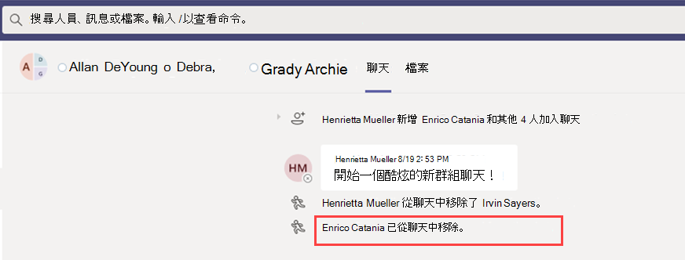

# Microsoft 團隊中的資訊障礙Information barriers in Microsoft Teams

資訊障礙 (IBs) 是系統管理員可以設定以防止個人或群組彼此通訊的原則。Information barriers (IBs) are policies that an admin can configure to prevent individuals or groups from communicating with each other. 例如，如果某個部門處理的資訊不應與其他部門共用，則 IBs 會很有用。IBs are useful if, for example, one department is handling information that shouldn't be shared with other departments. 當群組需要獨立或防止與該群組外的任何人通訊時，IBs 也很有用。IBs are also useful when a group needs to be isolated or prevented from communicating with anyone outside of that group.

> [!NOTE]
> - 無法跨承租人建立 (IB) 群組的資訊屏障。Information barrier (IB) groups cannot be created across tenants.
> - 在版本1中不支援使用機器人、Azure Active Directory (Azure AD) 應用程式，以及部分 Api 來新增使用者。Using bots, Azure Active Directory (Azure AD) apps, and some APIs to add users is not supported in version 1.
> - 專用通道符合您所設定的 IB 原則。Private channels are compliant to IB policies that you configure.
> - 新增：如需有關連線至小組之 SharePoint 網站之障礙支援的相關資訊，請參閱 [與 Microsoft 小組網站相關聯的區段](https://docs.microsoft.com/sharepoint/information-barriers#segments-associated-with-microsoft-teams-sites)。New: For information about support for barriers for SharePoint sites that are connected to Teams, see [Segments associated with Microsoft Teams sites](https://docs.microsoft.com/sharepoint/information-barriers#segments-associated-with-microsoft-teams-sites).

IB 原則也會防止查閱和探索。IB policies also prevent lookups and discovery. 如果您嘗試與您不應該與之通訊的人通訊，您就不會在人員選擇器中找到該使用者。If you attempt to communicate with someone you shouldn't be communicating with, you won't find that user in the people picker.

## 背景Background

IBs 的主要驅動程式來自金融服務行業。The primary driver for IBs comes from the financial services industry. 財務行業監管機構 ([FINRA]( https://www.finra.org)) 審查成員公司內的 IBs 與利益衝突，並提供有關 (FINRA 2241、 [債務調研規範注意事項 15-31](https://www.finra.org/sites/default/files/Regulatory-Notice-15-31_0.pdf)等衝突的指導方針。The Financial Industry Regulatory Authority ([FINRA]( https://www.finra.org)) reviews IBs and conflicts of interest within member firms and provides guidance about managing such conflicts (FINRA 2241, [Debt Research Regulatory Notice 15-31](https://www.finra.org/sites/default/files/Regulatory-Notice-15-31_0.pdf).

不過，既然簡介 IBs，許多其他區域就會發現它們很有用。However, since introducing IBs, many other areas have found them to be useful. 其他常見的案例包括：Other common scenarios include:

- 教育：一學校的學生無法查詢其他學校學生的連絡人詳細資料。Education: Students in one school aren't able to look up contact details for students of other schools.

- 法律：維護一個用戶端律師所取得之資料的機密性，並防止代表不同用戶端的同一個事務所提供給同一個公司的律師存取。Legal: Maintaining the confidentiality of data that is obtained by the lawyer of one client and preventing it from being accessed by a lawyer for the same firm who represents a different client.

- 政府：資訊存取和控制限制在各個部門和群組中。Government: Information access and control are limited across departments and groups.

- 專業服務：公司中的人員群組只能在客戶接洽期間透過來賓存取權與用戶端或特定的客戶交談。Professional services: A group of people in a company is only able to chat with a client or a specific customer via guest access during a customer engagement.

例如，Enrico 屬於 [銀行] 區段，而 Pradeep 屬於 [財務顧問] 區段。For example, Enrico belongs to the Banking segment and Pradeep belongs to the Financial advisor segment. Enrico 和 Pradeep 無法彼此通訊，因為組織的 IB 原則會封鎖這兩個區段之間的通訊與共同作業。Enrico and Pradeep can't communicate with each other because the organization's IB policy blocks communication and collaboration between these two segments. 不過，Enrico 和 Pradeep 可以與 HR 中的 [人力資源] 進行溝通。However, Enrico and Pradeep can communicate with Lee in HR.

## 何時使用資訊障礙When to use information barriers

在下列情況下，您可能會想要使用 IBs：You might want to use IBs in situations like these:

- 小組必須防止與特定其他團隊進行通訊或共用資料。A team must be prevented from communicating or sharing data with a specific other team.
- 小組不能與團隊以外的任何人通訊或共用資料。A team must not communicate or share data with anyone outside of the team.

資訊屏障原則評估服務會判斷通訊是否符合 IB 原則。The Information Barrier Policy Evaluation Service determines whether a communication complies with IB policies.

## 管理資訊屏障原則Managing information barrier policies

IB 原則是在 Microsoft 365 規範中心 (SCC) 使用 PowerShell Cmdlet 來管理。IB policies are managed in the Microsoft 365 Compliance Center (SCC) using PowerShell cmdlets. 如需詳細資訊，請參閱 [定義資訊屏障的原則](https://docs.microsoft.com/office365/securitycompliance/information-barriers-policies)。For more information, see [Define policies for information barriers](https://docs.microsoft.com/office365/securitycompliance/information-barriers-policies).

> [!IMPORTANT]
> 在您設定或定義原則之前，您必須在 Microsoft 團隊中啟用範圍目錄搜尋。Before you set up or define policies, you must enable scoped directory search in Microsoft Teams. 在您設定或定義資訊屏障的原則之前，請先等待至少幾小時後再啟用範圍目錄搜尋。Wait at least a few hours after enabling scoped directory search before you set up or define policies for information barriers. 如需詳細資訊，請參閱 [定義資訊屏障原則](https://docs.microsoft.com/office365/securitycompliance/information-barriers-policies#prerequisites)。For more information, see [Define information barrier policies](https://docs.microsoft.com/office365/securitycompliance/information-barriers-policies#prerequisites).

## 資訊障礙管理員角色Information barriers administrator role

IB 相容性管理角色負責管理 IB 原則。The IB Compliance Management role is responsible for managing IB policies. 如需有關此角色的詳細資訊，請參閱 [Microsoft 365 規範中心中的許可權](https://docs.microsoft.com/office365/securitycompliance/permissions-in-the-security-and-compliance-center)。For more information about this role, see [Permissions in the Microsoft 365 Compliance Center](https://docs.microsoft.com/office365/securitycompliance/permissions-in-the-security-and-compliance-center).

## 資訊屏障觸發程式Information barrier triggers

在下列小組事件發生時，會啟用 IB 原則：IB policies are activated when the following Teams events take place:

- **成員會新增至團隊** -每當您將使用者新增至團隊時，必須針對其他團隊成員的 IB 原則評估使用者的原則。**Members are added to a team** - Whenever you add a user to a team, the user's policy must be evaluated against the IB policies of other team members. 成功新增使用者之後，使用者就可以執行團隊中的所有職能，而不需要進一步檢查。After the user is successfully added, the user can perform all functions in the team without further checks. 如果使用者的原則禁止將他們新增至小組，使用者就不會顯示在 [搜尋] 中。If the user's policy blocks them from being added to the team, the user won't show up in search.

    

- **要求新的聊天** ：每當使用者要求一或多位其他使用者提出新的聊天時，就會評估聊天，以確保它不違反任何 IB 原則。**A new chat is requested** - Each time that a user requests a new chat with one or more other users, the chat is evaluated to make sure that it isn't violating any IB policies. 如果交談違反 IB 原則，就不會啟動交談。If the conversation violates an IB policy, then the conversation isn't started.

    以下是1:1 聊天的範例。Here's an example of a 1:1 chat.

    > [!div class="mx-imgBorder"]
    > 

    以下是群組聊天的範例。Here's an example of a group chat.

    > [!div class="mx-imgBorder"]
    > 

- **使用者受邀加入會議** -當使用者受邀加入會議時，會針對套用到其他團隊成員的 ib 原則評估適用于使用者的 ib 原則。**A user is invited to join a meeting** - When a user is invited to join a meeting, the IB policy that applies to the user is evaluated against the IB policies that apply to the other team members. 如果發生衝突，則不允許使用者加入會議。If there's a violation, the user won't be allowed to join the meeting.

    

- 在 **兩個以上的使用者之間共用螢幕**-當使用者與其他使用者共用螢幕時，必須評估共用，以確保它不會違反其他使用者的 IB 原則。**A screen is shared between two or more users** - When a user shares a screen with other users, the sharing must be evaluated to make sure that it doesn't violate the IB policies of other users. 如果未違反 IB 原則，就不允許使用螢幕共用。If an IB policy is violated, the screen share won't be allowed. 
 
    以下是在套用原則之前的螢幕共用範例。Here's an example of screen share before the policy is applied. 

    > [!div class="mx-imgBorder"]
    > 

    以下是套用原則後的螢幕共用範例。Here's an example of screen share after the policy is applied. 看不到 [畫面共用] 和 [通話] 圖示。The screen share and call icons aren't visible.

    > [!div class="mx-imgBorder"]
    > 

- **使用者在團隊中撥打電話** （無論使用者何時透過 VOIP) 向其他使用者或使用者群組 (啟動語音通話），都會評估通話，確定它不會違反其他團隊成員的 IB 原則。**A user places a phone call in Teams** - Whenever a user initiates a voice call (via VOIP) to another user or group of users, the call is evaluated to make sure that it doesn't violate the IB policies of other team members. 如果有任何侵犯，語音通話會遭到封鎖。If there's any violation, the voice call is blocked.

- **小組** 中的來賓也適用于團隊中的來賓。**Guests in Teams** - IB policies apply to guests in Teams, too. 如果在貴組織的全域通訊清單中需要能發現來賓，請參閱 [管理 Microsoft 365 群組中的來賓存取](https://docs.microsoft.com/microsoft-365/admin/create-groups/manage-guest-access-in-groups)。If guests need to be discoverable in your organization's global address list, see [Manage guest access in Microsoft 365 Groups](https://docs.microsoft.com/microsoft-365/admin/create-groups/manage-guest-access-in-groups). 一旦來賓可被發現，您就可以 [定義 IB 原則](https://docs.microsoft.com/office365/securitycompliance/information-barriers-policies)。Once guests are discoverable, you can [define IB policies](https://docs.microsoft.com/office365/securitycompliance/information-barriers-policies).

## 原則變更對現有聊天有何影響How policy changes impact existing chats

當 IB 原則管理員對原則進行變更，或由於使用者配置 (檔變更而啟動原則變更時（例如針對作業變更) ），資訊屏障原則評估服務會自動搜尋成員，以確保他們在小組中的成員資格不會違反任何原則。When the IB policy administrator makes changes to a policy, or when a policy change is activated because of a change to a user's profile (such as for a job change), the Information Barrier Policy Evaluation Service automatically searches the members to ensure that their membership in the team doesn't violate any policies.

如果使用者之間已有聊天或其他通訊，且已設定新的原則，或是已變更現有的原則，該服務會評估現有的通訊，以確保仍允許進行通訊。If there's an existing chat or other communication between users, and a new policy is set or an existing policy is changed, the service evaluates existing communications to make sure that the communications are still allowed to occur. 

- **1:1 聊天** -如果已不再允許兩個使用者之間的通訊 (，因為應用程式是) 封鎖通訊的原則或兩個使用者，進一步溝通遭到封鎖。**1:1 chat** - If communication between two users is no longer allowed (because of application to one or both users of a policy that blocks communication), further communication is blocked. 其現有的聊天交談會變成隻讀。Their existing chat conversations become read-only. 

    以下是顯示 [聊天] 的範例。Here's an example that shows the chat is visible.

    > [!div class="mx-imgBorder"]
    > ![螢幕擷取畫面顯示 [使用者聊天] 可供使用](media/ib-before-1-1chat-policy.png)

    以下範例顯示 [聊天] 已停用。Here's an example that shows the chat is disabled.

    > [!div class="mx-imgBorder"]
    > 

- **群組聊天** -如果已不再允許來自某個使用者的通訊 (例如，因為使用者變更了作業) 、使用者（以及參與違反原則的其他使用者），都可能會從群組聊天中移除，且不允許與群組進行進一步通訊。**Group chat** - If communication from one user to a group is no longer allowed (for example, because a user changed jobs), the user—along with the other users whose participation violates the policy—may be removed from group chat, and further communication with the group won't be allowed. 使用者仍然可以看到舊的交談，但無法看到或參與與群組的任何新交談。The user can still see old conversations, but won't be able to see or participate in any new conversations with the group. 如果新的或已變更的原則已將通訊套用到多個使用者，則可能會從群組聊天中移除受此原則影響的使用者。If the new or changed policy that prevents communication is applied to more than one user, the users who are affected by the policy may be removed from group chat. 他們仍能看到舊的交談。They can still see old conversations.

  在這個範例中，Enrico 移至組織內的不同部門，並從群組聊天中移除。In this example, Enrico moved to a different department within the organization and is removed from the group chat.

  

  Enrico 無法再傳送訊息到群組聊天。Enrico can no longer send messages to the group chat.

  

- **小組** -已從群組中移除的任何使用者都會從團隊中移除，而且無法查看或參與現有或新的交談。**Team** - Any users who have been removed from the group are removed from the team and won't be able to see or participate in existing or new conversations.

## 案例：現有聊天中的使用者遭到封鎖Scenario: A user in an existing chat becomes blocked

目前，如果 IB 原則封鎖其他使用者，使用者就會遇到下列情況：Currently, users experience the following scenarios if an IB policy blocks another user:

- [**人員]** 索引標籤-使用者看不到 [**人員**] 索引標籤上的封鎖使用者。**People tab** - A user can't see blocked users on the **People** tab.

- **人員選擇器** -在人員選擇器中不會顯示封鎖的使用者。**People Picker** - Blocked users won't be visible in the people picker.

    
    
- [**活動]** 索引標籤-如果使用者要造訪封鎖使用者的 [**活動**] 索引標籤，就不會顯示任何文章。**Activity tab** - If a user visits the **Activity** tab of a blocked user, no posts will appear.  ([ **活動** ] 索引標籤只會顯示頻道發佈，而兩個使用者之間則不會有任何常見頻道。 ) (The **Activity** tab displays channel posts only, and there would be no common channels between the two users.)

    以下是已封鎖之 [活動] 索引標籤視圖的範例。Here's an example of the activity tab view that is blocked.

    > [!div class="mx-imgBorder"]
    > ![顯示已封鎖 [活動] 索引標籤的螢幕擷取畫面](media/ib-after-activity-tab-policy.png)

- **組織** 結構-如果使用者存取的組織結構中出現封鎖的使用者，則封鎖的使用者不會出現在組織結構中。**Org charts** - If a user accesses an org chart on which a blocked user appears, the blocked user won't appear on the org chart. 相反地，會出現錯誤訊息。Instead, an error message will appear.

- **連絡人卡片** -如果使用者參與交談，且稍後遭到封鎖，當使用者將游標暫留在封鎖的使用者名稱上時，其他使用者就會看到錯誤訊息，而不是連絡人卡片。**People card** - If a user participates in a conversation and the user is later blocked, other users will see an error message instead of the people card when they hover over the blocked user's name. 在卡片上所列的動作 (例如通話和聊天) 將無法使用。Actions listed on the card (such as calling and chat) will be unavailable.

- [**建議的連絡人**]：封鎖的使用者不會出現在 [建議的連絡人] 清單中， (為新使用者顯示的初始連絡人清單) 。**Suggested contacts** - Blocked users don't appear on the suggested contacts list (the initial contact list that appears for new users).

- [**聊天連絡人**]-使用者可以在聊天連絡人清單中看到封鎖的使用者，但會辨識封鎖的使用者。**Chat contacts** - A user can see blocked users on the chats contact list, but the blocked users will be identified. 使用者可以在封鎖的使用者上執行的唯一動作就是將它們刪除。The only action that the user can perform on the blocked users is to delete them. 使用者也可以按一下他們來查看其過去的交談。The user can also click on them to view their past conversation.

- [**通話連絡人**]-使用者可以在通話連絡人清單中看到封鎖的使用者，但會辨識封鎖的使用者。**Calls contacts** - A user can see blocked users on the calls contact list, but the blocked users will be identified. 使用者可以在封鎖使用者上執行的唯一動作就是將它們刪除。The only action that the user can perform on the block users is to delete them.

    以下是通話連絡人清單中封鎖使用者的範例。Here's an example of a blocked user in the calls contact list.

    > [!div class="mx-imgBorder"]
    > 

    以下是針對 [通話內容] 清單中的使用者停用聊天的範例。Here's an example of the chat being disabled for a user on the calls content list.

    > [!div class="mx-imgBorder"]
    > 

- **Skype 至團隊遷移** -在從商務用 skype 遷移至團隊期間，所有使用者，甚至是那些被 IB 原則封鎖的使用者，都會遷移至團隊。**Skype to Teams migration** - During a migration from Skype for Business to Teams, all users—even those users who are blocked by IB policies—will be migrated to Teams. 然後按照上述步驟處理這些使用者。Those users are then handled as described above.

## 團隊原則與 SharePoint 網站Teams policies and SharePoint sites

建立小組後，就會建立 SharePoint 網站，並與 Microsoft 團隊取得檔案體驗的相關專案。When a team is created, a SharePoint site is provisioned and associated with Microsoft Teams for the files experience. 每個 IB 原則預設不會在此 SharePoint 網站和檔案上生效。IB policies aren't honored on this SharePoint site and files by default. 若要啟用 IB 原則，系統管理員已填寫表單，要求在 SharePoint 和 OneDrive 上啟用 IB 原則 (請參閱 [資訊壁壘](https://docs.microsoft.com/sharepoint/information-barriers#prerequisites)中的 [*先決條件*] 區段) 。To enable IB policies, the administrator has already filled out a form, requesting that IB policies be enabled on SharePoint and OneDrive (see the *Prerequisites* section in [Information barriers](https://docs.microsoft.com/sharepoint/information-barriers#prerequisites)). 如果在 SharePoint 和 OneDrive 中開啟 IB 原則，則 IB 原則會在建立小組時，在 SharePoint 網站上使用。If the IB policy is turned on in SharePoint and OneDrive, then the IB policies will work on SharePoint sites that are provisioned when a team is created with Microsoft Teams.

**小組 SharePoint 網站上的 IB 原則範例**：在 Contoso 銀行公司中，使用者「Sesha@contosobank.onmicrosoft.com」屬於投資銀行區段，而使用者 ' Nikita@contosobank.onmicrosoft.com ' 屬於建議區段。**Example of IB policies on SharePoint site of a team**: In Contoso Bank corporation, user 'Sesha@contosobank.onmicrosoft.com' belongs to the Investment Banking segment and user 'Nikita@contosobank.onmicrosoft.com' belongs to the Advisory segment. 組織的 IB 原則會封鎖這兩個區段之間的通訊與共同作業。The organization's IB policy blocks communication and collaboration between these two segments.
當使用者 Sesha 為投資銀行區段建立小組時，只有投資銀行使用者才能存取該小組和支援該小組的 SharePoint 網站。When user Sesha creates a team for the Investment Banking segment, the team and the SharePoint site that backs it will be accessible only to Investment Banking users. 即使她擁有 [網站] 連結，使用者 Nikita 還是無法存取該網站。User Nikita can't access that site even if she has the site link.

如需詳細資訊，請參閱 [將資訊障礙運用至 SharePoint](https://docs.microsoft.com/sharepoint/information-barriers#segments-associated-with-microsoft-teams-sites)。For more information, see [Use information barriers with SharePoint](https://docs.microsoft.com/sharepoint/information-barriers#segments-associated-with-microsoft-teams-sites).

## 所需的授權和許可權Required licenses and permissions

如需授權和許可權的詳細資訊（包括方案與定價），請參閱 [Microsoft 365 授權指南以取得安全性 & 合規性](https://docs.microsoft.com/office365/servicedescriptions/microsoft-365-service-descriptions/microsoft-365-tenantlevel-services-licensing-guidance/microsoft-365-security-compliance-licensing-guidance)。For more information on licenses and permissions, including plans and pricing, see [Microsoft 365 licensing guidance for security & compliance](https://docs.microsoft.com/office365/servicedescriptions/microsoft-365-service-descriptions/microsoft-365-tenantlevel-services-licensing-guidance/microsoft-365-security-compliance-licensing-guidance).

## 已知問題Known Issues
- **使用者無法加入即席會議**：如果已啟用 IB 原則，則不允許使用者在會議名單的大小大於 [會議出席限制](limits-specifications-teams.md)的情況下加入會議。**Users can't join ad-hoc meetings**: If IB policies are enabled, users aren't allowed to join meetings if the size of the meeting roster is greater than the [meeting attendance limits](limits-specifications-teams.md). 根本原因是，IB 檢查會依據使用者是否可以新增到會議聊天名單，而且只有在他們可以新增至名單時才允許加入會議。The root cause is that IB checks rely on whether users can be added to a meeting chat roster, and only when they can be added to the roster are they allowed to join the meeting. 只要使用者加入會議，就會將該使用者新增至名單中;因此，對於週期性會議，名單可以快速填入。A user joining a meeting once adds that user to the roster; hence for recurring meetings, the roster can fill up fast. 在聊天名單達到 [會議出席限制](limits-specifications-teams.md)之後，就不允許其他使用者新增至會議。Once the chat roster reaches the [meeting attendance limits](limits-specifications-teams.md), no additional users are allowed to be added to the meeting. 如果已針對租使用者啟用 IB，且聊天的名單已充滿會議，則新的使用者 (不能加入該會議的使用者) 不能加入會議。If IB is enabled for the tenant and the chat roster is full for a meeting, new users (those users who aren't already on the roster) aren't allowed to join the meeting. 但如果沒有為租使用者啟用 IB，且會議聊天的名單已滿，新的使用者 (不在) 名單中的使用者可以加入會議，但在會議中看不到聊天選項。But if IB isn't enabled for the tenant and the meeting chat roster is full, new users (those users who aren't already on the roster) are allowed to join the meeting, though they won't see the chat option in the meeting. 短期解決方案是從會議聊天名單中移除非作用中的成員，為新使用者騰出空間。A short-term solution is to remove inactive members from the meeting chat roster to make space for new users. 不過，我們會在稍後的日期增加會議聊天 rosters 的大小。We will, however, be increasing the size of meeting chat rosters at a later date.

- **使用者無法加入頻道會議**：如果已啟用 IB 原則，則不允許使用者加入頻道會議（如果他們不是團隊的成員）。**Users can't join channel meetings**: If IB policies are enabled, users aren't allowed to join channel meetings if they're not a member of the team. 根本原因是，IB 檢查會依據使用者是否可以新增到會議聊天名單，而且只有在他們可以新增至名單時才允許加入會議。The root cause is that IB checks rely on whether users can be added to a meeting chat roster, and only when they can be added to the roster are they allowed to join the meeting. 頻道會議中的聊天線程只適用于小組/頻道成員，非成員無法看到或存取聊天線程。The chat thread in a channel meeting is available to Team/Channel members only, and non-members can't see or access the chat thread. 如果已為租使用者啟用 IB，且非團隊成員嘗試加入頻道會議，則不允許該使用者加入會議。If IB is enabled for the tenant and a non-team member attempts to join a channel meeting, that user isn't allowed to join the meeting. 不過，如果 _沒有_ 為租使用者啟用 IB，且非小組成員嘗試加入頻道會議，則允許使用者加入會議，但他們在會議中不會看到聊天選項。However, if IB is _not_ enabled for the tenant and a non-team member attempts to join a channel meeting, the user is allowed to join the meeting—but they won't see the chat option in the meeting.

## 詳細資訊More information

- 若要深入瞭解 IBs，請參閱 [資訊障礙](https://docs.microsoft.com/office365/securitycompliance/information-barriers)。To learn more about IBs, see [Information barriers](https://docs.microsoft.com/office365/securitycompliance/information-barriers).

- 若要設定 IB 原則，請參閱 [定義資訊屏障的原則](https://docs.microsoft.com/office365/securitycompliance/information-barriers-policies)。To set up IB policies, see [Define policies for information barriers](https://docs.microsoft.com/office365/securitycompliance/information-barriers-policies).

- 若要編輯或移除 IB 原則，請參閱 [編輯 (或移除) 資訊屏障原則](https://docs.microsoft.com/microsoft-365/compliance/information-barriers-edit-segments-policies)。To edit or remove IB policies, see [Edit (or remove) information barrier policies](https://docs.microsoft.com/microsoft-365/compliance/information-barriers-edit-segments-policies).
