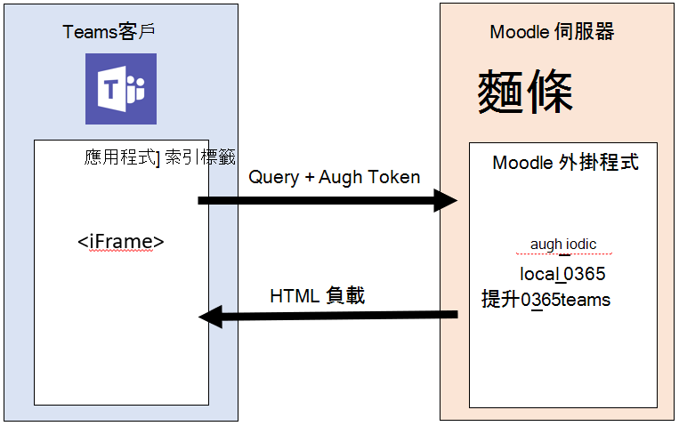

# 安裝 Moodle 整合與 Microsoft 團隊Installing the Moodle integration with Microsoft Teams

> [!VIDEO https://www.youtube.com/embed/OHlPt22nKoE]

[Moodle](https://moodle.org/)是世界上最流行和開放來源學習管理系統（LMS）現已與 Microsoft 團隊整合！[Moodle](https://moodle.org/), the most popular and open-source Learning Management System (LMS) in the world, is now integrated with Microsoft Teams! 此整合可協助教師和教師在 Moodle 課程上共同作業、在團隊內提出有關其成績與作業的問題，並隨時掌握更新通知。This integration helps educators and teachers collaborate around Moodle courses, ask questions about their grades and assignments and stay updated with notifications -- right within Teams!

為了協助 IT 管理員輕鬆地設定此整合，我們已更新我們的開放來源 Office 365 Moodle 外掛程式，並提供下列功能：To help IT admins easily set this integration up, we have updated our open-source Office 365 Moodle Plugin with the following capabilities:

* 使用 Azure AD 自動註冊您的 Moodle 伺服器。Auto-registration of your Moodle server with Azure AD.
* 按一下即可將 Moodle Assistant bot 部署到 Azure。One-click deployment of your Moodle Assistant bot to Azure.
* 自動為團隊自動進行調配，或選取 Moodle 課程的自動同步處理小組註冊。Auto-provisioning of teams and auto-synchronization of team enrollments for all or select Moodle courses.
* 自動將 [Moodle] 索引標籤和 Moodle 助理 bot 安裝至每個同步處理的小組。Auto-installation of the Moodle tab and the Moodle Assistant bot into each synchronized team. （即將推出）(Coming soon)
* 按一下即可將 Moodle 應用程式發佈到您的私人小組 App 存放區。One-click publishing of the Moodle app into your private Teams App Store. （即將推出）(Coming soon)

若要深入瞭解此整合提供的功能，請移至[這裡](https://education.microsoft.com/courses-and-resources/resources/microsoft-teams-moodle)。To learn more about the functionality this integration provides, go [here](https://education.microsoft.com/courses-and-resources/resources/microsoft-teams-moodle).

## 必要條件Prerequisites

若要安裝和設定此應用程式，您需要：In order to install and configure this application you'll need:

1. Moodle 管理員認證Moodle administrator credentials
2. Azure AD 管理員認證Azure AD administrator credentials
3. Azure 訂閱您可以在中建立新資源An Azure subscription you can create new resources in

## 步驟1：安裝 Office 365 Moodle 外掛程式Step 1: Install the Office 365 Moodle Plugin

> [!VIDEO https://www.youtube.com/embed/SETEC5nzMgk]

Microsoft 團隊中的 Moodle 整合是由開放來源[Office 365 Moodle 外掛程式集](https://github.com/Microsoft/o365-moodle)所支援。The Moodle integration in Microsoft Teams is powered by the open source [Office 365 Moodle plugin set](https://github.com/Microsoft/o365-moodle). 若要在您的 Moodle 伺服器中安裝外掛程式：To install the plugin in your Moodle server:

1. 首先，請下載[Office 365 外掛程式集](https://moodle.org/plugins/pluginversions.php?plugin=local_o365)，然後將它儲存到您的本機電腦。First, download the [Office 365 plugin set](https://moodle.org/plugins/pluginversions.php?plugin=local_o365) and save it to your local computer. 您必須使用版本3.5 或更新版本。You'll need to use version 3.5 or newer.
    * 安裝 local_o365 外掛程式也會安裝[auth_oidc](https://moodle.org/plugins/auth_oidc)和[boost_o365Teams](https://moodle.org/plugins/pluginversions.php?plugin=theme_boost_o365teams)外掛程式。Installing the local_o365 plugin will also install the [auth_oidc](https://moodle.org/plugins/auth_oidc) and [boost_o365Teams](https://moodle.org/plugins/pluginversions.php?plugin=theme_boost_o365teams) plugins.
1. 以系統管理員身分登入您的 Moodle 伺服器，然後從左側導覽面板中選取 [**網站管理**]。Login to your Moodle server as an administrator, and select **Site administration** from the left navigation panel.
1. 選取 [**外掛程式**] 索引標籤，然後按一下 [**安裝外掛程式**]。Select the **Plugins** tab, and then click **Install plugins**.
1. 在 [**從 ZIP 檔案安裝外掛程式**] 區段底下，按一下 [**選擇**檔案] 按鈕。Under the **Install plugin from ZIP file** section click the **Choose a file** button.
1. 從左側導覽中選取 [**上傳**檔案] 選項，流覽到上述您下載的檔案，然後按一下 [**上傳此**檔案]。Select the **Upload a file** options from the left navigation, browse for the file you downloaded above and click **Upload this file**.
1. 再次從左側導覽面板中選取 [**網站管理**] 選項，即可返回您的系統管理儀表板。Select the **Site administration** option from the left navigation panel again to return to your admin dashboard. 向下滾動至 [**本機外掛程式**]，然後按一下 [ **Microsoft Office 365 整合**] 連結。Scroll down to the **Local plugins** and click the **Microsoft Office 365 Integration** link. 保持這個設定頁面在其他瀏覽器索引標籤中開啟，因為您將在整個程式的其餘部分中使用它。Keep this configuration page open in a separate browser tab as you'll be using it throughout the rest of this process.

您可以在[Moodle 檔](https://docs.moodle.org/34/en/Installing_plugins)中找到有關如何安裝 Moodle 外掛程式的詳細資訊。You can find more information on how to install Moodle plugins in the [Moodle documentation](https://docs.moodle.org/34/en/Installing_plugins).

**重要注意事項：** 讓 Office 365 Moodle 外掛程式設定頁面在其他瀏覽器索引標籤中開啟，因為您會在整個程式中返回這組頁面。**Important Note:** Keep your Office 365 Moodle Plugin configuration page open in a separate browser tab as you will be returning to this set of pages throughout this process.

*還沒有 Moodle 網站嗎？**Don't have a Moodle site already?* 您可能會想要查看 Azure 存放庫上的 Moodle，讓您可以快速地[在 azure 上](https://github.com/azure/moodle)部署 Moodle 實例，並根據您的需求加以自訂。You might want to check out our Moodle on Azure [repo](https://github.com/azure/moodle) where you can quickly deploy a Moodle instance on Azure and customize it to your needs.

## 步驟2：設定 Office 365 外掛程式與 Azure Active Directory 之間的連線Step 2: Configure the connection between the Office 365 plugin and Azure Active Directory

> [!VIDEO https://www.youtube.com/embed/FpGEezaJ3SA]

接下來，您將需要在您的 Azure Active Directory 中將 Moodle 註冊為應用程式。Next you'll need to register Moodle as an application in your Azure Active Directory. 我們提供 PowerShell 腳本以協助您完成此程式。We've provided a PowerShell script to help you complete this process. PowerShell 腳本會為您的 Office 365 組織提供新的 Azure AD 應用程式，而 Office 365 Moodle 外掛程式會使用此應用程式。The PowerShell Script provisions a new Azure AD application for your Office 365 organization, which will be used by the Office 365 Moodle Plugin. 此腳本將為您的 O365 租使用者提供應用程式，為已設定的應用程式設定所有必要的回復 Url 和許可權，並傳回 AppID 與 Key。The script will provision the app for your O365 tenant, set up all the required Reply URLs and Permissions for the provisioned app and return the AppID and Key. 您可以在 O365 Moodle 外掛程式設定頁面中使用產生的 AppID 和 Key，以使用 Azure AD 設定您的 Moodle 伺服器。You can use the generated AppID and Key in your O365 Moodle Plugin Setup Page to configure your Moodle server with Azure AD. 如果您想要查看 PowerShell 腳本自動化的詳細手動步驟，您可以在外掛程式的完整[檔](https://docs.moodle.org/34/en/Office365#Register_your_Moodle_instance_as_an_Application)中找到這些步驟。If you want to see the detailed manual steps that the PowerShell script is automating, you can find them in the full [documentation for the plugin](https://docs.moodle.org/34/en/Office365#Register_your_Moodle_instance_as_an_Application).

### Microsoft 團隊資訊流程的 [Moodle] 索引標籤Moodle tab for Microsoft Teams information flow

1. 從 [Microsoft Office 365 整合外掛程式] 頁面 slect [**設定**] 索引標籤。From the Microsoft Office 365 Integration plugin page slect the **Setup** tab.
1. 按一下 [**下載 PowerShell 腳本**] 按鈕，並將它儲存到您的本機電腦。Click the **Download PowerShell Script** button and save it to your local computer.
1. 您必須從 ZIP 檔案準備 PowerShell 腳本。You'll need to prepare the PowerShell script from the ZIP file. 若要執行此動作：To do so:
    * 下載並解壓縮`Moodle-AzureAD-Powershell.zip`檔案。Download and extract the `Moodle-AzureAD-Powershell.zip` file.
    * 開啟 [提取的資料夾]。Open the extracted folder.
    * 在檔案上`Moodle-AzureAD-Script.ps1`按一下滑鼠右鍵，然後選取 [**屬性**]。Right-click on the `Moodle-AzureAD-Script.ps1` file and select **Properties**.
    * 在 [屬性] 視窗的 **[一般**] 索引卷`Unblock`標底下，選取底部 [**安全性**] 屬性旁的方塊。Under the **General** tab of the Properties window, check the `Unblock` box next to the **Security** attribute at the bottom.
    * 按一下 [確定]\*\*\*\*。Click **OK**.
    * 複製解壓縮資料夾的目錄路徑。Copy the directory path of the extracted folder.
1. 接下來，您將以系統管理員身分執行 PowerShell：Next you'll run PowerShell as an administrator:
    * 按一下 [開始]。Click Start.
    * 輸入 PowerShell。Type PowerShell.
    * 以滑鼠右鍵按一下 [Windows PowerShell]。Right-click Windows PowerShell.
    * 按一下 [以系統管理員身分執行]。Click "Run as Administrator".
1. 輸入`cd ...\...\Moodle-AzureAD-Powershell`目錄路徑，以流覽至解壓縮`...\...`後的目錄。Navigate to the unzipped directory by typing `cd ...\...\Moodle-AzureAD-Powershell` where `...\...` is the path to the directory.
1. 執行 PowerShell 腳本的方式如下：Execute the PowerShell script by:
    * Enter `Set-ExecutionPolicy -ExecutionPolicy RemoteSigned -Scope CurrentUser`。Enter `Set-ExecutionPolicy -ExecutionPolicy RemoteSigned -Scope CurrentUser`.
    * Enter `.\Moodle-AzureAD-Script.ps1`。Enter `.\Moodle-AzureAD-Script.ps1`.
    * 在快顯視窗中登入您的 O365 系統管理員帳戶。Login to your O365 Administrator account in the pop-up window.
    * 輸入 Azure AD 應用程式的名稱（例如Enter the name of the Azure AD Application (Ex. Moodle/Moodle 外掛程式）。Moodle/Moodle plugin).
    * 輸入您 Moodle 伺服器的 URL。Enter the URL of your Moodle server.
    * 複製腳本產生的**應用程式識別碼**和**應用程式金鑰**並儲存。Copy the **Application ID** and **Application Key** generated by the script and save them.
1. 接下來，您需要將識別碼和金鑰新增至 Office 365 Moodle 外掛程式。Next you'll need to add the Id and Key to the Office 365 Moodle Plugin. 回到 [外掛程式管理] 頁面（網站管理 > 外掛程式 > Microsoft Office 365 整合）。Return to the plugin administration page (Site administration > Plugins > Microsoft Office 365 Integration).
1. 在 [**設定**] 索引標籤上，新增您先前複製的**應用程式識別碼**和**應用程式金鑰**，然後按一下 [**儲存變更**]。On the **Setup** tab add the **Application Id** and **Application Key** you copied previously, then click **Save changes**.
1. 在頁面重新整理之後，您現在應該會看到一個新區段，**選擇 [連接方法**]。Once the page refreshes you should now see a new section **Choose connection method**. 按一下標示為 [**預設**] 的核取方塊，然後再次按一下 [**儲存變更**]。Click the checkbox labeled **Default** and then click **Save changes** again.
1. 在頁面重新整理之後，您會看到另一個新的「管理員同意」一節， **& 其他資訊**。Once the page refreshes you will see another new section **Admin consent & additional information**.
    * 按一下 [**提供管理員同意**] 連結，輸入您的 Office3 365 全域系統管理員認證，然後**接受**以授與許可權。Click the **Provide Admin Consent** link, enter your Office3 365 Global Administrator credentials, then **Accept** to grant the permissions.
    * 按一下 [ **AZURE AD 租**使用者] 欄位旁**的 [偵測] 按鈕。**Next to the **Azure AD Tenant** field click the **Detect** button.
    * 在商務用**ONEDRIVE URL**旁邊，按一下 [偵測 **] 按鈕。**Next to the **OneDrive for Business URL** click the **Detect** button.
    * 填寫完欄位之後，再按一下 [**儲存變更**] 按鈕。Once the fields populate, click the **Save changes** button again.
1. 按一下 [**更新**] 按鈕以驗證安裝，然後再按 [**儲存變更**]。Click the **Update** button to verify the installation, then **Save changes**.
1. 接下來，您將需要在 Moodle 伺服器與 Azure Active Directory 之間同步處理使用者。Next you'll need to synchronize users between your Moodle server and Azure Active Directory. 視您的環境而定，您可能會在此階段選取不同的選項。Depending on your environment, you may select different options during this stage. 請注意，您在這裡設定的設定將會與每個 Moodle cron 執行（通常是一天一次）一起執行，以保持所有同步處理。若要開始使用：Note that the configuration you set here will run with each Moodle cron run (typically once a day) to keep everything in sync. To get started:
    * 切換到 [**同步處理設定]** 索引標籤Switch to the **Sync Settings tab**
    * 在 [**與 AZURE AD 同步處理使用者**] 區段中，選取適用于您的環境的核取方塊。In the **Sync users with Azure AD** section, select the checkboxes that apply to your environment. 您通常會選取至少：Typically you would select at least:
        * 在 Moodle 中為 Azure AD 中的使用者建立帳戶Create accounts in Moodle for users in Azure AD
        * 針對 Azure AD 中的使用者更新 Moodle 中的所有帳戶Update all accounts in Moodle for users in Azure AD
    * 在 [**使用者建立限制**] 區段中，您可以設定篩選來限制將同步處理到 Moodle 的 Azure AD 使用者。In the **User Creation Restriction** section you can setup a filter to limit the Azure AD users that will by synced to Moodle.
    * [**使用者欄位對應**] 區段可讓您自訂 Azure AD 以 Moodle 使用者設定檔欄位對應。The **User Field Mapping** section will allow you to customize the Azure AD to Moodle User Profile field mapping.
    * 在 [**團隊同步**處理] 區段中，您可以選擇在現有的 Moodle 課程中自動建立群組（亦即小組）。In the **Teams Sync** section you can choose to automatically create Groups (i.e. Teams) for some, or all, of your existing Moodle courses.
1. 若要驗證 cron 作業（並在您想要在第一次執行時手動執行），請按一下 [**同步處理使用者與 AZURE AD** ] 區段中的 [**排程任務管理] 頁面**連結。To validate the cron jobs (and run them manually if you wish to for the first run) click the **Scheduled tasks management page** link in the **Sync users with Azure AD** section. 這會將您帶到 [**排程的任務**] 頁面。This will take you to the **Scheduled Tasks** page.
    * 向下滾動並找出 [**與 AZURE AD 作業同步處理使用者**]，然後按一下 [**立即執行**]。Scroll down and find the job **Sync users with Azure AD** job and click **Run now**.
    * 如果您選擇根據現有課程建立群組，您也可以在**Office 365 工作中執行 [建立使用者] 群組**。If you chose to create Groups based on existing courses, you can also run the **Create user groups in Office 365** job.
1. 回到外掛程式管理頁面（網站管理 > 外掛程式 > Microsoft Office 365 整合），然後選取 [**團隊設定**] 頁面。Return to the plugin administration page (Site administration > Plugins > Microsoft Office 365 Integration) and select the **Teams Settings** page. 您必須設定一些安全性設定，才能啟用團隊 app 整合。You'll need to configure some security settings to enable the Teams app integration.
    * 若要啟用 OpenID Connect，請按一下 [**管理驗證**] 連結，然後在**OpenID 連接**線上按一下 [眼睛] 圖示（如果它是灰色的）。To enable OpenID Connect, click the **Manage Authentication** link, and click the eye icon on the **OpenId Connect** line if it is greyed out.
    * 接下來，您將需要啟用框架內嵌。Next you'll need to enable frame embedding. 按一下 [ **HTTP 安全性**] 連結，然後按一下 [**允許框架嵌入**] 旁的核取方塊。Click the **HTTP Security** link, then click the checkbox next to **Allow frame embedding**.
    * 下一步是啟用可啟用 Moodle API 功能的 web 服務。The next step is to enable web services which will enable the Moodle API features. 按一下 [**高級功能**] 連結，然後確認已核取 [**啟用 web 服務**] 旁的核取方塊。Click the **Advanced Features** link, then make sure the checkbox next to **Enable web services** is checked.
    * 最後，您必須啟用 Office 365 的外部服務。Finally you'll need to enabled the external services for Office 365. 按一下 [**外部服務**] 連結，然後：Click the **External services** link then:
        * 按一下 [ **Moodle Office 365 Webservices** ] 列上的 [**編輯**]。Click **Edit** on the **Moodle Office 365 Webservices** row.
        * 標示為 [**啟用**] 旁的核取方塊，然後按一下 [**儲存變更**]。Mark the checkbox next to **Enabled**, then click **Save Changes**
    * 接下來，您將需要編輯已驗證的使用者許可權，才能允許他們建立 web 服務權杖。Next you'll need to edit your authenticated user permissions to allow them to create web service tokens. 按一下**編輯角色的 [已驗證使用者**] 連結。Click the **Editing role 'Authenticated user'** link. 向下滾動並找出 [**建立 web 服務標記**] 功能並標示 [**允許**] 核取方塊。Scroll down and find the **Create a web service token** capability and mark the **Allow** checkbox.

## 步驟3：將 Moodle Assistant Bot 部署到 AzureStep 3: Deploy the Moodle Assistant Bot to Azure

> [!VIDEO https://www.youtube.com/embed/gbkJxf8FlfY]

Microsoft 團隊的免費 Moodle 小幫手 Bot 可協助教師與學生在 Moodle 中回答其課程、作業、成績及其他資訊的相關問題。The free Moodle Assistant Bot for Microsoft Teams helps teachers and students answer questions about their courses, assignments, grades and other information in Moodle. Bot 也會在小組中傳送 Moodle 通知給學生和教師。The bot also sends Moodle notifications to students and teachers right within Teams. 此 bot 是由 Microsoft 所維護，且[可在 GitHub 上](https://github.com/microsoft/Moodle-Teams-Bot)取得的開放來源專案。This bot is an open source project maintained by Microsoft, and is [available on GitHub](https://github.com/microsoft/Moodle-Teams-Bot).

> [!NOTE]
> 在此區段中，您會將資源部署至 Azure 訂閱，所有資源都將使用**免費**的層級進行設定。In this section you will deploy resources to your Azure subscription, and all resources will be configured using the **free** tier. 視您的 bot 使用方式而定，您可能需要縮放這些資源。Depending on the usage of your bot, you may need to scale these resources.
> 如果您只想使用 [Moodle] 索引標籤而不使用 bot，請跳至[步驟 4](#step-4-deploy-your-microsoft-teams-app)。If you want to just use the Moodle tab without the bot, skip to [step 4](#step-4-deploy-your-microsoft-teams-app).

### Moodle bot 資訊流程Moodle bot information flow

若要安裝 bot，您必須先在[Microsoft 身分識別平臺](https://identity.microsoft.com/Landing)上註冊。To install the bot, you'll first need to register it on the [Microsoft Identity Platform](https://identity.microsoft.com/Landing). 這可讓您的 Bot 針對您的 Microsoft 端點進行驗證。This allows your Bot to authenticate against your Microsoft endpoints. 若要註冊您的 bot：To register your bot:

1. 回到外掛程式管理頁面（網站管理 > 外掛程式 > Microsoft Office 365 整合），然後選取 [**團隊設定**] 索引標籤。Return to the plugin administration page (Site administration > Plugins > Microsoft Office 365 Integration) and select the **Teams Settings** tab.
1. 按一下 [ **Microsoft 應用程式註冊入口網站**] 連結，然後使用您的 Microsoft Id 登入。Click the **Microsoft Application Registration Portal** link and login with your Microsoft Id.
1. 輸入您 app 的名稱（例如Enter a name for you app (Eg. MoodleBot），然後按一下 [**建立**] 按鈕。MoodleBot) and click the **Create** button.
1. 複製**應用程式識別碼**，並將它貼到 [**團隊設定**] 頁面上的 [ **Bot 應用程式識別碼**] 欄位。Copy the **Application Id** and paste it into the **Bot Application ID** field on the **Team Settings** page.
1. 按一下 [**產生新密碼**] 按鈕。Click the **Generate New Password** button. 複製產生的密碼，並將它貼到 [**小組設定**] 頁面上的 [ **Bot 應用程式密碼**] 欄位。Copy the generated password and and paste it into the **Bot Application Password** field on the **Team Settings** page.
1. 滾動至表單底部，然後按一下 [**儲存變更**]。Scroll to the bottom of the form and click **Save Changes**.

現在您已經產生您的應用程式識別碼和密碼，就可以開始將您的機器人部署到 Azure 了。Now that you've generated your Application Id and Password, it's time to deploy your bot to Azure. 按一下 [**部署到 Azure** ] 按鈕，然後使用必要資訊（Bot 應用程式識別碼、Bot 應用程式密碼及 Moodle 密碼）填寫表單，並在 **[** **設定**] 頁面上輸入 Azure 資訊。Click on the **Deploy to Azure** button and fill out the form with the necessary information (the Bot Application Id, Bot Application Password and the Moodle Secret are on the **Team Settings** page, and the Azure information is on the **Setup** page). 填寫完表單後，請按一下核取方塊以接受條款與條件，然後按一下 [**購買**] 按鈕（所有 Azure 資源都會部署至免費層）。Once you've got the form filled out, click the check box to agree to the terms and conditions then click the **Purchase** button (all Azure resources are deployed to the free tier).

完成資源部署至 Azure 之後，您必須使用它的訊息端點來設定 Office 365 Moodle 外掛程式。Once the resources are finished deploying to Azure, you'll need to configure the Office 365 Moodle plugin with it's messaging endpoint. 首先，您必須從 Azure 中的 Bot 取得端點。First, you'll need to get the endpoint from you Bot in Azure. 若要執行此動作：To do that:

1. 如果您還沒有，請登入[Azure 入口網站](https://portal.azure.com)。If you aren't already, log into the [Azure portal](https://portal.azure.com).
2. 在左窗格中，選取 [**資源群組**]。In the left pane select **Resource groups**.
3. 從清單中選取您剛剛使用（或建立）的資源群組（在部署 Bot 時）。From the list select the resource group you just used (or created) while deploying your Bot.
4. 從群組資源清單中選取 [ **WebApp Bot** ] 資源。Select the **WebApp Bot** resource from the list of resources in the group.
5. 從 **[概覽**] 區段複製**訊息端點**。Copy the **Messaging Endpoint** from the **Overview** section.
6. 在 Moodle 中，開啟 Office 365 Moodle 外掛程式的 [**團隊設定**] 頁面。In Moodle, open the **Team Settings** page of your Office 365 Moodle Plugin.
7. 在**Bot [端點**] 欄位中，貼上您剛剛複製的 URL，並將 [*訊息*] 變更為 [ *webhook*]。In the **Bot Endpoint** field paste the URL you just copied and change the word *messages* to *webhook*. URL 現在看起來像這樣`https://botname.azurewebsites.net/api/webhook`The URL should now look like `https://botname.azurewebsites.net/api/webhook`
8. 按一下 [**儲存變更**]Click **Save Changes**
9. 儲存變更之後，請回到 [**團隊設定**] 索引標籤上，按一下 [**下載資訊清單**檔案] 按鈕，並將資訊清單套件儲存至您的電腦（您將在下一節中使用它）。Once your changes have saved, go back to the **Team Settings** tab, click the **Download manifest file** button and save the manifest package to your computer (you'll use it in the next section).

## 步驟4：部署您的 Microsoft 團隊應用程式Step 4: Deploy your Microsoft Teams app

> [!VIDEO https://www.youtube.com/embed/2rMb7gtM_ZM]

現在您已將 Bot 部署至 Azure，並將其設定為與您的 Moodle 伺服器進行交談，那就是部署 Microsoft 團隊 app 的時候了。Now that you have your Bot deployed to Azure and configured to talk to your Moodle server, it's time to deploy your Microsoft Teams app. 若要這樣做，您將會載入您從上一個步驟的 [Office 365 Moodle 外掛程式小組設定] 頁面下載的資訊清單檔案。To do this you'll load the manifest file you downloaded from the Office 365 Moodle Plugin Team Settings page in the previous step.

您必須先確認已啟用應用程式的外部 app 和側載，才能安裝應用程式。Before you can install the app you'll need to make sure external apps and sideloading of apps is enabled. 若要這樣做，您可以依照下列[步驟](https://docs.microsoft.com/MicrosoftTeams/admin-settings)進行。To do so you can follow [these steps](https://docs.microsoft.com/MicrosoftTeams/admin-settings). 確認已啟用外部應用程式後，您可以遵循下列步驟來部署您的應用程式。Once you've ensured that external apps are enabled, you can follow the steps below to deploy your app.

1. 開啟 Microsoft 團隊。Open Microsoft Teams.
2. 按一下導覽列左下角的 [**商店**] 圖示。Click the **Store** icon on the lower-left of the navigation bar.
3. 從選項清單中按一下 [**上傳自訂應用程式**] 連結。Click the **Upload a custom app** link from the list of options. *注意：* 如果您是以全域管理員身分登入，您可以選擇將應用程式上傳到貴組織的 app store，否則您將只能針對您所屬的團隊載入應用程式（"側載"）。*Note:* If you're logged in as a global administer you'll have the option of uploading the app to your organization's app store, otherwise you'll only be able to load the app for Teams you're a part of ("sideloading").
4. 選取您`manifest.zip`先前下載的套件，然後按一下 [**儲存**]。Select the `manifest.zip` package you downloaded previously and click **Save**. 如果您尚未下載資訊清單套件，您可以從 Moodle 中的 [外掛程式設定] 頁面的 [**團隊設定**] 索引標籤執行此操作。If you haven't yet downloaded the manifest package, you can do so from the **Team Settings** tab of the plugin configuration page in Moodle.

現在您已安裝應用程式，您可以將索引標籤新增至您有權存取的任何頻道。Now that you have the app installed you can add the tab to any channel that you have access to. 若要執行此動作，請流覽至頻道**+** ，按一下符號，然後從清單中選取您的 app。To do so navigate to the channel, click the **+** symbol and select your app from the list. 依照提示完成將您的 [Moodle 課程] 索引標籤新增至頻道。Follow the prompts to finish adding your Moodle course tab to a channel.

就是這樣！That's it! 您和您的小組現在可以直接從 Microsoft 團隊開始使用您的 Moodle 課程。You and your team, can now start working with your Moodle courses directly from Microsoft Teams.

若要與我們共用任何功能要求或意見反應，請造訪我們的[使用者語音頁面](https://microsoftteams.uservoice.com/forums/916759-moodle)。To share any feature requests or feedback with us, please visit our [User Voice page](https://microsoftteams.uservoice.com/forums/916759-moodle).