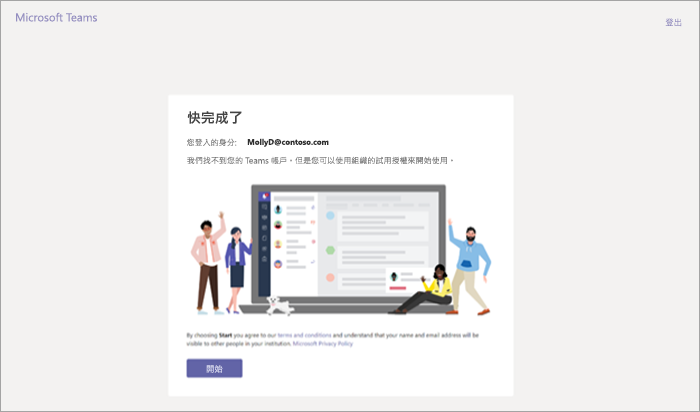

管理 Microsoft Teams 商業雲端試用版方案
=======================================================

Microsoft Teams 商業雲端試用版提供貴組織中未取得 Microsoft Teams 授權的現有 Office 365 使用者，可以起始產品的 1 年試用版。 系統管理員可以為其組織中的使用者開啟或關閉這項功能。

> [!IMPORTANT]
> Microsoft Teams Exploratory 將於 2020 年 1 月取代 Microsoft Teams 商業雲端試用版。 若要了解此新方案，請參閱[管理 Manage Teams Exploratory 授權](teams-exploratory.md)。

## 方案中的內容

此方案中包含的服務方案為：

- Exchange Foundation
- 適用於 Office 365 方案 1 的 Flow
- Forms
- Microsoft Planner
- Microsoft Teams (Teams1、Teams IW)
- Office 
- 適用於 Office 365 方案 1 的 PowerApps
- SharePoint Online Kiosk
- Stream
- Sway
- Whiteboard
- Yammer Enterprise 

試用版會為您的整個組織授與一年試用版訂閱。 針對每個獲指派的授權，試用版會配置 2 GB 的 SharePoint Online 儲存空間。 

## 符合資格的對象

必須啟用使用者，才能註冊取得應用程式和試用版 (在 Microsoft 365 系統管理中心)。 如需詳細資訊，請參閱本文稍後的[管理試用版](#manage-the-trial)。 

沒有包含 Teams 的 Office 365 授權的使用者，可以起始 Microsoft Teams 商業雲端試用版方案。 例如，如果某個使用者有 Office 365 商務版 (其不包含 Teams)，使用者就符合試用版的資格。

## 不符合資格的對象

如果您是聯合供稿合作夥伴客戶，或您是 GCC、GCC、DoD 或 EDU 客戶，則貴組織不符合試用版的資格。

如果您的組織不符合 Microsoft Teams 商業雲端試用方案的資格，您將不會看到 [讓使用者安裝試用版的應用程式與服務]**** 開關。

## 使用者註冊取得試用版的方式

合格的使用者可以透過登入 Teams ([teams.microsoft.com](https://teams.microsoft.com)) 來註冊取得試用方案。 他們會看到下列畫面來開始試用版。 

貴組織內的所有試用版會有相同的開始和結束日期，即第一個使用者註冊取得試用版的日期。 例如，如果使用者 A 在 2019 年 1 月 25 日開始第一個試用版，而使用者 B 在 2019 年 6 月 3 日啟動試用版，則這兩個使用者的試用版都將於 2020 年 1 月 25 日到期。

## 管理試用版

Teams 試用版旨在由個別使用者起始，因此您可能無法代表使用者員工起始 Teams 試用版。

系統管理員可以將使用者在其組織中要求試用版應用程式和服務的功能停用。 目前，本文所述的試用版是此類別的唯一試用版，但在未來可能適用其他類似程式。 

### 防止使用者安裝試用版應用程式和服務

您可以關閉使用者安裝試用版應用程式和服務的功能。

1. 從 [Microsoft 365 系統管理中心]，移至 [設定]****  >  [設定]****、選取 [服務]****，然後選取 [使用者所擁有的應用程式與服務]****。

    ![系統管理中心的 [服務] 頁面的螢幕擷取畫面](media/iw-trial-services.png)

2. 取消選取 [讓使用者安裝試用版的應用程式與服務]**** 核取方塊。

    ![系統管理中心的 [使用者所擁有的應用程式與服務] 頁面的螢幕擷取畫面](media/iw-trial-user-owned-apps-services.png)

### 管理使用的授權包括 Teams 的使用者的試用版可用性

已獲指派包括 Teams 授權的使用者不是試用版的適用對象。 啟用 Teams 服務方案後，使用者就可以登入並使用 Teams。 如果服務方案已停用，則使用者無法登入，且不會對使用者顯示試用版選項。

若要關閉對 Teams 的存取：

1. 在 Microsoft 365 系統管理中心，選取 [使用者]****  >  [作用中的使用者]****。

2. 選取使用者名稱旁的方塊。

3. 在右側的 [產品授權]**** 列中，選擇 [編輯]****。

4. 在 [產品授權]**** 窗格中，將開關切換至 [關閉]****。

    ![系統管理中心的 [產品授權] 頁面的螢幕擷取畫面。](media/iw-trial-enable-3.png)

### 管理已要求試用版之使用者的 Teams 可用性

如果使用者已要求 Teams 試用版授權，您可以透過移除授權或服務方案來加以移除。

若要關閉試用版授權：

1. 在 Microsoft 365 系統管理中心，選取 [使用者]****  >  [作用中的使用者]****。

2. 選取使用者名稱旁的方塊。

3. 在右側的 [產品授權]**** 列中，選擇 [編輯]****。

4. 在 [產品授權]**** 窗格中，將開關切換至 [關閉]****。

    
    
    >[!Note]
    >在組織中的第一個使用者註冊取得試用後，Microsoft Teams 試用切換開關將會出現。

### 管理擁有試用版授權之使用者的 Teams

您可以管理擁有試用版授權的使用者，就像您管理擁有一般付費授權的使用者一般。 如需詳細資訊，請參閱[管理組織的 Microsoft Teams 設定](enable-features-office-365.md)。

### 從試用版授權升級使用者

若要從試用版授權升級使用者，請執行下列動作：

1. 購買包括 Teams 的訂閱。

2. 從使用者移除 Teams 試用版訂閱。

3. 指派新購買的授權。

如需詳細資訊，請參閱 [Microsoft Teams 的 Office 365 授權](Office-365-licensing.md)。

> [!NOTE]
> 如果試用版結束，且使用者未立即升級為包含 Teams 的訂閱，則不會移除使用者資料。 使用者仍然存在於 Azure Active Directory 中，且 Teams 內的所有資料仍會保留。 一旦將新授權指派給使用者以再次啟用 Teams 功能，所有內容仍會存在。 

### 移除舊版 Microsoft Teams 試用版授權

自 2019 年 4 月 22 日起，使用者可以開始要求最新的 Microsoft Teams 商業雲端試用版授權。 如果您想要將組織中的使用者移出舊版試用版授權並採用最新的試用版授權，必須先移除每位使用者的舊版 Microsoft Teams 試用版授權。 移除舊版授權之後，每個受影響的使用者都可要求更新的 Microsoft Teams 商業雲端試用版授權。

- 如果您想要透過 PowerShell 移除此授權，請參閱：[使用 Office 365 PowerShell 從使用者帳戶移除授權](https://docs.microsoft.com/office365/enterprise/powershell/remove-licenses-from-user-accounts-with-office-365-powershell)

- 如果您想要透過系統管理入口網站移除此授權，請參閱：[在商務用 Office 365 中移除使用者的授權](https://docs.microsoft.com/office365/admin/subscriptions-and-billing/remove-licenses-from-users?view=o365-worldwide)
