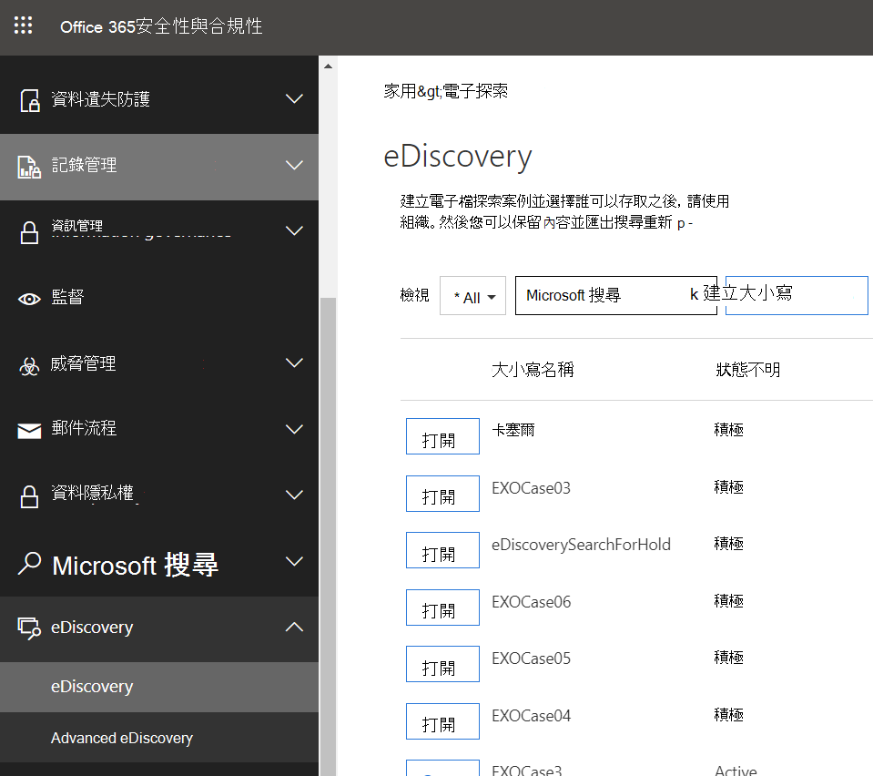
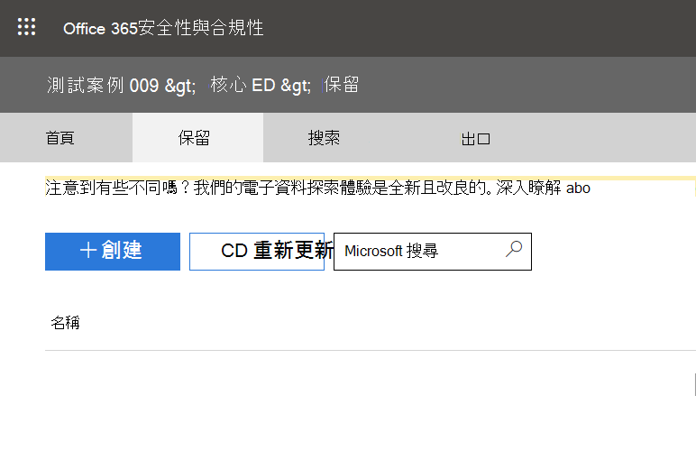
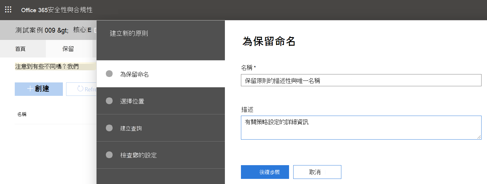
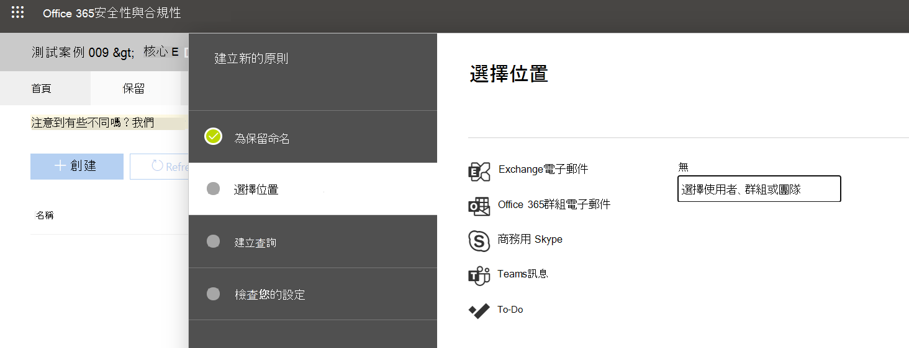

# 保留Microsoft Teams或小組

當有合理的訴訟預期存在時，組織必須保留以電子方式儲存的資訊 (ESI) ，包括 Teams 與案件相關的聊天訊息。 組織可能需要保留與特定主題或特定人員相關的所有郵件。 本文將涵蓋在 Microsoft Teams。 若要保留所有Microsoft 365，請參閱[建立電子檔探索保留](/microsoft-365/compliance/create-ediscovery-holds)。

> [!NOTE]
> 我們在 2020 年 2 月開啟私人頻道的法律保留。 私人頻道聊天會儲存在使用者信箱中，而一般頻道聊天則儲存在Teams群組信箱中。 如果使用者信箱已有法律保留，保留原則現在會自動適用于儲存在該信箱中的私人通道郵件。 系統管理員無需執行其他動作來開啟此功能。 也支援合法保留在私人頻道中共用的檔案。

在Microsoft Teams，整個團隊或選取的使用者都可以被保留。 這麼做會確保組織合規性管理員或系統管理員 (包括私人頻道) 或由這些人員交換的郵件等所有已交換Teams訊息。

> [!NOTE]
> 將使用者置於保留狀態不會自動將群組置於保留狀態，反之亦然。
> 無法保留以活動提要中送出的通知。

若要將使用者或小組置於核心電子檔探索案例的保留狀態：

1. 請[前往](https://compliance.microsoft.com)Microsoft 365 合規性中心。 當您建立新案例時，系統會提供將信箱或網站置於保留狀態的選項。

2. 按一下建立案例，前往 **eDiscovery**  >  **Core** 並 **建立案例**。 建立案例之後，請開啟它。
  
   

   > [!NOTE]
   > 您也可以將使用者放在與案例相關聯的保留Advanced eDiscovery狀態。 詳細資訊，請參閱在 中[管理保留Advanced eDiscovery。](/microsoft-365/compliance/managing-holds)

3. 請前往頂端 **功能表** 上的 [保留資料表>，然後按一下 [ **建立** 以建立保留狀態。 將使用者或小組置於保留狀態會保留這些使用者或郵件交換的所有郵件。 當您建立新案例時，系統會提供將信箱或網站置於保留狀態的選項。

   
    
    1. **為保留命名**。 針對要建立保留狀態，選取描述性且唯一的名稱。
  
       

    1. **選擇位置**。 選擇是否要將保留狀態用於使用者或整個小組， (目前無法將保留) 。 注意：如果使用者保持保留狀態，其所有訊息都會保留，包括他們在 1：1 聊天、1：多或群組聊天中所送出的任何訊息，或頻道交談 (包括私人頻道) 。
    

    2. **建立查詢**。 如果您想要保留原則的更精細度，您可以自訂保留。 例如，您可以指定要尋找的關鍵字，或者您可以新增更多條件，讓保留生效時必須滿足這些條件。
    
    3. **建立保留之前，** 先檢查您的設定。

建立法律保留之後，您可以搜尋任何保留政策所保留的內容。 詳細資訊，請參閱在 Teams[中執行電子資料探索Teams。](eDiscovery-investigation.md)

> [!IMPORTANT]
> 當使用者或群組處於保留狀態時，所有郵件複本都會保留。 例如，如果使用者在頻道中張貼郵件，然後修改郵件，在保留情況下，郵件的兩份複本會保留。 若未就地保留法律，只會保留最新的郵件。

## 保留保留內容的位置，以保留Teams內容

做為實用指南，您可以使用下表瞭解哪些內容位置 (例如信箱或網站) 可置於法律保留狀態，以保留不同類型的Teams內容。

|案例  |內容位置  |
|---------|---------|
|Teams使用者聊天 (例如 1：1 聊天、1：N 群組聊天，以及私人頻道交談)      |使用者信箱。         |
|Teams頻道聊天 (不含私人頻道)     |小組使用的群組信箱。         |
|Teams檔案內容 (例如 Wiki 內容和檔案)      |SharePoint小組使用的網站。         |
|Teams私人頻道檔案     |私人SharePoint私人網路站。     |
|使用者的私人內容     |使用者的帳戶商務用 OneDrive帳戶。         |
|聊天中的卡片內容|用於 1：1 聊天、1：N 群組聊天，以及頻道訊息中卡片內容的私人頻道交談或群組信箱的使用者信箱。 若要詳細資訊，請參閱建立電子檔探索保留中的「保留卡片 [內容」一節](/microsoft-365/compliance/create-ediscovery-holds#preserve-card-content)。|

> [!NOTE]
> 若要保留私人頻道中的通訊，您必須保留使用者信箱 ( 私人通道使用者) ，而使用 eDiscovery 工具來搜尋時，您應該在該使用者的信箱中搜尋。 如先前所述，私人頻道聊天會儲存在使用者信箱中，而不是儲存在小組的群組信箱中。

如果您想要進一步閱讀本主題中的非Teams區域，Microsoft 365管理[電子檔探索案例：](/microsoft-365/compliance/ediscovery-cases#step-4-place-content-locations-on-hold)保留內容位置。
