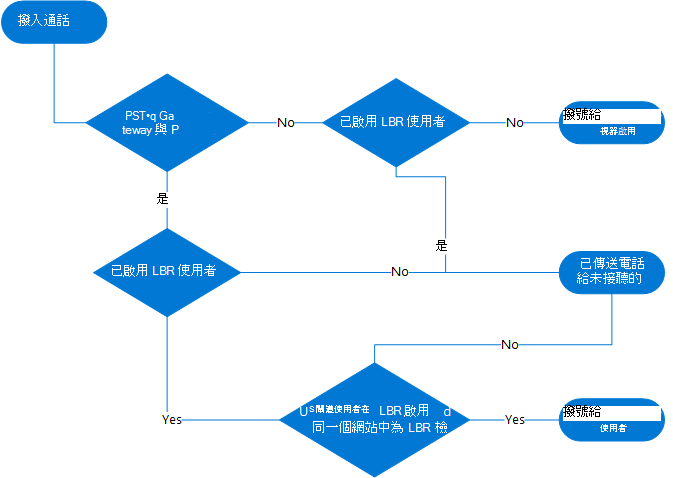
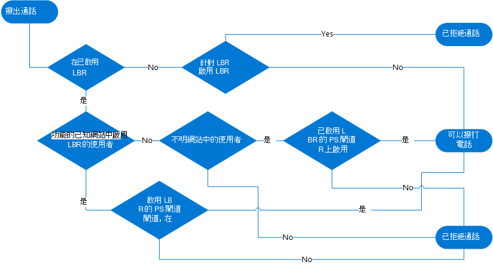

# 規劃直接路由的依位置路由

在某些國家與地區，略過公用交換電話網路 (PSTN) 提供者降低長途電話成本是不正確的。 

本文將說明您需要瞭解的事項，以根據 Microsoft Teams 使用者的地理位置，使用Location-Based路由限制 Microsoft Teams 使用者的付費略過。 本文僅適用于直接路由。 Location-Based路由不適用於通話方案或運算子連線。

當您準備好啟用Location-Based路由時，請參閱：

- [設定依位置路由的網路設定](location-based-routing-configure-network-settings.md)
- [部署Location-Based路由的網路設定](location-based-routing-configure-network-settings.md)
- [啟用直接路由的依位置路由](location-based-routing-enable.md)

> [!NOTE]
> 您不應該使用Location-Based路由來根據使用者的位置動態路由 PSTN 通話。 若要這麼做，可能會造成非預期的結果。

## 概觀

Location-Based路由可讓您根據原則及使用者在輸入或撥出 PSTN 通話時的地理位置，限制使用者的付費略過。 

Location-Based路由會使用您針對網路區域、網站和子網路定義的網路拓撲。 當某個位置的付費略過受到限制時，您會將該位置的每個 IP 子網和每個 PSTN 閘道與網路網站建立關聯。 

在 PSTN 通話時，使用者的位置是由使用者 Teams 端點連線的 IP 子網所決定。 如果使用者在不同的網站有多個 Teams 用戶端，Location-Based路由會根據 Teams 端點的位置個別強制執行每個用戶端的路由。

如需網路設定的詳細資訊，請參閱 [Teams 中雲端語音功能的網路設定](cloud-voice-network-settings.md)。

本文假設網路網站可以處於下列其中一種狀態：

- **已啟用** - 使用租使用者網路子網和網站設定並啟用Location-Based路由的網站。

- **未啟用** - 使用租使用者網路子網和網站設定的網站，但無法啟用Location-Based路由。

- **未知** - 未使用租使用者網路子網和網站設定的網站。 一般說來，這類網站可能是公司網路內部，但設計上沒有設定，或是公司網路外部。 在任何情況下，這些網站都無法Location-Based路由。 

### 略過付費評估和結果

使用Location-Based路由時，系統會評估 Teams 使用者與 PSTN 之間的通話，以判斷是否限制付費旁路。 視結果而定，通話將會完成或無法完成。 

如果使用者已啟用Location-Based路由，且使用者位於Location-Based路由限制生效的網站，則該使用者的免付費略過功能會受到限制。 Teams 會使用下列資訊來判斷是否限制略過付費： 

- Teams 使用者是否已啟用Location-Based的路由，如使用者 Teams 通話原則中所定義。

- Teams 使用者的端點網路網站位置，以及網站是否啟用Location-Based路由。

- 通話所使用之 PSTN 閘道的網路網站位置。

- 通話所使用的 PSTN 閘道是否已啟用Location-Based路由。

- 針對轉接案例，PSTN 通話的路由是根據來電轉接人員的路由設定，以及轉接通話之 Teams 使用者的Location-Based路由設定。  

- 針對會議和群組通話案例，無論是受限於付費旁路受限的 Teams 使用者，還是已參與通話。

如果通話無法完成，Teams 使用者會收到以下通知：

- 針對撥出 PSTN 通話，通話視窗中會顯示下列訊息：由於貴組織的設定，不允許通話。

- 若是輸入 PSTN 通話，通話會根據稱為 Teams 使用者未接聽的來電轉接設定路由，通常是到語音信箱。 如果 Teams 使用者未設定未接聽的通話設定，通話將會中斷連線。

## 套用Location-Based路由

您必須將Location-Based路由套用到下列專案：

- [使用者](#apply-location-based-routing-at-the-user-location)
- [網路網站](#apply-location-based-routing-at-the-network-site)
- [PSTN 閘道](#apply-location-based-routing-at-the-pstn-gateway)

請記住下列最佳做法：

- 與閘道相關聯的 PSTN 閘道和網路網站都必須啟用Location-Based路由。

- 若要透過啟用Location-Based路由的 PSTN 閘道撥打電話，使用者也必須啟用Location-Based路由。

- 若要允許啟用Location-Based路由的使用者從未知的網路網站撥打輸出 PSTN 通話，必須正確無照：

  - 通話必須從啟用Location-Based路由的 PSTN 閘道輸出。
  - PSTN 閘道必須設定為 True 旗標 GatewayLbrEnabledUserOverride。

### 在使用者位置套用Location-Based路由

付費略過限制會控制使用者可以撥打和接聽 PSTN 電話的條件，以及可以使用的 PSTN 閘道。 

如果使用者受到付費略過限制，該使用者必須啟用Location-Based路由。 當啟用的使用者位於啟用Location-Based路由的網站時，使用者必須透過同時連線至網站且啟用Location-Based路由的閘道撥打電話。 

Location-Based路由的運作方式是根據使用者 Teams 端點的 IP 位址判斷使用者的目前位置，並據此套用規則。 啟用Location-Based路由的使用者位置可分類如下： 

- **使用者位於與 PSTN 閘道相關聯Location-Based啟用路由的網站，並指派其 DID。** 在此案例中，使用者位於已啟用Location-Based路由的已設定網路網站中，且使用者的直接向內撥號 (DID) 號碼會在相同網路網站上的 PSTN 閘道上終止。 例如，使用者在辦公室。 

- **使用者位於不同的Location-Based啟用路由的網站，而非與指派其 DID 的 PSTN 閘道相關聯。** 在此案例中，使用者位於已啟用Location-Based路由的已設定網路網站中，且該網站未與指派使用者的 DID 號碼的 PSTN 閘道相關聯。 例如，使用者會前往另一個辦公室。  

- **使用者位於無法Location-Based路由的內部網站。**  在此案例中，使用者位於未啟用Location-Based路由的已設定網路網站中。 

- **使用者位於未知的網站。** 
    - 使用者位於未定義為網路網站的內部網路內。 
    - 使用者位於內部網路之外。 例如，使用者在家裡或咖啡店的網際網路上。 

### 在網路網站套用Location-Based路由 

當啟用Location-Based路由的使用者正在漫遊時，啟用Location-Based路由的網路網站將可協助判斷要使用哪些閘道。 例如：

- 如果啟用Location-Based路由的使用者漫遊至啟用Location-Based路由的網站，則只有該網站啟用Location-Based路由的 PSTN 閘道才能用於撥出電話。 

- 如果啟用Location-Based路由的使用者漫遊至未啟用Location-Based路由的網站，則任何未啟用Location-Based路由的閘道都可以用於撥出電話。  

### 在 PSTN 閘道套用Location-Based路由  

若要在 PSTN 閘道套用Location-Based路由，您必須執行下列動作：

- 啟用Location-Based路由的閘道。  (必須啟用Location-Based路由的閘道，以確保無法讓未啟用Location-Based路由的使用者使用這些閘道。) 

- 將網路網站指派給閘道。

系統接著會判斷是否允許指定網站中的特定使用者使用閘道。 

此外，如果您將 GatewayLbrEnabledUserOverride 設為 True，則在未知網站中啟用位置路由的使用者，例如在家工作的使用者，都可以撥打輸出 PSTN 通話。

## 限制規則

限制規則取決於 Teams 使用者是否啟用Location-Based路由。

### 使用者已啟用Location-Based路由

當使用者啟用Location-Based路由時，適用下列各項：

- **若要撥打撥出 PSTN 電話**，下列其中一項必須為 True：

  - 使用者的端點位於啟用透過 PSTN 閘道進行Location-Based路由和呼叫出口的網站，該閘道已啟用同一個網站Location-Based路由。  

  - 使用者的端點位於未知的網站，並透過啟用Location-Based路由的 PSTN 閘道呼叫出口。 PSTN 閘道已設定為 GatewayLbrEnabledUserOverride 參數設為 True。

  - 使用者的端點位於未啟用透過 PSTN 閘道Location-Based路由和呼叫出口的網站，而該 PSTN 閘道並未啟用Location-Based路由。

- **若要接聽輸入 PSTN 通話**，下列其中一項必須為 True： 

   - 使用者的接聽端點和 PSTN 閘道必須位於啟用Location-Based路由的同一個網站。 PSTN 閘道必須啟用Location-Based路由。

   - 使用者的接聽端點以及呼叫輸入通過的 PSTN 閘道必須位於未啟用Location-Based路由的同一個網站。 PSTN 閘道不能啟用Location-Based路由。   (此案例使用另一個 PSTN 閘道將 PSTN 來電重新路由到輸入，而非一般用來撥打使用者電話號碼的 PSTN 閘道。) 

   - 在任何其他案例中，例如如果使用者正在漫遊，則不允許通話，且會路由至使用者未接聽的來電轉接設定， (通常是語音信箱) 。  
   
- **若要進行 1：1 Teams VoIP 通話並轉接至 PSTN**，請注意下列事項：

  - 呼叫的路由，也就是 PSTN 閘道要輸出電話，是根據使用者轉接來電的路由設定。

  - 是否允許傳輸是根據下列條件：
  
    - 正在傳輸至 PSTN 之使用者的Location-Based路由設定。
    - 端點網路網站位置。
    - 位置是否已啟用Location-Based路由。

    如果被轉移的使用者能夠使用相同的 PSTN 閘道，于其目前位置撥打 PSTN 電話，則允許轉接。

- **對於傳入或撥出的 PSTN 通話，以及轉接給其他 Teams 使用者**，是否允許轉接取決於下列專案：

   - 接收轉接來電之使用者的路由設定。 
   - 端點網路網站位置。
   - 位置是否已啟用Location-Based路由。

   如果接聽轉接來電的人員能夠使用進行中的 PSTN 通話所使用的 PSTN 閘道，在其目前位置撥打或接聽該 PSTN 電話，則允許轉接。

### 使用者未啟用Location-Based路由

當 Teams 使用者未啟用Location-Based路由時，所有來Location-Based路由的來電都必須透過未啟用的 PSTN 閘道路由Location-Based路由。 透過啟用Location-Based路由的 PSTN 閘道傳送給這類使用者的撥入通話，會路由至使用者未接聽的來電轉接設定， (通常是語音信箱) 。

### 輸入和撥出電話的決策流程

下圖顯示輸入和撥出電話的決策流程。

**輸入通話**

**撥出電話**

## 位置基礎路由案例

本節說明使用Location-Based路由限制略過付費的不同案例。 案例會比較未啟用Location-Based路由的使用者與啟用Location-Based路由之使用者的通話路由方式。

- [Teams 使用者將撥出電話撥打到 PSTN](#teams-user-places-an-outbound-call-to-the-pstn)
- [Teams 使用者會收到來自 PSTN 的輸入通話](#teams-user-receives-an-inbound-call-from-the-pstn)
- [Teams 使用者轉接或轉接電話給其他 Teams 使用者](#teams-user-transfers-or-forwards-call-to-another-teams-user)
- [Teams 使用者轉接或轉接電話到 PSTN 端點](#teams-user-transfers-or-forwards-call-to-pstn-endpoint)
- [同時響鈴](#simultaneous-ringing)
- [委派](#delegation)

下圖顯示每個案例中Location-Based路由啟用的限制。 啟用Location-Based路由的使用者、網路網站和閘道周圍有框線。 使用圖表做為指南，協助您瞭解Location-Based路由在每個案例中的運作方式。  

### Teams 使用者將撥出電話撥打到 PSTN

#### 使用者未啟用Location-Based路由

未啟用Location-Based路由的使用者可以在任何未啟用Location-Based路由的網站，透過其指派的語音路由原則，使用任何閘道撥打撥出電話。 不過，如果啟用閘道進行Location-Based路由，使用者就無法透過閘道撥打撥出電話，即使該閘道已指派給語音路由原則也一樣。 如果使用者漫遊至啟用Location-Based路由的網站，他們只能透過未啟用Location-Based路由的標準路由閘道撥打電話。
 
#### 啟用Location-Based路由的使用者

比較地，啟用Location-Based路由之使用者的撥出通話路由會受到使用者端點網路位置的影響。 下表顯示視 User1 的位置而定，Location-Based路由如何影響 User1 的撥出通話路由。 

|User1 端點位置  |User1 的撥出通話路由  |
|---------|---------|
|指派使用者 DID 的同一個網站，啟用Location-Based路由 (網站1 的網站)       |根據使用者的語音路由原則，透過網站1 啟用Location-Based路由 (GW1) 閘道的通話         |
|網站與指派使用者的 DID 網站不同，啟用Location-Based路由 (網站2)     |根據使用者的語音路由原則，透過啟用在漫遊網站 2 Location-Based路由 (GW2) 閘道的通話        |
|網站與指派使用者的 DID 網站不同，網站未啟用Location-Based路由 (網站3)   |根據使用者的語音路由原則，在未啟用Location-Based路由 (GW3) 之網站上Location-Based路由的閘道呼叫       |
|[位置4] (未知的內部網路)     |  除非閘道已將 GatewayLbrEnabledUserOverride 設為 True，否則不允許 PSTN 通話       |
|Location5 (不明外部網路)     | 除非閘道已將 GatewayLbrEnabledUserOverride 設為 True，否則不允許 PSTN 通話       |

### Teams 使用者會收到來自 PSTN 的輸入通話

#### 使用者未啟用Location-Based路由

未啟用Location-Based路由的使用者，可以收到來自閘道的輸入通話，該閘道尚未啟用Location-Based路由其指派的 DID 號碼輸入。 如果使用者漫遊至未啟用Location-Based路由的網站，他們仍然可以透過一般 PSTN 閘道接聽來電。
  
#### 啟用Location-Based路由的使用者

比方說，啟用Location-Based路由的使用者只能從 PSTN 閘道接聽來電，當他們位於同一個網站時，會指派他們的 DID。 下表顯示當 User1 移至不同網路位置時，User1 如何接聽輸入通話。 如果通話未路由至使用者的端點，則如果已設定設定，則會移至使用者未接聽的來電轉接設定。 一般情況下，電話會轉接至語音信箱。  

|User1 端點位置  |將輸入電話路由傳送到 User1  |
|---------|---------|
|與指派使用者 DID 的網站相同，啟用Location-Based路由 (網站1 的網站)    | 在網站1 中路由至 User1 端點的通話        |
|網站與指派使用者的 DID 網站不同，啟用Location-Based路由 (網站2)     | 在網站 2 中未路由至端點的通話        |
|網站與指派使用者的 DID 網站不同，網站未啟用Location-Based路由 (網站3)     | 未路由至網站3 中端點的通話        |
|[位置4] (未知的內部網路)    | [位置4] 中未路由至端點的通話        |
|Location5 (不明外部網路)      | [位置5] 中未路由至端點的通話        |

### Teams 使用者轉接或轉接電話給其他 Teams 使用者

涉及 PSTN 端點時，Location-Based路由會分析一或兩個使用者是否啟用Location-Based路由，並根據兩個端點的位置判斷是否應該轉移或轉接通話。 
 
來電轉接要求初始使用者在來電轉接時接聽電話，而不需要接聽初始通話。 即使 User1 不在某個位置可接聽撥入電話，電話仍可轉接 (查看 [Teams 使用者收到 PSTN](#teams-user-receives-an-inbound-call-from-the-pstn) 一節的撥入電話) ，如果 User1 無法接聽輸入電話，則無法轉接電話。 

#### 使用者未啟用Location-Based路由

未啟用Location-Based路由的使用者可以將 PSTN 通話轉接或轉接給其他未啟用Location-Based路由的使用者。 啟用Location-Based路由的使用者通常位於 PSTN 通話Location-Based啟用路由的閘道。 因此，不允許未啟用的使用者將 PSTN 電話轉接或轉接給啟用Location-Based路由的使用者。 當Location-Based路由啟用的使用者漫遊至未啟用Location-Based路由的網站時，會是例外狀況。 在此案例中，允許傳輸的通話。  

同樣地，未啟用Location-Based路由的使用者只能收到其他未啟用路由Location-Based使用者的轉接或轉接 PSTN 通話。 

#### 啟用Location-Based路由的使用者

只有在目標使用者啟用Location-Based路由且位於同一個網站的情況下，才能從啟用Location-Based路由的閘道傳輸和轉接輸入 PSTN 呼叫。 否則，則不允許轉接和轉接電話。 

下表顯示是否允許來電轉接和來電轉接，視目標使用者的位置而定。 在此表格中，位於 [網站1] 中的 User1 會起始傳輸或轉寄給其他已啟用Location-Based路由的 Teams 使用者，以及位於不同位置的使用者。  

|目標使用者端點位置|User1 啟動來電轉接 |User1 啟動來電轉接|
|---------|---------|---------|
|與初始 (User2) 相同的網路網站|允許|允許|
|不同的網路網站，啟用Location-Based路由 (User3) |不允許|不允許|
|不同的網路網站，網站未啟用Location-Based路由 (User4) |不允許|不允許|
|不明的內部網路 (User5) | 不允許|不允許|
|User6 (未知的外部網路) | 不允許|不允許|

### Teams 使用者轉接或轉接電話到 PSTN 端點

#### 使用者未啟用Location-Based路由

- 允許將 PSTN 通話轉接至另一個 PSTN 號碼。 

- 將輸入 VOIP 通話轉接並轉接至 PSTN 時，必須遵守來電者的付費略過限制。 

    - 如果來電者未啟用Location-Based路由，則可以將來電傳送到任何未啟用Location-Based路由的 PSTN 閘道。
    - 如果來電者已啟用Location-Based路由，則只能移轉至位於相同網路網站上Location-Based啟用路由的閘道。 

#### 啟用Location-Based路由的使用者

- 將輸入 PSTN 來電轉接和轉接到另一個 PSTN 號碼時，必須路由到與輸入電話收到的相同Location-Based路由啟用閘道。

- 將輸入 VOIP 通話轉接並轉接至 PSTN 時，必須同時遵守來電者和撥打使用者的付費略過限制。 

    - 如果來電者未啟用Location-Based路由，則可以將來電傳送到任何未啟用Location-Based路由的 PSTN 閘道。

    - 如果來電者已啟用Location-Based路由，則只能傳輸至位於相同網路網站上Location-Based啟用路由的閘道。
 
下表顯示Location-Based路由如何影響從網站1 啟用Location-Based路由的 VOIP 通話路由到不同位置的使用者，將來電轉接或轉接至 PSTN 端點。  

|使用者初始來電轉接或轉接  |轉送或轉寄至 PSTN  |
|---------|---------|
|同一個網路網站，啟用Location-Based路由 (User2)    |只有在根據 User2 的語音路由原則計算路由時，才會允許產生 PSTN 通話，該路由會在 Site1 中透過Location-Based啟用路由的閘道1 產生路由         |
|不同的網路網站，啟用Location-Based路由 (User3)     |只有在根據 User3 的語音路由原則計算路由時，才會允許產生的 PSTN 通話在 Site1 中透過Location-Based路由啟用的閘道1 路由 |
|不同的網路網站，網站未啟用Location-Based路由 (User4)     |只有在根據 User4 的語音路由原則計算的路由導致經由啟用路由Location-Based閘道1 的路由時，才會允許產生的 PSTN 通話。網站1          |
|不明的內部網路 (User5)      |只有在根據 User5 的語音路由原則計算路由導致經由啟用路由Location-Based閘道1 的路由至 Site1 時，才會允許產生的 PSTN 通話。          |
|User6 (未知的外部網路)    |只有在根據 User6 的語音路由原則計算的路由導致經由啟用路由的閘道Location-Based路由時，才允許產生 PSTN 通話。網站1          |

### 同時響鈴

當啟用Location-Based路由的使用者收到來電並同時啟用鈴聲時，Location-Based路由會分析通話方的位置和呼叫方的端點，以判斷是否應該路由通話。 同時響鈴遵循與來電轉接和轉接相同的Location-Based規則。 

#### 另一個 Teams 使用者同時響鈴

下表顯示Location-Based路由是否允許使用者同時撥打 User1 的輸入 PSTN 通話給不同的使用者。

|目標使用者端點位置|同時撥打  |
|---------|---------|
|與初始 (User2) 相同的網路網站   |允許         |
|啟用Location-Based路由 (User3 的不同漫遊網路網站)    |不允許         |
|漫遊網路網站未啟用 Location-Based 路由 (User4)    |不允許        |
|不明的內部網路 (User5)     | 不允許        |
|User6 (未知的外部網路)     |不允許        |
|目標使用者是 PSTN 號碼    |根據 User1 的語音路由原則，通話只能透過網站1 啟用Location-Based路由閘道1 路由      |

#### 同時響鈴到 PSTN 端點

下表顯示位於 Site1 的Location-Based路由啟用使用者1 的輸入 VoIP 通話的Location-Based路由行為，適用于不同位置的使用者，同時將頻道設定為 PSTN 號碼。 

|稱為使用者端點位置  |同時撥打目標為 PSTN 端點 |
|---------|---------|
|同一個網路網站，啟用Location-Based路由 (User2)     |只有在根據 User2 的語音路由原則計算路由時，才會允許產生 PSTN 通話，該路由會在 Site1 中透過Location-Based啟用路由的閘道1 產生路由        |
|啟用Location-Based路由 (User3) 的不同網路網站    |只有在根據 User3 的語音路由原則計算路由時，才會允許產生的 PSTN 通話在 Site1 中透過Location-Based路由啟用的閘道1 路由         |
|不同的網路網站未啟用 Location-Based 路由 (User4)     |只有在根據 User4 的語音路由原則計算的路由導致經由啟用路由Location-Based閘道1 的路由時，才會允許產生的 PSTN 通話。網站1          |
|不明的內部網路 (User5)     |只有在根據 User5 的語音路由原則計算路由導致經由啟用路由Location-Based閘道1 的路由至 Site1 時，才會允許產生的 PSTN 通話。          |
|User6 (未知的外部網路)    |只有在根據 User6 的語音路由原則計算的路由導致經由啟用路由的閘道Location-Based路由時，才允許產生 PSTN 通話。網站1          |

#### 透過語音應用程式 (自動語音應答或通話佇列撥入通話) 

可從Location-Based啟用路由的閘道連線到自動語音應答或通話佇列的輸入 PSTN 通話。 

啟用Location-Based路由的使用者位於輸入 PSTN 通話的來源網站時，支援接收這些應用程式的撥入來電轉接。
 
來電轉接和同時撥打給使用者，並允許 PSTN 進行語音應用程式轉接。 完成目標通話受限於先前列出的相同Location-Based路由規則。  
 
我們也允許轉寄至語音信箱。  

### 委派

Teams 使用者可以選擇可以代表其撥打和接聽電話的代理人。 Teams 中的委派功能受Location-Based路由影響，如下所示： 

- 對於代表委派者的Location-Based已啟用路由的代理人撥出電話，也適用相同的規則。 通話路由是根據代理人的通話授權原則、語音路由原則和位置。 如需詳細資訊，請參閱 [Teams 使用者將撥出電話撥打到 PSTN](#teams-user-places-an-outbound-call-to-the-pstn)。 

- 對於轉接 PSTN 通話給委派者，適用于來電轉接或同時撥打給其他使用者的相同Location-Based路由規則也適用于代理人。 如需詳細資訊，請參閱 [Teams 使用者轉接或轉接電話給其他 Teams 使用者](#teams-user-transfers-or-forwards-call-to-another-teams-user)、 [Teams 使用者轉接或轉接電話到 PSTN 端點](#teams-user-transfers-or-forwards-call-to-pstn-endpoint)，以及 [同時響鈴](#simultaneous-ringing)。 當代理人將 PSTN 端點設定為同時響鈴的目標時，代理人的語音路由原則會用來將通話路由至 PSTN。 

- 針對委派，Microsoft 建議委派者和相關聯的代理人位於同一個網路網站上。 

## 其他規劃考慮

### 內部部署Location-Based路由部署的變更

已不再使用網路網站語音路由原則。 我們改用使用者的語音路由原則。 若要允許使用者漫遊至其他網站，語音路由原則必須包含漫遊網站的閘道。 

### 位置基礎路由的技術考量

支援 IPv4 和 IPv6 子網，但是 IPv6 在檢查符合專案時會優先。

### Location-Based路由的用戶端支援

支援下列 Teams 用戶端：
- Windows 和 Mac (Teams 桌面用戶端) 
- iOS 和 Android (Teams 行動用戶端) 
- Teams IP 手機

不支援 Teams Web 用戶端和商務用 Skype用戶端。

### 未受位置基礎路由支援的功能

Location-Based路由] 不適用於下列類型的互動。 Location-Based在下列案例中，當 Teams 端點與 PSTN 端點互動時，不會強制執行路由： 

- 透過通話公園撥號或擷取 PSTN 通話 

- 內部部署商務用 Skype使用者或線上商務用 Skype使用者呼叫 Teams 使用者  

### 會議Location-Based路由

在 PSTN 通話中Location-Based路由啟用的使用者無法使用其他使用者或 PSTN 號碼召開會議。 可以連線到自動語音應答或通話佇列。

如果使用者有音訊會議授權，使用者必須與相關使用者召開會議，然後透過會議橋接器撥打 PSTN，才能召開電話會議。

在沒有音訊會議授權的使用者啟動的電話會議中，如果電話會議中有或至少有一個Location-Based已啟用路由的使用者，則不允許新增 PSTN 參與者。 如果在邀請任何Location-Based路由啟用的參與者加入通話之前，至少有一位 PSTN 參與者是或已加入這類電話會議，則這類Location-Based路由功能的參與者無法新增到通話中。

如果Location-Based路由啟用的使用者是從未啟用Location-Based路由的內部網站加入電話會議，則不會強制執行上述段落中的限制。 

音訊會議的網路會議不得與印度的任何電話語音設備一起部署。

### Location-Based路由的媒體略過需求

如果您正在印度部署Location-Based路由，也必須設定媒體略過。 若要深入瞭解，請參閱 [使用直接路由規劃媒體略過](direct-routing-plan-media-bypass.md) 和 [直接路由的本機媒體優化](direct-routing-media-optimization.md)。

### 透過 IP (VoIP) 直接語音

透過 IP 直接語音 (VoIP) 不得與印度的任何電話語音設備一起部署。

## 相關文章

- [啟用直接路由的依位置路由](location-based-routing-enable.md)
- [Teams 中雲端語音功能的網路設定](cloud-voice-network-settings.md)
