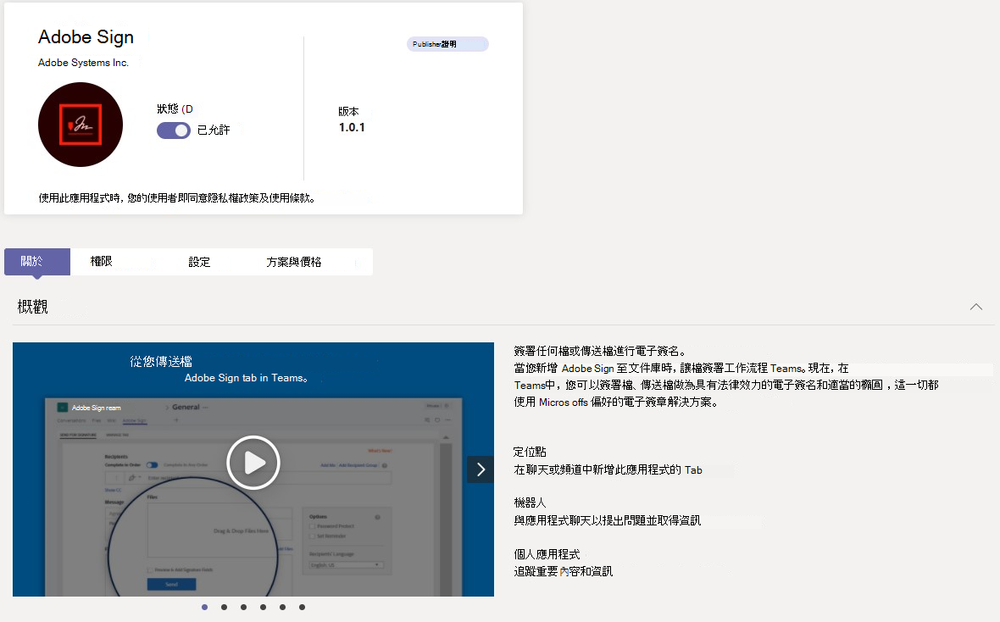
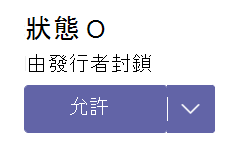

# 在 Microsoft Teams 系統管理中心管理您的應用程式

身為系統管理員，您可以檢視和管理貴組織的所有Teams應用程式。 在Teams系統管理中心的 [管理應用程式] 頁面上，您可以：

- [在組織層級允許或封鎖應用程式](#allow-and-block-apps)
- [發行者封鎖的應用程式](#apps-blocked-by-publishers)
- [將應用程式新增至團隊](#add-an-app-to-a-team)
- [核准或上傳新的自訂應用程式至貴組織的應用程式市集](#publish-a-custom-app-to-your-organizations-app-store)
- [檢視應用程式要求的許可權](#view-resource-specific-consent-permissions)
- [授與同意給應用程式](#grant-admin-consent-to-apps)
- [協力廠商應用程式的購買服務](#purchase-services-for-third-party-apps)
- [查看組織層級的應用程式狀態和屬性](#view-apps)
- [管理整個組織的應用程式設定](#manage-org-wide-app-settings)
- [檢視Microsoft 365認證應用程式的安全性和合規性資訊](#view-security-and-compliance-information-for-microsoft-365-certified-apps)

[管理應用程式] 頁面可讓您檢視所有可用的應用程式，為您提供決定要允許或封鎖整個組織之應用程式所需的資訊。 接著，您可以使用 [應用程式許可權原則](teams-app-permission-policies.md)、 [應用程式設定原則](teams-app-setup-policies.md)，以及 [自訂應用程式原則和設定](teams-custom-app-policies-and-settings.md) ，為組織中的特定使用者設定應用程式體驗。

在 Microsoft Teams 系統管理中心的左側瀏覽窗格中，移至 **Teams 應用程式** > **管理應用程式**。 您必須是全域系統管理員或Teams服務系統管理員才能存取頁面。

![[受管理的應用程式] 頁面的螢幕擷取畫面。](media/manage-apps.png)

> [!NOTE]
> Microsoft 365 政府社群雲端 High (GCCH) 或美國商務部 (DoD) Teams 部署中尚未提供 [管理應用程式] 頁面。

## 檢視應用程式

您可以檢視每個應用程式，包括下列每個應用程式的相關資訊。

- **名稱**：應用程式名稱。 選取應用程式名稱以移至應用程式詳細資料頁面，以查看應用程式的詳細資訊。 這包括應用程式的描述，無論應用程式是否允許或封鎖、版本、隱私權原則、使用條款、適用于應用程式的類別、認證狀態、支援功能和應用程式識別碼。
- **認證**：如果應用程式通過認證，您會看到 **Microsoft 365認證** 或 **Publisher證明**。 選取連結以檢視應用程式的認證詳細資料。 如果您看到 `--` ，我們就不會有應用程式的認證資訊。 若要深入瞭解 Teams 中的認證應用程式，請參[閱Microsoft 365應用程式認證計畫。](/microsoft-365-app-certification/overview)
- **Publisher**：發行者的名稱。
- **發佈狀態**：自訂應用程式的發佈狀態。
- **狀態**：組織層級的應用程式狀態，可以是下列其中一項：
  - **允許**：此應用程式適用于組織中的所有使用者。
  - **已封鎖**：此應用程式已封鎖，且不適用於貴組織中的任何使用者。
  - **發行者封鎖**：此應用程式會被發行者封鎖，使用者預設會隱藏。 使用發行者的指引設定應用程式之後，您可以允許或封鎖應用程式，讓使用者使用。
  - **全組織封鎖**：整個組織應用程式設定會封鎖此應用程式。
      請務必瞭解，此欄代表先前位於 **全組織設定** 窗格上的應用程式所允許和封鎖的狀態。 您現在可以在 [管理應用程式] 頁面上檢視、封鎖及允許整個組織中的 **應用程式** 。
- **授權**：表示應用程式是否提供「軟體即服務」 (SaaS) 訂閱以供購買。 此欄僅適用于協力廠商應用程式。 每一個協力廠商應用程式都會有下列其中一個值：
  - **購買**：此應用程式提供 SaaS 訂閱，且可供購買。  
  - **已購買**：應用程式提供 SaaS 訂閱，而且您已購買該訂閱的授權。
  - **- -**：應用程式不提供 SaaS 訂閱。
- **自訂應用程式**：應用程式是否為自訂應用程式。
- **許可權**：指出在 Azure Active Directory (Azure AD) 中註冊的協力廠商或自訂應用程式是否具有需要同意的許可權。 您會看到下列其中一個值：
  - **檢視詳細資料**：應用程式具有需要同意的許可權，應用程式才能存取資料。
  - **- -**：應用程式沒有需要同意的許可權。
- **類別**：套用至應用程式的類別。
- **版本**：App 版本。
- **系統管理員可以在會議中安裝**：指出系統管理員是否可以在小組會議中安裝應用程式。 [瞭解更多資訊](teams-app-setup-policies.md#install-apps)

若要在表格中查看您要的資訊，請選取右上角的 **[編輯資料行** ]，以新增或移除資料表中的資料行。

## 將自訂應用程式發佈到貴組織的 App 市集

使用 [管理應用程式] 頁面發佈專為貴組織打造的應用程式。 發佈自訂應用程式之後，您組織應用程式市集中的使用者就可以使用該應用程式。 有兩種方式可以將自訂應用程式發佈到貴組織的 App Store。 您使用的方式取決於取得應用程式的方式。

- [核准自訂應用程式](#approve-a-custom-app)：如果開發人員使用 Teams App 提交 API 直接將應用程式提交到 [管理應用程式] 頁面，請使用此方法。 然後，您可以直接從應用程式詳細資料頁面檢閱及發佈 (或拒絕) 應用程式。
- [Upload應用程式套](#upload-an-app-package)件：如果開發人員以.zip格式傳送應用程式套件給您，請使用此方法。 您可以上傳應用程式套件來發佈應用程式。

### 核准自訂應用程式

[管理應用程式] 頁面上的 **[待核准**] 小工具會在開發人員使用 Teams 應用程式提交 API 提交應用程式時通知您。 新提交的應用程式會列出 [**已提交**] 的 **發佈狀態** 和 [封鎖 **的狀態****]**。 移至應用程式詳細資料頁面以查看應用程式的詳細資訊，然後若要發佈，請將 **發佈狀態** 設為 **[發佈]**。

當開發人員提交自訂應用程式的更新時，您也會收到通知。 然後您可以檢閱及發佈 (或拒絕) 應用程式詳細資料頁面上的更新。 已更新的應用程式仍會強制執行所有應用程式許可權原則和應用程式設定原則。

若要深入瞭解，請參閱[發佈透過應用程式提交 API Teams自訂應用程式](submit-approve-custom-apps.md)。

### Upload應用程式套件

開發人員使用 Teams [App Studio 建立Teams應用程式](/microsoftteams/platform/get-started/get-started-app-studio)套件，然後以.zip格式傳送給您。 當您有應用程式套件時，可以將它上傳到貴組織的 App Store。

若要上傳新的自訂應用程式，請選 **取 [Upload** 上傳應用程式套件。 應用程式上傳後不會醒目提示，因此您需要在 [管理應用程式] 頁面上搜尋應用程式清單才能找到它。

若要在應用程式上傳後更新，請在 [管理應用程式] 頁面上的應用程式清單中，選取應用程式名稱，然後選取 [ **更新]**。 這樣做會取代現有的應用程式，而所有應用程式許可權原則和應用程式設定原則仍會針對更新的應用程式強制執行。

若要深入瞭解，請參閱 [上傳應用程式套件以發佈自訂應用程式](upload-custom-apps.md)。

## 允許和封鎖應用程式

[管理應用程式] 頁面是您在組織層級允許或封鎖個別應用程式的地方。 它會顯示每個可用的應用程式及其目前的組織層級應用程式狀態。  (在組織層級封鎖和允許應用程式已經從 **整個組織的應用程式設定** 窗格移到這裡。) 

若要允許或封鎖應用程式，請選取它，然後選 **取 [允許** ] 或 [ **封鎖]**。 當您封鎖應用程式時，會停用與該應用程式的所有互動，而且貴組織中的任何使用者不會在Teams中顯示該應用程式。

當您在 [管理應用程式] 頁面上封鎖或允許應用程式時，該應用程式會遭到封鎖或允許給貴組織中的所有使用者。  當您在Teams應用程式許可權原則中封鎖或允許應用程式時，系統會封鎖或允許指派該原則的使用者使用。 若要讓使用者能夠安裝任何應用程式並與之互動，您必須在 [管理應用程式] 頁面上，以及指派給使用者的應用程式許可權原則中，允許組織層級的應用程式。

 > [!NOTE]
 > 若要卸載應用程式，請以滑鼠右鍵按一下應用程式，然後按一下 [ **卸載** ] 或使用左側的 [ **其他應用程式** ] 功能表。

## 發行者封鎖的應用程式

當 ISV 將應用程式發佈到全域 App Store 時，可能需要系統管理員來設定或自訂應用程式體驗。 系統管理員可以在應用程式完全設定完成時，提供給使用者使用。

例如，Contoso 電子版是一種為 Microsoft Teams 建置技術支援中心應用程式的 ISV。 Contoso Electronics 希望其客戶設定應用程式的特定屬性，讓當使用者與應用程式互動時，應用程式會如預期般運作。 系統管理員允許或封鎖應用程式之前，系統會在系統管理中心顯示為 **[被發行者封鎖**]Teams，而且根據預設，使用者會隱藏該應用程式。 在遵循發行者的指引來設定應用程式之後，您可以將應用程式變更為 [ **允許**] 狀態，或將狀態變更為 [ **封鎖**]，來封鎖使用者不使用應用程式。

## 將應用程式新增至小組

您可以使用 [ **新增至團隊** ] 按鈕來安裝應用程式至團隊。 請記住，這僅適用于可在小組範圍中安裝的應用程式。 [ **新增至小組** ] 按鈕不適用於只能在個人範圍中安裝的應用程式。

![[新增至團隊] 按鈕的螢幕擷取畫面。](media/manage-apps-add-app-team.png)

1. 搜尋您想要的應用程式，然後按一下應用程式名稱的左邊來選取應用程式。
2. 選取 **[新增至團隊]**。
3. 在 [ **新增至團隊** ] 窗格中，搜尋您要新增應用程式的團隊，選取該團隊，然後選取 [ **套用]**。

## 自訂應用程式

您現在可以根據組織需求自訂應用程式，以包含特定的外觀與風格。 請參閱[在 Teams 中自訂應用程式](customize-apps.md)。

## 協力廠商應用程式的購買服務

您可以直接從 [管理應用程式] 頁面搜尋及購買貴組織中使用者協力廠商應用程式所提供的服務授權。 資料表中的 **[授權]** 欄會指出應用程式是否提供付費的 SaaS 訂閱。 選 **取 [立即購買** ] 以檢視方案和價格資訊，並為您的使用者購買授權。 若要深入瞭解，請參閱[在 Microsoft Teams 系統管理中心購買Teams協力廠商應用程式的服務](purchase-third-party-apps.md)。

## 將系統管理員同意授與應用程式

您可以代表貴組織中的所有使用者，檢閱並要求許可權的應用程式並授與同意。 如此一來，使用者就不必在啟動應用程式時，檢閱並接受應用程式要求的許可權。 [ **許可權]** 欄會指出應用程式是否有需要同意的許可權。 您會看到每個在Azure AD中註冊、具有需要同意之許可權的應用程式的 [**檢視詳細資料**] 連結。 若要深入瞭解，請參[閱在 Microsoft Teams 系統管理中心檢視應用程式許可權並授與系統管理員同意](app-permissions-admin-center.md)。

## 檢視資源特定的同意許可權

資源特定同意 (RSC) 許可權可讓團隊擁有者同意應用程式存取及修改團隊的資料。 RSC 許可權是精細的Teams特定許可權，可定義應用程式可在特定團隊中執行的動作。 您可以在應用程式詳細資料頁面的 [ **權** 限] 索引標籤上檢視 RSC 許可權。 若要深入瞭解，請參[閱在 Microsoft Teams 系統管理中心檢視應用程式許可權並授與系統管理員同意](app-permissions-admin-center.md)。

## 管理整個組織的應用程式設定

使用全組織應用程式設定來控制擁有 [F 授權](https://www.microsoft.com/microsoft-365/enterprise/frontline#office-SKUChooser-0dbn8nt) 的使用者是否能獲得量身打造的第一線應用程式體驗、使用者是否可以安裝協力廠商應用程式，以及使用者是否可以上傳或與您組織中的自訂應用程式互動。 全組織應用程式設定會控管所有使用者的行為，並覆寫指派給使用者的任何其他應用程式權限原則。 您可以使用這些原則來控制惡意或有問題的應用程式。

> [!NOTE]
> 若要瞭解如何在 Microsoft 365 政府版 - 政府社群雲端高 GCCH 和美國商務部 (DoD) 部署Teams中使用全組織應用程式設定，請參閱[管理 Teams 中的應用程式許可權原則](teams-app-permission-policies.md)。

1. 在 [管理應用程式] 頁面上，選取 **[全組織應用程式設定]**。 然後您可以在窗格中設定您要的設定。

    :::image type="content" source="media/manage-apps-org-wide-app-settings.png" alt-text="[管理應用程式] 頁面上 [全組織應用程式設定] 窗格的螢幕擷取畫面":::

1. 在 **[量身打造的應用程式**] 底下，關閉或開啟 **[顯示量身打造的應用程式]**。 開啟此設定時，擁有 [F 授權](https://www.microsoft.com/microsoft-365/enterprise/frontline#office-SKUChooser-0dbn8nt) 的使用者會獲得量身打造的一線應用程式體驗。 此體驗會將最相關的應用程式釘選在Teams中，以供第一線工作人員使用。 若要深入瞭解，請參閱[為前線員工量身Teams應用程式](pin-teams-apps-based-on-license.md)。

    此功能適用于 F 授權。 未來將會支援其他授權類型。
1. 在 [第三方應用程式 **]** 下，關閉或開啟這些設定，以控制對第三方應用程式的存取權：

    - **允許第三方應用程式**：這會控制使用者是否可以使用第三方應用程式。 如果您關閉此設定，您的使用者將無法安裝或使用任何協力廠商應用程式，而這些應用程式的應用程式狀態會在表格中顯示為 [ **全封鎖的組織** ]。

        > [!NOTE]
        > 當 **[允許協力廠商應用程式** ] 關閉時，所有使用者仍會啟用 [外寄網路功能](/microsoftteams/platform/webhooks-and-connectors/what-are-webhooks-and-connectors) ，但您可以透過應用程式許可權原則允許或封鎖外寄 Webhook [應用程式](teams-app-permission-policies.md)，在使用者層級控制它們。 請注意，如果您有使用 [**允許特定應用程式並封鎖所有其他應用程式**] 設定的 **Microsoft** 應用程式現有應用程式許可權 [原則](teams-app-permission-policies.md)，而且您想要為使用者啟用外寄 Web 端子，請將外寄 Webhook 應用程式新增至清單中。

        > [!NOTE]
        > Teams 使用者可以在主持會議或與其他組織人員聊天時新增應用程式。 當他們加入由其他組織主持的會議或聊天時，他們也可以使用由其他組織人員共用的應用程式。 將會套用託管使用者組織的資料原則，以及該使用者組織共用的任何協力廠商應用程式的資料共用做法。

    - **預設允許發行到商店的任何新第三方應用程式**：這會控制發佈至 Teams 應用程式商店的新第三方應用程式是否會自動在 Teams 中提供使用。 您只能在允許第三方應用程式時設定此選項。

1. 在 [ **自訂應用程式]** 底下，關閉或開啟 **[允許與自訂應用程式互動]**。 此設定會控制使用者是否可以與自訂應用程式互動。 若要深入了解，請參閱[在 Teams 中管理自訂應用程式原則和設定](teams-custom-app-policies-and-settings.md)。
1. 選 **取 [** 儲存為整個組織的應用程式設定] 以生效。

## 檢視Microsoft 365認證應用程式的安全性和合規性資訊

當系統管理員為其組織評估應用程式時，可以使用獨立雲端存取安全性代理人 (CASB) ，例如 Microsoft Cloud App Security (MCAS) ，來尋找有關應用程式安全性和行為的資訊。 Teams系統管理中心包含來自MCAS Microsoft 365認證應用程式的安全性與合規性資訊，以便您取得有關應用程式是否符合您需求的詳細資訊。

> [!NOTE]
> 無論您的組織是否有支援MCAS授權，所有系統管理員都可以使用此功能。

若要存取MCAS資訊，請遵循下列步驟：

1. 在Teams系統管理中心中，選取 [Teams應用程式] 底下的 [**管理****應用程式]**。
1. 選 **取 [認證**] 來排序應用程式，並將所有Microsoft 365認證的應用程式推送到表格頂端。
1. 選擇Microsoft 365認證的應用程式。
1. 選取 **[安全性與合規性] 索引** 標籤。

在此索引標籤上，您會找到安全性、合規性及資料保護的相關資訊。 您也可以展開每個下拉式清單，深入瞭解所選應用程式支援哪些功能。

## 相關主題

- [在 Teams 中管理應用程式的設定](admin-settings.md)
