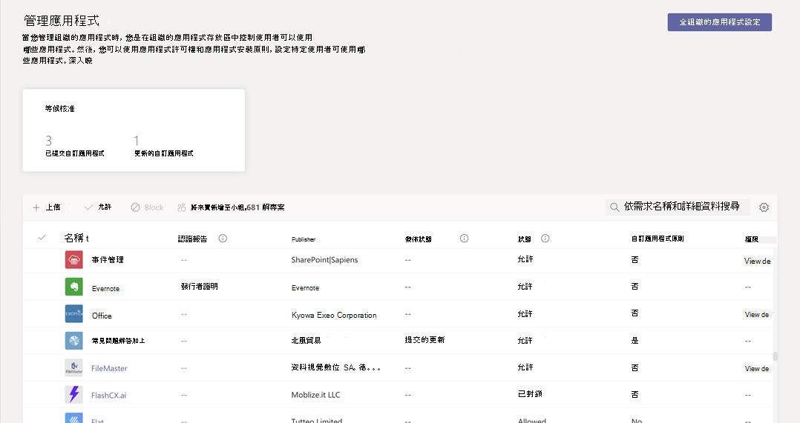
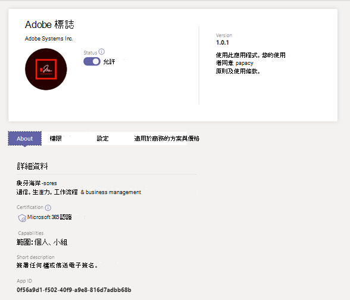
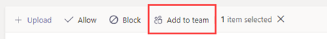
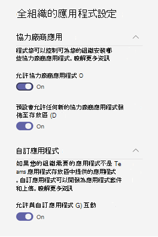
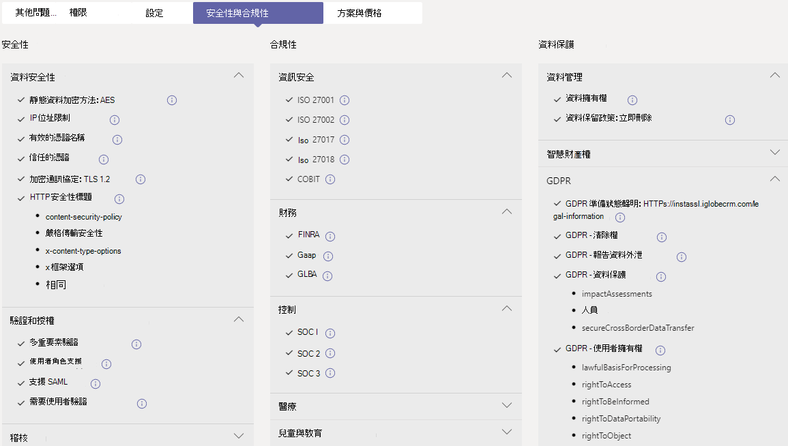

# 在系統管理中心管理Microsoft Teams應用程式

作為系統管理員，系統管理中心中的 Microsoft Teams 頁面就是您查看及管理組織Teams應用程式的地方。 在這裡，您可以查看應用程式的組織層級狀態和屬性、核准或上傳新的自訂應用程式至貴組織的 App Store、封鎖或允許組織層級的應用程式、新增應用程式至團隊、購買協力廠商應用程式的服務、查看應用程式要求的許可權、授予 App 系統管理員同意，以及管理整個組織的應用程式設定。

管理應用程式頁面提供您所有可用 App 的視圖，為您提供決定要允許或封鎖整個組織之應用程式所需的資訊。 然後，您可以使用 [應用程式權限原則](teams-app-permission-policies.md)、 [應用程式設定](teams-app-setup-policies.md)策略，以及 [自訂應用程式策略和](teams-custom-app-policies-and-settings.md) 設定，為貴組織的特定使用者設定應用程式體驗。

在 Microsoft Teams 系統管理中心的左側瀏覽窗格中，移至 **Teams 應用程式** > **管理應用程式**。 您必須是全域系統管理員Teams服務系統管理員才能存取頁面。

> [!NOTE]
> Microsoft 365 政府社群雲端 GCCH (或美國) DoD (DoD) 尚未提供 Teams。

## 查看應用程式

您可以查看每個應用程式，包括每個 App 的下列資訊。

- **名稱**：應用程式名稱。 選取應用程式名稱以前往應用程式詳細資料頁面，以查看應用程式的詳細資訊。 這包括應用程式的描述，無論是允許或封鎖、版本、隱私權原則、使用條款、適用于應用程式的類別、認證狀態、支援的功能，以及應用程式識別碼。 以下是範例：

  
  
- **認證**：如果應用程式已經通過認證，則會看到已認證 **Microsoft 365或Publisher****認證**。 選取連結以查看應用程式的認證詳細資料。 如果您看到 **--** 「」，我們並沒有應用程式的認證資訊。 若要深入瞭解應用程式中的認證Teams，請參閱[Microsoft 365認證計畫](/teams-app-certification/all-apps)。  
- **Publisher：** 發行者的名稱。
- **發佈狀態**：發佈自訂應用程式的狀態。
- **狀態**：組織層級的應用程式狀態，可以是下列其中一項：
- **允許**：此應用程式可供貴組織的所有使用者使用。
- **已封鎖**：應用程式已封鎖，且不適用於貴組織的任何使用者。
- **封鎖整個組織**：應用程式會封鎖在全組織的應用程式設定中。
      請注意，此欄代表之前位於全 **組織** 設定窗格中之應用程式的允許和封鎖狀態。 現在，您可以在管理應用程式頁面的全組織範圍內，查看、封鎖及 **允許應用程式** 。
- **授權**：指出應用程式是否提供軟體即服務 (SaaS) 訂閱以購買。 此欄僅適用于協力廠商應用程式。 每個協力廠商應用程式都會有下列其中一個值：
- **現在購買**：應用程式提供 SaaS 訂閱，可供購買。  
- **已** 購買：應用程式提供 SaaS 訂閱，而且您已購買其授權。
- **- -**：應用程式不會提供 SaaS 訂閱。
- **自訂應用程式**：應用程式是否為自訂應用程式。
- **許可權**：指出已在 Azure AD Azure Active Directory (註冊的協力廠商或) 應用程式是否具有需要同意的許可權。 您會看到下列其中一個值：
- **查看詳細** 資料：應用程式具有需要同意的許可權，應用程式才能存取資料。
- **- ：** 應用程式沒有需要同意的許可權。
- **類別**：適用于應用程式的類別。
- **版本**：應用程式版本。
- **系統管理員可以在會議中安裝**：指出系統管理員是否可以在小組會議中安裝應用程式。 [深入了解](teams-app-setup-policies.md#install-apps)

若要在表格中查看您想要的資訊，請選取右上角的編輯欄，以新增或移除表格中的欄。

## 將自訂應用程式發佈到組織的 App Store

使用管理應用程式頁面來發佈專為貴組織所建立的應用程式。 發佈自訂應用程式之後，組織 App Store 中的使用者可以使用它。 有兩種方法可以發佈自訂應用程式至貴組織的 App Store。 使用方式取決於您取得應用程式的方式。

- [核准自訂應用程式](#approve-a-custom-app)：如果開發人員使用應用程式提交 API 將應用程式直接提交到管理應用程式Teams使用此方法。 然後，您可以直接從應用程式詳細資料頁面 (或拒絕) 應用程式。
- [Upload應用程式套件](#upload-an-app-package)：如果開發人員以新的格式傳送應用程式套件，請使用此方法.zip套件。 您可以上傳應用程式套件來發佈應用程式。

### 核准自訂應用程式

當 **開發人員使用** 應用程式提交 API 提交應用程式時，在管理應用程式頁面上的擱置核准小工具Teams通知您。 新提交的應用程式會列出已提交之發佈狀態和封鎖 **狀態**。  請前往應用程式詳細資料頁面以查看應用程式的詳細資訊，然後發佈，將發佈 **狀態設定** 為 **發佈**。

當開發人員提交更新至自訂應用程式時，您也會收到通知。 然後，您可以在應用程式詳細資料頁面上 (或拒絕) 更新。 對於更新的應用程式，所有應用程式權限原則與應用程式設定策略仍然會強制執行。

若要深入瞭解，請參閱發佈[透過](submit-approve-custom-apps.md)應用程式提交 API 提交的Teams應用程式。

### Upload應用程式套件

開發人員使用 App [Studio](/microsoftteams/platform/get-started/get-started-app-studio)Teams應用程式套件，Teams應用程式套件，然後以 .zip格式傳送。 當您有應用程式套件時，您可以將它上傳到組織的 App Store。

若要上傳新的自訂應用程式，請選取 **Upload** 上傳應用程式套件。 應用程式上傳後不會加亮顯示，因此您必須在管理應用程式頁面上搜尋應用程式清單以尋找。

若要在應用程式上傳後更新，請在管理應用程式頁面上的應用程式清單中，選取應用程式名稱， **然後選取更新**。 這麼做會取代現有的應用程式，所有應用程式權限原則及應用程式設定策略會持續為更新的應用程式強制執行。

若要深入瞭解，請參閱上傳應用程式套件 [來發佈自訂應用程式](upload-custom-apps.md)。

## 允許並封鎖應用程式

您可以在組織層級允許或封鎖個別 App 的管理應用程式頁面。 它會顯示每個可用的應用程式及其目前的組織層級應用程式狀態。  (在組織層級封鎖及允許應用程式，已由整個組織的應用程式設定窗格移至這裡。) 

若要允許或封鎖應用程式，請選取它，然後選取允許或 **封鎖**。 當您封鎖應用程式時，與該應用程式的所有互動會停用，且應用程式不會顯示在貴組織Teams中。

當您封鎖或允許管理應用程式頁面上的應用程式時，該應用程式會封鎖或允許貴組織的所有使用者使用。  當您在應用程式許可權Teams中封鎖或允許應用程式時，系統會封鎖或允許指派該策略的使用者使用。 若要讓使用者能夠安裝並與任何應用程式互動，您必須在組織層級允許應用程式在管理應用程式頁面，以及指派給使用者的應用程式權限原則中。

 > [!NOTE]
 > 若要卸載應用程式，請以滑鼠右鍵按一下應用程式，然後按一下 [**卸載** 或使用左側的 [其他應用程式> 功能表。

## 新增應用程式至小組

您可以使用新增 **到小組** 按鈕，將應用程式安裝到團隊。 請記住，這僅適用于可在小組範圍內安裝的 App。 只有 **個人範圍** 中的 App 才能使用新增到小組按鈕。

1. 搜尋您想要的應用程式，然後按一下應用程式名稱左側以選取應用程式。
2. 選取 **新增到團隊**。
3. 在新增 **到小組窗格中** ，搜尋您想要新增應用程式的團隊，選取該團隊，然後 **選取應用程式**。

## 自訂應用程式

現在，您可以自訂應用程式，以根據您的組織需求包含特定的外觀和感受。 請參閱[在 Teams 中自訂Teams。](customize-apps.md)

## 購買協力廠商應用程式服務

您可以直接從管理應用程式頁面搜尋及購買貴組織使用者協力廠商應用程式所提供的服務授權。 表格中 **的** 授權欄會指出應用程式是否提供付費的 SaaS 訂閱。 選取 **立即購買** 來查看方案與定價資訊，並購買使用者授權。 若要深入瞭解，請參閱在系統管理中心[Teams購買](purchase-third-party-apps.md)第三Microsoft Teams服務。

## 將系統管理員同意授予應用程式

您可以審查並授權代表貴組織中所有使用者要求許可權的應用程式。 如此一來，使用者就不需要在啟動 App 時，查看並接受應用程式要求的許可權。 許可權 **欄** 會指出應用程式是否具有需要同意的許可權。 針對在 Azure  AD 中註冊並擁有需要同意許可權的每個應用程式，您會看到一個 View 詳細資料連結。 若要深入瞭解，請參閱在系統管理中心中查看應用程式許可權Microsoft Teams[管理員同意](app-permissions-admin-center.md)。

## 查看特定資源同意許可權

資源特定 (RSC) 許可權，讓團隊擁有者同意應用程式存取及修改小組的資料。 RSC 許可權是精細Teams特定許可權，可定義應用程式可在特定小組中執行哪些工作。 您可以在應用程式詳細資料頁面的許可權標籤上，查看 RSC 許可權。 若要深入瞭解，請參閱在系統管理中心中查看應用程式許可權Microsoft Teams[管理員同意](app-permissions-admin-center.md)。

## 管理全組織的應用程式設定

使用全組織 App 設定來控制使用者是否可以安裝協力廠商應用程式，以及使用者是否可以上傳或與組織中的自訂應用程式互動。 全組織應用程式設定會控管所有使用者的行為，並覆寫指派給使用者的任何其他應用程式權限原則。 您可以使用這些原則來控制惡意或有問題的應用程式。

> [!NOTE]
> 若要瞭解如何在 Microsoft 365 政府 - 政府社群雲端 高 GCCH 和國防部 (DoD) Teams 部署中使用全組織應用程式設定，請參閱管理 Teams 中的[應用程式許可權](teams-app-permission-policies.md)政策。

1. 在管理應用程式頁面上，選取 **整個組織的應用程式設定**。 然後您就可以在面板中設定您要的設定。

    

2. 在 [第三方應用程式 **]** 下，關閉或開啟這些設定，以控制對第三方應用程式的存取權：

    - **允許第三方應用程式**：這會控制使用者是否可以使用第三方應用程式。 如果您關閉此設定，您的使用者將無法安裝或使用任何協力廠商應用程式，且這些 App 的應用程式狀態會顯示為表格中的全組織封鎖狀態。 

        > [!NOTE]
        > 當 **允許第** 三方應用程式關閉時，所有使用者仍可使用外發網頁連結，但您可以透過應用程式許可權政策允許或封鎖外發 Web 上手應用程式，以在使用者層級控制 [這些應用程式](teams-app-permission-policies.md)。   請注意，如果您有 Microsoft 應用程式的現有應用程式許可權策略，使用允許特定應用程式並封鎖所有其他設定，而且您想要為使用者啟用外發網頁連結，請新增外發 Web 上手應用程式至清單。 

        > [!NOTE]
        > Teams 使用者可以在主持會議或與其他組織人員聊天時新增應用程式。 當他們加入由其他組織主持的會議或聊天時，他們也可以使用由其他組織人員共用的應用程式。 將會套用託管使用者組織的資料原則，以及該使用者組織共用的任何協力廠商應用程式的資料共用做法。

    - **預設允許發行到商店的任何新第三方應用程式**：這會控制發佈至 Teams 應用程式商店的新第三方應用程式是否會自動在 Teams 中提供使用。 您只能在允許第三方應用程式時設定此選項。

3. 在 **自訂應用程式** 下，關閉或開啟允許 **與自訂應用程式互動**。 此設定可控制使用者是否能與自訂應用程式互動。 若要深入了解，請參閱[在 Teams 中管理自訂應用程式原則和設定](teams-custom-app-policies-and-settings.md)。
4. 選取 **儲存** 以讓全組織的應用程式設定生效。

## 查看認證應用程式的安全性Microsoft 365合規性資訊

當評估其組織的應用程式時，系統管理員可以使用獨立的雲端存取安全性代理程式 (CASB) ，例如 Microsoft Cloud App Security (MCAS) ，以尋找 App 安全性和行為的資訊。 系統Teams系統管理中心包含 MCAS 針對 Microsoft 365 認證應用程式的安全性與合規性資訊，因此您將擁有 App 是否符合您需求之詳細資訊。

> [!NOTE]
> 不論貴組織是否擁有支援 MCAS 的授權，所有系統管理員都可以使用此功能。

若要存取 MCAS 資訊，請遵循下列步驟：

1. 在系統管理Teams **中，選取** 管理應用程式Teams **應用程式**。
1. 選取 **認證** 以排序應用程式，Microsoft 365所有認證應用程式都推至表格頂端。
1. 選擇一Microsoft 365認證應用程式。
1. 選取安全性 **與合規性選項卡** 。

您可以在此選項卡上找到安全性、合規性和資料保護的資訊。 您也可以展開每個下拉清單，以取得所選應用程式支援哪些功能的詳細資訊。

## 相關主題

- [在 Teams 中管理應用程式的設定](admin-settings.md)
