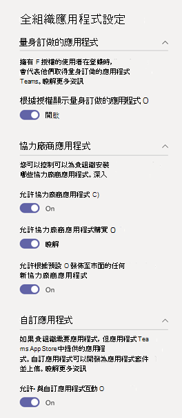

在 Microsoft 團隊系統管理中心管理您的應用程式Manage your apps in the Microsoft Teams admin center
======================================================

做為管理員，Microsoft [團隊管理中心] 中的 [管理應用程式] 頁面是您在其中查看及管理組織的所有團隊應用程式的位置。As an admin, the Manage apps page in the Microsoft Teams admin center is where you view and manage all Teams apps for your organization. 在這裡，您可以查看應用程式的組織層級狀態和屬性，將新的自訂應用程式核准或上傳到組織的 app 存放區、封鎖或允許組織結構中的應用程式、將 app 新增至 [預覽]) 中的小組 (、針對協力廠商應用程式的購買服務、授與應用程式的管理員同意，以及管理整個組織的Here, you can see the org-level status and properties of apps, approve or upload new custom apps to your organization's app store, block or allow apps at the org level, add apps to teams (in preview), purchase services for third-party apps, view permissions requested by apps, grant admin consent to apps, and manage org-wide app settings.

[管理應用程式] 頁面可讓您查看所有可用的應用程式，為您提供決定要允許或封鎖整個組織的 app 所需的資訊。The Manage apps page gives you a view into all available apps, providing you with the information you need to decide which apps to allow or block across your organization. 接著，您可以使用 [應用程式許可權原則](teams-app-permission-policies.md)、 [應用程式設定原則](teams-app-setup-policies.md)，以及 [自訂的 app 原則和設定](teams-custom-app-policies-and-settings.md) ，為貴組織中的特定使用者設定 app 體驗。You can then use [app permission policies](teams-app-permission-policies.md), [app setup policies](teams-app-setup-policies.md), and [custom app policies and settings](teams-custom-app-policies-and-settings.md) to configure the app experience for specific users in your organization.

在 Microsoft 團隊系統管理中心的左導覽中，移至 [**團隊 app**  >  **管理應用程式**]。In the left navigation of the Microsoft Teams admin center, go to **Teams apps** > **Manage apps**. 您必須是全域系統管理員或團隊服務系統管理員，才能存取該頁面。You must be a global admin or Teams service admin to access the page.

> [!NOTE]
> [管理應用程式] 頁面尚無法在 Microsoft 365 政府社區中使用 (GCC) 小組部署。The Manage apps page isn't available yet in Microsoft 365 Government Community Cloud (GCC) deployments of Teams.

## 查看應用程式View apps

您可以查看每個應用程式，包括下列每個應用程式的相關資訊。You can view every app including the following information about each app.

![[受管理的應用程式] 頁面的螢幕擷取畫面](media/manage-apps.png)

- **Name （名稱**）：應用程式名稱。**Name**: The app name. 按一下應用程式名稱，移至 [應用程式詳細資料] 頁面，以查看應用程式的詳細資訊。Click the app name to go to the app details page to see more information about the app. 這包括應用程式的描述、是否允許或封鎖、版本、隱私權原則、使用條款、套用至應用程式的類別、認證狀態、支援的功能，以及應用程式識別碼。This includes a description of the app, whether it's allowed or blocked, version, privacy policy, terms of use, categories that apply to the app, certification status, supported capabilities, and app ID. 以下是一個範例：Here's an example:

  ![應用程式的 [應用程式詳細資料] 頁面的螢幕擷取畫面](media/manage-apps-app-details.png)
  
- **認證**：如果 app 已透過認證，您就會看到 **Microsoft 365 認證** 或 **發行商認證**。**Certification**: If the app has gone through certification, you'll see either **Microsoft 365 certified** or **Publisher attestation**. 按一下連結以查看 app 的認證詳細資料。Click the link to view certification details for the app. 如果您看到「」 **--** ，表示沒有 app 的認證資訊。If you see "**--**", we don't have certification information for the app. 若要深入瞭解團隊中的認證應用程式，請參閱 [Microsoft 365 App 認證計畫](https://docs.microsoft.com/teams-app-certification/all-apps)。To learn more about certified apps in Teams, read [Microsoft 365 App Certification program](https://docs.microsoft.com/teams-app-certification/all-apps).  
- **Publisher**：發行者的名稱。**Publisher**: Name of the publisher.
- **發佈狀態**：自訂應用程式的發佈狀態。**Publishing status**: Publishing status of custom apps.
- **狀態**：組織階層的 app 狀態，可以是下列其中一項：**Status**: Status of the app at the org level, which can be one of the following:

    - **允許**：應用程式可供貴組織中的所有使用者使用。**Allowed**: The app is available for all users in your organization.
    
    - 已**封鎖**：應用程式遭到封鎖，且無法供貴組織中的任何使用者使用。**Blocked**: The app is blocked and not available for any users in your organization.
    
    - 已**封鎖整個組織**結構：應用程式在整個組織內的應用程式設定中遭到封鎖。**Blocked org-wide**: The app is blocked in org-wide app settings.
    
      請務必注意，此資料行代表原在 **整個組織結構設定** 窗格中之 app 的「允許」和「封鎖」狀態。It's important to know that this column represents the allowed and blocked status of apps that were formerly on the **Org-wide settings** pane. 您現在可以在 [ **管理應用程式** ] 頁面上的整個組織結構中查看、封鎖及允許 app。You now view, block, and allow apps at the org-wide on the **Manage apps** page. 
- **授權**：指出 app 是否提供軟體作為服務 (SaaS) 訂閱以進行購買。**Licenses**: Indicates whether an app offers a Software as a Service (SaaS) subscription for purchase. 此欄僅適用于協力廠商應用程式。This column applies only to third-party apps. 每個協力廠商應用程式將會有下列其中一個值：Each third-party app will have one of the following values:
    - [**立即購買**]： App 提供 SaaS 訂閱，且可供購買。**Purchase now**: The app offers a SaaS subscription and is available to purchase.  
    - 已**購買**： App 提供 SaaS 訂閱，且您已為其購買授權。**Purchased**: The app offers a SaaS subscription and you've purchased licenses for it.
    - **--**：應用程式不會提供 SaaS 訂閱。**- -**: The app doesn't offer a SaaS subscription.
- **自訂 app**：應用程式是否為自訂應用程式。**Custom app**: Whether the app is a custom app.
- **許可權**：指示在 Azure Active Directory 中註冊的協力廠商或自訂應用程式 (azure AD) 是否有需要同意的許可權。**Permissions**: Indicates whether a third-party or custom app that's registered in Azure Active Directory (Azure AD) has permissions that need consent. 您會看到下列其中一個值：You'll see one of the following values:
    - [**查看詳細**資料]： app 擁有需要同意才能存取資料的許可權。**View details**: The app has permissions that require consent before the app can access data. 
    - **--**：應用程式沒有需要同意的許可權。**- -**: The app doesn't have permissions that need consent.
- [**類別**]：適用于 app 的類別。**Categories**: Categories that apply to the app.
- **版本**： App 版本。**Version**: App version.

若要在表格中查看您想要的資訊，請按一下右上角的 [ **編輯欄** ]，在表格中新增或移除欄。To see the information that you want in the table, click **Edit Column** in the upper-right corner to add or remove columns to the table.

## 將自訂應用程式發佈到貴組織的 app storePublish a custom app to your organization's app store

使用 [管理應用程式] 頁面，發佈專為貴組織建立的應用程式。Use the Manage apps page to publish apps that are built specifically for your organization. 發佈自訂應用程式之後，您組織的 app store 中的使用者就可以使用它。After you publish a custom app, it's available to users in your organization's app store. 您可以透過兩種方式將自訂應用程式發佈到貴組織的 app store。There are two ways to publish a custom app to your organization's app store. 您使用的方式取決於您取得 app 的方式。The way that you use depends on how you get the app.

- [核准自訂應用程式](#approve-a-custom-app)：如果開發人員使用小組 APP 提交 API 直接將 app 提交到 [管理應用程式] 頁面，請使用這個方法。[Approve a custom app](#approve-a-custom-app): Use this method if the developer submits the app directly to the Manage apps page using the Teams App Submission API. 然後，您可以直接從應用程式詳細資料頁面查看併發布 (或拒絕) app。You can then review and publish (or reject) the app directly from the app details page.
- [上傳應用程式套件](#upload-an-app-package)：如果開發人員以 .zip 格式傳送您的應用程式套件，請使用這個方法。[Upload an app package](#upload-an-app-package): Use this method if the developer sends you the app package in .zip format. 您可以透過上傳應用程式套件來發佈應用程式。You publish the app by uploading the app package.

###  核准自訂應用程式Approve a custom app

當開發人員使用小組 App 提交 API 提交 app 時，[管理 app] 頁面上的 [ **待定核准** ] 小工具會通知您。The **Pending approvals** widget on the Manage apps page notifies you when a developer submits an app by using the Teams App Submission API. 新提交的應用程式會列在已**提交**的**發佈狀態**，且**狀態**為 [已**封鎖**]。A newly submitted app is listed with a **Publishing status** of **Submitted** and an **Status** of **Blocked**. 移至 [應用程式詳細資料] 頁面以查看應用程式的詳細資訊，然後將其發佈，將 [ **發佈狀態** ] 設定為 [ **發佈**]。Go to the app details page to see more information about the app, and then to publish it, set **Publishing status** to **Publish**.

當開發人員提交自訂應用程式的更新時，您也會收到通知。You're also notified when a developer submits an update to a custom app. 然後，您可以在應用程式詳細資料頁面上查看併發布 (或拒絕) 更新。You can then review and publish (or reject) the update on the app details page. 所有 app 許可權原則和 app 設定原則，都會針對更新的 app 保持強制執行。All app permission policies and app setup policies remain enforced for the updated app.

若要深入瞭解，請參閱 [發佈透過團隊 App 提交 API 提交的自訂應用程式](submit-approve-custom-apps.md)。To learn more, see [Publish a custom app submitted through the Teams App Submission API](submit-approve-custom-apps.md).

### 上傳應用程式套件Upload an app package

開發人員會使用 [團隊 App Studio](https://docs.microsoft.com/microsoftteams/platform/get-started/get-started-app-studio)建立小組應用程式套件，然後以 .zip 格式將它傳送給您。The developer creates a Teams app package using [Teams App Studio](https://docs.microsoft.com/microsoftteams/platform/get-started/get-started-app-studio), and then sends it to you in .zip format. 當您有應用程式套件時，可以將它上傳到貴組織的 app store。When you have the app package, you can upload it to your organization's app store.

若要上傳新的自訂應用程式，請選取 **[上傳** ] 以上傳應用程式套件。To upload a new custom app, select **Upload** to upload the app package. 應用程式在上傳後不會醒目提示，因此您必須在 [管理 app] 頁面上搜尋應用程式清單來尋找。The app isn't highlighted after it's uploaded so you'll need to search the list of apps on the Manage apps page to find it.

若要在上傳應用程式後進行更新，請在 [管理應用程式] 頁面上的應用程式清單中，按一下應用程式名稱，然後按一下 [ **更新**]。To update an app after it's uploaded, in the list of apps on the Manage apps page, click the app name, and then click **Update**. 這麼做會取代現有的 app，以及所有 app 許可權原則，以及 app 設定原則，都將針對更新的 app 保持強制執行。Doing this replaces the existing app and all app permission policies and app setup policies remain enforced for the updated app.

若要深入瞭解，請參閱 [上傳應用程式套件以發佈自訂應用程式](upload-custom-apps.md)。To learn more, see [Publish a custom app by uploading an app package](upload-custom-apps.md).

## 允許及封鎖應用程式Allow and block apps

[管理應用程式] 頁面是您在組織階層允許或封鎖個別 app 的位置。The Manage apps page is where you allow or block individual apps at the org level. 它會顯示每個可用的 app 及其目前的組織層級 app 狀態。It shows every available app and its current org-level app status. 在組織階層 (封鎖及允許 app 已從 **組織範圍的應用程式設定** 窗格移至此處。 ) (Blocking and allowing apps at the org level has moved from the **Org-wide app settings** pane to here.)

若要允許或封鎖應用程式，請選取它，然後按一下 [ **允許** ] 或 [ **封鎖**]。To allow or block an app, select it, and then click **Allow** or **Block**. 當您封鎖 app 時，所有與該 app 的互動都會停用，而且該 app 不會出現在小組中您組織中的任何使用者。When you block an app, all interactions with that app are disabled and the app doesn't appear in Teams for any users in your organization.

當您封鎖或允許 [管理應用程式] 頁面上的應用程式時，該應用程式會遭到封鎖，或您組織中的所有使用者都能使用該 app。When you block or allow an app on the Manage apps page, that app is blocked or allowed for all users in your organization.  當您在小組 app 許可權原則中封鎖或允許應用程式時，系統會封鎖或允許指派該原則的使用者。When you block or allow an app in a Teams app permission policy, it's blocked or allowed for users who are assigned that policy. 若要讓使用者能夠安裝任何 app 並與之互動，您必須在 [管理應用程式] 頁面上，或已指派給使用者的 app 許可權原則中，允許該應用程式位於組織層級。For a user to be able to install and interact with any app, you must allow the app at the org level on the Manage apps page and in the app permission policy that's assigned to the user.

 > [!NOTE]
 > 若要卸載應用程式，請以滑鼠右鍵按一下該應用程式，然後按一下左側的 [ **卸載** ] 或 [使用 **其他 app** ] 功能表。To uninstall an app, right-click the app, and then click **Uninstall** or use the **More apps** menu on the left side.

## 將應用程式新增至團隊Add an app to a team

[!INCLUDE [preview-feature](includes/preview-feature.md)]

您可以使用 [ **新增至小組** ] 按鈕，將應用程式安裝至小組。You use the **Add to team** button to install an app to a team. 請記住，這只適用于可在團隊範圍中安裝的 app。Keep in mind that this is only for apps that can be installed in a team scope. [ **新增至小組** ] 按鈕不適用於只能安裝在個人範圍中的 app。The **Add to team** button isn't available for apps that can only be installed in the personal scope.

![[新增至小組] 按鈕的螢幕擷取畫面](media/manage-apps-add-app-team.png)

1. 搜尋您要的應用程式，然後按一下應用程式名稱左方，選取該 app。Search for the app you want, and then select the app by clicking to the left of the app name.
2. 選取 [ **新增至小組**]。Select **Add to team**.
3. 在 [**新增至團隊**] 窗格中，搜尋您要新增應用程式的小組，選取該小組，然後選取 [套用 **]。**In the **Add to team** pane, search for the team you want to add the app to, select the team, and then select **Apply**.

## 協力廠商應用程式的購買服務Purchase services for third-party apps

您可以直接從 [管理應用程式] 頁面，搜尋並購買貴組織中使用者所提供服務的授權。You can search for and purchase licenses for services offered by third-party apps for users in your organization directly from the Manage apps page. 資料表中的 [ **授權** ] 欄會指出 app 是否提供付費的 SaaS 訂閱。The **Licenses** column in the table indicates whether an app offers a paid SaaS subscription. 按一下 [ **立即購買** ] 來查看方案和定價資訊，並為您的使用者購買授權。Click **Purchase now** to view plans and pricing information and buy licenses for your users. 若要深入瞭解，請參閱 [Microsoft 團隊系統管理中心的 [針對團隊協力廠商應用程式購買服務](purchase-third-party-apps.md)]。To learn more, see [Purchase services for Teams third-party apps in the Microsoft Teams admin center](purchase-third-party-apps.md).

## 授權管理員同意 appGrant admin consent to apps

您可以複習並同意代表貴組織中所有使用者要求許可權的 app。You can review and grant consent to apps that request permissions on behalf of all users in your organization. 您這樣做是為了讓使用者在啟動 app 時，不需要查看並接受 app 要求的許可權。You do this so that users don't have to review and accept the permissions requested by the app when they start the app. [ **許可權** ] 欄會指出 app 是否擁有需要同意的許可權。The **Permissions** column indicates whether an app has permissions that need consent. 您會看到在 Azure AD 中註冊的每個應用程式的 [ **查看詳細資料** ] 連結，該 app 具有需要同意的許可權。You'll see a **View details** link for each app registered in Azure AD that has permissions that need consent. 若要深入瞭解，請參閱在 [Microsoft 團隊系統管理中心查看應用程式許可權並授與系統管理員同意](app-permissions-admin-center.md)。To learn more, see [View app permissions and grant admin consent in the Microsoft Teams admin center](app-permissions-admin-center.md).

## 查看資源特定的同意許可權View resource-specific consent permissions

資源特定的同意 (RSC) 許可權，讓小組擁有者同意 app 存取及修改小組資料的授權。Resource-specific consent (RSC) permissions let team owners grant consent for an app to access and modify a team's data. RSC 許可權是精確、團隊特有的許可權，可定義應用程式在特定團隊中的功能。RSC permissions are granular, Teams-specific permissions that define what an app can do in a specific team. 您可以在應用程式的 [應用程式詳細資料] 頁面的 [ **許可權** ] 索引標籤上，查看 RSC 許可權。You can view RSC permissions on the **Permissions** tab of the app details page for an app. 若要深入瞭解，請參閱在 [Microsoft 團隊系統管理中心查看應用程式許可權並授與系統管理員同意](app-permissions-admin-center.md)。To learn more, see [View app permissions and grant admin consent in the Microsoft Teams admin center](app-permissions-admin-center.md).

## 管理整個組織內的應用程式設定Manage org-wide app settings

使用整個組織的 app 設定來控制使用者是否可以安裝協力廠商應用程式，以及使用者是否可以上傳或與您組織中的自訂應用程式互動。Use org-wide app settings to control whether users can install third-party apps and whether users can upload or interact with custom  apps in your organization. 全組織式應用程式設定會控制所有使用者的行為，並覆寫指派給使用者的任何其他應用程式許可權原則。Org-wide app settings govern the behavior for all users and override any other app permission policies assigned to users. 您可以使用它們來控制惡意或有問題的 app。You can use them to control malicious or problematic apps.

> [!NOTE]
> 若要瞭解如何在 Microsoft 365 政府版的團隊部署中使用整個組織內的應用程式設定，請參閱 [在團隊中管理 app 許可權原則](teams-app-permission-policies.md)。To learn how to use org-wide app settings in Microsoft 365 Government - GCC deployments of Teams, see [Manage app permission policies in Teams](teams-app-permission-policies.md).

1. 在 [管理應用程式] 頁面上，選取 [ **全組織式應用程式設定**]。On the Manage apps page, select **Org-wide app settings**. 接著，您可以在面板中設定您想要的設定。You can then configure the settings you want in the panel.

    
    
2. 在 **協力廠商應用程式**下，關閉或開啟這些設定以控制對協力廠商應用程式的存取：Under **Third-party apps**, turn off or turn on these settings to control access to third-party apps:

    - **允許協力廠商應用程式**：控制使用者是否可以使用協力廠商應用程式。**Allow third-party apps**: This controls whether users can use third-party apps. 如果您關閉此設定，您的使用者將無法安裝或使用任何協力廠商應用程式，而且這些應用程式的應用程式狀態會在表格中顯示為已 **封鎖的組織內** 。If you turn off this setting, your users won't be able to install or use any third-party apps and the app status of these apps is displayed as **Blocked org-wide** in the table.

        > [!NOTE]
        > [ **允許協力廠商應用程式** ] 關閉時，系統會停用 [傳出 webhooks](https://docs.microsoft.com/microsoftteams/platform/webhooks-and-connectors/what-are-webhooks-and-connectors) ，這表示使用者無法建立。When **Allow third-party apps** is off, [outgoing webhooks](https://docs.microsoft.com/microsoftteams/platform/webhooks-and-connectors/what-are-webhooks-and-connectors) are disabled, which means that users can't create them. 開啟此設定時，系統會針對所有使用者啟用傳出 webhooks，您可以透過 [應用程式許可權原則](teams-app-permission-policies.md)允許或封鎖傳出 Webhook app，以在使用者層級進行控制。When this setting is on, outgoing webhooks are enabled for all users and you can control them at the user level by allowing or blocking the Outgoing Webhook app through [app permission policies](teams-app-permission-policies.md).   請注意，如果您有適用于**Microsoft** app 的現有[應用程式許可權原則](teams-app-permission-policies.md)，且使用 [**允許特定應用程式] 和 [封鎖所有人**] 設定，而您想要為使用者啟用外寄 webhooks，請將傳出 Webhook app 新增至清單。Note that if you have existing [app permission policies](teams-app-permission-policies.md) for **Microsoft apps** that use the **Allow specific apps and block all others** setting, and you want to enable outgoing webhooks for users, add the Outgoing Webhook app to the list.
    - **允許預設發佈至商店的任何新的協力廠商應用程式**：這會控制發佈至 [小組] 應用程式商店的新的協力廠商應用程式是否會自動在小組中提供。**Allow any new third-party apps published to the store by default**: This controls whether new third-party apps that are published to the Teams app store become automatically available in Teams. 如果您允許協力廠商應用程式，則只能設定此選項。You can only set this option if you allow third-party apps.

3. 在 [ **自訂應用程式**] 底下，關閉或開啟 [ **允許與自訂應用程式互動**]。Under **Custom apps**, turn off or turn on **Allow interaction with custom apps**. 這個設定控制使用者是否能與自訂 app 互動。This setting controls whether users can interact with custom apps. 若要深入瞭解，請參閱 [管理團隊中的自訂應用程式原則和設定](teams-custom-app-policies-and-settings.md)。To learn more, see [Manage custom app policies and settings in Teams](teams-custom-app-policies-and-settings.md).
4. 按一下 [ **儲存** 以組織範圍內的應用程式設定] 生效。Click **Save** for org-wide app settings to take effect.

## 相關主題Related topics

- [在 Teams 中的應用程式系統管理設定Admin settings for apps in Teams](admin-settings.md)