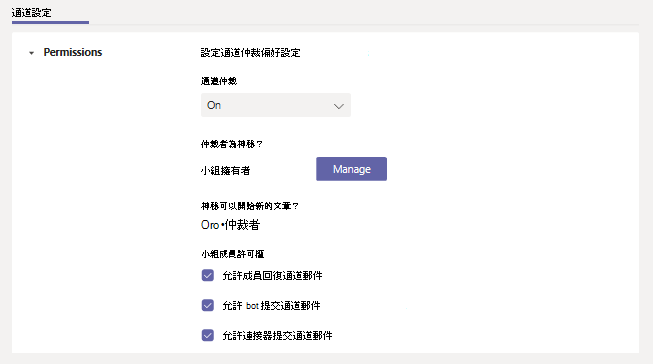

# 在 Microsoft 團隊中設定及管理頻道裁決

在 Microsoft 團隊中，小組擁有者可以針對標準頻道開啟 [裁決]，以控制誰可以開始新的文章，以及如何在該頻道中回復文章。

小組擁有者也可以將團隊成員新增為版主。 小組擁有者可能不具備頻道階層的主題專業技能，以最佳支援管道裁決。 透過讓特定的小組成員能夠適中的頻道，在小組擁有者和管道版主之間，管理頻道內的內容與內容的責任。 例如，小組擁有者可以將企業擁有者或內容擁有者新增為仲裁者，讓他們控制該頻道中的資訊共用。

> [!NOTE]
> [頻道裁決] 可供標準通道使用。 [一般] 通道或 [私人頻道] 無法使用。

## 頻道審查者能做什麼？

頻道審查者可以：

- 在頻道中開始新的文章。 針對頻道開啟 [裁決] 時，只有版主可以在該頻道中開始新的文章。
- 新增或移除團隊成員為頻道的版主。 請記住，小組擁有者預設是 [頻道審查程式]，而且無法移除。
- 控制小組成員是否可以回復現有的通道訊息，以及機器人與連接器是否可以提交頻道訊息。

## 案例

以下是貴組織在團隊中使用管道裁決的一些範例。

### 使用通道做為宣告通道

行銷團隊使用特定的通道來共用重要的專案宣告與交付專案。 有時候，小組成員會將內容張貼到更適當地歸屬其他頻道的頻道。 小組擁有者想要將頻道中的資訊共用限制為僅限宣告，讓小組成員可以使用該通道來掌握重要的內容。

在這種情況下，小組擁有者會將行銷主管新增為版主，讓他們可以在頻道中張貼宣告，然後關閉小組成員回復該頻道中之訊息的功能。

### 在教育版小組中使用課程討論的頻道

在教育版團隊中，科學老師想要使用頻道，在特定教室主題進行重點討論。

在這種情況下，教師可以讓其教學助手來適中頻道。 [教學助手] 接著可以建立新的貼文，以啟動並將討論放在學生中。

## 管理通道裁決

在 [團隊] 中，移至頻道，按一下 [**更多選項]。**  > **管理頻道**。 您可以從這裡開啟和關閉「裁決」、將小組成員新增為仲裁者，以及設定喜好設定。

[頻道裁決] 是 [每個通道] 設定。 通道裁決沒有租使用者層級設定。 如果您想要我們新增租使用者層級通道裁決設定，請在 [團隊 UserVoice](https://microsoftteams.uservoice.com/)上要求它。

### 開啟或關閉頻道的裁決

根據預設，「裁決」是關閉的，這表示一般的頻道設定會套用至小組擁有者和小組成員。 例如，您可以將新的文章限制為只有小組成員，或允許每個人（包括來賓）開始新的文章。

若要為頻道開啟 [裁決]，請在 [ **管道裁決**] 底下，按一下 [ **開啟**]。 當頻道裁決開啟時，只有版主可以開始新的文章。 

### 新增或移除頻道版主

在 **[誰是仲裁者？**] 底下，按一下 [ **管理**]，然後將小組成員新增或移除為 [版主]。 小組擁有者和版主可以新增及移除其他版主。  

### 設定小組成員許可權

在 [ **小組成員許可權**] 底下，選取您要允許之活動旁的核取方塊。

## 相關主題

- [Teams 的小組和頻道概觀](teams-channels-overview.md)
