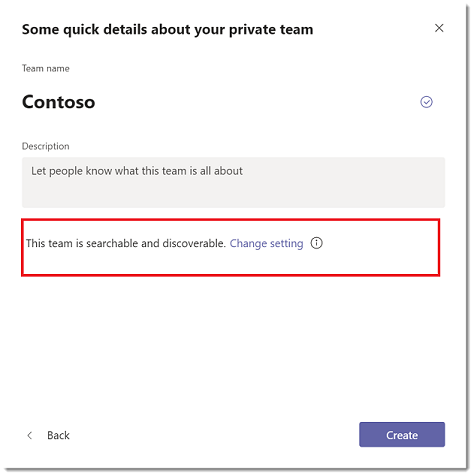

# <a name="manage-discovery-of-private-teams-in-microsoft-teams"></a>在 Microsoft 團隊中管理私人小組探索

[!INCLUDE [preview-feature](includes/preview-feature.md)]

系統管理員和小組擁有者可以控制貴組織中的 Microsoft 團隊使用者是否可探索私有團隊。 當私人團隊可被發現時, 會顯示在搜尋結果中, 並包含在小組中與團隊中的公用小組有關的建議中。 這可讓使用者輕鬆搜尋並找到他們想要加入的私人小組。 使用者可以要求加入私人小組, 而團隊擁有者則可以核准或拒絕要求。

## <a name="overview-of-public-teams-private-teams-and-discovery-in-teams"></a>在小組中公開團隊、私人團隊和探索的概覽

大多陣列織都有下列幾種團隊: 公用團隊、可探索的私人小組, 以及無法探索的私人團隊。


### <a name="public-teams"></a>公開團隊

公用團隊可供貴組織中的所有使用者加入。 [小組] 圖庫中的每個人都能看到公開的小組, 而使用者可以加入公開團隊, 而不需取得小組擁有者的核准。 公用團隊的範例包括一小組討論技術新聞、小組以取得您產品的意見反應, 以及供人員 carpooling 工作的小組。

### <a name="discoverable-private-teams"></a>可探索的私人團隊

只有在小組擁有者新增使用者時, 才能加入可探索的私人小組。 當您將私人小組探索時, 小組會包含在團隊圖庫中的建議團隊和搜尋結果清單中。 針對貴組織中所有人都知道的專案和群組, 以及對團隊中的交談和檔案存取權進行控制的位置, 使用可探索的私人小組。 範例包括您的人力資源部門小組、貴組織中所有經理的小組, 以及主管及其直接下屬的團隊。

### <a name="non-discoverable-private-teams"></a>無法探索的私人團隊

無法探索的私人小組只能在小組擁有者新增使用者時加入。 當您將私人小組取消探索時, 系統會將它隱藏在建議的小組清單中, 並從 [團隊] 圖庫中的搜尋結果中移除。 使用無法探索的小組, 在機密與高度機密的主題上共同作業。 範例包括一個小組, 討論即將到來的收購, 以及小組討論貴組織的戰略方向的變更。

## <a name="set-whether-new-private-teams-are-discoverable"></a>設定新的私人團隊是否可被發現

當團隊擁有者建立私人團隊時, 他們可以透過設定小組的搜尋設定, 選擇讓它可供搜尋。 根據預設, 新的私人團隊是可搜尋且可探索的。 如果小組擁有者不想要讓私人小組顯示在搜尋結果和建議中, 您可以選取 [**此小組**] 旁的 [**變更設定**] 來關閉設定。



## <a name="set-whether-existing-private-teams-are-discoverable"></a>設定現有的私人團隊是否可被發現

小組擁有者可以直接在團隊設定中設定現有私人小組的探索設定, 而且管理員可以使用 PowerShell 來執行此操作。

### <a name="in-team-settings"></a>在團隊設定中

在 [團隊] 中, 移至 [私人小組], 按一下 [**更多選項** > **管理團隊**]。 在 [**設定**] 索引標籤上, 展開 [**小組探索**], 然後清除或選取 [**開啟**可搜尋專案] 核取方塊。


### <a name="using-powershell"></a>使用 PowerShell

使用 [**[設定團隊](https://docs.microsoft.com/powershell/module/teams/set-team?view=teams-ps)** Cmdlet] 來關閉或開啟現有私人小組的探索設定。 以下是如何讓團隊易於搜尋的範例:
```
    Set-Team -GroupId 0abc123d-e4f5-67gh-i890-jk1m2n345o6p -ShowInTeamsSearchAndSuggestions $true
```
您可以在腳本中使用這個 Cmdlet 來大量設定現有私人小組的探索設定。

## <a name="set-whether-users-can-discover-private-teams"></a>設定使用者是否可探索私人團隊

身為管理員, 您也可以控制貴組織中的哪些使用者能夠在搜尋結果中發現私人小組, 以及在小組中提供建議。 使用**[新的 CsTeamsChannelsPolicy](https://docs.microsoft.com/powershell/module/skype/new-csteamschannelspolicy?view=skype-ps)** Cmdlet 建立原則, 然後將原則指派給使用者。
 
將**AllowPrivateTeamDiscovery**參數設定為**true** , 以允許獲指派該原則的使用者在搜尋結果和建議中查看可探索的私人小組。 將**AllowPrivateTeamDiscovery**參數設定為**false** , 就會從搜尋結果中移除所有可探索的私人小組, 並針對獲指派該原則的使用者提出建議。

根據預設, 對於組織中的所有使用者, **AllowPrivateTeamDiscovery**都設定為**true** 。

在這個範例中, 我們會建立名為 VendorPolicy 的原則, 防止使用者發現任何已可探索的私人團隊, 然後我們會將原則指派給名為 vendoruser1 的使用者。
```
     New-CsTeamsChannelsPolicy -Identity VendorPolicy -AllowPrivateTeamDiscovery $false
     Grant-CsTeamsChannelsPolicy -Identity vendoruser1@company.com -PolicyName VendorPolicy
```

> [!NOTE]
> 不能探索的私人小組永遠不會顯示在搜尋結果和建議中, 無論原則設定為何。 例如, 如果您關閉私人團隊的探索設定, 使用者就無法探索團隊, 即使在這些使用者的原則設定中, **AllowPrivateTeamDiscovery**參數已設定為**true** 。

## <a name="related-topics"></a>相關主題
- [團隊 PowerShell 概覽](teams-powershell-overview.md)
